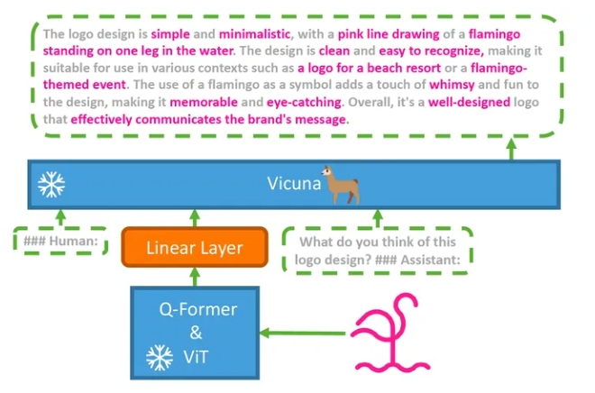

# MiniGPT-4 篇

> 论文名称：
> 
> 论文地址：
> 
> GitHub 地址：https://github.com/Vision-CAIR/MiniGPT-4

- [MiniGPT-4 篇](#minigpt-4-篇)
  - [一、为什么需要 MiniGPT-4?](#一为什么需要-minigpt-4)
  - [二、介绍一下 MiniGPT-4？](#二介绍一下-minigpt-4)
  - [三、介绍一下 MiniGPT-4 模型结构？](#三介绍一下-minigpt-4-模型结构)
  - [四、介绍一下 MiniGPT-4 模型 训练过程 ？](#四介绍一下-minigpt-4-模型-训练过程-)
  - [致谢](#致谢)

## 一、为什么需要 MiniGPT-4?

## 二、介绍一下 MiniGPT-4？

GPT-4 具有先进的多模态生成能力的主要原因在于利用了更先进的大型语言模型（LLM），因此提出**仅用一个投影层将一个冻结的视觉编码器和一个冻结的 LLM（Vicuna）对齐**。

## 三、介绍一下 MiniGPT-4 模型结构？

类似BLIP2，包括一个冻结的视觉编码器（ViT-G/14 + Q-Former）， 一个冻结的 LLM（Vicuna）， 一个投影层。

## 四、介绍一下 MiniGPT-4 模型 训练过程 ？

- 两阶段训练：
  - 第一阶段在大量对齐的图像文本对上对模型进行预训练，以获取基础的视觉语言知识。 
  - 在第二阶段，使用规模较小但更高质量的图文对数据集和精心设计的对话模板对预训练模型进行微调，以增强模型的生成可靠性和可用性。

## 致谢

- 多模态大模型 CLIP, MiniGPT-4, MiniGPT-42, MiniGPT-4, miniGPT4, InstructMiniGPT-4 系列解读 https://zhuanlan.zhihu.com/p/653902791
- 对比学习损失（InfoNCE loss）与交叉熵损失的联系，以及温度系数的作用  https://zhuanlan.zhihu.com/p/506544456