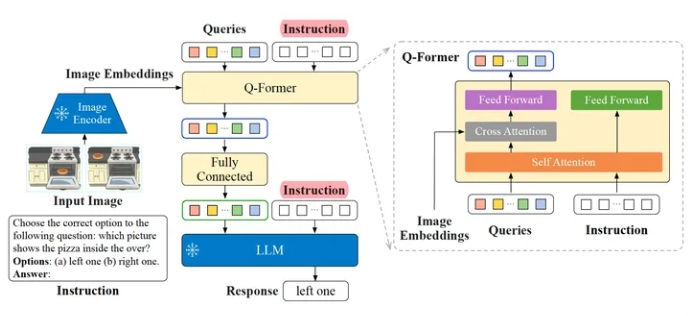
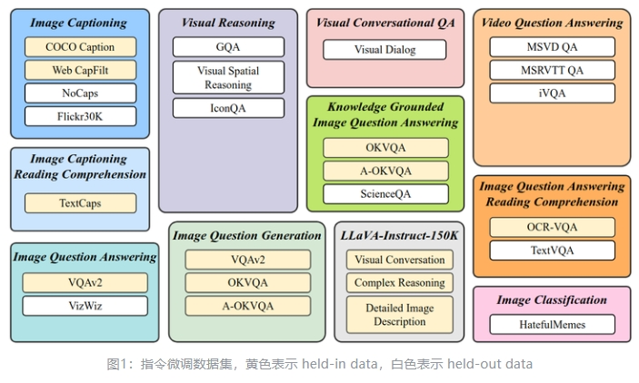
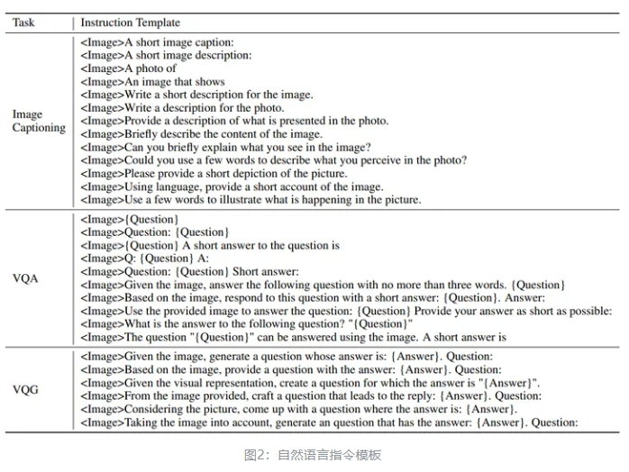

# InstructBLIP(Instruction Tuning)

> 论文名称：
> 
> 论文地址：https://arxiv.org/pdf/2305.06500.pdf
> 
> GitHub 地址：https://github.com/salesforce/LAVIS/tree/main/projects/instructblip

- [InstructBLIP(Instruction Tuning)](#instructblipinstruction-tuning)
  - [一、为什么需要 InstructBLIP?](#一为什么需要-instructblip)
  - [二、介绍一下 InstructBLIP？](#二介绍一下-instructblip)
  - [三、介绍一下 InstructBLIP 模型结构？](#三介绍一下-instructblip-模型结构)
  - [四、介绍一下 InstructBLIP 模型 训练过程 ？](#四介绍一下-instructblip-模型-训练过程-)
  - [五、介绍一下 InstructBLIP 模型 推理过程 ？](#五介绍一下-instructblip-模型-推理过程-)
  - [六、介绍一下 InstructBLIP 模型 数据构建过程 ？](#六介绍一下-instructblip-模型-数据构建过程-)
  - [致谢](#致谢)

## 一、为什么需要 InstructBLIP?

指令微调得到的 LLM 其实已经在多模态模型里面使用了，比如 BLIP-2 就曾经借助了指令微调训练得到的 LLM 完成很多多模态任务。但是以上都是 LLM 领域的指令微调，只被证明了在 NLP 领域的泛化性能不错，对于视觉-语言任务的泛化性还没有得到验证。

## 二、介绍一下 InstructBLIP？

基于 BLIP-2 提出指令微调的范式，借助额外的 instruction 提取更有用的视觉特征。

## 三、介绍一下 InstructBLIP 模型结构？

InstructBLIP 的架构和 BLIP-2 相似，从预训练好的 BLIP-2 模型初始化，由图像编码器、LLM 和 Q-Former 组成。

为了进行指令微调，**在BLIP-2的基础上把 instruction text tokens也作为输入同时给到Q-former和LLM**。其中可学习的K个queries 通过Q-former中共享的 self-attention 和输入指令交互，通过 cross-attention 和输入图片的特征交互，鼓励提取与任务相关的图像特征。

## 四、介绍一下 InstructBLIP 模型 训练过程 ？

- 训练：和BLIP-2一致，分两个阶段：
  - **第一个vision-language表示学习阶段**。将 Q-Former 连接到冻结的图像编码器image encoder，**目标是Q-Former学习与文本最相关的视觉表示**。
  - **第二个vision-to-language生成学习阶段**。将 Q-Former 连接到冻结的大语言模型LLM，将 Q-Former 的输出给到冻结的 LLM 来执行视觉到语言的生成学习，**目标是训练Q-Former使其输出的视觉表示对LLM可用**。

## 五、介绍一下 InstructBLIP 模型 推理过程 ？

分两种情况：

- 对于大部分描述性任务，如 image captioning，open-ended VQA 等，InstructBLIP 可以直接使用 LLM 生成的文本作为输出；
- 对于选择性任务，如 classification 和 multi-choice VQA ，参考vocabulary ranking method，将LLM生成的内容词汇限制为候选列表进行排序，计算每个候选的对数似然，选择最高值的一个作为最终预测。

## 六、介绍一下 InstructBLIP 模型 数据构建过程 ？

为了确保指令微调数据的多样性，作者收集了来自11种不同任务的26个数据集，并将它们转换为指令调优格式，如下图1所示。

对于每个任务，作者精心制作了10-15个自然语言指令模板，如下图2所示。这些模板阐明了任务并描述了目标。对于一些偏爱简短响应的数据集，作者刻意地在 instruction 中添加了 "short answer", "as short as possible" 字样来减小模型过拟合的风险，防止其始终生成很短的输出。

1. 采样策略

在训练期间，所有的 held-in 数据集的训练集混合，总数量太大且每个数据集的规模存在显着差异，均匀混合会导致模型过拟合较小的数据集，欠拟合较大的数据集。因此，文中提出根据数据集的大小的平方根或者其他正相关比例进行采样。

2. 指令模板

对于每个任务，人工制作了10-15个高质量的自然语言指令模板。对于一些偏爱简洁响应的数据集，在 instruction 中增加了 "short", "briefly" 来减小模型过拟合的风险，防止模型始终生成很短的输出。

## 致谢

- 多模态大模型 CLIP, InstructBLIP, InstructBLIP2, InstructBLIP, miniGPT4, InstructInstructBLIP 系列解读 https://zhuanlan.zhihu.com/p/653902791
- 对比学习损失（InfoNCE loss）与交叉熵损失的联系，以及温度系数的作用  https://zhuanlan.zhihu.com/p/506544456