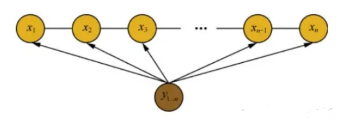
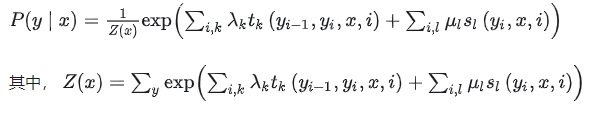
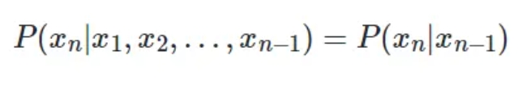
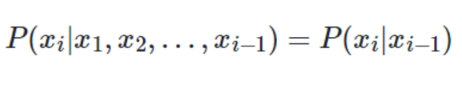
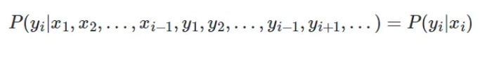

# 命名实体识别常见面试篇

- [命名实体识别常见面试篇](#命名实体识别常见面试篇)
  - [一、CRF 常见面试题](#一crf-常见面试题)
    - [1.1 什么是CRF？CRF的主要思想是什么？](#11-什么是crfcrf的主要思想是什么)
    - [1.2 CRF的三个基本问题是什么？](#12-crf的三个基本问题是什么)
    - [1.3 线性链条件随机场的参数化形式？](#13-线性链条件随机场的参数化形式)
    - [1.4 CRF的优缺点是什么？](#14-crf的优缺点是什么)
    - [1.5 HMM与CRF的区别？](#15-hmm与crf的区别)
    - [1.6 生成模型与判别模型的区别？](#16-生成模型与判别模型的区别)
  - [二、HMM 常见面试题](#二hmm-常见面试题)
    - [2.1 什么是马尔科夫过程？](#21-什么是马尔科夫过程)
    - [2.2 马尔科夫过程的核心思想是什么？](#22-马尔科夫过程的核心思想是什么)
    - [2.3 隐马尔可夫算法中的两个假设是什么？](#23-隐马尔可夫算法中的两个假设是什么)
    - [2.4 隐马尔可夫模型三个基本问题是什么？](#24-隐马尔可夫模型三个基本问题是什么)
    - [2.5 隐马尔可夫模型三个基本问题的联系？](#25-隐马尔可夫模型三个基本问题的联系)
    - [2.6 隐马尔可夫算法存在哪些问题？](#26-隐马尔可夫算法存在哪些问题)
  - [致谢](#致谢)

## 一、CRF 常见面试题

### 1.1 什么是CRF？CRF的主要思想是什么？

设 X 与 Y 是随机变量，P(Y|X) 是给定条件 X 的条件下 Y 的条件概率分布，若随机变量 Y 构成一个由无向图G=(V,E)表示的马尔科夫随机场。则称 条件概率分布P(X|Y)为条件随机场。

CRF 的 主要思想统计全局概率，在做归一化时，考虑了数据在全局的分布。

### 1.2 CRF的三个基本问题是什么？

- 定义：给定 观测序列 x 和 状态序列 y， 计算概率 P(y|x)
- 解决方法：前向计算、后向计算
- 学习计算问题
  - 定义：给定训练数据集估计条件随机场模型参数的问题，即条件随机场的学习问题。
    - 公式定义：利用极大似然的方法来定义目标函数
    - 解决方法：随机梯度法、牛顿法、拟牛顿法、迭代尺度法这些优化方法来求解得到参数。
    - 目标：解耦 模型定义，目标函数，优化方法
- 预测问题
  - 定义：给定条件随机场 P(Y|X) 和输入序列（观测序列） x ，求条件概率最大的输出序列（标记序列） y* ，即对观测序列进行标注。
  - 方法：维特比算法

### 1.3 线性链条件随机场的参数化形式？

在随机变量 X 取值为 x 的条件下，随机变量 Y 取值为 y 的条件概率如下：

- Z(x)：是规范化因子，求和是在所有可能得输出序列上进行的。
- t_{k}：是定义在边上的特征函数，称为转移特征，依赖于当前和前一个位置。
- s_{l}：是定义在结点上的特征函数，称为状态特征，依赖于当前位置。

### 1.4 CRF的优缺点是什么？

- 优点：
  - 为每个位置进行标注过程中可利用丰富的内部及上下文特征信息；
  - CRF模型在结合多种特征方面的存在优势；
  - 避免了标记偏置问题；
  - CRF的性能更好，对特征的融合能力更强；
- 缺点：
  - 训练模型的时间比ME更长，且获得的模型非常大。在一般的PC机上可能无法执行；
  - 特征的选择和优化是影响结果的关键因素。特征选择问题的好与坏，直接决定了系统性能的高低

### 1.5 HMM与CRF的区别？

共性：都常用来做序列标注的建模，像词性标注。

HMM是有向图，CRF是无向图。

HMM 只使用了局部特征（齐次马尔科夫假设和观测独立性假设），只能找到局部最优解；CRF使用了全局特征（在所有特征进行全局归一化），可以得到全局的最优值。

隐马尔可夫模型（HMM）是描述两个序列联合分布 P(I, O) 的概率模型；条件随机场模型（CRF）是给定观测状态O的条件下预测状态序列 I 的 P（I/O）的条件概率模型。

HMM是生成模型，CRF是判别模型。

CRF包含HMM，或者说HMM是CRF的一种特殊情况。

### 1.6 生成模型与判别模型的区别？

生成模型：学习得到联合概率分布P(x,y)，即特征x，共同出现的概率

常见的生成模型：朴素贝叶斯模型，混合高斯模型，HMM模型。

判别模型：学习得到条件概率分布P(y|x)，即在特征x出现的情况下标记y出现的概率。

常见的判别模型：感知机，决策树，逻辑回归，SVM，CRF等。

判别式模型：要确定一个羊是山羊还是绵羊，用判别式模型的方法是从历史数据中学习到模型，然后通过提取这只羊的特征来预测出这只羊是山羊的概率，是绵羊的概率。

生成式模型：是根据山羊的特征首先学习出一个山羊的模型，然后根据绵羊的特征学习出一个绵羊的模型，然后从这只羊中提取特征，放到山羊模型中看概率是多少，再放到绵羊模型中看概率是多少，哪个大就是哪个。

## 二、HMM 常见面试题

### 2.1 什么是马尔科夫过程？

假设一个随机过程中，t_n 时刻的状态 x_n 的条件发布，只与其前一状态x_(n-1) 相关，即：

则将其称为 马尔可夫过程。

### 2.2 马尔科夫过程的核心思想是什么？

对于马尔可夫过程的思想，用一句话去概括：当前时刻状态仅与上一时刻状态相关，与其他时刻不相关。

可以从 马尔可夫过程图去理解，由于每个状态间是以有向直线连接，也就是当前时刻状态仅与上一时刻状态相关。

### 2.3 隐马尔可夫算法中的两个假设是什么？

齐次马尔可夫性假设：即假设隐藏的马尔科夫链在任意时刻 t 的状态只依赖于其前一时刻的状态，与其他时刻的状态及观测无关，也与时刻 t 无关；

观测独立性假设：即假设任意时刻的观测只依赖于该时刻的马尔科夫链的状态，与其他观测及状态无关。

### 2.4 隐马尔可夫模型三个基本问题是什么？

- （1）概率计算问题：给定模型(A,B,\pi)和观测序列，计算在模型下观测序列出现的概率。(直接计算法理论可行，但计算复杂度太大（O(N^2T)）；用前向与后向计算法)
- （2）学习问题：已知观测序列，估计模型参数，使得在该模型下观测序列概率最大。（极大似然估计的方法来估计参数，Baum-Welch算法（EM算法））
- （3）预测问题，也称为解码问题：已知模型和观测序列，求对给定观测序列条件概率最大的状态序列。（维特比算法，动态规划，核心：边计算边删掉不可能是答案的路径，在最后剩下的路径中挑选最优路径）

### 2.5 隐马尔可夫模型三个基本问题的联系？

三个基本问题 存在 渐进关系。首先，要学会用前向算法和后向算法算观测序列出现的概率，然后用Baum-Welch算法求参数的时候，某些步骤是需要用到前向算法和后向算法的，计算得到参数后，我们就可以用来做预测了。因此可以看到，三个基本问题，它们是渐进的，解决NLP问题，应用HMM模型做解码任务应该是最终的目的。

### 2.6 隐马尔可夫算法存在哪些问题？

因为HMM模型其实它简化了很多问题，做了某些很强的假设，如齐次马尔可夫性假设和观测独立性假设，做了假设的好处是，简化求解的难度，坏处是对真实情况的建模能力变弱了。

在序列标注问题中，隐状态（标注）不仅和单个观测状态相关，还和观察序列的长度、上下文等信息相关。例如词性标注问题中，一个词被标注为动词还是名词，不仅与它本身以及它前一个词的标注有关，还依赖于上下文中的其他词。可以使用最大熵马尔科夫模型进行优化。

## 致谢

- NLP方向CRF算法面试题6道|含解析 https://zhuanlan.zhihu.com/p/606284564
- NLP方向HMM算法面试题6道|含解析 https://zhuanlan.zhihu.com/p/598584093
