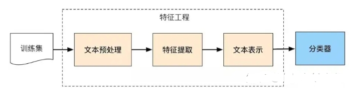
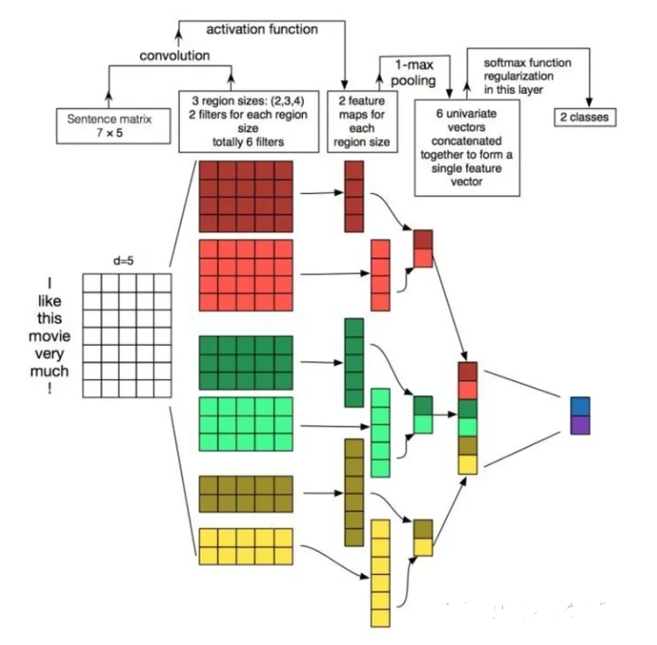
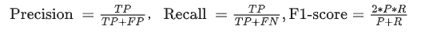

# 文本分类常见面试篇

- [文本分类常见面试篇](#文本分类常见面试篇)
  - [一、文本分类任务有哪些应用场景？](#一文本分类任务有哪些应用场景)
  - [二、文本分类的具体流程？](#二文本分类的具体流程)
  - [三、fastText的分类过程？fastText的优点？](#三fasttext的分类过程fasttext的优点)
  - [四、TextCNN进行文本分类的过程?](#四textcnn进行文本分类的过程)
  - [五、TextCNN可以调整哪些参数？](#五textcnn可以调整哪些参数)
  - [六、文本分类任务使用的评估指标有哪些？](#六文本分类任务使用的评估指标有哪些)
  - [致谢](#致谢)

## 一、文本分类任务有哪些应用场景？

文本分类时机器学习汇总常见的监督学习任务质疑，常见的应用场景如情感分类、新闻分类、主题分类、问答匹配、意图识别、推断等等。分类任务根据具体的数据集的标签情况，还可以分为二分类、多分类、多标签分类等。

## 二、文本分类的具体流程？

文本分类的流程一般包括文本预处理、特征提取、文本表示、最后分类输出。

文本处理通常需要做分词及去除停用词等操作，常会使用一些分词工具，如hanlp、jieba、哈工大LTP、北大pkuseg等。

## 三、fastText的分类过程？fastText的优点？

fastText首先把输入转化为词向量，取平均，再经过线性分类器得到类别。输入的词向量可以是预先训练好的，也可以随机初始化，跟着分类任务一起训练。

fastText是一个快速文本分类算法，与基于神经网络的分类算法相比有两大优点： 1、fastText在保持高精度的情况下加快了训练速度和测试速度 2、fastText不需要预训练好的词向量，fastText会自己训练词向量 3、fastText两个重要的优化：使用层级 Softmax提升效率、采用了char-level的n-gram作为附加特征。

## 四、TextCNN进行文本分类的过程?

卷积神经网络的核心思想是捕捉局部特征，对于文本来说，局部特征就是由若干单词组成的滑动窗口，类似于N-gram。卷积神经网络的优势在于能够自动地对N-gram特征进行组合和筛选，获得不同抽象层次的语义信息。因此文本分类任务中可以利用CNN来提取句子中类似 n-gram 的关键信息。

第一层为输入层。将最左边的7乘5的句子矩阵，每行是词向量，维度=5，这个可以类比为图像中的原始像素点了。

图中的输入层实际采用了双通道的形式，即有两个 n × k

的输入矩阵，其中一个用预训练好的词嵌入表达，并且在训练过程中不再发生变化；另外一个也由同样的方式初始化，但是会作为参数，随着网络的训练过程发生改变。

第二层为卷积层。然后经过有 filter_size=(2,3,4) 的一维卷积层，每个filter_size 有两个输出 channel。第三层是一个1-max pooling层，这样不同长度句子经过pooling层之后都能变成定长的表示了。

最后接一层全连接的 softmax 层，输出每个类别的概率。

每个词向量可以是预先在其他语料库中训练好的，也可以作为未知的参数由网络训练得到。

## 五、TextCNN可以调整哪些参数？

- 输入词向量表征：词向量表征的选取(如选word2vec还是GloVe)
- 卷积核大小：一个合理的值范围在1~10。若语料中的句子较长，可以考虑使用更大的卷积核。另外，可以在寻找到了最佳的单个filter的大小后，尝试在该filter的尺寸值附近寻找其他合适值来进行组合。实践证明这样的组合效果往往比单个最佳filter表现更出色
- feature map 特征图个数：主要考虑的是当增加特征图个数时，训练时间也会加长，因此需要权衡好。这个参数会影响最终特征的维度，维度太大的话训练速度就会变慢。这里在100-600之间调参即可。当特征图数量增加到将性能降低时，可以加强正则化效果，如将dropout率提高过0.5
- 激活函数：ReLU和tanh
- 池化策略：1-max pooling表现最佳，复杂任务选择k-max
- 正则化项(dropout/L2)：指对CNN参数的正则化，可以使用dropout或L2，但能起的作用很小，可以试下小的dropout率(<0.5)，L2限制大一点

## 六、文本分类任务使用的评估指标有哪些？

准确率、召回率、ROC，AUC，F1、混淆矩阵

## 致谢

- NLP方向文本分类常见面试题6道|含解析 https://zhuanlan.zhihu.com/p/608766091