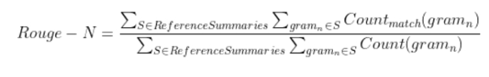
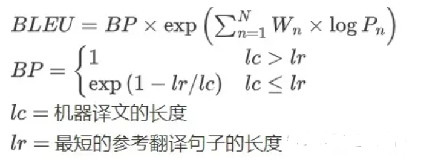

# 文本摘要常见面试篇

- [文本摘要常见面试篇](#文本摘要常见面试篇)
  - [一、抽取式摘要和生成式摘要存在哪些问题？](#一抽取式摘要和生成式摘要存在哪些问题)
  - [二、Pointer-generator network解决了什么问题？](#二pointer-generator-network解决了什么问题)
  - [三、文本摘要有哪些应用场景？](#三文本摘要有哪些应用场景)
  - [四、几种ROUGE指标之间的区别是什么？](#四几种rouge指标之间的区别是什么)
  - [五、BLEU和ROUGE有什么不同？](#五bleu和rouge有什么不同)
  - [致谢](#致谢)

## 一、抽取式摘要和生成式摘要存在哪些问题？

抽取式摘要在语法、句法上有一定的保证，但是也面临了一定的问题，例如：内容选择错误、连贯性差、灵活性差等问题。

生成式摘要优点是相比于抽取式而言用词更加灵活，因为所产生的词可能从未在原文中出现过。但存在以下问题：

1. OOV问题。源文档语料中的词的数量级通常会很大,但是经常使用的词数量则相对比较固定。因此通常会根据词的频率过滤掉一些词做成词表。这样的做法会导致生成摘要时会遇到UNK的词。
2. 摘要的可读性。通常使用贪心算法或者beam search方法来做decoding。这些方法生成的句子有时候会存在不通顺的问题。
3. 摘要的重复性。这个问题出现的频次很高。与2的原因类似，由于一些decoding的方法的自身缺陷，导致模型会在某一段连续timesteps生成重复的词。
4. 长文本摘要生成难度大。对于机器翻译来说，NLG的输入和输出的语素长度大致都在一个量级上，因此NLG在其之上的效果较好。但是对摘要来说，源文本的长度与目标文本的长度通常相差很大，此时就需要encoder很好的将文档的信息总结归纳并传递给decoder，decoder需要完全理解并生成句子。

## 二、Pointer-generator network解决了什么问题？

指针生成网络从两方面针对seq-to-seq模型在生成式文本摘要中的应用做了改进。

第一，使用指针生成器网络可以通过指向从源文本中复制单词(解决OOV的问题)，这有助于准确复制信息，同时保留generater的生成能力。PGN可以看作是抽取式和生成式摘要之间的平衡。通过一个门来选择产生的单词是来自于词汇表，还是来自输入序列复制。

第二，使用coverage跟踪摘要的内容，不断更新注意力，从而阻止文本不断重复(解决重复性问题)。利用注意力分布区追踪目前应该被覆盖的单词，当网络再次注意同一部分的时候予以惩罚。

## 三、文本摘要有哪些应用场景？

文本摘要技术有许多应用场景。例如，在新闻报道领域，可以使用文本摘要技术快速生成新闻摘要，使读者可以快速了解新闻内容；在市场调查领域，可以使用文本摘要技术对大量用户反馈进行快速分析，提取出关键信息，从而更好地了解市场需求；在医学领域，可以使用文本摘要技术从海量医学文献中快速找到相关研究成果，以帮助医生更好地做出诊疗决策。

## 四、几种ROUGE指标之间的区别是什么？

ROUGE是将待审摘要和参考摘要的n元组共现统计量作为评价依据。

ROUGE-N = 每个n-gram在参考摘要和系统摘要中同现的最大次数之和 / 参考摘要中每个n-gram出现的次数之和

ROUGE-L计算最长公共子序列的匹配率，L是LCS（longest common subsequence）的首字母。如果两个句子包含的最长公共子序列越长，说明两个句子越相似。

Rouge-W是Rouge-L的改进版，使用了加权最长公共子序列(Weighted Longest Common Subsequence)，连续最长公共子序列会拥有更大的权重。

## 五、BLEU和ROUGE有什么不同？

BLEU 是 2002 年提出的，而 ROUGE 是 2003 年提出的。

BLEU的计算主要基于精确率，ROUGE的计算主要基于召回率。

ROUGE 用作机器翻译评价指标的初衷是这样的：在 SMT（统计机器翻译）时代，机器翻译效果稀烂，需要同时评价翻译的准确度和流畅度；等到 NMT （神经网络机器翻译）出来以后，神经网络脑补能力极强，翻译出的结果都是通顺的，但是有时候容易瞎翻译。

ROUGE的出现很大程度上是为了解决NMT的漏翻问题（低召回率）。所以 ROUGE 只适合评价 NMT，而不适用于 SMT，因为它不管候选译文流不流畅。

- BLEU 需要计算译文 1-gram，2-gram，...，N-gram 的精确率，一般 N 设置为 4 即可，公式中的 Pn 指 n-gram 的精确率。
- Wn 指 n-gram 的权重，一般设为均匀权重，即对于任意 n 都有 Wn = 1/N。
- BP 是惩罚因子，如果译文的长度小于最短的参考译文，则 BP 小于 1。
- BLEU 的 1-gram 精确率表示译文忠于原文的程度，而其他 n-gram 表示翻译的流畅程度。

## 致谢

- NLP方向文本摘要常见面试题5道|含解析 https://zhuanlan.zhihu.com/p/610178057

