# 大模型推理加速——KV Cache篇

- [大模型推理加速——KV Cache篇](#大模型推理加速kv-cache篇)
  - [一、介绍一下 KV Cache是啥？](#一介绍一下-kv-cache是啥)
  - [二、为什么要进行 KV Cache？](#二为什么要进行-kv-cache)
    - [2.1 不使用 KV Cache 场景](#21-不使用-kv-cache-场景)
    - [2.2 使用 KV Cache 场景](#22-使用-kv-cache-场景)
  - [三、说一下 KV Cache 在 大模型中的应用？](#三说一下-kv-cache-在-大模型中的应用)
    - [3.1 KV Cache 在 Llama 推理流程中应用？](#31-kv-cache-在-llama-推理流程中应用)
  - [四、 KV Cache 优点？](#四-kv-cache-优点)
  - [五、 KV Cache 缺点？](#五-kv-cache-缺点)
  - [六、 KV Cache 优化策略？](#六-kv-cache-优化策略)
    - [6.1 PageAttention显存优化](#61-pageattention显存优化)
    - [6.2 MHA、GQA、MQA优化技术](#62-mhagqamqa优化技术)
    - [6.3 FlashAttention优化技术](#63-flashattention优化技术)
  - [七、GPT模型单次inference输入生成下一个token，为什么会产生kv-cache？](#七gpt模型单次inference输入生成下一个token为什么会产生kv-cache)
  - [八、为什么kv cache会造成显存很大？](#八为什么kv-cache会造成显存很大)
  - [九、为什么LLM推理加速有KV Cache而没有Q Cache？](#九为什么llm推理加速有kv-cache而没有q-cache)
  - [致谢](#致谢)

## 一、介绍一下 KV Cache是啥？

kv cache中的k和v指的分别是attention机制中的key和value的状态值，kv cache只出现在transformer结构的自回归的decoder中，像bert就没有kv cache。**kv cache的存在是为了避免scaled dot-product attention过程中的重复计算**。

该技术可以在不影响任何计算精度的前提下，**通过空间换时间思想，提高推理性能**。

## 二、为什么要进行 KV Cache？

### 2.1 不使用 KV Cache 场景

给定“天气”，模型会逐个预测剩下的字，假设接下来预测的两个字为”真好“。

> 注意：下面的示例图只给出了和 KV Cache 相关的细节。

1. 第一步会预测”真“

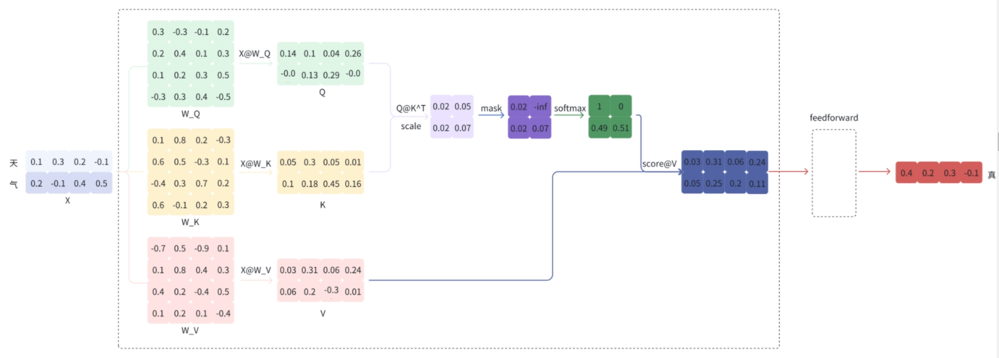

下面是上图计算流程的代码实现：

```s
import torch
import torch.nn.functional as F

X = torch.tensor(
    [[0.1, 0.3, 0.2, -0.1],
     [0.2, -0.1, 0.4, 0.5]]
)
W_Q = torch.tensor(
    [[0.3, -0.3, -0.1, 0.2],
     [0.2, 0.4, 0.1, 0.3],
     [0.1, 0.2, 0.3, 0.5],
     [-0.3, 0.3, 0.4, -0.5]]
)
W_K = torch.tensor(
    [[0.1, 0.8, 0.2, -0.3],
     [0.6, 0.5, -0.3, 0.1],
     [-0.4, 0.3, 0.7, 0.2],
     [0.6, -0.1, 0.2, 0.3]]
)
W_V = torch.tensor(
    [[-0.7, 0.5, -0.9, 0.1],
     [0.1, 0.8, 0.4, 0.3],
     [0.4, 0.2, -0.4, 0.5],
     [0.1, 0.2, 0.1, -0.4]]
)
Q = torch.matmul(X, W_Q)
K = torch.matmul(X, W_K)
V = torch.matmul(X, W_V)
scores = torch.matmul(Q, K.T) / 2
scores += torch.tensor(
    [[0, float('-inf')],
     [0, 0],
])
scores = F.softmax(scores, dim=-1)
output = torch.matmul(scores, V)
```

output 再经过 feedforward 等步骤最终得到预测的 token ”真“；

2. 第二步会将”真“拼接到”天气“的后面，即新的输入为”天气真“，再预测”好“

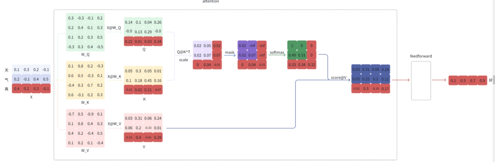

下面是上图计算流程的代码实现：

```s
X = torch.tensor(
    [[0.1, 0.3, 0.2, -0.1],
     [0.2, -0.1, 0.4, 0.5],
     [0.4, 0.2, 0.3, -0.1]]
)
Q = torch.matmul(X, W_Q)
K = torch.matmul(X, W_K)
V = torch.matmul(X, W_V)
scores = torch.matmul(Q, K.T) / 2
scores += torch.tensor(
    [[0, float('-inf'), float('-inf')],
     [0, 0, float('-inf')],
     [0, 0, 0]
])
scores = F.softmax(scores, dim=-1)
output = torch.matmul(scores, V)
```

同样的，output 再经过 feedforward 等步骤最终得到预测的 token ”好“；

### 2.2 使用 KV Cache 场景

观察上面的计算过程，可以看到，在第二步的预测中，”好“的预测只和”真“以及完整的 K, V 有关。

于是，KV Cache 的想法就很直观了，**缓存上一轮的 K, V，即可达到减少计算，提速的效果**。从第二步开始时，只需输入当前位置的 token，得到当前位置对应的 K_cur, V_cur，再拼接上一步缓存的 K_last, V_last 得到完整的 K, V，即可完成下一个 token 的预测。下图是在上图的基础上只保留和预测”好“相关的数据：

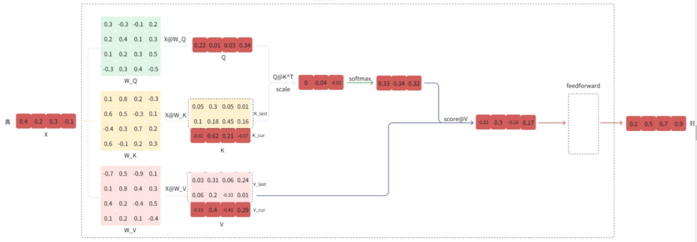

**即当前轮输出token与输入tokens拼接，并作为下一轮的输入tokens，反复多次。可以看出第 i+1 轮输入数据只比第 i 轮输入数据新增了一个token，其他全部相同！**

因此第 i+1 轮推理时必然包含了第 i 轮的部分计算。KV Cache的出发点就在这里，**缓存当前轮可重复利用的计算结果，下一轮计算时直接读取缓存结果**，就是这么简单，不存在什么Cache miss问题。

## 三、说一下 KV Cache 在 大模型中的应用？

### 3.1 KV Cache 在 Llama 推理流程中应用？

> 代码来自 https://github.com/facebookresearch/llama

LLaMA 类是对模型和 tokenizer 的封装，只实现了 generate 方法，这个方法主要接受 prompt 列表。

```s
class LLaMA:
    def __init__(self, model: Transformer, tokenizer: Tokenizer):
        self.model = model
        self.tokenizer = tokenizer

    def generate(
        self,
        prompts: List[str],
        max_gen_len: int,
        temperature: float = 0.8,
        top_p: float = 0.95,
    ) -> List[str]:
        pass

```

下面是一个调用 LLaMA generate 方法的示例：

```s
prompts = [
    "天气",
    "你好",
]
generator = LLaMA(model, tokenizer)
results = generator.generate(prompts)
```

对应的 generate 方法的具体实现：

```s
class LLaMA:
    def generate(
        self,
        prompts: List[str],
        max_gen_len: int,
        temperature: float = 0.8,
        top_p: float = 0.95,
    ) -> List[str]:
        bsz = len(prompts)
        params = self.model.params
        assert bsz <= params.max_batch_size, (bsz, params.max_batch_size)

        # step 1：将 prompt 处理（tokenizer.encode）成 prompt_tokens
        prompt_tokens = [self.tokenizer.encode(x, bos=True, eos=False) for x in prompts]
        min_prompt_size = min([len(t) for t in prompt_tokens])
        max_prompt_size = max([len(t) for t in prompt_tokens])
        total_len = min(params.max_seq_len, max_gen_len + max_prompt_size)

        # step 2：构造一个大小为 (bsz, total_len) 且初始值为 tokenizer.pad_id 的张量 tokens
        tokens = torch.full((bsz, total_len), self.tokenizer.pad_id).cuda().long()

        # step 3：将 prompt_tokens 赋值给对应位置的 tokens
        for k, t in enumerate(prompt_tokens):
            tokens[k, : len(t)] = torch.tensor(t).long()

        # step 4：循环预测下一个 token：只有第一次预测时会将前面所有的 token（例如”天气“）输入给模型，从第二次预测开始只将当前的 token（例如”真“）输入给模型
        input_text_mask = tokens != self.tokenizer.pad_id
        start_pos = min_prompt_size
        prev_pos = 0
        for cur_pos in range(start_pos, total_len):
            # 调用 模型 forward 函数
            logits = self.model.forward(tokens[:, prev_pos:cur_pos], prev_pos)
            if temperature > 0:
                probs = torch.softmax(logits / temperature, dim=-1)
                next_token = sample_top_p(probs, top_p)
            else:
                next_token = torch.argmax(logits, dim=-1)
            next_token = next_token.reshape(-1)
            # only replace token if prompt has already been generated
            next_token = torch.where(
                input_text_mask[:, cur_pos], tokens[:, cur_pos], next_token
            )
            tokens[:, cur_pos] = next_token
            prev_pos = cur_pos

        # step 5：预测结束后，将 token 转成（tokenizer.decode）字符串
        decoded = []
        for i, t in enumerate(tokens.tolist()):
            # cut to max gen len
            t = t[: len(prompt_tokens[i]) + max_gen_len]
            # cut to eos tok if any
            try:
                t = t[: t.index(self.tokenizer.eos_id)]
            except ValueError:
                pass
            decoded.append(self.tokenizer.decode(t))
        return decoded
```

下面介绍 模型的 forward 函数：

```s
class Transformer(nn.Module):

    @torch.inference_mode()
    def forward(self, tokens: torch.Tensor, start_pos: int):
        _bsz, seqlen = tokens.shape
        h = self.tok_embeddings(tokens)
        self.freqs_cis = self.freqs_cis.to(h.device)
        freqs_cis = self.freqs_cis[start_pos : start_pos + seqlen]

        mask = None
        # step 1：对 seqlen 进行判断，只有第一次预测下一个 token 时才会初始化 mask（输入的长度大于 1），因为第二次开始每次只会输入当前位置的 token
        if seqlen > 1:
            mask = torch.full((1, 1, seqlen, seqlen), float("-inf"), device=tokens.device)
            mask = torch.triu(mask, diagonal=start_pos + 1).type_as(h)

        for layer in self.layers:
            h = layer(h, start_pos, freqs_cis, mask)
        h = self.norm(h)
        output = self.output(h[:, -1, :])  # only compute last logits
        return output.float()
```

之所以可以只输入当前位置的 token 就可以预测下一个 token，是因为缓存了 K, V。

具体实现可以看一下 Attention 类：

```s
class Attention(nn.Module):
    def __init__(self, args: ModelArgs):
        # 此处省略了和 KV cache 无关的初始化代码
        self.cache_k = torch.zeros(
            (args.max_batch_size, args.max_seq_len, self.n_local_heads, self.head_dim)
        ).cuda()
        self.cache_v = torch.zeros(
            (args.max_batch_size, args.max_seq_len, self.n_local_heads, self.head_dim)
        ).cuda()

    def forward(self, x: torch.Tensor, start_pos: int, freqs_cis: torch.Tensor, mask: Optional[torch.Tensor]):
        bsz, seqlen, _ = x.shape
        # step 1：计算当前位置 token 对应的 xq, xk, xv
        xq, xk, xv = self.wq(x), self.wk(x), self.wv(x)

        xq = xq.view(bsz, seqlen, self.n_local_heads, self.head_dim)
        xk = xk.view(bsz, seqlen, self.n_local_heads, self.head_dim)
        xv = xv.view(bsz, seqlen, self.n_local_heads, self.head_dim)

        xq, xk = apply_rotary_emb(xq, xk, freqs_cis=freqs_cis)

        # step 2：将 xk, xv 缓存到对应的 cache_k, chache_v 中
        self.cache_k = self.cache_k.to(xq)
        self.cache_v = self.cache_v.to(xq)

        self.cache_k[:bsz, start_pos : start_pos + seqlen] = xk
        self.cache_v[:bsz, start_pos : start_pos + seqlen] = xv

        keys = self.cache_k[:bsz, : start_pos + seqlen]
        values = self.cache_v[:bsz, : start_pos + seqlen]

        # step 3：使用 xk 与前面所有的 k 计算 score，再与 v 进行计算
        xq = xq.transpose(1, 2)
        keys = keys.transpose(1, 2)
        values = values.transpose(1, 2)
        scores = torch.matmul(xq, keys.transpose(2, 3)) / math.sqrt(self.head_dim)
        if mask is not None:
            scores = scores + mask  # (bs, n_local_heads, slen, cache_len + slen)
        scores = F.softmax(scores.float(), dim=-1).type_as(xq)
        output = torch.matmul(scores, values)  # (bs, n_local_heads, slen, head_dim)
        output = output.transpose(
            1, 2
        ).contiguous().view(bsz, seqlen, -1)

        return self.wo(output)
```

## 四、 KV Cache 优点？

避免每次采样token时重新计算键值向量，利用预先计算好的k值和v值，可以节省大量计算时间

## 五、 KV Cache 缺点？

占用一定的存储空间

## 六、 KV Cache 优化策略？

尽可能的减少推理过程中kv键值对的重复计算，实现kv cache的优化。目前减少KV cache的手段有许多，比如page attention、MQA、MGA等，另外flash attention可以通过硬件内存使用的优化，提升推理性能。

### 6.1 PageAttention显存优化

- 动机：在缓存中，这些 KV cache 都很大，并且大小是动态变化的，难以预测。已有的系统中，**由于显存碎片和过度预留，浪费了60%-80%的显存**。
- 解决方法：作为 VLLM 核心技术，PageAttention 通过对 显存碎片化问题进行处理，以达到减少显存占用，提高 KV cache 可使用的显存空间，提升推理性能。
- 优化策略：

1. PageAttention 借助OS系统中虚拟内存和分页的思想。可以实现在不连续的空间存储连续的kv键值。

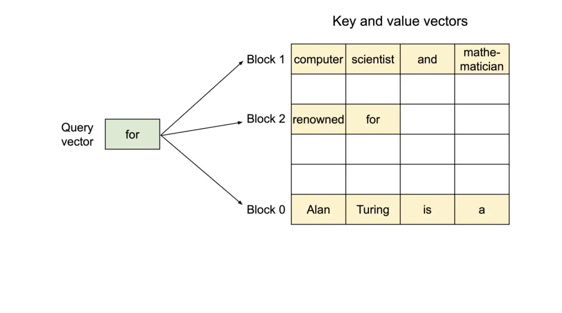

2. 因为所有键值都是分布存储的，需要通过分页管理彼此的关系。序列的连续逻辑块通过 block table 映射到非连续物理块。

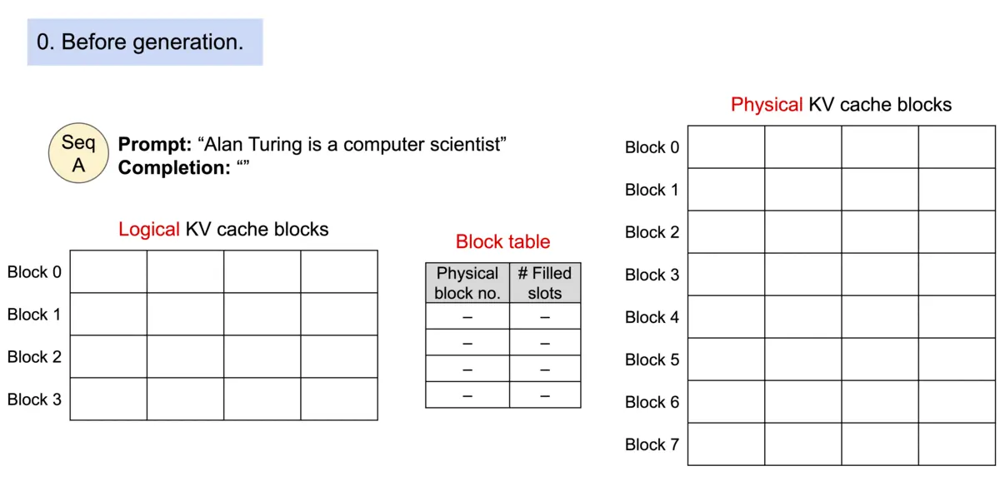

3. 同一个prompt生成多个输出序列，可以共享计算过程中的attention键值，实现copy-on-write机制，即只有需要修改的时候才会复制，从而大大降低显存占用。

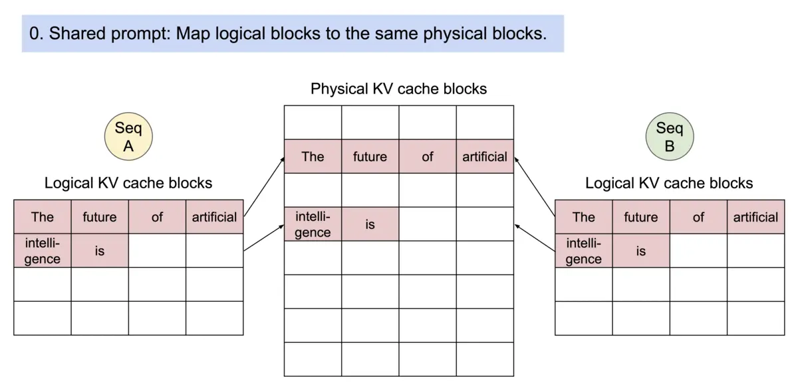

### 6.2 MHA、GQA、MQA优化技术

- MHA（Multi-head Attention）是标准的多头注意力机制，h个Query、Key 和 Value 矩阵。
- MQA 让所有的头之间共享同一份 Key 和 Value 矩阵，每个头只单独保留了一份 Query 参数，从而大大减少 Key 和 Value 矩阵的参数量。
- GQA将查询头分成N组，每个组共享一个Key 和 Value 矩阵

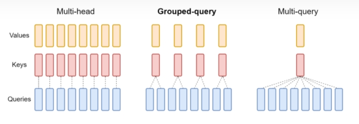

GQA以及MQA都可以实现一定程度的Key value的共享，从而可以使模型体积减小，GQA是MQA和MHA的折中方案。

这两种技术的加速原理是

- （1）减少了数据的读取
- （2）减少了推理过程中的KV Cache。

需要注意的是GQA和MQA需要在模型训练的时候开启，按照相应的模式生成模型。

### 6.3 FlashAttention优化技术

Flash attention推理加速技术是**利用GPU硬件非均匀的存储器层次结构实现内存节省和推理加速**，意思是通过合理的应用GPU显存实现IO的优化，从而提升资源利用率，提高性能。

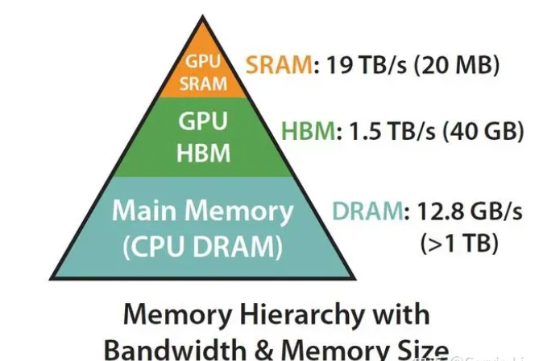

计算速度越快的硬件往往越昂贵且体积越小，Flash attention的核心原理是尽可能地合理应用SRAM内存计算资源。

A100 GPU有40-80GB的高带宽内存(HBM)，带宽为1.5-2.0 TB/s，而每108个流处理器有192KB的SRAM，带宽估计在19TB/s左右。也就是说，存在一种优化方案是利用SRAM远快于HBM的性能优势，将密集计算尽放在SRAM，减少与HBM的反复通信，实现整体的IO效率最大化。比如可以将矩阵计算过程，softmax函数尽可能在SRAM中处理并保留中间结果，全部计算完成后再写回HBM，这样就可以减少HBM的写入写出频次，从而提升整体的计算性能。如何有效分割矩阵的计算过程，涉及到flash attention的核心计算逻辑Tiling算法。

## 七、GPT模型单次inference输入生成下一个token，为什么会产生kv-cache？

因为GPT 每次inference 只能生成一个token，所以要输出一句话，会进行多次inference，知道遇到终止token。这样每次计算输出的token的概率分布时，都需要把之间生成的token重新计算key和value。第 i + 1次输入的token只比第i次输入token多一个新的token，因此第 i + 1 轮推理就包含了第 i 次推理的很多计算。对于第i次推理，只需要再计算对应的 $k_{i+1}$ 和 $v_{i + 1}$ 即可，所以可以把之前的k和v缓存下来，不需要每次都计算之前的k和v，所以就有了kv cache。这是一种空间换时间的方法。

## 八、为什么kv cache会造成显存很大？

因为随着推理输出的序列变长，需要缓存的kv cache 也越多。以GPT3为例，GPT3模型占用显存大小为350GB。假设批次大小 b=64 ，输入序列长度 s=512 ，输出序列长度 n=32 ，则KV cache占用显存为 164GB ，大约是模型参数显存的0.5倍。

## 九、为什么LLM推理加速有KV Cache而没有Q Cache？

简单来说，LLM在decoding阶段的每次推理只会用到当前的Q，这次用的Q下次不会用到，所以不用Cache Q；

但是每次都要用到当前和过去所有的KV，这次用到的KV下次马上就要再用一次，所以Cache KV可以加速推理。

下面说明原因：

观察Attention公式，这个K和Q怎么看都很对称，为什么只Cache K而不Cache Q？

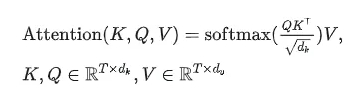

把KQV写成分块的形式，像这样：

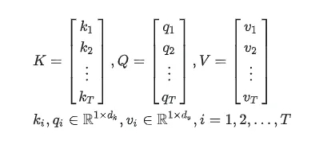

然后Q和K转置的矩阵乘就变成了这样：

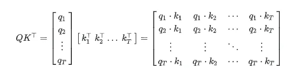

直到这一步，K和Q看上去都很对称。轮换一下K和Q对结果没有本质影响。

V的引入破坏了这一对称性。忽略 𝑑𝑘 系数，第i行的softmax简写成 𝑆𝑖 ，attention操作的结果变成了这样：

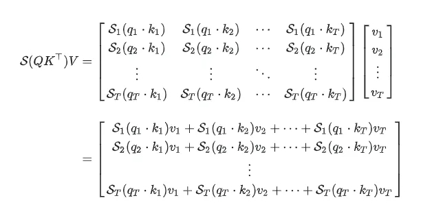

这是没有Causal Mask（因果掩码）的情况。加入Causal Mask会变成这样：

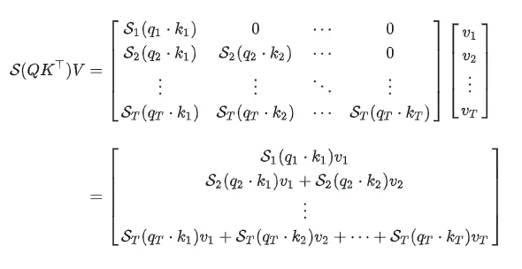

可以写一下结果的通项，没有Causal Mask：

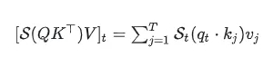

有Causal Mask：

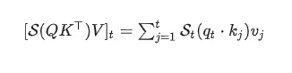

无论有没有Causal Mask，Q和K在结果中都是不对称的。

在序列的t位置，Q只有当前位置的 𝑞𝑡q_t 参与了计算，而K和V多个位置参与了计算，所以需要KV Cache，而不需要Q Cache。

在没有Causal Mask时，计算t位置的Attention需要未来的KV，这在实际进行自回归推理时无法得到；加上Causal Mask之后，只需要1,2,…,t位置的KV就可以进行推理。

## 致谢

- Transformer推理性能优化技术很重要的一个就是K V cache，能否通俗分析，可以结合代码? https://www.zhihu.com/question/596900067
- 为什么LLM推理加速有KV Cache而没有Q Cache？  https://mp.weixin.qq.com/s/N5YiDZfbtg2xiwO5nMsjUw