# KV-Cache 面试参考题篇

- [KV-Cache 面试参考题篇](#kv-cache-面试参考题篇)
  - [一、为什么文本生成如此缓慢?](#一为什么文本生成如此缓慢)
  - [二、如何解决文本生成缓慢问题？](#二如何解决文本生成缓慢问题)
  - [三、什么是键值缓存？](#三什么是键值缓存)
  - [四、KV缓存如何加速？](#四kv缓存如何加速)
  - [五、KV缓存能够降低多少计算成本？](#五kv缓存能够降低多少计算成本)
  - [六、KV缓存 存在什么问题？](#六kv缓存-存在什么问题)
  - [七、如何改善传统的KV缓存？](#七如何改善传统的kv缓存)
    - [7.1 Token 选择和修剪方法（Token Selection and Pruning Approaches）](#71-token-选择和修剪方法token-selection-and-pruning-approaches)
      - [7.1.1 Heavy-Hitter Oracle (H2O)](#711-heavy-hitter-oracle-h2o)
      - [7.1.2 StreamLLM](#712-streamllm)
      - [7.1.3 Value-Aware Token Pruning (VATP)](#713-value-aware-token-pruning-vatp)
    - [7.2 后处理压缩技术（Post-hoc Compression Techniques）](#72-后处理压缩技术post-hoc-compression-techniques)
      - [7.2.1 Adaptive KV Compression (FastGen)](#721-adaptive-kv-compression-fastgen)
      - [7.2.2 动态内存压缩（DMC）](#722-动态内存压缩dmc)
      - [7.2.3 $L\_2$ 范数基础的压缩](#723-l_2-范数基础的压缩)
    - [7.3 体系结构重设计](#73-体系结构重设计)
      - [7.3.1 多查询注意力（MQA）](#731-多查询注意力mqa)
      - [7.3.2 分组查询注意力（GQA）](#732-分组查询注意力gqa)
      - [7.3.3 多头潜在注意力（MLA）](#733-多头潜在注意力mla)
      - [7.3.4 SnapKV](#734-snapkv)
      - [7.3.5 只缓存一次（YOCO）](#735-只缓存一次yoco)
  - [致谢](#致谢)

## 一、为什么文本生成如此缓慢?

要回答这个问题，首先需要介绍 **自注意力的基本构建块**：

- **自注意力的基本构建块**

现代语言模型的核心是一种称为自注意力的机制。对于一个由 n 个标记（大致对应单词）组成的序列，每个标记都需要“查看”或“关注”所有其他标记以理解上下文。

这种查看一切的过程的计算成本随着序列长度的增长而增长：

- 对于 n 个标记，每个标记都需要查看所有 n 个标记;
- 这意味着成本与 $n*n = n^2$成正比;
- 用数学符号表示，我们将其写为 $O(n^2)$ 的复杂度

**真正的问题：一次生成一个标记**

当语言模型生成文本时，它一次生成一个标记，这就是事情变得计算密集的地方：

1. 第一个标记：查看1个标记（成本：$O(1^2)$）
2. 第二个标记：查看2个标记（成本：$O(2^2)$）
3. 第三个标记：查看3个标记（成本：$O(3^2)$）
4. 以此类推，直到第 n 个标记：查看 n 个标记（成本：$O(n^2)$）

如果我们将生成长度为 n 的序列的所有这些成本加起来，我们得到：

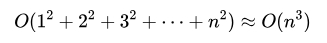

这种 $O(n^3)$ 的成本意味着随着文本的增长，生成时间会极其迅速地增长。例如，生成两倍长的序列大约需要八倍的时间！显然，我们需要一个更好的方法。

## 二、如何解决文本生成缓慢问题？

我们正在做大量冗余工作。在生成每个新标记时，我们会重新计算之前已经处理过的所有先前标记。那如果我们能将之前的 标记结果 记录下来，那是不是就可以减少该计算量？

这个正是 本文要介绍的解决方案 —— **键值（KV）缓存**

## 三、什么是键值缓存？

可以将 KV 缓存想象成一个智能记事本，我们会在第一次看到每个 token 时记下有关它的重要信息。对于每个 token，我们计算并存储两件事：

- **键（k**）：可以将其视为一种寻址机制——它有助于确定此标记与未来标记的相关性
- **值（v）**：可以将其视为当此标记被发现相关时实际使用的信息

从数学上，我们计算这些为：

- 键：$k=xW_K$（其中是 x 标记，$W_K$ 是一个学习到的变换）
- 值：$n=xW_V$（其中 $W_V$ 是另一个学习到的变换）

在生成一个新标记时，我们使用它的查询（计算方式类似于键）通过将其与所有存储的键进行比较来在我们的缓存中找到相关信息。然后使用匹配的值来帮助生成标记。

## 四、KV缓存如何加速？

有了KV缓存，处理过程变得更加高效：

1. 当我们遇到一个新token时，只需要计算它的key和value一次
2. 对于所有后续的token，我们可以直接从缓存中查找这些预计算的值
3. 这意味着每个新token只需要做少量新的计算，而不是重新做所有之前的计算

## 五、KV缓存能够降低多少计算成本？

KV缓存 需要更多的内存来存储所有的keys和values。对于一个具有：

- L 层
- H 注意力头
- 序列长度 n
- key/value维度 $d_k$，总的内存开销为 $L*H*n*d_k*2$ 值（这个2是因为需要存储keys和values）。这会随着序列长度 n 线性增长 $O(n)$，但对于大模型来说，常数因子可能非常大。

但作为回报，我们将计算成本从 $O(n^3)$ 降低到 $O(n^2)$。

要理解为什么是 $O(n^2)$ ，让我们看一下每一步的成本：

1. 第一步：处理一个token -> 成本 $O(1)$
2. 第二步：处理一个新token + 查找1个缓存的token -> 成本 $O(2)$
3. 第三步：处理一个新token + 查找2个缓存的token -> 成本 $O(3)$
4. 依此类推...

将这些加起来：

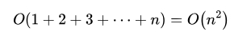

这相比 $O(n^3)$ 是一个显著的改进！虽然我们仍然需要做查看所有前面的tokens的基础工作 $O(n^2)$，但我们避免了每一步都进行昂贵的重新计算。

## 六、KV缓存 存在什么问题？

**虽然KV缓存是一个强大的优化手段，但它伴随着显著的内存开销**。

让我们通过一个具体的例子来看看，使用像Llama3 70B这样的现代大语言模型：

- L=80 层
- H=64 注意力头
- B=8 批量大小为8个序列
- $d_k = 128$ key/value维度
- 16位精度

处理一个批量（8个序列，每个序列1000个token）所需的内存为：

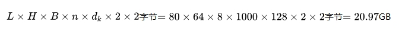

这种巨大的内存使用带来了几个挑战：

1. 随着序列长度线性增长
2. 与批量大小成倍增长，支持并行处理
3. 限制了我们可以处理的最大上下文长度
4. 限制了在内存受限设备上的部署

## 七、如何改善传统的KV缓存？

以下论文代表了KV缓存优化的关键创新。我们将通过三大主要方法来探索它们：**token选择**、**后处理压缩技术**和**架构重设计**。

### 7.1 Token 选择和修剪方法（Token Selection and Pruning Approaches）

#### 7.1.1 Heavy-Hitter Oracle (H2O)

> 论文：https://arxiv.org/abs/2306.14048

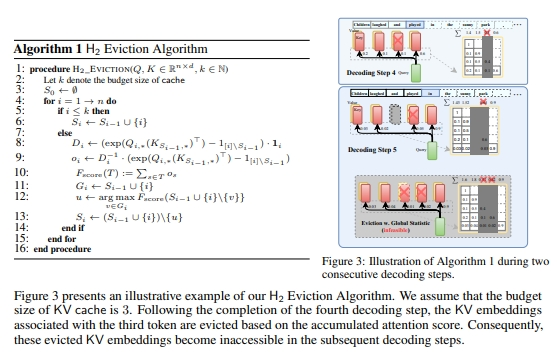

H2O 引入了在KV缓存中识别和保留重要token的概念：

- **重型Token（Heavy-Hitter Tokens）**：H2O 识别在生成过程中具有最高累计注意力分数的token，这些token遵循幂律分布。这些token对于模型的功能至关重要，因此在缓存中优先处理。
- **动态次模撤销（Dynamic Submodular Eviction）**：该方法将缓存管理问题框架化为一个优化问题，目标函数为次模函数 $F(S)$ ，用于量化token集合 S 的重要性：

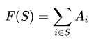

其中 $A_i$ 是token i 的累计注意力分数。缓存 $S_i$ 通过以下方式更新：

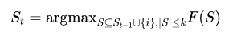

确保每次最多只移除一个token。这个贪心算法在计算上高效，并在次模约束下保证接近最优的性能。

- 结果：通过该方法，KV缓存大小减少了5倍，几乎没有精度损失，并且吞吐量提升了高达29倍。

#### 7.1.2 StreamLLM

> 论文：https://arxiv.org/abs/2309.17453

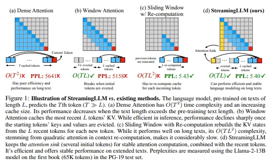

- 作者观察到注意力汇聚（Attention Sinks）现象：解码过程中，初始token充当自然的注意力锚点。
- 如果没有这些注意力汇聚的token，传统窗口注意力方法的性能会下降。
- 基于这一观察，他们引入了滚动缓存（Rolling Cache），它保留了初始token，并处理最近的上下文，从而实现了无限长度序列的处理。
- 他们还展示了这些汇聚token可以通过训练获得，作为专用的注意力锚点，从而减少对多个初始token的依赖。

#### 7.1.3 Value-Aware Token Pruning (VATP)

> 论文：https://arxiv.org/abs/2406.12335

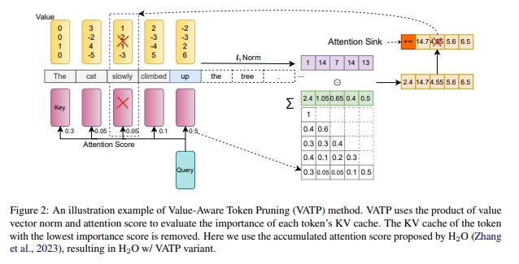

VATP 扩展了 H2O 的 token 重要性概念，考虑了注意力模式和价值向量的属性：

- **重要性评分**：结合了注意力分数和价值向量的信息：

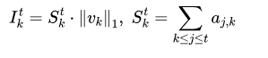

其中 $S^t_k$ 是累计注意力分数，$||v_k||_1$是价值向量的 L1 范数。

- **Token修剪**：根据排名token，最低分数的token被修剪，而注意力汇聚token（例如，开始或换行token）被保留，以防止性能下降。

性能与效率：

- 在16个 LongBench 任务中，VATP 在12-14个任务中超越了 H2O 和 Scissorhands 等基准。
- 在保持最小性能损失的情况下，实现了50%的有效压缩。
- 引入的计算开销几乎可以忽略不计，并且与 Scissorhands 集成时兼容 FlashAttention。

### 7.2 后处理压缩技术（Post-hoc Compression Techniques）

这些方法压缩或优化KV缓存，同时保持标准的Transformer架构。

#### 7.2.1 Adaptive KV Compression (FastGen)

> 论文: https://arxiv.org/pdf/2310.01801

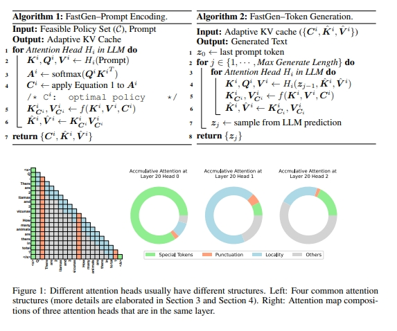

FastGen 通过观察运行时的注意力模式引入了自适应压缩：

- **注意力分析**：在提示编码过程中，FastGen 识别注意力模式，并选择压缩策略 C*，以最小化内存开销，同时保留注意力恢复：

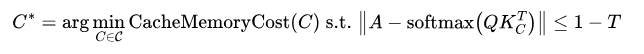

- **自适应压缩策略**：

压缩策略包括：

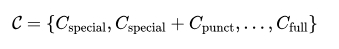

1. **特殊 token**( $C_{special}$ )：仅保留特殊 token。
2. **局部性**($C_{local}$)：逐出超过相对距离的 token。
3. **频率**($C_{frequent}$)：保留具有高累计注意力分数的 token ($r_f$)。
4. **混合策略** 结合这些策略，首先采用 $C_{special}$，并根据每个头的需要适应性地应用:

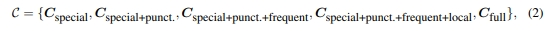

- **Token 生成**：

在解码过程中，预先选择的压缩策略有效地管理 KV 缓存：

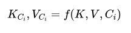

#### 7.2.2 动态内存压缩（DMC）

> 论文：https://arxiv.org/pdf/2403.09636

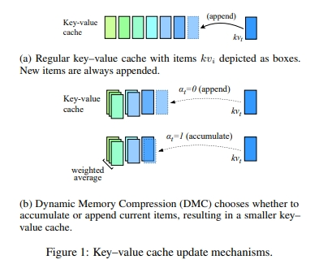

DMC 引入了自适应的 token 合并：

- 决策机制：在时刻 t，预测合并决策 $α_t$ 和权重 $ω_t$：

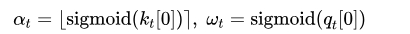

- 加权合并：当时 $α_t =1$，合并当前和先前的条目：

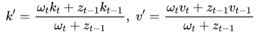

其中 $z_t = z_{t-1}+ω_t$ 累积重要性权重。

- 训练：

使用 Gumbel-Sigmoid 放松来训练 $α_t$ ，支持端到端的梯度下降训练：

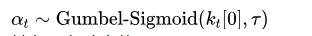

其中 τ 是温度参数。

优化组合目标：

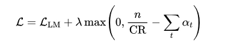

其中 $L_{LM}$ 是语言建模损失，第二项鼓励模型匹配目标压缩比（CR）。

- 结果：达到 8 倍的压缩率，保持性能。

#### 7.2.3 $L_2$ 范数基础的压缩

> 论文：https://arxiv.org/pdf/2406.11430

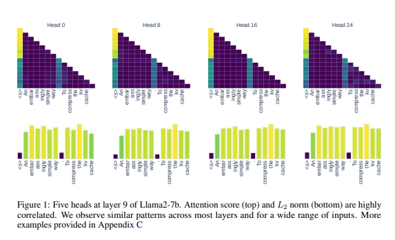

本文提出了一个令人惊讶的观察：缓存 KV 对的范数 $L_2$ 与注意力分数之间存在明确的相关性，低 $L_2$ 范数的键嵌入通常会导致解码时的高注意力分数。因此，提出了一个简单但有效的压缩目标：

- **基于范数的选择**：对于一组缓存键 $K={k_1,k_2,...,k_n}$，计算并排序键的范数：

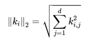

- **排序和选择**：为了压缩 KV 缓存，按 $L_2$ 范数值对所有键进行排序：

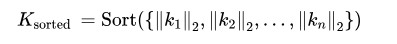

保留范数最小的前 m 个键，其中 $m=[c·n]$，c 为压缩比。

- **压缩缓存**：压缩后的键值缓存为：

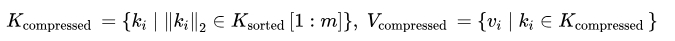

- 由于其简洁性，该方法与 FlashAttention 保持兼容。

### 7.3 体系结构重设计

这些方法改变了 Transformer 架构，以更高效地处理 KV 缓存，通常将压缩直接集成到架构中。

#### 7.3.1 多查询注意力（MQA）

- 论文：https://arxiv.org/pdf/1911.02150

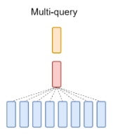

- 核心思想：MQA 通过共享单个键值头跨所有查询头来减少 KV 缓存大小，替代传统的多头注意力（MHA）：

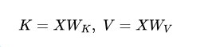

其中 K 和 V 是共享的键和值投影。

- 优点：将 KV 缓存大小减少了 H（注意力头的数量），显著降低了内存带宽开销。
- 权衡：虽然 MQA 更快，但在需要多样化注意力模式的任务中，通常会遭遇质量下降。

#### 7.3.2 分组查询注意力（GQA）

- 论文：https://arxiv.org/abs/2305.13245

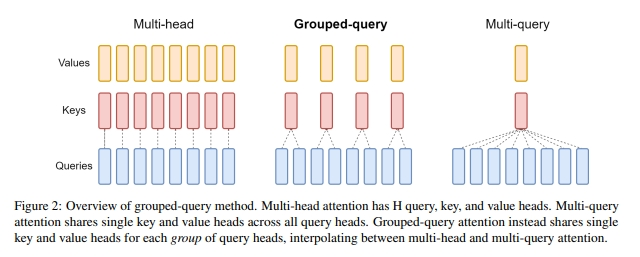

- 核心思想：GQA 在完全多头注意力和 MQA 之间进行插值，提供了推理速度和模型质量之间的可扩展权衡。它将查询头分为 G 组，每组共享一个单独的键值头：

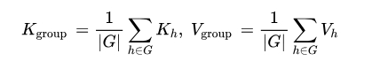

- **GQA-1**：等价于 MQA (G=1)。
- **GQA-H**：等价于 MHA (G=H)。
- 训练：通过微调将 GQA 引入现有的预训练模型：

1. 首先，将 MHA 权重通过均值池化转换为 GQA。
2. 然后进行微调（“上训练”）以适应新的注意力模式。

- 该适应过程仅需原始预训练计算的 5%，使其非常高效。
- 结果模型保持质量，同时获得 GQA 的内存优势。

#### 7.3.3 多头潜在注意力（MLA）

- 论文：https://arxiv.org/abs/2405.04434

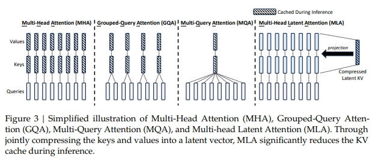

DeepSeek的多头潜在注意力（MLA）采用了一种新颖的方法来减少KV缓存开销。虽然MQA和GQA通过头共享来实现这一目标，MLA则采用低秩潜在压缩技术，在保持多头注意力的优点的同时，减少了KV缓存的大小。

- MLA通过将键（keys）和值（values）压缩成低维度的潜在向量，来减少KV缓存的大小。
- 它将键值嵌入（key-value embeddings）降投到一个压缩的潜在空间：

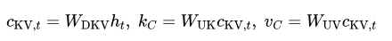

其中，$W_{DKV}$是降投矩阵，$W_{UK}$、$W_{UV}$是键和值的上投矩阵。

- 通过压缩表示，MLA保持了每个头的灵活性，不同于MQA的完全头共享。
- 它引入了旋转位置嵌入（RoPE）来解耦位置感知的键：

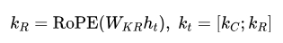

这进一步减少了KV缓存的存储，仅缓存压缩的潜在向量和位置键。

#### 7.3.4 SnapKV

- 论文：https://arxiv.org/pdf/2404.14469

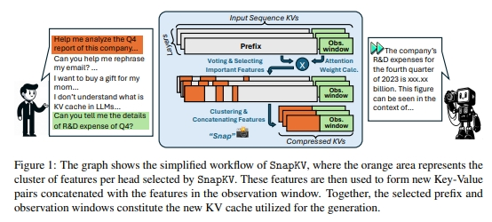

- SnapKV引入了观察窗口（Observation Window）：使用提示结束的tokens来识别注意力模式：

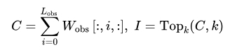

其中，$W_{obs}$ 表示注意力权重，k 由压缩率决定。

- 压缩：使用池化层围绕选定位置聚类特征，以保持上下文完整性。

#### 7.3.5 只缓存一次（YOCO）

- 论文：https://arxiv.org/pdf/2405.05254

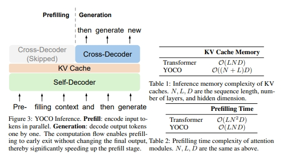

YOCO修改了Transformer架构以优化缓存：

- 全局缓存：使用解码器-解码器设计，只有一个共享的KV缓存。
- 复杂度减少：将内存从 $O(N*L)$ 减少到 $O(N+L)$，其中 N 是序列长度，L 是层数。
- 高效注意力：自解码器采用滑动窗口注意力或门控保留机制，使内存使用保持恒定（$O(C)$，其中 C 是小窗口大小）。

## 致谢

- DeepSeek的多头潜在注意力（MLA）和及其11种KV-Cache技巧演进大总结  https://mp.weixin.qq.com/s/7j9sVIlJQDPnji9bas09ig
