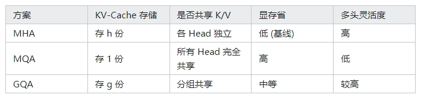

# 从多头共享到潜变量：MLA在低秩投影与按需解压中重新定义 KV-Cache 存储

- [从多头共享到潜变量：MLA在低秩投影与按需解压中重新定义 KV-Cache 存储](#从多头共享到潜变量mla在低秩投影与按需解压中重新定义-kv-cache-存储)
  - [前言](#前言)
  - [一、为什么要减少 KV-Cache？](#一为什么要减少-kv-cache)
    - [1.1 长序列推理中显存的“隐形杀手”](#11-长序列推理中显存的隐形杀手)
    - [1.2 显存与带宽的双重约束](#12-显存与带宽的双重约束)
  - [二、多头注意力（MHA）篇](#二多头注意力mha篇)
    - [2.1 介绍一下 经典注意力公式？](#21-介绍一下-经典注意力公式)
    - [2.2 介绍一下 经典注意力所带来的 显存压力？](#22-介绍一下-经典注意力所带来的-显存压力)
  - [三、MQA 篇：极端共享 K/V](#三mqa-篇极端共享-kv)
    - [3.1 介绍一下 MQA ？](#31-介绍一下-mqa-)
  - [四、GQA 篇：分组共享](#四gqa-篇分组共享)
    - [4.1 介绍一下 GQA ？](#41-介绍一下-gqa-)
  - [五、对比：MHA / MQA / GQA](#五对比mha--mqa--gqa)
  - [六、MLA 的核心：低秩投影与按需还原（不含 RoPE）](#六mla-的核心低秩投影与按需还原不含-rope)
    - [6.1 基本思路：改“存多头 K/V”为“存低维潜变量”](#61-基本思路改存多头-kv为存低维潜变量)
    - [6.2 动态解压：显存怎么省？](#62-动态解压显存怎么省)
    - [6.3 低秩投影如何大幅压缩存储？](#63-低秩投影如何大幅压缩存储)
  - [七、从智能相册系统看 MLA 的“低秩缩略图”运作](#七从智能相册系统看-mla-的低秩缩略图运作)
    - [7.1 拍照存储：低秩投影](#71-拍照存储低秩投影)
    - [7.2 浏览照片：实时动态解压](#72-浏览照片实时动态解压)
    - [7.3 动态解压的数学对应：按需还原](#73-动态解压的数学对应按需还原)
  - [八、RoPE 的挑战：为何要再加“位置贴纸”？](#八rope-的挑战为何要再加位置贴纸)
    - [8.1 RoPE：拍摄时间与 GPS 坐标](#81-rope拍摄时间与-gps-坐标)
    - [8.2 分治策略： $\\boldsymbol{c}\_i$ + RoPE 小维度](#82-分治策略-boldsymbolc_i--rope-小维度)
  - [九、MLA 的综合优势：存储革命、灵活查询、时空保真](#九mla-的综合优势存储革命灵活查询时空保真)
  - [十、工程视角：落地 MLA 时需注意的要点](#十工程视角落地-mla-时需注意的要点)
    - [10.1 显存 VS. 推理速度](#101-显存-vs-推理速度)
    - [10.2 RoPE 维度调参](#102-rope-维度调参)
    - [10.3 数值误差与精度](#103-数值误差与精度)
  - [十一、整体总结与展望](#十一整体总结与展望)
  - [十二、一个最小化 MLA 实现](#十二一个最小化-mla-实现)
  - [附录：核心公式与对应场景](#附录核心公式与对应场景)
  - [致谢](#致谢)

## 前言

在大语言模型繁荣的时代，硬件资源依然是绕不过去的“天花板”——特别是 GPU 显存有限，如何在有限资源下让模型拥有更长的上下文、更快的推理速度，一直是工程与研究领域关注的焦点。除了常见的量化、剪枝，越来越多人也将目光投向 “**减少推理时 KV-Cache 占用**” 这个方向。

本文将先回顾 MHA（Multi-Head Attention）、MQA（Multi-Query Attention）与 GQA（Grouped-Query Attention）在共享或减少 K/V 方面的思考与取舍，然后聚焦于最新的 MLA（Multi-Head Latent Attention）。不同于前者仅在“共享 K/V”层面做文章，MLA 通过低秩投影与按需解压的组合，让 KV-Cache 不再直接存储多头 K/V，而是改为 “潜变量” 形式；在此基础上，它还能进一步使用“合并矩阵”的技巧，在推理阶段仅依赖极少的显存来完成注意力计算。

需要说明的是，MLA 在实际落地时往往还需兼容 RoPE（Rotary Position Embedding）这一位置编码方案；但为了让读者先理解 MLA 的核心（低秩投影本身），我们会在 介绍完 MLA 的主干思路 后，再探讨 RoPE 与 MLA 的结合方式。希望这样的安排能使你感受到 MLA 设计背后的层次与巧思。

## 一、为什么要减少 KV-Cache？

### 1.1 长序列推理中显存的“隐形杀手”

自回归 Transformer 每生成一个新 Token，都需要回顾之前所有 Token 的 Key / Value ( K, V ) 做注意力；这部分历史 K/V 在推理阶段被缓存下来，即所谓 KV-Cache。如果序列长度为 L 、注意力头数为 h ，单头维度为 $d_k$ 或 $d_v$ ，则 KV-Cache 的量级约为 $L \times h \times (d_k + d_v)$, 并随 L 线性增长。当上下文长度轻松达到数千到上万时，KV-Cache 成为显存占用的主要瓶颈，比模型本身的激活值更为庞大。

### 1.2 显存与带宽的双重约束

当序列过长，“一张卡”往往无法容纳全部 KV-Cache，需要多卡或多机分担。但跨卡和跨机的带宽远低于卡内带宽，导致推理速度显著变慢。简而言之，如果能在单卡或少卡上实现更长的上下文，就能节省通信开销，提升推理吞吐量。这也是近年在 MQA / GQA 以及 MLA 等思路上不断迭代的根源。

## 二、多头注意力（MHA）篇

### 2.1 介绍一下 经典注意力公式？

在 Transformer 中，一段序列 $\boldsymbol{x}_1,\dots,\boldsymbol{x}_l$ 会映射到多组 (Q, K, V) 来计算注意力。以第 s 个注意力头为例，令隐藏维度为 d ： $\boldsymbol{q}_i^{(s)} = \boldsymbol{x}_i \,\boldsymbol{W}_q^{(s)},\quad \boldsymbol{k}_i^{(s)} = \boldsymbol{x}_i \,\boldsymbol{W}_k^{(s)},\quad \boldsymbol{v}_i^{(s)} = \boldsymbol{x}_i \,\boldsymbol{W}_v^{(s)}$. 此时若进行自回归计算，第 t 步的注意力分数往往写作 $\alpha_{t,i}^{(s)} = \boldsymbol{q}_t^{(s)} \,\boldsymbol{k}_i^{(s)\top}, \quad\text{其中 } i \le t$. 在推理时，为加速计算，我们把已经算出的 $\boldsymbol{k}_i^{(s)},\boldsymbol{v}_i^{(s)}$ 暂存于显存里，供后续 Token 使用，这部分显存缓存就称为 KV-Cache。

### 2.2 介绍一下 经典注意力所带来的 显存压力？

由于 MHA 中每个 Head 都独立存储 K、V，若 Head 数 h 较大，就得存下 h 份相同长度的 Key/Value，显存消耗惊人。

为此，研究者开始思考：**是不是能让多头注意力在 K/V 层面也做一些共享、合并或压缩**？

## 三、MQA 篇：极端共享 K/V 

### 3.1 介绍一下 MQA ？

MQA（Multi-Query Attention）在 2019 年提出，核心是让所有 Head 只用一套 K/V： 

$$\boldsymbol{k}_i = \boldsymbol{x}_i \boldsymbol{W}_k,\quad \boldsymbol{v}_i = \boldsymbol{x}_i \boldsymbol{W}_v$$

而各 Head 仍可有不同 $\boldsymbol{q}_i^{(s)}$ 。这样，KV-Cache 只需存 1 份 K/V，显存占用是原来的 $\tfrac{1}{h}$ 。

在 PaLM、StarCoder 等模型中有使用。不过由于 K、V 过度共享，有些任务上的精度可能下降，需要额外训练技巧弥补。

## 四、GQA 篇：分组共享

### 4.1 介绍一下 GQA ？

如果觉得 MQA 太极端，可以用 GQA（Grouped-Query Attention）折中：把 h 个 Head 划分为 g 组，同一组内共享 K/V；这样 KV-Cache 缩减到原先的 g/h ，保留一定多样性。LLaMA2-70B、ChatGLM2/3 等是这一路线的代表。

## 五、对比：MHA / MQA / GQA



无论是 MQA 还是 GQA，都还处在“是否共享 K/V”这个思路。MLA 则从根本上改变“推理时存什么”：它将大多数 K/V 信息转移到一个潜变量里，并在需要时才“还原”出来。下面让我们首先看看没有 RoPE 干扰时，MLA 如何实现低秩投影与按需解压。

## 六、MLA 的核心：低秩投影与按需还原（不含 RoPE）

### 6.1 基本思路：改“存多头 K/V”为“存低维潜变量”

MLA（Multi-Head Latent Attention）里，训练阶段依然会对 $\boldsymbol{x}_i$ 做投影，得到各个 Head 的 Key、Value。但它引入一个低秩潜变量 $\boldsymbol{c}_i$ ，在推理时只需要缓存这个维度远小于 d 的向量，就能借助一套“矩阵合并”来临时得到多头的 K、V。

如果只考虑不带位置编码（RoPE）的核心公式，MLA 的训练过程可以描述为： $\boldsymbol{c}_i = \boldsymbol{x}_i \boldsymbol{W}_c\quad (\text{低秩投影, } \boldsymbol{W}_c \in \mathbb{R}^{d \times d_c})$, 并且对每个 Head s ，定义解压矩阵 $\boldsymbol{W}{kc}^{(s)}$, $\boldsymbol{W}_v^{(s)} $，使得 $\boldsymbol{k}_i^{(s)} = \boldsymbol{c}_i \boldsymbol{W}_{kc}^{(s)}$, $\quad\boldsymbol{v}_i^{(s)} = \boldsymbol{c}_i \boldsymbol{W}_v^{(s)}$. 这样一来，若 Head 数再多，也只是训练时会显式生成多份 K/V；但在推理时，我们不必缓存所有 $\boldsymbol{k}_i^{(s)}$, $\boldsymbol{v}_i^{(s)}$ ，而只要保留潜变量 $\boldsymbol{c}_i$ 。需要计算时，通过合并矩阵乘法就能“还原”出各头的 K、V。由此可见，MLA 很大程度上摆脱了“多头数 h 与 KV-Cache 成正比”这件事。

### 6.2 动态解压：显存怎么省？

推理中，每当生成第 t 个 Token，需要与历史 i < t 的 Key 做点积 $\boldsymbol{q}_t^{(s)} \boldsymbol{k}_i^{(s)\top} $ 。传统方法下要在显存中直接拿 $\boldsymbol{k}_i^{(s)}$ ，但在 MLA 里我们“合并”了 $\boldsymbol{k}_i^{(s)}=\boldsymbol{c}_i\,\boldsymbol{W}_{kc}^{(s)}\implies\boldsymbol{q}_t^{(s)} \boldsymbol{k}_i^{(s)\top}=(\boldsymbol{x}_t \boldsymbol{W}_q^{(s)}) (\boldsymbol{c}_i \boldsymbol{W}_{kc}^{(s)})^\top$. 根据矩阵乘法的结合律，可以将 $\boldsymbol{W}_q^{(s)} \boldsymbol{W}_{kc}^{(s)\top}$ 合并到 $\boldsymbol{W}_{\mathrm{merged}}^{(s)}$ 中，从而只需要在显存中保留 $\boldsymbol{c}_i$ ，而无需分别保存 $\boldsymbol{k}_i^{(s)}$ 。

显然，如果 $\boldsymbol{c}_i \in \mathbb{R}^{d_c}$ 且 $d_c \ll h \times d_k$ ，那么KV-Cache 的占用就从原先按 $h \times d_k$ 线性增长，变成按 $d_c$ 成本增长。

### 6.3 低秩投影如何大幅压缩存储？

有些读者可能会好奇，这种低秩投影压缩率有多大？取一个示例，如果原模型维度 d=4096 、多头数 h=32 、单头 d_k=128 ；那么传统 MHA 每个 Token 要存下 $32 \times 128 = 4096$ 维 Key（加上 Value 也是同量级），而 MLA 可以把潜变量 $\boldsymbol{c}_i$ 设成 512 维，显存需求就从 4096 缩减到 512，几乎减少 8 倍。在某些更极端场景，压缩比例可高达几十甚至数百倍。

当然，这只是一个不带位置编码的美好设想。实际上，Transformer 常用的 RoPE（Rotary Position Embedding）会影响 K、Q 的投影方式，使单纯“潜变量 + 合并矩阵”无法简单替代。为了让读者先理解 MLA 的低秩核心，我们暂不展开 RoPE；接下来会从一个“相册系统”的比喻帮助你理清 MLA 的运作流程，然后再单独讨论 RoPE 问题。

## 七、从智能相册系统看 MLA 的“低秩缩略图”运作

在说完 MLA 的数学公式后，或许你对“潜变量 \boldsymbol{c}_i + 投影矩阵”仍然停留在抽象层面。下面让我们用一个生活化的类比：把“Token”比做“拍摄的照片”，把“多头注意力”比做“给照片套滤镜”，而把“KV Cache”看作“相册存储空间”，展示 MLA 如何在这个体系里实现“压缩存储”与“动态解压”。

### 7.1 拍照存储：低秩投影

想象每次拍照（即处理一个 Token $\boldsymbol{x}_i$ ），我们并不把它保存为“多头滤镜后的完整分辨率原图”，而是只保留一个“体积小但保留关键信息”的智能缩略图（潜变量 \boldsymbol{c}_i ）。类似地，若原始图像分辨率是 4096，对应 MLA 里 d=4096 ，缩略图可能只有 512，这会带来约 1/8 甚至更高的压缩比例。
在数学上，这就是 $\boldsymbol{c}_i =\boldsymbol{x}_i \,\boldsymbol{W}_c, \quad \boldsymbol{W}_c \in \mathbb{R}^{4096 \times 512}$, 扮演了“拍照时做一次低秩投影”的作用。

### 7.2 浏览照片：实时动态解压

当我们要“浏览”某张照片，并试图把它变成“某种滤镜版本”时，可以理解为要计算特定的 Key/Value（比如复古滤镜、HDR 滤镜，对应不同 Head 的 K、V）。在 MLA 中，这个过程相当于 $\boldsymbol{k}_i^{(s)} = \boldsymbol{c}_i \,\boldsymbol{W}_{kc}^{(s)}, \quad \boldsymbol{v}_i^{(s)} = \boldsymbol{c}_i \,\boldsymbol{W}_v^{(s)}$, 也就是把缩略图 $\boldsymbol{c}_i$ 投影到你想要的滤镜。因此，哪怕有十几种滤镜（多头），我们也不必重复存十几份滤镜版原图，而是只存一张缩略图（ $\boldsymbol{c}_i$ ），在“浏览”时按需解压。这样，就达成了“相册容量极度压缩”的目标。

### 7.3 动态解压的数学对应：按需还原

在实际推理中，“合并矩阵”的过程就像“把滤镜的计算提前或合并到查看行为”中，用公式来说： 

$\boldsymbol{q}_t^{(s)} \boldsymbol{k}_i^{(s)\top} = \bigl(\boldsymbol{x}_t \boldsymbol{W}_q^{(s)}\bigr) \bigl(\boldsymbol{c}_i \boldsymbol{W}_{kc}^{(s)}\bigr)^\top \approx \boldsymbol{x}_t \,\boldsymbol{W}_{\mathrm{merged}}^{(s)}\,\boldsymbol{c}_i^\top$. 

换句话说，滤镜参数 $\boldsymbol{W}_{kc}^{(s)}$ 不再需要静态保存在相册中，而是只在查看时临时计算。最终，我们的显存里只保留这个“压缩向量” $\boldsymbol{c}_i$ ，由此大幅度减少存储成本。

通过这个相册类比，你会发现 MLA 本质上避免了对每个注意力头都存一整份 Key/Value，而是将 K/V 的大部分信息浓缩到一个低秩潜变量里，让“滤镜”（多头投影矩阵）在推理时即时生效。

## 八、RoPE 的挑战：为何要再加“位置贴纸”？

到这里，MLA 的低秩投影与按需解压思路已相对清晰。不过，在真实的 Transformer 应用中，常见的 RoPE（Rotary Position Embedding）会为 Key、Query 添加一个位置相关的旋转矩阵 $\boldsymbol{\mathcal{R}}_i$ ，以便实现相对位置的建模。但这会打破前文的“把所有头的 K 都只存潜变量”做法。简单来说，RoPE 需要显式知道某个 Token 的位置索引 i ，并且这种位置索引会影响点积公式里的“旋转相减”性质。

### 8.1 RoPE：拍摄时间与 GPS 坐标

若再回到“相册系统”的比喻，可以把 RoPE 理解成“拍摄时间和 GPS 坐标”：除了基本图像信息（ $\boldsymbol{c}_i$ ）之外，我们还需要单独存一张小贴纸，用来记录照片的拍摄地点或时间。这样，在对不同照片进行对比或排序时，就能根据“时间差 / 距离差”进行更准确的比较。

一旦我们尝试把拍摄时间直接混进“缩略图”里，会让相对位置的计算变得复杂或失效。这就是为什么 MLA 在面对 RoPE 时，往往把 Key/Query 的维度分成两部分：一部分来自共享潜变量，另一部分仍显式乘以 RoPE 矩阵，以保留位置信息。

### 8.2 分治策略： $\boldsymbol{c}_i$ + RoPE 小维度

在数学层面，为了保留旋转矩阵 $\boldsymbol{\mathcal{R}}_i$ 的相减性质，MLA 会把 $\boldsymbol{k}_i^{(s)} $（以及 $\boldsymbol{q}_i^{(s)}$ ）写成： 

$$\boldsymbol{k}_i^{(s)}=\underbrace{\bigl(\boldsymbol{c}_i \,\boldsymbol{W}_{kc}^{(s)}\bigr)}_{\text{压缩区}} \;\oplus\;\underbrace{\bigl(\boldsymbol{x}_i \,\boldsymbol{W}_{kr} \,\boldsymbol{\mathcal{R}}_i\bigr)}_{\text{位置区}}$$

从而，在 KV-Cache 中只多出一个较小的“位置区”，而主部分的存储成本仍维持在潜变量 $\boldsymbol{c}_i$ 上，这就巧妙地把“低秩投影”与“RoPE 相对位置”结合起来。

## 九、MLA 的综合优势：存储革命、灵活查询、时空保真

经过前面两节的拆分介绍，我们可以再次回到一个全局视角，看看 MLA 在“存储革命”“动态解压”和“时空保真”三个层面所带来的提升。

从存储角度看，原本多头注意力在推理阶段必须为每个 Head 保留独立 K/V；而在 MLA 中，大部分信息用低秩向量 $\boldsymbol{c}_i$ 表示，尺寸极小，显存可以减少数倍甚至数十倍。真正做到了一种“拍照时直接存缩略图”的思路，节省了相册（KV-Cache）空间。

从计算角度看，MLA 借助“按需解压”，只在每次计算点积时根据 $\boldsymbol{c}_i$ 恢复 Key/Value（或者更进一步地把 Key 合并到 Query 一侧），显存-计算的折中比单纯缩放 Head 更灵活。而且在长序列场景中，带宽消耗往往才是主要瓶颈，所以 MLA 的“KV 缓存减量”常能带来显著推理提速。

从位置角度看，如果我们需要兼容相对位置编码（RoPE），可以让 Key/Query 的一部分维度显式乘上 $\boldsymbol{\mathcal{R}}_i$ ，对应“拍摄时间”的小贴纸；主维度仍由 $\boldsymbol{c}_i$ 提供语义特征。这样保证了时空信息依然得以保真，不会因全部压缩到 $\boldsymbol{c}_i$ 而丢失。

## 十、工程视角：落地 MLA 时需注意的要点

### 10.1 显存 VS. 推理速度

如果你的应用上下文非常长（数千乃至上万 Token），MLA 的潜变量压缩思路能在不损失过多效果的前提下，显著减少 KV-Cache 占用，从而在单卡上就能跑更多 Token 或更大 batch size，进而提升吞吐量。

### 10.2 RoPE 维度调参

当把 K 分成 “ $\boldsymbol{c}_i$ 区 + RoPE 区”，RoPE 区若定得过小，超长序列时相对位置信息可能不够充分；过大则会拉高显存占用，抵消 MLA 的收益。工程中往往通过实验来平衡这两者。

### 10.3 数值误差与精度

MLA 在推理阶段会做矩阵合并（ $\boldsymbol{W}q^{(s)} \boldsymbol{W}_{kc}^{(s)\top}$ 等），精度较高时没问题，但在 BF16/FP16 下可能出现一些顺序误差积累。通常仍在可接受范围；若应用对精度极端敏感，可考虑混合精度或高精度 accumulators。

## 十一、整体总结与展望

MLA（Multi-Head Latent Attention）并不是单纯地“把 K/V 做低秩分解”，它更进一步地在推理阶段只缓存一个潜变量 $\boldsymbol{c}_i$ ，通过按需解压与矩阵合并来还原各头所需的 K/V，大幅减少 KV-Cache。若再配合分治策略来处理 RoPE，那些相对位置信息也不会因为潜变量的介入而丢失。

从工程角度，MLA 带来的显存优势在长上下文推理中极为明显，能够拓展单卡或少卡可以承载的 Token 数量与并发规模。至于 RoPE 的兼容方式以及分治维度怎么选，还需结合任务需求与模型大小来调优。将这一思路推广到其他位置编码（如 ALiBi、NTK Scaling）或其他特殊场景，则是后续可能的研究方向。

无论如何，MLA 无疑已经在“如何减少 KV-Cache”这一问题上，给出了新颖且高效的答案。或许在不久的未来，我们会见到更多结合 MLA 与其他注意力优化方案的模型出现，让大模型的推理在硬件资源有限的条件下继续爆发潜能。

## 十二、一个最小化 MLA 实现

为了让读者对 MLA 的核心原理有更多“落地感”，下面我们展示一个最小可运行的 MLA MoE-Transformer 实现，并点到为止地解释其中和“潜变量”“按需解压”“RoPE”密切相关的部分。 在参数类ModelArgs 中，attn_impl: Literal["naive", "absorb"] = "absorb" 参数的选择决定了KV-Cache是使用传统的存储 K、V (naive) 还是存储在 MLA 中定义的潜变量 (absorb)。

完整代码如下：

```s
import math
from dataclasses import dataclass
from typing import Tuple, Optional, Literal

import torch
import torch.nn.functional as F
from torch import nn

@dataclass
class ModelArgs:
    max_batch_size: int = 8
    max_seq_len: int = 4096 * 4
    vocab_size: int = 102400
    dim: int = 2048
    inter_dim: int = 10944
    moe_inter_dim: int = 1408
    n_layers: int = 2
    n_dense_layers: int = 1
    n_heads: int = 16
    # moe
    n_routed_experts: int = 64
    n_shared_experts: int = 2
    n_activated_experts: int = 6
    n_expert_groups: int = 1
    n_limited_groups: int = 1
    score_func: Literal["softmax", "sigmoid"] = "softmax"
    route_scale: float = 1.
    # mla
    q_lora_rank: int = 0
    kv_lora_rank: int = 512
    qk_nope_head_dim: int = 128
    qk_rope_head_dim: int = 64
    v_head_dim: int = 128
    # rope
    original_seq_len: int = 4096
    rope_theta: float = 10000.0
    rope_factor: float = 40
    beta_fast: int = 32
    beta_slow: int = 1
    mscale: float = 1.
    # kv-cache
    attn_impl: Literal["naive", "absorb"] = "absorb"

@dataclass
class RMSNorm(nn.Module):
    def __init__(self, dim: int, eps: float = 1e-6):
        super().__init__()
        self.dim = dim
        self.eps = eps
        self.weight = nn.Parameter(torch.ones(dim))

    def forward(self, x: torch.Tensor) -> torch.Tensor:
        rms = torch.sqrt(torch.mean(x ** 2, dim=-1, keepdim=True) + self.eps)
        return x / rms * self.weight

def linear(x: torch.Tensor, weight: torch.Tensor, bias: Optional[torch.Tensor] = None) -> torch.Tensor:
    return F.linear(x, weight, bias)


class Linear(nn.Module):
    def __init__(self, in_features: int, out_features: int, bias: bool = False):
        super().__init__()
        self.in_features = in_features
        self.out_features = out_features
        self.weight = nn.Parameter(torch.empty(out_features, in_features))
        nn.init.xavier_normal_(self.weight)
        if bias:
            self.bias = nn.Parameter(torch.empty(out_features))
            nn.init.zeros_(self.bias)
        else:
            self.register_parameter("bias", None)

    def forward(self, x: torch.Tensor) -> torch.Tensor:
        return linear(x, self.weight, self.bias)


def precompute_freqs_cis(args: ModelArgs) -> torch.Tensor:
    dim = args.qk_rope_head_dim
    seqlen = args.max_seq_len
    beta_fast = args.beta_fast
    beta_slow = args.beta_slow
    base = args.rope_theta
    factor = args.rope_factor

    def find_correction_dim(num_rotations, dim, base, max_seq_len):
        return dim * math.log(max_seq_len / (num_rotations * 2 * math.pi)) / (2 * math.log(base))

    def find_correction_range(low_rot, high_rot, dim, base, max_seq_len):
        low = math.floor(find_correction_dim(low_rot, dim, base, max_seq_len))
        high = math.ceil(find_correction_dim(high_rot, dim, base, max_seq_len))
        return max(low, 0), min(high, dim - 1)

    def linear_ramp_factor(min_val, max_val, dim):
        if min_val == max_val:
            max_val += 0.001
        linear_func = (torch.arange(dim, dtype=torch.float32) - min_val) / (max_val - min_val)
        ramp_func = torch.clamp(linear_func, 0, 1)
        return ramp_func

    freqs = 1.0 / (base ** (torch.arange(0, dim, 2, dtype=torch.float32) / dim))
    if seqlen > args.original_seq_len:
        low, high = find_correction_range(beta_fast, beta_slow, dim, base, args.original_seq_len)
        smooth = 1 - linear_ramp_factor(low, high, dim // 2)
        freqs = freqs / factor * (1 - smooth) + freqs * smooth

    t = torch.arange(seqlen)
    freqs = torch.outer(t, freqs)
    freqs_cis = torch.polar(torch.ones_like(freqs), freqs)
    return freqs_cis


def apply_rotary_emb(x: torch.Tensor, freqs_cis: torch.Tensor) -> torch.Tensor:
    dtype = x.dtype
    x = torch.view_as_complex(x.float().view(*x.shape[:-1], -1, 2))
    freqs_cis = freqs_cis.view(1, x.size(1), 1, x.size(-1))
    y = torch.view_as_real(x * freqs_cis).flatten(3)
    return y.to(dtype)


class MLA(nn.Module):
    """
    Multi-Headed Attention Layer (MLA).
    """
    def __init__(self, args: ModelArgs):
        super().__init__()
        self.dim = args.dim
        self.n_heads = args.n_heads
        self.n_local_heads = self.n_heads  # 简化，不再做并行分割
        self.q_lora_rank = args.q_lora_rank
        self.kv_lora_rank = args.kv_lora_rank
        self.qk_nope_head_dim = args.qk_nope_head_dim
        self.qk_rope_head_dim = args.qk_rope_head_dim
        self.qk_head_dim = args.qk_nope_head_dim + args.qk_rope_head_dim
        self.v_head_dim = args.v_head_dim
        self.attn_impl = args.attn_impl

        # Q
        if self.q_lora_rank == 0:
            self.wq = Linear(self.dim, self.n_heads * self.qk_head_dim)
        else:
            self.wq_a = Linear(self.dim, self.q_lora_rank)
            self.q_norm = RMSNorm(self.q_lora_rank)
            self.wq_b = Linear(self.q_lora_rank, self.n_heads * self.qk_head_dim)

        # K,V
        self.wkv_a = Linear(self.dim, self.kv_lora_rank + self.qk_rope_head_dim)
        self.kv_norm = RMSNorm(self.kv_lora_rank)
        self.wkv_b = Linear(
            self.kv_lora_rank, self.n_heads * (self.qk_nope_head_dim + self.v_head_dim)
        )

        # Output
        self.wo = Linear(self.n_heads * self.v_head_dim, self.dim)

        self.softmax_scale = self.qk_head_dim ** -0.5
        if args.max_seq_len > args.original_seq_len:
            mscale = 0.1 * args.mscale * math.log(args.rope_factor) + 1.0
            self.softmax_scale *= mscale * mscale

        # 根据 attn_impl 来注册不同缓存
        if self.attn_impl == "naive":
            self.register_buffer(
                "k_cache",
                torch.zeros(args.max_batch_size, args.max_seq_len, self.n_local_heads, self.qk_head_dim),
                persistent=False
            )
            self.register_buffer(
                "v_cache",
                torch.zeros(args.max_batch_size, args.max_seq_len, self.n_local_heads, self.v_head_dim),
                persistent=False
            )
        else:
            self.register_buffer(
                "kv_cache",
                torch.zeros(args.max_batch_size, args.max_seq_len, self.kv_lora_rank),
                persistent=False
            )
            self.register_buffer(
                "pe_cache",
                torch.zeros(args.max_batch_size, args.max_seq_len, self.qk_rope_head_dim),
                persistent=False
            )


    def forward(self, x: torch.Tensor, start_pos: int, freqs_cis: torch.Tensor, mask: Optional[torch.Tensor]):
        bsz, seqlen, _ = x.size()
        end_pos = start_pos + seqlen

        if self.q_lora_rank == 0:
            q = self.wq(x)
        else:
            q = self.wq_b(self.q_norm(self.wq_a(x)))
        q = q.view(bsz, seqlen, self.n_local_heads, self.qk_head_dim)
        q_nope, q_pe = torch.split(q, [self.qk_nope_head_dim, self.qk_rope_head_dim], dim=-1)
        q_pe = apply_rotary_emb(q_pe, freqs_cis)

        kv = self.wkv_a(x)
        kv, k_pe = torch.split(kv, [self.kv_lora_rank, self.qk_rope_head_dim], dim=-1)
        k_pe = apply_rotary_emb(k_pe.unsqueeze(2), freqs_cis)

        if self.attn_impl == "naive":
            # naive 模式下，直接投影 kv
            q = torch.cat([q_nope, q_pe], dim=-1)
            kv = self.wkv_b(self.kv_norm(kv))  # (bsz, seqlen, n_heads*(qk_nope_head_dim + v_head_dim))
            kv = kv.view(bsz, seqlen, self.n_local_heads, self.qk_nope_head_dim + self.v_head_dim)

            k_nope, v = torch.split(kv, [self.qk_nope_head_dim, self.v_head_dim], dim=-1)
            k = torch.cat([k_nope, k_pe.expand(-1, -1, self.n_local_heads, -1)], dim=-1)

            # 写入 cache
            self.k_cache[:bsz, start_pos:end_pos] = k
            self.v_cache[:bsz, start_pos:end_pos] = v

            scores = torch.einsum("bshd,bthd->bsht", q, self.k_cache[:bsz, :end_pos]) * self.softmax_scale

            if mask is not None:
                scores += mask.unsqueeze(1)

            scores = scores.softmax(dim=-1, dtype=torch.float32).type_as(x)
            out = torch.einsum("bsht,bthd->bshd", scores, self.v_cache[:bsz, :end_pos])

        else:
            # absorb 模式
            # 将 kv_norm(kv) 存进 kv_cache, 同时将 k_pe 存进 pe_cache
            wkv_b = self.wkv_b.weight
            # q_nope 先和 wkv_b 的前 qk_nope_head_dim 行做乘积
            # 并将结果暂存在 q_nope
            # 如果要对 q_nope 做矩阵乘法，需要先转下维度
            wkv_b = wkv_b.view(self.n_local_heads, -1, self.kv_lora_rank)

            # 将 kv_norm(kv) 写进 kv_cache
            self.kv_cache[:bsz, start_pos:end_pos] = self.kv_norm(kv)
            # 将 k_pe 写进 pe_cache
            self.pe_cache[:bsz, start_pos:end_pos] = k_pe.squeeze(2)

            q_nope = torch.einsum(
                "bshd,hdc->bshc",
                q_nope,
                wkv_b[:, :self.qk_nope_head_dim]  # 只取前 qk_nope_head_dim
            )

            scores = (
                torch.einsum("bshc,btc->bsht", q_nope, self.kv_cache[:bsz, :end_pos]) +
                torch.einsum("bshr,btr->bsht", q_pe, self.pe_cache[:bsz, :end_pos])
            ) * self.softmax_scale

            if mask is not None:
                scores += mask.unsqueeze(1)

            scores = scores.softmax(dim=-1, dtype=torch.float32).type_as(x)

            # 计算最终输出
            out = torch.einsum("bsht,btc->bshc", scores, self.kv_cache[:bsz, :end_pos])
            out = torch.einsum(
                "bshc,hdc->bshd",
                out,
                wkv_b[:, -self.v_head_dim:]  # 取 v_head_dim 对应部分
            )

        out = self.wo(out.flatten(2))
        return out


class MLP(nn.Module):

    def __init__(self, dim: int, inter_dim: int):
        super().__init__()
        self.w1 = Linear(dim, inter_dim)
        self.w2 = Linear(inter_dim, dim)
        self.w3 = Linear(dim, inter_dim)

    def forward(self, x: torch.Tensor) -> torch.Tensor:
        return self.w2(F.silu(self.w1(x)) * self.w3(x))


class Expert(nn.Module):
    """
    Expert layer for Mixture-of-Experts (MoE) models.
    """

    def __init__(self, dim: int, inter_dim: int):
        super().__init__()
        self.w1 = Linear(dim, inter_dim)
        self.w2 = Linear(inter_dim, dim)
        self.w3 = Linear(dim, inter_dim)

    def forward(self, x: torch.Tensor) -> torch.Tensor:
        return self.w2(F.silu(self.w1(x)) * self.w3(x))


class Gate(nn.Module):
    """
    Gating mechanism for routing inputs in a mixture-of-experts (MoE) model.
    """

    def __init__(self, args: ModelArgs):
        super().__init__()
        self.dim = args.dim
        self.topk = args.n_activated_experts
        self.n_groups = args.n_expert_groups
        self.topk_groups = args.n_limited_groups
        self.score_func = args.score_func
        self.route_scale = args.route_scale
        self.weight = nn.Parameter(torch.empty(args.n_routed_experts, args.dim))
        nn.init.xavier_normal_(self.weight)
        self.bias = nn.Parameter(torch.zeros(args.n_routed_experts)) if self.dim == 7168 else None

    def forward(self, x: torch.Tensor) -> Tuple[torch.Tensor, torch.Tensor]:
        scores = linear(x, self.weight, self.bias)

        if self.score_func == "softmax":
            scores = scores.softmax(dim=-1, dtype=torch.float32)
        else:
            scores = scores.sigmoid()

        original_scores = scores
        if self.n_groups > 1:
            scores = scores.view(x.size(0), self.n_groups, -1)
            if self.bias is None:
                group_scores = scores.amax(dim=-1)
            else:
                group_scores = scores.topk(2, dim=-1)[0].sum(dim=-1)
            indices_groups = group_scores.topk(self.topk_groups, dim=-1)[1]
            mask = torch.zeros_like(scores[..., 0]).scatter_(1, indices_groups, True)
            scores = (scores * mask.unsqueeze(-1)).flatten(1)

        indices = torch.topk(scores, self.topk, dim=-1)[1]
        weights = original_scores.gather(1, indices)
        if self.score_func == "sigmoid":
            weights /= weights.sum(dim=-1, keepdim=True)
        weights *= self.route_scale
        return weights.type_as(x), indices


class MoE(nn.Module):
    """
    Mixture-of-Experts (MoE) module.
    """

    def __init__(self, args: ModelArgs):
        super().__init__()
        self.dim = args.dim
        self.n_routed_experts = args.n_routed_experts
        self.n_activated_experts = args.n_activated_experts
        self.gate = Gate(args)

        self.experts = nn.ModuleList([
            Expert(args.dim, args.moe_inter_dim) for _ in range(self.n_routed_experts)
        ])
        self.shared_experts = MLP(args.dim, args.n_shared_experts * args.moe_inter_dim)

    def forward(self, x: torch.Tensor) -> torch.Tensor:
        shape = x.size()
        x = x.view(-1, self.dim)
        weights, indices = self.gate(x)
        y = torch.zeros_like(x)

        counts = torch.bincount(indices.flatten(), minlength=self.n_routed_experts).tolist()
        for i in range(self.n_routed_experts):
            if counts[i] == 0:
                continue
            expert = self.experts[i]
            idx, top = torch.where(indices == i)
            y[idx] += expert(x[idx]) * weights[idx, top, None]

        z = self.shared_experts(x)
        return (y + z).view(shape)


class Block(nn.Module):
    """
    Transformer block combining attention and feed-forward layers.
    """

    def __init__(self, layer_id: int, args: ModelArgs):
        super().__init__()
        self.attn = MLA(args)
        self.ffn = MLP(args.dim, args.inter_dim) if layer_id < args.n_dense_layers else MoE(args)
        self.attn_norm = RMSNorm(args.dim)
        self.ffn_norm = RMSNorm(args.dim)

    def forward(self, x: torch.Tensor, start_pos: int, freqs_cis: torch.Tensor,
                mask: Optional[torch.Tensor]) -> torch.Tensor:
        x = x + self.attn(self.attn_norm(x), start_pos, freqs_cis, mask)
        x = x + self.ffn(self.ffn_norm(x))
        return x


class Transformer(nn.Module):
    def __init__(self, args: ModelArgs):
        super().__init__()
        self.max_seq_len = args.max_seq_len
        self.embed = torch.nn.Embedding(args.vocab_size, args.dim)
        self.layers = torch.nn.ModuleList()
        for layer_id in range(args.n_layers):
            self.layers.append(Block(layer_id, args))
        self.norm = RMSNorm(args.dim)
        self.head = Linear(args.dim, args.vocab_size)

        self.register_buffer("freqs_cis", precompute_freqs_cis(args), persistent=False)

    @torch.inference_mode()
    def forward(self, tokens: torch.Tensor, start_pos: int = 0):
        seqlen = tokens.size(1)
        h = self.embed(tokens)
        freqs_cis = self.freqs_cis[start_pos:start_pos + seqlen]

        mask = None
        if seqlen > 1:
            mask = torch.full((seqlen, seqlen), float("-inf"), device=tokens.device).triu_(1)

        for layer in self.layers:
            h = layer(h, start_pos, freqs_cis, mask)

        h = self.norm(h)[:, -1]
        logits = self.head(h)
        return logits


if __name__ == "__main__":
    torch.manual_seed(0)
    args = ModelArgs()
    x = torch.randint(0, args.vocab_size, (2, 128))
    model = Transformer(args)
    logits = model(x)
    print(logits.shape)  # (batch_size, vocab_size)
```

## 附录：核心公式与对应场景

在此列出 MLA 方案中几个最关键的公式与它们在“智能相册系统”类比中的对应，方便你回顾与对照。

1. 低秩投影 $\boldsymbol{c}_i = \boldsymbol{x}_i \boldsymbol{W}_c \quad\Longleftrightarrow\quad \text{拍照时直接存缩略图，减少体积 } \propto \frac{d_c}{d}$.
2. 动态解压 $\boldsymbol{k}_i^{(s)} = \boldsymbol{c}_i \boldsymbol{W}_{kc}^{(s)}, \quad \boldsymbol{v}_i^{(s)} = \boldsymbol{c}_i \boldsymbol{W}_v^{(s)} \quad\Longleftrightarrow\quad \text{浏览时根据缩略图 + 不同滤镜生成多种版本}$
3. 按需还原（推理时合并矩阵） $\boldsymbol{q}_t^{(s)} \boldsymbol{k}_i^{(s)\top} = \bigl(\boldsymbol{x}_t \boldsymbol{W}_q^{(s)}\bigr) \bigl(\boldsymbol{c}_i \boldsymbol{W}_{kc}^{(s)}\bigr)^\top \quad\Longleftrightarrow\quad \text{把滤镜的计算“合并”到需要时，节省存储}$
4. RoPE 分治 $\boldsymbol{k}_i^{(s)} = \bigl(\boldsymbol{c}_i \boldsymbol{W}_{kc}^{(s)}\bigr) \;\oplus\; \bigl(\boldsymbol{x}_i \boldsymbol{W}_{kr}\boldsymbol{\mathcal{R}}_i\bigr) \quad\Longleftrightarrow\quad \text{把拍摄时间或 GPS 坐标这类信息单独存放}$

通过以上回顾，相信你已对 MLA 从低秩投影到按需还原再到与 RoPE 协作的全过程有了更完整的理解。正如它的名字所暗示，MLA 既保留了“多头注意力”的强大表达力，又将主要存储负担隐含在一个更小的潜变量里，使长序列推理跨越了显存障碍。


## 致谢 

- 从多头共享到潜变量：MLA在低秩投影与按需解压中重新定义 KV-Cache 存储  https://zhuanlan.zhihu.com/p/21107770486