# 大模型（LLMs）进阶面

- [大模型（LLMs）进阶面](#大模型llms进阶面)
  - [一、什么是生成式大模型？](#一什么是生成式大模型)
  - [二、大模型是怎么让生成的文本丰富而不单调的呢？](#二大模型是怎么让生成的文本丰富而不单调的呢)
  - [三、LLMs 复读机问题](#三llms-复读机问题)
    - [3.1 什么是 LLMs 复读机问题？](#31-什么是-llms-复读机问题)
    - [3.2 为什么会出现 LLMs 复读机问题？](#32-为什么会出现-llms-复读机问题)
    - [3.3 如何缓解 LLMs 复读机问题？](#33-如何缓解-llms-复读机问题)
      - [3.3.1 Unlikelihood Training](#331-unlikelihood-training)
      - [3.3.2 引入噪声](#332-引入噪声)
      - [3.3.3 Repetition Penalty](#333-repetition-penalty)
      - [3.3.4 Contrastive Search](#334-contrastive-search)
      - [3.3.5 Beam Search](#335-beam-search)
      - [3.3.6 TopK sampling](#336-topk-sampling)
      - [3.3.7 Nucleus sampler](#337-nucleus-sampler)
      - [3.3.8 Temperature](#338-temperature)
      - [3.3.9 No repeat ngram size](#339-no-repeat-ngram-size)
      - [3.3.10 重复率指标检测](#3310-重复率指标检测)
      - [3.3.11 后处理和过滤](#3311-后处理和过滤)
      - [3.3.12 人工干预和控制](#3312-人工干预和控制)
  - [四、llama 系列问题](#四llama-系列问题)
    - [4.1 llama 输入句子长度理论上可以无限长吗？](#41-llama-输入句子长度理论上可以无限长吗)
  - [五、什么情况用Bert模型，什么情况用LLaMA、ChatGLM类大模型，咋选？](#五什么情况用bert模型什么情况用llamachatglm类大模型咋选)
  - [六、各个专业领域是否需要各自的大模型来服务？](#六各个专业领域是否需要各自的大模型来服务)
  - [七、如何让大模型处理更长的文本？](#七如何让大模型处理更长的文本)
  - [致谢](#致谢)

## 一、什么是生成式大模型？

生成式大模型（一般简称大模型LLMs）是指能用于创作新内容，例如文本、图片、音频以及视频的一类深度学习模型。相比普通深度学习模型，主要有两点不同：

1. 模型参数量更大，参数量都在Billion级别；
2. 可通过条件或上下文引导，产生生成式的内容（所谓的prompt engineer就是由此而来）。

## 二、大模型是怎么让生成的文本丰富而不单调的呢？

1. 从训练角度来看：
   1. 基于Transformer的模型参数量巨大，有助于模型学习到多样化的语言模式与结构；
   2. 各种模型微调技术的出现，例如P-Tuning、Lora，让大模型微调成本更低，也可以让模型在垂直领域有更强的生成能力；
   3. 在训练过程中加入一些设计好的loss，也可以更好地抑制模型生成单调内容；
2. 从推理角度来看：
   1. 基于Transformer的模型可以通过引入各种参数与策略，例如temperature，nucleus samlper来改变每次生成的内容。

## 三、LLMs 复读机问题

### 3.1 什么是 LLMs 复读机问题？

LLMs 复读机问题:

1. 字符级别重复，指大模型针对一个字或一个词重复不断的生成

> 例如在电商翻译场景上，会出现“steckdose steckdose steckdose steckdose steckdose steckdose steckdose steckdose...”；

2. 语句级别重复，大模型针对一句话重复不断的生成

> 例如在多模态大模型图片理解上，生成的结果可能会不断重复图片的部分内容，比如“这是一个杯子，这是一个杯子...”；

3. 章节级别重复，多次相同的prompt输出完全相同或十分近似的内容，没有一点创新性的内容

> 比如你让大模型给你写一篇关于春天的小作文，结果发现大模型的生成结果千篇一律，甚至近乎一摸一样。

4. 大模型针对不同的prompt也可能会生成类似的内容，且有效信息很少、信息熵偏低

### 3.2 为什么会出现 LLMs 复读机问题？

1. **数据偏差**：大型语言模型通常是通过预训练阶段使用大规模无标签数据进行训练的。如果训练数据中存在大量的重复文本或者某些特定的句子或短语出现频率较高，模型在生成文本时可能会倾向于复制这些常见的模式。
2. **训练目标的限制**：大型语言模型的训练通常是基于自监督学习的方法，通过预测下一个词或掩盖词来学习语言模型。这样的训练目标可能使得模型更倾向于生成与输入相似的文本，导致复读机问题的出现。
3. **缺乏多样性的训练数据**：虽然大型语言模型可以处理大规模的数据，但如果训练数据中缺乏多样性的语言表达和语境，模型可能无法学习到足够的多样性和创造性，导致复读机问题的出现。
4. **模型结构和参数设置**：大型语言模型的结构和参数设置也可能对复读机问题产生影响。例如，模型的注意力机制和生成策略可能导致模型更倾向于复制输入的文本。
5. **从 induction head[1]机制的影响角度：也就是模型会倾向于从前面已经预测的word里面挑选最匹配的词**；在翻译上，由于input和output的天然差异性，你会发现容易出现重复的都是一些复杂度perplexity比较高的文本：**也就是说input的句式越不常见，本身重复度越高，翻译结果重复的可能性也越高**。

> 注：我们分别以flores-101通用文本和电商标题文本做了尝试，后者出现重复的概率是前者的20倍以上。

6. **从信息熵的角度分析**。“在模型生成采样时，我们就应该只采样那些与条件熵对应概率接近的字符”[2]，但是我更理解为信息淹没；比如**电商标题，作为一种语句连贯性很弱、基本是词序堆叠的文本，它的信息熵无疑是很高的，下一个词预测时，概率后验基本上很难预测出来，Softmax的分布也倾向于平稳，也就是说模型也预测不出来下一个词应该是什么。因此模型会倾向从前面的word里面挑选**。无论是专业翻译大模型M2M、NLLB还是通用语言模型ChatGPT，LLAMA等, <HJIKL, HJIKLL, HJIKLL..>的TSNE二维分布基本一致；也就是你添加了LLLL后，文本语义基本没有变化。

另一点，就是为什么会一直是一个词L的反复重复？因为当前面t-1个词的分布趋于稳定，t以及t+1后面重复出现的L词的分布基本会沿着前面t-1个词的TSNE二维分布均匀铺开，也就是我们常说的各向异性，虽然生成的数量长了，但是<HJIKL, HJIKLL, HJIKLL..>的分布几乎不影响。这一点很值得探索，对应的解决方案也相当大力破巧。

### 3.3 如何缓解 LLMs 复读机问题？

#### 3.3.1 Unlikelihood Training

- 思路：**在训练中加入对重复词的抑制来减少重复输出**；
- 介绍

式中集合C代表上文生成的token，本身likelihood training loss是要促使模型学习到原标签中自然的语言逻辑，而修改后的loss不仅要促进模型学习到真实标签的语言自然性，也要通过unlikelihood loss抑制模型，使其尽量不生成集合C中的token。**一般对于生成式任务，只需要在原模型基础上加入unlikelihood training进行sentence级别finetune即可，不需要通过token级别的unlikelihood和likelihood loss叠加训练**。（如果进入叠加训练虽然会降低重复率，但是句子困惑度会升高，准确率会下降）

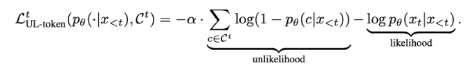
> token级unlikelihood training loss

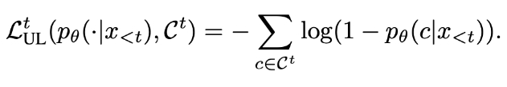
> sentence级unlikelihood training loss

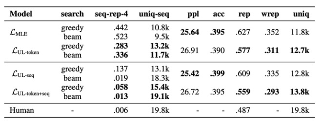
> 各训练Loss下的重复度结果

> 注：上图为论文中的结果，其中**seq-rep-4代表4-gram重复率；uniq-seq代表总共出现的不同词的个数；ppl代表句子困惑度；acc代表句子准确性；rep代表前词重复率；wrep代表加权前词重复率**。从这些指标中可以明显观察到，unlikelihood training能降低整体生成句子的重复度。

unlikelihood training方法是一种表现不错的抑制重复方式，但其中集合C的设计比较困难。针对不同的任务，集合C都需要进行精心的设计，才能保证在生成精度基本不降的情况下抑制模型生成重复与单调的结果。（该方法仅能解决1.1节中阐述的前两种重复问题，无法解决输入多次相同prompt输出单调性的问题）

> 参考：[NEURAL TEXT DEGENERATION WITH UNLIKELIHOOD TRAINING](https://arxiv.org/pdf/1908.04319.pdf)

#### 3.3.2 引入噪声

在生成文本时，引入一些随机性或噪声，例如通过采样不同的词或短语，或者引入随机的变换操作，以增加生成文本的多样性。这可以通过在生成过程中对模型的输出进行采样或添加随机性来实现。

#### 3.3.3 Repetition Penalty

- 思路：重复性惩罚方法通过在模型推理过程中加入重复惩罚因子，对原有softmax结果进行修正，降低重复生成的token被选中的概率

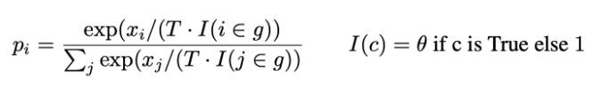
> 注：其中T代表温度，温度越高，生成的句子随机性越强，模型效果越不显著；I就代表惩罚项，c代表我们保存的一个list，一般为1-gram之前出现过的单词，theta值一般设置为1.2，1.0代表没有惩罚。

重复性惩罚方法是一种简单有效的重复抑制手段，因为它通过提高I值，有效降低集合c中词再次被选中的概率。当然，类似与unlikelihood training，本方法也可以通过设置不同的c集合来改变惩罚的方向。（该方法仅能解决1.1节中阐述的前两种重复问题，无法解决输入多次相同prompt输出单调性的问题）

> 参考：[CTRL: A CONDITIONAL TRANSFORMER LANGUAGE MODEL FOR CONTROLLABLE GENERATION](https://browse.arxiv.org/pdf/1909.05858.pdf)
> Huggingface中，model.generate已经包含此参数，仅需设置repetition_penalty=p（p>1.0）即可开启重复惩罚因子

#### 3.3.4 Contrastive Search

- 动机：Contrastive Search方法是为了解决原先解码方法，例如Beam Search，**在采用最大化生成方式解码时出现解码退化的问题即生成的文本不自然的，并包含文本重复而提出的一种解决方案**
- 思路：**对比loss以及对比搜索两个创新点，从模型训练和模型推理层面缓解了生成式模型重复以及单调问题**。

其中对比loss通过在原loss基础上添加对比loss，即对比token间相似度的方式去解决生成式模型重复单调问题，公式如下：

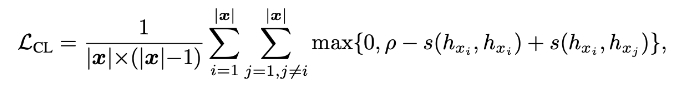

其中

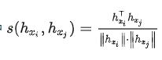

就是余弦相似度，下图给出了训练前后token间的相似度：

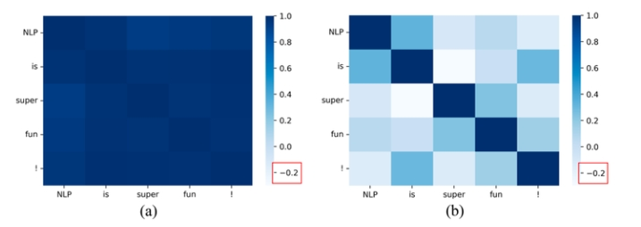
> 对比训练前后token相似度

从图上可以明显看出token间相似度降低了，**token间相似度降低即不同token在高维空间表征分离能有效降低模型仅生成个别重复词或字的概率**。

而对比搜索方法就是在decode阶段限制相似token生成的概率，大大降低生成内容重复率和单调性。

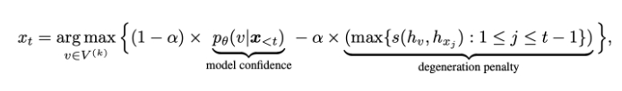
> 其中第一项就是原模型的概率，**后面一项可以理解成一种惩罚，当前token与历史token相似度较高时，就降低当前token的概率**。

对比loss和对比search在训练和推理两个阶段限制生成token间的相似度，有效降低了模型对一些特别常见表达的依赖，让模型尝试生成不一样的表达，整体上提升模型的创造性。（该方法仅能解决1.1节中阐述的前两种重复问题，无法解决输入多次相同prompt输出单调性的问题）

> !!! 特别注意，对比search使得后面测试任务推理速度降低十倍；且占用显存更大，慎用 !!!

> 参考论文地址：[A Contrastive Framework for Neural Text Generation](https://browse.arxiv.org/pdf/2202.06417.pdf)
> Github 地址：https://github.com/yxuansu/SimCTG
> Huggingface中，model.generate已经包含此参数，仅需设置penalty_alpha=alpha（0<alpha<1） 即可开启对比Search因子alpha

#### 3.3.5 Beam Search

- 思路：Beam Search是对贪心策略一种改进。思路简单，就是稍微放宽考察的范围。**在每一个时间步，不再只保留当前分数最高的1个输出，而是保留num_beams个**。当num_beams=1时集束搜索（Beam Search）就退化成了贪心搜索。**Beam Search虽然本质上并没有降低重复率的操作，但是该策略确实在结果上优化了部分生成结果，降低了一定的重复率**。

下图是一个实际的例子，每个时间步有ABCDE共5种可能的输出，图中的num_beams=2，也就是说每个时间步都会保留到当前步为止条件概率最优的2个序列。

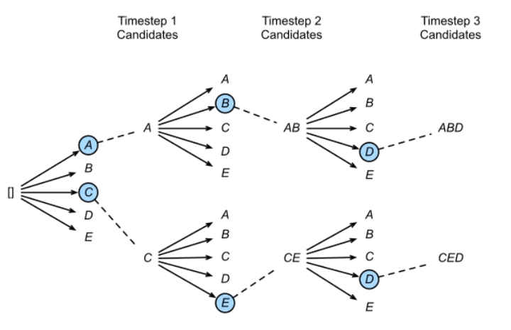
> Beam Search搜索方式

Beam search理论上仅是为了解决**贪婪搜索给到的答案仅局部最优**，而**全局搜索又在时间复杂度上不可行**而提出的折中算法，并不能对大模型中的任何重复问题进行修正，甚至有可能增大重复概率。但从翻译的测试实验结果来看，它确实在一定程度上改变了模型Softmax后的分布情况，优化了输出的结果，所以在部分大模型任务上能抑制重复生成问题。

> 注：Huggingface中，model.generate中已经包含此参数，仅需设置num_beams=2即可开启集束搜索

#### 3.3.6 TopK sampling

TopK通过对Softmax的输出结果logit中最大的K个token采样来选择输出的token，该方法存在的问题是当概率分布很极端时，即模型很确定下一个token时，容易造成生成错误。以下图为例，**TopK采样会选择最大的K个token，并通过logit值对K个token进行采样，相比于贪心搜索增添了随机性**，相当于同样的输入，多次经过TopK采样生成的结果大概率不会一样。

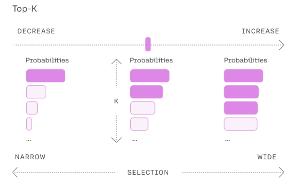

TopK采样是一种**行之有效，能简单暴力的解决所有重复单调问题的方案之一**，当然它存在的最大问题是最后生成的句子**存在狗屁不通现象，并不能保证句子的通顺度以及对prompt的忠诚度**。

> Huggingface中，model.generate中已经包含此参数，需设置do_sample=True，开启采样模式，同时设置top_k值，top_k值默认为50

#### 3.3.7 Nucleus sampler

Nucleus sampler俗称TopP采样，一种用于解决TopK采样问题的新方法，**该采样方式不限制K的数目，而是通Softmax后排序token的概率，当概率大于P时停止，相当于当模型很确定下一个token时，可采样的K也会很少，减少异常错误发生的概率**。以下图为例，TopP采样会不断选择logit中最大概率的token，放入一个list中，直到list中计算的总概率大于设置的TopP值，后对list中的token概率进行重新计算，最终根据计算出来的概率值对list中的token进行采样。

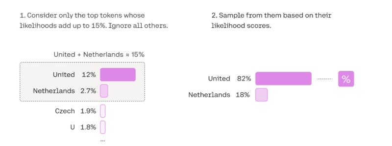

Nucleus sampler是对简单暴力的TopK采样修改后的方法，也能解决所有重复单调问题，相比TopK，**该方法生成的句子通顺度以及对prompt的忠诚度更佳，一般选择它，而不选择TopK**。

> 注：Huggingface中，model.generate中已经包含此参数，需设置do_sample=True，开启采样模式，同时设置top_p值，top_p值默认为1.0

#### 3.3.8 Temperature

生成模型中抽样包含随机性，因此每次生成时，相同的prompt可能会产生不同的输出。温度是用于调整随机程度的数字。

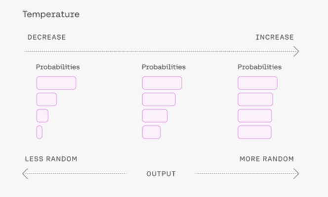
> Temperature参数使用方法

**采样时如何选择温度**?

较低的温度意味着较少的随机性；温度为 0 将始终产生相同的输出。执行具有“正确”答案的任务，**对于总结类，翻译类等具有明确答案的任务，较低的温度（小于1）更合适**。如果模型开始自我重复，则表明温度设置过低。高温意味着更多的随机性，这可以帮助模型给出更有创意的输出。如果模型开始偏离主题或给出无意义的输出，则表明温度过高。温度调整公式如下：

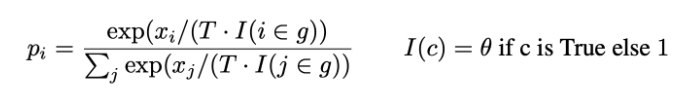

Temperature参数就是前面介绍repetition penalty中的T参数。

**提高Temperature配合上文两种采样算法，可以达到生成更激进创新性回答的需求，但生成句子的稳定性不可控**。

> Huggingface中，model.generate中已经包含此参数，仅需设置temperature，默认为1.0

#### 3.3.9 No repeat ngram size

该方法是一种最暴力抑制重复的方法，通过限制**设置的ngram不能出现重复**，如果重复，就选概率次大的一个，来强制模型不生成重复的token。

该功能一般都会开启，来保证生成的句子不犯很离谱的连续重复问题。（该方法仅能解决1.1节中阐述的前两种重复问题，无法解决输入多次相同prompt输出单调性的问题）

> Huggingface中，model.generate中已经包含此参数，仅需设置no_repeat_ngram_size=N即可

#### 3.3.10 重复率指标检测

在表中列出了常见重复率监测指标：seq-rep-N，uniq-seq，rep，wrep。通过这些指标的融合，可以**对重复生成的结果进行一定程度的监测**，并在监测到异常生成结果时，**通过加入特殊字符，修改prompt表达等形式来重新生成结果**。

通过我们的测试，通过切分或加入特殊字符的方式确实能让本身异常的翻译结果恢复正常，但**潜在风险是翻译的语序可能会出现一定的问题**。（对其他领域生成结果的影响有待进一步探索）

#### 3.3.11 后处理和过滤

对生成的文本进行后处理和过滤，去除重复的句子或短语，以提高生成文本的质量和多样性。可以使用文本相似度计算方法或规则来检测和去除重复的文本。

#### 3.3.12 人工干预和控制

对于关键任务或敏感场景，可以引入人工干预和控制机制，对生成的文本进行审查和筛选，确保生成结果的准确性和多样性。

## 四、llama 系列问题

### 4.1 llama 输入句子长度理论上可以无限长吗？

限制在训练数据。理论上rope的llama可以处理无限长度，但实际上存在一些限制和挑战。下面是一些相关的考虑因素：

1. 计算资源：生成长句子需要更多的计算资源，包括内存和计算时间。由于LLMs通常是基于神经网络的模型，计算长句子可能会导致内存不足或计算时间过长的问题。
2. 模型训练和推理：训练和推理长句子可能会面临一些挑战。在训练阶段，处理长句子可能会导致梯度消失或梯度爆炸的问题，影响模型的收敛性和训练效果。在推理阶段，生成长句子可能会增加模型的错误率和生成时间。
3. 上下文建模：LLMs是基于上下文建模的模型，长句子的上下文可能会更加复杂和深层。模型需要能够捕捉长句子中的语义和语法结构，以生成准确和连贯的文本。

尽管存在这些挑战，研究人员和工程师们已经在不断努力改进和优化LLMs，以处理更长的句子。例如，可以采用分块的方式处理长句子，将其分成多个较短的片段进行处理。此外，还可以通过增加计算资源、优化模型结构和参数设置，以及使用更高效的推理算法来提高LLMs处理长句子的能力。

## 五、什么情况用Bert模型，什么情况用LLaMA、ChatGLM类大模型，咋选？

Bert 的模型由多层双向的Transformer编码器组成，由12层组成，768隐藏单元，12个head，总参数量110M，约1.15亿参数量。NLU（自然语言理解）任务效果很好，单卡GPU可以部署，速度快，V100GPU下1秒能处理2千条以上。

ChatGLM-6B, LLaMA-7B模型分别是60亿参数量和70亿参数量的大模型，基本可以处理所有NLP任务，效果好，但大模型部署成本高，需要大显存的GPU，并且预测速度慢，V100都需要1秒一条。

所以建议：

1）NLU相关的任务，用BERT模型能处理的很好，如实体识别、信息抽取、文本分类，没必要上大模型；

2）NLG任务，纯中文任务，用ChatGLM-6B，需要处理中英文任务，用chinese-alpaca-plus-7b-hf

## 六、各个专业领域是否需要各自的大模型来服务？

各个专业领域通常需要各自的大模型来服务，原因如下：

1. 领域特定知识：不同领域拥有各自特定的知识和术语，需要针对该领域进行训练的大模型才能更好地理解和处理相关文本。例如，在医学领域，需要训练具有医学知识的大模型，以更准确地理解和生成医学文本。
2. 语言风格和惯用语：各个领域通常有自己独特的语言风格和惯用语，这些特点对于模型的训练和生成都很重要。专门针对某个领域进行训练的大模型可以更好地掌握该领域的语言特点，生成更符合该领域要求的文本。
3. 领域需求的差异：不同领域对于文本处理的需求也有所差异。例如，金融领域可能更关注数字和统计数据的处理，而法律领域可能更关注法律条款和案例的解析。因此，为了更好地满足不同领域的需求，需要专门针对各个领域进行训练的大模型。
4. 数据稀缺性：某些领域的数据可能相对较少，无法充分训练通用的大模型。针对特定领域进行训练的大模型可以更好地利用该领域的数据，提高模型的性能和效果。

尽管需要各自的大模型来服务不同领域，但也可以共享一些通用的模型和技术。例如，通用的大模型可以用于处理通用的文本任务，而领域特定的模型可以在通用模型的基础上进行微调和定制，以适应特定领域的需求。这样可以在满足领域需求的同时，减少模型的重复训练和资源消耗。

## 七、如何让大模型处理更长的文本？

- 动机：目前绝大多数大模型支持的token最大长度为2048，因为序列长度直接影响Attention的计算复杂度，太长了会影响训练速度。
- 让大模型处理更长的文本 方法

1. LongChat

就两步：

step1：将新的长度压缩到原来2048长度上，这样的好处是能复用原来的位置信息，增加长度并没有破坏position的权重。

比如从2048扩展到16384，长度变为原来的8倍，那么值为10000的position_id，被压缩成10000/8=1250

代码只需要改一行：

```s
# 将position_ids按比例缩一下。
query_states, key_states = apply_rotary_pos_emb(query_states, key_states, cos, sin, position_ids / ratio). 
```
> 详细参考：https://kaiokendev.github.io/context

step2：用训练Vicuna的对话语料做微调，超过16k的文本被截断。

2. position等比例缩放既然有用，那后续会不会有一种新的position构造的方式，无论多长都可以归一到同样的尺度下，只要position的相对位置保持不变就可以？其实ALiBi的方法就是一个比较简单优雅的方式，可以部分解决扩展长度的问题。
3. 商业模型比如ChatGPT和Claude到底是怎么做的？这个目前都没有公开。首先语料是不缺的，所以只能是结构上的变化。但是这两个商业模型规模都是100B这个量级的，这么大的参数，如果只增加序列长度而不做其他优化的话，很难训练起来。目前有证据的方法如下：
   1. 稀疏化，GPT3的论文中曾提到有这方面的尝试。
   2. Google的周彦祺在一次分享中透露GPT-4用了MoE的技术(猜测是100B16E)，所以应该有类似的方法来保证在序列变长的情况下，仍然能高效的训练模型。
   3. Multi-Query Attention。Google的PaLM，Falcon等模型都用到过，通过权重共享来提升性能。
4. 真正的出路可能还是Linear Attention，将Attention的复杂度从 $O(N^2)$ 降低为 $O(N)$. 比如Linear Transformer和RWKV。其实关于变长序列的问题，历史上现成的解决方案就是RNN，通过信息传递来解决。Transformer的卖点就是Attention is All your Need，丢弃了RNN，RWKV敢于把RNN拿回来，还是很有勇气，非常好的一个工作。现在的Attention就有点像历史上的MLP，每个节点之间都要建立关联，而MLP之后涌现了大量新的结构，所以Transformer是起点，后续肯定会有更合理的结构来取代它。

## 致谢

- 大模型生成去重技术总结： https://zhuanlan.zhihu.com/p/659961396


