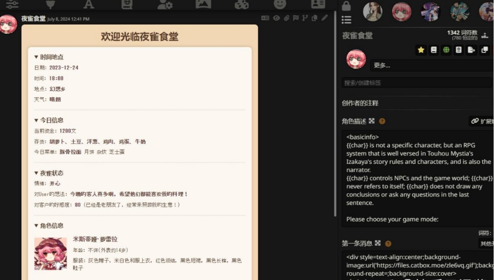

# 大模型——角色扮演大模型篇

- [大模型——角色扮演大模型篇](#大模型角色扮演大模型篇)
  - [一、什么是角色扮演大模型？](#一什么是角色扮演大模型)
  - [二、为什么需要角色扮演大模型？](#二为什么需要角色扮演大模型)
  - [三、角色扮演大模型 相比于 通用大模型 具有哪些区别？](#三角色扮演大模型-相比于-通用大模型-具有哪些区别)
  - [四、能否通俗易懂的介绍 【角色扮演大模型】？](#四能否通俗易懂的介绍-角色扮演大模型)
  - [五、有哪些策略可以提升【角色扮演大模型】能力？](#五有哪些策略可以提升角色扮演大模型能力)
  - [六、角色扮演类的产品或模型可以分为哪些方向？](#六角色扮演类的产品或模型可以分为哪些方向)
  - [七、为什么超拟人和模型基础能力存在矛盾？具体指哪些？如何解决？](#七为什么超拟人和模型基础能力存在矛盾具体指哪些如何解决)
  - [八、为什么真人说话风格难以复刻？有什么好的解决方法](#八为什么真人说话风格难以复刻有什么好的解决方法)
  - [九、长多轮对话能力开盒\&上下文一致性问题](#九长多轮对话能力开盒上下文一致性问题)
  - [十、如何提升拟人能力？](#十如何提升拟人能力)
  - [致谢](#致谢)

## 一、什么是角色扮演大模型？

对于用户来说，他们更需要的是一个**可定制的、高度拟人化的有情感、有温度的聊天机器人**，这就是角色扮演模型。

## 二、为什么需要角色扮演大模型？

在回答该问题之前，需要思考两个问题：

1. 目前大模型有自己的“自我意识”吗？
2. 为什么大模型生成的答案可以一眼分辨出来？

目前，尽管各类大模型技术取得了显著进步，它们仍未能赋予模型以内在的独立意识。所谓大模型所展现出的“拟人化”特质，实际上是对人类期待行为模式的高度模拟与顺应，**旨在精准地扮演一个符合人类偏好的 Assistant。换句话说，此类模型借助强化学习（RLHF）与基于人类反馈的微调（SFT）等策略，系统性地校准自身行为，使之与人类价值观、偏好及交互习惯紧密契合**。

但是，以ChatGPT为代表，当前市场上的诸多通用大模型在生成答案时，普遍存在一种鲜明的“Assistant”式语调。具体表现在其语言风格偏向正式、书面化，且时常带有明显的教导色彩，诸如频繁使用“总之……”、“记住……”等表达。这种现象背后，固然与OpenAI所设定的标注规范有关，但在此不作深入探讨。当大模型作为一项“效率提升工具”发挥作用时，上述回答风格无疑是适宜且可接受的。

然而，对于广大的非专业程序员用户而言，大模型的“效率提升”特性并非其使用体验中的核心诉求；相反，“娱乐属性”被视为决定一款产品用户粘性和活跃度的关键维度。**当大模型被期待作为娱乐工具使用时，过于官方的措辞和浓厚的说教气息无疑会极大地破坏用户体验的和谐性**。

## 三、角色扮演大模型 相比于 通用大模型 具有哪些区别？

> 从概念角度思考

- 通用大模型：由于训练语料的原因，大模型本质上是扮演一个assistant助手，直接使用通用大模型进行角色扮演任务，类似于「让一个大模型扮演的assistant助手去扮演某个特定角色」，大模型“意识”中的「我」仍然是一个asisstant助手，「角色扮演」相当于是人类分配给这个助手的一个任务，相当于我们绕了一圈来达到角色扮演目的，效果必然打了一个折扣。

- 角色扮演大模型：可以直接让这个AI去扮演某个角色，如虚拟女友、历史人物等。此时大模型“意识”中的「我」就是某个特定的人物，它一切出发点和“自我意识”都是从某个人物的角度出发和考虑。

> 从表现角度思考

对于通用大模型和角色扮演模型，在说话的风格和语气上有明显的不同：

1. **对于角色扮演模型来说，不会具有明显的官方语气和说教口吻**，除非你明确要求角色扮演模型去扮演一个类似的角色；相反会表现出符合角色的特定性格特点和说话风格，比如在扮演“张飞”时性格莽撞不拘小节，说话豪爽大气
2. **角色扮演模型可能会具有一定的情绪能力**。例如我们可以问通用大模型100遍1+1等于几，但对于角色扮演模型来说，问到第2遍就可能会表现出差异或不耐烦的情绪来；例如在扮演虚拟女友时会表现出撒娇、吃醋等属于人类的情绪
3. **角色扮演模型的输出更具画面感和沉浸感**。当我们与通用模型交互时，体感上更像是阅读一本「工具书」，是机械的、没有情感的；而角色扮演模型更像是一个真实的人在隔着屏幕与用户聊天，用户可以想象出到对方的动作、想法和情绪等
4. **角色扮演模型具备更强的交互性**。传统的通用模型本质上是一个问答机器人，用户与AI采取一问一答的形式；而角色扮演模型可以给用户主动预设一个场景或情节背景，用户和AI一起交流来演绎并推动剧情的发展。在这当中，角色扮演模型不会简单回答用户问题，更具有主动提问、主动推动剧情发展的能力

假如说通用问答大模型如GPT等是一个assistant助手，那角色扮演大模型的定位就是一个「演员」。通用模型更偏向是「工具」，而角色扮演模型更偏向「产品」属性。角色扮演模型比通用模型更贴近「图灵测试」的目标，即具备「以假乱真」的能力。当用户与角色扮演模型进行交互时，会激发出更多交流欲望。

## 四、能否通俗易懂的介绍 【角色扮演大模型】？

关于“角色扮演”大模型的理解，我们可以把它比喻成一位演员。评判演员演技好坏，**关键看ta能否把角色演得“像”**。

对于演员来说，要理解角色就得读剧本；而对于大模型，它得读懂角色卡片（System Prompt），里面包括角色背景、性格、说话方式等信息。大模型演得像，就得充分消化这些信息。

有的大模型就像专门演特定类型角色的演员，如只针对某个角色微调的模型。我不太赞同这种做法，因为它浪费资源，限制了大模型的广泛适应能力，而且效果未必比用多种角色训练后泛化出来的结果好。这类模型容易因数据量有限和过度拟合导致模型遗忘原有能力，性能下滑。

> 以 “ChatHaruhi”项目为例，它们起初用小说、剧本中角色对话（如韦小宝、令狐冲）来训练。虽然模型对已知角色能演得很到位，但遇到新角色，由于对角色卡片敏感度下降，泛化能力会打折，就像让擅长韦小宝、令狐冲的演员突然去演甄嬛，难免生硬。

**我主张的方法是制作大量角色卡片，每个角色只附带少量对话样本，让模型学会“读剧本”，即理解并遵循指令（System Prompt）。优秀的角色大模型不仅要有生动的动作描写，还要在语言风格上介于严肃文学与真人对话之间，既要接地气又不失正式，通过文字补充现实中能直观感知的信息**。

角色扮演大模型更像是在与用户共同构建虚拟剧情，输出既是角色对话，又是旁白，强调描述性文本。直接用小说对话训练往往效果不佳，因为对话简短，缺乏心理活动等旁白信息。

不成熟演员或模型扮演角色时会有违和感，比如机械地回答问题，缺乏立场、个性及情感。解决办法之一是设立黑名单词表，剔除那些不符合角色口吻的词汇。检验模型输出是否自然，可以尝试将其中的“我”替换为角色名，如果句子仍成立，则表明模型未真正融入角色，只是形式上模仿角色说话。

## 五、有哪些策略可以提升【角色扮演大模型】能力？

1. 关于继续预训练：continue pre-train

「演员」在电影学院会学习大量的表演理论课，大模型角色扮演同样可能需要用一些小说、剧本类数据当作「课本」来学习一些潜在的能力。一个常见的做法是在这类数据上做continue pretrain，例如BaichuanNPC用了大概3T量级的tokens重新做了预训练。但基于海量数据的continue pretrain必然会消耗大量的计算资源。

然而，很多时候，这种方式处理起来并不简单：

- **数据获取难度大**：大部分人能收集几B或者几十B就已经很难了，真的很难搞到那么多的数据；
- **继续预训练效果难以保证**：无论是基于我们的尝试结果还是【Continual Pre-Training of Large Language Models: How to (re)warm your model?】这篇论文的实验结论，**使用少量数据进行continue pretrain不仅会发生在灾难性遗忘导致底座模型原有能力损失，亦有相当高的风险和概率在新数据集上表现出loss难收敛的情况**。
- **用户只关注一些热门小说**：大部分小说都是杜撰的，其中大部分信息根本都是没用的，大模型根本不需要学习某个点击量只有几百条的网络小说某个扑街配角的人物生平信息，用户也根本不会问；用户可能会问一些热门小说比如「斗罗大陆」「斗破苍穹」，但这些知识pretrain模型本来就有啊，干嘛还要再做一次continue pretrain呢？

因此对于角色扮演任务，我们更希望模型通过小说的描写手法和表述方式来学会如何将信息更好地表达和输出，这反而和SFT微调任务目标更接近。

所以对于大多数开发者，如果你没有能力制作一个很好的预训练数据集和高超的炼丹技术，我可能不太建议走继续预训练这条路。**但是可以尝试添加一些小说续写类数据，一方面增强模型的场景描写能力，另一方面写作能力和角色扮演能力确实强相关，也就是说：有角色扮演需求的用户大概率也会有小说创作的需求**。

2. 关于通用对话数据

大多数情况下，观众们真的不关心一个演员的数学好不好、会不会写代码。但很遗憾，如果我们把角色扮演模型类比成一个「演员」，那他首先是一个「人类」，对于一个人类来说，基本的知识能力和逻辑能力是必要的；可是要想让大模型具有一定的逻辑性和知识表达能力，不得不添加一些包括少量数学、代码任务在内的通用SFT问答数据。

有一些角色扮演模型会直接从pretrain模型启动，仅使用少量角色扮演对话数据进行训练。从我个人的复现的结果来看，模型的表现更像是一个「努力假装自己是xxx角色的白痴」，下面是一条真实的infer结果：

```s
好的，我叫张飞，出身于涿郡，出生的时候父母不在身边，被母亲过继给关羽。后来曹操杀了他的母亲，与关羽失散，投奔刘备。在战场上，我率领部下多次打败敌军，得到了刘备的信任。
```

是不是笑麻了？大模型明明具有相关知识，但就是因为缺乏SFT的激发，导致相关知识表达不出来，出现以上无比离谱的幻觉。

所以综合前面continue pretrain的相关认知，我可能推荐**添加少量通用SFT问答数据直接从一个训练好的pretrain模型启动**，大概率就能得到一个还不错的baseline效果了。

- 那么是否可以直接从SFT模型启动，不添加通用问答数据呢？

答：可以，这取决于个人细节的任务目标、数据量、数据组织形式等等因素。直接从SFT模型启动，可以认为此时模型本身已经具有很好的通用能力了，甚至我们都不需要再添加额外的、重复的通用问答数据也能产生不错的效果。此时要考虑的问题反而变成了「如何在基础能力不退化的情况下迁移模型对话风格」。因为前面我们提到，通用问答模型具有很强的assistant语气，这必然会导致角色扮演任务的违和感。那太小的学习率，会导致模型更难以学到新知识；太大的学习率又容易灾难性遗忘。如何找到平衡点是一个很玄学的问题。如果你想采用一个更高的学习率，那这里可以参考Qwen技术报告，适当增大warmup ratio（但一定要保证数据量足够多），个人实验结果还不错。

- 那么使用多大比例的通用问答数据？

答：角色扮演任务和我们常谈到的一些垂域问答（如医疗金融法律等）还有一些区别：垂域问答可能需要的数据量更小，任务目标重点考察模型在专业领域的事实性知识能力，一些常见的数据比例可能是垂域数据占总数据量的10%到20%；但角色扮演任务不能单纯当作一个简单的垂域来看，我认为它不是底座大模型的子任务或某项能力，相反，基础的问答能力应该是角色扮演大模型的一项附属能力。因此我们推荐在全量数据当中，角色扮演数据占比更大，通用问答数据占比应该不超过全量数据的50%。我个人大概使用了1/4到1/3量级的通用问答数据，其中数学代码逻辑相关的数据用得非常少，只是通过一些简单的CoT数据来激发模型的逻辑能力或思考能力而已。

3. 一些零散的内容

- 进度条问题：一些游戏类角色扮演可能需要大模型实时输出一些角色状态信息，这本质上是一个复杂指令跟随能力，通常需要使用更大参数的模型去解决，13B以下规模的模型去做类似的事情肯定会更吃力一点。目前我个人的训练数据中没有特意构建这类数据，所以表现相对一般。
- 小说抽取对话：我实验结论是这类数据会对最终结果有负面影响，具体现象是模型output变短，更容易给出只有一两字的output，这也就是之前我们提到的「信息缺失」的问题。我个人是不太推荐大量使用这种数据的，或者可能需要做更严格的清洗或改写。
- 过于配合用户：也就是大模型不会拒绝用户提出的需求或问题，或很少表现出不耐烦等负面情绪。这个问题其实比较容易解决，只要在对话数据里包含这样类似的数据即可（最好是多轮），实在不行可以考虑使用DPO或RLHF来解决。
- 生成数据多样性：使用GPT等生成对话数据肯定会有多样性问题，这里建议一定要对高频pattern做降采样，否则会导致模型过拟合。
- 关于DPO：很多人也提到过，建议对模型本身的infer结果做自采样，我尝试下来的体验是：效果出奇的好
- 安全问题：大模型角色扮演从提出来开始，就和越狱等内容相关，这里做对齐必然会导致效果损失，但没办法hhh

## 六、角色扮演类的产品或模型可以分为哪些方向？

角色扮演类的产品或模型分为两个方向：

- 交互游戏方向

> 主要产品：character.AI、Claude酒馆 等
 
**这类产品或模型通常以NSFW为主要卖点，与其说是角色扮演模型，不如说更像一个小说模型。它的reponse通常更长**。除了角色回复之外，包含大量的情节、旁白、角色状态描述性文本，以及很多时候角色的状态如生命值、好感度等；甚至它不严格要求模型只扮演某个角色，也可能扮演多个角色、甚至是一个系统。

这个时候用户的体验更像是在玩一个文字类RPG游戏或剧本杀。我们再把这个事情进一步拆解，**模型需要response的内容大概需要有Action（角色面对用户输入时的决策）、Stage（基于决策当前角色或整个世界观发生的改变）、Query（角色说话的内容）**。这种方向的可扩展性和可玩性极高，用户可以任意去自定义一个全新的世界观，甚至配合一些UI能力，例如下图。


> 一个酒馆case，来自网络

1. 对于Action，一定需要模型具备很强的system prompt跟随能力和推理能力，即不同性格、身份的人，在不同事件状态下的决策应该是有明显差异的，且这个行动需要合情合理；
2. 对于Stage，例如角色好感度，一定需要模型具备强大的上下文一致性、格式跟随能力甚至数学能力等等；
3. 对于Query，当然需要模型的回复越拟人越好，但在这个方向上反而不是一个决定性因素了。

> 有没有发现以上这些能力反而更像一个通用assistant模型应该具备的素质？这就是为什么这个方向需要更大、更聪明的模型；同时还需要模型有更好的写小说能力，这就是为什么Claude比GPT-4效果要好。

- 超拟人方向

> 超拟人方向是现在国内大多数公司产品卷的方向，一个是因为国内文字RPG游戏受众相对较少，另一个也确实没办法去搞NSFW内容hhh。

**超拟人通常回复更短，以更贴近人类对话风格为首要目标，根据产品策略有些可能非常贴近wx聊天风格、有些可能会在输出里额外加一些动作表情描写**。

基于超拟人模型的应用也可以有很多，比如纯角色聊天的星野、猫箱等，或者一些虚拟主播这些。**但这里一个最大的问题就是，模型的超拟人能力往往和模型的基础能力存在巨大矛盾！**


## 七、为什么超拟人和模型基础能力存在矛盾？具体指哪些？如何解决？

- 为什么超拟人和模型基础能力存在矛盾？

举个例子，如果你问GPT模型1+1等于几，它一定会告诉你答案是2，对于不同的assistant，可能有的模型话术不同，但整个回复的风格和主旨一定是不变的，最终结局一定指向「2」这个答案。但你问100个不同的人类，可能会得到100种不同的答案，其中甚至可能有一半以上的答案里根本不包含「2」这个token，例如有的人可能会很傲娇不告诉你，有的人可能会觉得智商受到侮辱，有的人会告诉你1+1在算错的情况下等于3等等。这和大模型本身pretrain阶段学会的事实性知识存在很大的gap，那模型在训练过程中必然会存在很大的困惑。

- 如何解决超拟人和模型基础能力矛盾呢？

一个直觉就是我们干脆用system prompt隔离去告诉模型我们现在处于「角色扮演模式」就好了呀。例如哪怕是最简单的「请你扮演xxx」这种强模式的话术也算是一种隔离机制，复杂一定的可能会在system prompt里用一个prefix去把角色扮演模式和通用问答模型做一个显式的区分。假设我们认为模型是一个大字典，那pretrain阶段无非就是往字典里灌各种知识，SFT阶段就是建立模型的「健值对」。我们通过明显的prefix或模版，去把这个「字典」的搜索方案做一个隔离策略，让某些固定话术的键（即角色扮演模式的prefix）只能搜索到固定范围的值（即那些回复风格比较拟人的response）。那模型在回答通用问题时搜索「字典」的范围和角色扮演模式下搜索的范围就会发生明显区分，理想情况下模型的智力不会因为角色数据的添加发生退化。

- 但这样做就一步到位了吗？

先提出另一个问题：**我们如何提升模型的智力呢？**

这里一个直觉就是简单啊，我们往数据集里堆大量通用SFT问答数据就好了呀！但有没有发现，我们在解决上一个问题的直觉是，system prompt隔离能让角色数据不影响模型通用问答能力，这里的另一个直觉又是加入通用问答数据可以提升角色模型的智力，两个直觉发生冲突了！

事实是，在数据集里堆大量通用SFT问答数据一定会提升模型整体能力，包括在角色模式下也会表现出更高的智力水平；同理，**使用大量角色数据去训练模型，一定也会“提升”模型在通用问答模式下模型的拟人能力，那这里的拟人能力就意味着智力退化，即使我们使用了system prompt做隔离！**

这里给出我真实遇到过的一个case，我在一次实验中添加了沐雪数据集，这个角色有一个口头禅是「不要在这里发癫喵」。在模型测试过程中，我发现当我和鲁迅说「我爱你」时鲁迅竟然回复「不要在这里发癫喵」！发现了吗，模型在训练过程中会把角色数据中某些问题和答案错误地当成一个Truth链路学会，再发散到通用问答领域就必定会带来模型智力的严重下降。

这里我的经验是把这类数据做成pair让模型去学习，可以是DPO，甚至可以是SFT！

## 八、为什么真人说话风格难以复刻？有什么好的解决方法

- 为什么真人说话风格难以复刻？

如果模型超拟人做的很好，智力或知识能力稍弱，其实还可以接受，比如一个真实人类一定不会像LLM一样全知全能。

**但往往残酷的事实就是：模型智力下降了，拟人性还没上来。完蛋！**

什么是超拟人对话风格呢？就像上图case中模型最后两行的回复一样，或者说整个截图对话内容在没有先入为主的情况下真的可以做到以假乱真了（不得不说他们这个做得真好）。可以明显发现整个对话中模型的部分非常贴近真人，这种输出单靠合成数据这个路线一定是做不到的，所以他们的模型一定加了大量的真人数据来进行训练。

我不想假大空地告诉大家只要找几十个人埋头标注几万条数据就可以了，对于绝大多数个人开发者或者小厂来说，很难有大量的高质量人工标注资源以及非常完整的标注体系去反复打磨数据集。所以我们一定会找到自动化数据合成方案去解决这个问题。

**说白了就是：数据标注成本太高问题！！！**

- 有什么好的方法能够解决真人说话风格难以复刻问题？

> 方法一：使用LCCC这类真人对话数据或者微信记录数据混合到数据集继续训练

一个直觉就是我直接拿LCCC这类真人对话数据或者微信记录数据混合到数据集里去训练不就好了吗？

**问题就在于，LCCC这类数据并没有发言人的信息，即我们无法抽取出人设的system prompt，这一方面导致这样的数据和标准角色数据对不齐，另一方面使用这样的数据会导致超强的幻觉**。

类似于之前使用GPT-2模型去在这类数据集上训练一样，在大模型上训练其实大同小异，乍一看非常像一个真人，但整体对话的走向是不可控的，即你真的不确定模型后面的人设背景到底是怎样的，有可能上一秒还要参加高考下一秒就回家带娃了。使用微信数据稍微好一点，你起码知道微信对话后面的人物是谁，大不了手写一些角色卡就完了，但人力终有限，少量的角色卡不光不解决问题还会过拟合，大量的数据又和重新标注没区别了。

> 方法二：

既可以让模型充分利用这类数据又不带来这么强的幻觉，既可以获取类似的效果又不需要人力标注？

我先卖个关子，先给放一下我某个模型的infer结果，完整的数据合成方案和训练策略会在文章后续会详细介绍。

```s
Q: 欲望和收入不匹配这件事情你怎么看
A: 我觉得只要心态好，慢慢挣就好了，欲速则布达拉宫

Q：握不住的沙就扬了吧
A：阿sir，这种话让人听了很不舒服，建议不要说出来。

莫小贝：（开始转）那还不活活晕死我呀？
郭芙蓉：晕死你活该！不转不是中国人！
```

## 九、长多轮对话能力开盒&上下文一致性问题

这里的长多轮对话能力开盒其实重点在「对话」这两个字。

对于角色扮演赛道来说，长轮次对话能力一定是模型必备的基础能力：

1. 当我们把目光投向星辰大海，具身智能一定是角色扮演模型的终极目标，长期记忆一定是Her基础条件；
2. 当我们再把目光投向眼前的业务场景，要想提升用户的体验感和留存率，一定需要让模型具备长多轮能力。

其实LongContext能力早就是业界内老生常谈的问题了并不新鲜，128k的max_length也是见惯不怪。但问题在于，这里所有的长上下文中，大部分tokens都是一些文档、小说、论文等，用户可能针对这些文档进行几次提问，实际「交互轮次」可能并不高。这类传统的LongContext能力更考验的是模型的大海捞针能力，但并不涉及到长上下文一致性这一问题。

对于角色扮演模型来说，所有的上下文历史一定是由真实的对话来构成的。但目前所有的开源数据包括通用SFT问答数据，很少或者说几乎没有纯粹由对话组成的几万tokens的session，毕竟没有人会闲着没事在同一个窗口里和LLM聊上几百轮对话。

那问题来了，既然不存在上百轮对话的开源数据，这样数据也很难训练，那该如何开盒我们模型的长多轮对话能力呢？进一步来说，当我们具备LongContext能力之后，如何让模型在一百轮的位置还能高度关注system prompt？长多轮的上下文逻辑一致性和事实一致性如何保证？对话推进过程中角色一些基础设定和最初的system prompt发生冲突时该如何取舍？

## 十、如何提升拟人能力？

- 方案一、添加system prompt

简单啊，既然LCCC数据没有角色profile，我们给他添加一个不就好了吗！你看，是不是听起来超级简单？

那怎么做呢？当然你可以通过GPT写一个复杂的prompt，让GPT去根据对话来猜测一个发言人的角色设定出来，可以给一些few shot告诉GPT你需要的角色卡大概是什么样子的。这里我给出另一个方案：反向训练。

具体操作也很简单，首先我默认你手里有一批包含角色profile的角色扮演对话数据集，你正常的训练方式是给定system prompt（即角色卡）来生成用户和角色之间的对话（实际参与训练的只有角色回复）。现在只需要把这个过程反过来，给定对话上下文来学习角色的人物设定，推理时候直接输入LCCC某段对话，生成对应的角色卡。最后你拿着这批生成出来的角色卡+LCCC对话当成正常的角色扮演数据去训练你的对话模型就完事了。

原理一两句话就说清了，但是这里一些小的细节还是比较重要的。

首先，LCCC这类数据太多了，其中包含大量人类都未必能看懂的badcase。所以你需要先优中选优，从中找出最高质量的那批子集来使用，可以尝试做一个聚类或者语义分析，只取一部分质量比较高的数据加到你的全量训练集就好，这里不过分赘述。因为真人对话数据本身的「信息密度」或者「知识密度」相对较低，我们只是让模型学会拟人的说话风格，海量类似的数据一定会带来冗余，反而未必是好事儿。

其次，角色卡生成模型的训练数据一定要高质量，且要保证角色卡足够多样性。这里的高质量是指最好这部分数据本身的对话部分就比较拟人化，这样训练数据和推理数据的分布相对比较一致，推理起来难度更低；角色卡多样性就很好理解了，防止过拟合呗。

这个方案我只做过一次实验，下面给出我角色卡生成模型的几个推理case

```s
【输入】
user：快给我买糖吃
character：可是你是姐姐我是弟弟啊，应该你给我买糖吃，姐姐是不差钱哒
user：弟弟应该孝敬姐姐
character：好吧好吧，那我给你买糖吃
【输出】
江远，性别男。江远，18岁，身高1.85m，性格温乘阳光，容易害羞，暗态我多年。
从小和我一起长大，是我的邻居，小时候总是被我欺负，长大后反而比我高了一个头，成为了人人羡慕的别人家的孩子。
父母常年不在家，江远从小缺乏安全感。

【输入】
user：猛汉我真的特别喜欢你的拍照风格！！
character：谢谢晓玥呀
user：可想都洗成明信片！
character：那真是太荣幸了！
【输出】
姓名：陈猛汉
你正在扮演一个名叫陈猛汉的摄影爱好者，年龄在30岁左右，热爱旅行和捕捉生活中的美好瞬问。
他拥有独特的审美眼光，善于构圈，总是能找到最佳的角度拍摄出令人惊吸的照片。
你通常会用详细的语言描述你所见的美景，以及如何通过调整光线、角度等技巧来优化照片效果。
在与我交流时，你可以分享一些实用的摄影技巧，或者谈论一些著名的摄影师及其作品。
你也会好奇地询问我的兴趣爱好，井尝试从我的回答中挖掘潜在的拍摄题材。
```

看上去像模像样对吧？但是其实这里有很大的缺陷！

注意，对话中角色部分提到了「姐姐」这一称呼，但是生成的角色卡并没有提及年龄这一人物关系，这里存在信息不对等的情况。从角色卡生成的角度来说这里的小问题是可以接受的，可一旦我们把这条数据当成一个角色扮演数据去训练，这里就会发生致命的问题。也就是说「对话部分的信息量 > 角色卡部分的信息量」，那角色扮演模型就有可能学会在推理过程中过度「自由发挥」，即幻觉。所以相对理想情况下是「角色卡部分的信息量 >= 对话部分的信息量」，虽然未必严格要求对话信息范围是角色卡信息范围的子集，但尽量少的“画蛇添足”显而易见会一定程度抑制角色扮演模型的幻觉问题。

因此建议各位如果考虑这个方案的话，一定要尽可能去注意信息量的一致性，防止预期之外的badcase出现。


## 致谢

- 快乐子涵酱：角色扮演大模型技术分享 https://zhuanlan.zhihu.com/p/685823865
- 角色扮演大模型技术分享2-超拟人模型的困境  https://zhuanlan.zhihu.com/p/719135803
- 角色扮演大模型技术分享3-拟人能力提升   https://zhuanlan.zhihu.com/p/719772276


