# Scaling LLM Test-Time：谁说类o1推理一定要用RL?

> 论文名称：Scaling LLM Test-Time Compute Optimally can be More Effective than Scaling Model Parameters

- [Scaling LLM Test-Time：谁说类o1推理一定要用RL?](#scaling-llm-test-time谁说类o1推理一定要用rl)
  - [一、Scaling LLM Test-Time 介绍篇](#一scaling-llm-test-time-介绍篇)
    - [1.1 为什么需要 Scaling LLM Test-Time？](#11-为什么需要-scaling-llm-test-time)
    - [1.2 三种 Scaling LLM Test-Time 类型定义？](#12-三种-scaling-llm-test-time-类型定义)
    - [1.3 有哪些 Scaling Test-Time的方法？](#13-有哪些-scaling-test-time的方法)
    - [问题引申](#问题引申)
  - [二、方法一：纯 Inference Scaling 篇](#二方法一纯-inference-scaling-篇)
    - [2.1 Inferece Test-Time的统一视角：Proposer \& Verifier](#21-inferece-test-time的统一视角proposer--verifier)
    - [2.2 Proposer \& Verifier 实例：Best-of-N](#22-proposer--verifier-实例best-of-n)
    - [2.3 Process Reward Modeling](#23-process-reward-modeling)
      - [2.3.1 结果奖励模型(Outcome Reward Model, ORM) 有什么问题？](#231-结果奖励模型outcome-reward-model-orm-有什么问题)
      - [2.3.2 为什么要用 过程奖励模型(Process Reward Model, PRM)？](#232-为什么要用-过程奖励模型process-reward-model-prm)
      - [2.3.3 为什么有ORM了还需要PRM？](#233-为什么有orm了还需要prm)
      - [2.3.4 介绍一下 PRM建模：Let’s Verify Step by Step？](#234-介绍一下-prm建模lets-verify-step-by-step)
      - [2.3.5 介绍一下 PRM建模：reward-to-go？](#235-介绍一下-prm建模reward-to-go)
      - [2.3.6 OpenAI PRM 建模 和 Math-Shephered PRM 建模 的区别？](#236-openai-prm-建模-和-math-shephered-prm-建模-的区别)
      - [2.3.7 介绍一下 PRM使用实例？](#237-介绍一下-prm使用实例)
      - [2.3.8 介绍 PRM数据格式？](#238-介绍-prm数据格式)
    - [2.4 搜索方法 Process-Searching](#24-搜索方法-process-searching)
      - [2.4.1 介绍一下 Best-of-N Weighted？](#241-介绍一下-best-of-n-weighted)
      - [2.4.2 介绍一下 Beam Search PRM？](#242-介绍一下-beam-search-prm)
      - [2.4.3 介绍一下 LookAhead Search？](#243-介绍一下-lookahead-search)
      - [2.4.4 对比 Best-of-N Weighted 和 Beam Search PRM 和 LookAhead Search 效能？](#244-对比-best-of-n-weighted-和-beam-search-prm-和-lookahead-search-效能)
    - [2.5 不同的PRM search在各难度问题的表现](#25-不同的prm-search在各难度问题的表现)
    - [2.6 小结](#26-小结)
  - [三、方法二：推理能力增强](#三方法二推理能力增强)
    - [3.1 什么是提议分布 ？](#31-什么是提议分布-)
    - [3.2 什么是 修改提议分布 ？](#32-什么是-修改提议分布-)
    - [3.3 什么是 Self-Improve ？](#33-什么是-self-improve-)
    - [3.4 什么是 revision 数据收集 ？](#34-什么是-revision-数据收集-)
    - [3.5 什么是 revision model结果 ？](#35-什么是-revision-model结果-)
    - [3.6 什么是 verifier 训练方案 ？](#36-什么是-verifier-训练方案-)
    - [3.7 小结](#37-小结)
  - [四、Pretrain Compute V.S. Scaling Test Time](#四pretrain-compute-vs-scaling-test-time)
    - [4.1 Exchange Rate度量](#41-exchange-rate度量)
    - [4.2 小模型推理token增加14倍就能战胜大模型？](#42-小模型推理token增加14倍就能战胜大模型)
    - [4.3 完整的性能表现](#43-完整的性能表现)
    - [4.4 小结](#44-小结)
  - [五、Scaling LLM Test-Time总结](#五scaling-llm-test-time总结)
  - [致谢](#致谢)

## 一、Scaling LLM Test-Time 介绍篇

### 1.1 为什么需要 Scaling LLM Test-Time？

在预训练Scaling Law性能见顶情况下，研究机构纷纷转向了Post-Training和Scaling Test Time. 这里的Scaling Test-Time指的是在inference时增加更多的算力或时间，从而提升性能。

### 1.2 三种 Scaling LLM Test-Time 类型定义？

三种Scaling LLM Test-Time类型：

1. 纯inference推理；
2. 进行特定的训练，使得模型本身具备更优的推理能力。在inference时再辅以搜索功能提升性能（非RL）；
3. 将模型进行RL训练后，能更好的在inference推理+搜索（RL）；

> 注：本篇Paper里对比了1,2的方案。并不涉及到RL的训练

> 需要注意：
> 
> 1. **Inference**：模型在使用时预测的next-token的过程，我们通常称为推理
> 
> 2. **Resoning**：字面意义上的推理，如数学、代码和解谜等都算是需要严密的逻辑推导出答案。
> 
> 3. **Test-Time**：Inference的消耗时间，如果常规的贪心解码耗时是1个时间单位，如果我们采样100条路径，那么就花费100个时间单位。

### 1.3 有哪些 Scaling Test-Time的方法？

最常见的Scaling inference是1的方案，不涉及到训练。

Scaling Test-Time的方法有两种：

1. **拒绝采样(Rejection Sampling, RS)**： 指的是LLM可以在生成中可以采样出多条回答，再基于一种判别方式来筛选出回答，也可以称之为Best-of-N，判别方式可以是基于判别模型(如提前训练好的奖励模型)；
2. **自一致性(Self-Consistency, SC)**：如对于一道选择题，让模型采样出多次答案选项，随后统计出现频次最高的答案作为一致性答案。

### 问题引申

按照方法实现细节、结果和分析来解析本论文。建议在阅读前带着以下问题进行阅读：

1. 对于复杂的问题，我们需要增加多少的Inference Test-Time才能取得LLM性能显著提升? 
2. Scaling Test-Time 后，我们能确定性获得性能提升吗？
3. Scaling Test-Time 实现是纯Inference吗？那是不用训练了吗？如果要训练一定要用RL吗？
4. 如何做step-wise的奖励数据标注，如何进行非人工标注，PRM的建模方式？
5. model-predicted/oracle难度定义？
6. beam-searching如何step推理和搜索？
7. 什么是Best-of-N weighted？
8. MCTS-like 的 lookahead searching与 MCTS的差异，是否有效？
9. 不同的searching方法的Infra有什么特点？
10. 完整的搜索路径的收益是关注process总合还是last step的奖励？
11. 先抛开inference stage， 如何提升模型本身的reasoning能力，如何高效提升reasoning能力？
12. 如何度量Scaling Test Time的效率？
13. Scaling LLM Test Time里的Proposal model，Process Reward Model， Verify Model，Revision Model分别是什么？
14. 如何度量一个大模型和一个小模型+Test time的效率和性能关系？

## 二、方法一：纯 Inference Scaling 篇

### 2.1 Inferece Test-Time的统一视角：Proposer & Verifier

统一视角来理解Scaling Test-Time。首先需要两个角色：

- **Proposer 提议者**：

提议者是生成式的语言模型，这里可以根据提示词进行next-token文本生成，由于resoning任务的特殊性，通常要经过一系列的推导步骤才能得到答案。**在过去的生成方案 Next-token 里当输出 特殊token EOS时终止生成，所以可以另外定义逐步生成，比如在 Next-Step 生成过程中遇到\n进行暂停作为一个Step，逐步执行**。

> Next-token predict：x1 x2 x3, y1, y2, y3, y4, ..., yn, eos
> 
> Next-Step predict: x1 x2 x3, (y1, y2, y3, y4, \n), (y5, y6, y7, y8, eos)

- **Verifier验证者**：

对生成的内容进行评判，**特定的metric和判别模型都可以作为验证者，前者如PPL指标，后者可以是reward model**。

在reasoning任务里，如果提议者是逐步生成内容的，那么对应的验证者也可以是过程奖励模型逐步验证。

这里的reward model可以是结果奖励模型(Outcome Reward Model, ORM) 和过程奖励模型(Process Reward Model, PRM)

Last step的Process Reward 也可以用做 Outcome reward, 但这两者意义不等价

- Searching against a Verifier：
  - **Proposer 提议者**：**需要生成多种reasoing步骤**；
  - **Verifier验证者**：**按照评判规则进行选择一条或多条路径进行扩展**。更复杂的算法如MCTS，而Scaling LLM Test-Time里采用的搜索算法是MCTS-like，不等同于MCTS

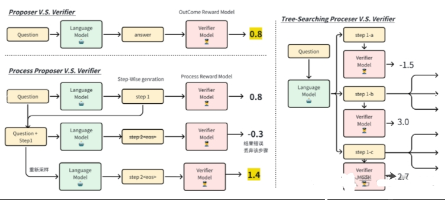

### 2.2 Proposer & Verifier 实例：Best-of-N

Best-of-N是一种基础的Proposer & Verifier:

- **生成语言模型作为Proposer**：对于一个问题Question进行采样(sampling)出多条回答Answer1, Answer2, ... , 这个**采样的过程我们也可以称为是Rejection Sampling**；
- **奖励模型作为Verifier**：判别回答得分最高的answer*选择，我们**称之为Best-of-N**，这里的奖励模型如果是通过人类偏好数据进行建模得来的话，那么这里的最高得分的答案即最符合人类偏好

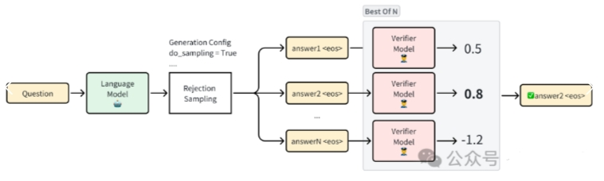

### 2.3 Process Reward Modeling

#### 2.3.1 结果奖励模型(Outcome Reward Model, ORM) 有什么问题？

我们常用基于偏好的数据来建模 结果奖励模型(Outcome Reward Model, ORM) ，但存在以下问题：

1. 偏好是outcome reward，不能反应生成过程中的对错。比如long-context文本中的奖励难以用outcome来描述，多步reasoning过程有对有错；
2. 偏好标注存在不一致性，偏好可能存在环状；
3. 偏好是隐式的；
4. 不同领域的偏好能否泛化；
5. 存在reward hacking，比如在安全评判中，如果出现safe单词，就赋予一个高分；
6. …

其中**最大的问题是ORM的反馈稀疏**

#### 2.3.2 为什么要用 过程奖励模型(Process Reward Model, PRM)？

过程奖励模型(Process Reward Model, PRM) 建模能够逐步进行反馈，奖励信号更加密集。我们可以将PRM模型描述为一种过程监督(Process Supervise)模型, 能在序列任务中给到及时反馈。

#### 2.3.3 为什么有ORM了还需要PRM？

**PRM是有助于缩小搜索空间的**：当在搜索复杂问题的路径上，如“128k词表大小”的动作空间，生成1k文本的动作序列，搜索的空间急剧增长。

1. **PRM Verified Step**：比如我们确定前3步的推理正确后，那么只需要基于确定的步骤做后续推理。

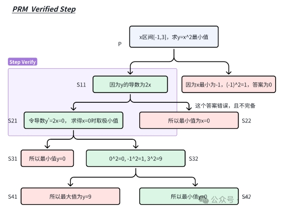

2. **PRM Candidated Step**：或者我们生成第一步解答时有k个候选step，例如“求解一个非线性优化”问题，我们第一个step可以输出SGD、ADAM、ADAMW和线性回归等选择，进行多个方案来扩展生成。（对错误step剪枝）

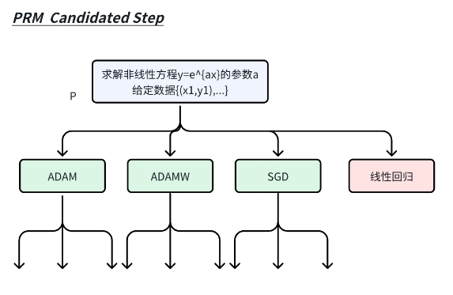

#### 2.3.4 介绍一下 PRM建模：Let’s Verify Step by Step？

OpenAI的PRM建模：Let’s verify step by step：

1. 先从模型里采集step-wise级别的数据；
2. 再对每个step进行标注二分类{postive, negative}标注；

```s
采样技巧，让模型先step-wise输出一条正确的路径{Q,S1, S2, S3, S4, A}，每个步骤标注label为1 那么再逐步采集负样本。

Q S1 -> S’2 (错误）
Q S1 S2 -> S’3 (错误）
Q S1 S2 S3 -> S’4 (错误）
Q S1 S2 S3 S4 -> A’ (错误）

另外这个错误step也可以人工来写，成本更高
```

这种过程监督的建模方式直接，但是对于复杂的任务需要繁重的标注，详见数据集PRM800k。

下图对于一个prompt，采集出多个step-wise的解答，可以在每个step-chain里标注出label，1代表该解答步骤正确，0为解答步骤错误。

得到标签数据后，可以将PRM建模转化成文本二分类问题，使用CrossEntropy()作为损失函数。

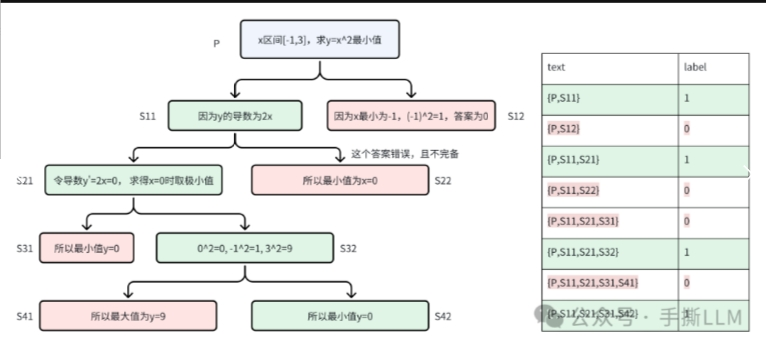

> 注意：ORM使用单个分类头，输出分数， 这里的PRM使用两个分类头，输出不同类别的概率

#### 2.3.5 介绍一下 PRM建模：reward-to-go？

- 方式一：OpenAI PRM 

在PRM800的数据里，都是从OpenAI自己的模型采集的step-wise数据做的标注。对于自有模型PaLM 2我们希望采集自身的step-wise的数据，再_自动化标注_。**Scaling LLM Test Time采用Deepseek的Math-Shephered的方案**：

> Rather than proceeding with the expensive process of collecting crowd-worker PRM labels for our PaLM 2 models, we instead apply the approach of Wang et al. [*] to supervise PRMs without human labels, using estimates of per-step correctness obtained from running Monte Carlo rollouts from each step in the solution. Our PRM’s per-step predictions therefore correspond to value estimates of reward-to-go for the base model’s sampling policy, similar to recent work
> 
> [*]Math-Shepherd: Verify and Reinforce LLMs Step-by-step without Human Annotations

**该方案不进行step-wise进行人工标注步骤的正确性，而是估计一个step的reward-to-go的价值，大白话是估计这个step往后rollout到答案的胜率**。

- 方式二：Math-Shephered PRM

Math-Shephered PRM 的实现：

1. 先让模型根据问题Prompt 推理出s1（下图绿色款最左边）；
2. 由于无法直接对s1打分。可以从problem和s1 进行Rejection Sampling出后续的步骤；
3. 以下例子采样3个答案，其中有2个答案是正确的，那么对于s1的PRM分数为2/3. 既是当前步骤s1往下执行的概率是2/3，当然我们Rejection Sampling的分支越多，统计一致性越高；

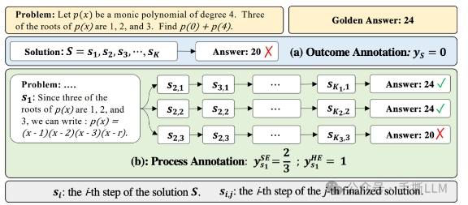

#### 2.3.6 OpenAI PRM 建模 和 Math-Shephered PRM 建模 的区别？

可以看出这两种PRM建模是有差异的，建模分数分别是受前向和后向步骤影响。

1. OpenAI PRM ：关注前向和当前step的合理性。
2. Math-Shephered PRM ：关注当前状态对后向推导和最终答案的影响

如果在step-wise Inferece时，前向PRM分数是基于确定性step往后进行逐步推理，后向是基于当前步骤对胜利的预判再选择是否执行这个步骤。

#### 2.3.7 介绍一下 PRM使用实例？

如果我们在 Inference 时进行 step-wise 的 Rejection Sampling，在多条回答中哪一个作为最终的答案？

这里涉及到Paper中5.1章节里的 Answer aggregation

- **Step-wise aggregation**: 对于一条路径上的所有 step-reward 进行累积，总奖励最高的路径被当成是best回答，而 Scaling LLM Test Time 里用 last-step reward 进行判别效果更好(下图)；

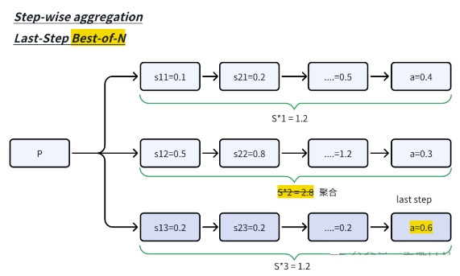

- **Inter-answer aggregation**： 对于Best-of-N是取last step最大奖励值作为回答，而Scaling LLM Test Time使用Best-of-N Weighted的版本来判别，具体是Rejection Sampling多条最终回答，按照投票规则来选择如对于A答案总分0.4+0.3, 而D答案0.6<A答案0.7。

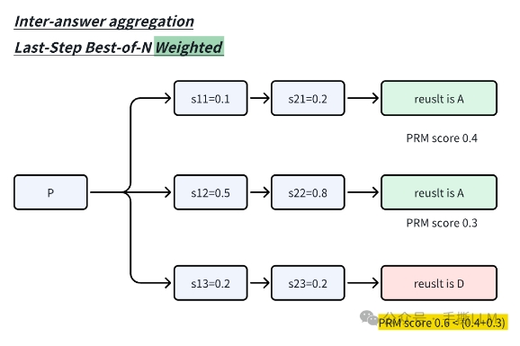

Scaling Test-Time采用Inter-answer aggregation。

#### 2.3.8 介绍 PRM数据格式？

一个指令模型需要学会step-by-step生成，在initial training时，可以用PRM800数据集进行训练step-wise的输出，以换行符\n作为step的暂停符号。

> When generating the samples, the base model is prompted to output answers in newline separated a step-by-step format, as done in Lightman et al.

如果我们对于一个段落的文本，可以给到GPT-4来进行处理成step-by-step的标注。

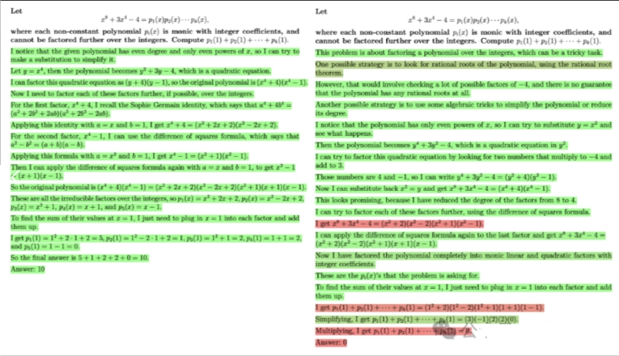

### 2.4 搜索方法 Process-Searching

在有PRM的基础上设计搜索算法，注意到这里的LLM实际上没有经过RL训练，也可以做Searching against a Verifier，论文里提供了三个PRM-Searching方法：

1. **Best-of-N**：生成时可以step-wise的rejection sampling，**采用Inter-answer aggregation策略筛选出答案**；
2. **Beam Search**：采用束搜索来产生路径。实际上这里的**Beam Search是在PRM分数上进行扩展节点的，而不是基于路径上的概率和**；
3. **Lookahead Search**：前瞻搜索是在深度时rollout多步后判别深度的PRM分数，依据PRM分数从深度t的选择节点。这里的是前瞻的步数；**实际上实验效果并不如beam search好，且前瞻搜索和标准的MCTS不是一码事，可以skip掉**。

特别地，PRM Search图示里Lookahead里，黄色的intermediate solution step的是不判别的，而是对rollout的后续节点判别。

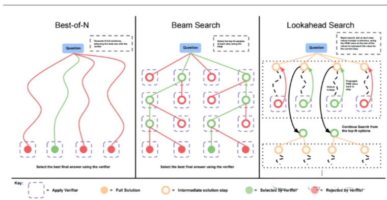

#### 2.4.1 介绍一下 Best-of-N Weighted？

按照图示，可以step-wise进行生成N条候选路径，仅在每条路径的最后一步进行PRM评估和Inter-Answer Aggregation投票，beam和look ahead都是同种判别最后的答案。

Best-of-N的生成的特点在于：

1. 可以并行生成，计算量FLOPS恒定，但耗时可以随着并行而降低耗时
2. Prefix的Prefill KV-Cache可以复用，如VLLM

#### 2.4.2 介绍一下 Beam Search PRM？

Beam Search采用的类似 BFS-V，配置N条束和M的束宽度，我们使用N=4， M=2来示例，N/M=2. 算法流程如下：

1. 在第1步里采样4条束；
2. 在第t步里, 采样计算4个节点PRM value，（也可以是从prefix到当前step的reward-to-go的总和）; 在LLM里通常是对token计算已decoding的路径概率和；
3. 筛选PRM分数前2个节点作为t的节点候选；
4. 在这2个节点各扩展2个节点，总共有4条路径。再重复2-4直至遇到终止步骤；

下图对比Beam Search和本文的Beam Search PRM

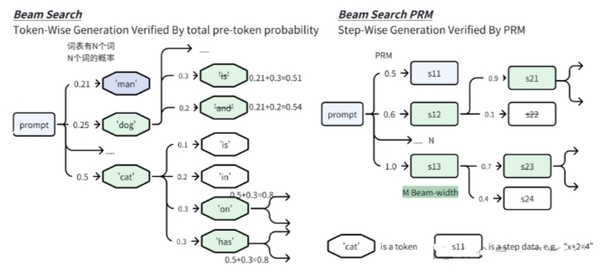

#### 2.4.3 介绍一下 LookAhead Search？

LookAhead Search是MCTS的一种特例， **在扩展节点时如果边采样多个step边verify，那么效率会比较低**.

那么可以继承Beam Search每个束多生成个step(rollout)，在第k-step节点来评估。这里的rollout细节是生成时温度设为0减少方差。这里的时退化成标准的Beam Search。

#### 2.4.4 对比 Best-of-N Weighted 和 Beam Search PRM 和 LookAhead Search 效能？

对比3中PRM Search方法的性能。横坐标为生成路径条数(budget)，纵坐标为数学任务的测试准确率。简要总结：

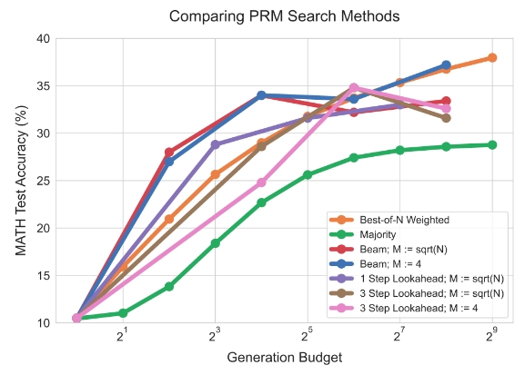
> 计算量少时Beam Search更有优势，计算量充足时上Best-of-N，另外Lookahead优势不明显

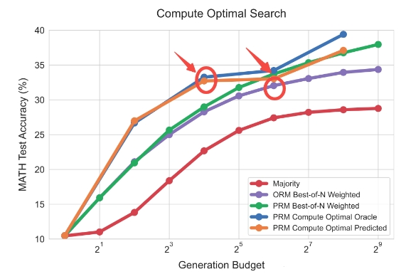
> Best-of-N的PRM搜索，达到与baseline相当的性能，减少4倍的计算量。这里的结论是实验统计得来，注意不是根据问题能自适应的估计时间消耗。

这里将紫色ORM Best-of-N Weighted当成是baseline， 同等性能使用PRM搜索的话的搜索量级优于baseline的.

### 2.5 不同的PRM search在各难度问题的表现

如果我们有一个问题集，我们想对问题做分类（简单、中等、难），可以分为两种

- 一种是人工标注
- 一种是自动化标注

问题难度定义：

- **oracle difficulty**：人工进行辨别问题难度，根据经验打标签，作为分类ground truth
- **model-predicted difficulty**：对于一个问题，我们采集Rejection Sampling N=2048条回答，如果回答正确数量是i条那么 round(i/(N/5))+1 即是问题的难度等级。

> 举例：划分5个难度等级。N条回答有1000个答案正确，那么通过上式难度为3. 可见这里的难度含义是由搜索难度来体现的。

我们接下来观察PRM search方法在各个难度的表现，横轴的1-5代表难度等级，越大难度越高。注意到每个难度有4个bar，这里的bar代表搜索量级{4,16,64,256}

1. 简单的问题(1,2): 在难度1里 PRM Search反而不如最基础的Majority(greedy-search)
2. 中等问题(3,4):在难度3里Best-of-N Weighted增加搜索量普遍好于beam search
3. 难题(5): Best-of-N失效，**模型reasoning能力有限的情况下，堆叠test-time是无效的**。

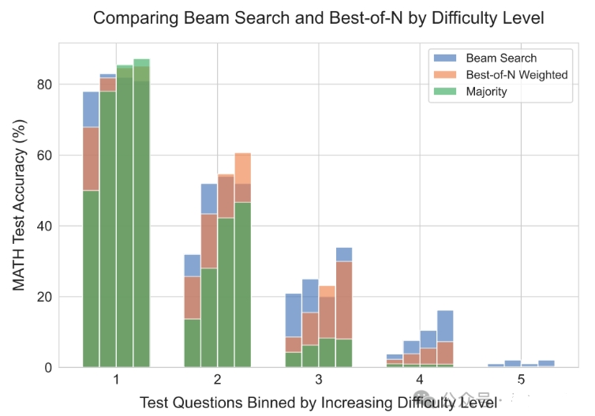

### 2.6 小结

1. 在Train-Free的Scaling Test Time里，Best-of-N weighted + PRM相较baseline Best-of-N weighted + ORM提速4倍;
2. 这里的PRM建模是估计reward-to-go，不需要人工标注，但是自动化逐个step的rollout+打分仍需要较多的计算资源;
3. 仅靠test-time的搜索能力，已经能提升性能了。但是BoN的计算成本随幂级成本增长收益变小，还是得回到训练来本质上提高模型推理能力;
4. 从infra的角度来说， GPU集群适合Best-of-N，边缘设备适合Beam-search

## 三、方法二：推理能力增强

### 3.1 什么是提议分布 ？

提议分布：指的是模型在固定Prompt下的输入分布。Best-of-N在难题的表现上，虽然可以并行的去采样N条输出，但是输出也是在一个固定分布下。

### 3.2 什么是 修改提议分布 ？

那么**在Test时，如何动态的改变输入分布,从而改变输出分布**。实际上我们在以往的inferece技术都涉及到改变输入分布的技巧，从In-Context Learning说起，仅需改变条件项就能达到修改提议分布，这些提议分布修改是显式的

1. **System Prompt**：,这里的system prompt例如“你需要安全的回答问题”，“你是一个代码专家”
2. **Few-Shot Prompt**： ,这里的e 为示例,n 为示例个数
3. **Chain of Thought Prompt**： ,这里的s序列为示例的step-wise思维链输入，同样可以有多个CoT示例

以上的提议修改方案都是静态的，即是运行模版设定好了对应提示词；那么我们要如何动态改变输入分布？

### 3.3 什么是 Self-Improve ？

要提升模型的Reasoning能力，就改变Proposal Distribution，如果模型本身的Reasoning能力不强，是走不远的。

在Self-Improve里采用revision+refine的机制来改变输入分布；实现方法是在线采样回答，如果回答错误，就将错误的回答并入到输入里，可见这里的输入分布时动态修改的。Self-improve的目的是让模型能够revision错误的输出从而refine出正确的答案。这里的提议分布修改是隐式的。

所以还是得训练，使得模型学习到如何在context里进行refine。我们根据图示简述self-improve的迭代提升方法

在第一轮里我们可以根据x生成回复y1，在第二轮可以SFT y1，并且基于{x,y1}生成y2，这里在生成y2时，输入分布就已经改变了。

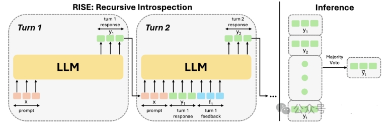
> 注意：这里的y1和y2是不同轮次的回答，不是逐步推理粒度上的reasoning step关系

### 3.4 什么是 revision 数据收集 ？

同理Scaling LLM Test Time的模型要提升resonning能力，也同样上self-improve训练，面临的问题是数据采集的效率太慢。

self-improve并不像Best-of-N可以parallel采集，实际上是迭代的on-policy的refine数据并且finetune模型，串行的获取数据。问题是如何高效的合成revision数据？

下图左下方为self-improve的生成过程。右边是Scaling LLM Test Time优化的合成数据方法。

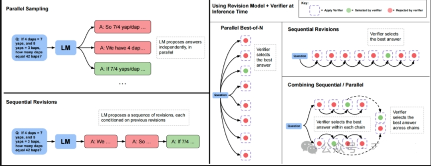

### 3.5 什么是 revision model结果 ？

在获取到revision data后，便可以进行SFT训练和推理。

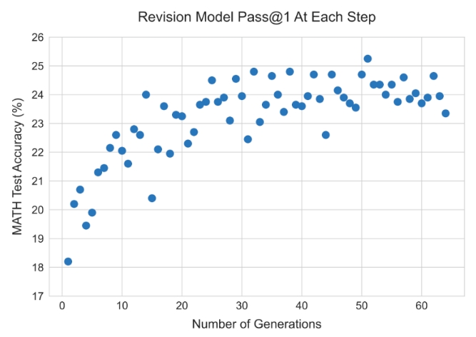
> 横坐标为sequential的step次数， 在inference时配置Parallel4*Sequential Step64，即是每次会产生4个回答，verifier选择最好的回答。

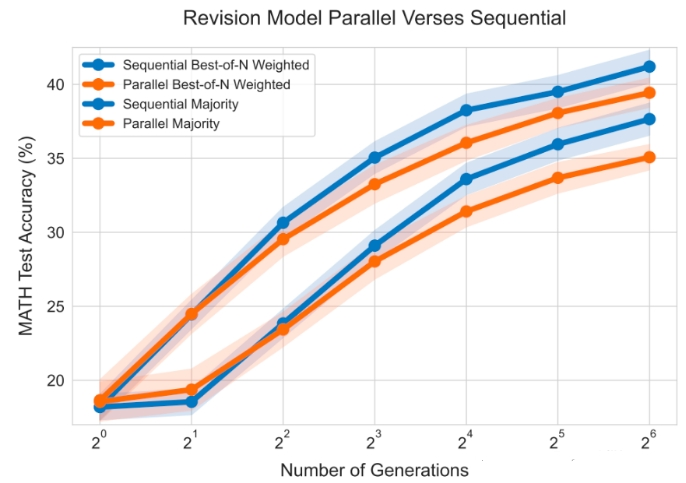
> 右边为Sequential Best-of-N在条采样数据上优于Parallel

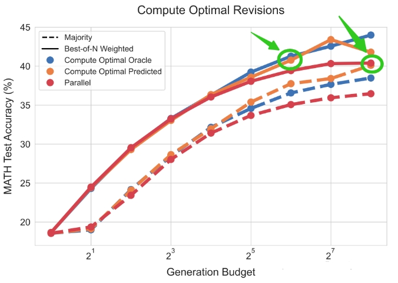
>compute-optimal scaling实验图的绿色标注：同样将Combine对比Parallel的baseline，橙色的条答案性能优于红色，即是Sequential计算效率高于Parallel4倍。

### 3.6 什么是 verifier 训练方案 ？

在Appendix.J里Revision Model训练过程里的verifier用的是ORM

> We therefore, trained a separate ORM verifier to use with our PaLM 2-S* revision model. We could have trained a PRM as well, but opted for an ORM due to the high cost of generating per-step PRM labels

### 3.7 小结

1. reasoning性能的提升，离不开本身的模型的提升。哪怕是SFT只要会造数据，如revision数据，就可以让模型学习到refine prompt能力
2. 改版的self-improve优化了造数据流程和推理流程，能结合并行采样和序列采样的特点。这里的数据都是完整的answer级别
3. 所训练的revision model在inference时效率提升4倍。

## 四、Pretrain Compute V.S. Scaling Test Time

### 4.1 Exchange Rate度量

在LLM 里喜闻乐见的话题是小模型如何战胜大模型。在Scaling LLM Test-Time 同样探究问题：**小模型+Scaling Test Time能否战胜大模型**。如果有显著的提升，那么在部署端可减少显存占用，但FLOPS不一定能减少。

首先需要考虑的是度量模型的计算量：

1. Pretrain (X)+ inference(Y)
2. 当模型参数提升M倍时那么计算量为：M (Pretrain (X)+ inference(Y))
3. 如果不提升模型参数量， 只Scaling Inference 计算量，则 X+MY

文章里定义一种交换率(exchange rate)来度量大小模型FLOPS差异

训练和推理时其中为为模型参数量，分别为预训练的token数量和推理的token数量。

如果设置M因子，那么增大模型尺寸计算量为, 而小模型要增加k倍Inference time能持平，我们可以构造等式

原文中对小模型的inference time的缩放因子是上面计算得到的。

### 4.2 小模型推理token增加14倍就能战胜大模型？

进一步设定比例R, 当R>>1时，意味着增加更多的Test-Time

我们来**观测调整R时，来观测小模型需要增加k倍inference Test-Time才能与M倍大的模型性能相当**。按照实验我们可以来这样来设置，一个大模型参数较小模型参数M已知，大模型的进行greedy生成，那么、已知，同时对小模型同样做条self-improve 生成，能够得到个token，那么我们有确切的R关系时，从而可以通过公式计算k值

下图左图我们只看Revisions推理的level2难度的R>>1的纵线，当 $2^4$ 步self-improve推理时(圆点)，性能接近大模型（星），此时的k值可以计算增加出14倍的inferece time。

下图右图实际上更残酷，PRM search并不理想， 小模型如果没有提升reasoning的trick的话，拿小模型Searching到天荒地老都没法比肩大模型。

在medium以上的难题上，明显R<<1时，Pretrain的收益远优于小模型+Scaling Test-Time。

### 4.3 完整的性能表现

在paper里的Fig.1 我们就可以读懂了：

1. self-improve比在固定的proposal distribution生成效果更好，在对抗不同尺寸模型上的FLOPs， self-improve也在难题上有所提升
2. 在Search-based的方法里， PRM>ORM搜索出的性能更好，但是对抗大的模型上，在难题上难以提升reasoning性能。

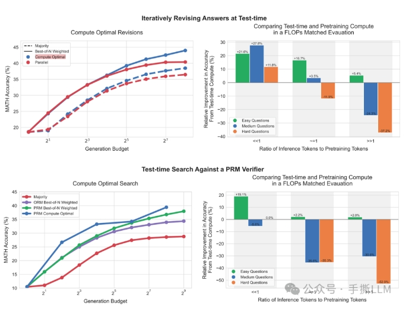

### 4.4 小结

小模型通过Scaling LLM Test Time能在中等以下题目战胜纯贪心解码的大模型，在难题上受限小模型自身的resoning能力无法提升性能。等量的计算量不能等同性能（no exchangeble）。

这里得到结论，小模型在计算量与大模型相当情况下，小模型性能可以比肩14x的大模型。

## 五、Scaling LLM Test-Time总结

1. Scaling LLM Test-Time不能脱离本身模型的resoning能力，模型本身得学会resoning能力，在搜索时收益越大。
2. 不用RL或标准的MCTS也可以做LLM Searching
3. 本文的结构的框架：PRM训练(verifier)+模型自身Resoning提升(training)+高效搜索算法(Best-of-N并行)+使用已知信息(self-improve)

## 致谢

- Scaling LLM Test-Time：谁说类o1推理一定要用RL??? https://blog.csdn.net/m0_59235945/article/details/142830701


