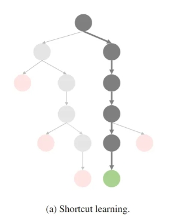
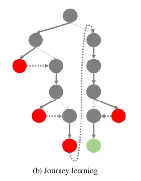
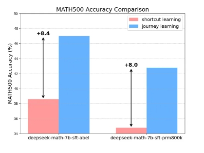
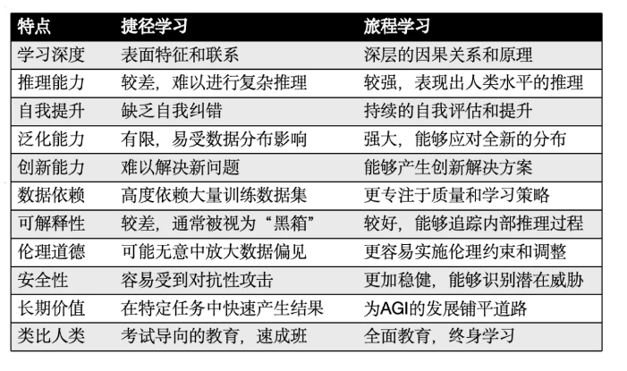
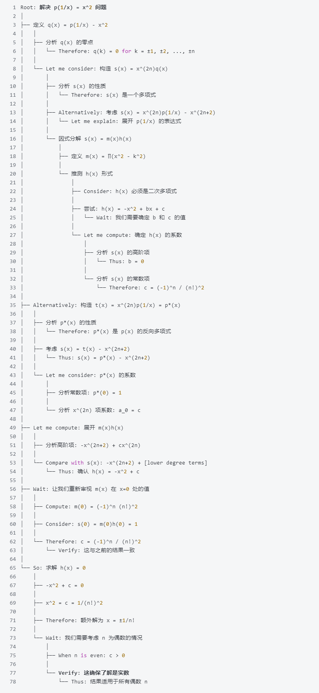
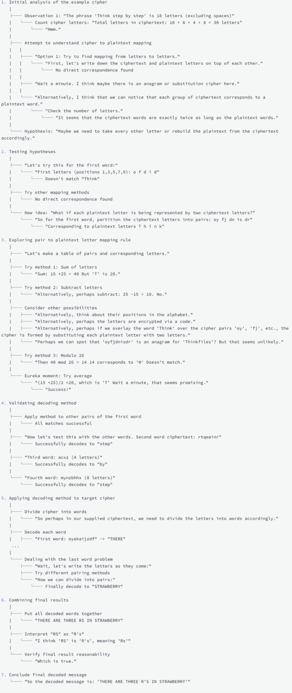
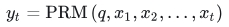
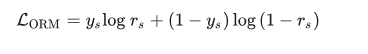
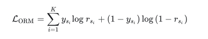
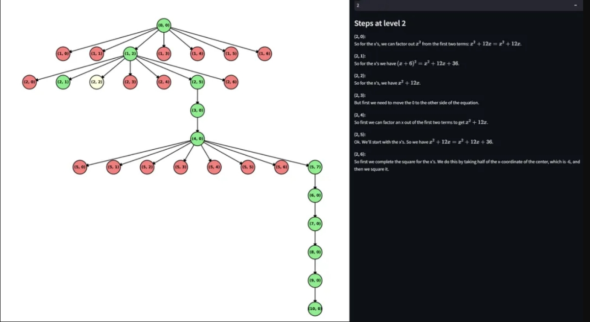

# 千面郎君 篇（三十一章）—— OpenAI o1 篇

- [千面郎君 篇（三十一章）—— OpenAI o1 篇](#千面郎君-篇三十一章-openai-o1-篇)
  - [一、Shortcut learning (捷径学习) vs Journey learning (旅程学习)](#一shortcut-learning-捷径学习-vs-journey-learning-旅程学习)
    - [1.1 Shortcut learning (捷径学习)](#11-shortcut-learning-捷径学习)
      - [1.1.1 什么是 Shortcut learning (捷径学习)？](#111-什么是-shortcut-learning-捷径学习)
      - [1.1.2 Shortcut learning (捷径学习) 包含哪些关键特征？](#112-shortcut-learning-捷径学习-包含哪些关键特征)
      - [1.1.3 Shortcut learning (捷径学习) 优点是什么？](#113-shortcut-learning-捷径学习-优点是什么)
      - [1.1.4 Shortcut learning (捷径学习) 缺点是什么？](#114-shortcut-learning-捷径学习-缺点是什么)
    - [1.2 Journey learning (旅程学习)](#12-journey-learning-旅程学习)
      - [1.2.1 什么是 Journey learning (旅程学习)？](#121-什么是-journey-learning-旅程学习)
      - [1.2.2 Journey learning (旅程学习) 包含哪些关键特征？](#122-journey-learning-旅程学习-包含哪些关键特征)
      - [1.2.3 Journey learning (旅程学习) 优点是什么？](#123-journey-learning-旅程学习-优点是什么)
    - [1.3 Shortcut learning (捷径学习) vs Journey learning (旅程学习)](#13-shortcut-learning-捷径学习-vs-journey-learning-旅程学习)
  - [二、o1 的长思维链篇](#二o1-的长思维链篇)
    - [2.1 o1 的长思维链是什么样子？](#21-o1-的长思维链是什么样子)
    - [2.2 长思维 (Long thought) 是如何工作的？](#22-长思维-long-thought-是如何工作的)
    - [2.3 如何构建长思维？](#23-如何构建长思维)
  - [三、过程奖励模型 (PRM)篇](#三过程奖励模型-prm篇)
    - [3.1 为什么需要 过程奖励模型 (PRM)？](#31-为什么需要-过程奖励模型-prm)
    - [3.2 过程奖励模型 (PRM) 作用是什么？](#32-过程奖励模型-prm-作用是什么)
    - [3.3 过程奖励模型 (PRM) 目标值定义？](#33-过程奖励模型-prm-目标值定义)
    - [3.4 过程奖励模型 (PRM) 思路介绍？](#34-过程奖励模型-prm-思路介绍)
    - [3.5 如何训练 过程奖励模型 (PRM) ？](#35-如何训练-过程奖励模型-prm-)
      - [3.5.1 介绍一下 ORM 目标函数？](#351-介绍一下-orm-目标函数)
      - [3.5.2 介绍一下 PRM 目标函数？](#352-介绍一下-prm-目标函数)
      - [3.5.3 如何构建 PRM 训练数据？](#353-如何构建-prm-训练数据)
      - [3.5.4 PRM 训练细节？](#354-prm-训练细节)
        - [3.5.4.1 将输入数据转化为模型输入（token id）](#3541-将输入数据转化为模型输入token-id)
        - [3.5.4.2 利用 PRM 对每个步骤打分](#3542-利用-prm-对每个步骤打分)
        - [3.5.4.3 完整代码](#3543-完整代码)
  - [四、on-policy 推理树篇](#四on-policy-推理树篇)
    - [4.1 如何构建 on-policy 推理树？](#41-如何构建-on-policy-推理树)
    - [4.2 如何从推理树中推导出 Long Thought？](#42-如何从推理树中推导出-long-thought)
  - [五、如何评估尝试方法？](#五如何评估尝试方法)
  - [六、如何训练模型？](#六如何训练模型)
    - [6.1 第一阶段：监督微调（SFT）](#61-第一阶段监督微调sft)
    - [6.2 第二阶段：直接偏好学习（DPO）](#62-第二阶段直接偏好学习dpo)
  - [七、什么是人类和 AI 协同标注的有效策略？](#七什么是人类和-ai-协同标注的有效策略)
  - [致谢](#致谢)

## 一、Shortcut learning (捷径学习) vs Journey learning (旅程学习)

### 1.1 Shortcut learning (捷径学习)


> 图 1 Shortcut learning (捷径学习)

#### 1.1.1 什么是 Shortcut learning (捷径学习)？

- 介绍：大多数现有的机器学习或大模型训练方法（如监督式微调）都可以被归类为 "捷径学习" (Shortcut Learning)，即**模型学习到达正确答案的直接路径**。

#### 1.1.2 Shortcut learning (捷径学习) 包含哪些关键特征？

- 捷径学习具有以下几个关键特征：
  - (1) **注重快速结果**：强调在短时间内达到特定的性能指标或完成特定任务。
  - (2) **高度依赖数据**：性能改进通常依赖于增加训练数据量，而非改进学习算法本身。
  - (3) **泛化能力有限**：在训练数据分布之外的场景中，性能可能会急剧下降。
  - (4) **缺乏自我纠正能力**：这些系统通常缺乏识别和纠正自身错误的能力。

#### 1.1.3 Shortcut learning (捷径学习) 优点是什么？

- 优点：这种传统范式虽然**在特定、明确定义的任务中可能有效**；

#### 1.1.4 Shortcut learning (捷径学习) 缺点是什么？

- 缺点：但在**面对复杂、动态和开放性问题时显示出明显的局限性**。尽管捷径学习推动了人工智能的许多进步，但它难以产生真正智能和可靠的人工智能系统，无法应对现实世界挑战的复杂性。随着我们追求更高级形式的人工智能甚至超级智能，这种方法的局限性变得越来越明显。

### 1.2 Journey learning (旅程学习)


> 图 2 Journey learning (旅程学习)

#### 1.2.1 什么是 Journey learning (旅程学习)？

Journey learning (旅程学习)旨在**使人工智能系统能够通过学习、反思、回溯和适应不断进步，就像人类一样，从而展现出更高水平的智能**。

#### 1.2.2 Journey learning (旅程学习) 包含哪些关键特征？

**Journey learning (旅程学习)  范式**：它鼓励模型不仅学习捷径，还要学习完整的探索过程，包括试错、反思和回溯。

#### 1.2.3 Journey learning (旅程学习) 优点是什么？

Journey learning (旅程学习) 仅使用 327 个训练样本，不借助任何额外训练技巧，Journey learning (旅程学习) 在 MATH 数据集上的表现就超过了传统监督学习 8% 以上，展示了其极其强大的潜力。作者也认为这是 o1 技术中最关键的组成部分。


> 图："捷径学习"(Shortcut Learning) 和 "历程学习"(Journey Learning) 在 MATH500（Lightman 等人，2024 年）上的表现。

### 1.3 Shortcut learning (捷径学习) vs Journey learning (旅程学习)


>表：捷径学习和旅程学习的多维度比较

## 二、o1 的长思维链篇

### 2.1 o1 的长思维链是什么样子？

首先看一下o1 的长思维链长什么样子，下面是一个具体例子。

- 问题：p(1/x) = x^2
- OpenAI o1 真实推理过程的结构化形式本质是一颗搜索树（数学题）


> 图 3 数学题

- OpenAI o1 真实推理过程的结构化形式本质是一颗搜索树（破译题目）


> 图 4 破译题目

从图 4 中可以看出，除了常见的连接词如 "and" 和 "so" 之外。还出现了"wait", Alternatively" 等特殊的关键词，**"像 "wait" (表示反思)和 "Alternatively"(表示探索不同路径) 这样的关键词是模型能够进行反思和自我纠正的重要指标**。这表明模型具有更深入的理解和更细致的推理方法，因为模型不仅仅是遵循线性路径，还能够基于反思重新考虑和完善其方法。

所以可以看出长思维数据应具有以下特征：

- **迭代式问题解决**：模型首先定义函数，然后逐步探索相关表达式，将复杂方程分解为更简单的组成部分，反映了一种结构化和有条理的方法。 
- **关键思维指标**：使用 "Therefore" 表示结论，"Alternatively" 探索不同路径，"Wait" 表示反思，以及 "Let me compute" 过渡到计算，突出了模型的推理阶段。 
- **递归和反思方法**：模型经常重新评估和验证中间结果，使用递归结构确保一致性，这在严谨的数学推理中很典型。 
- **假设探索**：模型测试不同的假设，随着获得更多信息而调整其方法，展示了推理过程中的灵活性
- **结论和验证**：最后，模型解方程并验证结果，强调在完成之前验证结论的重要性。 

### 2.2 长思维 (Long thought) 是如何工作的？

虽然 OpenAi 并没有透露出对应的工作，这里只是针对该问题做了一些猜想：

**o1 长思维方法的显著成功可以归因于在上述中介绍的旅程学习 (Journey Learning)**。

与传统的捷径学习 (Shortcut Learning) 不同，**旅程学习允许模型探索整个决策轨迹，模仿人类的问题解决过程**。

**这种全面的探索使 o1 能够考虑多种解决方案路径，从错误中学习，并理解完整的问题解决过程**。通过经历正确和错误的路径，模型发展出强大的错误处理和自我纠正能力，增强了其适应新挑战的能力。

**这种方法培养了对问题领域更深入的理解，不仅仅是知道正确答案，而是理解为什么以及如何得出答案**。旅程学习过程密切模拟人类的认知过程，包含试错、反思和调整。这大大增加了模型输出内容的可解释性，因为 o1 可以提供详细的解决步骤并解释其推理过程，包括如何从错误中恢复。因此，基于旅程学习的 o1 长思维过程不仅仅是计算时间的扩展，还代表了一种彻底的、人类般的推理探索。这种方法使 o1 能够处理更复杂的问题，提供更可靠和可解释的答案，并在面对新挑战时表现出更大的适应性，从而解释了它在各种任务中的卓越表现。

### 2.3 如何构建长思维？

通过 reflection 和 backtracking 等行动来构建 长思维 (Long thought) 是 Journey learning (旅程学习)的关键要素。实现该目标的思路如下：

- 思路 1: Tree Search with LLM and Reward（基于 LLM 和奖励的树搜索）

根据在 Q1 中对长思维的观察，其最显著的特征是**在推理产生错误时或遇到冗余的推理步骤时尝试反思和回溯**。

这类似于在推理树上搜索问题的解决方案，**在错误节点处回溯，直到找到正确的解决路径**。

为实现这一点，需要构建一棵推理树，其中根节点代表问题，其他每个节点代表一个推理步骤。从根到任何节点的路径代表从问题到该结论的推理过程。

此外，**回溯和反思必须基于错误的推理步骤，这需要一个更细粒度的奖励模型（即过程级）来指示树中每个节点的正确性。通过在具有过程级奖励的推理树上执行搜索算法，可以将错误步骤整合到思维链中，从而构建包含回溯和反思等行为的长思维**。

- 思路2: Propose-Critique Loop（提议 - 批评循环）

尝试 1 通过基于预定义规则在树上执行搜索来构建长思维，但这**限制了回溯和反思等行为的自由度**。

因此，思路2（Propose-Critique Loop） 尝试让模型选择自己当前的行为。团队构建了一个 Propose-Critique Loop，其中**为模型预定义了一些可能的行为（即继续、回溯、反思、终止），并让模型自身选择行为来构建推理树。如果树没有达到最终答案，可以将这个负面信号告知模型，引导它反思和纠正其方法**。

- 思路3: Multi-Agent Approach（多智能体方法）

基于 reasoning tree（推理树）构建 长思维 (Long thought) 存在几个挑战：

1. 存在许多冗余的无效节点；
2. 存在不依赖于反思行为的推理步骤，从而引起构建的长思维逻辑不一致；

为解决这个问题，思路3: Multi-Agent Approach（多智能体方法） 设计了一个**利用多智能体辩论的算法**：

1. 一个智能体充当策略模型，持续推理；
2. 另一个智能体充当评论模型，指示策略模型是否应该继续当前推理或执行回溯等行为。

两个智能体进行持续对话，在找到正确答案时自然构建长思维数据集。

- 思路4: Human Thought Process Annotation（完整的人类思维过程注释）

当人类处理推理问题时，他们通常不会不断地向前推理直到解决问题或失败；相反，**他们在无法继续时会反思、回溯和重写推理**。

这种行为与长思维的特征高度一致。因此，可以忠实且全面地记录人类解决推理任务的过程，从而产生高质量的长思维。

## 三、过程奖励模型 (PRM)篇

### 3.1 为什么需要 过程奖励模型 (PRM)？

为了得到这样的细粒度的奖励模型，就需要训练一个过程奖励模型 (PRM)。PRM 能够对模型生成的每一步进行打分。

### 3.2 过程奖励模型 (PRM) 作用是什么？

在过程奖励模型 (PRM) 中，主要作用是**判断解决方案的步骤是否在正确的轨道上**。

### 3.3 过程奖励模型 (PRM) 目标值定义？

因此，PRM 会输出一个 0 到 1 之间的分数，作为当前解决过程的正确性指标。

### 3.4 过程奖励模型 (PRM) 思路介绍？

给定一个问题 q 及其解决步骤序列 $x_1 -> x_t$，**PRM 会为每一步计算出一个分数，这个分数代表了当前问题解决过程的正确性**。因此，问题被重新框定为


> 图 5 过程奖励模型 (PRM)问题定义

这可以视为一个**二元分类任务**。**PRM 通过在大模型上进行 SFT 来训练，将正确或错误的判定作为分类标签。然后，使用 LLM 来预测每一步的下一个步骤是否正确**。

> PRM 的打分示意图


> 图 6 使用 PRM 对每个步骤进行打分

从上图 可以看到， PRM 会为每个步骤打分（中间过程的打分没有做 softmax），最后输出的得分为[0.622, 0.349]，表示正确的概率为 0.622。

### 3.5 如何训练 过程奖励模型 (PRM) ？

验证大模型结果的好坏，一般有两种不同的验证器：

- **结果奖励模型 ORM**：对整个解决方案进行评分；
- **过程奖励模型 PRM**：对推理过程中的每个步骤进行评分。

#### 3.5.1 介绍一下 ORM 目标函数？

对于 ORM，给定一个数学问题 q 和其解 s ，ORM（Q×S→R）为 s 分配一个单一实数值，已表明 s 是否正确。ORM 通常使用交叉熵损失进行训练：


> 图 7 ORM 目标函数

其中 $y_s$ 是标签，表示 $s$ 是否正确，$r_s$ 是 ORM 模型分配给 $s$ 的 sigmoid 分数。

#### 3.5.2 介绍一下 PRM 目标函数？

PRM 更进一步，PRM 为 s 的每个推理步骤分配一个分数，通常使用以下方法进行训练：


> 图 8 PRM 目标函数

其中 $y_s$ 是步骤 $s_i$ 的标签，表示步骤 $s_i$ 是否正确； $r_s_i$ 是 PRM 为步骤 $s_i$ 分配的 sigmoid 分数。

#### 3.5.3 如何构建 PRM 训练数据？

为了训练 PRM，我们需要一份为每个步骤分类（正确或错误）的标签数据。与 ORM 相比，PRM 可以提供更详细和可靠的反馈。但是 PRM 对数据要求极高，需要为每个步骤构建标签，非常耗时耗力。

目前开源的主要是 OpenAI 2023 年基于 MATH 构建的样本 PRM800K，包含了 800K 个步骤级别的正确性标签，这些标签针对的是 MATH 数据集中问题的解决方案。

> 注：PRM800K 数据集 https://github.com/openai/prm800k

另外一份数据是北京大学开源的数据集 Math-Shepherd，包含了 400k 个步骤级别的正确性标签，这些标签针对的是 MATH 和 GSM8K 数据集中问题的解决方案。需要强调的是，PRM800K 都是人工标注的，而 MATH-Shepherd 是机器标注的。

> 注：Math-Shepherd 数据集 https://huggingface.co/datasets/peiyi9979/Math-Shepherd?row=24

需要强调的是，PRM800K 都是人工标注的，而 MATH-Shepherd 是机器标注的。

下面是经过处理后的数据格式：

```s
{
    'question': 'Three pencils and a jumbo eraser cost $\\$1.24$. Five pencils and a jumbo eraser cost $\\$1.82$. No prices include tax. In cents, what is the cost of a pencil?',
    'process': "Let's call the price of a pencil p and the price of a jumbo eraser e. Then we can write two equations. \n\n\n\n\n The first equation is $3p+e=124$. \n\n\n\n\n To solve this system, let's subtract the first equation from the second equation. This will eliminate e. \n\n\n\n\n $5p+e-3p-e=1.82-1.24$. \n\n\n\n\n This simplifies to $2p=0.58$. So $p=0.29$. \n\n\n\n\n We could also solve this system by substitution. \n\n\n\n\n",
     'label': ['+', '-', '+', '+', '+', '+']
}
```

> 其中 "\n\n\n\n\n" 表示 step 的分隔符，label 中 "+"表示步骤正确，"-" 表示步骤错误。

有了训练数据后，接下来就是的问题就是如何训练 PRM 模型。

#### 3.5.4 PRM 训练细节？

##### 3.5.4.1 将输入数据转化为模型输入（token id）

假设输入的一个样本为：

```s
step_tag = '\n\n\n\n\n' #
step_tag_id = 76325  # 步骤标签
pog_id = 488 # "+" 表示正例，对应的 token id 是 488
neg_id = 481 # "-" 表示负例，对应的 token id 是 481

query = "1 + 1 + 2=?"
output = "Step 1: 1 + 1 = 2. \n\n\n\n\n Step2: 2 + 2 = 5 \n\n\n\n\n"
input = "1 + 1 + 2=? Step 1: 1 + 1 = 2. \n\n\n\n\n Step2: 2 + 2 = 5. \n\n\n\n\n"
```

其中 "\n\n\n\n\n" 是步骤分隔符，input 是将 query 和 output 拼接后的结果。

将 input 转化为 token id：

```s
tokenized_inputs = {
    'input_ids': [101, 102, 101, 103, 104, 105, 106, 101, 102, 101, 103, 76325, 103, 102, 103, 104, 107, 76325],  
}
```

接下来是最重要的步骤，构建 label，具体做法是**在步骤标签的位置设置为正例或负例的 id**，其他位置保持为-100，表示只计算标签位置的 loss：

```s
# 在步骤标签的位置被设置为正例或负例的id，其他位置保持为-100，表示只计算标签位置的loss
tokenized_inputs['labels'] = [-100, -100, -100, -100, -100, -100, -100, -100, -100, -100, -100, 488, -100, -100, -100, -100, -100, 481]  

indices = [11,  17]  # 这些是 step_tag_id 在 input_ids 中的索引
candidate_tokens = [488, 481]   # 表示步骤 1 和 步骤 2 的 label id，其中 488 表示正例，481 表示负例
```

接下来是构建 attention_mask，需要将标签位置 mask 掉，使得模型在计算注意力时忽略这些位置。

具体原因如下：

- **避免标签泄露**：如果模型在训练或评估过程中能够“看到”这些标签位置的值（例如 488 或 481），那么模型可能会利用这些信息来优化其输出，从而导致标签泄露（label leakage）。

attention_mask 经过处理后的结果如下，其中位置为 0 的部分是标签位置。

```s
    tokenized_inputs['attention_mask'] = [1, 1, 1, 1, 1, 1, 1, 1, 1, 1, 1, 0, 1, 1, 1, 1, 1, 0] 
```

在得到 input_id, label, attention_mask 之后，模型输入的完整数据如下：

```s
tokenized_inputs = {
    'input_ids': [101, 102, 101, 103, 104, 105, 106, 101, 102, 101, 103, 76325, 103, 102, 103, 104, 107, 76325],  
    'labels': [-100, -100, -100, -100, -100, -100, -100, -100, -100, -100, -100, 488, -100, -100, -100, -100, -100, 481],
    'attention_mask': [1, 1, 1, 1, 1, 1, 1, 1, 1, 1, 1, 0, 1, 1, 1, 1, 1, 0] 
}
```

整个数据处理的代码如下所示：

```s
good_token = '+'
bad_token = '-'
step_tag = '\n\n\n\n\n' #ки
step_tag2 = '\n\n'

def preprocess_function(example):
    input = f"{example['question']} {example['process']}"
    tokenized_inputs = tokenizer(
        input, 
        truncation=True, 
        padding='max_length', 
        # padding=True,
        max_length=2048,
    )
    
    def find_all_indices(lst, element):
        return [i for i, x in enumerate(lst) if x == element]
    
    length = len(tokenized_inputs['input_ids'])
    # print(length)
    indices = find_all_indices(tokenized_inputs['input_ids'],step_tag_id)
    
    if len(indices) != len(example['label']):
        # print(example)
        example['label'] = example['label'][:len(indices)]
    
    assert len(indices) == len(example['label'])
    
    tokenized_inputs['labels'] = [-100] * length
    # tokenized_inputs['attention_mask'] = [1] *length
    # print(len(indices))
    for i in range(len(indices)):
        if example['label'][i] == '+' or example['label'][i] == 1:
            tokenized_inputs['labels'][indices[i]] = candidate_tokens[0]
        elif example['label'][i] == '-' or example['label'][i] == 0:
            tokenized_inputs['labels'][indices[i]] = candidate_tokens[1]
        else:
            raise ValueError('label is wrong')
        tokenized_inputs['attention_mask'][indices[i]] = 0
    # tokenized_inputs['labels'] = [-100] *(length-1) + tokenized_inputs['input_ids'][length-1:]
    
    return tokenized_inputs
```

在将输入数据转化为模型输入之后，就可以训练 PRM。训练完成之后，就可以用来对每个步骤进行打分。

接下来介绍下 PRM 是如何对每个步骤进行打分。

##### 3.5.4.2 利用 PRM 对每个步骤打分

假设模型的 logits 输出如下所示：

```s
gold = tensor([1, 0])  # 如果标签是488，则gold为1，否则为0
logits = torch.tensor([
    # steps1
    [
        [0.1, 0.2, 0.3, ...],  # 第一个位置的logits
        [0.4, 0.5, 0.6, ...],  # 第二个位置的logits
        [0.7, 0.8, 0.9, ...]   # 第三个位置的logits
        ...
    ],
    # steps2
    [
        [0.1, 0.2, 0.3, ...],  # 第一个位置的logits
        [0.4, 0.5, 0.6, ...],  # 第二个位置的logits
        [0.7, 0.8, 0.9, ...]   # 第三个位置的logits,
       ...
    ]
])   # (batch_size, sequence_length, vocab_size)
```

接下来需要找到标签位置的 logits，结果如下：

```s
# 找到标签位置的logits
logits = tensor([
    [logits[0, 11, 481], logits[0, 11, 488]],  # 第一个是为负的概率（token id=481），第二个是为正的概率(token id=482)。11表示步骤标签在input中的位置
    [logits[0, 17, 481], logits[0, 17, 488]]  # 第一个是为负的概率，第二个是为正的概率。17表示步骤标签在input中的位置
])
```

获取到标签位置的 logits 输出后，接下来就可以计算每个步骤的正确概率：

```s
# 计算softmax概率：
prob = torch.softmax(logits, dim=-1)  # prob = tensor([[0.3, 0.7], [0.8, 0.2]])  # 计算softmax后的概率

# 返回概率和gold标签：
return prob[:, 1]  # (tensor([0.7, 0.8]), tensor([0.8, 0.2]))  # 返回每个步骤的 PRM 打分
```

因此，对于前面的例子，PRM 对步骤的打分为 0.8，对步骤的打分为 0.2。

下面是具体的代码实现：

```s
def preprocess_logits_for_metrics(logits,labels):
    # return logits,labels
    labels_index = torch.argwhere(torch.bitwise_or(labels == candidate_tokens[0], labels == candidate_tokens[1]))
    gold = torch.where(labels[labels_index[:, 0], labels_index[:, 1]] == candidate_tokens[1], 0, 1)
    # labels_index[: , 1] = labels_index[: , 1] - 1
    logits = logits[labels_index[:, 0], labels_index[:, 1]][:, [candidate_tokens[1], candidate_tokens[0]]]
    prob = torch.softmax(logits, dim=-1)
    return prob[:, 1], gold
```

##### 3.5.4.3 完整代码

```s
from transformers import AutoTokenizer, AutoModelForCausalLM, Trainer, TrainingArguments
import torch
from datasets import load_dataset
import argparse
import os

from peft import PeftModel
from peft import get_peft_model, LoraConfig, TaskType
# Ensure bitsandbytes is available for 8-bit quantization
# import bitsandbytes as bnb
from sklearn.metrics import roc_auc_score, log_loss, accuracy_score

from torch.nn import BCEWithLogitsLoss
from transformers import DataCollatorWithPadding
from datasets import concatenate_datasets

import random

parser = argparse.ArgumentParser()
parser.add_argument("--model_path", type=str, default="Qwen/Qwen2.5-Math-7B-Instruct")
parser.add_argument("--data_path", type=str, default="../../datasets")
parser.add_argument("--per_device_train_batch_size", type=int, default=4)
parser.add_argument("--per_device_eval_batch_size", type=int, default=4)
parser.add_argument("--total_batch_size", type=int, default=256)
parser.add_argument("--learning_rate", type=int, default=1e-4)
parser.add_argument("--datasets", type=str, default='all')
parser.add_argument("--server", type=str, default='1')


args = parser.parse_args()


good_token = '+'
bad_token = '-'
step_tag = '\n\n\n\n\n' #ки
step_tag2 = '\n\n'

model_path = args.model_path

# tokenizer = AutoTokenizer.from_pretrained(model_path)

tokenizer = AutoTokenizer.from_pretrained(
    model_path, 
    add_eos_token=False, 
)

print(tokenizer.encode('a ки b'))
print(tokenizer.encode('a b'))

print(tokenizer.encode('a \n\n b'))
print(tokenizer.encode('a b'))
print(tokenizer.encode('a \n\n\n\n\n\n b'))
print(tokenizer.encode('a b'))


print(tokenizer.encode('a \n\n\n\n\n\n\n b'))
print(tokenizer.encode('a b'))

print(tokenizer.encode('a \n\n\n\n\n\n\n\n b'))
print(tokenizer.encode('a b'))


print(tokenizer.encode('a + b'))
print(tokenizer.encode('a b'))

print(tokenizer.encode('a - b'))
print(tokenizer.encode('a b'))

print(tokenizer.encode(' + -'))
print(tokenizer.encode('+-'))


# if USE_8bit is True:
#     model = prepare_model_for_int8_training(model)
print(tokenizer.eos_token_id)

tokenizer.pad_token_id = 0  # unk. we want this to be different from the eos token
tokenizer.padding_side = "left"  # Allow batched inference


# tokenizer = AutoTokenizer.from_pretrained('peiyi9979/math-shepherd-mistral-7b-prm')
candidate_tokens = tokenizer.encode(f" {good_token} {bad_token}") # [488, 481]
print(candidate_tokens)
step_tag_id = tokenizer.encode(f" {step_tag}")[-1] # 76325
print('step_tag_id:',tokenizer.encode(f" {step_tag}"))
print('step_tag_id2:',tokenizer.encode(f"{step_tag2}"))
# model = AutoModelForCausalLM.from_pretrained('peiyi9979/math-shepherd-mistral-7b-prm').eval()
# model = AutoModelForCausalLM.from_pretrained(model_path).eval()
model = AutoModelForCausalLM.from_pretrained(
    model_path,
    # load_in_8bit=True,   # Enables 8-bit quantization
    # device_map="auto",   # Automatically assigns the model to available GPUs/CPUs
    # torch_dtype=torch.float16,  # Mixed precision for faster inference
    torch_dtype=torch.bfloat16,
    attn_implementation="flash_attention_2",
)

# for name,param in model.named_parameters():
#     print(name)
print(model)

lora_config = LoraConfig(
    task_type=TaskType.CAUSAL_LM,  # LoRA for causal language modeling task
    r=8,  # Rank of LoRA
    lora_alpha=32,  # Alpha scaling factor for LoRA
    lora_dropout=0.1,  # Dropout rate for LoRA layers
    target_modules=["q_proj", "v_proj"],  # Apply LoRA to specific layers
)

model = get_peft_model(model, lora_config)

# model.to('cuda:0')
print(model.device)
question = "Janet\u2019s ducks lay 16 eggs per day. She eats three for breakfast every morning and bakes muffins for her friends every day with four. She sells the remainder at the farmers' market daily for $2 per fresh duck egg. How much in dollars does she make every day at the farmers' market?"
output1 = "Step 1: Janet's ducks lay 16 eggs per day. ки\nStep 2: She eats three for breakfast every morning, so she has 16 - 3 = 13 eggs left. ки\nStep 3: She bakes muffins for her friends every day with four eggs, so she has 13 - 4 = 9 eggs left. ки\nStep 4: She sells the remainder at the farmers' market daily for $2 per fresh duck egg, so she makes 9 * $2 = $18 every day at the farmers' market. The answer is: 18 ки" # 18 is right
output2 = "Step 1: Janet's ducks lay 16 eggs per day. ки\nStep 2: She eats three for breakfast every morning, so she has 16 - 3 = 13 eggs left. ки\nStep 3: She bakes muffins for her friends every day with four eggs, so she has 13 - 4 = 9 eggs left. ки\nStep 4: She sells the remainder at the farmers' market daily for $2 per fresh duck egg, so she makes 9 * $2 = $17 every day at the farmers' market. The answer is: 17 ки" # 17 is wrong
def preprocess_function(example):
    input = f"{example['question']} {example['process']}"
    tokenized_inputs = tokenizer(
        input, 
        truncation=True, 
        padding='max_length', 
        # padding=True,
        max_length=2048,
    )
    
    def find_all_indices(lst, element):
        return [i for i, x in enumerate(lst) if x == element]
    
    length = len(tokenized_inputs['input_ids'])
    # print(length)
    indices = find_all_indices(tokenized_inputs['input_ids'],step_tag_id)
    
    if len(indices) != len(example['label']):
        # print(example)
        example['label'] = example['label'][:len(indices)]
    
    assert len(indices) == len(example['label'])
    
    tokenized_inputs['labels'] = [-100] * length
    # tokenized_inputs['attention_mask'] = [1] *length
    # print(len(indices))
    for i in range(len(indices)):
        if example['label'][i] == '+' or example['label'][i] == 1:
            tokenized_inputs['labels'][indices[i]] = candidate_tokens[0]
        elif example['label'][i] == '-' or example['label'][i] == 0:
            tokenized_inputs['labels'][indices[i]] = candidate_tokens[1]
        else:
            raise ValueError('label is wrong')
        tokenized_inputs['attention_mask'][indices[i]] = 0
    # tokenized_inputs['labels'] = [-100] *(length-1) + tokenized_inputs['input_ids'][length-1:]
    
    return tokenized_inputs

DATA_PATH = {
    # "train": 'multi-step.json', 
    # 'train': 'test.json',
    "test": os.path.join(args.data_path, 'prm800k_test.json'),
    "train": os.path.join(args.data_path, "math_aps.json"),
    # "train": "../../datasets/processed_data/prm800k/data/phase2_train_new.jsonl",
    # "test": "../../datasets/prm800k-main/prm800k/data/phase2_test_new.jsonl",
    
}

dataset = load_dataset('json', data_files=DATA_PATH)
if args.datasets == 'both':
    dataset2 = load_dataset('json',data_files=os.path.join(args.data_path, "prm800k_train.json"))
    dataset['train'] = concatenate_datasets([dataset['train'], dataset2['train']])
elif args.datasets == 'all':
    dataset2 = load_dataset('json',data_files=os.path.join(args.data_path, "prm800k_train.json"))
    dataset3 = load_dataset('json',data_files=os.path.join(args.data_path, "math_shepherd.json"))

    aps_length = len(dataset['train'])
    prm800k_length = len(dataset2['train'])
    random.seed(42)
    dataset['train'] = dataset['train'].select(random.sample(range(aps_length),50000))
    random.seed(42)
    dataset2['train'] = dataset2['train'].select(random.sample(range(prm800k_length),50000))
    dataset['train'] = concatenate_datasets([dataset['train'], dataset2['train'],dataset3['train']])
elif args.datasets == 'aps_shepherd':
    dataset3 = load_dataset('json',data_files=os.path.join(args.data_path, "math_shepherd.json"))
    dataset['train'] = concatenate_datasets([dataset['train'],dataset3['train']])

# dataset['train'] = dataset['train'].select(range(200000,201000))
# dataset['test'] = dataset['test'].select(range(1000))

print('start processing')
tokenized_datasets = dataset.map(preprocess_function)
tokenized_datasets['train'] = tokenized_datasets['train'].remove_columns(['question','process','label'])

tokenized_datasets['test'] = tokenized_datasets['test'].remove_columns(['question','process','label'])
print(tokenized_datasets['train'])
print('dataset processed')
# print(tokenized_datasets['train']['input_ids'])
# print(len(tokenized_datasets['train']['input_ids'][0]))

# Data collator for padding inputs dynamically
data_collator = DataCollatorWithPadding(tokenizer)

BATCH_SIZE = args.total_batch_size
GRADIENT_ACCUMULATION_STEPS = BATCH_SIZE // args.per_device_train_batch_size

world_size = int(os.environ.get("WORLD_SIZE", 1))
ddp = world_size != 1
if ddp:
    
    GRADIENT_ACCUMULATION_STEPS = GRADIENT_ACCUMULATION_STEPS // world_size

print(world_size)
print(ddp)


fp = f'bs_{args.total_batch_size}_lr_{args.learning_rate}_datasets_{args.datasets}'
output_path = f'./prm_results_qwen_new.{args.server}/{fp}'

# Training arguments
training_args = TrainingArguments(
    output_dir=output_path,
    evaluation_strategy="no",  # Evaluate at the end of each epoch
    learning_rate=args.learning_rate,
    per_device_train_batch_size=args.per_device_train_batch_size,
    per_device_eval_batch_size=args.per_device_eval_batch_size,
    gradient_accumulation_steps=GRADIENT_ACCUMULATION_STEPS,
    num_train_epochs=3,
    weight_decay=0.01,
    logging_dir="./logs",
    logging_steps=10,
    save_strategy="epoch",
    # fp16=True,  # Enable mixed precision for better performance on supported hardware
    bf16=True,
    report_to="none",  # Set to "wandb" if you are using Weights and Biases for logging
    dataloader_num_workers=4,
    deepspeed=None,
    ddp_find_unused_parameters=False,
)

# Define a custom metric function (e.g., accuracy for binary classification)
def compute_metrics(eval_pred):
    # pass
    # print(eval_pred)
    print('bb')
    pre, labels = eval_pred
    auc = roc_auc_score(pre[1], pre[0])
    ll = log_loss(pre[1], pre[0])
    acc = accuracy_score(pre[1], pre[0] > 0.5)
    result ={
        'auc': auc, 
        'll': ll, 
        'acc': acc, 
    } 
    print(result)
    return result

def preprocess_logits_for_metrics(logits,labels):
    print('aa')
    # return logits,labels
    labels_index = torch.argwhere(torch.bitwise_or(labels == candidate_tokens[0], labels == candidate_tokens[1]))
    gold = torch.where(labels[labels_index[:, 0], labels_index[:, 1]] == candidate_tokens[1], 0, 1)
    # labels_index[: , 1] = labels_index[: , 1] - 1
    logits = logits[labels_index[:, 0], labels_index[:, 1]][:, [candidate_tokens[1], candidate_tokens[0]]]
    prob = torch.softmax(logits, dim=-1)
    return prob[:, 1], gold
    
# Initialize the Trainer
trainer = Trainer(
    model=model,
    args=training_args,
    train_dataset=tokenized_datasets['train'],
    eval_dataset=tokenized_datasets['test'],  # Replace with a validation set if available
    data_collator=data_collator,
    tokenizer=tokenizer,
    preprocess_logits_for_metrics=preprocess_logits_for_metrics,
    compute_metrics=compute_metrics,
)

trainer.train()
# trainer.evaluate()

# Save the fine-tuned model and tokenizer
model.save_pretrained('./fine_tuned_math_shepherd_lora_8bit')
tokenizer.save_pretrained('./fine_tuned_math_shepherd_lora_8bit')

for output in [output1,output2]:
# for output in [output1, output2,output3]:
    input_for_prm = f"{question} {output}"
    input_id = torch.tensor([tokenizer.encode(input_for_prm)])
    # print(input_id)

    with torch.no_grad():
        logits = model(input_id).logits[:,:,candidate_tokens]
        # print(logits)
        scores = logits.softmax(dim=-1)[:,:,0] 
        # print(scores)
        step_scores = scores[input_id == step_tag_id]
        
        print(step_scores)
        print('aaaaaa')        
# tensor([0.9955, 0.9958, 0.9983, 0.9957])
# tensor([0.9955, 0.9958, 0.9983, 0.0240])
```

> 源地址：https://github.com/openreasoner/openr/blob/main/prm/code/finetune_qwen.py

## 四、on-policy 推理树篇

### 4.1 如何构建 on-policy 推理树？

构建推理树需要一个能够执行单步推理的策略模型。给定一个问题及其相应的最终答案，策略模型从问题作为根节点开始，不断向树中添加新节点。

1. 首先生成 w 个可能的第一步推理步骤作为根节点的子节点；
2. 然后，它迭代地进行前向推理，为每个当前节点（如第一步推理）生成 w 个可能的后续推理步骤作为该节点的子节点。
3. 这个过程重复进行，直到达到预设的最大深度或所有叶节点达到最终答案。

- **Policy Model and Step Segmentation（策略模型和步骤分段）**

构建推理树需要清晰定义推理步骤。

1. 可以采用 Abel 提出的数据格式，将数学问题解决方案转化为具有清晰步骤的形式；
2. 将答案分成多行，每行以行号开始，并包含该行内的推理；
3. 使用 Abel 数据集对 DeepSeekMath-7B-Base 进行微调，得到 Abel-DSMath，作为策略模型。在这种特定格式数据上微调的模型可以方便地控制单个推理步骤的生成。

- **Reward Model and Pruning（奖励模型和剪枝）**

上述提出的树生成算法计算成本高昂。当设置后续推理步骤数目为 3 和深度为 10 时，最后一次迭代需要生成 3 的 10 次方个推理步骤。

因此，使用奖励模型来剪除错误的推理步骤，提高操作效率。具体来说，团队采用束搜索，在每次迭代中只选择少量候选项保留到下一轮。根据使用的奖励模型，剪枝实现的细节有所不同。团队尝试了两个奖励模型：math-shepherd 和 o1-mini。

Math-shepherd 为每个步骤提供一个介于 0 和 1 之间的实数，表示当前步骤正确的概率。在树生成的每次迭代中，对所有推理步骤进行评分，并选择得分最高的前 K 个进入下一次迭代。这将总生成次数进行剪枝。然而，math-shepherd 在评估困难问题的推理步骤时存在困难，需要一个更强大的奖励模型，能够为每个步骤提供高准确度的正确性指示。因此，最终使用 o1-mini 为每个步骤提供奖励，直接指示每个推理步骤是否正确。此时，在树生成的每次迭代中，利用来自 o1-mini 的奖励，选择最多 K 个正确的推理步骤进入下一次迭代。

### 4.2 如何从推理树中推导出 Long Thought？

一旦构建了推理树，目标就变为探索如何从推理树转换为包含试错过程的长思维。在该团队的框架中，推理树的每个节点都被奖励模型标注，指示该步骤是否正确或错误。具体的合成步骤如下：

1. **从推理树构建捷径(Constructing the Shortcut)**: 首先从推理树构建捷径，其中只包括正确答案和有效的中间步骤。从代表问题的根节点开始，找出通向正确答案叶节点的路径。如果有多个正确答案节点，则建立多条正确路径。
2. **遍历推理树(Traversal Path)**: 为了得到长思维，采用深度优先搜索（DFS）遍历树。这种遍历按 DFS 顺序构建路径，记录从根问题节点到正确答案叶节点的每一步，同时包括任何被标记为错误的节点的推理。DFS 的挑战在于它探索了庞大的搜索空间，产生了大量可能无法得到正确解决方案的试错路径。为了简化这一初始探索，团队还引入了具体的约束来缓解由于遍历路径过长导致的合成数据的复杂性。首先，根据节点是否位于正确路径（即捷径）上来标记树中的所有节点。遍历遵循以下规则： 
   1. 正确路径上的节点：DFS 遇到正确路径上的节点时，它可能会探索导致错误结果的子节点，从而模拟试错的过程。一旦这个节点到达叶节点并被确定为错误，算法就会回溯并切换到正确的路径继续遍历。 
   2. 不在正确路径上的节点：随机选择一个子节点进行探索，并不产生试错的分支。
   3. 为进一步简化过程，应用了一个额外的约束：正确路径上的每个节点最多允许 K 次试错 —— 一次在错误路径上的试错和一次在正确路径上的探索。这些约束确保 DFS 遍历专注有意义的试错探索，同时避免过度探索错误路径。在未来的实验中，计划移除或调整这些约束，以研究试错路径长度与最终模型性能之间的关系。
3. **从遍历路径得到长思维(Long Thought Construction)** 生成遍历路径并将推理附加到错误节点后，通过连接路径中的所有步骤来构建长思维，其中还包含了每个错误步骤的推理。然而，初步实验表明，使用这个形式的长思维数据来训练模型的性能不佳。为解决这个问题，团队尝试使用 GPT-4o 来修改草稿。GPT-4o 在保留所有推理步骤（包括错误步骤、反思和修正）的同时，增强了思维过程的连贯性和流畅性。这种方法确保最终的长思维不仅准确，而且自然流畅，模拟了包含正确和错误步骤的人类问题解决过程。

## 五、如何评估尝试方法？


> 图 9：通过可交互的数据分析平台可视化构建的搜索树

除了使用特定评估指标在基准测试上测试准确率分数外，人工审查实际案例（输入输出）是评估数据和模型的关键步骤。因此，为了提供一种更直观的方式来评估模型在特定问题上的表现，可以构建了一个可视化数据分析平台。

具体来说，可视化平台包括合成树及其对应长思维的可视化，以及训练模型的输出。此外，在可视化结果时，支持详细的条件过滤，例如过滤正确或错误回答的问题，或输出是否包含表示反思或犹豫的关键词（如 "wait"）。另外，可视化平台支持不同迭代轮次的合成数据和模型输出之间的比较，这可以非常直观地验证新一轮的数据或模型是否有效。

## 六、如何训练模型？

使用预训练语言模型 deepseek-math-7b-base（更多其他模型已经在等待列表中）。训练过程分为两个主要阶段：监督微调（SFT）和直接偏好学习（DPO）。

### 6.1 第一阶段：监督微调（SFT）

SFT 过程包括两个阶段：

- **初始阶段**：在这个初始阶段，团队专注于使用只包含正确中间步骤和最终正确答案的响应来微调模型。在 Abel 数据集和 PRM800K 数据集上微调 Deepseek-math-7b-base。对于 PRM800K 中的每个问题，使用单个正确的逐步解决方案，丢弃不导向最终答案的回复。在这个阶段，对每个数据集进行一个 epoch 的微调，主要目的是让模型熟悉所需的响应格式。
- **旅程学习**：在第二阶段，使用构建的长思维（包含 327 个示例）进一步微调初始阶段的 SFT 模型。这个阶段旨在增强模型发现错误、自我反思、自我修正和执行回溯的能力。通过在合成的包含试错、反思的长思维数据上训练，模型对更长推理链中涉及的复杂性有更深入的理解。为了比较，团队还在从同一推理树生成的相应捷径上 (Shortcut Learning) 微调模型（同样是 327 个），从而更直观的比较旅程学习相比捷径学习所带来的增益。

### 6.2 第二阶段：直接偏好学习（DPO）

在这个阶段，使用核采样（top_p = 0.95 和温度 T = 0.7）从 MATH Train 数据集为每个问题生成 20 个回复。这 20 个回复根据最终答案的正确性分类为正面和负面响应。从中，随机选择 5 个正面响应和 5 个负面响应来创建 5 对偏好对。然后，使用这些偏好对和 DPO 损失来训练模型，使其能够从正确和错误答案的比较中学习。

## 七、什么是人类和 AI 协同标注的有效策略？

人类和 AI 协作的数据标注流程：用于生成基于 MATH 数据集的高质量、长文本推理数据。通过这个流程，我们将短短几行人类标注的解题方案扩展为包含数千个 token 的、符合 “旅程学习” 范式的详细推理过程。在构建流程的过程中，我们发现了下面几种有效的标注技巧：

- **完整的思维过程**：标注者不必详细记录每一个想到的词语，但必须记录每一个尝试、反思、联想和修正的过程。这些发散的认知路径在日常思考中可能并未被表达成文字，甚至没有被显式认知。然而，捕捉这些思维转变以及背后的原因是至关重要的。这种规划和理解认知转换的能力是大语言模型从我们的数据中必须学习的核心技能。
- **补充解释常识**：人类在用语中经常省略一些可以从上下文中推断的信息，比如对前述公式的引用，或是对广为人知的理论的应用。然而，当大语言模型尝试解读人类标注时，这种省略可能导致幻觉。因此，高质量的数据必须包括对常识性知识的明确解释，以防止大模型的误解。

遵循以上两个关键要素，人类专家即可完成数据标注，这些数据精简但准确，非常利于大模型做进一步增强。下一阶段，通过设计复杂的提示词，我们通过大语言模型实现了数据扩展和增强。我们的提示词包含以下关键点：

- **数据颗粒度的增强**：提示词强调将问题解决过程分解为更细小的步骤。通过将过程拆解成细粒度且易于理解的步骤块，大语言模型能更好地掌握和内化每个概念，确保在每个阶段都有深入的理解。
- **逐步推理**：提示词控制大语言模型需频繁暂停，反思已知信息或提出下一步的操作。这种停顿模仿了学生在思考问题时的自然过程，帮助他们保持参与感和对推理过程的连接感，而不仅仅是被动地遵循指令。
- **探索者视角**：与直接呈现答案不同，大语言模型被鼓励以探索的语气进行推理，即假设自己是第一次思考这个问题。这种方式可以激发某种程度的 “好奇心”，鼓励模型批判性思考，使他们感觉自己是学习过程的一部分，而不是简单地接收信息。

## 致谢

- OpenAI o1模型的本质优势是什么？  https://www.zhihu.com/question/667055619/answer/6988091662
- 首个OpenAI o1大模型研究进展报告！  https://mp.weixin.qq.com/s/k9LzLXvBV3qVjah9Ikuagg
- o1专题  https://riqj1o8d3cs.feishu.cn/wiki/Cn2CwOhfDiNkHyk7YaWcl0HJnDd
- O1 Replication Journey: A Strategic Progress Report  https://github.com/GAIR-NLP/O1-Journey/tree/main
- OpenR: An Open Source Framework for Advanced Reasoning with Large Language Models   https://github.com/openreasoner/openr/tree/main


