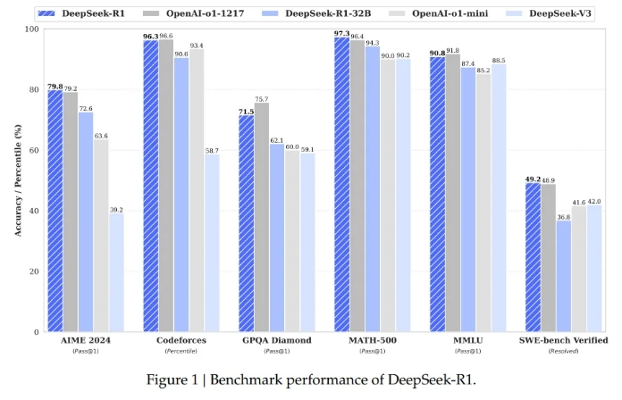
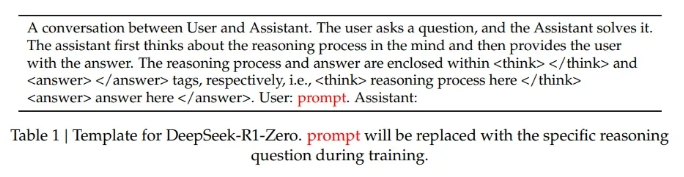
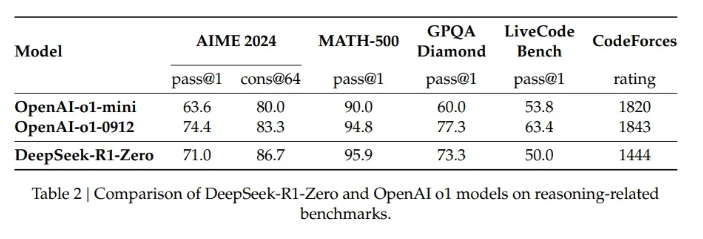
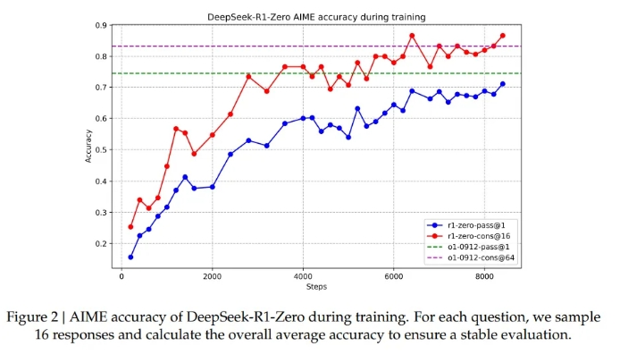
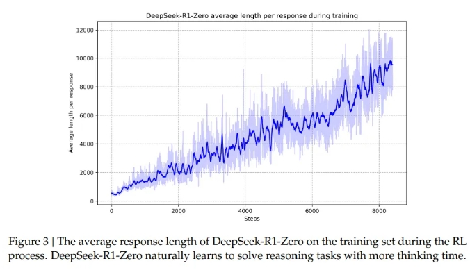
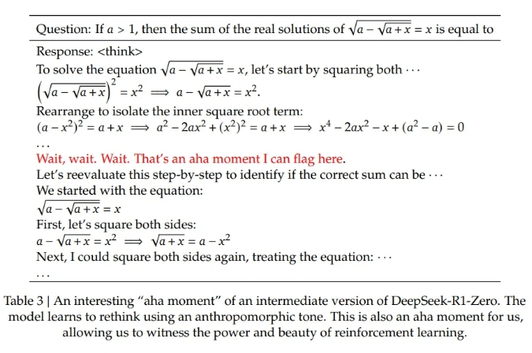
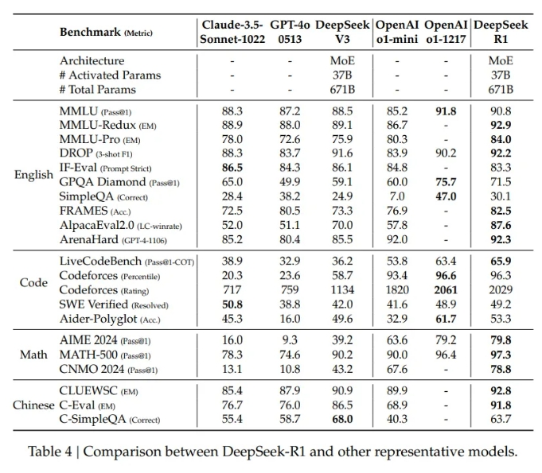
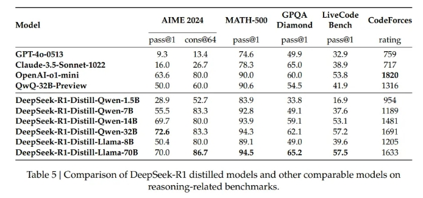
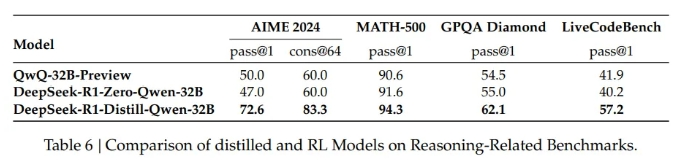

# DeepSeek-R1 论文解读

> 论文标题：DeepSeek-R1: Incentivizing Reasoning Capability in LLMs via Reinforcement Learning
> 
> 论文地址：https://arxiv.org/abs/2501.12948
> 
> 发表机构：DeepSeek-AI
> 
> 发表时间：2025.1
> 
> github：https://github.com/deepseek-ai/DeepSeek-R1
> 
> 中文版论文：https://yiyibooks.cn/arxiv/2501.12948v1/index.html
> 
> 技术报告原文：https://github.com/deepseek-ai/DeepSeek-R1/blob/main/DeepSeek_R1.pdf

## 一、前言

### 1.1 论文动机

如何通过强化学习（RL）有效提升大型语言模型（LLM）的推理能力？具

体聚焦于探索：

1. **是否能够不依赖监督式微调（SFT）数据，仅依靠强化学习让 LLM 自主发展推理能力**；
2. **研究如何解决在这一过程中出现的模型可读性差、语言混杂以及测试时扩展困难等问题**。

### 1.2 论文研究难点

1. **无监督数据下提升推理能力**：
   1. 传统提升 LLM 推理能力的方法多依赖大量监督式微调（SFT）数据 ，但**获取高质量 SFT 数据成本高昂**。
   2. 要在没有监督数据的情况下，**通过 RL 提升模型推理能力极具挑战，因为缺乏标注数据作为明确指导，模型难以快速学习到有效的推理模式**。此前虽有研究尝试使用基于过程的奖励模型、强化学习和搜索算法来解决推理问题，但都未达到 OpenAI 的 o1 系列模型的通用推理性能水平，这表明探索有效的无监督 RL 提升推理能力的方法仍面临诸多困难。
2. **提高可读性和减少语言混合**：
   1. 在基于 RL 训练模型过程中，如 DeepSeek-R1-Zero 虽展现出强大推理能力，但生成的推理过程可读性差，存在语言互相夹杂、格式不佳等问题。
   2. 在后续改进模型（如 DeepSeek-R1）时，尽管采取了一些措施，如引入冷启动数据和语言一致性奖励等，但在多语言场景下，语言混合问题仍未得到彻底解决，这对模型在实际应用中的表现造成了限制。同时，提升模型可读性不仅要解决语言和格式问题，还需确保不损害模型的推理性能，平衡两者之间的关系是一大难点。

## 二、相关研究

当前提升大型语言模型（LLM）推理能力的研究备受关注，DeepSeek-R1 在此背景下展开探索。其相关研究涵盖监督式微调、推理时扩展、基于过程的奖励模型、强化学习和搜索算法等方面，这些研究为 DeepSeek-R1 的诞生提供了基础，同时也凸显了 DeepSeek-R1 创新的必要性和重要性。

- **监督式微调（SFT）**：过往研究常依赖 SFT 增强模型性能，它通过在指令数据集上微调模型，利用其中指令 - 响应配对的标签信息，让模型学习特定任务的模式和知识。然而，*SFT 存在显著缺陷，获取大量标注数据成本高且耗时久，这不仅需要耗费大量人力、物力资源，还可能面临数据标注质量参差不齐的问题，限制了模型的大规模快速优化*。
- **推理时扩展**：OpenAI 的 o1 系列模型通过增加思维链（CoT）推理长度来扩展推理能力，在数学、编码和科学推理等任务上取得一定进展。*但这种方法在测试时扩展方面存在挑战，难以在不同场景和任务中稳定有效地应用，无法满足多样化的推理需求，如何实现有效的测试时扩展仍是研究界的开放性问题*。
- **基于过程的奖励模型**：部分研究采用过程奖励模型引导模型推理，旨在通过对推理过程的各个步骤进行奖励，促使模型生成更合理的推理路径。但在实际应用中，该模型存在诸多局限。
  - 一：*在一般推理过程中难以明确定义细粒度的步骤，导致奖励难以准确对应到具体的推理行为*；
  - 二：*判断中间步骤的正确性困难，自动标注方法效果不佳，人工标注又难以扩展，并且引入基于模型的过程奖励模型容易出现奖励黑客行为，还会增加额外的训练成本*。
- **强化学习**：强化学习已被用于提升推理能力，但通常与 SFT 数据结合使用。这种结合方式难以充分探索纯 RL 的潜力，无法确定在没有监督数据辅助时，强化学习能在多大程度上提升模型推理能力。而且，现有基于强化学习提升推理能力的方法，在通用推理性能上仍与 OpenAI 的 o1 系列模型存在差距。
- **搜索算法**：像蒙特卡洛树搜索（MCTS）等算法也被应用于增强推理。MCTS 通过将答案分解为较小部分，让模型系统地探索解决方案空间。然而，在应用于 LLM 推理时效果有限。*由于 LLM 的 token 生成搜索空间远远大于棋类游戏等传统应用场景，容易陷入局部最优解，而且价值模型的训练非常困难，导致难以迭代提升，使得模型性能优化面临困境*。

## 三、论文贡献

DeepSeek - R1 在大型语言模型推理能力提升方面贡献显著，涵盖模型训练、性能表现、技术应用以及研究方向拓展等多个层面，为该领域的发展提供了新的思路与方法。

1. **验证纯强化学习的可行性**：首次证实了纯强化学习在 LLMs 中增强推理能力的可行性。DeepSeek-R1-Zero 不依赖监督式微调（SFT）数据，仅通过强化学习实现推理能力的自主进化，在 AIME 2024 数学竞赛任务中，Pass@1 准确率从 15.6% 提升至 71.0%，多数投票后达 86.7%，与 OpenAI 的 o1-0912 模型持平。这一成果展示了 LLMs 通过纯 RL 自我进化的潜力，为后续研究开辟了新方向，推动了无监督强化学习在大语言模型推理能力提升方面的探索。
2. **提出多阶段训练策略**：创新地提出多阶段训练策略，包含冷启动、拒绝采样、二轮 SFT 和全场景 RL。通过引入少量高质量长推理链（CoT）数据进行冷启动，预热模型；在推理导向的强化学习阶段提升模型推理性能；利用拒绝采样和监督微调进一步提升综合能力；最后通过全场景强化学习使模型在所有场景下表现良好。这一策略有效兼顾了准确率与可读性，使 DeepSeek-R1 在多个推理 benchmark 上取得与 OpenAI-o1-1217 相近的水平，为模型训练提供了新的有效方法论。
3. **展示知识蒸馏的潜力**：成功展示了知识蒸馏在提升小模型推理能力方面的巨大潜力。将 DeepSeek-R1 的推理能力蒸馏到小模型中，如 7B 参数的 DeepSeek-R1-Distill-Qwen-7B 在 AIME 2024 上得分达 55.5%，超越 32B 规模的 QwQ-Preview；70B 蒸馏模型在 MATH-500 等任务接近 o1-mini。同时开源了 1.5B-70B 的蒸馏模型，为社区提供了低成本、高性能的推理解决方案，促进了 AI 技术在更广泛场景中的应用。
4. **丰富大模型后训练方法论**：从学术和产业角度提供了可复用的 RL 和 SFT 思路。在学术上，为研究人员探索 LLMs 推理能力提升提供了理论和实践参考；在产业中，有助于开发者优化模型训练过程，提升模型综合性能，推动大语言模型在实际应用中的发展，加速 AI 技术的产业落地进程。



## 四、论文方法

### 4.1 方法概述

论文展示了通过大规模强化学习（RL）可以显著提升模型的推理能力，即使不使用监督微调（SFT）作为冷启动。进一步地，加入少量冷启动数据可以进一步提升性能。

- **DeepSeek-R1-Zero：纯强化学习**：
  - 直接在基础模型上应用强化学习，不使用任何 SFT 数据。
  - 探索 LLM 在纯 RL 环境下的自演化过程，使其自主发展推理能力。

- **DeepSeek-R1：冷启动 + 多阶段训练**：
  - 使用少量高质量的 CoT 数据进行冷启动，预热模型。
  - 进行面向推理的强化学习，提升模型在推理任务上的性能。
  - 使用拒绝采样和监督微调，进一步提升模型的综合能力。
  - 再次进行强化学习，使模型在所有场景下都表现良好。

- **知识蒸馏**：
  - 将 DeepSeek-R1 的推理能力蒸馏到更小的模型中，使小模型也具有强大的推理能力。

### 4.2 DeepSeek-R1-Zero：在基础模型上进行强化学习

DeepSeek-R1-Zero 是 DeepSeek 团队为探索大型语言模型（LLM）推理能力提升路径而研发的重要模型，它直接在基础模型上进行强化学习，具有独特的算法框架、训练方式和显著的训练成果，为后续的模型改进和研究提供了坚实基础。

#### 4.2.1 强化学习算法

采用 Group Relative Policy Optimization（GRPO）算法

- 创新点：GRPO 跳过了传统 RL 中与策略模型等规模的 critic 网络，通过相对评分取代绝对评分来估计 baseline；
- 思路：GRPO 从旧策略中采样一组输出，计算每个输出的相对优势，进而优化策略模型。
- 优势：这种方式避免了传统 RL 中训练复杂价值模型的高成本，在降低计算开销的同时，保持了强化学习的有效性，使得模型训练更加高效。

#### 4.2.2 奖励模型设计

由准确性奖励和格式奖励组成。

- **准确性奖励**：
  - 对于数学问题，若有确定性答案，*模型需按指定格式（如框内答案）提供最终答案，通过规则验证答案正确性来给予准确性奖励*；
  - 对于编程问题（如 LeetCode 题目），则*利用编译器根据预定义的测试用例生成反馈，以此判断答案准确性并给予奖励*。
- **格式奖励**： 为确保模型输出结构化和具备可读性，要求模型将推理过程放在<think>和</think>标签之间，答案放在<answer>和</answer>标签之间，符合格式要求则给予格式奖励。

此外，不使用神经奖励模型，主要是因为在大规模 RL 训练中，神经奖励模型易受奖励攻击影响，会导致模型通过不正当方式获取奖励，且重新训练奖励模型会增加训练复杂性，而基于规则的奖励系统更为简单直接，能有效引导模型输出。

#### 4.2.3 训练模板

设计了简单的训练模板，引导模型按特定结构输出。模板要求模型先进行推理过程，再给出最终答案，具体格式为<think>推理过程</think><answer>答案</answer>。在训练过程中，将具体的推理问题替换模板中的 “prompt”，这种设计避免了对内容的特定限制，有助于观察模型在 RL 过程中的自然进化，让模型能够自主探索和发展推理能力。



```s
A conversation between User and Assistant. The user asks a question, and the Assistant solves it. 
The assistant first thinks about the reasoning process in the mind and then provides the user with the answer. 
The reasoning process and answer are enclosed within <think> </think> and <answer> </answer> tags, respectively, 
i.e., <think> reasoning process here </think> <answer> answer here </answer>. 
User: prompt. Assistant:
```

#### 4.2.4 性能表现与自我进化

在 AIME 2024 基准测试中，DeepSeek-R1-Zero 初始的 pass@1 得分仅为 15.6%，但随着 RL 训练的推进，模型的推理能力逐步提升，最终 pass@1 得分达到 71.0%，与 OpenAI 的 o1-0912 模型表现相当。若采用多数投票策略，得分更可进一步提升至 86.7%。





在训练过程中，模型展现出自我进化能力，自发涌现出 “反思”“多步验证” 等复杂推理行为。例如在解决数学方程时，模型会主动纠正早期错误步骤，还能根据训练逐步学会分配更多思考时间，生成更长的推理过程，以解决复杂问题。意味着LLM似乎自己已经潜移默化学会了进行更多的思考和推理，达到更好的效果。



在训练的中间阶段，模型会出现 “Aha Moment”，即突然重新评估初始推理方法，从而显著提升性能，这充分展示了强化学习激发模型自主学习和改进的强大潜力。



就这么完美？SFT完全不需要了？也不是，这里也存在一些问题，比如，DeepSeek-R1-Zero 生成的答案可读性相对差、存在混合语言输出情况（这个似乎也比较明显）。 为了让模型说人话，还是得加点SFT，这就是DeepSeek-R1。

### 4.3 DeepSeek-R1：带冷启动的强化学习

DeepSeek-R1 是在 DeepSeek-R1-Zero 基础上改进的模型，旨在解决 R1-Zero 存在的问题并进一步提升性能，其带冷启动的强化学习过程分为多个阶段，每个阶段都有特定的目标和方法。

#### 4.3.1 冷启动阶段

- 动机：解决 DeepSeek-R1-Zero 训练早期不稳定以及可读性差的问题
- 思路：DeepSeek-R1 收集数千条高质量长链推理（CoT）数据对基础模型 DeepSeek-V3-Base 进行微调。这些冷启动数据通过少样本提示、直接提示模型生成详细答案并结合人工后处理等方式获得，具有良好的可读性和潜在的推理引导能力。
- 优点：冷启动数据能让模型在训练初期就具备一定的推理思路和较好的输出格式，避免了直接进行 RL 训练可能出现的混乱，为后续的强化学习提供了一个稳定且有效的起点，提升了模型的可读性和初始推理能力。

#### 4.3.2 推理导向的强化学习阶段

**在冷启动微调之后，DeepSeek-R1 采用与 DeepSeek-R1-Zero 类似的大规模强化学习训练过程，但在此基础上引入了语言一致性奖励**。

该奖励通过计算推理过程中目标语言单词的比例，来确保模型生成的推理过程语言一致，减少语言混合现象。

虽然这一奖励机制会使模型性能略有下降，但却显著提升了输出的可读性，更符合人类的阅读和理解习惯。在这个阶段，模型通过不断优化策略以获取更高的奖励，重点提升在数学、编程、科学和逻辑推理等任务上的性能，强化其推理能力。

#### 4.3.3 拒绝采样和监督微调阶段

当推理导向的 RL 训练接近收敛时，**利用拒绝采样的方式从 RL 检查点生成新的监督微调（SFT）数据**。

对于推理数据，不仅通过规则奖励筛选正确的推理过程，还引入 DeepSeek-V3 作为生成奖励模型来判断一些无法用规则直接奖励的数据，同时过滤掉包含混合语言、长段落和代码块的 CoT 数据，最终收集到约 60 万条推理相关训练样本。非推理数据则来源于 DeepSeek-V3 的 SFT 数据集，涵盖写作、事实问答、自我认知和翻译等任务，共约 20 万条。使用这约 80 万条数据对 DeepSeek-V3-Base 模型进行两轮微调，有效增强了模型在多种任务上的通用能力 。

#### 4.3.4 全场景强化学习阶段

为使模型更好地符合人类偏好，提升模型的有用性和无害性，同时保持推理能力，DeepSeek-R1 进行了第二阶段的 RL 训练。对于推理数据，继续使用基于规则的奖励来指导数学、代码和逻辑推理任务的学习；对于通用数据，借助奖励模型来捕捉人类偏好。在评估有用性时，专注于最终的总结，确保回答对用户具有实用性和相关性；评估无害性时，对模型的整个响应（包括推理过程和总结）进行评估，以识别和减轻潜在风险、偏见或有害内容。通过综合运用多种奖励信号和多样化的提示分布进行训练，模型在保证推理能力的同时，能够更好地满足不同场景下用户的需求。

实验结果和OpenAI-o1-1217相当。



### 4.4 蒸馏：赋予小模型推理能力

论文中，将大模型的知识和能力转移到小模型上的关键技术是蒸馏，这一技术使小模型获得强大推理能力，为资源受限场景提供了高效解决方案。

#### 4.4.1 蒸馏动机

- 动机：大型语言模型如 DeepSeek-R1 在推理任务上表现出色，但由于其庞大的参数量和高计算需求，在资源受限的环境中应用受到限制。
- 思路：为了在**保持高性能的同时降低计算成本**，研究团队探索*将 DeepSeek-R1 的推理能力蒸馏到更小的模型上。其核心思想是通过知识迁移，让小模型学习大模型的复杂推理模式，从而提升自身的推理能力，使小模型在特定任务中也能达到接近大模型的表现*。

#### 4.4.2 蒸馏的数据来源

使用 DeepSeek-R1 生成的 80 万条训练数据进行蒸馏，这些数据包含丰富的推理和通用任务信息。其中：

- 60 万条推理数据通过拒绝采样从 DeepSeek-R1 的 RL 检查点生成，涵盖数学、代码、科学和逻辑推理等多种任务类型，确保小模型能学习到多样化的推理模式；
- 20 万条非推理数据来自 DeepSeek-V3 的 SFT 数据集，包括写作、事实问答、自我认知和翻译等任务的数据，使蒸馏后的小模型具备处理多种通用任务的能力。

#### 4.4.3 蒸馏的目标模型

选择了多个开源模型作为蒸馏的目标模型，包括 Qwen 系列（Qwen2.5-1.5B、Qwen2.5-7B、Qwen2.5-14B、Qwen2.5-32B）和 Llama 系列（Llama-3.1-8B、Llama-3.3-70B-Instruct）。这些模型在蒸馏前已具备一定的语言理解和生成能力，但推理能力相对较弱。通过蒸馏，它们能够借鉴 DeepSeek-R1 的推理能力，实现性能的显著提升。

#### 4.4.4 蒸馏的训练过程

先利用 DeepSeek-R1 生成涵盖推理和非推理任务的 80 万条训练数据。

- 对于推理任务，通过拒绝采样筛选出正确的推理过程；
- 对于非推理任务，直接使用 DeepSeek-V3 的 SFT 数据集。 

使用生成的数据对目标模型进行监督微调。在微调过程中，目标模型学习 DeepSeek-R1 的推理模式和生成风格，从而实现推理能力的迁移。为确保知识迁移效果，对每个目标模型进行了两轮微调。

#### 4.4.5 蒸馏的效果

蒸馏后的小模型在推理能力上有显著提升，在多个基准测试中表现出色。例如，

- DeepSeek-R1-Distill-Qwen-7B 在 AIME 2024 测试中取得了 55.5% 的成绩，超越了 QwQ-32B-Preview；
- DeepSeek-R1-Distill-Qwen-14B 在所有评估指标上超过了 QwQ-32B-Preview；
- DeepSeek-R1-Distill-Qwen-32B 和 DeepSeek-R1-Distill-Llama-70B 在大多数基准测试中显著超过 o1-mini。

这些结果表明，蒸馏技术能够有效地将大模型的推理能力迁移到小模型上，使小模型在保持高效性的同时，获得强大的推理能力。



## 五、实验设计

### 5.1 数据收集

- **冷启动数据**：为 DeepSeek-R1 的冷启动阶段收集数据时，采用了多种方式。利用少样本提示，引导模型生成详细推理过程；直接提示模型输出带有反思和验证的答案；还收集 DeepSeek-R1-Zero 的输出，并通过人工注释者后处理来细化结果。最终得到数千条高质量长链推理（CoT）数据，这些数据格式规范、可读性强，用于对基础模型 DeepSeek-V3-Base 进行微调，为后续的强化学习提供良好开端。
- **推理导向 RL 数据**：此阶段的数据主要为用于强化学习训练的大规模任务数据，涵盖数学、代码、逻辑推理等多种类型。这些数据包含可自动判分的题目，以便实现基于结果的奖励机制，从而引导模型在推理任务中不断优化策略，提升推理能力。
- **拒绝采样和 SFT 数据**：在推理导向的 RL 训练接近收敛时，进行数据收集用于拒绝采样和监督微调（SFT）。从 RL 检查点生成推理轨迹，通过规则奖励和利用 DeepSeek-V3 作为判断的生成奖励模型，筛选出正确的推理过程，同时过滤掉包含混合语言、长段落和代码块的 CoT 数据，得到约 60 万条推理相关训练样本。非推理数据则来自 DeepSeek-V3 的 SFT 数据集，包括写作、事实问答、自我认知和翻译等任务的数据，约 20 万条。将这两部分数据结合，用于对模型进行两轮微调，增强模型的通用能力。
- **蒸馏数据**：为实现将 DeepSeek-R1 的推理能力蒸馏到小模型的目的，收集 DeepSeek-R1 生成的约 80 万条数据，其中 60 万条推理数据通过拒绝采样从其 RL 检查点生成，20 万条非推理数据来自 DeepSeek-V3 的 SFT 数据集。这些数据用于对 Qwen、Llama 系列等开源小模型进行微调，使小模型获得强大的推理能力。

### 5.2 实验设置

- **基准测试任务**：论文对模型在多个基准测试任务上进行评估，包括 MMLU、MMLU-Redux、MMLU-Pro、C-Eval、CMMLU、IFEval、FRAMES、GPQA Diamond、SimpleQA、C-SimpleQA、SWE-Bench Verified、Aider 1、LiveCodeBench、Codeforces、Chinese National High School Mathematics Olympiad（CNMO 2024）、American Invitational Mathematics Examination 2024（AIME 2024）等。还在开放 - ended generation 任务中使用 LLMs 作为评判模型，如遵循 AlpacaEval 2.0 和 Arena-Hard 的原始配置，利用 GPT-4-Turbo-1106 进行两两比较，且仅将最终总结输入评估以避免长度偏差。
- **评估提示**：评估提示遵循 DeepSeek-V3 的设置，对于不同的基准测试采用不同的提示方式。MMLU、DROP、GPQA Diamond 和 SimpleQA 等标准基准测试使用 simpleevals 框架中的提示；MMLU-Redux 采用 Zero-Eval 提示格式；MMLU-Pro、C-Eval 和 CLUE-WSC 等由于原始提示为 few-shot，为适应 DeepSeek-R1 的特点，将其修改为 zero-shot 设置；其他数据集则遵循其原始评估协议和默认提示。对于代码和数学基准测试，HumanEval-Mul 数据集涵盖多种主流编程语言，LiveCodeBench 使用 CoT 格式评估模型性能，Codeforces 数据集通过特定竞赛题目和专家设计的测试用例进行评估，SWE-Bench Verified 通过 agentless 框架获得结果，AIDER 相关基准测试使用 “diff” 格式测量。同时，DeepSeek-R1 输出在每个基准测试中被限制在最大 32,768 个 token。
- **基线比较**：选择多个强大的基线模型进行对比评估，包括 DeepSeek-V3、Claude-Sonnet-3.5-1022、GPT-4o-0513、OpenAI-o1-mini 和 OpenAI-o1-1217。由于在中国大陆访问 OpenAI-o1-1217 API 存在困难，其性能数据基于官方报告。对于蒸馏模型，还与开源模型 QwQ-32B-Preview 进行比较。
- **生成设置**：所有模型的最大生成长度设置为 32,768 个 token。考虑到使用贪婪解码评估长输出推理模型会导致较高的重复率和不同检查点间的显著差异，实验默认采用 pass@k 评估方式，并使用非零温度报告 pass@1。具体来说，使用采样温度 0.6、top-P 值 0.95 为每个问题生成 k 个响应（根据测试集大小，通常在 4 到 64 之间），pass@1 通过公式计算，其中表示第 i 个响应的正确性，这种方法能提供更可靠的性能估计。对于 AIME 2024，还报告使用 64 个样本的 consensus（majority vote）结果。

### 5.3 参数设置

论文中提及所有模型的最大生成长度统一设置为 32,768 个 token。在进行采样的基准测试中，设定温度为 0.6，top-p 值为 0.95，每个查询生成 64 个响应用于估计 Pass@1。这些参数设置是在实验过程中经过调试和优化确定的，旨在平衡模型的生成多样性和准确性，确保实验结果的可靠性和有效性，为不同模型之间的性能比较提供统一的标准和条件。

### 5.4 结果与分析
DeepSeek-R1 在多个基准测试任务中表现出色，在推理任务、知识任务及其他任务上均展现出强大的能力，蒸馏后的小模型也取得了优异成绩。不过，模型仍存在一些局限性，未来研究将针对这些不足展开优化。

- **DeepSeek-R1 的综合性能优势**：在数学推理任务方面，DeepSeek-R1 在 AIME 2024 上的 Pass@1 得分为 79.8% ，略高于 OpenAI 的 o1-1217；在 MATH-500 上，得分达到 97.3%，与 OpenAI-o1-1217 持平，远超其他模型。这表明 DeepSeek-R1 在复杂数学问题的推理上达到了顶尖水平，能够准确高效地解决各类数学难题。在编程相关任务中，DeepSeek-R1 在 Codeforces 上的 Elo 评分为 2029，超越了 96.3% 的人类参赛者，展现出专家级的编程能力，在编程领域的代码理解、生成和问题解决方面表现卓越。在知识密集型任务如 MMLU、MMLU-Pro 和 GPQA Diamond 中，DeepSeek-R1 的成绩显著优于 DeepSeek-V3。尽管与 OpenAI-o1-1217 相比略逊一筹，但超越了其他闭源模型。在 MMLU 测试中，DeepSeek-R1 得分 90.8%，体现了其在知识储备和应用方面的强大能力，能够应对各类知识问答挑战。在创意写作、问答、编辑和摘要等通用任务中，DeepSeek-R1 同样表现出色。在 AlpacaEval 2.0 上，其长度控制胜率为 87.6% ；在 ArenaHard 上的胜率为 92.3%。这表明模型不仅在推理和知识任务中表现优异，还具备良好的文本生成和交互能力，能够生成高质量、符合用户需求的文本内容。
- **蒸馏小模型的突出表现**：研究团队将 DeepSeek-R1 的推理能力蒸馏到小模型中，取得了显著成果。例如，DeepSeek-R1-Distill-Qwen-7B 在 AIME 2024 测试中成绩达到 55.5%，超越了 QwQ-32B-Preview 等模型；DeepSeek-R1-Distill-Qwen-14B 在所有评估指标上均超过 QwQ-32B-Preview；DeepSeek-R1-Distill-Qwen-32B 和 DeepSeek-R1-Distill-Llama-70B 在大多数基准测试中显著超过 o1-mini。这些结果充分证明了蒸馏技术的有效性，能够将大模型的推理能力高效迁移到小模型上，使小模型在保持高效性的同时，获得强大的推理能力，为在资源受限环境下实现高性能推理提供了可能。
- **模型存在的局限与未来方向**：尽管 DeepSeek-R1 在多方面表现优异，但在函数调用、多轮对话、复杂角色扮演和 JSON 输出等任务上，其能力不及 DeepSeek-V3。未来计划探索利用长 CoT 提升这些领域的任务表现，通过优化模型对长链推理的处理能力，增强模型在复杂交互和特定格式输出任务中的通用性。目前 DeepSeek-R1 主要针对中文和英文进行了优化，在处理其他语言的查询时可能出现语言混合问题。未来研究将致力于解决这一问题，提升模型对多语言的支持能力，确保在不同语言环境下都能稳定、准确地进行推理和交互。DeepSeek-R1 对提示较为敏感，few-shot 提示会降低其性能。因此建议用户采用零样本设置描述问题并指定输出格式以获取最佳结果。未来将进一步研究优化模型对提示的适应性，提高模型在不同提示条件下的稳定性，增强模型在实际应用中的可靠性。由于评估时间较长影响 RL 过程效率，大规模 RL 在软件工程任务中应用受限，导致 DeepSeek-R1 在软件工程基准测试上相比 DeepSeek-V3 改进不明显。未来版本将通过对软件工程数据实施拒绝采样或在 RL 过程中引入异步评估等方法来提高效率，进而提升模型在软件工程任务中的表现，拓展模型在该领域的应用。

## 六、一些讨论

### 6.1 蒸馏与RL

论文对蒸馏与强化学习（RL）提升大型语言模型推理能力展开讨论，对比实验发现，蒸馏能让小模型高效获取强大推理能力，比小模型直接 RL 训练效果好，但要突破智能边界仍需探索；同时分享了 PRM 和 MCTS 的失败尝试，为后续研究提供参考。



- 蒸馏与 RL 的对比实验：为探究不蒸馏仅靠大规模 RL 训练能否使模型达到类似性能，研究人员以 Qwen-32B-Base 为对象，用数学、编码和 STEM 数据进行超 10,000 步训练，得到 DeepSeek-R1-Zero-Qwen-32B 模型。将其与 DeepSeek-R1-Distill-Qwen-32B（从 DeepSeek-R1 蒸馏而来）及 QwQ-32B-Preview 对比。结果显示，经大规模 RL 训练的 32B 基础模型，性能与 QwQ-32B-Preview 相当，而 DeepSeek-R1-Distill-Qwen-32B 在所有基准测试中显著更优。
- 结论：蒸馏大模型到小模型效果出色，小模型依赖论文所述大规模 RL 训练，不仅需巨大算力，还可能无法达到蒸馏的性能。这表明蒸馏在将大模型知识迁移到小模型方面高效且实用。虽然蒸馏策略经济有效，但要实现更高智能水平，或许仍需更强大的基础模型和大规模强化学习。这为后续研究在模型训练和能力提升方向上提供了重要参考，即应合理利用蒸馏技术提升小模型性能，同时探索更强大模型和 RL 训练方式以突破现有智能边界。

### 6.2 一些暂未成功的尝试

在开发 DeepSeek-R1 过程中，团队尝试了过程奖励模型（PRM）和蒙特卡罗树搜索（MCTS），但均未成功。PRM 难以明确定义细粒度推理步骤，判断中间步骤正确性困难，自动标注效果差且手动标注难以扩展，还易出现奖励作弊，增加训练成本，限制了其在大规模强化学习中的应用。MCTS 用于提升测试时计算可扩展性时，因 LLM 的 token 生成搜索空间远大于棋类游戏，虽设置最大扩展限制仍易陷入局部最优，且模型训练困难，影响生成质量，导致模型难以迭代改进 。

## 七、优点与创新

DeepSeek-R1 在模型训练模式、性能提升及技术应用等方面展现出显著优点与创新，为大语言模型发展提供新方向，推动了 AI 领域的技术进步。

1. **验证纯强化学习可行性**：打破传统依赖监督微调（SFT）的模式，首次验证了仅通过强化学习（RL）就能让大型语言模型（LLM）自主发展推理能力。
2. **创新多阶段训练策略**：提出 “冷启动 + 多阶段 RL” 的创新训练策略。冷启动阶段，利用数千条高质量长推理链（CoT）数据对基础模型微调，提升模型初始可读性和推理能力。推理导向的 RL 阶段，引入语言一致性奖励，减少语言混合问题，提升推理性能。拒绝采样和监督微调阶段，通过筛选高质量数据对模型再次训练，增强通用能力。全场景 RL 阶段，兼顾推理能力和通用能力，使模型在各种场景下表现良好且符合人类偏好。
3. **实现高效知识蒸馏**：成功展示了知识蒸馏在提升小模型推理能力方面的巨大潜力。将 DeepSeek-R1 的推理能力蒸馏到小模型中，使用 Qwen 和 Llama 系列等开源模型作为目标模型进行微调。实验结果显示，蒸馏后的小模型表现优异，如 DeepSeek-R1-Distill-Qwen-7B 在 AIME 2024 上达 55.5%，超越 32B 规模的 QwQ-Preview；70B 蒸馏模型在 MATH-500 等任务接近 o1-mini。这为低资源环境下实现高性能推理提供了可行方案，促进了 AI 技术的广泛应用。
4. **采用高效 RL 算法与奖励机制**：DeepSeek-R1-Zero 采用 Group Relative Policy Optimization（GRPO）算法进行 RL 训练，通过组内奖励对比优化策略，避免了传统 RL 中复杂价值模型的依赖，降低了训练成本。同时，设计了基于规则的奖励系统，包括准确性奖励和格式奖励，有效引导模型生成正确且结构化的推理过程，提高了训练效率和模型性能。
5. **开源推动研究发展**：开源了 DeepSeek-R1-Zero、DeepSeek-R1 以及基于 Qwen 和 Llama 的六个密集模型（1.5B、7B、8B、14B、32B、70B），为研究社区提供了丰富的资源，促进了学术研究和产业应用的发展。其他研究人员和开发者可以基于这些开源模型进行进一步的研究和改进，推动整个 AI 领域的技术进步。

## 八、一些未来的改进方向

为进一步提升 DeepSeek - R1 的性能和应用范围，研究团队针对模型现存的问题规划了多个未来改进方向，涵盖通用能力拓展、语言混合问题解决、提示工程优化以及软件工程任务适应性提升等方面。

- **提升通用能力**：目前，DeepSeek-R1 在函数调用、多轮对话、复杂角色扮演和 JSON 输出等任务上的表现不及 DeepSeek-V3。未来团队计划探索如何利用长思维链（CoT）来优化这些任务的处理能力。通过改进模型对长 CoT 的运用，有望增强模型在复杂交互场景中的理解和应对能力，使其能够更好地处理多轮对话中的上下文信息，更准确地进行函数调用，在复杂角色扮演和 JSON 输出任务中表现更出色，从而提升模型的通用性，满足更多实际应用场景的需求。
- **解决语言混合问题**：当前 DeepSeek-R1 主要针对中文和英文进行了优化，在处理其他语言的查询时存在语言混合问题。未来研究将致力于解决这一局限性，使模型能够更好地处理多种语言的任务。通过改进语言识别和处理机制，确保模型在面对不同语言的输入时，能够准确地使用相应语言进行推理和生成，避免语言混合现象，提升模型在全球多语言环境下的实用性和准确性。
- **优化提示工程**：DeepSeek-R1 对提示较为敏感，few-shot 提示会持续降低其性能。为此，团队建议用户采用零样本设置来描述问题和指定输出格式以获得最佳结果。未来，团队将进一步研究如何优化模型对提示的适应性，提高模型在不同提示条件下的稳定性。通过改进模型的提示理解和处理方式，使模型能够更有效地利用提示信息，减少提示敏感性对模型性能的影响，从而在各种实际应用场景中都能稳定地发挥其推理能力。
- **提升软件工程任务表现**：由于评估时间较长影响了 RL 过程的效率，大规模 RL 尚未在软件工程任务中广泛应用，导致 DeepSeek-R1 在软件工程基准测试上没有显著超越 DeepSeek-V3。未来版本将通过在软件工程数据上实施拒绝采样或在 RL 过程中引入异步评估来提高效率。通过这些方法，减少评估时间对 RL 训练的影响，使模型能够在软件工程任务上进行更有效的训练，进而提升在软件工程任务中的表现，为软件开发等实际工程领域提供更强大的支持。

## 九、伪代码实现

```s
"""
本示例演示论文中DeepSeek-R1的主要流程，包括：
1. 冷启动数据微调（SFT）
2. 面向推理的强化学习（Reasoning-oriented RL）
3. 拒绝采样并再次微调（Rejection Sampling + SFT）
4. 面向全场景的RL
5. 蒸馏到小模型

注：以下代码仅为演示性质，省略了数据加载、超参数配置、训练细节和大规模并行等实际工程实现。
"""
import torch
import random
import numpy as np
from transformers import AutoModelForCausalLM, AutoTokenizer, TrainingArguments, Trainer
# (可选) 下面演示使用一个公开的RL库示例，如TRL等
# from trl import PPOTrainer, PPOConfig

#####################################################################################
#                                数据加载与预处理
#####################################################################################

def load_data_cold_start():
    """
    加载冷启动数据（包含一小批带详细推理过程的示例）。
    返回值为一个简单的列表或DataSet格式，每条数据含(prompt, answer_with_CoT)。
    """
    # 这里仅示例返回一个空列表或简单模拟
    return [
        {
            "prompt": "给定一个整数n，判断它是否是质数，并解释推理过程。",
            "answer": "<reasoning_process>...长链推理示例...</reasoning_process><summary>是质数/不是质数</summary>"
        },
        # ... 这里应该有更多实际冷启动数据
    ]

def load_data_reasoning_rl():
    """
    加载主要用来做推理强化学习的大规模任务数据（如数学、代码、逻辑推理题）。
    返回值通常包含可以自动判分的题目，以便实现基于结果的reward。
    """
    return [
        {"prompt": "请解方程: x^2 - 4x + 3 = 0 ，并给出详细推理。", "reference_answer": "x=1或x=3"},
        # ... 省略更多示例
    ]

def load_data_sft_non_reasoning():
    """
    加载非推理场景的数据，例如写作任务、多轮对话、知识问答等，用于SFT微调后提升通用性。
    """
    return [
        {"prompt": "你好，可以帮我写一段自我介绍吗？", "answer": "好的，这里是一段简单示例......"},
        # ...
    ]

def load_data_for_rejection_sampling():
    """
    用于做拒绝采样时的题目或场景数据，之后会调用强化后的模型生成答案，再根据规则或模型判定是否保留。
    """
    return [
        {"prompt": "证明勾股定理，并写出详细过程。", "reference_answer": "符合题意的正确推理和结论"},
        # ...
    ]

#####################################################################################
#                       冷启动微调 (Stage 1: Cold-Start SFT)
#####################################################################################

def train_sft_cold_start(base_model_name: str, train_data, output_dir: str):
    """
    使用冷启动数据进行SFT（监督微调）。
    :param base_model_name: HuggingFace模型名称或本地路径
    :param train_data: 冷启动数据，需包含prompt和详细的答案（带CoT）
    :param output_dir: 模型输出目录
    :return: 微调后的模型
    """
    tokenizer = AutoTokenizer.from_pretrained(base_model_name)
    model = AutoModelForCausalLM.from_pretrained(base_model_name)

    # 这里为了简单，用huggingface的Trainer做一个监督训练示例
    # 实际中需根据任务自定义collator并拼接 <prompt><separator><answer> 格式输入
    train_texts = []
    for d in train_data:
        prompt = d["prompt"]
        answer = d["answer"]
        # 假设answer里已经含有<reasoning_process>,<summary>等标记
        combined_text = f"{prompt}\n{answer}"
        train_texts.append(combined_text)

    # 简单的train_dataset示例
    encodings = tokenizer(train_texts, truncation=True, padding=True, max_length=512)
    # 为了演示，可把inputs当targets
    dataset = SimpleDataset(encodings)

    training_args = TrainingArguments(
        output_dir=output_dir,
        num_train_epochs=1,  # 示例中只训练一个epoch
        per_device_train_batch_size=2,
        save_steps=10,
        logging_steps=10
    )

    trainer = Trainer(
        model=model,
        args=training_args,
        train_dataset=dataset
    )
    trainer.train()

    return model, tokenizer


#####################################################################################
#         面向推理的强化学习 (Stage 2: Reasoning-Oriented RL，如DeepSeek-R1-Zero)
#####################################################################################

def compute_reward_for_reasoning(output_str: str, reference_answer: str) -> float:
    """
    根据模型输出和参考答案来计算奖励值。
    这里以简单匹配or外部判定为例：正确则+1，不正确则0。
    在实际中可使用更多规则/正则表达式/编译器测试，乃至语言一致性奖励等。
    """
    # 简单示例：如果预期结果在输出字符串里，就给正奖励，否则0
    if reference_answer in output_str:
        return 1.0
    else:
        return 0.0

def train_rl_reasoning(base_model, tokenizer, rl_data, rl_steps=1000):
    """
    针对推理任务进行大规模强化学习训练，示例化演示。
    :param base_model: 已经初始化或SFT过的模型(如DeepSeek-V3-Base或SFT后的模型)
    :param tokenizer: 分词器
    :param rl_data: 大规模推理数据，每条含可自动判定正误的题目
    :param rl_steps: RL训练步数
    :return: 强化学习后的模型
    """
    # 注意：在真实实现中，需要RL库(如trl, accelerate等)来进行策略梯度/PPO等操作
    # 这里仅做概念示例

    # pseudo-code:
    model = base_model
    optimizer = torch.optim.AdamW(model.parameters(), lr=1e-5)

    # 模拟若干个训练步，每步从数据集中采样(SGD)
    for step in range(rl_steps):
        data_sample = random.choice(rl_data)
        prompt = data_sample["prompt"]
        ref_ans = data_sample["reference_answer"]

        # 1. 用当前策略（model）生成文本
        inputs = tokenizer(prompt, return_tensors="pt")
        outputs = model.generate(**inputs, max_new_tokens=128)
        output_text = tokenizer.decode(outputs[0], skip_special_tokens=True)

        # 2. 计算奖励
        reward = compute_reward_for_reasoning(output_text, ref_ans)

        # 3. 计算policy gradient的loss(仅示例，不是实际可运行代码)
        #    在真实环境，需要保留log_probs，并使用类似PPO的loss函数
        #    这里假装reward就是loss的负数
        loss = -1.0 * reward  # 纯粹演示，不可用

        # 4. 反向传播并更新模型
        loss.backward()
        optimizer.step()
        optimizer.zero_grad()

        if step % 100 == 0:
            print(f"RL training step {step}, current reward={reward}, output_text={output_text[:50]}...")

    return model


#####################################################################################
#                 拒绝采样并再次SFT (Stage 3: Rejection Sampling + New SFT)
#####################################################################################

def collect_data_with_rejection_sampling(model, tokenizer, data_for_reject_sampling):
    """
    用已强化学习后的模型生成若干答案，进行拒绝采样。
    - 对于每个prompt，采样N次（例如N=4或更多），并将其中正确或可读性好的回答保留下来。
    - 可以组合人工过滤或简单的GPT判定、判分器等。
    """
    recollected = []
    for d in data_for_reject_sampling:
        prompt = d["prompt"]
        ref_ans = d["reference_answer"]
        # 全部候选
        candidates = []
        for _ in range(4):
            inputs = tokenizer(prompt, return_tensors="pt")
            outputs = model.generate(**inputs, max_new_tokens=128)
            output_text = tokenizer.decode(outputs[0], skip_special_tokens=True)
            # 计算正确性
            score = compute_reward_for_reasoning(output_text, ref_ans)
            candidates.append((output_text, score))
        # 选择score最高/可读性最好的
        best_candidate = max(candidates, key=lambda x: x[1])
        # 如果符合一定阈值，则保留
        if best_candidate[1] > 0.5:
            recollected.append((prompt, best_candidate[0]))
    return recollected

def train_sft_second(model_name_or_path, new_sft_data, output_dir):
    """
    对带有更多(拒绝采样后)的推理数据+非推理数据，再次SFT
    """
    tokenizer = AutoTokenizer.from_pretrained(model_name_or_path)
    model = AutoModelForCausalLM.from_pretrained(model_name_or_path)

    # 同理，这里只是示例化
    train_texts = []
    for item in new_sft_data:
        prompt, ans = item
        combined = f"{prompt}\n{ans}"
        train_texts.append(combined)

    encodings = tokenizer(train_texts, truncation=True, padding=True, max_length=512)
    dataset = SimpleDataset(encodings)

    training_args = TrainingArguments(
        output_dir=output_dir,
        num_train_epochs=1,
        per_device_train_batch_size=2,
        save_steps=10,
        logging_steps=10
    )
    trainer = Trainer(
        model=model,
        args=training_args,
        train_dataset=dataset
    )
    trainer.train()

    return model, tokenizer


#####################################################################################
#                 全场景RL (Stage 4: RL for All Scenarios)
#####################################################################################

def train_rl_full_scenarios(model, tokenizer, data_mixed, steps=1000):
    """
    在所有场景（包含推理数据和广泛任务数据）上再次进行RL，
    以同时兼顾有害性检测、帮助度评估等多种reward。
    """
    # 仅示例：引入更多reward维度，如helpfulness_reward, harmless_reward等
    optimizer = torch.optim.AdamW(model.parameters(), lr=1e-5)

    for step in range(steps):
        sample_data = random.choice(data_mixed)
        prompt = sample_data["prompt"]
        ref_answer = sample_data["reference_answer"]
        # 可能还有helpfulness参考或harmlessness判断

        inputs = tokenizer(prompt, return_tensors="pt")
        outputs = model.generate(**inputs, max_new_tokens=128)
        output_text = tokenizer.decode(outputs[0], skip_special_tokens=True)

        # 假设用多重reward简单加和
        correctness_reward = compute_reward_for_reasoning(output_text, ref_answer)
        helpfulness_reward = 0.5  # 仅示例: 可能需要另一个模型打分
        total_reward = correctness_reward + helpfulness_reward
        loss = -1.0 * total_reward

        loss.backward()
        optimizer.step()
        optimizer.zero_grad()

        if step % 100 == 0:
            print(f"[Full RL] Step {step}, total reward={total_reward}, sample output={output_text[:50]}...")

    return model

#####################################################################################
#                 蒸馏到小模型 (Stage 5: Distillation to Smaller Models)
#####################################################################################

def distill_model_to_small(teacher_model, teacher_tokenizer, small_model_name, distilled_data, output_dir):
    """
    将teacher模型（DeepSeek-R1）生成的推理数据，拿来对小模型做微调，达到蒸馏效果。
    :param teacher_model: 已经训练好的教师模型
    :param teacher_tokenizer: 教师模型分词器
    :param small_model_name: 用来加载小模型的名称或路径
    :param distilled_data: 教师模型产出的数据，如<prompt, answer>对
    :param output_dir: 小模型输出路径
    """
    # 1. 小模型初始化
    small_model = AutoModelForCausalLM.from_pretrained(small_model_name)
    small_tokenizer = AutoTokenizer.from_pretrained(small_model_name)

    # 2. 构造"教师强推理数据" → "学生小模型微调"
    #    在实际中，可由teacher_model对大量复杂题目生成正确解答，然后把 (prompt, answer) 存入distilled_data
    #    这里仅做简单示例
    train_texts = []
    for item in distilled_data:
        # item为(prompt, correct_answer)对
        prompt, ans = item
        combined_text = f"{prompt}\n{ans}"
        train_texts.append(combined_text)

    encodings = small_tokenizer(train_texts, truncation=True, padding=True, max_length=512)
    dataset = SimpleDataset(encodings)

    training_args = TrainingArguments(
        output_dir=output_dir,
        num_train_epochs=1,
        per_device_train_batch_size=2,
        save_steps=10,
        logging_steps=10
    )

    trainer = Trainer(
        model=small_model,
        args=training_args,
        train_dataset=dataset
    )
    trainer.train()

    return small_model, small_tokenizer


#####################################################################################
#                                   工具函数
#####################################################################################

class SimpleDataset(torch.utils.data.Dataset):
    """
    简易数据集封装，将tokenizer输出的encodings包装为torch Dataset
    """
    def __init__(self, encodings):
        self.encodings = encodings

    def __getitem__(self, i):
        return {key: torch.tensor(val[i]) for key, val in self.encodings.items()}

    def __len__(self):
        return len(self.encodings["input_ids"])


#####################################################################################
#                                   主流程示例
#####################################################################################

def main():
    # 1. 加载基础模型名称或路径
    base_model_name = "EleutherAI/gpt-neo-1.3B"  # 仅示例，可换成任意支持的LLM

    # --------------------- Stage 1: 冷启动SFT ---------------------
    cold_data = load_data_cold_start()
    model_cold, tokenizer_cold = train_sft_cold_start(
        base_model_name,
        cold_data,
        output_dir="model_sft_cold"
    )
    # 这里假设得到一个在冷启动数据上具备一定可读性的模型

    # --------------------- Stage 2: 推理强化学习 (Reasoning RL) ---------------------
    rl_data = load_data_reasoning_rl()
    model_reasoning = train_rl_reasoning(model_cold, tokenizer_cold, rl_data, rl_steps=100)
    # 此时得到类似DeepSeek-R1-Zero或DeepSeek-R1初步版本

    # --------------------- Stage 3: 拒绝采样并再次SFT ---------------------
    data_for_reject = load_data_for_rejection_sampling()
    recollected_data = collect_data_with_rejection_sampling(model_reasoning, tokenizer_cold, data_for_reject)
    # 也可合并非推理SFT数据
    non_reasoning_data = load_data_sft_non_reasoning()
    # 将两部分融合
    new_sft_data = []
    for item in recollected_data:
        new_sft_data.append(item)
    for nr in non_reasoning_data:
        prompt = nr["prompt"]
        ans = nr["answer"]
        new_sft_data.append((prompt, ans))

    model_sft2, tokenizer_sft2 = train_sft_second(
        base_model_name,
        new_sft_data,
        output_dir="model_sft_stage2"
    )

    # --------------------- Stage 4: 全场景RL ---------------------
    # 我们可以将更多多样化数据放在一起，让模型既保留强推理能力，也能兼顾安全、形式合规等
    data_mixed = rl_data  # 这里直接重复用推理数据做示例
    model_full = train_rl_full_scenarios(model_sft2, tokenizer_sft2, data_mixed, steps=50)

    # --------------------- Stage 5: 蒸馏到小模型 ---------------------
    # 假设我们先用训练好的model_full生成了大量的 (prompt, answer) 对，存储在distilled_data里
    # 这里为演示，仅以recollected_data为例
    distilled_data = recollected_data
    teacher_model = model_full
    teacher_tokenizer = tokenizer_sft2
    small_model_name = "gpt2"  # 示例小模型
    small_model, small_tokenizer = distill_model_to_small(
        teacher_model, teacher_tokenizer,
        small_model_name,
        distilled_data,
        output_dir="model_distilled_small"
    )

    print("DeepSeek-R1示例流程结束，最终小模型已完成蒸馏。")


if __name__ == "__main__":
    main()
```

- 说明：
  - 冷启动SFT：使用少量高质量、能示范推理过程的训练样本进行监督微调。
  - 推理导向的强化学习：使用可自动判定（或半自动判定）正确性的海量推理数据来不断提高模型的推理能力。
  - 拒绝采样+再次SFT：在强化学习模型基础上，对多次候选输出进行筛选，把正确且可读性好的数据重新用作监督数据来微调。
  - 全场景RL：进一步优化模型的helpfulness（帮助度）、harmlessness（安全性）等更多维度。
  - 蒸馏：将最终得到的强推理模型用作教师模型，为更小的基模型提供大规模( prompt, answer )对，让小模型也获得较好的推理能力。

