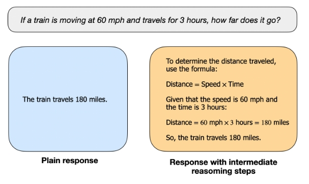
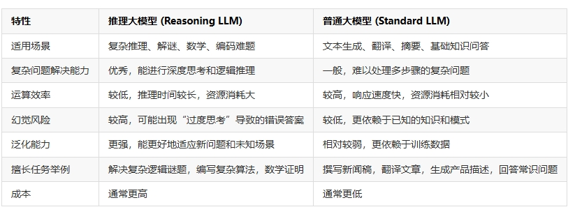
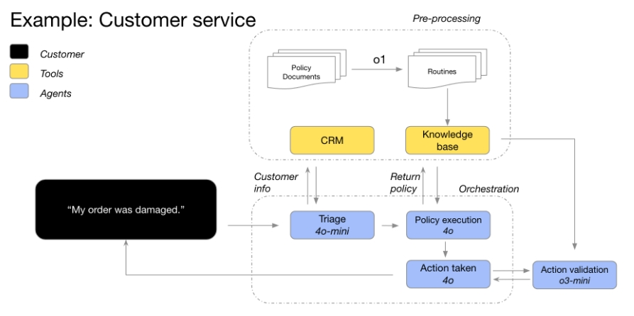

# 推理大模型面

- [推理大模型面](#推理大模型面)
  - [一、什么是思维链？](#一什么是思维链)
  - [二、什么是推理大模型？](#二什么是推理大模型)
  - [三、什么是推理？](#三什么是推理)
  - [四、相比于普通大模型，推理大模型有什么优点？](#四相比于普通大模型推理大模型有什么优点)
  - [五、什么时候适合使用推理大模型？](#五什么时候适合使用推理大模型)
  - [六、推理大模型的推理过程是否是必须生成？](#六推理大模型的推理过程是否是必须生成)
  - [七、如何训练推理大模型？](#七如何训练推理大模型)
    - [7.1 什么是 推理时扩展（Inference-time scaling）？](#71-什么是-推理时扩展inference-time-scaling)
    - [7.2 什么是 纯强化学习（Pure reinforcement learning, RL）？](#72-什么是-纯强化学习pure-reinforcement-learning-rl)
    - [7.3 什么是 监督微调与强化学习结合（Supervised fine-tuning and reinforcement learning, SFT + RL）？](#73-什么是-监督微调与强化学习结合supervised-fine-tuning-and-reinforcement-learning-sft--rl)
    - [7.4 什么是 纯监督微调与蒸馏（Pure supervised fine-tuning and distillation）？](#74-什么是-纯监督微调与蒸馏pure-supervised-fine-tuning-and-distillation)
  - [八、推理大模型和普通大模型的简单对比？](#八推理大模型和普通大模型的简单对比)
  - [九、推理大模型的提示词（prompt）如何写？](#九推理大模型的提示词prompt如何写)
  - [致谢](#致谢)

## 一、什么是思维链？

**思维链是一种提示大语言模型进行逐步推理的方法**。

它让模型在得出最终答案之前，先显式地写出推理的中间步骤。这就像人类解决复杂问题时会先把思考过程写下来一样。

## 二、什么是推理大模型？

在OpenAI的官网上，OpenAI定义推理模型是**在回答之前进行思考，并在回复用户之前，在内部生成一长串的思维链过程**。

也就是说，如果模型在回复你之前有一长串的思考过程（这个过程必须可以显示输出），探索了很多不同的路径之后给出答案，那么有这个能力的大模型就是推理大模型。

虽然没有正式定义，但是目前AI产业界和学术界都有这样的共识：**推理模型的核心在于处理那些需要多步骤逻辑推导才能解决的复杂问题**。

## 三、什么是推理？

Sebastian Raschka博士（威斯康星大学麦迪逊分校的前统计学助理教授，Lightning AI的首席教育学家）**将“推理”定义为通过生成中间步骤来回答复杂问题的过程**。

> 举个栗子：

- **非推理问题**：”法国的首都是哪里？”（答案直接、无需推导）
- **推理问题**：”一列火车以每小时60英里的速度行驶3小时，行驶距离是多少？”（需先理解”距离=速度×时间”的关系，再分步计算）

## 四、相比于普通大模型，推理大模型有什么优点？

以上述问题为例，

- **普通的大语言模型（LLM）**可能直接输出简短答案（如”180英里”）；
- **推理模型**的特点在于显式展示中间推导过程。例如：

```s
步骤1：识别问题类型（速度、时间与距离的关系）
步骤2：应用公式距离 = 速度 × 时间
步骤3：代入数值计算60 mph × 3小时 = 180英里
```



早期LLM已能解决基础数学题（如上述火车问题），但随着技术发展，现代”推理模型”更多指代擅长复杂任务的LLM，例如：

- 解谜题（如逻辑谜题”谁养鱼？”）
- 数学证明（如几何题的多步推导）
- 多模态推理（结合文本、图表或代码分析问题）

值得注意的是，许多通用LLM（如GPT-4）虽未被专门标注为”推理模型”，仍可通过Prompt工程（如”请分步骤解答”）输出中间过程。但是，OpenAI在官方博客中强调，OpenAI o1模型并不是简单的提示工程来让大模型获得推理能力，而是全新的架构和训练方法。

## 五、什么时候适合使用推理大模型？

虽然推理模型擅长解决复杂的任务，如解谜、数学问题和具有挑战性的编码任务，但对于诸如总结、翻译或基于知识的问答等较简单的任务，它们并非总是必要或高效。对每个任务都使用推理模型可能效率低下且容易出错。



上表总结了两类模型的对比。

- **推理模型**：擅长复杂问题解决、策略规划、模糊信息处理，适用于高精度领域（如法律、金融、工程）。
- **GPT模型**：低延迟、低成本，适合明确任务的快速执行。

具体来说，我们可以看到如下的选择标准：

- 速度与成本优先 → 普通大模型（如GPT-4o）
- 任务明确性 → 普通大模型（如GPT-4o）
- 准确性/复杂性 → 推理大模型（如o1、R1系列）
- 典型工作流：推理大模型规划，普通大模型执行。



根据OpenAI官方的建议，大多数工作流的场景都可以使用推理大模型和普通大模型混排的方式进行，如上图所示。即**推理大模型用来做agent的推理和规划以及决策，普通大模型执行**。

## 六、推理大模型的推理过程是否是必须生成？

这里还有一个争论，就是推理大模型的“思考”过程是否必须显示生成？这里说的显示生成就是推理大模型思考过程也是文本生成，这个生成是否可以省略，直接内部运算。这样可以提高生成速度，节省大量成本。

**答案很可能是“不可以”**。这个思考过程对于大模型能否准确的得出结论非常重要。

> 最早在推理大模型还没有生成的时候，著名AI博主宝玉最早在OpenAI的GPTs上发布了一个效果很好的翻译GPTs，当时没有推理大模型，它的核心思想是生成一版直译，然后根据直译结果找出错误，最后根据错误修正。这个过程非常费tokens，但是效果很好。**有人曾经问过是否可以通过prompt工程省去前面2个步骤。当时的测试结果就发现，如果前面过程没有显示输出，效果会差很多**。

这个结论和CoT推理的显示输出可能是一样的。而这个过程可能也是OpenAI做推理大模型训练的一个核心数据。为了避免其他人通过OpenAI的推理大模型被用于训练其它模型，或者被外部看到实现细节，OpenAI一开始就隐藏了这个过程。但实际内部还是会生成（当然，随着DeepSeek R1的开源，这个策略显得有点“可笑”~）。

## 七、如何训练推理大模型？

当前，训练推理大模型主要有4类方法，分别是**推理时扩展（Inference-time scaling）**、**纯强化学习（Pure reinforcement learning, RL）**、**监督微调与强化学习结合（Supervised fine-tuning and reinforcement learning, SFT + RL）**和**纯监督微调与蒸馏（Pure supervised fine-tuning and distillation）**。

### 7.1 什么是 推理时扩展（Inference-time scaling）？

推理时扩展有两种策略：

- 策略一：在推理过程中增加计算资源，以提高输出质量。

> 例如，通过巧妙的提示工程（如链式思维提示，Chain-of-Thought，CoT）来鼓励模型逐步推理，从而提高复杂问题的准确性。

- 策略二：使用投票或搜索策略，比如多数投票或束搜索（beam search），以生成更好的响应。

> 注：推理时扩展是OpenAI o1发布时候OpenAI强调的，应该也是误导了大量的大模型从业者。其实**OpenAI训练推理大模型核心创新可能是第二类方法，即纯强化学习训练**。

### 7.2 什么是 纯强化学习（Pure reinforcement learning, RL）？

**纯强化学习指的是直接通过强化学习训练模型，而不依赖于传统的监督微调（SFT）**。

> 例如，DeepSeek-R1-Zero 模型通过纯 RL 方法进行训练，利用准确性奖励和格式奖励来推动模型生成推理步骤，尽管该模型未经过传统的监督学习阶段。这个过程证明了推理能力可以通过纯 RL 得到提升。

### 7.3 什么是 监督微调与强化学习结合（Supervised fine-tuning and reinforcement learning, SFT + RL）？

**监督微调与强化学习结合（Supervised fine-tuning and reinforcement learning, SFT + RL）结合了监督微调和强化学习，通过先进行监督微调，再通过强化学习阶段进一步提升模型的推理能力**。

> 注：DeepSeek-R1 模型就采用了这一方法，先通过深度学习模型生成初步的监督微调数据，然后进行多轮强化学习以进一步提升推理精度和一致性。

### 7.4 什么是 纯监督微调与蒸馏（Pure supervised fine-tuning and distillation）？

在此方法中，模型通过纯监督微调（SFT）进行训练，特别是通过蒸馏过程将大型模型的知识传递给小型模型。蒸馏过程中，小型模型通过使用更大模型生成的监督微调数据来学习。尽管这些蒸馏模型通常较小，性能较弱，但它们相对于未经过蒸馏的模型仍能展现出令人惊讶的推理能力。

## 八、推理大模型和普通大模型的简单对比？

**推理大模型**可以针对复杂的任务进行更长更深的思考，**因此在制定战略、规划解决复杂问题的方案以及在大量模糊信息中做出决策方面表现得非常有效**。这些模型还可以高精度和高准确度地执行任务，因此它们非常适合那些本来需要人类专家的领域，比如数学、科学、工程、金融服务和法律服务。

而**普通的GPT系列大模型**则**具有更低的延迟和成本，更适合用来直接执行任务**。因此，在大模型的应用系统中，我们通常可以使用推理大模型进行任务规划，然后使用普通大模型来执行具体任务，特别是当任务的执行速度和成本的优先级高于准确性的时候。

## 九、推理大模型的提示词（prompt）如何写？

推理大模型的提示词与普通大模型是有少许区别的。为此，OpenAI官方给出了推理大模型的一些提示词技巧总结。需要注意的是，这里写的是针对o1系列推理大模型，其它推理大模型可能有一些区别。

特别需要指出的是推理大模型在接受简洁明了的提示时表现最好。某些提示工程技巧，如要求模型“逐步思考”，可能不会提高性能，甚至可能会影响其效果。

以下是一些最佳实践：

- 开发者消息取代系统消息：从2024年12月17日起，推理模型将支持开发者消息而非系统消息，这与模型规范中描述的命令链行为保持一致。
- 保持提示简单直接：这些模型擅长理解和回应简洁、清晰的指令。
- 避免链式思维提示：由于这些模型内部进行推理，因此无需提示它们“逐步思考”或“解释推理过程”。
- 使用分隔符提高清晰度：使用像Markdown、XML标签和章节标题这样的分隔符，可以清晰地标明输入的不同部分，帮助模型正确理解每个部分。
- 优先尝试零样本提示，再根据需要使用少量样本提示：推理模型通常不需要少量示例就能产生好的结果，因此首先可以尝试没有示例的提示。如果你有更复杂的输出需求，加入几个输入和预期输出的示例可能会有所帮助。只要确保示例与提示指令高度一致，避免因不一致而导致不良结果。
- 提供具体的指导：如果你希望模型的回答受到某些限制（例如“提出一个预算在500美元以内的解决方案”），请在提示中明确说明这些限制。
- 明确目标：在指令中尽量提供清晰、具体的成功标准，并鼓励模型不断推理和迭代，直到满足你的成功标准。
- Markdown格式：从2024年12月17日起，API中的推理模型将避免生成带有Markdown格式的回答。如果你确实希望生成Markdown格式的回答，可以在开发者消息的第一行包含字符串“Formatting re-enabled”以提示模型。

可以看到，第一条和最后一条其实是针对OpenAI的推理大模型系列的，其它推理大模型如DeepSeek R1可能不合适。

## 致谢

- 什么是推理大模型？DeepSeek R1推理大模型与DeepSeek V3模型的区别是什么？什么时候该使用推理大模型？  https://www.datalearner.com/blog/1051739005308959
- 什么时候该使用推理大模型？OpenAI官方推出推理大模型和大语言模型的最佳使用指南   https://www.datalearner.com/blog/1051739498658553

