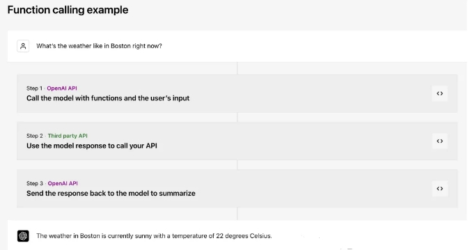
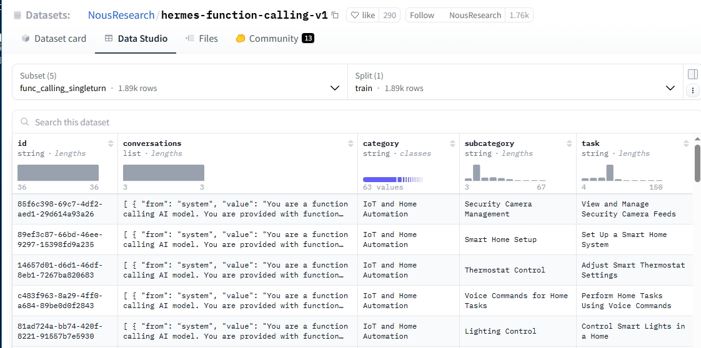
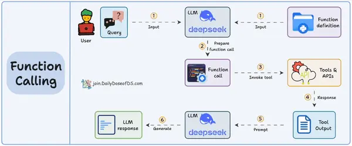
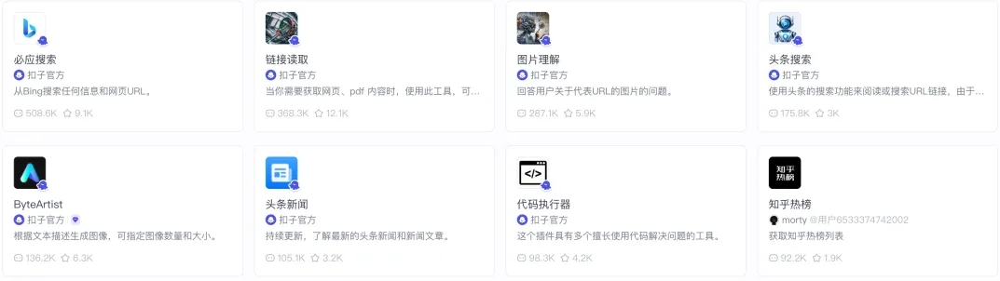
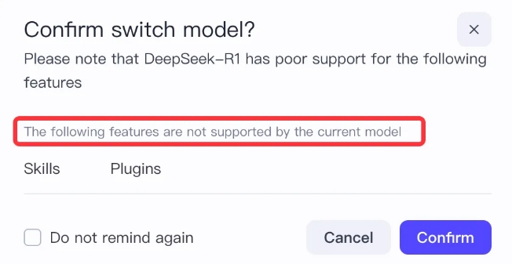
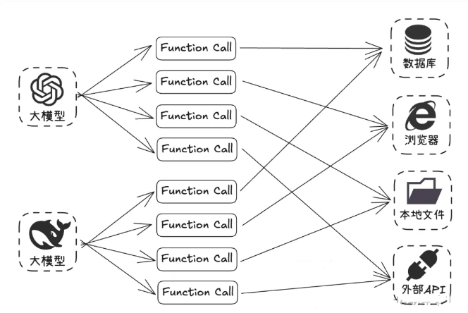

# Function Call 面试常考题篇

- [Function Call 面试常考题篇](#function-call-面试常考题篇)
  - [1 为什么需要 Function Call？](#1-为什么需要-function-call)
  - [2 什么是 Function Call？](#2-什么是-function-call)
  - [3 如何让 大模型 具备 Function call 能力？](#3-如何让-大模型-具备-function-call-能力)
  - [4 大模型 的 Function call 能力的训练核心思想？](#4-大模型-的-function-call-能力的训练核心思想)
  - [5 大模型 的 Function call 能力的训练过程？](#5-大模型-的-function-call-能力的训练过程)
  - [6 大模型 的 Function call 能力的训练过程？](#6-大模型-的-function-call-能力的训练过程)
  - [7 Function call怎么组织文本的格式喂给模型？](#7-function-call怎么组织文本的格式喂给模型)
    - [7.1 Function-Call数据集 基本结构](#71-function-call数据集-基本结构)
    - [7.2 Function-Call数据集 可用函数/工具描述区的格式](#72-function-call数据集-可用函数工具描述区的格式)
    - [7.3 Function-Call数据集 关键要素](#73-function-call数据集-关键要素)
    - [7.4 Function-Call数据集 对话流程中的格式](#74-function-call数据集-对话流程中的格式)
  - [8 Function call怎么把下游的一些工具，插件变成模型可以理解的方式？](#8-function-call怎么把下游的一些工具插件变成模型可以理解的方式)
    - [8.1 标准化描述 (Standardized Description)](#81-标准化描述-standardized-description)
    - [8.2 执行对接 (Execution Bridging)](#82-执行对接-execution-bridging)
  - [9 Function Call 工作原理？](#9-function-call-工作原理)
  - [10 Function Call 存在什么问题？](#10-function-call-存在什么问题)
  - [11 总结](#11-总结)

## 1 为什么需要 Function Call？

以前的 AI 大模型就像一个知识丰富但被困在屋子里的人，只能依靠自己已有的知识回答问题，无法直接获取实时数据或与外部系统交互，比如不能直接访问数据库里的最新信息，也不能使用一些外部工具来完成特定任务。

## 2 什么是 Function Call？

Function Call 是 OPEN AI 在 2023 年推出的一个非常重要的概念：



**Function Call（函数调用） 本质上就是提供了大模型与外部系统交互的能力，类似于给大模型安装一个 “外挂工具箱”。当大模型遇到自己无法直接回答的问题时，它会主动调用预设的函数（如查询天气、计算数据、访问数据库等），获取实时或精准信息后再生成回答**。

## 3 如何让 大模型 具备 Function call 能力？

将 Function Calling 能力赋予 LLM 主要通过监督微调 (Supervised Fine-tuning, SFT) 实现，而不是在预训练阶段从零开始专门训练。基础模型需要先具备良好的指令遵循和代码/结构化数据生成能力。

## 4 大模型 的 Function call 能力的训练核心思想？

训练/微调的核心思想，其实就是要 教会大模型两件事：

1. **识别意图 (Intent Recognition)**: 理解用户的请求是否需要借助外部工具/函数来完成，而不是直接生成文本回答。
2. **参数提取与格式化 (Argument Extraction & Formatting)**: 如果需要调用函数，正确地从用户请求中抽取出所需的参数，并按照预先定义的格式（通常是 JSON）生成函数调用的指令。

## 5 大模型 的 Function call 能力的训练过程？

- step 1: **数据集构建**: 这是最关键的一步。需要构建一个包含 Function Calling 场景的指令微调数据集。每条数据样本通常包含：

1. 用户输入 (Input/Query): 一个可能需要或不需要调用函数的用户请求。例如：“查询北京今天的天气怎么样？” 或 “给我写一首关于春天的诗”。
2. 可用函数/工具描述 (Available Functions/Tools Description): 一个结构化的描述，告知模型当前有哪些函数可用，每个函数的用途、所需参数及其类型和描述。这个描述本身通常就是文本，需要设计一种清晰的格式（见下一个问题）。
3. 期望的输出 (Desired Output):
   1. 如果需要调用函数: 一个特定格式的字符串，通常是包含函数名和提取出的参数的 JSON 对象。
   2. 如果不需要调用函数: 模型应该生成的直接文本回答。例如：“好的，这是一首关于春天的诗：...”

```s
{
  "name": "get_weather",
  "arguments": {
    "city": "北京",
    "date": "今天"
  }
}
```

- step 2: **选择基础模型**: 选择一个具备强大指令遵循能力的预训练 LLM (例如 Llama, GPT, ChatGLM 等)。
- step 3: **格式化训练数据**: 将每条数据样本组合成模型可以理解的格式。通常是将“用户输入”和“可用函数描述”拼接起来作为模型的输入 (Prompt)，将“期望的输出”（无论是 JSON 函数调用还是文本回答）作为目标输出 (Completion/Target)。需要使用特定的分隔符或模板来区分不同部分。
- step 4：**进行微调**: 使用标准的 SFT 方法（全参数微调或 PEFT 如 LoRA）在准备好的数据集上训练模型。模型的优化目标是最小化预测输出和期望输出之间的差异（例如，使用交叉熵损失）。模型通过学习这些样本，学会根据用户输入和可用函数描述，决定是直接回答还是生成特定格式的函数调用 JSON。

## 6 大模型 的 Function call 能力的训练过程？

- **数据集质量**: 需要足够多、覆盖各种场景（需要/不需要调用、不同函数、参数变化、模糊表达）的高质量数据。
- **函数描述的清晰度**: 函数描述的质量直接影响模型能否正确理解和使用函数。
- **负样本**: 需要包含足够多明确不需要调用函数的样本，防止模型“过度触发”函数调用。

## 7 Function call怎么组织文本的格式喂给模型？

目前已开源的所有 Function-Call数据集 ：https://hf-mirror.com/datasets?search=function-calling

> 以 hermes-function-calling-v1（https://hf-mirror.com/datasets/NousResearch/hermes-function-calling-v1） 为例 



在训练和推理时，将信息喂给模型的格式至关重要。虽然没有绝对统一的标准，但通常遵循以下结构，通过特殊的提示词（Prompting）或模板来实现：

### 7.1 Function-Call数据集 基本结构

```s
[系统提示/全局指令]  (可选，设定角色、能力边界等)

[可用函数/工具描述区]
(这里详细列出每个可用函数的结构化描述)

[对话历史] (可选，对于多轮对话很重要)
User: ...
Assistant: ...
User: ... (当前用户请求)

[触发指令/分隔符] (提示模型开始思考或生成)
Assistant:
```

### 7.2 Function-Call数据集 可用函数/工具描述区的格式

这是核心部分，需要清晰地传达每个函数的信息。常见做法是使用 JSON 列表或类似的结构化文本：

```s
Functions available:
[
  {
    "name": "get_weather",
    "description": "查询指定城市和日期的天气信息。",
    "parameters": {
      "type": "object",
      "properties": {
        "city": {
          "type": "string",
          "description": "需要查询天气的城市名称，例如：北京"
        },
        "date": {
          "type": "string",
          "description": "需要查询的日期，例如：今天、明天、2023-10-26"
        }
      },
      "required": ["city", "date"] // 指明哪些参数是必须的
    }
  },
  {
    "name": "send_email",
    "description": "发送邮件给指定的收件人。",
    "parameters": {
      "type": "object",
      "properties": {
        "recipient": {
          "type": "string",
          "description": "收件人的邮箱地址"
        },
        "subject": {
          "type": "string",
          "description": "邮件主题"
        },
        "body": {
          "type": "string",
          "description": "邮件正文内容"
        }
      },
      "required": ["recipient", "subject", "body"]
    }
  }
  // ... 可以有更多函数描述
]
```

### 7.3 Function-Call数据集 关键要素

- name: 函数的唯一标识符。
- description: 用自然语言清晰描述函数的功能和适用场景，这是模型理解何时调用该函数的关键。
- parameters: 定义函数接受的参数。
  - type: 通常是 "object"。
  - properties: 一个对象，列出每个参数的名称、类型 (string, integer, boolean, enum 等) 和描述 (解释参数的含义和格式)。
  - required: 一个列表，包含必须提供的参数名称。

### 7.4 Function-Call数据集 对话流程中的格式

- **用户请求**: 用户发出请求

> 例如 "帮我查一下明天上海的天气，然后给张三发邮件告诉他结果"。

- **模型首次响应 (Function Call)**: 模型识别到需要调用 get_weather，生成 JSON

```s
{
  "name": "get_weather",
  "arguments": {
    "city": "上海",
    "date": "明天"
  }
}
```

- **外部执行**: 应用程序捕获这个 JSON，调用实际的天气 API。
- **将结果喂回模型**: 将 API 返回的天气结果格式化后，作为新的输入信息提供给模型。

```s
Function Result for get_weather:
{
  "temperature": "25°C",
  "condition": "晴朗"
}
```

- **模型再次响应 (可能再次 Function Call 或最终回答)**: 模型看到天气结果，现在需要执行邮件发送任务，生成 JSON：

```s
{
  "name": "send_email",
  "arguments": {
    "recipient": "张三", // 可能需要澄清张三的邮箱
    "subject": "明天上海天气",
    "body": "明天上海的天气是 25°C，天气晴朗。"
  }
}
```

- **外部执行**: 应用程序调用邮件发送服务。
- **将结果喂回模型**: 告知邮件发送成功。
- **模型最终回答**: 模型生成最终的自然语言回复给用户：“我已经查询到明天上海天气是25°C，晴朗，并且已经发邮件告诉张三了。”

## 8 Function call怎么把下游的一些工具，插件变成模型可以理解的方式？

这个过程的核心是 **标准化描述 (Standardized Description)** 和 **执行对接 (Execution Bridging)**。

### 8.1 标准化描述 (Standardized Description)

- **定义 Schema**: 为每个工具、插件或 API 设计一个符合上述 Function Call 格式的结构化描述（JSON Schema 是常用方式）。这个 Schema 必须清晰地包含：
  - **唯一名称 (Name)**: 用于模型识别调用哪个工具。
  - **功能描述 (Description)**: 清晰说明工具的作用、输入、输出，以及何时应该使用它。这是 LLM 理解的关键。
  - **参数定义 (Parameters)**: 详细列出工具需要的每个参数的名称、数据类型、是否必需以及描述。
- **编写高质量描述**: 描述语言要自然、准确、无歧义。LLM 依赖这些描述来判断用户的意图是否与工具功能匹配。例如，避免使用过于技术化或模糊的术语。

### 8.2 执行对接 (Execution Bridging)

- **提供描述给模型**: 在每次与模型交互时，将所有当前可用的工具的标准化描述作为上下文信息传递给模型（通常放在 Prompt 的特定区域）。
- **解析模型输出**: 应用程序需要监听模型的输出。如果输出是符合预定义格式的 Function Call JSON，则解析它。
- **调用实际工具**: 根据解析出的 name 找到对应的下游工具/插件/API。
- **参数映射与校验**: 从 arguments 中提取参数值，进行必要的类型转换和校验，然后调用实际的工具接口。
- **结果处理**: 获取工具执行的结果（成功响应或错误信息）。
- **结果反馈给模型**: 将执行结果格式化成文本，再次输入给模型，让模型基于这个结果继续生成回复或执行下一步操作。

## 9 Function Call 工作原理？

1. LLM 收到来自用户的提示。
2. LLM 决定它需要的工具。
3. 程序员实现过程以接受来自 LLM 的工具调用请求并准备函数调用。
4. 函数调用（带参数）将传递给将处理实际执行的后端服务。



## 10 Function Call 存在什么问题？

虽然在 Coze 这种零代码 Agent 搭建平台上看到的插件，其实都是基于 Function Call 的思路来封装的：



这个能力确实是挺好的，给了大模型更多的可能性，但是它有一个比较大的缺点，就是实现成本太高了。

在 MCP 出现之前，**开发者想实现 Function Call 的成本是比较高的，首先得需要模型本身能够稳定支持 Function Call 的调用，比如我们在 Coze 中选择某些模型时提示，选择的模型不支持插件的调用，其实就是不支持 Function Call 的调用**：



> 在标准的 sharegpt 风格的数据集中就提供了专门用于 Function Call 训练的特殊字段。
```s
[
  {
    "conversations": [
      {
        "from": "human",
        "value": "人类指令"
      },
      {
        "from": "function_call",
        "value": "工具参数"
      },
      {
        "from": "observation",
        "value": "工具结果"
      },
      {
        "from": "gpt",
        "value": "模型回答"
      }
    ],
    "system": "系统提示词（选填）",
    "tools": "工具描述（选填）"
  }
]
```

这也就意味着模型本身需要进行过专门的 Function Call 调用微调才能稳定支持这种能力。

另外还有一个比较大的问题，OPEN AI 最开始提出这项技术的时候，并没有想让它成为一项标准，所以虽然后续很多模型也支持了 Function Call 的调用，但是各自实现的方式都不太一样。

这也就意味着，**如果我们要发开一个 Function Call 工具，需要对不同的模型进行适配，比如参数格式、触发逻辑、返回结构等等，这个成本是非常高的**。



这也大大提高了 AI Agent 的开发门槛，所以在以前我们大部分情况下只能通过 Dify、Coze 这些平台来构建 Agent。

## 11 总结

- 核心特点
  - **模型专属**：不同模型（GPT/Claude/DeepSeek）的调用规则不同
  - **即时触发**：模型解析用户意图后直接调用工具
  - **简单直接**：适合单一功能调用（如"查北京温度"→调用天气API）
- 痛点
  - **协议碎片化**：需为每个模型单独开发适配层
  - **功能扩展难**：新增工具需重新训练模型或调整接口
- 类比
  - 不同品牌手机的充电接口（Lightning/USB-C），设备间无法通用

**Function call 就是为每个工具制作一个清晰的“说明书”（Schema/描述），让模型能看懂。然后建立一个“翻译和执行”层，负责把模型根据说明书写的“指令”（JSON Call）转换成对实际工具的操作，并把工具的“回执”（结果）再翻译给模型听**。


