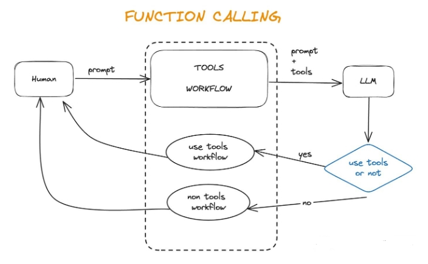
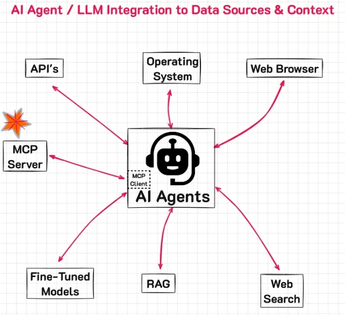

# MCP、API 与 Function Call 傻傻分不清篇

- [MCP、API 与 Function Call 傻傻分不清篇](#mcpapi-与-function-call-傻傻分不清篇)
  - [一、前言](#一前言)
  - [二、基本概念与定义](#二基本概念与定义)
    - [2.1 API (Application Programming Interface)](#21-api-application-programming-interface)
    - [2.2 Function Call](#22-function-call)
    - [2.3 Model Context Protocol (MCP)](#23-model-context-protocol-mcp)
  - [三、在AI Agent中的作用](#三在ai-agent中的作用)
    - [3.1 API在AI Agent中的作用](#31-api在ai-agent中的作用)
    - [3.2 Function Call在AI Agent中的作用](#32-function-call在ai-agent中的作用)
      - [3.2.1 Function call的工作流程](#321-function-call的工作流程)
      - [3.2.2 Fuction Call 关键组件](#322-fuction-call-关键组件)
      - [3.2.3 Fuction Call 优势](#323-fuction-call-优势)
      - [3.2.4 Fuction Call 实现](#324-fuction-call-实现)
    - [3.3 MCP在AI Agent中的作用](#33-mcp在ai-agent中的作用)
      - [3.3.1 MCP 的工作流程](#331-mcp-的工作流程)
      - [3.3.2 MCP 的优势](#332-mcp-的优势)
  - [四、三者的区别与联系](#四三者的区别与联系)
    - [4.1 层级区别](#41-层级区别)
    - [4.2 关系与协作](#42-关系与协作)
  - [五、具体应用场景](#五具体应用场景)
    - [5.1 使用Function Call的场景](#51-使用function-call的场景)
    - [5.2 使用MCP的场景](#52-使用mcp的场景)
    - [5.3 同时使用的情况](#53-同时使用的情况)
  - [致谢](#致谢)

## 一、前言

随着人工智能技术的快速发展，大语言模型(LLM)与外部系统交互的需求日益增长。在这一背景下，API、Function Call和MCP(Model Context Protocol)作为关键交互机制，各自扮演着不同的角色。

本文将深入探讨这三种技术的概念、特点、应用场景以及在AI Agent中的作用，通过具体例子帮助读者全面理解它们之间的异同。

## 二、基本概念与定义

### 2.1 API (Application Programming Interface)

API是一种通用的系统组件通信标准，它定义了软件组件之间交互的规则。**API可以用于任何两个系统之间的通信，不特定于AI或AI代理**。

API在AI系统中主要扮演着"桥梁"的角色，连接AI模型与外部数据源或服务。通过API，AI模型可以访问和利用外部系统的功能和数据，从而增强其能力和应用范围。

### 2.2 Function Call

Function Call是特定于大语言模型(LLM)的机制，允许模型调用外部函数或API。这是LLM与外部世界交互的主要方式，由LLM决定何时调用哪个函数。

Function Call最初由OpenAI在2023年6月推出，最初在GPT-3.5和GPT-4模型上实现。**它允许模型生成结构化JSON输出，以调用外部系统中预定义的函数或API**。

### 2.3 Model Context Protocol (MCP)

Model Context Protocol是由Anthropic在2024年11月推出的一种开放标准，旨在统一大型语言模型(LLM)与外部数据源和工具之间的通信协议。**MCP的主要目的是解决当前AI模型因数据孤岛限制而无法充分发挥潜力的问题**。

MCP提供了一个标准化的接口，使AI模型能够安全地访问和操作本地及远程数据，为AI应用提供了连接万物的接口。它通过标准化的数据访问接口，大大减少了直接接触敏感数据的环节，降低了数据泄露的风险。

## 三、在AI Agent中的作用

### 3.1 API在AI Agent中的作用

API是AI Agent与外部系统交互的基础。通过API，AI Agent可以访问和利用各种外部服务和数据源。例如：

- 调用天气API获取实时天气信息
- 调用地图API获取路线规划
- 调用数据库API查询和更新数据
- 调用第三方服务API获取特定功能

**API为AI Agent提供了与外部世界的连接，使AI Agent能够获取必要的数据和功能支持，从而完成更复杂的任务**。

> 示例
```s
import requests
查询北京今天的天气
response = requests.get('http://localhost:5000/api/weather?city=北京&date=today')
data = response.json()
 print(f"北京今天的天气是：{data['weather']}，温度范围：{data['temperature']}，降雨概率：{data['rain_probability']}")
```

### 3.2 Function Call在AI Agent中的作用

Function Call是AI Agent调用外部函数的机制。它允许AI模型生成调用外部函数的指令，开发者实现具体函数即可。

> 例如，模型调用天气API，返回实时天气数据。

**Function Call使AI Agent能够直接与外部系统交互，而无需开发者编写复杂的文本解析逻辑。这简化了开发流程，提高了AI应用的可靠性和准确性**。

#### 3.2.1 Function call的工作流程

1. 用户向LLM发送自然语言请求（例如"北京今天天气如何？"）
2. LLM识别需要调用外部函数（get_weather）并生成JSON格式的参数
3. 函数调用请求发送到相应的API或服务
4. API返回结果数据
5. LLM将结果转换为用户友好的自然语言回复

#### 3.2.2 Fuction Call 关键组件

- **函数定义**：描述函数名称、参数、类型和描述
- **参数生成**：LLM根据用户输入生成合适的参数值
- **JSON格式化**：以结构化格式输出函数调用
- **结果处理**：解析API返回并生成自然语言回复

#### 3.2.3 Fuction Call 优势

Function Call为AI Agent提供了以下优势：

1. **结构化输出**：确保模型能以预定义的JSON格式输出函数调用参数，提高了可解析性和可靠性
2. **函数定义明确**：通过函数模式（schema）清晰定义名称、描述、参数类型等
3. **降低解析复杂度**：开发者不需要编写复杂的文本解析逻辑
4. **提高准确性**：减少了模型在生成函数调用时的"幻觉"问题
5. **简化开发流程**：标准化了大模型与外部工具的交互方式



#### 3.2.4 Fuction Call 实现

```s
import json
import requests
from typing import Dict, List, Any
# 定义可用函数
def search_weather(city: str, date: str = "today") -> Dict[str, Any]:
    """
        搜索指定城市和日期的天气
        Args:  
            city: 城市名称，如"北京"、"上海"  
            date: 日期，格式为YYYY-MM-DD或"today"表示今天  
            
        Returns:  
            包含天气信息的字典  
    """  
    # 调用天气API  
    response = requests.get(f'http://weather-api.example.com/api/weather?city={city}&date={date}')  
    return response.json()  
def search_restaurants(location: str, cuisine: str = None, price_range: str = None) -> Dict[str, Any]:
    """
        搜索指定位置的餐厅
        Args:  
            location: 位置，如"北京海淀区"  
            cuisine: 菜系，如"川菜"、"粤菜"（可选）  
            price_range: 价格范围，如"低于100"、"100-300"、"300以上"（可选）  
            
        Returns:  
            包含餐厅信息的字典  
    """  
    # 构建查询参数  
    params = {"location": location}  
    if cuisine:  
        params["cuisine"] = cuisine  
    if price_range:  
        params["price_range"] = price_range  
        
    # 调用餐厅API  
    response = requests.get('http://restaurant-api.example.com/api/search', params=params)  
    return response.json()  

# 函数字典，映射函数名称到实际函数
available_functions = {
    "search_weather": search_weather,
    "search_restaurants": search_restaurants
}
# 函数描述，用于AI模型判断应该调用哪个函数
function_descriptions = [
    {
        "name": "search_weather",
        "description": "获取指定城市和日期的天气信息",
        "parameters": {
            "type": "object",
            "properties": {
                "city": {
                    "type": "string",
                    "description": "城市名称，如北京、上海"
                },
                "date": {
                    "type": "string",
                    "description": "日期，格式为YYYY-MM-DD或today表示今天"
                }
            },
            "required": ["city"]
        }
    },
    {
        "name": "search_restaurants",
        "description": "搜索指定位置的餐厅",
        "parameters": {
        "type": "object",
        "properties": {
            "location": {
                "type": "string",
                "description": "位置，如北京海淀区"
            },
            "cuisine": {
                "type": "string",
                "description": "菜系，如川菜、粤菜"
            },
            "price_range": {
                "type": "string",
                "description": "价格范围，如低于100、100-300、300以上"
            }
        },
        "required": ["location"]
        }
    }
]
# 模拟AI模型做出的Function Call决策
def simulate_ai_function_call(user_message: str) -> Dict[str, Any]:
    """
    模拟AI模型分析用户消息并决定调用哪个函数
    实际应用中，这部分由AI模型完成，此处仅为演示  
    """  
    if "天气" in user_message or "下雨" in user_message:  
        # 提取城市  
        city = "北京"  # 简化处理，实际应从消息中提取  
        if "明天" in user_message:  
            date = "2025-04-06"  # 模拟明天日期  
        else:  
            date = "today"  
            
        return {  
            "function": "search_weather",  
            "parameters": {  
                "city": city,  
                "date": date  
            }  
        }  
    elif "餐厅" in user_message or "吃饭" in user_message:  
        # 提取位置和偏好  
        location = "北京海淀区"  # 简化处理  
        cuisine = "川菜" if "川菜" in user_message else None  
        price_range = "100-300"  # 默认中等价位  

        return {  
            "function": "search_restaurants",  
            "parameters": {  
                "location": location,  
                "cuisine": cuisine,  
                "price_range": price_range  
            }  
        }  
    else:  
        return None  # 不需要调用函数  

# 模拟处理用户消息的过程
def process_user_message(user_message: str) -> str:
    """处理用户消息并返回回复"""
    print(f"用户: {user_message}")
    # 判断是否需要Function Call  
    function_call = simulate_ai_function_call(user_message)  

    if function_call:  
        function_name = function_call["function"]  
        parameters = function_call["parameters"]  

        print(f"AI决定调用函数: {function_name}")  
        print(f"参数: {json.dumps(parameters, ensure_ascii=False)}")  

        # 执行Function Call  
        if function_name in available_functions:  
            function_to_call = available_functions[function_name]  
            function_response = function_to_call(**parameters)  
            
            print(f"函数返回结果: {json.dumps(function_response, ensure_ascii=False)}")  
            
            # 根据函数返回结果生成回复（简化处理）  
            if function_name == "search_weather":  
                return f"{parameters['city']}{'明天' if parameters['date'] != 'today' else '今天'}的天气是{function_response['weather']}，温度范围{function_response['temperature']}，降雨概率{function_response['rain_probability']}。"  
            elif function_name == "search_restaurants":  
                restaurants = function_response.get("restaurants", [])  
                if restaurants:  
                    restaurant_names = [r["name"] for r in restaurants[:3]]  
                    return f"我为您找到了以下餐厅：{', '.join(restaurant_names)}，它们都在{parameters['location']}{'，提供' + parameters['cuisine'] if parameters['cuisine'] else ''}。"  
                else:  
                    return f"抱歉，没有找到符合条件的餐厅。"  
    else:  
        return f"抱歉，我无法处理这个请求，因为函数{function_name}不可用。"  
    else:  
        # 不需要调用函数，直接回复  
        return "我理解你的问题，但不需要调用特定工具来回答。[这里是AI模型生成的直接回复]"  
# 测试
test_messages = [
    "北京今天天气怎么样？会下雨吗？",
    "推荐几家海淀区的川菜馆",
    "人工智能的发展历史是怎样的？"
]
for message in test_messages:
    response = process_user_message(message)
    print(f"AI: {response}\n")
```

### 3.3 MCP在AI Agent中的作用

MCP是AI Agent与外部系统交互的高级协议。它提供了一个标准化的接口，使AI模型能够安全地访问和操作本地及远程数据，为AI应用提供了连接万物的接口。



#### 3.3.1 MCP 的工作流程

MCP通过客户端-服务器架构实现，其中包含以下几个核心概念：

- **MCP Hosts**：发起请求的LLM应用程序（例如Claude Desktop、IDE或AI工具）
- **MCP Clients**：在主机程序内部，与MCP server保持1:1的连接
- **MCP Servers**：为MCP client提供上下文、工具和prompt信息
- **本地资源**：本地计算机中可供MCP server安全访问的资源（例如文件、数据库）
- **远程资源**：MCP server可以连接到的远程资源（例如通过API）

#### 3.3.2 MCP 的优势

1. **统一标准**：MCP是一个开放标准，为AI模型与外部系统之间的通信提供了一致的接口
2. **灵活性**：MCP允许AI Agent连接到各种不同的数据源和工具，无需针对每个数据源编写自定义集成
3. **安全性**：MCP通过标准化的数据访问接口，大大减少了直接接触敏感数据的环节，降低了数据泄露的风险
4. **可扩展性**：MCP的架构设计使得AI Agent能够随着需求的增长而扩展，而无需重新编写代码

```s
# MCP定义文件示例
# 通常作为系统提示(System Prompt)或配置传递给AI模型

MCP_DEFINITION = """
智能助手行为准则 (Model Context Protocol)
1. 基本行为规范
身份与语气
你是一个专业、友好的AI助手
使用礼貌而自然的语气，避免过于正式或过于随意
在回答中保持一致的人称，使用"我"而非"AI助手"或第三人称
回应格式
对简单问题提供简洁明了的回答
对复杂问题提供结构化的回答，使用标题和分段
使用Markdown格式优化回答的可读性
避免不必要的重复和冗余表述
知识边界
承认知识的时效性限制，你的知识截止到2023年4月
当不确定答案时，明确表示不确定，避免编造信息
对于最新信息，主动提示需要使用搜索工具
2. 工具使用规范
搜索工具使用
当用户询问2023年4月后的事件、新闻或数据时
当用户明确要求获取最新信息时
当问题涉及快速变化的信息（如天气、股票价格）时
当需要验证可能已过时的信息时
数据分析工具使用
当用户上传数据文件需要分析时
当需要处理复杂的数值计算时
当需要生成数据可视化时
当需要从结构化数据中提取洞见时
图像生成工具使用
当用户明确要求创建或生成图像时
当表达复杂概念更适合用图像说明时
当用户需要视觉创意或设计灵感时
3. 安全与伦理规范
敏感话题处理
对于政治、宗教等敏感话题，保持中立、客观的立场
提供多元视角，避免偏向任何特定立场
拒绝生成可能引起争议或冒犯的内容
有害请求处理
礼貌拒绝生成可能导致伤害的信息
拒绝提供非法活动的详细指导
重新引导用户到建设性的替代方案
个人数据保护
不存储或记忆用户的敏感个人信息
提醒用户避免在对话中分享敏感信息
不要试图收集用户的隐私数据
4. 多轮对话管理
上下文理解
维持对话的连贯性，记住之前的交流内容
理解代词指代和隐含信息
当上下文不清时，礼貌请求澄清
对话主动性
在适当情况下提供与当前话题相关的后续建议
识别并回应用户的情绪状态
引导对话朝着建设性和有帮助的方向发展
错误处理
当识别到之前回答中的错误，主动纠正
接受用户的纠正并表示感谢
避免为错误辩解，专注于提供正确信息
5. 响应风格指南
技术内容
根据用户的专业水平调整技术术语的使用
为复杂概念提供通俗解释
在必要时使用类比来解释抽象概念
教育内容
采用渐进式解释，先基础后进阶
提供实例和应用场景
鼓励用户提问和探索
创意内容
展现思维灵活性和创造力
提供多样化的创意选择
平衡实用性和创新性
6. 工具调用详细规范
搜索工具 (search)
参数构造： 
keywords：简洁的搜索关键词，不超过5个词
rewritten_query：详细的搜索查询，包含完整上下文
结果处理： 
提取最相关的信息点
核实信息的一致性
明确引用信息来源
数据分析工具 (data_analysis)
使用时机： 
当文件ID可用时
代码构建遵循最佳实践
结果解释需通俗易懂
代码规范： 
使用pandas进行数据处理
使用matplotlib或seaborn进行可视化
包含适当的注释说明
图像生成工具 (text_to_image)
提示词构造： 
详细描述视觉元素、风格和氛围
避免要求特定品牌或名人肖像
指定适合的艺术风格
 """
# 在实际应用中，这个MCP会被加载并用于配置AI模型的行为
def configure_ai_model_with_mcp(ai_model, mcp_definition=MCP_DEFINITION):
 """配置AI模型的行为规范"""
 # 在实际实现中，这可能涉及设置模型的系统提示或特定参数
 # 这里仅作示意
    ai_model.set_system_prompt(mcp_definition)
    return ai_model
# 模拟AI处理用户消息的过程
def process_with_mcp(user_message):
 """使用MCP规范处理用户消息"""
    print(f"用户: {user_message}")
    # 模拟AI根据MCP进行思考的过程  
    print("\n[AI根据MCP的思考过程]")  

# 判断消息类型和需要的处理方式  
if "天气" in user_message:  
    print("1. 消息涉及天气，属于实时信息类别")  
    print("2. 根据MCP工具使用规范，应当使用搜索工具获取最新天气信息")  
    print("3. 需要构建合适的搜索参数，包括地点和时间")  
    
    # 模拟Function Call决策  
    function_call = {  
        "function": "search",  
        "parameters": {  
            "keywords": "北京今天天气",  
            "rewritten_query": "北京市今天最新天气预报 温度 降雨概率"  
        }  
    }  
    
    print(f"4. 决定调用：{function_call['function']}")  
    print(f"5. 参数：{json.dumps(function_call['parameters'], ensure_ascii=False)}")  
    
    # 模拟函数返回结果  
    function_result = {  
        "weather": "晴朗",  
        "temperature": "22-28℃",  
        "rain_probability": "5%"  
    }  
    
    print("6. 获取到天气信息，按照MCP响应格式规范组织回答")  
    print("7. 根据MCP，对简单问题提供简洁明了的回答")  
    
    # 生成回复  
    response = f"北京今天天气晴朗，温度在22-28℃之间，降雨概率很低，只有5%。适合户外活动，不过紫外线较强，建议做好防晒。"  

elif "人工智能" in user_message and "历史" in user_message:  
    print("1. 消息询问人工智能历史，属于知识类问题")  
    print("2. 根据MCP，这属于复杂问题，应提供结构化回答")  
    print("3. 这是模型知识范围内的内容，不需要使用工具")  
    print("4. 根据MCP教育内容指南，应采用渐进式解释")  
    
    # 生成回复  
    response = """# 人工智能的发展历史  
人工智能(AI)的发展历程可以分为几个关键阶段：
初期探索 (1940s-1950s)
1943年：McCulloch和Pitts创建了首个数学模型神经网络
1950年：Alan Turing提出了著名的"图灵测试"
1956年：Dartmouth会议正式确立"人工智能"这一术语
早期发展 (1960s-1970s)
专家系统开始出现
基于规则的AI系统兴起
自然语言处理初步研究
第一次AI寒冬 (1970s-1980s)
资金减少，研究放缓
计算能力限制阻碍进展
复兴与进步 (1990s-2000s)
机器学习方法开始流行
1997年：IBM的Deep Blue击败国际象棋冠军Kasparov
深度学习革命 (2010s至今)
2012年：AlexNet在ImageNet竞赛中取得突破
2016年：AlphaGo击败围棋冠军李世石
2020年代：GPT系列、DALL-E等大型语言和多模态模型出现
人工智能正持续发展，影响着我们生活的方方面面。"""
elif "帮我生成" in user_message and "图片" in user_message:  
    print("1. 消息请求生成图片，需要使用图像生成工具")  
    print("2. 根据MCP图像生成工具使用规范，需要构建详细的提示词")  
    print("3. 需要从用户消息中提取图像描述元素")  
    
    # 模拟Function Call决策  
    function_call = {  
        "function": "text_to_image",  
        "parameters": {  
            "prompt": "一只可爱的橙色猫咪坐在窗台上，望着窗外的鸟，阳光透过窗户照在猫咪身上，营造温暖舒适的氛围",  
            "style": "digital-art"  
        }  
    }  
    
    print(f"4. 决定调用：{function_call['function']}")  
    print(f"5. 参数：{json.dumps(function_call['parameters'], ensure_ascii=False)}")  
    print("6. 图像已生成，根据MCP响应规范组织回答")  
    
    # 生成回复  
    response = "我已经为您生成了一张可爱的橙色猫咪坐在窗台上的图片，采用了数字艺术风格。猫咪正望着窗外的鸟，阳光洒在它的身上，整个画面温暖而舒适。希望这符合您的期望！"  

else:  
    print("1. 无法确定具体的消息类型")  
    print("2. 根据MCP，当消息不明确时，应礼貌请求澄清")  
    
    # 生成回复  
    response = "抱歉，我不太确定您想了解什么具体信息。您是想了解天气预报，寻找某个信息，还是需要我帮您完成其他任务？请提供更多细节，这样我才能更好地帮助您。"  

print("\n[AI最终回复]")  
return response  
测试不同类型的用户消息
test_messages = [
    "北京今天天气怎么样？适合出门吗？",
    "人工智能的发展历史是怎样的？",
    "帮我生成一张猫咪的图片",
    "你觉得明天会怎样？"
]
for message in test_messages:
    ai_response = process_with_mcp(message)
    print(f"用户: {message}")
    print(f"AI: {ai_response}\n")
```

## 四、三者的区别与联系

### 4.1 层级区别

从层级上看，这三种技术可以分为三个不同的层次：

1. Level 1: Function Calling 解决"怎么调用外部函数"
2. Level 2: MCP 解决"大量外部工具如何高效接入"
3. Level 3: AI Agent 解决"如何自主完成复杂任务"

### 4.2 关系与协作

这三种技术不是相互排斥的，而是可以协作工作的。它们共同构成了AI Agent与外部世界交互的完整系统：

1. API 提供基础功能，使系统能够相互通信
2. Function Call 提供直接的操作能力，使AI模型能够调用外部函数
3. MCP 提供更高层次的智能协调能力，使AI Agent能够高效、安全地访问和操作各种数据源和工具
通过这种协作，AI Agent能够完成复杂的任务，例如从CRM查询销售合同PDF、发送电子邮件、安排会议等。

## 五、具体应用场景

### 5.1 使用Function Call的场景

Function Call适用于简单的、与特定LLM强耦合的外部系统调用。例如：

1. 天气查询：调用天气API获取实时天气信息
2. 路线规划：调用地图API获取最佳路线
3. 数学计算：执行简单的数学计算
4. 股票查询：获取股票价格和趋势分析

### 5.2 使用MCP的场景

MCP适用于需要访问多个不同系统、需要保持上下文的应用。例如：

1. 企业级应用：需要访问Google Drive、Slack、GitHub等多个系统的数据
2. 长期对话：需要保持对话上下文的应用
3. 复杂工作流：需要协调多个工具完成复杂任务的应用
4. 安全敏感应用：需要严格控制数据访问的应用

### 5.3 同时使用的情况

许多现代AI应用同时支持MCP规范和Function Call特性。例如：

1. Claude Desktop：支持MCP Server接入能力，作为MCP client连接某个MCP Server感知和实现调用
2. Cursor：支持MCP Server功能，提高开发效率
3. Zed：支持MCP资源
4. Sourcegraph Cody：通过OpenCTX支持资源

## 致谢

- 一文读懂AI 智能体中MCP、API与Function Call  https://mp.weixin.qq.com/s/W-7rFGRZfndUzITIP0Ghjw
