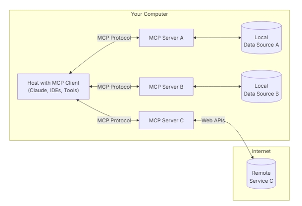
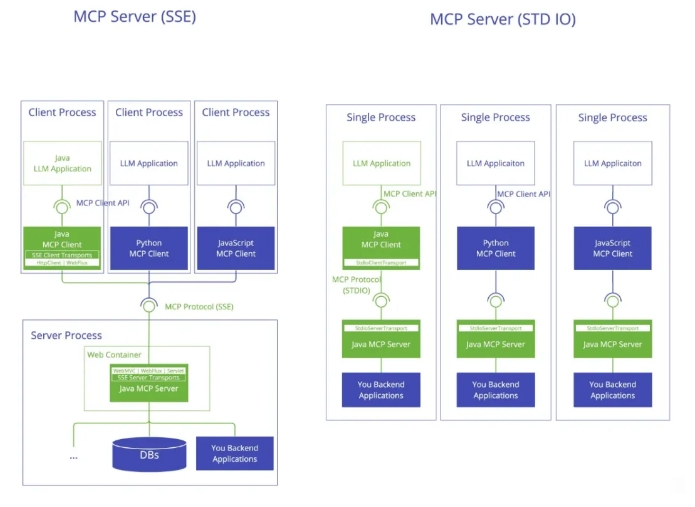
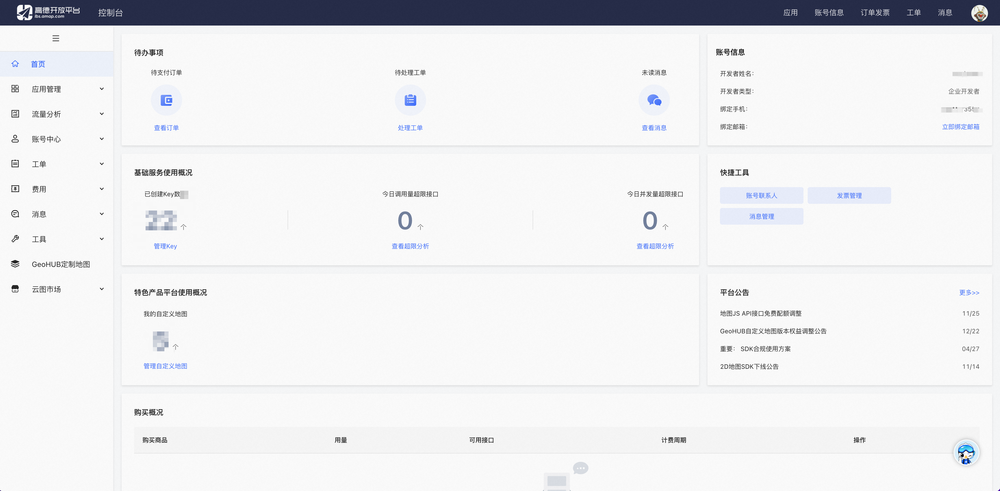
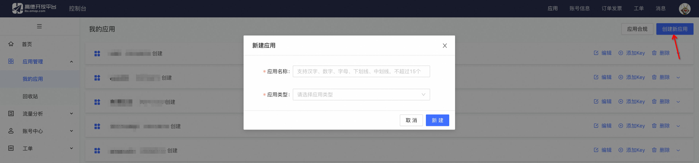
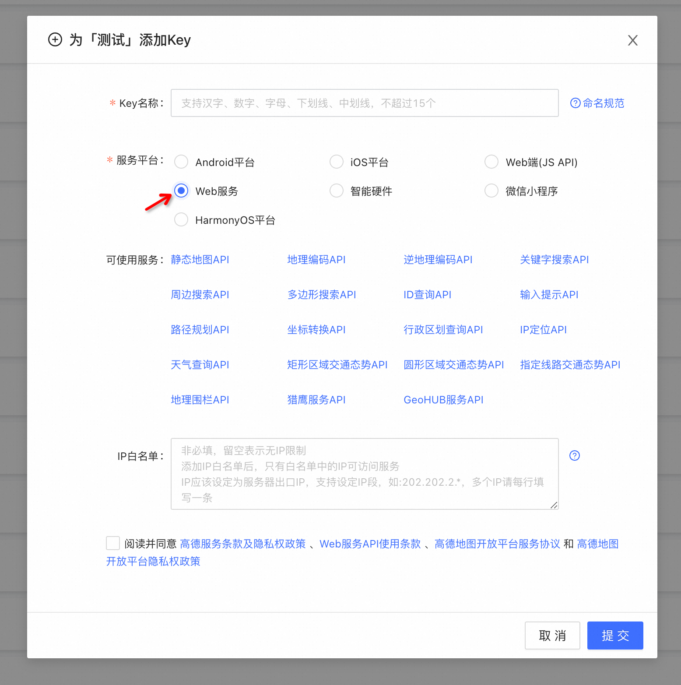
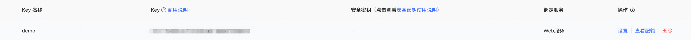

# 手把手教 MCP 实现

> github项目地址：https://github.com/modelcontextprotocol
> 
> MCP官方文档地址：https://modelcontextprotocol.io/introduction

- [手把手教 MCP 实现](#手把手教-mcp-实现)
  - [一、前言](#一前言)
    - [1.1 什么是 MCP ？](#11-什么是-mcp-)
  - [二、环境搭建](#二环境搭建)
    - [2.1 构建环境](#21-构建环境)
    - [2.2 安装依赖](#22-安装依赖)
  - [三、MCP Server开发](#三mcp-server开发)
    - [3.1 成为高德开发者并创建 高德地图 key](#31-成为高德开发者并创建-高德地图-key)
    - [3.2 MCP Server Config 开发](#32-mcp-server-config-开发)
    - [3.3 MCP Server 开发](#33-mcp-server-开发)
    - [3.4 MCP Client 开发](#34-mcp-client-开发)
      - [3.4.1 MCP Client (stdio) 开发](#341-mcp-client-stdio-开发)
      - [3.4.2 MCP Client (sse) 开发](#342-mcp-client-sse-开发)
  - [问题处理](#问题处理)
    - [On Windows 11 when you initialize an mcp client it hangs indefinitely](#on-windows-11-when-you-initialize-an-mcp-client-it-hangs-indefinitely)
  - [总结](#总结)
  - [致谢](#致谢)

## 一、前言

### 1.1 什么是 MCP ？

MCP是一种标准化通信协议，它为大模型与外部系统的交互提供了统一的连接方式。MCP 的作用类似于电子设备中的 通用接口标准（如 USB-C）——正如 USB-C 能让不同品牌的设备实现即插即用，MCP 也以同样的方式，让 AI 大模型能够快速、便捷地接入各类外部数据源和工具。不同的是，MCP 并非连接物理硬件，而是为模型与数字世界搭建了一座标准化的桥梁，使数据调用、工具集成等操作变得简单高效。



- MCP Hosts：像Cursor、 Claude Desktop、cherry studio 这样的应用程序，它们通过 MCP Client 访问数据。
- MCP Clients：与 MCP Server 服务器保持 1:1 连接的协议客户端。
- MCP Servers：基于标准化模型上下文协议(MCP)的轻量级服务程序，每个服务端都通过标准接口提供特定功能。

## 二、环境搭建

### 2.1 构建环境

```s
    $ conda create -n py310 python==3.9.0       # 创建新环境
    $ source activate py310                  # 激活环境
```

### 2.2 安装依赖

> 安装
```s
    $ pip install mcp openai requests mcp[cli]  -i https://pypi.tuna.tsinghua.edu.cn/simple  --no-cache-dir
```

## 三、MCP Server开发

MCP Server有两种开发模式，基于http的服务器推送事件sse和基于标准输入输出的stdio



本节将以【高德地图获取天气查询】为例，介绍如何开发一个 完整的 MCP

### 3.1 成为高德开发者并创建 高德地图 key

- step 1：登录控制台

登录 【高德开放平台控制台】（https://console.amap.com/），如果没有开发者账号，请注册成为开发者（https://console.amap.com/dev/id）。



- step 2：创建新应用

进入【应用管理】，点击页面右上角【创建新应用】，填写表单即可创建新的应用。



- step 3：创建 Key

进入【应用管理】，在我的应用中选择需要创建 Key 的应用，点击【添加 Key】，表单中的服务平台选择【Web 服务】。



- step 4：获取 Key 

创建成功后，可获取 Key 和安全密钥。



> 注：为了对 Key 的安全有效管理，请妥善保管你的 Key。

### 3.2 MCP Server Config 开发

> config.py
```s
class Config:
    AMAP_MAPS_API_KEY = "****"                  # 高德地图 开发者 key
    MODEL_ID = "deepseek-chat"                    # 大模型名称
    OPENAI_BASE_URL = "https://api.deepseek.com/v1"
    OPENAI_API_KEY = "******"
```

### 3.3 MCP Server 开发

> mcp_server.py
```s
import json
import requests
from mcp.server.fastmcp import FastMCP
from config import Config
mcp = FastMCP("WeatherServer", port=9999)

@mcp.tool()
async def get_weather(city: str) -> list[dict]:
    """调用高德天气API获取天气预报信息
        Args:
            city: 城市名称 (如"北京")
        Returns:
            包含未来天气预报信息的字典列表，格式示例(week:7 星期日)：
            [{
                'date': 'yyyy-MM-dd',
                'dayweather': '晴',
                'nightweather': '多云',
                'daytemp': '25',
                'nighttemp': '15',
                'daywind': '东北',
                'nightwind': '东北',
                'daypower': '4',
                'nightpower': '3'
            }]
        Raises:
            ValueError: 当参数无效或API返回错误时
            RequestException: 当网络请求失败时
    """
    # 参数验证
    if not city:
        raise ValueError("city参数不能为空")

    api_key = Config.AMAP_MAPS_API_KEY
    if not api_key:
        raise ValueError("未找到高德地图API密钥，请检查环境变量AMAP_MAPS_API_KEY")

    # 构造请求参数
    params = {
        'key': api_key,
        'city': city,
        'extensions': 'all',
        'output': 'json'
    }
    url = 'https://restapi.amap.com/v3/weather/weatherInfo'

    try:
        # 发送请求
        response = requests.get(url, params=params, timeout=10)
        response.raise_for_status()
        data = response.json()

        # 验证API响应
        if data.get('status') != '1':
            raise ValueError(f"API错误: {data.get('info', '未知错误')}")

        if not data.get('forecasts'):
            raise ValueError("未获取到天气预报数据")

        # 解析返回数据
        forecasts = data['forecasts'][0]['casts']
        return [{
            'date': cast.get('date'),
            'dayweather': cast.get('dayweather'),
            'nightweather': cast.get('nightweather'),
            'daytemp': cast.get('daytemp'),
            'nighttemp': cast.get('nighttemp'),
            'daywind': cast.get('daywind'),
            'nightwind': cast.get('nightwind'),
            'daypower': cast.get('daypower'),
            'nightpower': cast.get('nightpower')
        } for cast in forecasts]

    except requests.exceptions.RequestException as e:
        raise requests.exceptions.RequestException(f"网络请求失败: {str(e)}")
    except json.JSONDecodeError as e:
        raise ValueError(f"API响应格式错误: {str(e)}")

if __name__ == "__main__":
    print("MCP Service running!!!")
    mcp.run(transport="stdio")
```

> 注：@mcp.tool()装饰器将函数注册为工具

### 3.4 MCP Client 开发 

#### 3.4.1 MCP Client (stdio) 开发 

MCP Client开发流程涉及与Mcp Server连接的会话管理、大模型交互和资源的清理等。

> mcp_client.py 整体架构
```s
import asyncio
import json
import os
import sys
from typing import List, Optional
from contextlib import AsyncExitStack
from mcp import ClientSession, StdioServerParameters
from mcp.client.sse import sse_client
from mcp.client.stdio import stdio_client
from openai import AsyncOpenAI
from config import Config
class MCPClient:
    def __init__(self, model_name: str, base_url: str, api_key: str, server_sources: List[str]):
        """
        初始化 MCP 客户端，用于管理多个子进程服务器的工具调用。

        :param model_name: 使用的模型名称，例如 "deepseek-chat"。
        :param base_url: OpenAI 接口的基础地址，例如 "https://api.deepseek.com/v1"。
        :param api_key: OpenAI API 密钥，用于身份验证。
        :param file_paths: Python 脚本文件路径列表，每个脚本将作为独立的子进程服务器运行。
        """
        ...

    async def initialize_sessions(self):
        """
            初始化所有子进程服务器的会话，建立工具映射关系。
            为每个Python脚本创建一个子进程，并通过标准输入输出流与之通信。
        """
        ...

    async def cleanup(self):
        """
            清理所有会话和连接资源
        """
        ...

    async def process_query(self, query: str) -> str:
        """
            处理用户的自然语言查询，通过工具调用完成任务并返回结果。

            :param query: 用户输入的查询字符串
            :return: 处理后的回复文本，包含模型回复和工具调用结果
        """
        ...

    async def chat_loop(self):
        """
            启动命令行交互式对话循环，处理用户输入并显示回复。
            支持通过输入'quit'退出对话。
        """
        ...

async def main():
    """
    程序入口点，负责：
    1. 从环境变量加载配置
    2. 初始化MCP客户端
    3. 启动交互式对话循环
    4. 确保资源正确清理
    """
    ...

if __name__ == "__main__":
    asyncio.run(main())
```

- step 1 MCPClient 初始化 MCP 客户端 实现
  
```s
...
class MCPClient:
    def __init__(self, model_name: str, base_url: str, api_key: str, server_sources: List[str]):
        """
            初始化 MCP 客户端，用于管理多个子进程服务器的工具调用。
            :param model_name: 使用的模型名称，例如 "deepseek-chat"。
            :param base_url: OpenAI 接口的基础地址，例如 "https://api.deepseek.com/v1"。
            :param api_key: OpenAI API 密钥，用于身份验证。
            :param file_paths: Python 脚本文件路径列表，每个脚本将作为独立的子进程服务器运行。
        """
        self.model_name = model_name
        self.server_sources = server_sources
        self.sessions = {}  # 存储每个服务器的会话：server_id -> session
        self.tool_mapping = {}  # 工具映射：prefixed_name -> (session, original_tool_name)
        self.exit_stack = AsyncExitStack()  # 用于管理多个异步上下文的资源
        self.client = AsyncOpenAI(base_url=base_url, api_key=api_key)
    ...
```

- step 2 MCPClient 初始化所有子进程服务器的会话

```s
...
class MCPClient:
    ...
    async def initialize_sessions(self):
        """
            初始化所有子进程服务器的会话，建立工具映射关系。
            为每个Python脚本创建一个子进程，并通过标准输入输出流与之通信。
        """
        print(f"sessions init!!!")
        for i, server_source in enumerate(self.server_sources):
            print(f"sessions {server_source} init!!!")
            server_params = StdioServerParameters(
                command="python",
                args=[server_source],
                env=None
            )
            server_id = f"server{i}"
            # 创建标准输入输出流通信通道
            write, read = await self.exit_stack.enter_async_context(stdio_client(server_params))
            # 初始化客户端会话
            session = await self.exit_stack.enter_async_context(ClientSession(write, read))
            await session.initialize()

            # 存储会话实例
            self.sessions[server_id] = session

            # 获取服务器提供的工具列表并建立映射关系
            response = await session.list_tools()
            for tool in response.tools:
                prefixed_name = f"{server_id}_{tool.name}"  # 添加服务器前缀以区分不同服务器的同名工具
                self.tool_mapping[prefixed_name] = (session, tool.name)
            print(f"\n已连接到服务器 {server_id}，支持以下工具:", [tool.name for tool in response.tools])
    ...
```

- step 3 清理所有会话和连接资源

```s
...
class MCPClient:
    ...
    async def cleanup(self):
        """
        清理所有会话和连接资源
        """
        print(f"sessions cleanup!!!")
        await self.exit_stack.aclose()
    ...
```

- step 4 处理用户的自然语言查询，通过工具调用完成任务并返回结果

```s
...
class MCPClient:
    ...
    async def process_query(self, query: str) -> str:
        """
            处理用户的自然语言查询，通过工具调用完成任务并返回结果。

            :param query: 用户输入的查询字符串
            :return: 处理后的回复文本，包含模型回复和工具调用结果
        """
        print(f"process query!!!")
        messages = [{"role": "user", "content": query}]  # 初始化对话消息列表

        # 收集所有可用工具的信息
        available_tools = []
        for server_id, session in self.sessions.items():
            response = await session.list_tools()
            for tool in response.tools:
                prefixed_name = f"{server_id}_{tool.name}"
                available_tools.append({
                    "type": "function",
                    "function": {
                        "name": prefixed_name,
                        "description": tool.description,
                        "parameters": tool.inputSchema,
                    },
                })

        # 向语言模型发送初始请求
        response = await self.client.chat.completions.create(
            model=self.model_name,
            messages=messages,
            tools=available_tools,
        )

        final_text = []  # 存储所有回复内容
        message = response.choices[0].message
        final_text.append(message.content or "")  # 添加模型的初始回复

        # 处理模型请求的工具调用
        while message.tool_calls:
            for tool_call in message.tool_calls:
                prefixed_name = tool_call.function.name
                if prefixed_name in self.tool_mapping:
                    session, original_tool_name = self.tool_mapping[prefixed_name]
                    tool_args = json.loads(tool_call.function.arguments)
                    try:
                        # 执行工具调用
                        result = await session.call_tool(original_tool_name, tool_args)
                    except Exception as e:
                        result = {"content": f"调用工具 {original_tool_name} 出错：{str(e)}"}
                        print(result["content"])
                    final_text.append(f"[调用工具 {prefixed_name} 参数: {tool_args}]")
                    final_text.append(f"工具结果: {result.content}")
                    # 将工具调用结果添加到对话历史
                    messages.extend([
                        {
                            "role": "assistant",
                            "tool_calls": [{
                                "id": tool_call.id,
                                "type": "function",
                                "function": {"name": prefixed_name, "arguments": json.dumps(tool_args)},
                            }],
                        },
                        {"role": "tool", "tool_call_id": tool_call.id, "content": str(result.content)},
                    ])
                else:
                    print(f"工具 {prefixed_name} 未找到")
                    final_text.append(f"工具 {prefixed_name} 未找到")

            # 获取工具调用后的模型回复
            response = await self.client.chat.completions.create(
                model=self.model_name,
                messages=messages,
                tools=available_tools,
            )
            message = response.choices[0].message
            if message.content:
                final_text.append(message.content)

        return "\n".join(final_text)
```

- step 5 启动命令行交互式对话循环，处理用户输入并显示回复

```s
...
class MCPClient:
    ...
    async def chat_loop(self):
        """
            启动命令行交互式对话循环，处理用户输入并显示回复。
            支持通过输入'quit'退出对话。
        """
        print("\nMCP 客户端已启动，输入你的问题，输入 'quit' 退出。")
        while True:
            try:
                query = input("\n问题: ").strip()
                if query.lower() == "quit":
                    break
                response = await self.process_query(query)
                print("\n" + response)
            except Exception as e:
                print(f"\n发生错误: {str(e)}")
```

- step 6 程序入口

```s
...
async def main():
    """
        程序入口点，负责：
        1. 从环境变量加载配置
        2. 初始化MCP客户端
        3. 启动交互式对话循环
        4. 确保资源正确清理
    """
    # 从环境变量获取配置
    model_name = Config.MODEL_ID
    base_url = Config.OPENAI_BASE_URL
    api_key =Config.OPENAI_API_KEY
    if not api_key:
        print("未设置 API_KEY 环境变量。")
        sys.exit(1)

    # 定义要启动的Python脚本文件列表
    server_sources = ["d:/MCP/mcp_server.py"]

    # 创建并运行客户端
    client = MCPClient(model_name=model_name, base_url=base_url, api_key=api_key, server_sources=server_sources)
    try:
        await client.initialize_sessions()
        await client.chat_loop()
    finally:
        await client.cleanup()

if __name__ == "__main__":
    asyncio.run(main())
```

启动服务

```s
python mcp_client.py
```

> output
```s
sessions init!!!
sessions mcp_server.py init!!!
[04/25/25 17:41:07] INFO     Processing request of type           server.py:534
                             ListToolsRequest

已连接到服务器 server0，支持以下工具: ['get_weather']

MCP 客户端已启动，输入你的问题，输入 'quit' 退出。

问题: 北京
process query!!!
[04/25/25 17:41:12] INFO     Processing request of type           server.py:534
                             ListToolsRequest
process_query() => available_tools：[{'type': 'function', 'function': {'name': 'server0_get_weather', 'description': '调用高德天气API获取天气预报信息\n\n        Args:\n            city: 城市名称 (如"福州")\n\n        Returns:\n             包含未来天气预报信息的字典列表，格式示例(week:7 星期日)：\n            [{\n                \'date\': \'yyyy-MM-dd\',\n                \'dayweather\': \'晴\',\n                \'nightweather\': \'多云\',\n                \'daytemp\': \'25\',\n                \'nighttemp\': \'15\',\n                \'daywind\': \'东北\',\n                \'nightwind\': \'东北\',\n                \'daypower\': \'4\',\n                \'nightpower\': \'3\'\n            }]\n\n        Raises:\n            ValueError: 当参数无效或API返回错误时\n            RequestException: 当网络请求失败时\n    ', 'parameters': {'properties': {'city': {'title': 'City', 'type': 'string'}}, 'required': ['city'], 'title': 'get_weatherArguments', 'type': 'object'}}}]
process_query() => response:ChatCompletion(id='chatcmpl-977', choices=[Choice(finish_reason='tool_calls', index=0, logprobs=None, message=ChatCompletionMessage(content='', refusal=None, role='assistant', function_call=None, tool_calls=[ChatCompletionMessageToolCall(id='call_svvi0r7h', function=Function(arguments='{"city":"北京"}', name='server0_get_weather'), type='function', index=0)]))], created=1745574077, model='qwen2.5:7b', object='chat.completion', service_tier=None, system_fingerprint='fp_ollama', usage=CompletionUsage(completion_tokens=22, prompt_tokens=343, total_tokens=365, completion_tokens_details=None))
[04/25/25 17:41:14] INFO     Processing request of type           server.py:534
                             CallToolRequest

[调用工具 server0_get_weather 参数: {'city': '北京'}]
工具结果: [TextContent(type='text', text='{"date": "2025-04-25", "dayweather": "\\u6674", "nightweather": "\\u6674", "daytemp": "24", "nighttemp": "11", "daywind": "\\u5357", "nightwind": "\\u5357", "daypower": "1-3", "nightpower": "1-3"}', annotations=None), TextContent(type='text', text='{"date": "2025-04-26", "dayweather": "\\u591a\\u4e91", "nightweather": "\\u591a\\u4e91", "daytemp": "27", "nighttemp": "14", "daywind": "\\u897f\\u5357", "nightwind": "\\u897f\\u5357", "daypower": "1-3", "nightpower": "1-3"}', annotations=None), TextContent(type='text', text='{"date": "2025-04-27", "dayweather": "\\u6674", "nightweather": "\\u6674", "daytemp": "25", "nighttemp": "14", "daywind": "\\u897f\\u5317", "nightwind": "\\u897f\\u5317", "daypower": "1-3", "nightpower": "1-3"}', annotations=None), TextContent(type='text', text='{"date": "2025-04-28", "dayweather": "\\u6674", "nightweather": "\\u6674", "daytemp": "29", "nighttemp": "17", "daywind": "\\u4e1c", "nightwind": "\\u4e1c", "daypower": "1-3", "nightpower": "1-3"}', annotations=None)]
未来几天北京的天气预报如下：

2025-04-25：白天晴，夜间晴，白天气温24℃，夜间气温11℃，风向西北，风力1-3级；
2025-04-26：白天多云，夜间多云，白天气温27℃，夜间气温14℃，风向东南西北不定，风力1-3级；
2025-04-27：白天晴，夜间晴，白天气温25℃，夜间气温14℃，风向东北，风力1-3级；
2025-04-28：白天晴，夜间晴，白天气温29℃，夜间气温17℃，风向中央，风力1-3级。

请注意根据实际需求及变化调整出行计划并做好防护措施。

问题:
...
```

#### 3.4.2 MCP Client (sse) 开发 

> 注：sse开发模式支持远程调用，其代码与stdio代码基本一致，只需要稍微修改一行代码。

> mcp_server.py
```s
#只需要修改以下一行代码，就可以支持sse模式
if __name__ == "__main__":
    mcp.run(transport="sse")
```

MCP Client(sse)客户端代码与MCP Client(stdio)代码也基本上差不多，有差异的地方只有连接MCP Server那块Session处理。

与MCP Client(stdio)代码除了以下不一样，其他地方完全一致：

> mcp_client.py
```s
...
class MCPClient:
    ...
    async def initialize_sessions(self):
        """
            初始化所有SSE服务器的会话，建立工具映射关系。
            通过SSE连接与服务器建立通信，获取可用工具列表并建立映射。
        """
        for i, server_source in enumerate(self.server_sources):

            server_id = f"server{i}"
            # 创建标准输入输出流通信通道
            write, read = await self.exit_stack.enter_async_context(sse_client(url=server_source))
            # 初始化客户端会话
            session = await self.exit_stack.enter_async_context(ClientSession(write, read))
            await session.initialize()

            # 存储会话实例
            self.sessions[server_id] = session

            # 获取服务器提供的工具列表并建立映射关系
            response = await session.list_tools()
            for tool in response.tools:
                prefixed_name = f"{server_id}_{tool.name}"  # 添加服务器前缀以区分不同服务器的同名工具
                self.tool_mapping[prefixed_name] = (session, tool.name)
            print(f"\n已连接到服务器 {server_id}，支持以下工具:", [tool.name for tool in response.tools])
    ...
```

server_source传的不再是文件列表，而是MCP Server(sse)服务地址列表

```s
async def main():
    ...
    server_sources = ["http://localhost:9999/sse"]
    ...
```

启动 MCP Server(sse)服务

```s
$ mcp_server.py
>>>
MCP Service running!!!
INFO:     Started server process [35404]
INFO:     Waiting for application startup.
INFO:     Application startup complete.
INFO:     Uvicorn running on http://0.0.0.0:9999 (Press CTRL+C to quit)
```

启动 MCP Client(sse)服务

```s
$ mcp_client_sse.py
>>>
已连接到服务器 server0，支持以下工具: ['get_weather']

MCP 客户端已启动，输入你的问题，输入 'quit' 退出。

问题: 武汉
process query!!!
process_query() => available_tools：[{'type': 'function', 'function': {'name': 'server0_get_weather', 'description': '调用高德天气API获取天气预报信息\n\n        Args:\n            city: 城市名称 (如"福州")\n\n        Returns:\n             包含未来天气预报信息的字典列表，格式示例(week:7 星期日)：\n            [{\n                \'date\': \'yyyy-MM-dd\',\n                \'dayweather\': \'晴\',\n                \'nightweather\': \'多云\',\n                \'daytemp\': \'25\',\n                \'nighttemp\': \'15\',\n                \'daywind\': \'东北\',\n                \'nightwind\': \'东北\',\n                \'daypower\': \'4\',\n                \'nightpower\': \'3\'\n            }]\n\n        Raises:\n            ValueError: 当参数无效或API返回错误时\n            RequestException: 当网络请求失败时\n    ', 'parameters': {'properties': {'city': {'title': 'City', 'type': 'string'}}, 'required': ['city'], 'title': 'get_weatherArguments', 'type': 'object'}}}]
process_query() => response:ChatCompletion(id='chatcmpl-903', choices=[Choice(finish_reason='tool_calls', index=0, logprobs=None, message=ChatCompletionMessage(content='', refusal=None, role='assistant', function_call=None, tool_calls=[ChatCompletionMessageToolCall(id='call_y4d1r910', function=Function(arguments='{"city":"武汉"}', name='server0_get_weather'), type='function', index=0)]))], created=1745575141, model='deepseek', object='chat.completion', service_tier=None, system_fingerprint='fp_ollama', usage=CompletionUsage(completion_tokens=22, prompt_tokens=343, total_tokens=365, completion_tokens_details=None))


[调用工具 server0_get_weather 参数: {'city': '武汉'}]
工具结果: [TextContent(type='text', text='{"date": "2025-04-25", "dayweather": "\\u591a\\u4e91", "nightweather": "\\u591a\\u4e91", "daytemp": "26", "nighttemp": "16", "daywind": "\\u5317", "nightwind": "\\u5317", "daypower": "1-3", "nightpower": "1-3"}', annotations=None), TextContent(type='text', text='{"date": "2025-04-26", "dayweather": "\\u5c0f\\u96e8", "nightweather": "\\u5c0f\\u96e8", "daytemp": "25", "nighttemp": "17", "daywind": "\\u5317", "nightwind": "\\u5317", "daypower": "1-3", "nightpower": "1-3"}', annotations=None), TextContent(type='text', text='{"date": "2025-04-27", "dayweather": "\\u6674", "nightweather": "\\u6674", "daytemp": "26", "nighttemp": "16", "daywind": "\\u5317", "nightwind": "\\u5317", "daypower": "1-3", "nightpower": "1-3"}', annotations=None), TextContent(type='text', text='{"date": "2025-04-28", "dayweather": "\\u591a\\u4e91", "nightweather": "\\u591a\\u4e91", "daytemp": "26", "nighttemp": "12", "daywind": "\\u5317", "nightwind": "\\u5317", "daypower": "1-3", "nightpower": "1-3"}', annotations=None)]
根据查询，以下是一周内武汉市的天气预报信息：

- 2025-04-25：白天和晚上的天气都是多云，白天气温26℃，夜间气温16℃，风向为北，风力等级在1-3级之间。
- 2025-04-26：白天和晚上的天气都是轻雾，白天气温25℃，夜间气温17℃，风向为北，风力等级在1-3级之间。
- 2025-04-27：全天晴朗，白天气温26℃，夜间气温16℃，风向为北，风力等级在1-3级之间。
- 2025-04-28：白天和晚上的天气都是多云，白天气温26℃，夜间气温12℃，风向为北，风力等级在1-3级之间。

请根据这些信息安排日常生活或出行计划哦！如有需要了解其他日期的信息，可以继续询问。
```


## 问题处理

### On Windows 11 when you initialize an mcp client it hangs indefinitely

- 问题描述：

mcp_client.py  运行后卡死

- 解决方法：

修改 ..\site-packages\mcp\client\stdio\__init__.py

```s
...
# from .win32 import (
#     create_windows_process,
#     get_windows_executable_command,
#     terminate_windows_process,
# )
...
@asynccontextmanager
async def stdio_client(server: StdioServerParameters, errlog: TextIO = sys.stderr):
    ...
    async with (
        anyio.create_task_group() as tg,
        process,
    ):
        tg.start_soon(stdout_reader)
        tg.start_soon(stdin_writer)
        try:
            yield read_stream, write_stream
        finally:
            # Clean up process to prevent any dangling orphaned processes
            # if sys.platform == "win32":
            #     await terminate_windows_process(process)
            # else:
            process.terminate()

...
def _get_executable_command(command: str) -> str:
    """
    Get the correct executable command normalized for the current platform.

    Args:
        command: Base command (e.g., 'uvx', 'npx')

    Returns:
        str: Platform-appropriate command
    """
    # if sys.platform == "win32":
    #     return get_windows_executable_command(command)
    # else:
    return command

...
async def _create_platform_compatible_process(
    command: str,
    args: list[str],
    env: dict[str, str] | None = None,
    errlog: TextIO = sys.stderr,
    cwd: Path | str | None = None,
):
    """
    Creates a subprocess in a platform-compatible way.
    Returns a process handle.
    """
    # if sys.platform == "win32":
    #     process = await create_windows_process(command, args, env, errlog, cwd)
    # else:
    process = await anyio.open_process(
        [command, *args], env=env, stderr=errlog, cwd=cwd
    )

    return process

```

## 总结

以上系统性地介绍了MCP（模型上下文协议）的两种核心开发模式：

- 标准输入输出（stdio）模式：通过进程间直接通信实现高性能本地调用
- HTTP服务器推送事件（SSE）模式：基于网络协议支持分布式远程调用


## 致谢

- 天气查询 https://lbs.amap.com/api/webservice/guide/api/weatherinfo/#t1

