# MCP 模型上下文协议（Model Context Protocol） 常考题篇

- [MCP 模型上下文协议（Model Context Protocol） 常考题篇](#mcp-模型上下文协议model-context-protocol-常考题篇)
  - [二、MCP 基础](#二mcp-基础)
    - [2.1 什么是 MCP？](#21-什么是-mcp)
    - [2.2 为什么要有 MCP？](#22-为什么要有-mcp)
    - [2.3 从一个例子介绍 MCP 和 API 的区别](#23-从一个例子介绍-mcp-和-api-的区别)
  - [三、MCP的工作原理](#三mcp的工作原理)
    - [3.1 MCP架构](#31-mcp架构)
    - [3.2 MCP 客户端和服务器是如何通信?](#32-mcp-客户端和服务器是如何通信)
    - [3.3 MCP 核心特点 是什么?](#33-mcp-核心特点-是什么)
    - [3.4 MCP 解决了什么问题?](#34-mcp-解决了什么问题)
    - [3.5 MCP 有什么好处?](#35-mcp-有什么好处)
  - [MCP vs Function Call](#mcp-vs-function-call)
    - [MCP 对比 Function Call](#mcp-对比-function-call)
    - [MCP 和 Function Call 关系](#mcp-和-function-call-关系)
  - [MCP vs A2A](#mcp-vs-a2a)
    - [MCP 和 A2A 区别](#mcp-和-a2a-区别)
    - [MCP 和 A2A 联系](#mcp-和-a2a-联系)
  - [致谢](#致谢)

## 二、MCP 基础

### 2.1 什么是 MCP？

MCP（Model Context Protocol，模型上下文协议） 起源于 2024 年 11 月 25 日 Anthropic 发布的文章：Introducing the Model Context Protocol。

**MCP就像AI应用的USB-C端口**

正如USB-C提供了一种将设备连接到各种配件的标准化方式一样，MCP也标准化了您的AI应用程序连接到不同数据源和工具的方式。

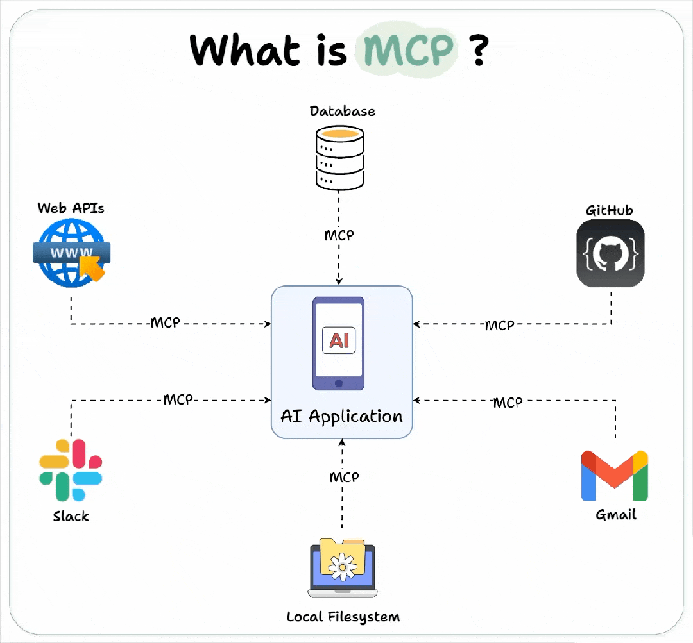

### 2.2 为什么要有 MCP？

- **终结工具调用碎片化**

不同模型在定义 Function Call（函数调用）时，采用的结构和参数格式各不相同，使得对多模型集成、统一管理和标准化接入变得复杂而繁琐。

<table>
    <thead>
        <td>属性维度</td>
        <td>OpenAI</td>
        <td>Claude</td>
        <td>Gemini</td>
    </thead>
    <tr>
        <td>属性维度</td>
        <td>tool_calls</td>
        <td>tool_use</td>
        <td>functionCall</td>
    </tr>
    <tr>
        <td>参数格式</td>
        <td>JSON字符串</td>
        <td>JSON对象</td>
        <td>JSON对象</td>
    </tr>
    <tr>
        <td>特殊字段</td>
        <td>finish_reason字段</td>
        <td>包含id和<thinking></td>
        <td>args字段命名</td>
    </tr>
</table>

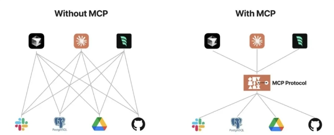

- **实现多功能应用与创新体验的突破**

MCP 的潜力不仅限于连接现有工具，它还在推动客户端应用向“万能应用”演进，并创造全新的用户体验。

以代码编辑器 Cursor 为例，作为 MCP 客户端，用户可以通过集成不同的 MCP 服务器，将其转变为具备 Slack 消息收发、邮件发送（Resend MCP）、甚至图像生成（Replicate MCP）等多种功能的综合工作站。

更具创造力的是，在单一客户端中组合多个 MCP 服务器可以解锁复杂的新流程。例如，AI 代理可以一边生成前端界面代码，一边调用图像生成服务器为主页创作视觉元素。这种模式超越了传统应用的单一功能限制，为用户带来多样化的操作体验。

### 2.3 从一个例子介绍 MCP 和 API 的区别

> 在传统的API设置中：

如果您的API最初需要两个参数（例如，天气服务的位置和日期），则用户会集成他们的应用程序以使用这些确切的参数发送请求。

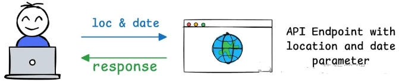

稍后，如果您决定添加第三个必需参数（例如， 摄氏度或华氏度等温度单位的单位），则API的协定会发生变化。

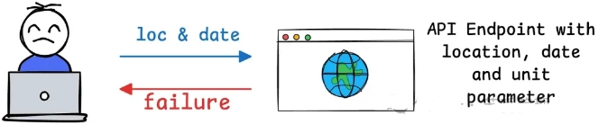

这意味着API的所有用户都必须更新其代码以包含新参数。如果他们不更新，他们的请求可能会失败、返回错误或提供不完整的结果。

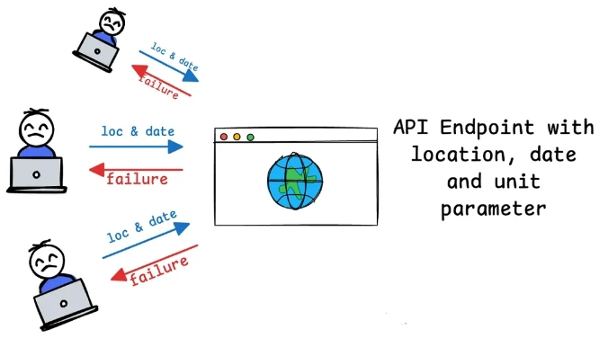

> MCP的设计解决了这个问题：

MCP引入了一种动态且灵活的方法，与传统API形成鲜明对比。

例如，当客户端（例如，像Claude Desktop这样的AI应用程序）连接到MCP服务器（例如，您的天气服务）时，它会发送一个初始请求来了解服务器的功能。

**服务器将响应有关其可用工具、资源、提示和参数的详细信息**。例如，如果您的天气API最初支持位置和日期，则服务器会将这些作为其功能的一部分进行传达。

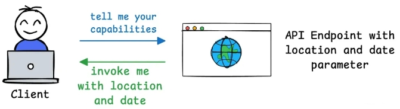

## 三、MCP的工作原理

### 3.1 MCP架构

MCP采用的是C/S结构，一个MCP host应用可以链接多个MCP servers。

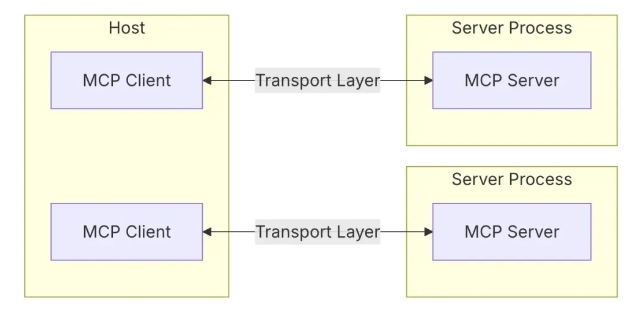

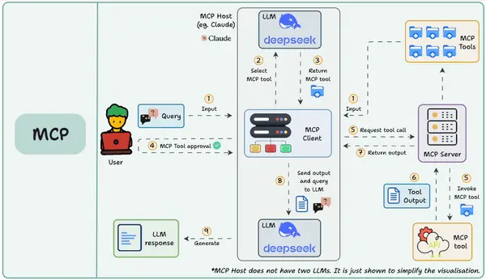

- Host（主机）：为AI交互提供环境、访问工具和数据以及运行MCP客户端的任何AI应用程序（Claude desktop、Cursor），例如cursor、cline。
- Client（客户端）：运行在Host内，mcp client 与 mcp server保持 1:1 连接，当用户在交互界面输入问题时，模型来决定使用1个或者多个工具，通过client来调用server执行具体操作。
- Server（服务）：在这个例子中，文件系统 MCP Server 会被调用。它负责执行实际的文件扫描操作，访问你的桌面目录，并返回找到的文档列表。
  - 工具：使LLM能够通过您的服务器执行作。
  - 资源：将服务器中的数据和内容公开给LLM。
  - 提示：创建可重用的提示模板和工作流。

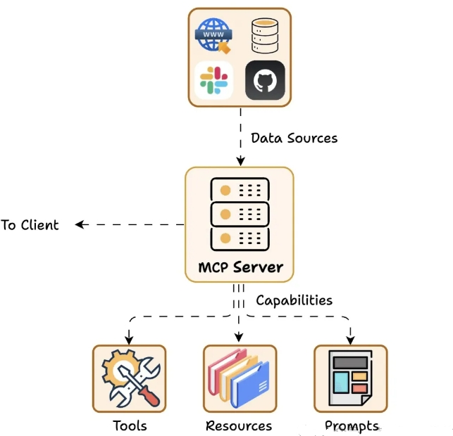

### 3.2 MCP 客户端和服务器是如何通信?

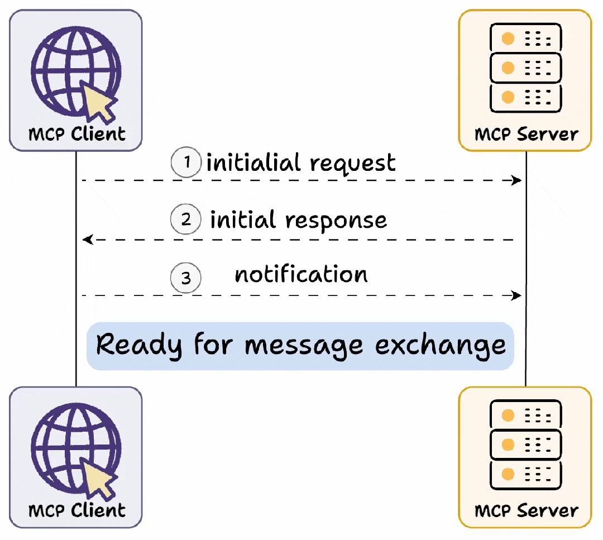

首先，我们有能力交换，其中：

客户端发送初始请求以学习服务器功能。

然后，服务器使用其功能详细信息进行响应。

> 例如，Weather API服务器在被调用时，可以使用可用的“tools”、“prompts templates”和任何其他资源供客户端使用。

一旦此交换完成，Client确认连接成功并继续进一步的消息交换。

### 3.3 MCP 核心特点 是什么?

- **协议标准化**：统一工具调用格式（请求/响应/错误处理）
- **生态兼容性**：一次开发即可对接所有兼容MCP的模型
- **动态扩展**：新增工具无需修改模型代码，即插即用

### 3.4 MCP 解决了什么问题?

- 数据孤岛 → 打通本地/云端数据源
- 重复开发 → 工具开发者只需适配MCP协议
- 生态割裂 → 形成统一工具市场

### 3.5 MCP 有什么好处?

**MCP 制定了 AI 工具调用的 “行业标准”**。

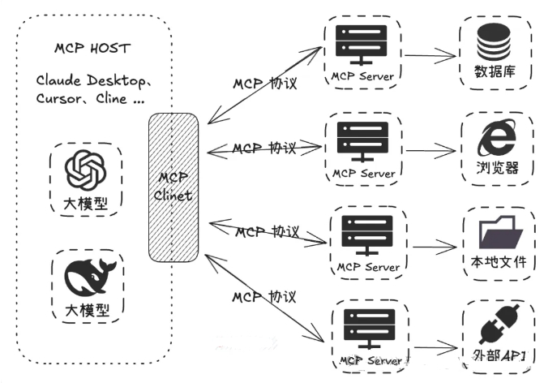

**开发者按照 MCP 协议进行开发，无需为每个模型与不同资源的对接重复编写适配代码，可以大大节省开发工作量**.

**另外已经开发出的 MCP Server，因为协议是通用的，能够直接开放出来给大家使用，这也大幅减少了开发者的重复劳动**。

> 比如，你如果想开发一个同样逻辑的插件，你不需要在 Coze 写一遍，再去 Dify 写一遍，如果它们都支持了 MCP，那就可以直接使用同一个插件逻辑。

## MCP vs Function Call

### MCP 对比 Function Call

现在面试估计肯定会问道MCP与Function Call，这是一个解释的图示：

> 对比图

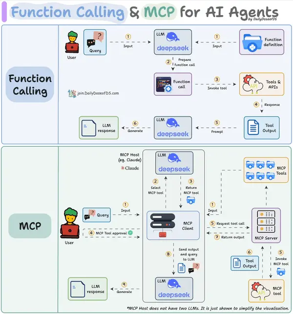

Function Call侧重于模型想要做什么，而 MCP 侧重于如何使工具可被发现和可消费，尤其是在多个Agent、模型或平台之间。MCP 不是在每个应用程序或代理中硬连接工具，而是：

- 标准化了工具的定义、托管和向 LLM 公开的方式。
- 使 LLM 能够轻松发现可用工具、了解其架构并使用它们。
- 在调用工具之前提供审批和审计工作流程。
- 将工具实施的关注与消费分开。

> 对比表

<table>
    <tr>
        <td>对比维度</td>
        <td>Function Calling</td>
        <td>MCP</td>
    </tr>
    <tr>
        <td>协议标准</td>
        <td>私有协议(各模型自定规则)</td>
        <td>开放协议(JSON-RPC 2.0)</td>
    </tr>
    <tr>
        <td>工具发现</td>
        <td>动态获取(initialize请求)</td>
        <td>静态预定义</td>
    </tr>
    <tr>
        <td>调用方式</td>
        <td>同进程函数或API</td>
        <td>Stdio/SSE/同进程</td>
    </tr>
    <tr>
        <td>扩展成本</td>
        <td>高(每新增工具需调整模型)</td>
        <td>低(工具热插拔，模型无需改动)</td>
    </tr>
    <tr>
        <td>适用场景</td>
        <td>简单任务(单次函数调用)</td>
        <td>复杂流程(多工具协同+数据交互)</td>
    </tr>
    <tr>
        <td>工程复杂度</td>
        <td>低(快速接入单个工具)</td>
        <td>高(需部署MCP服务器+客户端)</td>
    </tr>
    <tr>
        <td>生态协作</td>
        <td>工具与模型强绑定</td>
        <td>工具开发者与Agent 开发者解耦</td>
    </tr>
</table>

### MCP 和 Function Call 关系

关系:

1. Function Calling 是 LLM 产生调用请求的能力，MCP 是标准化执行这些请求的协议框架。
2. Function Calling 生成指令，MCP 负责让这些指令能在各种工具间通用、可靠地传递和执行。
3. Function Calling 是 MCP 架构中模型表达意图的方式之一。

## MCP vs A2A

### MCP 和 A2A 区别

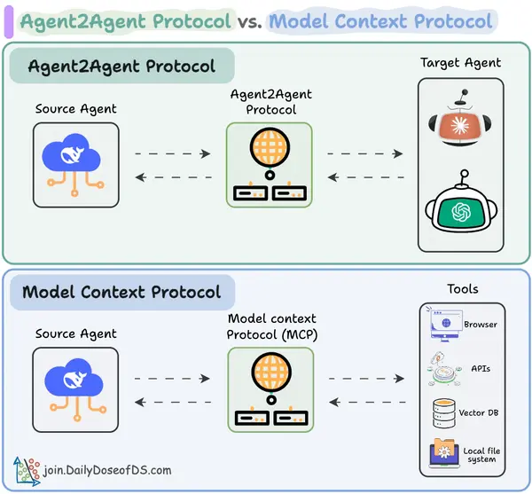

- Agent2Agent（A2A）协议允许 AI 智能体连接其他智能体，即 A2A 则让智能体之间能够连接和协作组队。
- Model Context Protocol（MCP）让 AI 智能体连接工具/API，即 MCP 为智能体提供对工具的访问能力。

### MCP 和 A2A 联系

**使用 A2A 时，两个智能体可能正在互相对话……而他们本身也可能正在与 MCP 服务器通信。从这个意义上讲，它们并不互相冲突**。

如下图所示，Agent2Agent（A2A）协议使多个 AI 智能体可以协同完成任务，而无需直接共享它们的内部记忆、思考或工具。

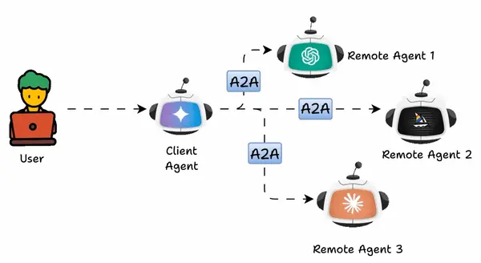

它们通过交换上下文、任务更新、指令和数据进行通信。

从本质上说，AI 应用可以将 A2A 智能体建模为 MCP 资源，这些资源由它们的 AgentCard（智能体卡片） 表示。

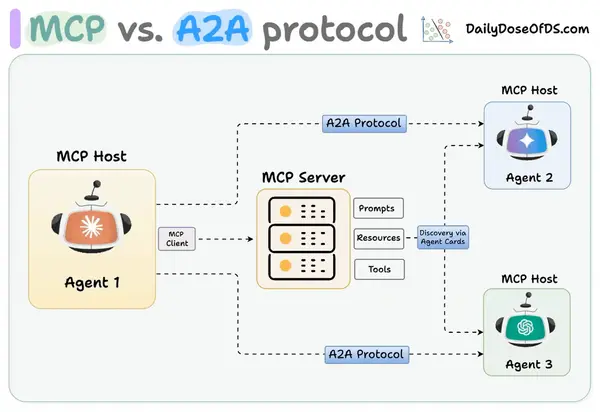

通过这种方式，连接到 MCP 服务器的 AI 智能体可以发现新的合作智能体，并通过 A2A 协议建立连接。

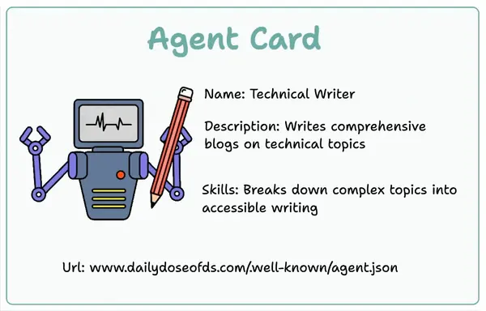

支持 A2A 的远程智能体必须发布一个 “JSON 智能体卡片”，详细说明其能力和认证信息。客户端使用此卡片来查找和与最适合某项任务的智能体进行通信。

## 致谢

- 大模型算法面经：Function Call、MCP、A2A   https://zhuanlan.zhihu.com/p/1898326676087223572
- MCP的蝴蝶效应：生产力还没实质提升的当下，与生产关系改变带来的大模型应用无限未来 https://mp.weixin.qq.com/s?__biz=MzkxNTM5NTg2OA==&mid=2247502394&idx=1&sn=768a04e5d4f64022d524a62574d1cd40&chksm=c049c64e4bdc34b2573c7611e70c66cfddb9cda2ac430b3c5ab5ab89ccc709597d8cd41aa53a&scene=126&sessionid=1744695503#rd
- MCP协议从原理到开发：一文读懂大模型交互的标准化革命！  https://mp.weixin.qq.com/s?__biz=MzI2NDU4OTExOQ==&mid=2247689800&idx=1&sn=5c1e420825d8e1ffb6de9814000d0c6d&chksm=ebe42ef07d4f0306aa64e54b12d909ae003d3380b777c3fddf7206b82e683a0a33ddcebc412c&scene=126&sessionid=1744764473#rd
- 动画图解模型上下文协议-Model Context Protocol (MCP)   https://mp.weixin.qq.com/s/fPPqy0jCE1hejWZXGDWeJA
- MCP + 数据库，一种比 RAG 检索效果更好的新方式！ https://mp.weixin.qq.com/s/jV46NMDfcJRiklUG_RLsmQ

