# 极致炼丹术：对“小”的大模型的优化重新思考

```s
    原创作者：王云鹤​ 研究员
    文章地址：https://zhuanlan.zhihu.com/p/681614203
```

盘古π-1.5B Pro 以及盘古π-1B Pro的更新，附论文及部分代码。

前面先絮叨一下。。。更关注实验结果的可以直接看分割线后面的。

一直以来，给部分同学的感觉是我对整个大模型（大模型实为大的语言模型，LLM，后面不赘述）持悲观甚至反感的态度。

反感其实谈不上，只是偶尔觉得这个领域有一点“脏”（没有清晰的训练集、测试集、验证集），但自己也都在盘古大模型的项目中，也用大模型做了一些工作。但是，悲观确实还是悲观的，对我个人来说，核心矛盾还是在于，大模型就是大的精度好的语言模型，本质上没带来什么特别多的能让用户买单的新特性。

2023年下半年，大家发现云上的AI助手会带来很多问题，例如成本、隐私、时延等。所以一直在让团队成员聚焦做10B以下的模型，前一阵子我们鼓捣出了一个盘古π，目前在一些项目中用的还是不错的。到了2023年底，大模型进端的趋势越来越明显了，高通、苹果、oppo、荣耀、小米、阿里，甚至重资openAI的微软也推出了非常不错的Phi系列模型。

其实搞这么多年AI，每到一个相对稳定的阶段，大小模型的分叉是必然趋势，例如，谷歌自己在2017同时发起了MobileNet和EfficientNet。大规模的模型训练重在数据量和训练方法，对模型结构和细节并不是特别重视，但是要是搞小的模型，参数量受到应用场景的硬件限制，还有时延和功耗等约束，对每一个组件都需要精细控制。

## 正文开始

好在，小的模型可以多做实验。

于是，在这篇工作中我们针对小的大模型做了非常多的实验和分析，为了控制成本，大多数实验是基于1B模型在50B条中英文语料上完成的。最后我们总结了四个重要的思考方向，基于原始的盘古π-1B进行优化，实现了一个不错的盘古π-1.5B Pro版本（包含分词器和模型参数总合）。至于这些方法和结论是否在更大规模的语言模型上有用，我觉得是有用的，但应该没有1.5B这个尺寸作用大，不过目前我手里还没有这份结果，期待一波。

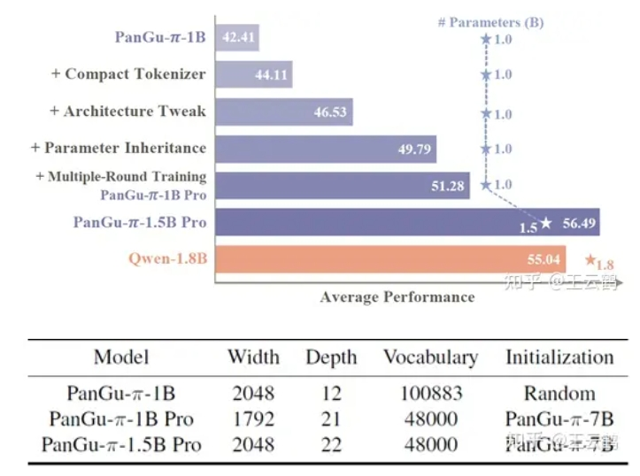

盘古π论文链接：PanGu-π: Enhancing Language Model Architectures via Nonlinearity Compensation

小模型训练链接：Rethinking Optimization and Architecture for Tiny Language Models

训练和测评链接： Implementation for Rethinking Optimization and Architecture for Tiny Language Models

## 小的大模型思考一：分词器

由于模型参数量受限，分词器也要精打细算了，大模型往往采用一个很大的词表来覆盖各种语料库，但是对于小模型来说，一个大词表就已经占用很多参数了。例如，Qwen-7B、Baichuan2-7B 和 PanGu-π-7B的词汇量分别为 151936、125696、100883。它们的头部和嵌入层的参数分别占总体参数的16.12%、13.72%、10.91%。而对于1B模型来说模型，使用相同的分词器会占到模型大小的30%以上。

实际上，词表中存在大量冗余。通过使用从 PanGu-π原始模型继承的 100k 词汇表初始化分词器，我们对包含大约 1.6T 分词的庞大语料库进行了频率分析。如下图所示，词表表现出长尾效应，其中前 48k 词汇就占据训练语料库的 97.86%，也就是说超过 50% 的词汇可能是多余的，因为它们只满足不到 3% 的语料库。把低频词表删除，就可以大幅降低词表参数量，把空间留给模型主体，用于提升模型表达能力。

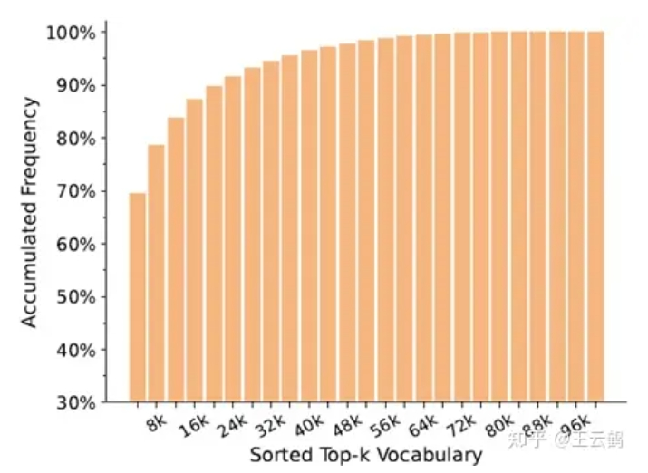
> 97.86%的数据可以被48k的小词表表示

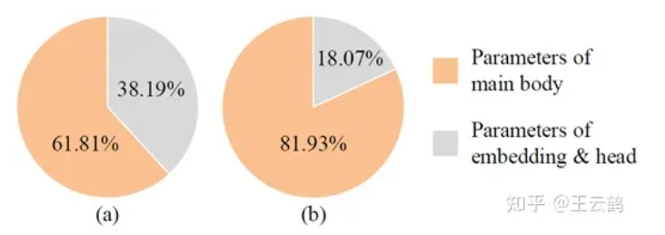
> 参数量占比：（a）使用直接继承的大词表 （b）使用裁剪后的词表

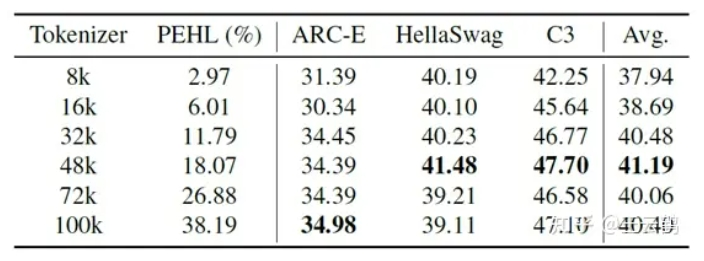
> 模型效果与词表大小的关系（固定参数量为1B）

## 小的大模型思考二：模型架构

搞完分词器，重头又回到了模型架构本身。模型架构的配置，例如宽度、深度和扩展率，对小语言模型的最终性能有相当大的影响。做了一系列试验之后，发现深度影响小语言模型效果最重要的因素，这跟最近的小钢炮的架构优化也是对的上的。一个更深的模型效果更好，但在GPU的推理速度也会低一些，以下是在50B数据上具体的实验结果。

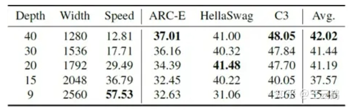
> 深度、宽度对1B模型效果的影响（固定扩张率）

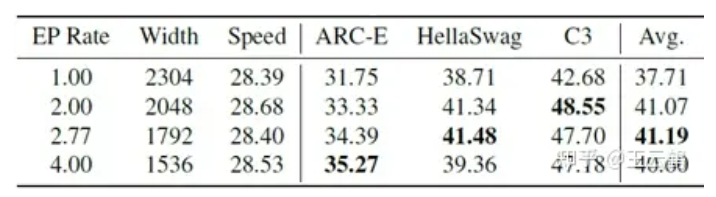
> FFN扩张率对1B模型效果的影响（固定深度）

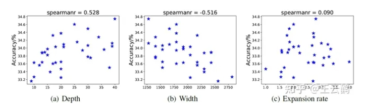
> 固定模型参数量为1B左右，模型效果与深度、宽度、扩张率之间的关系。

## 小的大模型思考三：参数继承

为了充分利用大模型的价值，我们进一步验证了从大模型中继承参数可以从一个较高的起点开始训模型，能够有效提升模型效果。

首先，我们针对模型各个层的重要性进行分析。对于LLaMA2-7B、LLaMA2-13B、InternLM-7B 和 PanGu-π-7B等多个大模型，我们直接跳过一些层，来观察跳过后模型效果的变化。不同模型都展现出类似的规律：越靠近模型两端的层对模型效果的影响最大，删除一些中间层对模型效果影响较小。因此参数继承时，可以删除大模型部分中间层，来对齐大小模型的深度。

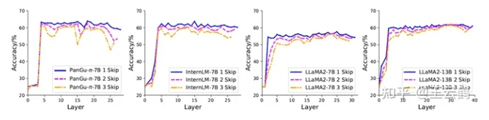
> 删除大模型中的多个层来验证层的重要性。不同大模型上的实验结果表明，靠近首尾的层中间层更重要。

在每个层内部，可以用各种度量函数来评估参数的重要性，包括权重的范数、泰勒展开式、数据驱动可学的度量等。下图比较了使用不同度量选择参数后模型训练效果和收敛速度。使用数据驱动学习的度量是最有效的，可以从较好的起点开始，以更快的速度收敛到更低的loss值。

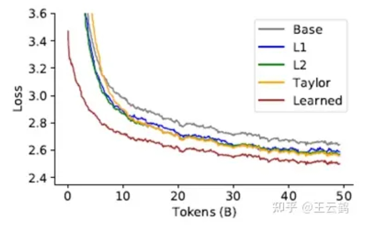
> 不同参数选择方法效果的比较

## 小的大模型思考四：多轮训练

最后来到了优化的部分，现在大多数大模型通常只训练一轮语言模型，即所有的数据只用一次来更新模型，模型的参数实际上并未充分收敛。同时，小语言模型容量较小，也使得模型的遗忘问题更加严重。所以，我们提出应当对模型进行多轮训练，来减轻遗忘问题。

为了降低多轮训练的成本，可以使用第一轮的训练loss来做数据筛选和精炼，优先选择loss大的数据送入第二轮。用r表示第2轮训练时样本的采样率，可以发现当采样率超过50%时，模型效果的提升比较小。

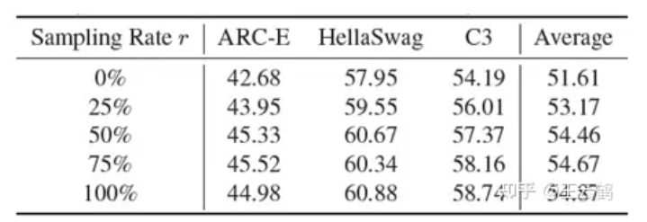
> 第二轮训练时数据采样率的影响

以下是模型在全量数据（1.6T token）上的训练曲线，可以发现第二轮训练时，模型效果依然有非常明显的提升。

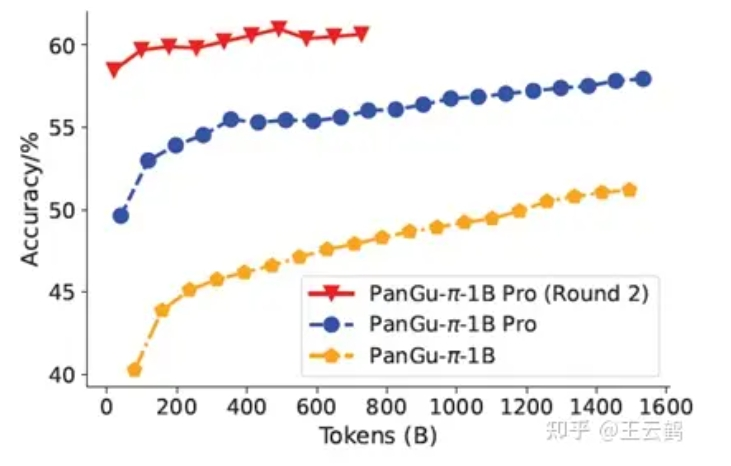
训练过程中，PanGu-π-1B和PanGu-π-1B Pro模型在HellaSwag数据集上的效果

最后，对上述实验和结论做个总结：

1. 分词器（Tokenizer）：在小的模型直接继承大模型的Tokenizer会引入冗余参数，增加计算开销增加。删除Tokenizer中的低频词汇，可以减少Tokenizer参数量，为模型主体留足空间；
2. 模型架构：模型的深度、宽度对小语言模型效果极大。同参数量下，较深的模型往往效果更好，但推理效率更低；
3. 参数继承：继承大模型参数作为初始值可以提升模型效果并加速收敛。在挑选参数时，首尾层比中间层更重要，每层内的有效参数可以通过可学mask得到；
4. 多轮训练：多轮训练被验证对训小模型有效。上一轮训练记录的loss值等中间结果可以指导样本的挑选，降低多轮训练的代价。

整体的评测结果如下，效果提升还是非常喜人的，也算是给2023年下半年工作的一个比较好的答卷，感谢相关团队成员的努力，期待小的大模型能够在2024年发挥作用。

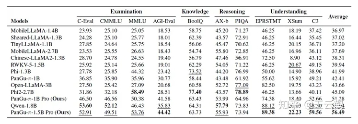
> 在通用测评集（考试、知识、推理、理解）与相近规模模型的比较

## 致谢

- 极致炼丹术：对“小”的大模型的优化重新思考  https://zhuanlan.zhihu.com/p/681614203
