# 上下文工程 Context Engineering：一文读懂重塑大模型智能系统的技术革命

- [上下文工程 Context Engineering：一文读懂重塑大模型智能系统的技术革命](#上下文工程-context-engineering一文读懂重塑大模型智能系统的技术革命)
  - [引言](#引言)
  - [一、重新定义 Agent 数据流：Context is All You Need](#一重新定义-agent-数据流context-is-all-you-need)
    - [1.1 Prompt Engineering - the Art of Instructions](#11-prompt-engineering---the-art-of-instructions)
      - [1.1.1 什么是 Prompt Engineering？](#111-什么是-prompt-engineering)
      - [1.1.2 以提示为中心的方法存在什么局限性？](#112-以提示为中心的方法存在什么局限性)
    - [1.2 Context Engineering 兴起：范式的转移](#12-context-engineering-兴起范式的转移)
      - [1.2.1 prompt 告诉模型如何思考，而Context则赋予模型完成工作所需的知识和工具。](#121-prompt-告诉模型如何思考而context则赋予模型完成工作所需的知识和工具)
    - [1.3 Prompt Engineering vs Context Engineering](#13-prompt-engineering-vs-context-engineering)
  - [二、 Context Engineering 的基石：RAG（Retrieval-Augmented Generation）](#二-context-engineering-的基石ragretrieval-augmented-generation)
    - [2.1 Retrieval-Augmented Generation](#21-retrieval-augmented-generation)
      - [2.1.1 RAG 解决LLM的核心弱点](#211-rag-解决llm的核心弱点)
      - [2.1.2 介绍一下 RAG工作流](#212-介绍一下-rag工作流)
    - [2.2 介绍一下 RAG架构分类](#22-介绍一下-rag架构分类)
    - [2.3 向量数据库的角色](#23-向量数据库的角色)
      - [2.3.1 Context Stack+:一个新兴的abstract layer](#231-context-stack一个新兴的abstract-layer)
      - [2.3.2 选型关键考量因素](#232-选型关键考量因素)
  - [三、Context 工程化：如何判断和提取哪些内容应该进入上下文？](#三context-工程化如何判断和提取哪些内容应该进入上下文)
    - [3.1 从原始数据到相关分块](#31-从原始数据到相关分块)
      - [3.1.1 高级分块策略](#311-高级分块策略)
      - [3.1.2 通过重排序提升精度](#312-通过重排序提升精度)
    - [3.2 核心问题 - Lost in the Middle](#32-核心问题---lost-in-the-middle)
    - [3.3 优化上下文窗口:压缩与摘要](#33-优化上下文窗口压缩与摘要)
    - [3.4 智能体系统的上下文管理](#34-智能体系统的上下文管理)
      - [3.4.1 从 HITL 到 SITL](#341-从-hitl-到-sitl)
      - [3.4.2 智能体上下文管理框架](#342-智能体上下文管理框架)
  - [四、超越检索！智能体架构中的数据流与工作流编排](#四超越检索智能体架构中的数据流与工作流编排)
    - [4.1 工作流（Workflow） vs. 智能体（Agent）](#41-工作流workflow-vs-智能体agent)
    - [4.2 核心架构：预定义数据流的实现](#42-核心架构预定义数据流的实现)
    - [4.3 决策与数据选择机制](#43-决策与数据选择机制)
      - [4.3.1 ReAct框架](#431-react框架)
      - [4.3.2 Planning和任务分解](#432-planning和任务分解)
    - [4.4 框架与工具](#44-框架与工具)
  - [五、Context Engineering 的未来](#五context-engineering-的未来)
  - [致谢](#致谢)

## 引言

在观察去年以来对于"Prompt Engineering+”的解构时，我们可以观察到一个**微妙但重要的分歧**。

一方面，专注于构建可扩展系统的前沿实践者们(如AndrejKarpathy等)，积极倡导用“Context Engineering”来描述工作，认为“Prompt Engineering”这个词不足以涵盖复杂性，认为它只是"Coming up with a laughably pretentious name for typing in the chat box(给在聊天框里打字起的一个可笑的自命不凡的名字)”。

**因为他们构建Agent系统的核心挑战并非仅仅是Prompt，而是设计整个数据流以动态生成最终提示的架构**。

另一方面，近年来学术和正式文献倾向用“Prompt Engineering”作为一个广义的umbrella term (伞形术语)，其定义包括了“Supporting content”或“Context”，**把所有在不改变模型权重的前提下操纵模型输入的技术归为同一类型**。

术语上的分歧可以反映该领域的成熟过程:随着AI应用从简单的单次交互发展到复杂的、有状态的智能体系统，优化静态指令已经无法满足需求。因此，"Context Engineering”的出现，是为了区分两种不同层次的活动:

1. **编写指令的skill**；
2. **构建自动化系统以为该指令提供成功所需信息的科学**。

- **核心问题：上下文丰富性与窗口局限性之间的考量**

Context构建的核心存在一个根本性的矛盾。

1. 一方面，**提供丰富、全面的上下文是获得高质量响应的关键**。
2. 另一方面，**LLM的上下文窗口是有限的，并且由于Lost in the Middle、contextual distraction等问题，过长的上下文反而会导致性能下降**。

原本朴素的想法是**尽可能多地将相关信息塞进上下文窗口**。然而，研究和实践(见3.2节)都证明这是适得其反的。LLM会被无关信息淹没、分心，或者干脆忽略那些不在窗口两端的信息。

这就产生了一个**核心的优化问题**: **如何在固定的Token预算内，最大化 Signal(真正相关的信息)，同时最小化Noise(不相关或分散注意力的信息)，并充分考虑到模型存在的认知偏差?**

这个考量是Context Engineering领域创新的主要驱动力。所有的高级技术一-无论是语义分块、重排序，还是后续将讨论的压缩、摘要和智能体隔离一一都是为了有效管理这一权衡而设计的。因此，Context Engineering不仅是关于提供上下文，更是关于如何策划和塑造上下文，使其对一个认知能力有限的处理单元(LLM)最为有效。

## 一、重新定义 Agent 数据流：Context is All You Need

本部分旨在建立Prompt Engineering与Context Engineering的基础概念，清晰地界定二者之间的区别与联系。

从前者到后者的转变，代表了人工智能应用开发领域一次关键的演进一一从业界最初关注的战术性指令构建，转向由可扩展、高可靠性系统需求驱动的战略性架构设计。

### 1.1 Prompt Engineering - the Art of Instructions

Prompt Engineering是与大型语言模型(LLM)交互的基础，其核心在于精心设计输入内容，以引导模型生成期望的输出。这一实践为理解Context Engineering的必要性提供了基准。

#### 1.1.1 什么是 Prompt Engineering？

一个提示(Prompt)远不止一个简单的问题，它是一个结构化的输入，可包含多个组成部分。这些组件共同构成了与模型沟通的完整指令:

- **指令(Instructions)**: 对模型的核心任务指令，明确告知模型需要执行什么操作。
- **主要内容/输入数据(Primary Content/Input Data)**: 模型需要处理的文本或数据，是分析、转换或生成任务的对象。
- **示例(Examples/Shots)**: 演示期望的输入-输出行为，为模型提供“上下文学习”(In-Context Learning)的基础。
- **线索/输出指示器(Cues/Output Indicators)**: 启动模型输出的引导性词语，或对输出格式(如JSON、Markdown)的明确要求。
- **支持性内容(Supporting Content/Context)**: 为模型提供的额外背景信息，帮助其更好地理解任务情境。正是这一组件，构成了Context Engineering发展的概念萌芽。

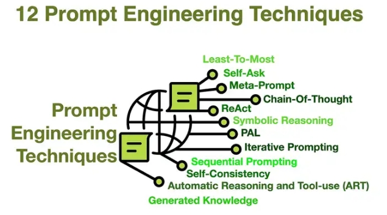

#### 1.1.2 以提示为中心的方法存在什么局限性？

尽管Prompt Engineering至关重要，但对于构建稳健、可用于生产环境的系统而言，它存在固有的局限性:

- **脆弱性&不可复现性**: 提示中微小的措辞变化可能导致输出结果的巨大差异，使得这一过程更像是一种依赖反复试错的“艺术”，而非可复现的“科学”。
- **扩展性差**: 手动、迭代地优化提示的过程，在面对大量用户、多样化用例和不断出现的边缘情况时，难以有效扩展。
- **用户负担**: 这种方法将精心构建一套详尽指令的负担完全压在了用户身上，对于需要自主运行、或处理高并发请求的系统而言是不切实际的。
- **无状态性**: Prompt Engineering 本质上是为单轮、“一次性”的交互而设计的，难以处理需要记忆和状态管理的长对话或多步骤任务。

### 1.2 Context Engineering 兴起：范式的转移

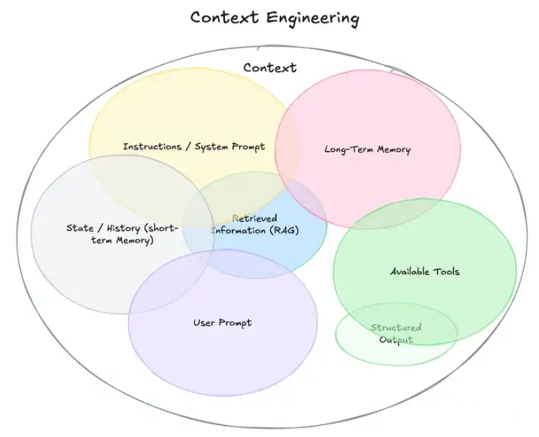

Context Engineering并非要取代Prompt Engineering，而是一个更高阶、更侧重于系统设计的必要学科。

> 定义Context Engineering: Context Engineering是一门设计、构建并优化动态自动化系统的学科，旨在为大型语言模型在正确的时间、以正确的格式，提供正确的信息和工具，从而可靠、可扩展地完成复杂任务。

#### 1.2.1 prompt 告诉模型如何思考，而Context则赋予模型完成工作所需的知识和工具。

**"Context”的范畴**

"Context”的定义已远超用户单次的即时提示，它涵盖了LLM在做出响应前所能看到的所有信息生态系统:

- 系统级指令和角色设定。
- 对话历史(短期记忆)。
- 持久化的用户偏好和事实(长期记忆)。
- 动态检索的外部数据(例如来自RAG)。
- 可用的工具(API、函数)及其定义。
- 期望的输出格式(例如，JSON Schema).

### 1.3 Prompt Engineering vs Context Engineering

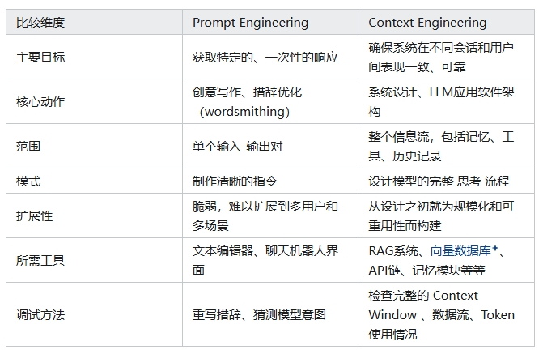

## 二、 Context Engineering 的基石：RAG（Retrieval-Augmented Generation）

本部分将阐述检索增强生成(RAG)作为实现Context Engineering的主要架构模式。从“是什么”转向“如何做”，详细介绍RAG系统的组件和演进。

### 2.1 Retrieval-Augmented Generation

**为何 RAG 不仅是一种技术，更是现代Context Engineering系统的基础架构?**

#### 2.1.1 RAG 解决LLM的核心弱点

RAG直接解决了标准LLM在企业应用中存在的固有局限性:

- **知识冻结**: LLM的知识被冻结在其训练数据的时间点。RAG通过在推理时注入实时的、最新的信息来解决这个问题。
- **缺乏领域专有知识**: 标准LLM无法访问组织的内部私有数据。RAG则能够将LLM连接到这些内部知识库，如技术手册、政策文件等。
- **幻觉(Hallucination)**: LLM会不同程度上地编造事实。RAG通过将模型的回答“锚定”在可验证的、检索到的证据上，提高事实的准确性和可信度。

#### 2.1.2 介绍一下 RAG工作流

RAG的实现通常分为两个主要阶段:

1. **索引(离线阶段)**: 在这个阶段，系统会处理外部知识源。文档被加载、分割成更小的 chunks，然后通过Embedding Model转换为向量表示，并最终存储在专门的向量数据库中以备检索。
2. **推理(在线阶段)**: 当用户提出请求时，系统执行以下步骤:
   1. **检索(Retrieve)**: 将用户的查询同样转换为向量，然后在向量数据库中进行相似性搜索，找出与查询最相关的文档块。
   2. **增强 (Augment)**: 将检索到的这些文档块与原始的用户查询、系统指令等结合起来，构建一个内容丰富的、增强的最终提示。
   3. **生成(Generate)**: 将这个增强后的提示输入给LLM，LLM会基于提供的上下文生成一个有理有据的回答。

### 2.2 介绍一下 RAG架构分类

- **Naive RAG**: 即上文描述的基础实现。它适用于简单的问答场景，但在检索质量和上下文处理方面存在局限。
- **Advanced RAG**: 这种范式在检索前后引入了处理步骤以提升质量。许多第三部分将详述的技术都属于这一范畴。关键策略包括:
  - **检索前处理**: 采用更复杂的文本分块策略、查询转换(如StepBack-prompting)等优化检索输入。
  - **检索后处理**: 对检索到的文档进行Re-ranking 以提升相关性，并对上下文进行Compression,
- **Modular RAG**: 一种更灵活、更面向系统的RAG视图，其中不同的组件(如搜索、检索、记忆、路由) 被视为可互换的模块。这使得构建更复杂、更定制化的流程成为可能。具体模式包括:
  - **带记忆的RAG**: 融合对话历史，以处理多轮交互，使对话更具连续性。
  - **分支/路由RAG**: 引入一个路由模块，根据查询的意图决定使用哪个数据源或检索器。
  - **Corrective RAG**, CRAG: 增加了一个自我反思步骤。一个轻量级的评估器会对检索到的文档质量进行打分。如果文档不相关，系统会触发替代的检索策略(如网络搜索)来增强或替换初始结果。
  - **Self-RAG**: 让LLM自身学习判断何时需要检索以及检索什么内容，通过生成特殊的检索Token来自主触发检索。
  - **Agentic RAG**: 这是RAG最先进的形式，将RAG集成到一个智能体循环(agentic loop)中。模型能够执行多步骤任务，主动与多个数据源和工具交互，并随时间推移综合信息。**这是Context Engineering在工程实践中的顶峰**。
- **GraphRAG**: 一种革命性的RAG范式，通过引入知识图谱和图结构从根本上改变信息检索和推理方式。与传统基于向量相似度的检索不同，GraphRAG构建实体-关系图谱，通过图遍历实现多跳推理和结构化知识检索。
  - GraphRAG特别适合需要复杂关系推理的场景，如企业知识管理、法律合规分析、科学文献综合等。它代表了从语义匹配向结构化推理的范式转换，是Context Engineering 进入知识图谱时代的重要标志。

### 2.3 向量数据库的角色

本节将分析支撑RAG中“检索”步骤的关键基础设施，并比较市场上的主流解决方案。

#### 2.3.1 Context Stack+:一个新兴的abstract layer

观察RAG系统的构成一一数据摄入、分块、嵌入、用于索引和检索的向量数据库、重排序器、压缩器以及最终的LLM --可以发现，这些组件并非随意组合，而是形成了一个连贯的、多层次的架构。这可以被抽象地称为Context Stack。

这个堆栈的数据流非常清晰:在离线索引阶段，数据从原始文档流向分块、嵌入，最终存入向量数据库。在在线推理阶段，数据流从用户查询开始，经过嵌入、向量搜索、重排序、压缩，最终形成送入LLM的提示。

这个堆栈的出现，标志着AI应用开发正在走向成熟，不同的技术供应商开始专注于Stack 中的特定层面:Pinecone+、Weaviate和 Milvus+等公司在做Database layer;LangChain+和Llamalndex+ 等框架提供了将所有组件粘合在一起的Application Orchestration Layer;而Cohere和 Jina Al等提供了专业的Re-ranking as a Service (RaaS)模块。

因此，理解新的AI Agent架构，就意味着理解Context Engineering，就意味着要理解这个新兴的Context Stack，*了解其各个层次以及在每个层次上不同组件之间的权衡。这种视角将讨论从一系列孤立的技术提升到系统设计和技术选型*的高度，对工程师和架构师而言具有更高的价值。

#### 2.3.2 选型关键考量因素

组织在选择向量数据库时必须考虑以下主要因素:

- **模型**: 选择完全托管的云服务(如Pinecone)，还是可自托管的开源方案(如 Milvus、Weaviate) .
- **扩展性**: 是否能处理数十亿级别的向量数据和高查询负载(Milvus)。
- **功能集**: 是否支持混合搜索(关键词+向量)、高级meta过滤以及多模态数据处理(Weaviate)。
- **易用性与灵活性**: 是倾向于API简单、设置最少的方案(Pinecone)，还是需要多种索引算法和深度配置选项的方案(Milvus)。

为了给技术选型提供一个实用的决策框架，下表对几个主流的向量数据库进行了比较。

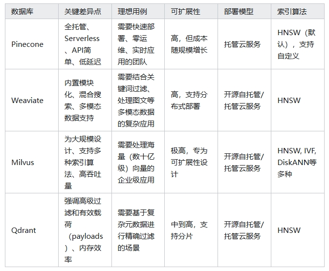

## 三、Context 工程化：如何判断和提取哪些内容应该进入上下文？

### 3.1 从原始数据到相关分块

不管是RAG或者任何形式的数据流控制，**其本质都是为了判断和提取哪些内容应该进入上下文**。

本节聚焦于从知识库中识别和检索最有价值信息的初始阶段。

#### 3.1.1 高级分块策略

分块(Chunking)是RAG流程中最关键也最容易被忽视的一步。其目标是创建在语义上自成一体的文本块。

- **朴素分块的问题**: 固定大小的分块方法虽然简单，但常常会粗暴地切断句子或段落，导致上下文支离破碎，语义不完整。
- **内容感知分块**:
  - **递归字符分割**: 一种更智能的方法，它会按照一个预设的分割符层次结构(如:先按段落，再按句子，最后按单词)进行分割，以尽可能保持文本的自然结构。
  - **文档特定分块**: 利用文档自身的结构进行分割，例如，根据Markdown的标题、代码文件的函数或法律合同的条款来划分。
  - **语言学分块**: 使用NLTK、spaCy等自然语言处理库，基于句子、名词短语或动词短语等语法边界进行分割。
- **语义分块**: 这是最先进的方法之一。它使用嵌入模型来检测文本中语义的转变点。当文本的主题或意义发生变化时，就在该处进行分割，从而确保每个分块在主题上是高度内聚的。研究表明，这种策略的性能优于其他方法。
- **智能体分块**: 一个前沿概念，即利用一个LLM智能体来决定如何对文本进行分块，例如，通过将文本分解为一系列独立的propositions 来实现。

#### 3.1.2 通过重排序提升精度

为了平衡检索的速度和准确性，业界普遍采用两阶段检索流程。

- **两阶段流程**:
  - **第一阶段(召回)**: 使用一个快速、高效的检索器(如基于bi-encoder的向量搜索或BM25等词法搜索)进行广泛撒网，召回一个较大的候选文档集(例如，前100个)。
  - **第二阶段(精排/重排序)**: 使用一个更强大但计算成本更高的模型，对这个较小的候选集进行重新评估，以识别出最相关的少数几个文档(例如，前5个)。
- **Cross-Encoder**: 交叉编码器之所以在重排序阶段表现优越，是因为它与双编码器的工作方式不同。双编码器独立地为查询和文档生成嵌入向量，然后计算它们的相似度。而交叉编码器则是将查询和文档同时作为输入，让模型在内部通过Attention Mechanism对二者进行深度交互。这使得模型能够捕捉到更细微的语义关系，从而给出更准确的相关性评分。
- **实际影响**: 重排序显著提高了最终送入LLM的上下文质量，从而产出更准确、幻觉更少的答案。在金融、法律等高风险领域，重排序被认为是必不可少而非可选的步骤。

### 3.2 核心问题 - Lost in the Middle

> 论文：https://arxiv.org/abs/2307.03172

当前LLM存在一个根本性认知局限，这一局限使得简单的上下文堆砌变得无效，并催生了后续的优化技术。

- 定义: **LLM在处理长上下文时表现出一种独特的U型性能曲线。当关键信息位于上下文窗口的开头(首因效应)或结尾(近因效应)时，模型能够高效地利用这些信息。然而，当关键信息被"hidden”在长篇上下文的中间位置时，模型的性能会显著下降**。
- 实验:在多文档问答任务时，即使检索器召回了更多相关的文档，模型的性能提升也很快达到饱和。这意味着简单地增加上下文长度(即添加更多文档)不仅无益，甚至因为关键信息被淹没而损害性能。
- “知道但说不出来”:并非模型“找不到”信息。通过探测模型的内部表征发现，模型通常能够准确地编码关键信息的位置，但在生成最终答案时却未能有效利用这些信息。这表明在模型内部，信息检索和信息利用(或沟通)之间存在脱节。

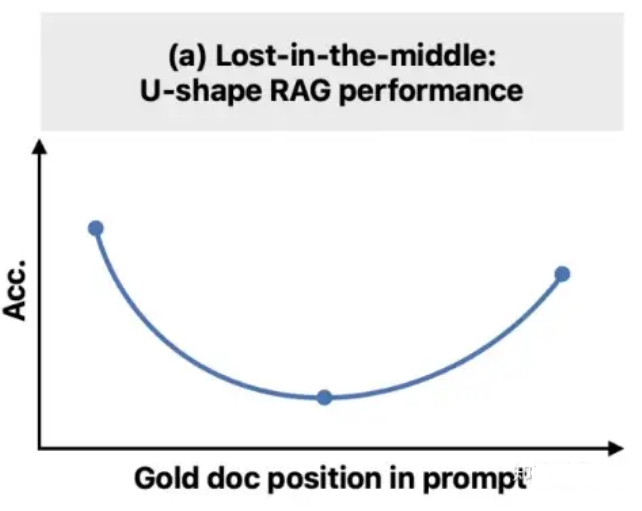

### 3.3 优化上下文窗口:压缩与摘要

- **上下文压缩的目标**: 缩短检索到的文档列表和/或精简单个文档的内容，只将最相关的信息传递给LLM。这能有效降低API调用成本、减少延迟，并缓解Lost in the Middle 的问题。
- **压缩方法**:
  - **过滤式压缩**: 这类方法决定是保留还是丢弃整个检索到的文档。
  - **LLMChainFilter**: 利用一个LLM对每个文档的相关性做出简单的“是/否”判断。
  - **EmbeddingsFilter**: 更经济快速的方法，根据文档嵌入与查询嵌入的余弦相似度来过滤文档。
  - **内容提取式压缩**: 这类方法会直接修改文档内容。
  - **LLMChainExtractor**: 遍历每个文档，并使用LLM从中提取仅与查询相关的句子或陈述。
  - **用 top N 代替压缩**: 像LLMListwiseRerank这样的技术，使用LLM对检索到的文档进行重排序，并只返回排名最高的N个，从而起到高质量过滤器的作用。
- **作为压缩策略的摘要**: 对于非常长的文档或冗长的对话历史，可以利用LLM生成摘要。这些摘要随后被注入上下文，既保留了关键信息，又大幅减少了Token 数量。这是在长时程运行的智能体中管理上下文的关键技术。

### 3.4 智能体系统的上下文管理

#### 3.4.1 从 HITL 到 SITL

Prompt Engineering本质上是一个手动的、Human-in-the-Loop 的试错过程。而Context Engineering，尤其是在其智能体形式中，则是关于构建一个自动化的System-in-the-Loop，这个系统在LLM看到提示之前就为其准备好上下文。

一个人类提示工程师需要手动收集信息、组织语言并进行测试。而一个Context ngineering 化的系统则将此过程自动化:RAG流程本身就是一个自动收集信息的系统;路由器是一个自动决定收集哪些信息的系统;记忆模块是一个自动持久化和检索历史信息的系统。

正是这种自动化，使得AI系统能够变得“智能体化”(Agentic)-一即能够在没有人类为每一步微观管理上下文的情况下，进行自主的、多步骤的推理。因此，Context Engineering 的目标是构建一个可靠、可重复的上下文组装机器。这台机器取代了提示工程师的临时性、手工劳动，从而使创建真正自主和可扩展的AI智能体成为可能。焦点从单个提示的“技艺”转向了生成该提示的“系统工程”。

#### 3.4.2 智能体上下文管理框架

LangChain 博客中提出的四个关键策略:

- **Write - 持久化上下文**:
  - **Scratchpads**:供智能体在执行复杂任务时使用的临时、会话内记忆，用于记录中间步骤。
  - **Memory**: 长期、持久化的存储，记录关键事实、用户偏好或对话摘要，可在不同会话间调用。
- **Select - 检索上下文**:
  - 根据当前的子任务，使用RAG技术动态地从记忆、工具库或知识库中选择相关上下文。这甚至包括对工具描述本身应用RAG，以避免向智能体提供过多无关的工具选项。
- **Compress - 优化上下文**:
  - 利用摘要或修剪技术来管理智能体在长时程任务中不断增长的上下文，防止上下文窗口溢出和" Lost in the Middle”问题。
- **Isolate - 分割上下文**:
  - 多智能体系统: 将一个复杂问题分解，并将子任务分配给专门的子智能体，每个子智能体都拥有自己独立的、更聚焦的上下文窗口。
  - 沙盒环境: 在一个隔离的环境中执行工具调用，只将必要的执行结果返回给LLM，从而将包含大量 Token的复杂对象隔离在主上下文窗口之外。

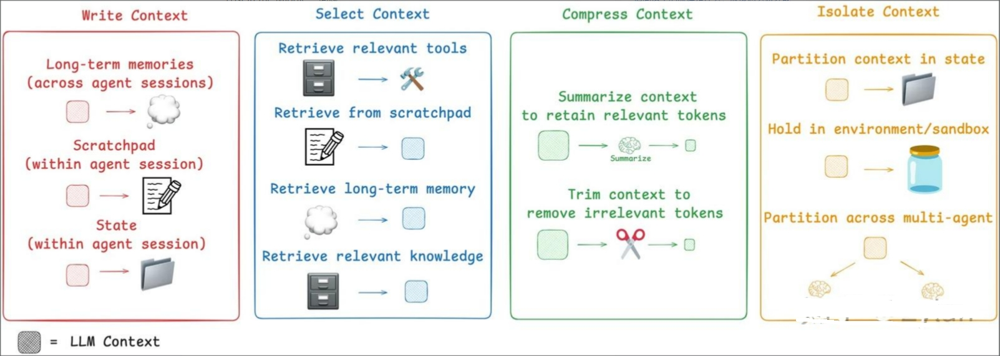

## 四、超越检索！智能体架构中的数据流与工作流编排

前面通过单个LLM的上下文窗口讲了context 的重要性，而现在的Agent(特别是Multi-Agent架构)一般是组合式架构，不再是简单地“输入-输出”，而是需要多次调用工具、频繁访问数据库、与用户进行多轮交互。

LLM 正在从被动地响应用户查询的“响应者”，演变为能够自主规划、决策并执行多步骤复杂任务的“执行者”。

那么在这种情况下，其内部的数据是如何流动和管理的?对于不同模型需要不同context的时候如何进行调度?

### 4.1 工作流（Workflow） vs. 智能体（Agent）

在深入技术细节之前，建立一个清晰的概念框架至关重要。业界(如Anthropic)倾向于对“智能体系统”进行两种架构上的区分。

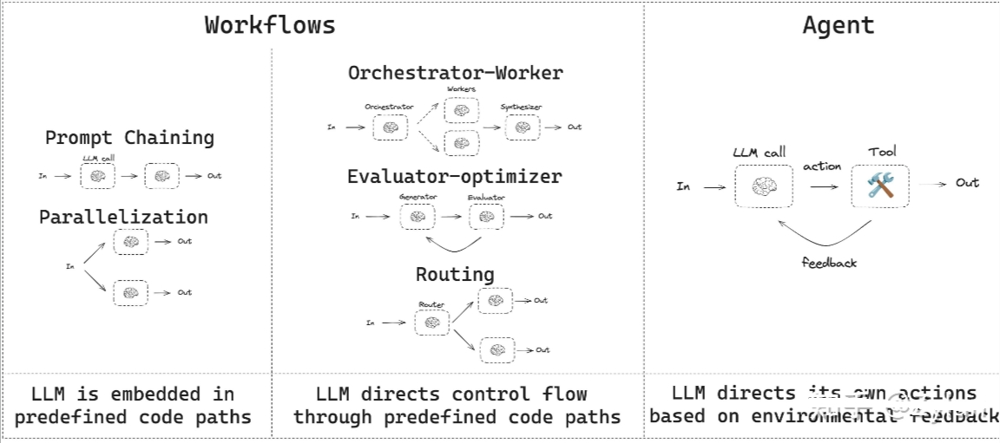

- **工作流(Workflows)**
  - 指的是LLM和工具通过预定义的代码路径进行编排的系统。在这种模式下，数据流动的路径是固定的、由开发者明确设计的，类似于上世纪流行的“专家系统”。例如，“第一步:分析用户邮件;第二步:根据分析结果在日历中查找空闲时段;第三步:起草会议邀请邮件”。这种模式确定性高，易于调试和控制，非常适合有明确业务流程的场景(如风控需求高、数据敏感、安全等级要求)。
- **智能体(Agents)**
  - 指的是LLM动态地指导自己的流程和工具使用，自主控制如何完成任务的系统。在这种模式下，数据流动的路径不是预先固定的，而是由LLM在每一步根据当前情况和目标动态决定的。这种模式灵活性高，能处理开放式问题，但可控性和可预测性较低。

复杂的智能体通常是这两种模式的混合体，在宏观层面遵循一个预定义的工作流，但在某些节点内部，又赋予LLM一定的自主决策权。管理这一切的核心，我们称之为编排层(Orchestration Layer) .

### 4.2 核心架构：预定义数据流的实现

为了实现可靠、可控的数据流动，开发者们已经探索出几种成熟的架构模式。这些模式可以单独使用，也可以组合成更复杂的系统。

1. **链式工作流(PromptChaining)**(gpt-3.5时期的工作原理)
   1. **数据流**: 输入-> 模块A -> 输出A -> 模块B -> 输出B ->... -> 最终输出
   2. **工作原理**: 每个模块(LLM调用)只负责一个定义明确的子任务。

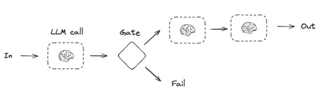

2. **路由工作流 (Routing)(o3的早期工作原理)**
   1. **数据流**: 输入 -> 路由器选择=> ->输出
   2. **工作原理**: 一个充当“路由器”的LLM调用，其唯一任务就是决策。它会分析输入数据，然后输出一个指令，告诉编排系统接下来应该调用哪个具体的业务模块。
   3. **实现方式**: LangGraph 使用Conditional Edges来实现这种逻辑，即一个节点的输出决定了图的下一跳走向何方。

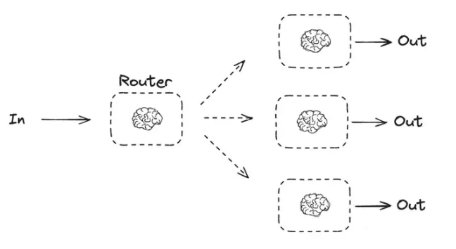

1. **编排器-工作者模式(Orchestrator-Workers)**(perplexity、gemini等多 search 架构的原理)
   1. 对于极其复杂的任务，可以采用多智能体(Multi-agent)架构，也称为Orchestrator-Workers 模式。一个中心Orchestrator智能体负责分解任务，并将子任务分配给多个专职的 Workers 智能体。
   2. 数据流:这是一个分层、协作的流动模式。总任务-> Orchestrator => ->结果汇总->最终输出
   3. 工作原理:每个工作者智能体都有自己独立的上下文和专用工具，专注于解决特定领域的问题。

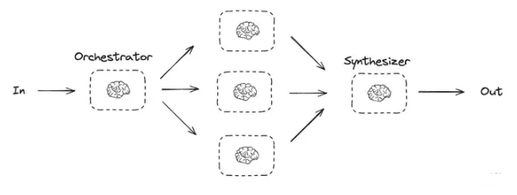

### 4.3 决策与数据选择机制

在上述架构中，智能体(或其模块)如何决定“需要什么数据”以及“下一步做什么”?这依赖于其内部的规划和推理能力。

#### 4.3.1 ReAct框架

ReAct (Reasoning and Acting)是一个基础且强大的框架，它通过模拟人类的“Reasoning-Acting”模式，使LLM能够动态地决定数据需求。(Anthropic早期的MCP客户端就基于这个架构)

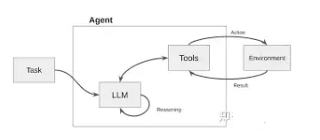

其核心是一个循环：

1. **思考 (Thought)**: LLM首先进行内部推理。它分析当前任务和已有信息，判断是否缺少完成任务所需的知识，并制定下一步的行动计划。

> 例如:“用户问我今天旧金山的天气，但我不知道。我需要调用天气查询工具。"

1. **行动 (Action)**: LLM决定调用一个具体的工具，并生成调用该工具所需的参数。

> 例如: Action:search_weather(location="San Francisco")。

3. **观察(Observation)**: 系统执行该行动(调用外部API)，并将返回的结果作为“观察”数据提供给LLM。

> 例如: Observation:"旧金山今天晴，22摄氏度。"

4. **再次思考**: LLM接收到新的观察数据，再次进入思考环节，判断任务是否完成，或是否需要进一步的行动。

> 例如: “我已经获得了天气信息，现在可以回答用户的问题了。"

在这个循环中，**数据流是根据LLM的“思考”结果动态生成的**。当LLM判断需要外部数据时，它会主动触发一个“行动”来获取数据，然后将获取到的“观察”数据整合进自己的上下文中，用于下一步的决策。

#### 4.3.2 Planning和任务分解

对于更复杂的任务，智能体通常会先进行规划(Planning)。一个高阶的规划模块会将用户的宏大目标分解成一系列更小、更具体、可执行的子任务。

**数据流向**: 规划模块的输出是一份“计划清单”(Planning List)，这份清单定义了后续一系列模块的调用顺序和数据依赖关系。

(前一阵子流行的Claude Code，刚更新的Cursorv1.2，以及上个版本流行的Gemini/GPT DeepResearch就属于这个架构)

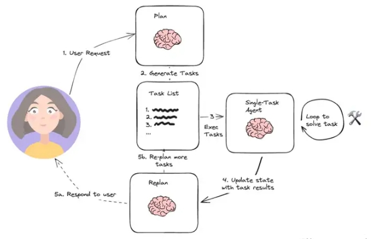

> 例如，对于“帮我策划一次巴黎三人五日游”的请求，规划模块可能会生成如下计划，并定义了每个步骤所需的数据输入和输出:

1. [获取用户预算和偏好]->[搜索往返机票]
2. [机票信息] -> [根据旅行日期和预算搜索酒店]
3. [酒店信息]->[规划每日行程]
4. [机票、酒店、行程信息]-> [生成最终行程单和预算报告]
5. Reflection机制

先进的智能体架构还包含反思(Reflection)机制。智能体在执行完一个动作或完成一个子任务后，会评估其结果的质量和正确性。如果发现问题，它可以自我修正，重新规划路径。

(这是截止撰文时，各大主流 deep research 平台使用的核心技术方案)

数据流向:这是一个反馈循环。模块的输出不仅流向下一个任务模块，还会流向一个“评估器”模块。评估器的输出(如“成功”、“失败”、“信息不足”)会反过来影响规划模块，从而调整后续的数据流向。

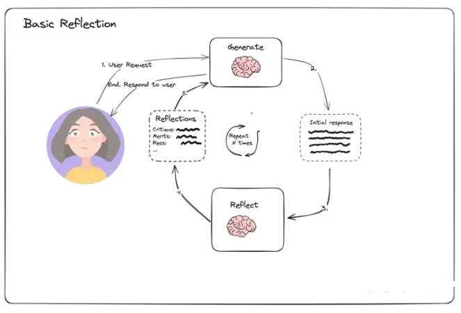

### 4.4 框架与工具

上述的架构和机制并非凭空存在，而是通过具体的开发框架实现的。其中，LangGraph作为LangChain的扩展，为构建具有显式数据流的智能体系统提供了强大的工具集。

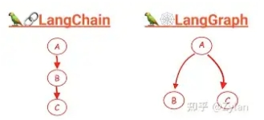

**LangGraph:用图(Graph) 定义工作流(Workflow)**

LangGraph的核心思想是将智能体应用构建成一个状态图(State Graph)。这个图由节点和边组成，清晰地定义了数据如何在不同模块间流动

- **状态(State)**: 这是整个图的核心，一个所有节点共享的中央数据对象。你可以把它想象成一个“数据总线”或共享内存。开发者需要预先定义State的结构，每个节点在执行时都可以读取和更新这个State对象。
- **节点(Nodes)**: 代表工作流中的一个计算单元或一个步骤。每个节点通常是一个Python函数，它接收当前的State作为输入，执行特定任务(如调用LLM、执行工具、处理数据)，然后返回对State的更新。
- **边(Edges)**: 连接节点，定义了工作流的路径，即数据在State更新后应该流向哪个节点。
- **简单边(Simple Edges)**: 定义了固定的、无条件的流向，用于实现链式工作流。
- **条件边(Conditional Edges)**: 用于实现路由逻辑。它会根据一个函数的输出来决定接下来应该走向哪个节点，从而实现流程的分支。
- **检查点(Checkpointer)**: LangGraph提供了持久化机制，可以在每一步执行后自动保存State的状态。这对于构建需要长期记忆、可中断和恢复、或需要Human-in-the-Loop 的复杂业务流程至关重要。

> 复杂业务流程的AI智能体，其核心挑战已从单纯优化信息检索(如RAG)或提示词，转向了对内部工作流和数据流的精心设计与编排。

## 五、Context Engineering 的未来

- Graph RAG 的兴起:
  - 展望未来，GraphRAG将继续向效率优化、成本降低和更好的系统集成方向发展。短期内，重点在于混合架构的广泛采用和专门实现的优化，并期待GraphRAG框架的标准化和自动化图构建的改进;长期(2028+)，将出现具有实时自适应图系统的成熟生态系统。
- 智能体自主性的增强:
  - 像 Self-RAG和Agentic RAG这样更自主的系统将成为趋势，LLM将承担更多管理自身上下文的责任。这将模糊Context Engineering系统与LLM 本身之间的界限。
- 超越固定上下文窗口:
- 针对 Lost in the Middle问题的研究正在进行中，包括探索新的模型架构(如改进的位置编码)和训练技术。这些研究的突破可能会从根本上改变当今Context Engineering师所面临的约束。

## 致谢

- Context Engineering https://www.zhihu.com/question/4838236459/answer/1932609897410834830

