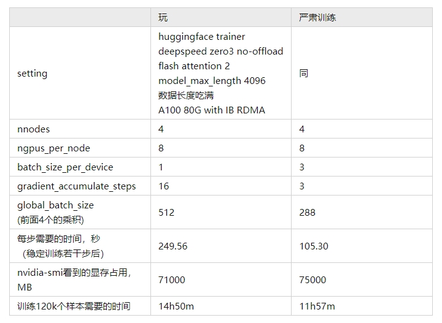

# 全参数微调LLaMA-2-70B 经验帖

- [全参数微调LLaMA-2-70B 经验帖](#全参数微调llama-2-70b-经验帖)
  - [一、使用deepspeed训练](#一使用deepspeed训练)
  - [二、显存计算](#二显存计算)
  - [三、checkpoint大小计算](#三checkpoint大小计算)
  - [四、删除model.safetensors.index.json](#四删除modelsafetensorsindexjson)
  - [五、FastChat训练遇到RuntimeError: shape '\[1, 2048, 64, 128\]' is invalid for input of size 2097152](#五fastchat训练遇到runtimeerror-shape-1-2048-64-128-is-invalid-for-input-of-size-2097152)
  - [致谢](#致谢)

## 一、使用deepspeed训练

比我预期的要简单很多，deepspeed和hf trainer配合得很丝滑，稍微加几个参数就行了

```s
    deepspeed --num_nodes ${nnodes}\
    --num_gpus 8 \
    --hostfile ${deepspeed_hostfile_path} \
    --master_addr ${rdzv} \
    --master_port=${master_port}
    script args
```

1. 写好deepspeed的hostfile

注意如果master要参与训练的话也需要写到hostfile里，要保证hostfile里的每台机器都能免密登陆（包括本机）。

2. 保证环境、模型、代码对于每台机器的访问路径是一样的

一般公司都会有ceph集群挂载到机器上，访问集群上的路径都是一样的。环境的事情不用太担心，deepspeed在写好hostfile后，会自动ssh上每台slave上起训练，使用的python解释器和master的解释器是同路径的，不需要手动打开conda.

3. 计算global_batch_size

在deepspeed下，global_batch_size仍然等于nnodes * ngpus_per_node * batch_size_per_device * gradient_accumulate_steps 。

## 二、显存计算

开启zero3且不offload时，全参数微调最少需要显存可以估计为n_params(in Billion)16个GB。所以70*16=1120GB，大约是1120/80=14张80G的显卡，大概是两台机器。这里估计的只是把模型、梯度和优化器放下需要的显存，前向计算还需要额外的显存。

前向计算的显存和具体使用的模型架构（层数、每层大小等）、输入的长度、使用的batch_size有关，一般通过实验测定。



可以看出，要想训练快，还是要把batch_size_per_device尽量开大一些。

## 三、checkpoint大小计算

保存checkpoint的时候只需要模型参数(fp16)和优化器状态(fp32)就行了。

对于70B的模型，使用AdamW训练时优化器的参数量是模型本身的两倍，所以最后算起来每个checkpoint需要70 * 2 + 70 * 2 * 4 = 700GB ，还是非常大的。建议设置一下hf trainer的--save_total_limit number ，把太早的checkpoint删掉，避免集群的磁盘满了。

## 四、删除model.safetensors.index.json

为了节省硬盘空间，在浅clone了Llama-2-70b-hf后，我用git lfs pull --include="*.bin"只拉下来了pytorch bin格式的参数，没有拉.safetensors格式的参数。

这其实有一个坑，因为safetensors的索引文件model.safetensors.index.json优先级是高于bin的索引文件的model.index.json 的，导致使用AutoModelForCausalLM.from_pretrained报找不到文件。删掉这个索引就行了。

## 五、FastChat训练遇到RuntimeError: shape '[1, 2048, 64, 128]' is invalid for input of size 2097152

根据 https://github.com/lm-sys/FastChat/issues/2316，这是因为flash attention 2对于llama 2模型需要新的monkey patch代码，替换为 https://github.com/lm-sys/FastChat/blob/main/fastchat/train/llama2_flash_attn_monkey_patch.py后即可训练。

## 致谢

- [林知/术] 全参数微调LLaMA-2-70B备忘 https://zhuanlan.zhihu.com/p/666613055
