# 大模型（LLMs）微调面

- [大模型（LLMs）微调面](#大模型llms微调面)
  - [39 大模型 sft 过程中，为什么会出现第二个epoch的时候loss会突然下降问题？](#39-大模型-sft-过程中为什么会出现第二个epoch的时候loss会突然下降问题)
  - [1 如果想要在某个模型基础上做全参数微调，究竟需要多少显存？](#1-如果想要在某个模型基础上做全参数微调究竟需要多少显存)
  - [2 为什么SFT之后感觉LLM傻了?](#2-为什么sft之后感觉llm傻了)
  - [3 SFT 指令微调数据 如何构建?](#3-sft-指令微调数据-如何构建)
      - [3.1 提升sft的prompt的代表性有什么好的方法？](#31-提升sft的prompt的代表性有什么好的方法)
      - [3.2 提升sft的prompt的数据量有什么好的方法？](#32-提升sft的prompt的数据量有什么好的方法)
  - [4 领域模型Continue PreTrain 数据选取？](#4-领域模型continue-pretrain-数据选取)
  - [5 领域数据训练后，通用能力往往会有所下降，如何缓解模型遗忘通用能力？](#5-领域数据训练后通用能力往往会有所下降如何缓解模型遗忘通用能力)
  - [6 领域模型Continue PreTrain ，如何 让模型在预训练过程中就学习到更多的知识？](#6-领域模型continue-pretrain-如何-让模型在预训练过程中就学习到更多的知识)
  - [7 进行SFT操作的时候，基座模型选用Chat还是Base?](#7-进行sft操作的时候基座模型选用chat还是base)
  - [8 领域模型微调 指令\&数据输入格式 要求？](#8-领域模型微调-指令数据输入格式-要求)
  - [9 领域模型微调 领域评测集 构建？](#9-领域模型微调-领域评测集-构建)
  - [10 领域模型词表扩增是不是有必要的？](#10-领域模型词表扩增是不是有必要的)
  - [11 如何训练自己的大模型？](#11-如何训练自己的大模型)
  - [12 训练中文大模型有啥经验？](#12-训练中文大模型有啥经验)
  - [13 指令微调的好处？](#13-指令微调的好处)
  - [14 预训练和微调哪个阶段注入知识的？](#14-预训练和微调哪个阶段注入知识的)
  - [15 想让模型学习某个领域或行业的知识，是应该预训练还是应该微调？](#15-想让模型学习某个领域或行业的知识是应该预训练还是应该微调)
  - [16 多轮对话任务如何微调模型？](#16-多轮对话任务如何微调模型)
  - [17 微调后的模型出现能力劣化，灾难性遗忘是怎么回事？](#17-微调后的模型出现能力劣化灾难性遗忘是怎么回事)
  - [18 微调模型需要多大显存？](#18-微调模型需要多大显存)
  - [19 大模型LLM进行SFT操作的时候在学习什么？](#19-大模型llm进行sft操作的时候在学习什么)
  - [20 预训练和SFT操作有什么不同](#20-预训练和sft操作有什么不同)
  - [21 样本量规模增大，训练出现OOM错](#21-样本量规模增大训练出现oom错)
  - [22 大模型LLM进行SFT 如何对样本进行优化？](#22-大模型llm进行sft-如何对样本进行优化)
  - [23 模型参数迭代实验](#23-模型参数迭代实验)
  - [24 微调大模型的一些建议](#24-微调大模型的一些建议)
  - [25 微调大模型时，如果 batch size 设置太小 会出现什么问题？](#25-微调大模型时如果-batch-size-设置太小-会出现什么问题)
  - [26 微调大模型时，如果 batch size 设置太大 会出现什么问题？](#26-微调大模型时如果-batch-size-设置太大-会出现什么问题)
  - [27 微调大模型时, batch size 如何设置问题？](#27-微调大模型时-batch-size-如何设置问题)
  - [28 微调大模型时, 优化器如何？](#28-微调大模型时-优化器如何)
  - [29 哪些因素会影响内存使用？](#29-哪些因素会影响内存使用)
  - [30 进行领域大模型预训练应用哪些数据集比较好？](#30-进行领域大模型预训练应用哪些数据集比较好)
  - [31 用于大模型微调的数据集如何构建？](#31-用于大模型微调的数据集如何构建)
  - [32 大模型训练loss突刺原因和解决办法](#32-大模型训练loss突刺原因和解决办法)
    - [32.1 大模型训练loss突刺是什么？](#321-大模型训练loss突刺是什么)
    - [32.2 为什么大模型训练会出现loss突刺？](#322-为什么大模型训练会出现loss突刺)
    - [32.3 大模型训练loss突刺 如何解决？](#323-大模型训练loss突刺-如何解决)
  - [33 什么是Cosine优化器？在大模型中应该怎么设置cosine优化器的周期比较好？](#33-什么是cosine优化器在大模型中应该怎么设置cosine优化器的周期比较好)
  - [34 在预训练阶段，若模型训练文本时不包含标记，而在后续预测阶段却添加了标记；或者相反，训练阶段加入了标记，但在预测时却没有使用，这两种情况下 benchmark 预测可能会遇到哪些问题呢？](#34-在预训练阶段若模型训练文本时不包含标记而在后续预测阶段却添加了标记或者相反训练阶段加入了标记但在预测时却没有使用这两种情况下-benchmark-预测可能会遇到哪些问题呢)
  - [35 SFT packing是什么？](#35-sft-packing是什么)
  - [36 SFT packing对SFT训练的影响是什么？](#36-sft-packing对sft训练的影响是什么)
  - [37 SFT阶段模型可以学习新知识么？](#37-sft阶段模型可以学习新知识么)
  - [38 建立sft数据主要需要关注什么方面？](#38-建立sft数据主要需要关注什么方面)
  - [40 解决显存不够的方法？](#40-解决显存不够的方法)
  - [41 指令策略的选择及其影响](#41-指令策略的选择及其影响)
  - [42 如何解决prompt泛化性？](#42-如何解决prompt泛化性)
  - [43 大模型SFT最重要的是什么，分次SFT会发生什么?](#43-大模型sft最重要的是什么分次sft会发生什么)
  - [44 大模型 supervised fine-tuning(SFT)的方法主要分为哪些?](#44-大模型-supervised-fine-tuningsft的方法主要分为哪些)
  - [致谢](#致谢)

## 39 大模型 sft 过程中，为什么会出现第二个epoch的时候loss会突然下降问题？

出现该现象，说明 大模型 sft 过程中 出现了 过拟合问题，如下图所示：

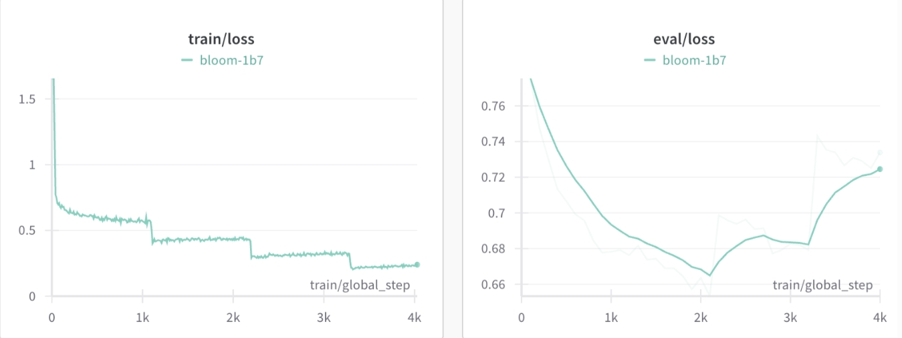
> 从图片可以看出， train loss 每一个 epoch 结束后都出现了阶梯式突然下降，但是 eval loss 没有这种问题，相反却出现了上升问题

- 问题原因：

由于大模型参数量较为庞大，所以在 sft 过程中，第一个 epoch 后就基本能学习到 整个训练集信息，所以第二个 epoch 容易出现下降问题；

- 解决方法：

1. 采用全参数微调方式，同时 调低学习率和 epoch 数；
2. 换成 LoRA 微调方式（注：最好只对 qkv 进行 lora，过多的层进行 LoRA 容易出现过拟合问题） 

## 1 如果想要在某个模型基础上做全参数微调，究竟需要多少显存？

一般 nB 的模型，最低需要 16-20n G 的显存。（cpu offload基本不开的情况下）

vicuna-7B为例，官方样例配置为 4*A100 40G，测试了一下确实能占满显存。（global batch size 128，max length 2048）当然训练时用了FSDP、梯度累积、梯度检查点等方式降显存。

## 2 为什么SFT之后感觉LLM傻了?

- 原版答案：

SFT的重点在于激发大模型的能力，SFT的数据量一般也就是万恶之源alpaca数据集的52k量级，相比于预训练的数据还是太少了。

**如果抱着灌注领域知识而不是激发能力的想法，去做SFT的话，可能确实容易把LLM弄傻**。

- 新版答案：

> **指令微调是为了增强（或解锁）大语言模型的能力。**

其真正作用：

> **指令微调后，大语言模型展现出泛化到未见过任务的卓越能力**，即使在多语言场景下也能有不错表现 。

## 3 SFT 指令微调数据 如何构建?

1. **代表性**。应该**选择多个有代表性的任务**；
2. **数据量**。**每个任务实例数量不应太多**（比如：数百个）否则可能会**潜在地导致过拟合问题并影响模型性能**；
3. **不同任务数据量占比**。应该**平衡不同任务的比例**，并且限制整个数据集的容量（通常几千或几万），**防止较大的数据集压倒整个分布**。

#### 3.1 提升sft的prompt的代表性有什么好的方法？

1. 明文TAG法：也就是对SFT的prompt进行打tag，对其中的名词和动词进行分类打标，最后通过tag对prompt的分布进行调整，保证tag的分布是均匀的。著名的就是InsTag [1] 这个方法。

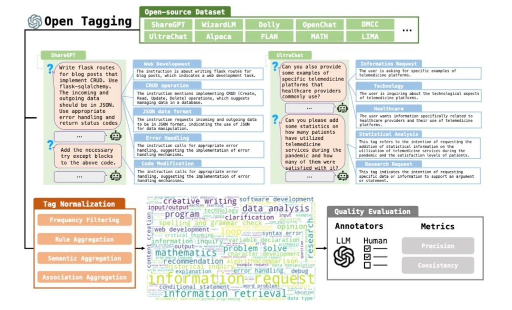

2. 模型embedding聚类方法：通过模型最后一层的embedding对prompt进行表示，那么通过prompt embedding的距离表示prompt的相似度，对于过于相似的prompt进行删除。著名的有Self-Evolved Diverse Data Sampling for Efficient Instruction Tuning [2]。

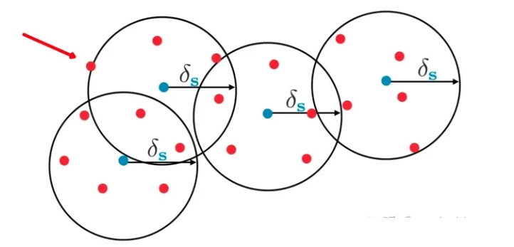
> Figure: Blue points: training data point ; Red points: novel data points to be seleted.

3. 从complexity角度，对于prompt直接进行难度的升级，所以即使在同一个语意空间的prompt也会变得diverse。比较著名的是Wizard 方法 [3]，通过GPT4进行prompt难度升级，然后构成complexity丰富的prompt。

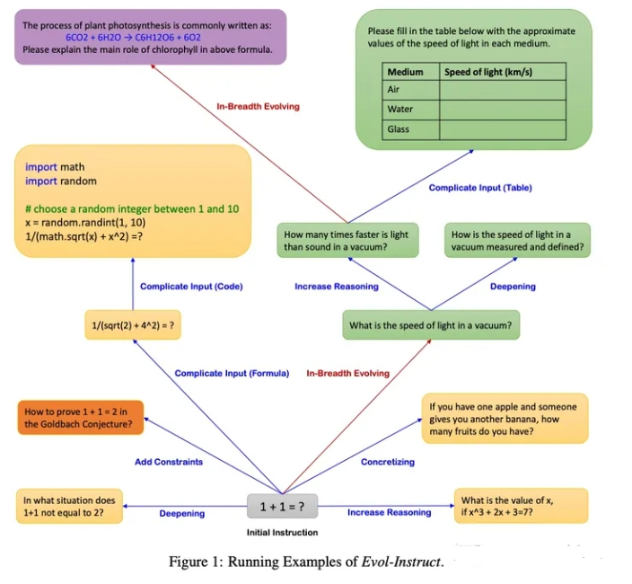

> [1] Lu K, Yuan H, Yuan Z, et al. # InsTag: Instruction Tagging for Analyzing Supervised Fine-tuning of Large Language Models[C]//The Twelfth International Conference on Learning Representations. 2023.
> 
> [2] Wu S, Lu K, Xu B, et al. Self-evolved diverse data sampling for efficient instruction tuning[J]. arXiv preprint arXiv:2311.08182, 2023.
> 
> [3] Luo Z, Xu C, Zhao P, et al. Wizardcoder: Empowering code large language models with evol-instruct[J]. arXiv preprint arXiv:2306.08568, 2023.

#### 3.2 提升sft的prompt的数据量有什么好的方法？

利用sft model和pretrain model的关系筛选模型的sft数据：

- IFD方法 [1]：利用以下公式进行数据选择： 

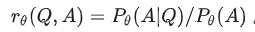

这个公式其实是计算pretrain model生成对齐后模型的answer的难度（在 prompt的condition 下生成A的概率）。这个概率越低，越说明生成难度高，那么sft模型学习到的对齐规律越多，那么我们更应该选择这个sft数据。

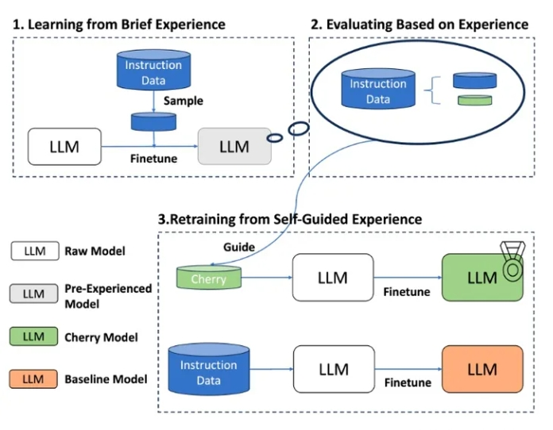

- Hybrid Method （混合了多种之前列举的指标和方法。）：例如 What MakeGood Data for Alignment? A Comprehensive Study of Automatic Data Selectionin Instruction Tuning [2] 文章，从complexity，diversity和quality三个方向对sft数据建模，训练了多个模型对各个指标维度进行分别衡量。

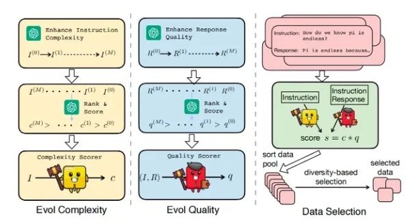

> [1] Li M, Zhang Y, Li Z, et al. From quantity to quality: Boosting llm performance with self-guided data selection for instruction tuning[J]. arXiv preprint arXiv:2308.12032, 2023.
> 
> [2] Liu W, Zeng W, He K, et al. What makes good data for alignment? a comprehensive study of automatic data selection in instruction tuning[J]. arXiv preprint arXiv:2312.15685, 2023.

## 4 领域模型Continue PreTrain 数据选取？

技术标准文档或领域相关数据是领域模型Continue PreTrain的关键。因为领域相关的网站和资讯重要性或者知识密度不如书籍和技术标准。

## 5 领域数据训练后，通用能力往往会有所下降，如何缓解模型遗忘通用能力？

- 动机：仅仅使用领域数据集进行模型训练，模型很容易出现灾难性遗忘现象.
- 解决方法：通常在领域训练的过程中加入通用数据集

那么这个比例多少比较合适呢？

目前还没有一个准确的答案。主要与领域数据量有关系，当数据量没有那么多时，一般领域数据与通用数据的比例在1:5到1:10之间是比较合适的。

## 6 领域模型Continue PreTrain ，如何 让模型在预训练过程中就学习到更多的知识？

领域模型Continue PreTrain时可以同步加入SFT数据，即MIP，Multi-Task Instruction PreTraining。

预训练过程中，可以加下游SFT的数据，可以让模型在预训练过程中就学习到更多的知识。

## 7 进行SFT操作的时候，基座模型选用Chat还是Base?

仅用SFT做领域模型时，资源有限就用在Chat模型基础上训练，资源充足就在Base模型上训练。（资源=数据+显卡）

资源充足时可以更好地拟合自己的数据，如果你只拥有小于10k数据，建议你选用Chat模型作为基座进行微调；如果你拥有100k的数据，建议你在Base模型上进行微调。

## 8 领域模型微调 指令&数据输入格式 要求？

在Chat模型上进行SFT时，请一定遵循Chat模型原有的系统指令&数据输入格式。

建议不采用全量参数训练，否则模型原始能力会遗忘较多。

## 9 领域模型微调 领域评测集 构建？

领域评测集时必要内容，建议有两份，一份选择题形式自动评测、一份开放形式人工评测。

选择题形式可以自动评测，方便模型进行初筛；开放形式人工评测比较浪费时间，可以用作精筛，并且任务形式更贴近真实场景。

## 10 领域模型词表扩增是不是有必要的？

领域词表扩增真实解决的问题是解码效率的问题，给模型效果带来的提升可能不会有很大。

## 11 如何训练自己的大模型？

如果我现在做一个sota的中文GPT大模型，会分2步走：1. 基于中文文本数据在LLaMA-65B上二次预训练; 2. 加CoT和instruction数据, 用FT + LoRA SFT。

提炼下方法，一般分为两个阶段训练：

- 第一阶段：扩充领域词表，比如金融领域词表，在海量领域文档数据上二次预训练LLaMA模型；
- 第二阶段：构造指令微调数据集，在第一阶段的预训练模型基础上做指令精调。还可以把指令微调数据集拼起来成文档格式放第一阶段里面增量预训练，让模型先理解下游任务信息。

当然，有低成本方案，因为我们有LoRA利器，第一阶段和第二阶段都可以用LoRA训练，如果不用LoRA，就全参微调，大概7B模型需要8卡A100，用了LoRA后，只需要单卡3090就可以了。

## 12 训练中文大模型有啥经验？

报告《Towards Better Instruction Following Language Models for Chinese: Investigating the Impact of Training Data and Evaluation》中，介绍了开源模型的训练和评估方法：

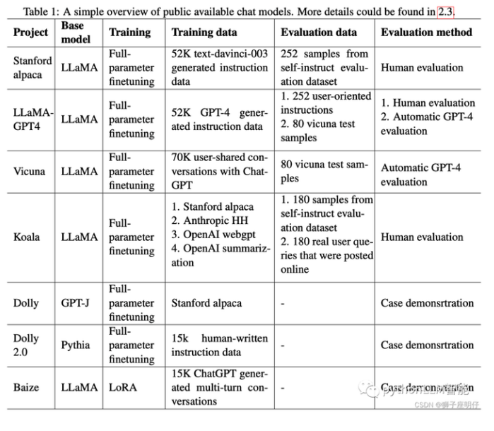

还对比了各因素的消融实验：

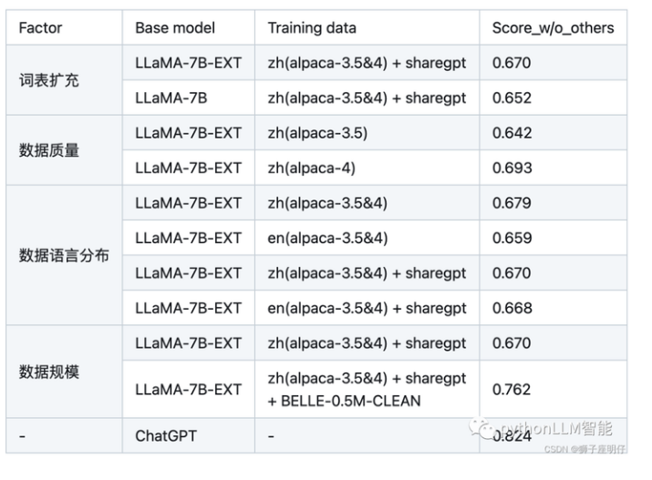

消融实验结论：

- 扩充中文词表后，可以增量模型对中文的理解能力，效果更好
- 数据质量越高越好，而且数据集质量提升可以改善模型效果
- 数据语言分布，加了中文的效果比不加的好
- 数据规模越大且质量越高，效果越好，大量高质量的微调数据集对模型效果提升最明显。解释下：数据量在训练数据量方面，数据量的增加已被证明可以显著提高性能。值得注意的是，如此巨大的改进可能部分来自belle-3.5和我们的评估数据之间的相似分布。评估数据的类别、主题和复杂性将对评估结果产生很大影响
- 扩充词表后的LLaMA-7B-EXT的评估表现达到了0.762/0.824=92%的水平

他们的技术报告证明中文大模型的训练是可行的，虽然与ChatGPT还有差距。

## 13 指令微调的好处？

有以下好处：

1. 对齐人类意图，能够理解自然语言对话（更有人情味）
2. 经过微调（fine-tuned），定制版的GPT-3在不同应用中的提升非常明显。OpenAI表示，它可以让不同应用的准确度能直接从83%提升到95%、错误率可降低50%。解小学数学题目的正确率也能提高2-4倍。（更准）

踩在巨人的肩膀上、直接在1750亿参数的大模型上微调，不少研发人员都可以不用再重头训练自己的AI模型了。（更高效）

## 14 预训练和微调哪个阶段注入知识的？

两个阶段都有知识注入，预训练阶段注入通用的知识，微调阶段注入特定领域的知识。

- 在预训练阶段，模型通过大量的无监督数据学习通用的语言知识和模式; 
- 在微调阶段，模型通过在特定任务相关的监督数据上学习特定领域的知识。

## 15 想让模型学习某个领域或行业的知识，是应该预训练还是应该微调？

可以使用预训练和微调相结合的方式，先用篇章数据进行预训练以获取广泛的知识，再用问答对数据进行微调，使模型更好的学习到特定领域的知识。

当然，GPT大模型的预训练和微调，从实现方式来讲是没有什么差别的，都是decoder only的语言模型训练并更新参数，如果样本集小，没有大量的篇章文档数据，我认为只进行微调也能注入知识的，不必太纠结预训练。而且特定领域跟预训练模型的分布差别不大，也不用二次预训练。

## 16 多轮对话任务如何微调模型？

这里列举了 ChatGLM-6B 的生成对话的例子

```s
    >>> from transformers import AutoTokenizer, AutoModel
    >>> tokenizer = AutoTokenizer.from_pretrained("THUDM/chatglm-6b", trust_remote_code=True)
    >>> model = AutoModel.from_pretrained("THUDM/chatglm-6b", trust_remote_code=True).half().cuda()
    >>> model = model.eval()
    >>> response, history = model.chat(tokenizer, "你好", history=[])
    >>> print(f"response:{response}")
    >>> print(f"history:{history}")
    response：你好👋!我是人工智能助手 ChatGLM-6B,很高兴见到你,欢迎问我任何问题。
    history：["你好", "你好👋!我是人工智能助手 ChatGLM-6B,很高兴见到你,欢迎问我任何问题。"]
```

- response 为 ChatGLM-6B 模型的 当前反馈
- history 为 ChatGLM-6B 模型的 历史记录的保存

说白了，就是 ChatGLM-6B 模型简单的把上一轮对话扔进下一轮的input里，这种方法好处是简单，缺点是随着轮数的增加，history 存储的 对话会越来越多，导致 max_length 增加，从而 出现 爆显问题。

- 解决方法：
  - 对 历史对话 做一层文本摘要，取其精华去其糟粕
  - 将 历史对话 做成一个 embedding
  - 如果是 任务型对话，可以将 用户意图 和 槽位 作为 上一轮信息 传递给 下一轮

## 17 微调后的模型出现能力劣化，灾难性遗忘是怎么回事？

所谓的**灾难性遗忘**：即学习了新的知识之后，几乎彻底遗忘掉之前习得的内容。这在微调ChatGLM-6B模型时，有同学提出来的问题，表现为原始ChatGLM-6B模型在知识问答如“失眠怎么办”的回答上是正确的，但引入特定任务（如拼写纠错CSC）数据集微调后，再让模型预测“失眠怎么办”的结果就答非所问了。

我理解ChatGLM-6B模型是走完 “预训练-SFT-RLHF” 过程训练后的模型，其SFT阶段已经有上千指令微调任务训练过，现在我们只是新增了一类指令数据，相对大模型而已，微调数据量少和微调任务类型单一，不会对其原有的能力造成大的影响，所以我认为是不会导致灾难性遗忘问题，我自己微调模型也没出现此问题。

应该是微调训练参数调整导致的，微调初始学习率不要设置太高，lr=2e-5或者更小，可以避免此问题，不要大于预训练时的学习率。

## 18 微调模型需要多大显存？

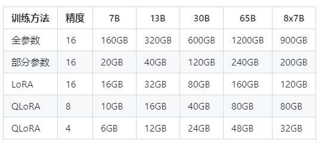

## 19 大模型LLM进行SFT操作的时候在学习什么？

（1）预训练->在大量无监督数据上进行预训练，得到基础模型-->将预训练模型作为SFT和RLHF的起点。

(2) SFT-->在有监督的数据集上进行SFT训练，利用上下文信息等监督信号进一步优化模型-->将SFT训练后的模型作为RLHF的起点。

(3) RLHF-->利用人类反馈进行强化学习，优化模型以更好地适应人类意图和偏好-->将RLHF训练后的模型进行评估和验证，并进行必要的调整。

## 20 预训练和SFT操作有什么不同

下面使用一个具体的例子进行说明。

```s
问题：描述计算机主板的功能
回答：计算机主板是计算机中的主要电路板。它是系统的支撑。
```

进行预训练的时候会把这句话连接起来，用前面的词来预测后面出现的词。在计算损失的时候，问句中的损失也会被计算进去。

进行SFT操作则会构建下面这样一条训练语料。

```s
输入：描述计算机主板的功能[BOS]计算机主板是计算机中的主要电路板。它是系统的支撑。[EOS]
标签：[......][BOS]计算机主板是计算机中的主要电路板。它是系统的支撑。[EOS]
```

其中[BOS]和[EOS]是一些特殊字符，在计算损失时，只计算答句的损失。在多轮对话中，也是一样的，所有的问句损失都会被忽略，而只计算答句的损失。

因此SFT的逻辑和原来的预训练过程是一致的，但是通过构造一些人工的高质量问答语料，可以高效地教会大模型问答的技巧。

## 21 样本量规模增大，训练出现OOM错

- 问题描述：模型训练的样本数量从10万，增大300万，训练任务直接报OOM了。
- 解决方案，对数据并行处理，具体实现参考海量数据高效训练，核心思想自定义数据集本次的主要目标是使向量化耗时随着处理进程的增加线性下降，训练时数据的内存占用只和数据分段大小有关，可以根据数据特点，灵活配置化。核心功能分为以下几点:
  - 均分完整数据集到所有进程（总的GPU卡数）
  - 每个epoch训练时整体数据分片shuffle一次，在每个进程同一时间只加载单个分段大小数据集
  - 重新训练时可以直接加载向量化后的数据。

## 22 大模型LLM进行SFT 如何对样本进行优化？

- 对于输入历史对话数据进行左截断，保留最新的对话记录。
- 去掉样本中明显的语气词，如嗯嗯，啊啊之类的。
- 去掉样本中不合适的内容，如AI直卖，就不应出现转人工的对话内容。
- 样本中扩充用户特征标签，如年龄，性别，地域，人群等

## 23 模型参数迭代实验

验证历史对话轮次是否越长越好，通过训练两个模型，控制变量max_source_length｜max_target_length，对训练好之后的模型从Loss、Bleu指标、离线人工评估等角度进行对比分析。

结论：从人工评估少量样本以及loss下降来看，历史对话长度1024比512长度好，后续如果训练可能上线模型，可以扩大到1024长度。

## 24 微调大模型的一些建议

- 模型结构:
  - 模型结构+训练目标: Causal Decoder + LM。有很好的zero-shot和few-shot能力，涌现效应
  - layer normalization: 使用Pre RMS Norm
  - 激活函数: 使用GeGLU或SwiGLU
  - embedding层后不添加layer normalization，否则会影响LLM的性能
  - 位置编码: 使用ROPE或ALiBi。ROPE应用更广泛
  - 去除偏置项:去除dense层和layer norm的偏置项，有助于提升稳定性
- 训练配置:
  - batch: 选用很大的batch size; 动态地增加batch size的策略，GPT3逐渐从32K增加到3.2M tokens。
  - 学习率调度:先warmup再衰减。学习率先线性增长，再余弦衰减到最大值的10%。最大值一般在5e-5到1e-4之间。
  - 梯度裁剪:通常将梯度裁剪为1.0。
  - 权重衰减: 采用AdamW优化器，权重衰减系数设置为0.1Adamw相当于Adam加了一个L2正则项
  - 混合精度训练:采用bfloat16，而不是foat16来训练。
- 训练崩溃挽救:
  - 选择一个好的断点，跳过训练崩溃的数据段，进行断点重训。选择一个好的断点的标准: 损失标度lossscale>0;梯度的L2范数<一定值 && 波动小

## 25 微调大模型时，如果 batch size 设置太小 会出现什么问题？

**当 batch size 较小时，更新方向（即对真实梯度的近似）会具有很高的方差，导致的梯度更新主要是噪声**。经过一些更新后，方差会相互抵消，总体上推动模型朝着正确的方向前进，但个别更新可能不太有用，可以一次性应用（使用更大 batch size 进行更新）。

## 26 微调大模型时，如果 batch size 设置太大 会出现什么问题？

**当 batch size 非常大时，我们从训练数据中抽样的任何两组数据都会非常相似（因为它们几乎完全匹配真实梯度）**。因此，在这种情况下，增加 batch size 几乎不会改善性能，因为你无法改进真实的梯度预测。换句话说，你需要在每一步中处理更多的数据，但并不能减少整个训练过程中的步数，这表明总体训练时间几乎没有改善。但是更糟糕的是你增加了总体的 FLOPS。

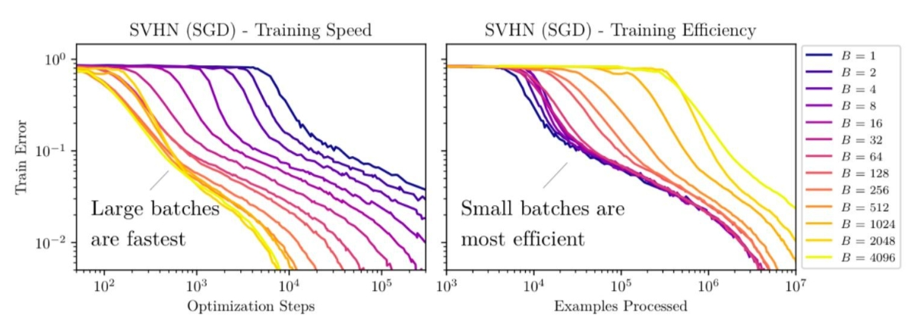

通过观察这些线性图，我们可以发现使用更大的 batch size 通常需要较少的训练 step。然而，这将相应地增加需要处理的数据。当 batch size 从 2048 翻倍时，达到同样性能所需要的 step 几乎没有任何改善，但你需要花费两倍的计算资源。Google 的经验研究也有类似的观察，即在在固定的 epoch budget 下，当 batch size 达到临界值时，模型的性能会 batch size 的增加而降低。可以如下说明：

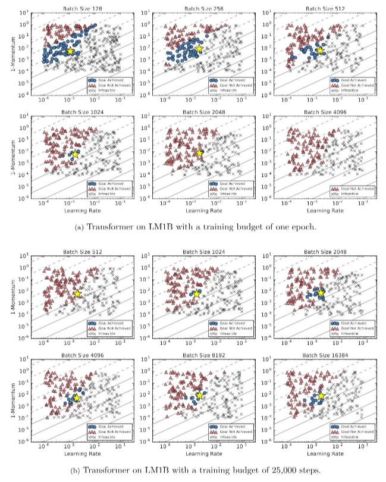

## 27 微调大模型时, batch size 如何设置问题？

各种结果表明似乎存在着一个关于数据并行程度的临界点，通过找到这个临界点，我们可以有效的平衡训练的效率和模型的最终效果。

OpenAI 发现最优步长:

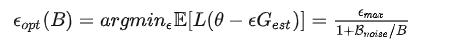

> 注：B 为 batch size，$B_{noise}$ 为 噪声尺度

在采用最优 step size 时，从含有噪声的梯度中获得的损失的最优改进现在变为：

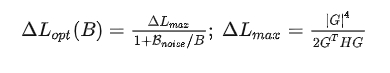

从这些公式中我们可以得出两个结论：

1. 无论我们如何准确地估计真实梯度，总存在一个最大步长
2. 批处理大小越大，我们优化模型的步长就越大（有一个上限）

左侧的图表说明了为什么使用更大的批次模型可以取得更多提升。但是当 batch size 太大时，我们会遇到收益递减的问题（因为分母中的 1 开始占主导地位）。但是需要注意的事，这仅在学习率调整良好的情况下有效。因此，OpenAI 建议将学习率调整到一个相对接近最优值的数值是理论能有效的前提。

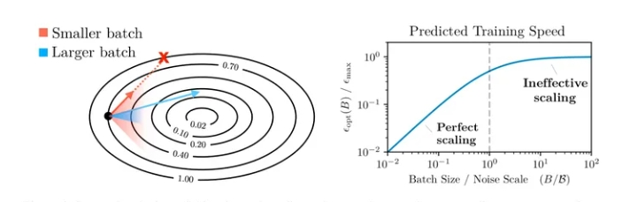

在进行一些其他数学计算后，OpenAI 发现噪声尺度可以通过以下方式估计：

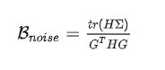

其中，H 是参数的真实 Hessian 矩阵，C 是相对于梯度的每个示例的协方差矩阵，g 是真实梯度。为了进一步简化这个方程，OpenAI作出了一个（不切实际的）假设，即优化是完全 well-conditioned 的。在这种情况下，Hessian 矩阵只是单位矩阵的倍数，噪声尺度简化就可以简化为以下形式：

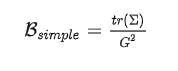

他们经验上发现结果相当接近。该方程表明噪声尺度等于个别梯度分量的方差之和，除以梯度的 norm。OpenAI 使用以上结论在后续的 scaling law 工作中预测了模型的最优 batch size 大小。

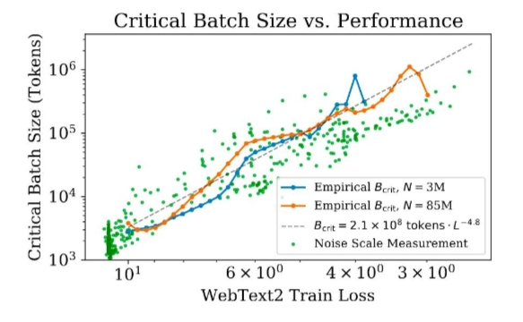

- Learning rate as temperature

前面的结论有提到一个前提，就是模型的 LR 是调的比较好的。这是因为 OpenAI 发现噪声尺度基本符合以下规律

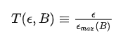

在使用 SGD 和小 batch 进行更新时，可以大概近似为

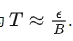

这表明

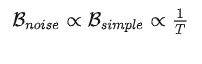

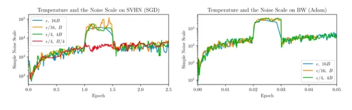

从以上内容，我们可以得知:

1. 高温度导致较小的噪声尺度。其中的直觉是在高温度下，相对于方差，梯度幅度较大。
2. 当学习率以一个常数因子衰减时，噪声尺度大致以相同的因子增长。因此，如果学习率太小，噪声尺度将被放大。

## 28 微调大模型时, 优化器如何？

除了Adam和AdamW，其他优化器如Sophia也值得研究，它使用梯度曲率而非方差进行归一化，可能提高训练效率和模型性能。

## 29 哪些因素会影响内存使用？

内存使用受到模型大小、批量大小、LoRA参数数量以及数据集特性的影响。例如，使用较短的训练序列可以节省内存。

## 30 进行领域大模型预训练应用哪些数据集比较好？

通过分析发现现有的开源大模型进行预训练的过程中会加入书籍、论文等数据。主要是因为这些数据的数据质量较高，领域相关性比较强，知识覆盖率（密度）较大，可以让模型更适应考试。给我们自己进行大模型预训练的时候提供了一个参考。同时领域相关的网站内容、新闻内容也是比较重要的数据。

## 31 用于大模型微调的数据集如何构建？

进行大模型微调时，数据是比较重要的，数据的高度决定模型效果的高度，因此数据的质量重要性大于数据的数量的重要性，因此对于构建微调数据时的几点建议如下所示：

1. 选取的训练数据要干净、并具有代表性。
2. 构建的prompt尽量多样化，提高模型的鲁棒性。
3. 进行多任务同时进行训练的时候，要尽量使各个任务的数据量平衡。

## 32 大模型训练loss突刺原因和解决办法

> 参考：A Theory on Adam Instability in Large-Scale Machine Learning 

### 32.1 大模型训练loss突刺是什么？

loss spike指的是预训练过程中，尤其容易在大模型（100B以上）预训练过程中出现的loss突然暴涨的情况

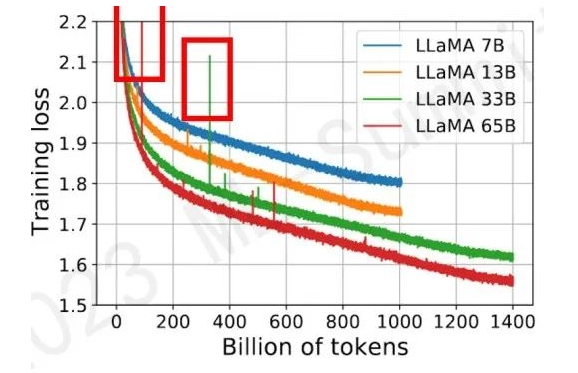

如图所示模型训练过程中红框中突然上涨的loss尖峰 loss spike的现象会导致一系列的问题发生，譬如模型需要很长时间才能再次回到spike之前的状态（论文中称为pre-explosion），或者更严重的就是loss再也无法drop back down，即模型再也无法收敛

PaLM和GLM130b之前的解决办法是找到loss spike之前最近的checkpoint，更换之后的训练样本来避免loss spike的出现。

### 32.2 为什么大模型训练会出现loss突刺？

大模型训练使用的Adam优化器 会导致 loss突刺。

首先回顾一下Adam优化器的结构（这里介绍的是较为传统的Adam优化器，现在nlp任务更偏向于使用带有正则化项的Adamw变体）：

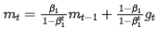

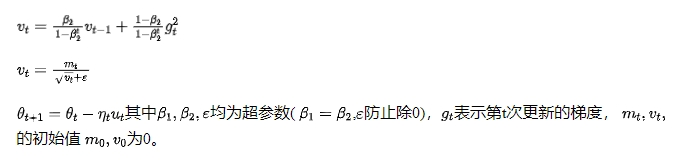

首先对Adam的有效性做了论述，其本质在于证明了Adam优化过程是对牛顿下降法（二阶导）的一个有效逼近，因此在收敛速度上大幅度领先传统SGD(一阶导)，证明过程不做赘述，可以参考本文和Adam系列相关论文

Adam算法是牛顿下降法的一个迭代逼近 

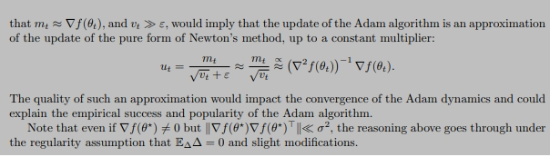

一切显得十分完美，但是理想很丰满，现实很骨感，收敛过程并不是一帆风顺的

首先我们想象一下 ut 这个更新参数 的变化趋势

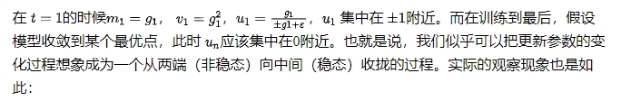

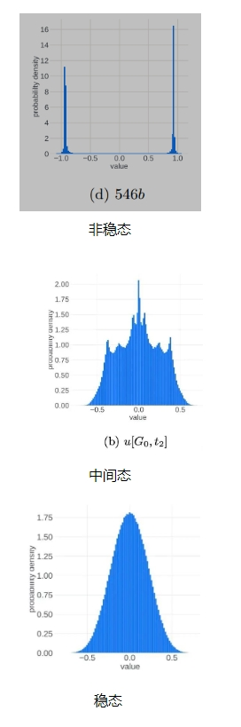

进入正态分布的稳态之后，理想的更新参数变化趋势应该是方差越来越小，所有更新参数逐渐向0靠近。这应该是一个单向的过程，即稳定的单峰状态（unimodal）不会再次进入非稳定的双峰状态(bimodal)，但事实并非如此，更新参数会再次进入非稳定的双峰状态

本文在理论层面做了研究和解释，从中心极限定理（可以结合道尔顿板实验理解）出发，认为随机事件的叠加进入单峰的正态分布的必要条件之一是各个随机事件事件之间应该是相互独立的，但是梯度变化以及更新参数的变化并不能特别好的满足独立性这一条件，而这一点恰恰是导致更新参数振荡，loss spike出现以及loss 不收敛的重要原因之一

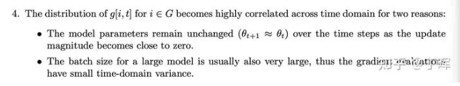

造成梯度变化不独立的原因（1、浅层参数长时间不更新2、batch太大，后期梯度更新趋于平稳） 上述的理论有些晦涩，本文作者可能也了解这一点，之后开始直接点题，结合实验观察抛出了重要现象和结论

即训练过程中loss spike的出现与：梯度更新幅度，e 大小，batch大小这三个条件密切相关

本文作者对loss spike出现时模型的前后变化做了仔细拆解，发现下列一系列连续现象的出现导致了loss spike：

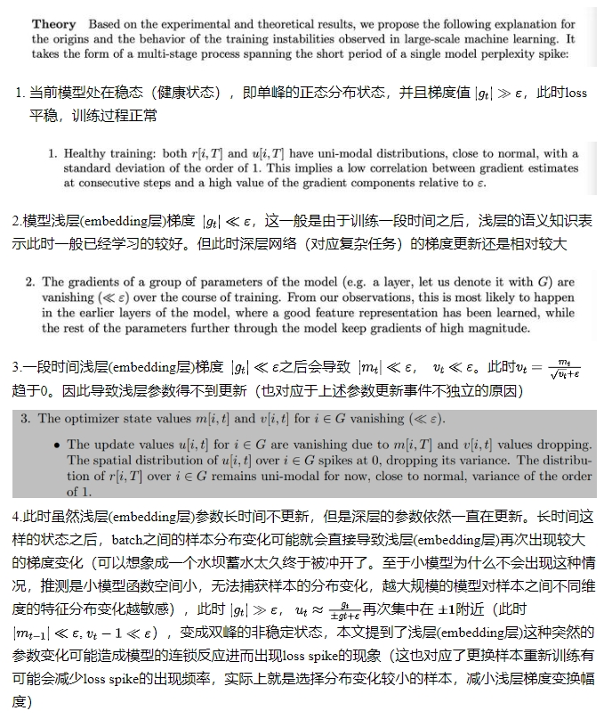

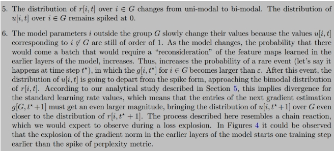

5.这个阶段模型处于非稳态，梯度变化幅度较大，每一次的梯度变化和更新参数变化事件之间又出现了一定的独立性，因此经过一定的时间之后模型有可能再次进入稳态，loss再次drop back down（注意，本文着重提了这个再次drop back down并不是一定出现的，也很有可能loss长期处于flat状态，再也无法收敛）

因此我们得出一些结论，loss spike的出现和浅层的梯度更新幅度，e 大小密切相关（batch大小带来的相关性问题倒是显得没那么大说服力），实际上就是浅层网络参数突然进入到了之前长时间不在的状态与模型深层参数当前的状态形成了连锁反应造成了模型进入非稳态。同时一般情况即使出现loss spike也会自动回复到正常状态，但也有可能再也不会

### 32.3 大模型训练loss突刺 如何解决？

本文最后提到了防止loss spike出现的一些方法：

1. 如之前提到的PaLM和GLM130B提到的出现loss spike后更换batch样本的方法（常规方法，但是成本比较高）
2. 减小learning rate，这是个治标不治本的办法，对更新参数的非稳态没有做改进
3. 减小 e 大小。或者直接把 e 设为0，重新定义

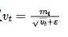

在 vt 等于 0 时候的值（这应该是个值得尝试的办法）

值得一提的是智谱华章在本文发表之前，在去年的GLM130B训练时似乎也观察到了浅层梯度变化和loss spike相关这一现象（GLM-130B: An Open Bilingual Pre-trained Model），他采取的是把浅层梯度直接乘以缩放系数 a 来减小浅层梯度更新值

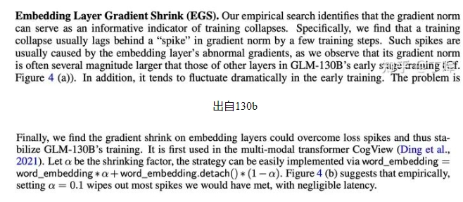

其实这块我有个自己的想法，e 和 a 是否也可以做衰减，随着训练过程逐渐减小，来避免loss spike的现象

另外假设我们能一次性加载所有样本进行训练（实际上不可能做到），是否还会出现loss spike的现象

最后目前流行的fp8，fp16混合训练，如果upscale设置的过小，导致梯度在进入优化器之前就下溢，是不是会增加浅层梯度长时间不更新的可能性，进而增加loss spike的出现的频率。（这么看来似乎提升upscale大小以及优化 e 大小是进一步提升模型效果的一个思路）

## 33 什么是Cosine优化器？在大模型中应该怎么设置cosine优化器的周期比较好？

Cosine优化器是在lr_min 到 lr_max之间按pi * epoch / T_max周期变化的优化器。下面是用代码画的Cosine优化器变化的图：

> 代码如下：
```s
import matplotlib.pyplot as plt
import numpy as np

# Parameters for the cosine annealing schedule
eta_min = 0.001  # Minimum learning rate
eta_max = 0.1    # Maximum learning rate
T_max = 50       # Number of epochs between two learning rate restarts
num_epochs = 100 # Total number of epochs

# Cosine Annealing Schedule
def cosine_annealing(epoch):
    return eta_min + (eta_max - eta_min) * (1 + np.cos(np.pi * epoch / T_max)) / 2

# Generate learning rate for each epoch
lr_each_epoch = [cosine_annealing(epoch % T_max) for epoch in range(num_epochs)]

# Plotting
plt.figure(figsize=(10, 6))
plt.plot(lr_each_epoch, label='Cosine Annealing LR')
plt.xlabel('Epoch')
plt.ylabel('Learning Rate')
plt.title('Cosine Annealing Learning Rate Schedule')
plt.legend()
plt.grid(True)
plt.show()
```

> 图像为：

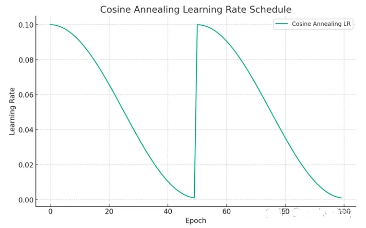

在大模型中，一般把T_max设置为最长epoch可以取得最大收益，具体可以参考：

> 文章名称： MiniCPM：揭示端侧大语言模型的无限潜力
> 
> 文章地址：https://shengdinghu.notion.site/MiniCPM-c805a17c5c8046398914e47f0542095a

> 图像展示为：

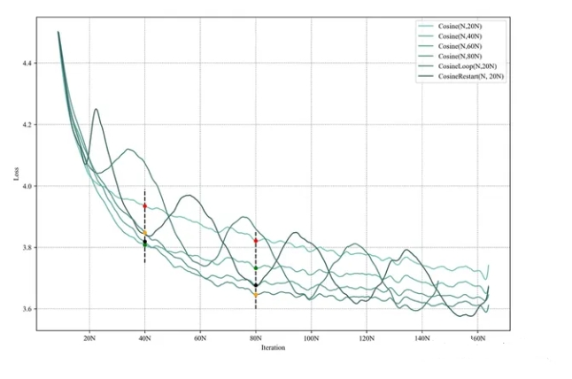
> 根据模型设计不同cosine参数跑出的结果

当T_max = 80N时，在80N epoch可以达到最低点，但如果设置为T_max=20N，80Nepoch达不到最低点，可以看图上黄色点和黑色点在80N epoch的比较。

## 34 在预训练阶段，若模型训练文本时不包含<CLS>标记，而在后续预测阶段却添加了<CLS>标记；或者相反，训练阶段加入了<CLS>标记，但在预测时却没有使用，这两种情况下 benchmark 预测可能会遇到哪些问题呢？

这种情况会导致模型预测性能的潜在问题：

1. 若训练时不使用<CLS>标记，而在预测阶段加入，模型可能并未学习到如何利用<CLS>标记整合整个句子信息，从而可能导致模型对整体句义理解不足，影响最终预测结果的质量和准确性。
2. 若训练时使用了<CLS>标记作为句子表示的聚合点，而在预测时忽略该标记，模型将无法有效提取和利用预训练阶段所学到的全局上下文信息，同样可能降低预测效果。

## 35 SFT packing是什么？

SFT packing指的是在训练sft的过程中，将多个sft数据pack到一个样本内进行训练的方式，这种方式会加快模型训练速度，原因是如果不进行SFT packing，那么对于短文本sft，需要padding到一个batch的最长长度，那么会浪费很多计算token。

SFT packing其实有很多种类，比如block diagonal attention，也就是每个token仅仅去attention自己的问题内的token。但一般业务中会直接将其相连接，然后进行预测，虽然这样会引入一些噪音，但好像相对于非sft packing方式的整体的效果损失不大。这个可能是因为pretrain的时候模型也是这么训练的。

## 36 SFT packing对SFT训练的影响是什么？

：SFT packing以后其实是削弱了模型对难的短query和短答案的拟合。在无sft packing得情况下，假设batch_size = 1，那么如果有个短query和短答案在这个batch里，其余补充padding，那么这个batch的gradient全是这个短文本的gradient，模型对这个query的拟合能力会变强。但是如果SFT packing以后，多个短文本在一个样本中，这个batch的gradient会被稀释，短文本的拟合就不会特别强。但拟合能力似乎和泛化不可以挂钩，我们初步观察sft packing和non sft packing的效果差不了很多。

> 补充, 今天review了一下之前实验，在数据量小，或者特定困难的数据上，sft packing是有损泛化效果的，但在大批量数据上是无损泛化效果的。除此之外经群友补充，non-packing的方式会影响模型续写的效果，因此会影响一些benchmark效果。

## 37 SFT阶段模型可以学习新知识么？

虽然理论上可以，但很少，且不推荐sft阶段去学习知识。在LIMA原文中就表述过同样一个假设：

> Superficial alignment hypothesis
> 
> A model’s knowledge and capabilities are learnt almost entirely during pretraining, while alignment teaches it which subdistribution of formats should be used when interacting with users. If this hypothesis is correct, and alignment is largely about learning style, then a corollary of the Superficial Alignment Hypothesis is that one could sufficiently tune a pretrained language model with a rather small set of examples.

我个人认为这个假设是合理的，sft阶段更多是将模型的能力和人类对齐，而不过多学习新的知识。原因如下：

- sft相对于pretrain过的数据量实在太小，模型的知识学习的概率就很低。
- 如果加大sft的数据量和pretrain数据相当，那么sft有一些特定的格式，以及一些system prompt需要重复当作context进行attention，这些重复的context势必会影响模型原始的attention模式，从而影响模型的效果。

最后，如果希望sft学习新知识，不如把这部分sft的新知识组织好放入pre-train or post-train阶段更为合适。

## 38 建立sft数据主要需要关注什么方面？

在Lima中给予了两个重要的点：

1. Prompt的diversity：丰富多样的prompt数据，可以让模型更多的了解人类的指令，包括指令的意思，复杂指令中每一步的含义。Prompt的丰富程度决定了模型指令遵循的能力。
2. Answer的质量：Answer的质量包括内容和格式两方面，一方面内容的正确性需要得到保证，一方面内容的格式也很重要，细节丰富，逻辑缜密的answer可以激发模型更多的回答能力。

> 补充：SFT阶段不能太多的知识注入：过多的知识注入，或者超过模型能力本身的回答过多会导致对齐税，这是OpenAI的blog也曾经提到的，这就是我为什么不建议模型过多在SFT阶段学习知识，会影响其学习指令遵循的能力。

## 40 解决显存不够的方法？

- **模型剪枝**: 移除不重要的参数或层以减少模型大小。
- **混合精度训练**: 使用浮点16(FP16)而不是浮点32(FP32)进行训练，减少内存使用。
- **梯度累积**: 分批处理较大的批量，累积梯度后再更新，减少每次迭代的内存需求。
- **模型并行和数据并行**: 在多个设备上分布模型的不同部分或数据，以减轻单个设备的负担。

## 41 指令策略的选择及其影响

在指令微调中，选择最佳的指令策略意味着找到最有效地向模型传递任务需求和上下文信息的方式。

**指令策略包括指令的编写风格、结构和内容的丰富度等**。优质的指令可以显著提高模型的理解能力和任务性能，而不恰当的指令可能会导致模型混淆或性能下降。多实验和多迭代才能找到最优的指令策略。

## 42 如何解决prompt泛化性？

提高prompt泛化性，即让预训练的语言模型(如GPT-3、BERT等)在面对各种不同的prompt时都能产生准确和有用的输出，是一个重要的研究课题。

以下是一些策略和方法来解决prompt泛化性问题:

- 设计更加通用的Prompt模板:Prompt模板是将原始输入转换为类似完形填空的格式，让语言模型去回答。可以设计更加通用的Prompt模板，使其适用于多个任务和数据集。这样可以减少对特定任务的依赖，提高模型在新任务上的表现。
- 引入多样性的Prompt:可以引入多样性的Prompt，通过在训练数据中引入不同的Prompt变体，可以让模型学习到更多的语言模式和任务特征，从而提高泛化能力。
- 多任务学习:多任务学习是指在一个模型中同时学习多个相关任务。通过在训练过程中引入多个任务，可以提高模型对不同任务的泛化能力。可以将Prompt Learning与多任务学习结合起来，通过共享模型参数和训练数据，提高模型在不同任务上的表现。
- 数据增强:数据增强是一种通过对原始数据进行变换和扩充来增加训练数据量和多样性的方法。可以通过对Prompt数据进行增强，如添加噪声、替换词语、改变句子结构等，来提高模型对不同输入的泛化能力。

## 43 大模型SFT最重要的是什么，分次SFT会发生什么?

在大型模型的监督式微调(Supervised Fine-Tuning，简称SFT)中，最重要的几个方面包括：

- **高质量的训练数据:对于SFT来说，拥有高质量、代表性强的训练数据是至关重要的**。这些数据应该能够覆盖模型将要处理的各种情况，以便模型能够学习到有效的特征和模式。
- **任务相关的微调**: 微调应该针对特定的任务进行，这意味着微调的数据集应该与实际应用场景紧密相关。这样可以确保模型在特定任务上的性能得到显著提升。
- **避免过拟合**: 在微调大型模型时，过拟合是一个常见的问题。为了防止过拟合，可以采用正则化技术、数据增强或使用早停(early stopping)策略。
- **资源和计算效率**: 大型模型的微调通常需要大量的计算资源。因此，优化微调过程以提高资源和计算效率是非常重要的，这可能涉及到批处理大小的选择、学习率调度等。
- **模型的泛化能力**: 微调后的模型应保持良好的泛化能力，这意味着它不仅在训练数据上表现良好，也能在新的、未见过的数据上做出准确的预测。

分次SFT(逐步微调)可能会带来以下影响:

- **逐步改进**: 分次微调允许模型逐步学习，每一步都在前一步的基础上进行改进。这种方法可以帮助模型更好地适应复杂的任务，并且可以逐步解决可能出现的问题。
- 灵**活性和控制**: 分次微调提供了更多的灵活性，允许研究人员根据中间结果调整策略。例如，如果在第一次微调后性能没有显著提升，可以分析原因并调整后续微调的策略。
- **风险降低**: 与一次性微调整个模型相比，分次微调可以降低失败的风险。如果在某个阶段出现问题，可以更容易地诊断和修复，而不会影响整个模型。
- **资源管理**: 分次微调可以根据可用资源进行计划和调度，使得资源利用更加高效。例如，可以先对模型的一部分进行微调，然后在资源允许的情况下再进行其他部分的微调。
- **细粒度的优化**: 分次微调允许对模型的不同部分进行细粒度的优化。这对于那些模型结构复杂、任务需求多样化的情况特别有用。

大模型的SFT最重要的是确保训练数据的质量和相关性，防止过拟合，并提高资源和计算效率。分次SFT可以提供逐步改进和灵活性等优势。

## 44 大模型 supervised fine-tuning(SFT)的方法主要分为哪些?

大模型的SFT主要可以分为以下几种方法:

- **全参数微调**: 这种方法涉及到使用特定任务的标注数据集对预训练模型的所有参数进行微调。这通常在模型需要对特定任务进行深度定制时使用，但由于需要大量的标注数据和计算资源，因此在资源有限的情况下可能不切实际。
- **迁移学习**: 在迁移学习中，通常会固定预训练模型的一部分参数，只对模型的最后几层进行微调。这种方法可以利用预训练模型在大规模数据集上学到的通用知识，同时通过微调来适应特定任务。
- **层次微调**: 与迁移学习类似，层次微调也是只更新模型的一部分参数，但是它更加灵活，可以选择性地微调模型的某些层。这种方法可以根据任务的复杂性和数据集的大小来调整微调的深度。
- **多任务学习**: 在多任务学习中，模型会在多个相关任务上同时进行训练，目的是让模型学会在不同任务之间共享知识。这种方法可以提高模型的泛化能力，并可能提高在特定任务上的性能。
- **知识蒸馏**: 知识蒸馏是一种模型压缩技术，其中一个大型的、复杂的教师模型的知识被转移到一个小型的、更高效的学生模型中。在SFT中，可以使用知识蒸馏来微调一个小型模型，使其性能接近于大型模型。
- **强化学习微调(RLHF)**: RLHF是一种相对较新的微调方法，它结合了强化学习和人类反馈。在这种方法中，模型通过与人类交互来学习任务特定的知识，而不是依赖于大量的标注数据。

## 致谢

- 大 Batch 训练 LLM 探索 https://zhuanlan.zhihu.com/p/666997679
- 大模型训练loss突刺原因和解决办法  https://mp.weixin.qq.com/s/CYJLxux34V8mj35CH5Yfbw
- 大模型的面试题系列-4 https://zhuanlan.zhihu.com/p/685354437
- 大模型的面试题系列-5  https://zhuanlan.zhihu.com/p/685556275
- 大模型的面试题系列-10 https://zhuanlan.zhihu.com/p/686562499
- 大模型的面试题系列-11 https://zhuanlan.zhihu.com/p/686564085
- 大模型的面试题系列-16 https://zhuanlan.zhihu.com/p/687347727
- 大模型的面试题系列-17 https://zhuanlan.zhihu.com/p/687474341
- 大模型的面试题系列-18 https://zhuanlan.zhihu.com/p/687799662
- 大模型的面试题系列-19 https://zhuanlan.zhihu.com/p/688032507
 
