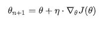
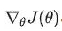
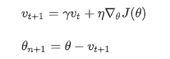
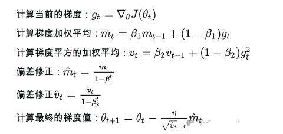

# SFT Trick 篇

- [SFT Trick 篇](#sft-trick-篇)
  - [一、常见 SFT的开发流程是如何的？](#一常见-sft的开发流程是如何的)
  - [二、训练数据要注重什么？](#二训练数据要注重什么)
  - [三、大 size 和小 size 模型的选择？](#三大-size-和小-size-模型的选择)
  - [四、多任务训练时怎么确保每个任务都优秀？](#四多任务训练时怎么确保每个任务都优秀)
  - [五、SFT真的不能学到知识？](#五sft真的不能学到知识)
  - [六、怎么科学挑选数据集？](#六怎么科学挑选数据集)
  - [七、怎么解决幻觉问题](#七怎么解决幻觉问题)
  - [八、BERT 开发与 LLM 开发有什么不同之处？](#八bert-开发与-llm-开发有什么不同之处)
  - [九、该选什么微调方法， Full tuning\\P-tuning\\Lora?](#九该选什么微调方法-full-tuningp-tuninglora)
  - [十、SFT 还有什么方面值得研究？](#十sft-还有什么方面值得研究)
  - [十一、介绍一下训练过程中，显存占用分析？](#十一介绍一下训练过程中显存占用分析)
  - [十二、介绍一下训练过程中，显存占用分析？](#十二介绍一下训练过程中显存占用分析)
  - [十三、训练数据数据质量评估](#十三训练数据数据质量评估)
  - [十四、SFT 调参技巧](#十四sft-调参技巧)
    - [14.1 有哪些参数可以调呢?](#141-有哪些参数可以调呢)
    - [14.2 Loss function 如何调参？](#142-loss-function-如何调参)
    - [14.3 Learning rate 和 Batch size 如何调参？](#143-learning-rate-和-batch-size-如何调参)
    - [14.4 Epoch number 和 early stopping 如何调参？](#144-epoch-number-和-early-stopping-如何调参)
    - [14.5 Optimizer 如何调参？](#145-optimizer-如何调参)
    - [14.6 Activation function 如何调参？](#146-activation-function-如何调参)
    - [14.7 Weights initialization 如何调参？](#147-weights-initialization-如何调参)
    - [14.8 Regularization 如何调参？](#148-regularization-如何调参)
  - [致谢](#致谢)

## 一、常见 SFT的开发流程是如何的？

- 第一步，根据业务场景调整提示词（prompt）：业务团队会提供具体场景，或者给出他们编写的prompt，也可能只提供场景和数据，需要算法工程师自行编写。编写优秀的 prompt 对发挥模型的最大性能至关重要，一个出色的 prompt 可能将性能提升至80分以上直接得到业务要求，而一个普通的prompt可能只能得到50分。这里可以参考 OpenAI 和 文心一言 的相关教程。这里也介绍一些个人的经验：
  - 越详细越好，给到的定义越细越好：例如多标签分类分类，不同的标签起码要有 1-2 句标签定义，你会发现大 size 的模型是十分遵循你的标签定义的，写得越详细越贴近业务，效果越好。
  - 不要让模型理解任何歧义，如现在你输入是好几篇微博，你应该输入“微博 1： {微博 1 的内容}\n微博 2:{微博 2 的内容}…微博 n：{微博 n 的内容}”，通过一个明确的前缀让模型知道输入的是不同的微博，而不只是简单用换行符把不同的微博内容进行拼接。
  - 遵循System message，Input，Instruction 三段式：这样输出的结果格式和效果会较为稳定。
  - 通过模型输出的解析调整 prompt：现在的模型除了输出答案，还会输出解析理由，通过浏览模型判断错误的例子模型是怎么解释的，从而反馈到调整 prompt，看看是不是prompt 里的定义没说清楚。
- 第二步，尝试闭源和开源，并进行对比：prompt 调整至差不多了，可以尝试使用不同的开源模型，如 Llama2 、 Qwen 、 Baichuan 等。实测下来，确实不同的开源模型擅长点不一样。如果开源模型效果不佳。这时考虑闭源模型，如Chatgpt4、 Kimi 、 Qwen-max… ，以评估这闭源领先的 LLM 是否能解决这类场景问题，这一步工程师也要积累经验，对闭源和开源的效果差距要熟悉。若业务接受闭源模型的效果和成本，则直接调 API 就好。若不接受，则需转向微调闭源模型。
- 第三步，认真准备数据集：选定最佳闭源模型后，精选数据集，通常每个子任务的数据量不应超过1K条，数据集必须包含任务的边界样本和困难样本，并确保数据的多样性和标签的平衡。
- 第四步，上线迭代：最后，进行训练、上线和持续的迭代优化，以确保模型性能不断提升并满足业务需求。

## 二、训练数据要注重什么？

- 确保回答格式和风格的统一，如大家看 gpt4 的回答风格就是先复述理解问题，再回答，再总结，这就是一个格式的统一。经验是，训练数据的格式和风格越统一，越能最大限度地发挥模型在具体任务的效果上限。这在 LIMA、YI、 Reformatted Alignment 的论文中都有提到。
- 数据集既要包含难也要包含易：数据集应同时包含容易错的 “Difficult” 边界数据，但也要包含常规的 “Easy” 数据，以确保模型能够处理各种难度级别的样本。
- 注意任务的多样性和标签的平衡。例如，若两个任务难度相当，但任务1的数据占比远大于任务2，那么微调后的模型在处理任务2时可能表现不佳。
- 避免引入模型在预训练阶段未接触过的知识：以减少模型产生幻觉的风险。

## 三、大 size 和小 size 模型的选择？

在效率和资源都达标和到位的情况上，优先用大 size 的模型进行实验和微调，因为大 size 的模型在容错性上比小 size 的好太多。尽管大尺寸模型也可能存在多任务不稳定、标签不平衡等问题，但其表现通常会比小尺寸模型更为稳定。因此，选用大尺寸模型其实是节省了人力成本，避免了很多之后可能会遇到的各种坑。

## 四、多任务训练时怎么确保每个任务都优秀？

很尴尬的是，目前实践下来，任务的相互影响是一个普遍现象，例如

- 训练集中包含四个任务，现在针对任务1补充了大量 bad cases 后重新训练，这种调整很可能会对其他任务产生或正或负的影响。
- 训练集本身存在的任务数据不平衡也是一个不可忽视的问题，某个任务占比大，那其它占比小的任务大概率效果也是不稳定的。

阿里巴巴的一篇研究深入探讨了这一现象。

有两种方法应对这种挑战：

- 不同任务独立训练模型：针对每个任务单独训练一个模型。当某个任务至关重要，且要求性能指标高度稳定时，这是不得不采用的方法。
- 任务取舍与额外训练：例如，在四个任务中，若其中两个任务尤为重要，可以在全部任务训练完毕后，对这两个关键任务额外训练多一个 epoch。这种做法能最大程度地确保重要任务的效果。

## 五、SFT真的不能学到知识？

很遗憾的说，经过一年的实践和普遍的认知。常识和世界知识难以通过 SFT 灌输给模型。

SFT更应该关注激发模型在预训练中已学到的知识、让模型学习业务所需要的特定规则、以及输出格式稳定。

那么，何为常识和世界知识？例如，“2023年NBA总冠军是掘金”便属于世界知识。如果 LLM 的训练数据仅更新至2022年，那么它自然无法得知这一信息。

即便你的SFT数据中包含 “谁是2023年NBA总冠军？答案是掘金” 这样的问答对，训练后的模型可能只能回答这个语序的问题，而无法举一反三。比如，当你问“掘金在哪一年获得了NBA总冠军？”时，它无法回答“2023年”。

这种举一反三的能力需要模型在预训练阶段就接触过“2023年NBA总冠军是掘金”这类知识的多种不同文本表达，如这条知识在预训练文本中出现在不同的表述中（主动句、被动句、出现在新闻语料、出现在聊天对话语料等等等等）。因此，从这个角度看，SFT并不能学得常识、世界知识。类似的研究可以看看这几篇论文：

1. https://arxiv.org/abs/2309.14316
2. http://arxiv.org/abs/2309.14402

但这并不意味着我们应该放弃SFT。相反，我们应当关注SFT在以下方面：

- 激发预训练知识：虽然SFT不能直接学的新知识，但需要靠它激发模型在预训练中已学到的知识。
- 学习业务逻辑：SFT能够教导模型特定的业务规则，如让他习得“歌词中的品牌并非实指品牌”。
- 稳定格式输出：通过SFT，我们可以训练模型以稳定的格式输出结果，便于线上的稳定。

## 六、怎么科学挑选数据集？

众多论文如LIMA、LLaMa2和Yi等均印证了 ”Quality is all you need“ 的观点。对于大部分业务场景，50条～几百条数据足矣，本人倾向于让工程师与业务团队共同审核每条数据，并确保数据的多样性。数据挑选涉及几个场景：

- 场景1 精简业务数据：随着业务的发展，各种任务数据会不断累积。当某个子任务的数据过于庞大时，可能会影响其他任务的泛化能力。因此，当数据量超过一定阈值时，我们需要剔除“冗余”数据。
- 场景2 筛选开源数据：当面临新的业务场景却缺乏专用SFT训练数据时，我们需要从海量的开源数据中精准“筛选”出对该场景有益的数据作为训练集。
- 场景3 诡探数据秘密：探索我们的训练集中哪些数据对具体的业务场景带来增益最大。

## 七、怎么解决幻觉问题

幻觉问题是影响业务精准度的一个重要因素，它常导致召回率尚可，精确率却偏低。

实际体验下来，不论开源还是闭源模型，都容易“过度联想”，从而在某些业务场景下无法使用。

一个例子：

某个任务是“根据网民的发帖记录判断该网民是否有孩子”，若网民帖子中仅提及“喜欢回家吃饭”，LLM模型却可能过度解读，推断出“此人有孩子，因为爱回家吃饭表明其顾家，很可能有家庭和孩子”。这种过度联想问题，通过修改提示语（如添加“请你做出判断时不要过度臆想”等限制）无法完全解决，它依然会影响的精确率，导致某些业务无法使用。

目前，尚缺乏完美的解决方案，但可以考虑通过SFT或当积累更多相关场景数据后尝试运用强化学习方法来改善。关于幻觉问题的更多探讨，可以参考以下的综述。

- https://dl.acm.org/doi/abs/10.1145/3571730
- https://arxiv.org/abs/2311.05232

不过，从另一个角度看，个人觉得”喜欢联想“（或者说喜欢 YY）不是大模型的缺点。毕竟，联想是人类创新、发掘新思路的源泉之一。

## 八、BERT 开发与 LLM 开发有什么不同之处？

相同点：

BERT模型所面临的问题，LLM同样可能会遭遇。例如：

- 标签不平衡问题：在进行分类任务时，如果正反标签比例为8:2，无论是BERT还是LLM，模型都可能出现偏差。
- 多任务平衡：在进行多任务学习时，任务之间的平衡同样重要，Q4对这一问题进行了讨论。

不同点：

- 开发体验差异：当BERT遇到难以处理的情况时，可能需要标注50甚至上百条类似数据才能解决问题。而LLM则更为高效，往往仅需标注2～4条数据即可解决这一场景的 bad cases。在数据集需求上，BERT可能需要近万条数据才能达到理想效果，而LLM可能仅需不到1K的数据就能实现相似的效果。这使得LLM在迭代速度和效率上更具优势。
- 模型规模调整策略不同：当BERT的效果不佳时，我们可能会尝试增加模型规模。然而，对于LLM来说，当效果达到预期时，我们反而会考虑减小模型规模，这主要是因为LLM的参数量通常非常庞大，越大的效率会越慢。

## 九、该选什么微调方法， Full tuning\P-tuning\Lora?

经过实际测试，发现在某些特定场景下，全量调优（full tuning）确实表现更佳，但优势并不明显。在数据量有限且应用场景不多的情况下，为了保持模型的泛化能力，Lora方法表现得最为稳定。考虑到泛化性，Lora已经足够应对大多数需求。

此外，DeepMind的一篇研究 SFT scaling law 的论文中探讨了不同数据量下不同训练方式的效果及其对泛化性的影响。该研究指出，当数据量仅在几千条时，P-tuning是最佳选择；数据量在几千至万条之间时，Lora更为适合；而当数据量达到百万级别时，Full-tunning效果最佳。此外，使用 Full-tunning 会导致训练后的模型泛化性不如 Lora。当然，论文的实验任务是一个多语种的翻译任务，其它任务可能会不一样，但大概的趋势是这样。

因此在大多数场景下，我仍推荐使用Lora，因为稳定，效果不差，能尽可能保留模型原来的泛化性。

## 十、SFT 还有什么方面值得研究？

- 消除幻觉：对于依赖高精度的应用来说，这是一个重要的解决方向。
- 精选数据集和任务配比：现在更多是实验工程，期待有如 Less 等扎实的工作不断涌现。
- 设置科学设计问答格式和 Data format：这是为了激发模型的最大潜能，这个可能要 model by model 。
- 探寻更高效的微调技巧：Lora表现出色且稳定，但我们仍在探索其他方法。Lora虽好，但仍有提升空间。目前已有一些如Lora+、PLora、PiSSA等工作的出现。

## 十一、介绍一下训练过程中，显存占用分析？

训练模型时所占用的显存主要分为以下部分：模型权重参数，优化器状态，梯度，激活值。假定模型本身的大小为 A，且以 fp32 为精度计算。

- 模型权重参数

在模型显存为 A 的情况下，所占用的显存为：

1. fp32 精度显存占用：4A
2. 混合精度下显存占用（bf16/fp16）：2A

- 优化器状态与梯度

以SGD为例，其计算公式为：

我们看到在 SGD 中，那么此时的显存占用只有梯度：

以 Momentum-SGD 为例，其计算公式为：

我们看到在Momentum-SGD 中，不仅仅有梯度 ，还有动量 vt。

以 Adam 为例，其计算公式为：

我们看到在 Adam 中，需要保存的包括：当前梯度 gt，梯度加权平均 mt，梯度平方的加权平均 vt。

因此，假定模型大小为 A，训练中采用 FP32 精度进行优化，那么此时优化器状态和梯度占用的显存分别为：

- SGD：优化器状态：0， 梯度：4A
- Momentum-SGD：优化器状态：4A，梯度：4A
- Adam：优化器状态：8A，梯度：4A

而在实际的训练中往往采用混合精度训练，而在混合精度训练下的显存又有所区别。

- 激活值

激活值的显存占用与 token长度，per_gpu_batch_size，hidden_size 以及 transformer层数 正相关，并且占用显存也非常大。

## 十二、介绍一下训练过程中，显存占用分析？

下面列出一些常见的节省显存的操作，优先级从高到低排列。

- 去掉compute_metrics：有些代码会在输出层后计算rouge分等，这个会输出一个batch_size*vocab_size*seq_len 的一个大向量，非常占显存。
- 采用bf16/fp16进行混合精度训练：现在大模型基本上都采用 bf16 来进行训练，但是如v100这些机器不支持，可以采用fp16进行训练。显存占用能够降低一倍。
- Flash attention：不仅能够降低显存，更能提高训练速度。
- 降低你的batch size：如上文所述，batch size 与模型每层的激活状态所占显存呈正相关，降低batch size 能够很大程度上降低这部分显存占用。
- 采用梯度累积：global batch size = batch size * 梯度累积，如果降低 batch size 后想保持你的 global batch size 不变，可以适当提高梯度累积值。
- 选择合适的上下文长度：如上文所述，上下文长度与激活状态所占显存呈正相关，因此可以通过适当降低上下文长度来降低显存占用。
- DeepSpeed Zero：显存占用从高到低为：Zero 1 > Zero 2 > Zero 2 + offload > zero 3 > zero 3 + offload，推荐最多试到 Zero2 + offload。
- 选择更小的基座模型：在满足需求的情况下，尽量选择更小的基座模型。

几个慎重选择的操作：

- Lora：能跑全参就别跑 Lora 或 Qlora，一方面是麻烦，另一方面的确是效果差点。
- Qlora：Qlora 的速度比lora慢，但所需显存更少，实在没资源可以试试。
- Megatron-LM：可以采用流水线并行和张量并行，使用比较麻烦，适合喜欢折腾的同学
- Pai-Megatron-LM：Megatron-LM 的衍生，支持 Qwen 的sft和pt，坑比较多，爱折腾可以试试。
- 激活检查点：不推荐，非常耗时。在反向传播时重新计算深度神经网络的中间值。用时间（重新计算这些值两次的时间成本）来换空间（提前存储这些值的内存成本）。

## 十三、训练数据数据质量评估

- (1) 数据量太大的情况下，可以先用1/10,1/100的数据先去估算一下训练或者推理时间、心里有个底。
- (2) 视觉问题一定要使用数据增强。
- (3) 一定要进行数据预处理9，把数据分布分散到均值为0，方差9为1的区间，利于训练模型

## 十四、SFT 调参技巧

### 14.1 有哪些参数可以调呢?

Loss function、Learning rate、 Batch size、Epoch number、Optimizer、Activationfunction、Weights initialization、使用Regularization、Validation、使用的GPU个数

### 14.2 Loss function 如何调参？

Loss function是Model和数据之外，第三重要的参数。具体使用MSE、Cross entropy、Focal还是其他自定义，需要具体问题具体分析。

### 14.3 Learning rate 和 Batch size 如何调参？

- (1) Learning rate和batch size是两个重要的参数，而且二者也是相互影响的，在反向传播时直接影响梯度。一般情况下，先调batchsize，再调learning rate
- (2) batchsize不能太大，也不能太小;太小会浪费计算资源，太大则会浪费内存;一般设置为16的倍数。
- (3) 如果使用微调，则learningrate设置为0.0001较好。learningrate设置上有很多trick包括cosing learning rate等。

### 14.4 Epoch number 和 early stopping 如何调参？

- (1)Epochnumber和Early stopping是息息相关的，需要输出loss看一下，到底是什么epoch9时效果最好，及时early stopping。
- (2)Epoch越大，会浪费计算资源;epoch太小，则训练模型提取特征没到极致。
- (3)此外，也要明白Epoch、lteration、batchsize的关系。

### 14.5 Optimizer 如何调参？

- (1) Adam和SGDM是最常用的两个，前者能快速收敛，后者收敛慢但最终精度更高。现在大家会先使用Adam快速收敛，后面再用SGDM提升精度。
- (2) 如果必须二选一的话，我会推荐Adam。

### 14.6 Activation function 如何调参？

- (1)ReLu、Sigmoid、Softmax、Tanh是最常用的4个激活函数9.
- (2)对于输出层，常用sigmoid9和softMax激活函数，中间层9常用ReLu激活函数，RNN常用Tanh激活函数。

### 14.7 Weights initialization 如何调参？

预训练参数是最好的参数初始化方式，其次是Xavir。

### 14.8 Regularization 如何调参？

Dropout虽然思想很简单，但效果出奇的好，首选0.5。

## 致谢

- 浅谈大模型 SFT 的实践落地： 10 问 10 答 https://zhuanlan.zhihu.com/p/692892489
- 介绍一下训练过程中，显存占用分析？  https://mp.weixin.qq.com/s/QZgyLpHIjEMcCsydzKIJiQ

