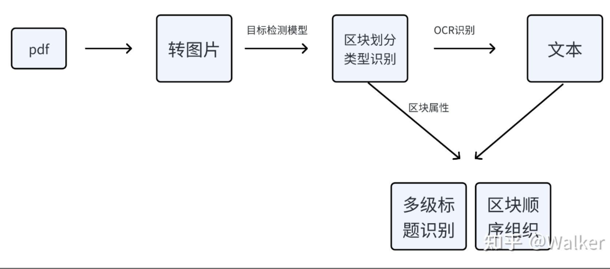
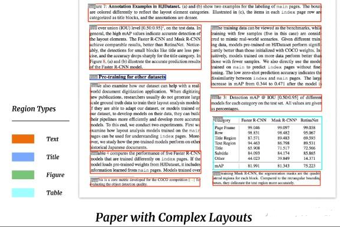
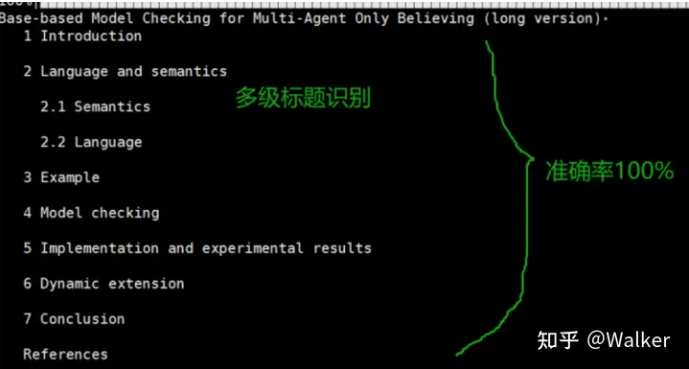
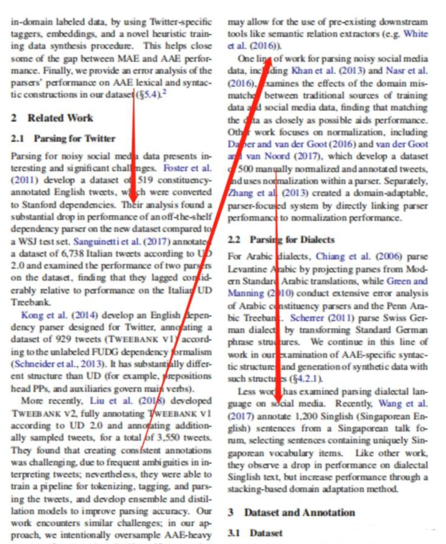
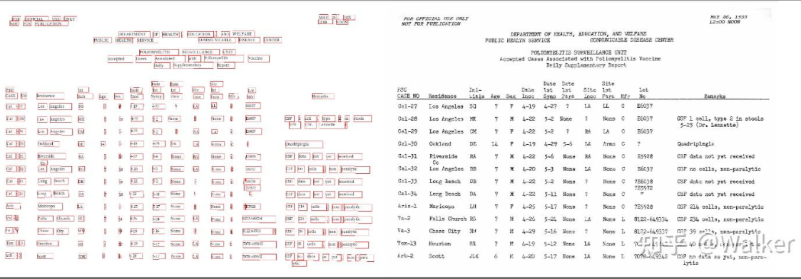
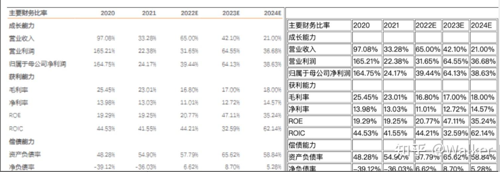

# LLM文档对话 —— pdf解析关键问题

- [LLM文档对话 —— pdf解析关键问题](#llm文档对话--pdf解析关键问题)
  - [一、为什么需要进行pdf解析？](#一为什么需要进行pdf解析)
  - [二、为什么需要 对 pdf 进行解析？](#二为什么需要-对-pdf-进行解析)
  - [三、pdf解析 有哪些方法，对应的区别是什么？](#三pdf解析-有哪些方法对应的区别是什么)
  - [四、pdf解析 存在哪些问题？](#四pdf解析-存在哪些问题)
  - [五、如何 长文档（书籍）中关键信息？](#五如何-长文档书籍中关键信息)
  - [六、为什么要提取标题甚至是多级标题？](#六为什么要提取标题甚至是多级标题)
  - [七、如何提取 文章标题？](#七如何提取-文章标题)
  - [八、如何区分单栏还是双栏pdf？如何重新排序？](#八如何区分单栏还是双栏pdf如何重新排序)
  - [九、如何提取表格和图片中的数据？](#九如何提取表格和图片中的数据)
  - [十、基于AI的文档解析有什么优缺点？](#十基于ai的文档解析有什么优缺点)
  - [总结](#总结)
  - [致谢](#致谢)

## 一、为什么需要进行pdf解析？

最近在探索ChatPDF和ChatDoc等方案的思路，也就是用LLM实现文档助手。在此记录一些难题和解决方案，首先讲解主要思想，其次以问题+回答的形式展开。

## 二、为什么需要 对 pdf 进行解析？

当 利用 LLMs 实现用户与文档对话时，首要工作 就是 对 文档中内容 进行 解析 。

由于pdf是最通用，也是最复杂的文档形式，所以 对 pdf 进行解析 变成 利用LLM实现用户与文档对话 的 重中之重 工作。

如何精确地回答用户关于文档的问题，不重也不漏？笔者认为非常重要的一点是文档内容解析。如果内容都不能很好地组织起来，LLM只能瞎编。

## 三、pdf解析 有哪些方法，对应的区别是什么？

pdf的解析大体上有两条路，一条是基于规则，一条是基于AI。

- 方法一：基于规则：
  - 介绍：根据文档的组织特点去“算”每部分的样式和内容
  - 存在问题：不通用，因为pdf的类型、排版实在太多了，没办法穷举

- 方法二：基于AI：
  - 介绍：该方法 为 目标检测 和 OCR文字识别 pipeline 方法

## 四、pdf解析 存在哪些问题？

pdf转text这块存在一定的偏差，尤其是paper中包含了大量的figure和table，以及一些特殊的字符，直接调用langchain官方给的pdf解析工具，有一些信息甚至是错误的。

这里，一方面可以用arxiv的tex源码直接抽取内容，另一方面，可以尝试用各种ocr工具来提升表现。

## 五、如何 长文档（书籍）中关键信息？

对于 长文档（书籍），如何获取 其中关键信息，并构建索引：

- 方法一：分块索引法
  - 介绍：直接对 长文档（书籍） 进行 分块，然后构建索引入库。后期问答，只需要 从 库中 召回和 用户 query 相关的 内容块 进行拼接 成文章，输入到 LLMs 生成回复；
  - 存在问题：
    - 1. 将文章分块，会破坏文章语义信息；
    - 2. 对于长文章，会被分割成 很多块，并构建很多索引，这严重影响 知识库存储空间；
    - 3. 如果内容都不能很好地组织起来，LLM只能瞎编；
- 方法二：文本摘要法
  - 介绍：直接利用 文本摘要模型 对 每一篇 长文档（书籍） 做文本摘要，然后对文本摘要内容构建索引入库。后期问答，只需要 从 库中 召回和 用户 query 相关的 摘要内容，输入到 LLMs 生成回复；
  - 存在问题：
    - 1. 由于 每篇 长文档（书籍）内容比较多，直接利用 文本摘要模型 对其 做文本摘要，需要比较大算力成本和时间成本；
    - 2. 生成的文本摘要存在部分内容丢失问题，不能很好的概括整篇文章；
- 方法三：多级标题构建文本摘要法：
  - 介绍：把多级标题提取出来，然后适当做语义扩充，或者去向量库检索相关片段，最后用LLM整合即可。

## 六、为什么要提取标题甚至是多级标题？

没有处理过LLM文档对话的朋友可能不明白为什么要提取标题甚至是多级标题，因此我先来阐述提取标题对于LLM阅读理解的重要性有多大。

1. 如Q1阐述的那样，标题是快速做摘要最核心的文本；
2. 对于有些问题high-level的问题，没有标题很难得到用户满意的结果。

> 举个栗子：假如用户就想知道3.2节是从哪些方面讨论的（标准答案就是3个方面），如果我们没有将标题信息告诉LLM，而是把所有信息全部扔给LLM，那它大概率不会知道是3个方面（要么会少，要么会多。做过的朋友秒懂）

## 七、如何提取 文章标题？

- 第一步：pdf 转图片。用一些工具将pdf转换为图片，这里有很多开源工具可以选，笔者采用fitz，一个python库。速度很快，时间在毫秒之间；
- 第二步：图片中元素（标题、文本、表格、图片、列表等元素）识别。采用目标检测模型 识别元素。
  - 工具介绍：
    - [Layout-parser](https://github.com/Layout-Parser/layout-parser)：
      - 优点：最大的模型（约800MB）精度非常高
      - 缺点：速度慢一点
    - [PaddlePaddle-ppstructure](https://github.com/PaddlePaddle/PaddleOCR/blob/release/2.7/ppstructure/docs/quickstart.md#223-版面分析)：
      - 优点：模型比较小，效果也还行
    - [unstructured](https://unstructured-io.github.io/unstructured/)：
      - 缺点：fast模式效果很差，基本不能用，会将很多公式也识别为标题。其他模式或许可行，笔者没有尝试

> 注：https://github.com/Layout-Parser/layout-parser

利用 上述工具，可以得到了一个list，存储所有检测出来的标题

- 第三步：标题级别判断。利用标题区块的高度（也就是字号）来判断哪些是一级标题，哪些是二级、三级、……N级标题。这个时候我们发现一些目标检测模型提取的区块并不是严格按照文字的边去切，导致这个idea不能实施，那怎么办呢？unstructured的fast模式就是按照文字的边去切的，同一级标题的区块高度误差在0.001之间。因此我们只需要用unstructured拿到标题的高度值即可（虽然繁琐，但是不耗时，unstructured处理也在毫秒之间）。

我们来看看提取效果，按照标题级别输出：

> 论文https://arxiv.org/pdf/2307.14893.pdf

## 八、如何区分单栏还是双栏pdf？如何重新排序？

- 动机：很多目标检测模型识别区块之后并不是顺序返回的，因此我们需要根据坐标重新组织顺序。单栏的很好办，直接按照中心点纵坐标排序即可。双栏pdf就很棘手了，有的朋友可能不知道pdf还有双栏形式

> 双栏论文示例

- 问题一：首先如何区分单双栏论文？
  - 方法：得到所有区块的中心点的横坐标，用这一组横坐标的极差来判断即可，双栏论文的极差远远大于单栏论文，因此可以设定一个极差阈值。

- 问题二：双栏论文如何确定区块的先后顺序？
  - 方法：先找到中线，将左右栏的区块分开，中线横坐标可以借助上述求极差的两个横坐标 x1 和 x2 来求，也就是 (x1+x2)/2。分为左右栏区块后，对于每一栏区块按照纵坐标排序即可，最后将右栏拼接到左栏后边。

## 九、如何提取表格和图片中的数据？

思路仍然是目标检测和OCR。无论是layoutparser还是PaddleOCR都有识别表格和图片的目标检测模型，而表格的数据可以直接OCR导出为excel形式数据，非常方便。

- 以下是layoutparser [demo](https%3A//github.com/Layout-Parser/layout-parser/blob/main/examples/OCR%2520Tables%2520and%2520Parse%2520the%2520Output.ipynb)的示例：

> Layout parser效果示例

- 以下是PaddlePaddle的 [PP structure](https://github.com/PaddlePaddle/PaddleOCR/blob/release/2.7/ppstructure/table/README_ch.md)示例：

> PP structure效果示例

提取出表格之后喂给LLM，LLM还是可以看懂的，可以设计prompt做一些指导。关于这一块两部分demo代码都很清楚明白，这里不再赘述。

## 十、基于AI的文档解析有什么优缺点？

- 优点：准确率高，通用性强。
- 缺点：耗时慢，建议用GPU等加速设备，多进程、多线程去处理。耗时只在目标检测和OCR两个阶段，其他步骤均不耗时。

## 总结

笔者建议按照不同类型的pdf做特定处理，例如论文、图书、财务报表、PPT都可以根据特点做一些小的专有设计。

没有GPU的话目标检测模型建议用PaddlePaddle提供的，速度很快。Layout parser只是一个框架，目标检测模型和OCR工具可以自有切换。

## 致谢

- ChatPDF | LLM文档对话 | pdf解析关键问题：https://zhuanlan.zhihu.com/p/652975673
- 关于document based QA的一点点思考 https://zhuanlan.zhihu.com/p/657293879

