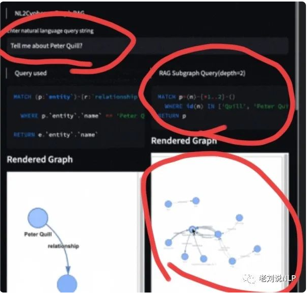
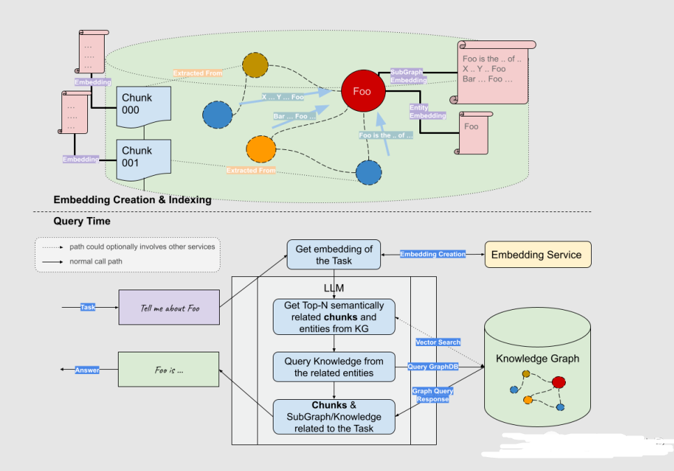
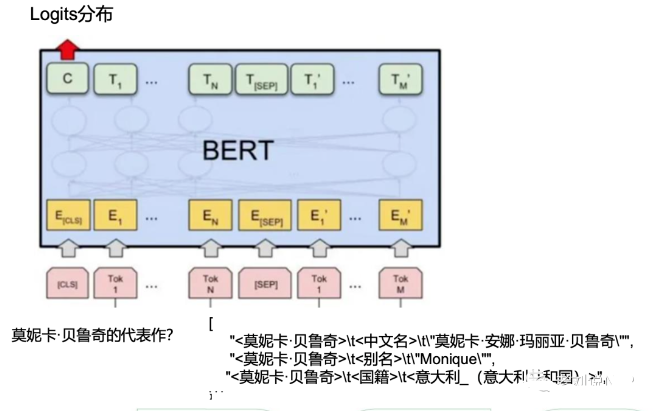

# Graph RAG（Retrieval-Augmented Generation） 面 —— 一种 基于知识图谱的大模型检索增强实现策略

- [Graph RAG（Retrieval-Augmented Generation） 面 —— 一种 基于知识图谱的大模型检索增强实现策略](#graph-ragretrieval-augmented-generation-面--一种-基于知识图谱的大模型检索增强实现策略)
  - [一、为什么需要 Graph RAG？](#一为什么需要-graph-rag)
  - [二、什么是 Graph RAG？](#二什么是-graph-rag)
  - [三、Graph RAG 思路介绍？](#三graph-rag-思路介绍)
  - [四、用代码 介绍 Graph RAG ？](#四用代码-介绍-graph-rag-)
  - [五、用 示例 介绍 Graph RAG ？](#五用-示例-介绍-graph-rag-)
  - [六、Graph RAG 排序优化方式？](#六graph-rag-排序优化方式)
  - [致谢](#致谢)

> 地址：https://siwei.io/graph-rag/

## 一、为什么需要 Graph RAG？

虽然 llamaindex 能够 利用摘要索引进行增强的方案，但这些都是利用非结构化文本在做。

对于 知识图谱，是否可以将其 作为一路召回，提高检索的相关性，这个可以利用好知识图谱内部的知识。

知识图谱可以减少基于嵌入的语义搜索所导致的不准确性。

> eg: “保温大棚”与“保温杯”，尽管在语义上两者是存在相关性的，但在大多数场景下，这种通用语义（Embedding）下的相关性很高，进而作为错误的上下文而引入“幻觉”。这时候，可以利用领域知识的知识图谱来缓解这种幻觉。

## 二、什么是 Graph RAG？

Graph RAG（Retrieval-Augmented Generation），是一种**基于知识图谱的检索增强技术**，**通过构建图模型的知识表达，将实体和关系之间的联系用图的形式进行展示，然后利用大语言模型 LLM进行检索增强**。

## 三、Graph RAG 思路介绍？

Graph RAG **将知识图谱等价于一个超大规模的词汇表**，而**实体和关系则对应于单词**。通过这种方式，**Graph RAG 在检索时能够将实体和关系作为单元进行联合建模**。

Graph RAG 思想：**对用户输入的query提取实体，然后构造子图形成上下文，最后送入大模型完成生成**

```s
def simple_graph_rag(query_str, nebulagraph_store, llm):
    entities = _get_key_entities(query_str, llm)
    graph_rag_context = _retrieve_subgraph_context(entities)
    return _synthesize_answer(
        query_str, graph_rag_context, llm)
```

## 四、用代码 介绍 Graph RAG ？

1. 使用LLM(或其他)模型从问题中提取关键实体。

```s
def _get_key_entities(query_str, llm=None ,with_llm=True):
    ...
    return _expand_synonyms(entities)
```

2. 根据这些实体检索子图，深入到一定的深度，例如可以是2度甚至更多。

```s
def _get_key_entities(query_str, llm=None ,with_llm=True):
    ...
    return _expand_synonyms(entities)
```

3. 利用获得的上下文利用LLM产生答案

```s
def _synthesize_answer(query_str, graph_rag_context, llm):
    return llm.predict(PROMPT_SYNTHESIZE_AND_REFINE, query_str, graph_rag_context)
```

这样一来，知识图谱召回可以作为一路和传统的召回进行融合。``

## 五、用 示例 介绍 Graph RAG ？

> 示例一：当用户输入，tell me about Peter quill时，先识别关键词quil，编写cypher语句获得二跳结果。



> 示例二

用户输入：Tell me events about NASA

得到关键词：Query keywords: ['NASA', 'events']

召回二度逻辑：

```s
Extracted relationships: The following are knowledge triplets in max depth 2 in the form of `subject [predicate, object, predicate_next_hop, object_next_hop ...]

nasa ['public release date', 'mid-2023']
nasa ['announces', 'future space telescope programs']
nasa ['publishes images of', 'debris disk']
nasa ['discovers', 'exoplanet lhs 475 b']
```

送入LLM完成问答。

```s
INFO:llama_index.indices.knowledge_graph.retriever:> Starting query: Tell me events about NASA
> Starting query: Tell me events about NASA
> Starting query: Tell me events about NASA
INFO:llama_index.indices.knowledge_graph.retriever:> Query keywords: ['NASA', 'events']
> Query keywords: ['NASA', 'events']
> Query keywords: ['NASA', 'events']
INFO:llama_index.indices.knowledge_graph.retriever:> Extracted relationships: The following are knowledge triplets in max depth 2 in the form of `subject [predicate, object, predicate_next_hop, object_next_hop ...]`
nasa ['public release date', 'mid-2023']
nasa ['announces', 'future space telescope programs']
nasa ['publishes images of', 'debris disk']
nasa ['discovers', 'exoplanet lhs 475 b']
> Extracted relationships: The following are knowledge triplets in max depth 2 in the form of `subject [predicate, object, predicate_next_hop, object_next_hop ...]`
nasa ['public release date', 'mid-2023']
nasa ['announces', 'future space telescope programs']
nasa ['publishes images of', 'debris disk']
nasa ['discovers', 'exoplanet lhs 475 b']
> Extracted relationships: The following are knowledge triplets in max depth 2 in the form of `subject [predicate, object, predicate_next_hop, object_next_hop ...]`
nasa ['public release date', 'mid-2023']
nasa ['announces', 'future space telescope programs']
nasa ['publishes images of', 'debris disk']
nasa ['discovers', 'exoplanet lhs 475 b']
INFO:llama_index.token_counter.token_counter:> [get_response] Total LLM token usage: 159 tokens
> [get_response] Total LLM token usage: 159 tokens
> [get_response] Total LLM token usage: 159 tokens
INFO:llama_index.token_counter.token_counter:> [get_response] Total embedding token usage: 0 tokens
> [get_response] Total embedding token usage: 0 tokens
> [get_response] Total embedding token usage: 0 tokens
INFO:llama_index.token_counter.token_counter:> [get_response] Total LLM token usage: 159 tokens
> [get_response] Total LLM token usage: 159 tokens
> [get_response] Total LLM token usage: 159 tokens
INFO:llama_index.token_counter.token_counter:> [get_response] Total embedding token usage: 0 tokens
> [get_response] Total embedding token usage: 0 tokens
> [get_response] Total embedding token usage: 0 tokens
```

## 六、Graph RAG 排序优化方式？



基于知识图谱召回的方法可以和其他召回方法一起融合，但这种方式在图谱规模很大时其实是有提升空间的。

- 突出的缺点在于：
  - 子图召回的多条路径中可能会出现多种不相关的。
  - 实体识别阶段的精度也有限，采用关键词提取还比较暴力，方法也值得商榷。
  - 这种方式依赖于一个基础知识图谱库，如果数据量以及广度不够，有可能会引入噪声。

因此，还可以再加入路径排序环节，可参考**先粗排后精排**的方式，同样走过滤逻辑。

例如，

**在粗排阶段，根据问题query和候选路径path的特征，对候选路径进行粗排，采用LightGBM机器学习模型，保留topn条路径**：

```s
• 字符重合数
• 词重合数
• 编辑距离
• path跳数
• path长度
• 字符的Jaccard相似度
• 词语的Jaccard相似度
• path中的关系数
• path中的实体个数
• path中的答案个数
• 判断path的字符是否全在query中
• 判断query和path中是否都包含数字 • 获取数字的Jaccrad的相似度
```

**在精排阶段，采用预训练语言模型，计算query和粗排阶段 的path的语义匹配度，选择得分top2-3答案路径作为答案。**



## 致谢

- [技术动态 | 基于知识图谱的大模型检索增强实现策略：Graph RAG实现基本原理及优化思路](https://mp.weixin.qq.com/s/x5od5jOHBAjSIxNNhL3jqg)
- 从传统RAG到GraphRAG - 当大模型遇见知识图谱 https://mp.weixin.qq.com/s/9FNPZqVuagFRPic1PeJ0tQ
