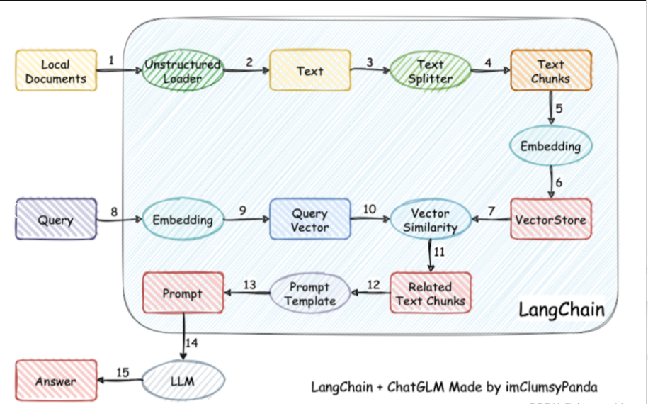
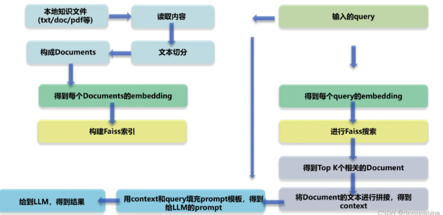
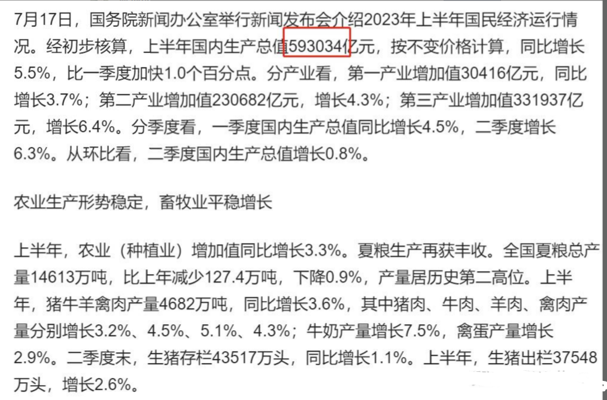
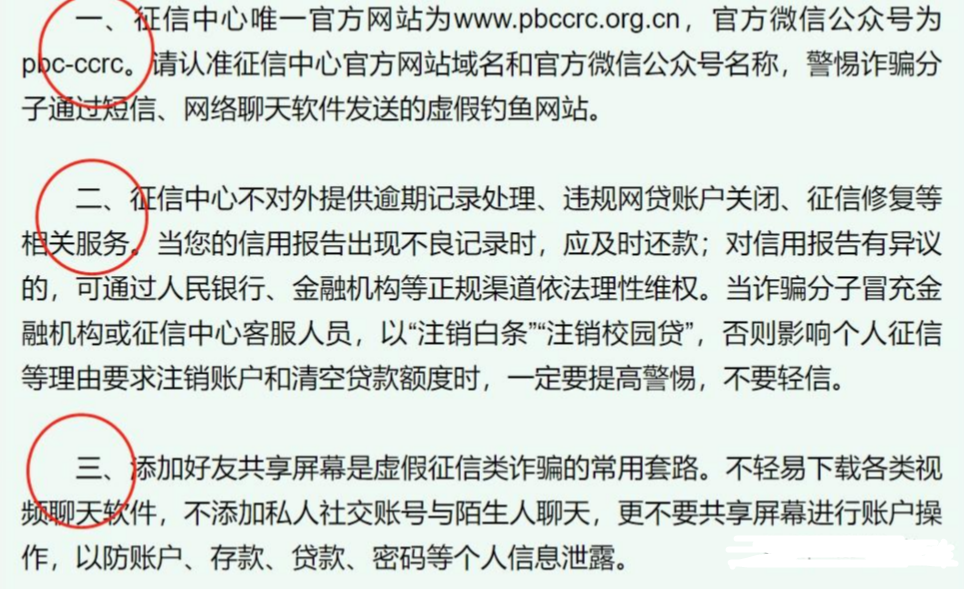
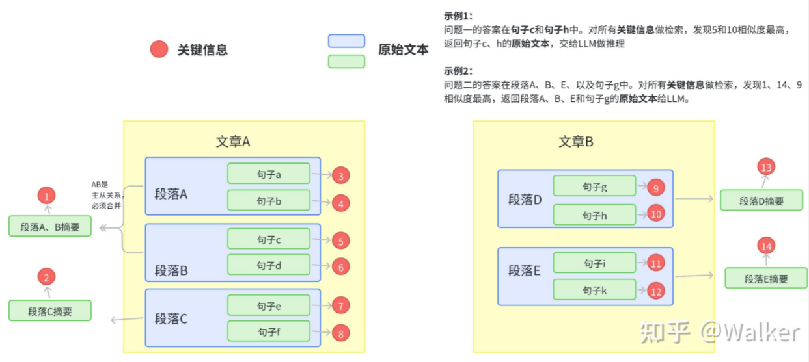
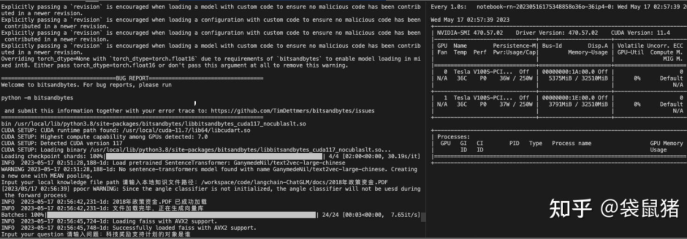
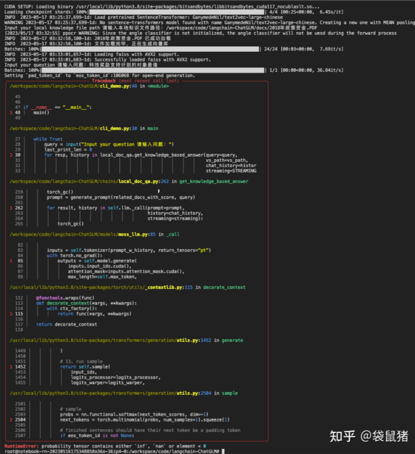

# 大模型 RAG 经验面

- [大模型 RAG 经验面](#大模型-rag-经验面)
  - [一、RAG 基础面](#一rag-基础面)
    - [1.1 为什么 大模型 需要 外挂(向量)知识库？](#11-为什么-大模型-需要-外挂向量知识库)
    - [1.2 RAG 思路是怎么样？](#12-rag-思路是怎么样)
    - [1.3 RAG 核心技术是什么？](#13-rag-核心技术是什么)
    - [1.4 RAG prompt 模板 如何构建？](#14-rag-prompt-模板-如何构建)
    - [1.5 如何评价RAG项目效果的好坏？](#15-如何评价rag项目效果的好坏)
    - [1.6 RAG的检索阶段，常见的向量检索模型有哪些？](#16-rag的检索阶段常见的向量检索模型有哪些)
    - [1.7 针对通用的RAG，你觉得还有哪些改进点？](#17-针对通用的rag你觉得还有哪些改进点)
  - [二、RAG 优化面](#二rag-优化面)
    - [痛点1：文档切分粒度不好把控，既担心噪声太多又担心语义信息丢失](#痛点1文档切分粒度不好把控既担心噪声太多又担心语义信息丢失)
      - [问题描述](#问题描述)
        - [问题1：如何让LLM简要、准确回答细粒度知识？](#问题1如何让llm简要准确回答细粒度知识)
        - [问题2：如何让LLM回答出全面的粗粒度（跨段落）知识？](#问题2如何让llm回答出全面的粗粒度跨段落知识)
      - [解决方案](#解决方案)
        - [思想（原则）](#思想原则)
        - [如何构建关键信息？](#如何构建关键信息)
      - [常见问题](#常见问题)
    - [痛点2：在基于垂直领域 表现不佳](#痛点2在基于垂直领域-表现不佳)
    - [痛点3：langchain 内置 问答分句效果不佳问题](#痛点3langchain-内置-问答分句效果不佳问题)
    - [痛点4：如何 尽可能召回与query相关的Document 问题](#痛点4如何-尽可能召回与query相关的document-问题)
    - [痛点5：如何让LLM基于query和context得到高质量的response](#痛点5如何让llm基于query和context得到高质量的response)
    - [痛点6：embedding模型在表示text chunks时偏差太大问题](#痛点6embedding模型在表示text-chunks时偏差太大问题)
    - [痛点7：不同的 prompt，可能产生完全不同的效果问题](#痛点7不同的-prompt可能产生完全不同的效果问题)
    - [痛点8：llm生成效果问题](#痛点8llm生成效果问题)
    - [痛点9：如何更高质量地召回context喂给llm](#痛点9如何更高质量地召回context喂给llm)
  - [三、RAG 工程示例面](#三rag-工程示例面)
    - [3.1 本地知识库问答系统（Langchain-chatGLM）](#31-本地知识库问答系统langchain-chatglm)
      - [3.1.1 避坑记录](#311-避坑记录)
        - [解决持续网页loading的问题：降低gradio版本，以免高版本检查google字体](#解决持续网页loading的问题降低gradio版本以免高版本检查google字体)
        - [解决无法安装detectron2【0517后使用paddleocr代替了】](#解决无法安装detectron20517后使用paddleocr代替了)
        - [解决PDF无法加载的问题](#解决pdf无法加载的问题)
        - [解决错误file0](#解决错误file0)
        - [使用paddleocr出现错误](#使用paddleocr出现错误)
        - [解决moss模型加载错误](#解决moss模型加载错误)
        - [解决moss提问出现错误「等待更优解决方案」](#解决moss提问出现错误等待更优解决方案)
  - [致谢](#致谢)

## 一、RAG 基础面

### 1.1 为什么 大模型 需要 外挂(向量)知识库？

- 克服遗忘问题
- 提升回答的准确性、权威性、时效性
- 解决通用模型针对一些小众领域没有涉猎的问题
- 提高可控性和可解释性，提高模型的可信度和安全性

### 1.2 RAG 思路是怎么样？

1. 加载文件
2. 读取文本
3. 文本分割
4. 文本向量化
5. 问句向量化
6. 在文本向量中匹配出与问句向量最相似的top k个
7. 匹配出的文本作为上下文和问题一起添加到 prompt 中
8. 提交给 LLM 生成回答

> 版本一


> 版本一


### 1.3 RAG 核心技术是什么？

- RAG 核心技术：embedding
- 思路：将用户知识库内容经过 embedding 存入向量知识库，然后用户每一次提问也会经过 embedding，利用向量相关性算法（例如余弦算法）找到最匹配的几个知识库片段，将这些知识库片段作为上下文，与用户问题一起作为 promt 提交给 LLM 回答

### 1.4 RAG prompt 模板 如何构建？

```s
已知信息：
{context} 

根据上述已知信息，简洁和专业的来回答用户的问题。如果无法从中得到答案，请说 “根据已知信息无法回答该问题” 或 “没有提供足够的相关信息”，不允许在答案中添加编造成分，答案请使用中文。 
问题是：{question}
```

### 1.5 如何评价RAG项目效果的好坏？

针对检索环节的评估：

- MMR 平均倒排率：查询（或推荐请求）的排名倒数
- Hits Rate 命中率：前k项中，包含正确信息的项的数目占比
NDCG

针对生成环节的评估：

- 非量化：完整性、正确性、相关性
- 量化：Rouge-L

### 1.6 RAG的检索阶段，常见的向量检索模型有哪些？

ANN算法

- 乘积向量
- 暴力搜索
- hnswlib

KD树

### 1.7 针对通用的RAG，你觉得还有哪些改进点？

- query侧：做query的纠错、改写，规范化和扩展
- 对向量数据库做层次索引，提高检索效率和精度
- 对LLM模型微调，针对当前垂直领域引入知识库，提升回答的专业性、时效性和正确性
- 对最终输出做后处理，降低输出的不合理case

## 二、RAG 优化面

### 痛点1：文档切分粒度不好把控，既担心噪声太多又担心语义信息丢失

#### 问题描述

##### 问题1：如何让LLM简要、准确回答细粒度知识？

- 举例及标答如下：



> 用户：2023年我国上半年的国内生产总值是多少？
>
> LLM：根据文档，2023年的国民生产总值是593034亿元。

- 需求分析：一是简要，不要有其他废话。二是准确，而不是随意编造。

##### 问题2：如何让LLM回答出全面的粗粒度（跨段落）知识？

- 举例及标答如下：



> 用户：根据文档内容，征信中心有几点声明？
>
> LLM：根据文档内容，有三点声明，分别是：一、……；二……；三……。

- 需求分析：

要实现语义级别的分割，而不是简单基于html或者pdf的换行符分割。

笔者发现目前的痛点是**文档分割不够准确，导致模型有可能只回答了两点，而实际上是因为向量相似度召回的结果是残缺的**。

有人可能会问，那完全**可以把切割粒度大一点，比如每10个段落一分。但这样显然不是最优的，因为召回片段太大，噪声也就越多**。LLM本来就有幻觉问题，回答得不会很精准（笔者实测也发现如此）。

所以说，我们的文档切片最好是按照语义切割。

#### 解决方案

##### 思想（原则）

基于LLM的文档对话架构分为两部分，**先检索，后推理**。重心在检索（推荐系统），推理交给LLM整合即可。

而检索部分要满足三点 **①尽可能提高召回率，②尽可能减少无关信息；③速度快**。

将所有的文本组织成二级索引，第一级索引是 [关键信息]，第二级是 [原始文本]，二者一一映射。

**检索部分只对关键信息做embedding，参与相似度计算，把召回结果映射的 原始文本 交给LLM**。

- 主要架构图如下：



##### 如何构建关键信息？

首先从架构图可以看到，句子、段落、文章都要关键信息，如果为了效率考虑，可以不用对句子构建关键信息。

1. 文章的切分及关键信息抽取

- **关键信息**: 为各语义段的关键信息集合，或者是各个子标题语义扩充之后的集合（pdf多级标题识别及提取见下一篇文章）
- **语义切分方法1**：**利用NLP的篇章分析（discourse parsing）工具，提取出段落之间的主要关系**，譬如上述极端情况2展示的段落之间就有从属关系。把所有包含主从关系的段落合并成一段。 这样对文章切分完之后保证每一段在说同一件事情.
- **语义切分方法2**：除了discourse parsing的工具外，还可以写一个简单算法**利用BERT等模型来实现语义分割**。BERT等模型在预训练的时候采用了NSP（next sentence prediction）的训练任务，因此BERT完全可以判断两个句子（段落）是否具有语义衔接关系。这里我们可以设置相似度阈值t，从前往后依次判断相邻两个段落的相似度分数是否大于t，如果大于则合并，否则断开。当然算法为了效率，可以采用二分法并行判定，模型也不用很大，笔者用BERT-base-Chinese在中文场景中就取得了不错的效果。

```s
 def is_nextsent(sent, next_sent):
        encoding = tokenizer(sent, next_sent, return_tensors="pt",truncation=True, padding=False)

        with torch.no_grad():
            outputs = model(**encoding, labels=torch.LongTensor([1]))
            logits = outputs.logits
            probs = torch.softmax(logits/TEMPERATURE, dim=1)
            next_sentence_prob = probs[:, 0].item()

        if next_sentence_prob <= MERGE_RATIO:

            return False
        else:
            return True
```

2. 语义段的切分及段落（句子）关键信息抽取

**如果向量检索效率很高，获取语义段之后完全可以按照真实段落及句号切分，以缓解细粒度知识点检索时大语块噪声多的场景**。当然，关键信息抽取笔者还有其他思路。

- 方法1：**利用 NLP 中的成分句法分析（constituency parsing）工具和命名实体识别（NER）工具提取**
  - 成分句法分析（constituency parsing）工具：可以提取核心部分（名词短语、动词短语……）；
  - 命名实体识别（NER）工具：可以提取重要实体（货币名、人名、企业名……）。

譬如说：

```s
    原始文本：MM团队的成员都是精英，核心成员是前谷歌高级产品经理张三，前meta首席技术官李四…… 
    关键信息：（MM团队，核心成员，张三，李四）
```

- 方法2：可以用**语义角色标注（Semantic Role Labeling）来分析句子的谓词论元结构**，提取“谁对谁做了什么”的信息作为关键信息。

- 方法3：直接法。其实NLP的研究中本来就有**关键词提取工作（Keyphrase Extraction）**。也有一个成熟工具可以使用。一个工具是 HanLP ，中文效果好，但是付费，免费版调用次数有限。还有一个开源工具是KeyBERT，英文效果好，但是中文效果差。

- 方法4：垂直领域建议的方法。以上两个方法在垂直领域都有准确度低的缺陷，垂直领域可以仿照ChatLaw的做法，即：训练一个生成关键词的模型。ChatLaw就是训练了一个KeyLLM。

#### 常见问题

- 句子、语义段、之间召回不会有包含关系吗，是否会造成冗余？

回答：会造成冗余，但是笔者试验之后回答效果很好，无论是细粒度知识还是粗粒度（跨段落）知识准确度都比Longchain粗分效果好很多，对这个问题笔者认为可以优化但没必要

### 痛点2：在基于垂直领域 表现不佳

模型微调：一个是对embedding模型的基于垂直领域的数据进行微调；一个是对LLM模型的基于垂直领域的数据进行微调；

### 痛点3：langchain 内置 问答分句效果不佳问题

- 文档加工：
  - 一种是使用更好的文档拆分的方式（如项目中已经集成的达摩院的语义识别的模型及进行拆分）；
  - 一种是改进填充的方式，判断中心句上下文的句子是否和中心句相关，仅添加相关度高的句子；
  - 另一种是文本分段后，对每段分别及进行总结，基于总结内容语义及进行匹配；

### 痛点4：如何 尽可能召回与query相关的Document 问题

- 问题描述：如何通过得到query相关性高的context，即与query相关的Document尽可能多的能被召回；
- 解决方法：
  - 将本地知识切分成Document的时候，需要考虑Document的长度、Document embedding质量和被召回Document数量这三者之间的相互影响。在文本切分算法还没那么智能的情况下，本地知识的内容最好是已经结构化比较好了，各个段落之间语义关联没那么强。Document较短的情况下，得到的Document embedding的质量可能会高一些，通过Faiss得到的Document与query相关度会高一些。
  - 使用Faiss做搜索，前提条件是有高质量的文本向量化工具。因此最好是能基于本地知识对文本向量化工具进行Finetune。另外也可以考虑将ES搜索结果与Faiss结果相结合。

### 痛点5：如何让LLM基于query和context得到高质量的response

- 问题描述：如何让LLM基于query和context得到高质量的response
- 解决方法：
  - 尝试多个的prompt模版，选择一个合适的，但是这个可能有点玄学
  - 用与本地知识问答相关的语料，对LLM进行Finetune。

### 痛点6：embedding模型在表示text chunks时偏差太大问题

- 问题描述：

1. 一些开源的embedding模型本身效果一般，尤其是当text chunk很大的时候，强行变成一个简单的vector是很难准确表示的，开源的模型在效果上确实不如openai Embeddings；
2. 多语言问题，paper的内容是英文的，用户的query和生成的内容都是中文的，这里有个语言之间的对齐问题，尤其是可以用中文的query embedding来从英文的text chunking embedding中找到更加相似的top-k是个具有挑战的问题

- 解决方法：

1. 用更小的text chunk配合更大的topk来提升表现，毕竟smaller text chunk用embedding表示起来noise更小，更大的topk可以组合更丰富的context来生成质量更高的回答；
2. 多语言的问题，可以找一些更加适合多语言的embedding模型

### 痛点7：不同的 prompt，可能产生完全不同的效果问题

- 问题描述：prompt是个神奇的东西，不同的提法，可能产生完全不同的效果。尤其是指令，指令型llm在训练或者微调的时候，基本上都有个输出模板，这个如果前期没有给出instruction data说明，需要做很多的尝试，尤其是你希望生成的结果是按照一定格式给出的，需要做更多的尝试

### 痛点8：llm生成效果问题

- 问题描述：。llm本质上是个“接茬”机器，你给上句，他补充下一句。但各家的llm在理解context和接茬这两个环节上相差还是挺多的。最早的时候，是用一个付费的gpt代理作为llm来生成内容，包括解读信息、中文标题和关键词，整体上来看可读性会强很多，也可以完全按照给定的格式要求生成相应的内容，后期非常省心；后来入手了一台mac m2，用llama.cpp在本地提供llm服务，**模型尝试了chinese-llama2-alpaca和baichuan2，量化用了Q6_K level，据说性能和fp16几乎一样，作为开源模型，两个表现都还可以。前者是在llama2的基础上，用大量的中文数据进行了增量训练，然后再用alpaca做了指令微调，后者是开源届的当红炸子鸡。但从context的理解上，两者都比较难像gpt那样可以完全准确地生成我希望的格式，baichuan2稍微好一些**。我感觉，应该是指令微调里自带了一些格式，所以生成的时候有点“轴”。
- 解决思路：可以选择一些好玩的开源模型，比如llama2和baichuan2，然后自己构造一些domain dataset，做一些微调的工作，让llm更听你的话

### 痛点9：如何更高质量地召回context喂给llm

- 问题描述：初期直接调包langchain的时候没有注意，生成的结果总是很差，问了很多Q给出的A乱七八糟的，后来一查，发现召回的内容根本和Q没啥关系
- 解决思路：更加细颗粒度地来做recall，当然如果是希望在学术内容上来提升质量，学术相关的embedding模型、指令数据，以及更加细致和更具针对性的pdf解析都是必要的。

> 参考：PDFTriage: Question Answering over Long, Structured Documents

## 三、RAG 工程示例面

### 3.1 本地知识库问答系统（Langchain-chatGLM）

#### 3.1.1 避坑记录

##### 解决持续网页loading的问题：降低gradio版本，以免高版本检查google字体

```s
    $ pip install gradio==3.21.0
```

##### 解决无法安装detectron2【0517后使用paddleocr代替了】

1. 下载依赖包到环境中：https://github.com/facebookresearch/detectron2
2. 然后cd detectron2
3. 注意torch==1.8.0，安装：pip install -e .
4. 安装完之后将torch升至2.0.0，同时将protobuf降至3.20.0

##### 解决PDF无法加载的问题

- 确保 apt 包是最新的，运行 sudo apt update
- 使用 apt 安装 libmagic-dev, poppler-utils 和 tesseract-ocr，运行 sudo apt install libmagic-dev poppler-utils tesseract-ocr
- 检查 tesseract-ocr 的版本，运行 tesseract --version
- 检查 tesseract-ocr 的语言包，运行 tesseract --list-langs
- 如果需要中文识别，可以在 github 上下载中文识别包2，并将其放在 /usr/share/tesseract-ocr/4.00/tessdata/ 目录下

##### 解决错误file0

- 按照README里的手工解压punkt和tagger后，放到指定目录
- punkt.zip 中的 packages/tokenizers 解压，放到 nltk_data/tokenizers 存储路径下。
- nltk_data 存储路径可以通过 nltk.data.path 查询。
- 将 averaged_perceptron_tagger.zip 下载，解压放到 nltk_data/taggers 存储路径下
- nltk_data 存储路径可以通过 nltk.data.path 查询。

##### 使用paddleocr出现错误

- 错误：ModuleNotFoundError: No module named 'tools.infer'
- 原因：在python中import tools能生效，但是没有相关的包可以卸载，导致paddleocr中的tools文件无法被引用
- 解决：需要江paddleocr的文件中，所有【from tools.infer import】的代码改为：【from paddleocr.tools.infer import】

##### 解决moss模型加载错误

错误：get_class_from_dynamic_module() missing 2 required positional arguments: 'module_file' and 'class_name’
在2张V100s-32G的环境下，通过修改以下代码可以解决上面的问题，供参考： 修改
【langchain-ChatGLM/models/moss_llm.py】文件第33行：

```s
def auto_configure_device_map() -> Dict[str, int]: 
    cls = get_class_from_dynamic_module(class_reference="fnlp/moss-moon-003-sft--modeling_moss.MossForCausalLM", 
                                pretrained_model_name_or_path=llm_model_dict['moss'])
```

为：

```s
def auto_configure_device_map() -> Dict[str, int]: 
    cls = get_class_from_dynamic_module(pretrained_model_name_or_path="fnlp/moss-moon-003-sft", 
                           module_file="modeling_moss.py", class_name="MossForCausalLM")
```

且保证moss的模型文件放置在【angchain-ChatGLM/fnlp/moss-moon-003-sft】路径下，可以成功加载模型：



##### 解决moss提问出现错误「等待更优解决方案」

- 错误：RuntimeError: probability tensor contains either inf, nan or element < 0
- 解决：
  - emove 【do_sample=True】 can pass the error
  - refer:THUDM/ChatGLM-6B#31 (comment)
  - 不报错，但是会卡很久才回答




## 致谢

1. langchain + ChatGLM-6B 实现个人专属知识库 https://blog.csdn.net/sj5590155/article/details/131720160
2. LangChain快速入门级示例(chatglm+text2vec建立本地知识库) https://zhuanlan.zhihu.com/p/630200571
3. RAG痛点及解决方案：https://zhuanlan.zhihu.com/p/651179780
4. 小虫飞飞：LLM+Embedding构建问答系统的局限性及优化方案: https://zhuanlan.zhihu.com/p/641132245
5. LangChain快速入门级示例(chatglm+text2vec建立本地知识库) https://zhuanlan.zhihu.com/p/630200571
6. Langchain-ChatGLM：基于本地知识库问答 https://blog.csdn.net/dzysunshine/article/details/131003488
7. 持续更新 | langchain-ChatGLM的部署避坑解决方案 https://zhuanlan.zhihu.com/p/630049721
8. 基于本地知识的问答机器人langchain-ChatGLM https://zhuanlan.zhihu.com/p/622717995
9. 关于document based QA的一点点思考 https://zhuanlan.zhihu.com/p/657293879


