# 检索增强生成(RAG) 优化策略篇

- [检索增强生成(RAG) 优化策略篇](#检索增强生成rag-优化策略篇)
  - [一、RAG基础功能篇](#一rag基础功能篇)
    - [1.1 RAG 工作流程](#11-rag-工作流程)
  - [二、RAG 各模块有哪些优化策略？](#二rag-各模块有哪些优化策略)
  - [三、RAG 架构优化有哪些优化策略？](#三rag-架构优化有哪些优化策略)
    - [3.1 如何利用 知识图谱（KG）进行上下文增强？](#31-如何利用-知识图谱kg进行上下文增强)
      - [3.1.1 典型RAG架构中，向量数据库进行上下文增强 存在哪些问题？](#311-典型rag架构中向量数据库进行上下文增强-存在哪些问题)
      - [3.1.2 如何利用 知识图谱（KG）进行上下文增强？](#312-如何利用-知识图谱kg进行上下文增强)
    - [3.2 Self-RAG：如何让 大模型 对 召回结果 进行筛选？](#32-self-rag如何让-大模型-对-召回结果-进行筛选)
      - [3.2.1 典型RAG架构中，向量数据库 存在哪些问题？](#321-典型rag架构中向量数据库-存在哪些问题)
      - [3.2.2 Self-RAG：如何让 大模型 对 召回结果 进行筛选？](#322-self-rag如何让-大模型-对-召回结果-进行筛选)
      - [3.2.3 Self-RAG 的 创新点是什么？](#323-self-rag-的-创新点是什么)
      - [3.2.4 Self-RAG 的 训练过程？](#324-self-rag-的-训练过程)
      - [3.2.5 Self-RAG 的 推理过程？](#325-self-rag-的-推理过程)
      - [3.2.6 Self-RAG 的 代码实战？](#326-self-rag-的-代码实战)
    - [3.3 多向量检索器多模态RAG篇](#33-多向量检索器多模态rag篇)
      - [3.3.1 如何让 RAG 支持 多模态数据格式？](#331-如何让-rag-支持-多模态数据格式)
        - [3.3.1.1 如何让 RAG 支持 半结构化RAG（文本+表格）?](#3311-如何让-rag-支持-半结构化rag文本表格)
        - [3.3.1.2 如何让 RAG 支持 多模态RAG（文本+表格+图片）?](#3312-如何让-rag-支持-多模态rag文本表格图片)
        - [3.3.1.3 如何让 RAG 支持 私有化多模态RAG（文本+表格+图片）?](#3313-如何让-rag-支持-私有化多模态rag文本表格图片)
    - [3.4 RAG Fusion 优化策略](#34-rag-fusion-优化策略)
    - [3.5 模块化 RAG 优化策略](#35-模块化-rag-优化策略)
    - [3.6 RAG 新模式 优化策略](#36-rag-新模式-优化策略)
    - [3.7 RAG 结合 SFT](#37-rag-结合-sft)
    - [3.8 查询转换（Query Transformations）](#38-查询转换query-transformations)
    - [3.9 bert在RAG中具体是起到了一个什么作用，我刚搜了下nsp的内容，但有点没法将这几者联系起来](#39-bert在rag中具体是起到了一个什么作用我刚搜了下nsp的内容但有点没法将这几者联系起来)
  - [四、RAG 索引优化有哪些优化策略？](#四rag-索引优化有哪些优化策略)
    - [4.1 嵌入 优化策略](#41-嵌入-优化策略)
    - [4.2 RAG检索召回率低，一般都有哪些解决方案呀。尝试过不同大小的chunk，和混合检索。效果都不太好，然后优化？](#42-rag检索召回率低一般都有哪些解决方案呀尝试过不同大小的chunk和混合检索效果都不太好然后优化)
    - [4.3 RAG 如何 优化索引结构?](#43-rag-如何-优化索引结构)
    - [4.4 如何通过 混合检索 提升 RAG 效果?](#44-如何通过-混合检索-提升-rag-效果)
    - [4.5 如何通过 重新排名 提升 RAG 效果?](#45-如何通过-重新排名-提升-rag-效果)
  - [五、RAG 索引数据优化有哪些优化策略？](#五rag-索引数据优化有哪些优化策略)
    - [5.1 RAG 如何 提升索引数据的质量?](#51-rag-如何-提升索引数据的质量)
    - [5.2 如何通过添加元数据 提升 RAG 效果?](#52-如何通过添加元数据-提升-rag-效果)
    - [5.3 如何通过 输入查询与文档对齐 提升 RAG 效果?](#53-如何通过-输入查询与文档对齐-提升-rag-效果)
    - [5.4 如何通过 提示压缩 提升 RAG 效果?](#54-如何通过-提示压缩-提升-rag-效果)
    - [5.5 如何通过 查询重写和扩展 提升 RAG 效果?](#55-如何通过-查询重写和扩展-提升-rag-效果)
  - [RAG 未来发展方向](#rag-未来发展方向)
    - [Rag 的垂直优化](#rag-的垂直优化)
    - [RAG 的水平扩展](#rag-的水平扩展)
    - [RAG 生态系统](#rag-生态系统)
  - [参考](#参考)

## 一、RAG基础功能篇

### 1.1 RAG 工作流程

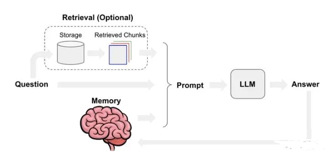
> 图1 RAG工作流程（with memory）

从RAG的工作流程看，RAG 模块有：文档块切分、文本嵌入模型、提示工程、大模型生成。

## 二、RAG 各模块有哪些优化策略？

- **文档块切分**：设置适当的块间重叠、多粒度文档块切分、基于语义的文档切分、文档块摘要。
- **文本嵌入模型**：基于新语料微调嵌入模型、动态表征。
- **提示工程优化**：优化模板增加提示词约束、提示词改写。
- **大模型迭代**：基于正反馈微调模型、量化感知训练、提供大context window的推理模型。

此外，还可对query召回的文档块集合进行处理，比如：元数据过滤[7]、重排序减少文档块数量[2]。

## 三、RAG 架构优化有哪些优化策略？

### 3.1 如何利用 知识图谱（KG）进行上下文增强？

#### 3.1.1 典型RAG架构中，向量数据库进行上下文增强 存在哪些问题？

向量数据库进行上下文增强 存在问题：

1. 无法获取长程关联知识
2. 信息密度低（尤其当LLM context window较小时不友好）

#### 3.1.2 如何利用 知识图谱（KG）进行上下文增强？

- 策略：增加一路与向量库平行的KG（知识图谱）上下文增强策略。

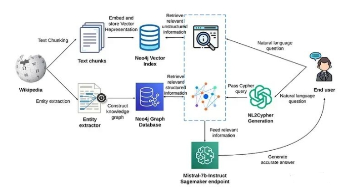
> 图2 基于KG+VS进行上下文增强

- 具体方式：对于 用户 query，通过 利用 NL2Cypher 进行 KG 增强；
- 优化策略：常用 图采样技术来进行KG上下文增强
- 处理方式：根据query抽取实体，然后把实体作为种子节点对图进行采样（必要时，可把KG中节点和query中实体先向量化，通过向量相似度设置种子节点），然后把获取的子图转换成文本片段，从而达到上下文增强的效果。

### 3.2 Self-RAG：如何让 大模型 对 召回结果 进行筛选？

#### 3.2.1 典型RAG架构中，向量数据库 存在哪些问题？

经典的RAG架构中（包括KG进行上下文增强），对召回的上下文无差别地与query进行合并，然后访问大模型输出应答。但有时召回的上下文可能与query无关或者矛盾，此时就应舍弃这个上下文，尤其当大模型上下文窗口较小时非常必要（目前4k的窗口比较常见）。

#### 3.2.2 Self-RAG：如何让 大模型 对 召回结果 进行筛选？


> 图3 RAG vs Self-RAG

Self-RAG 则是更加主动和智能的实现方式，主要步骤概括如下：

1. 判断是否需要额外检索事实性信息（retrieve on demand），仅当有需要时才召回；
2. 平行处理每个片段：生产prompt + 一个片段的生成结果；
3. 使用反思字段，检查输出是否相关，选择最符合需要的片段；
4. 再重复检索；
5. 生成结果会引用相关片段，以及输出结果是否符合该片段，便于查证事实。

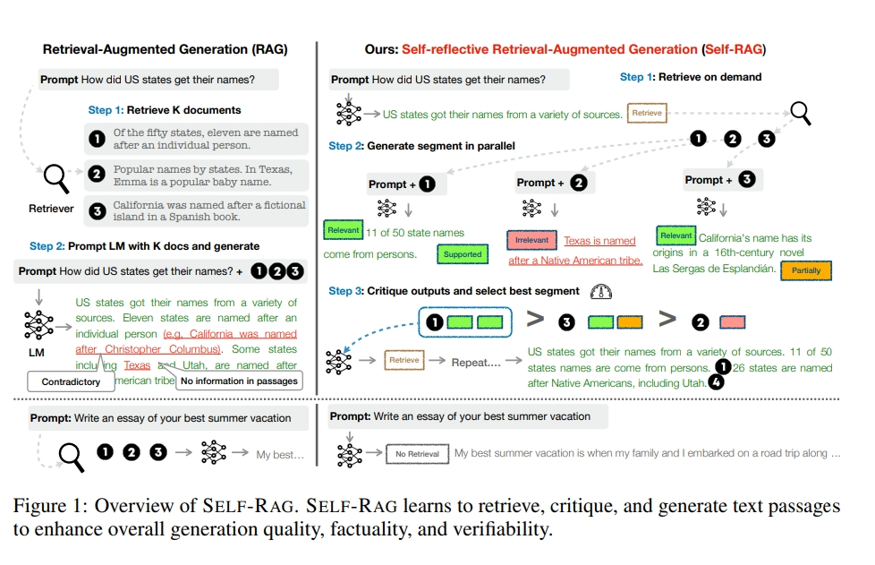

#### 3.2.3 Self-RAG 的 创新点是什么？

Self-RAG 的重要创新： **Reflection tokens (反思字符)**。通过生成反思字符这一特殊标记来检查输出。这些字符会分为 Retrieve 和 Critique 两种类型，会标示：检查是否有检索的必要，完成检索后检查输出的相关性、完整性、检索片段是否支持输出的观点。模型会基于原有词库和反思字段来生成下一个 token。

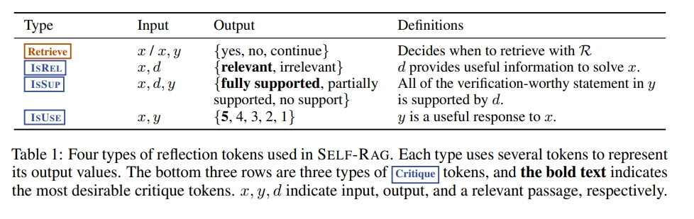

#### 3.2.4 Self-RAG 的 训练过程？

**对于训练，模型通过将反思字符集成到其词汇表中来学习生成带有反思字符的文本**。 它是在一个语料库上进行训练的，其中包含由 Critic 模型预测的检索到的段落和反思字符。 该 Critic 模型评估检索到的段落和任务输出的质量。 使用反思字符更新训练语料库，并训练最终模型以在推理过程中独立生成这些字符。

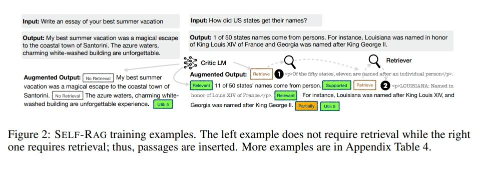

为了训练 Critic 模型，手动标记反思字符的成本很高，于是作者使用 GPT-4 生成反思字符，然后将这些知识提炼到内部 Critic 模型中。 不同的反思字符会通过少量演示来提示具体说明。 例如，检索令牌会被提示判断外部文档是否会改善结果。

为了训练生成模型，使用检索和 Critic 模型来增强原始输出以模拟推理过程。 对于每个片段，Critic 模型都会确定额外的段落是否会改善生成。 如果是，则添加 Retrieve=Yes 标记，并检索前 K 个段落。 然后 Critic 评估每段文章的相关性和支持性，并相应地附加标记。 最终通过输出反思字符进行增强。

然后使用标准的 next token 目标在此增强语料库上训练生成模型，预测目标输出和反思字符。 在训练期间，检索到的文本块被屏蔽，并通过反思字符 Critique 和 Retrieve 扩展词汇量。 这种方法比 PPO 等依赖单独奖励模型的其他方法更具成本效益。 Self-RAG 模型还包含特殊令牌来控制和评估其自身的预测，从而实现更精细的输出生成。

#### 3.2.5 Self-RAG 的 推理过程？

Self-RAG 使用反思字符来自我评估输出，使其在推理过程中具有适应性。 根据任务的不同，可以定制模型，通过检索更多段落来优先考虑事实准确性，或强调开放式任务的创造力。 该模型可以决定何时检索段落或使用设定的阈值来触发检索。

当需要检索时，生成器同时处理多个段落，产生不同的候选。 进行片段级 beam search 以获得最佳序列。 每个细分的分数使用 Critic 分数进行更新，该分数是每个批评标记类型的归一化概率的加权和。 可以在推理过程中调整这些权重以定制模型的行为。 与其他需要额外训练才能改变行为的方法不同，Self-RAG 无需额外训练即可适应。

#### 3.2.6 Self-RAG 的 代码实战？

下面对开源的 Self-RAG 进行推理测试，可在这里下载模型 selfrag_llama2_13b ，按照官方指导使用 vllm 进行推理服务

```s
from vllm import LLM, SamplingParams

model = LLM("selfrag/selfrag_llama2_7b", download_dir="/gscratch/h2lab/akari/model_cache", dtype="half")
sampling_params = SamplingParams(temperature=0.0, top_p=1.0, max_tokens=100, skip_special_tokens=False)

def format_prompt(input, paragraph=None):
  prompt = "### Instruction:\n{0}\n\n### Response:\n".format(input)
  if paragraph is not None:
    prompt += "[Retrieval]<paragraph>{0}</paragraph>".format(paragraph)
  return prompt

query_1 = "Leave odd one out: twitter, instagram, whatsapp."
query_2 = "What is China?"
queries = [query_1, query_2]

# for a query that doesn't require retrieval
preds = model.generate([format_prompt(query) for query in queries], sampling_params)
for pred in preds:
  print("Model prediction: {0}".format(pred.outputs[0].text))
```

输出结果如下，其中第一段结果不需要检索，第二段结果出现[Retrieval] 字段，因为这个问题需要更细粒度的事实依据。

```s
Model prediction: Twitter:[Utility:5]</s>
Model prediction: China is a country located in East Asia.[Retrieval]<paragraph>It is the most populous country in the world, with a population of over 1.4 billion people.[Retrieval]<paragraph>China is a diverse country with a rich history and culture.[Retrieval]<paragraph>It is home to many different ethnic groups and languages, and its cuisine, art, and architecture reflect this diversity.[Retrieval]<paragraph>China is also a major economic power, with a rapidly growing economy and a large manufacturing sector.[Utility:5]</s>
```

我们还可以在输入中增加补充信息：

```s
# for a query that needs factual grounding
prompt = format_prompt("Can you tell me the difference between llamas and alpacas?", "The alpaca (Lama pacos) is a species of South American camelid mammal. It is similar to, and often confused with, the llama. Alpacas are considerably smaller than llamas, and unlike llamas, they were not bred to be working animals, but were bred specifically for their fiber.")
preds = model.generate([prompt], sampling_params)
print([pred.outputs[0].text for pred in preds])
```

输出结果如下，Self-RAG 找到相关的插入文档并生成有证据支持的答案。

```s
['<paragraph>The main difference between llamas and alpacas is their size and fiber.[Continue to Use Evidence]Llamas are much larger than alpacas, and they have a much coarser fiber.[Utility:5]</s>']
```

### 3.3 多向量检索器多模态RAG篇

- 多向量检索器（Multi-Vector Retriever）核心想法：将文档（用于答案合成）和引用（用于检索）分离，这样可以针对不同的数据类型生成适合自然语言检索的摘要，同时保留原始的数据内容。它可以与多模态 LLM 结合，实现跨模态的 RAG。

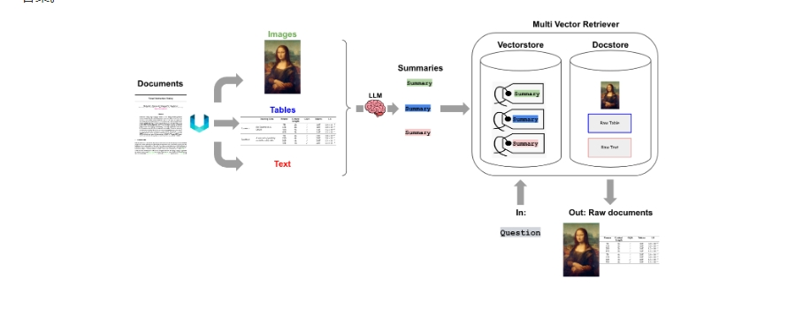

#### 3.3.1 如何让 RAG 支持 多模态数据格式？

##### 3.3.1.1 如何让 RAG 支持 半结构化RAG（文本+表格）?

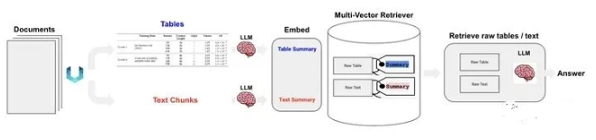
> 图5 半结构化RAG

此模式要同时处理文本与表格数据。其核心流程梳理如下[8]：

1. 将原始文档进行版面分析（基于Unstructured工具[9]），生成原始文本 和 原始表格。
2. 原始文本和原始表格经summary LLM处理，生成文本summary和表格summary。
3. 用同一个embedding模型把文本summary和表格summary向量化，并存入多向量检索器。
4. 多向量检索器存入文本/表格embedding的同时，也会存入相应的summary和raw data。
5. 用户query向量化后，用ANN检索召回raw text和raw table。
6. 根据query+raw text+raw table构造完整prompt，访问LLM生成最终结果。

##### 3.3.1.2 如何让 RAG 支持 多模态RAG（文本+表格+图片）?

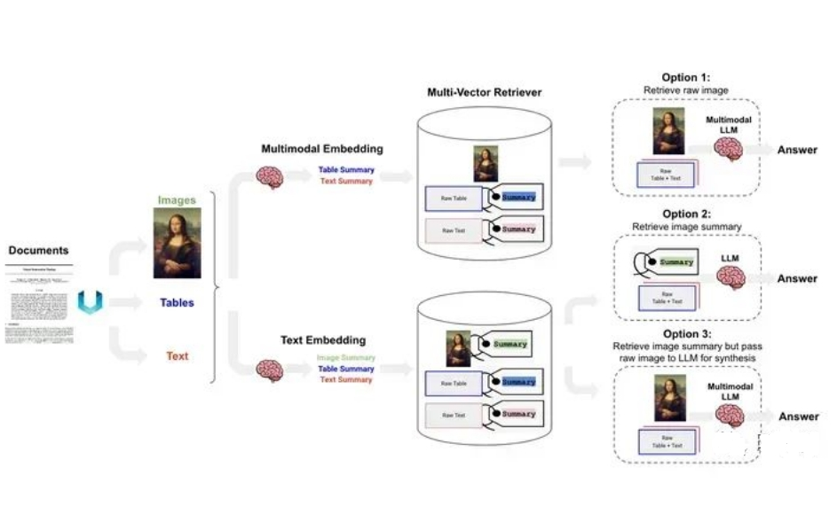
> 图6 多模态RAG

如图6所示，对多模态RAG而言有三种技术路线，如下我们做个简要说明：

- 选项1：对文本和表格生成summary，然后应用多模态embedding模型把文本/表格summary、原始图片转化成embedding存入多向量检索器。对话时，根据query召回原始文本/表格/图像。然后将其喂给多模态LLM生成应答结果。
- 选项2：首先应用多模态大模型（GPT4-V、LLaVA、FUYU-8b）生成图片summary。然后对文本/表格/图片summary进行向量化存入多向量检索器中。当生成应答的多模态大模型不具备时，可根据query召回原始文本/表格+图片summary。
- 选项3：前置阶段同选项2相同。对话时，根据query召回原始文本/表格/图片。构造完整Prompt，访问多模态大模型生成应答结果。

##### 3.3.1.3 如何让 RAG 支持 私有化多模态RAG（文本+表格+图片）?

如果数据安全是重要考量，那就需要把RAG流水线进行本地部署。比如可用LLaVA-7b生成图片摘要，Chroma作为向量数据库，Nomic's GPT4All作为开源嵌入模型，多向量检索器，Ollama.ai中的LLaMA2-13b-chat用于生成应答[11]。

### 3.4 RAG Fusion 优化策略

- 思路：检索增强这一块主要借鉴了RAG Fusion技术，这个技术原理比较简单，概括起来就是，当接收用户query时，让大模型生成5-10个相似的query，然后每个query去匹配5-10个文本块，接着对所有返回的文本块再做个倒序融合排序，如果有需求就再加个精排，最后取Top K个文本块拼接至prompt。
- 优点：
  - 增加了相关文本块的召回率；
  - 对用户的query自动进行了文本纠错、分解长句等功能
- 缺点：无法从根本上解决理解用户意图的问题

### 3.5 模块化 RAG 优化策略

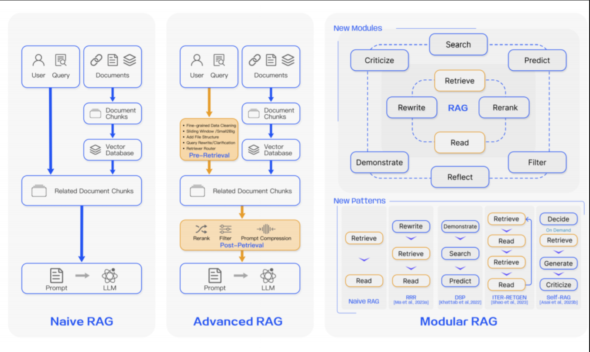

- 动机：打破了传统的“原始 RAG”框架，这个框架原本涉及索引、检索和生成，现在提供了更广泛的多样性和更高的灵活性。
- 模块介绍：
  - **搜索模块**： 融合了直接在（附加的）语料库中进行搜索的方法。这些方法包括利用大语言模型（LLM）生成的代码、SQL、Cypher 等查询语言，或是其他定制工具。其搜索数据源多样，涵盖搜索引擎、文本数据、表格数据或知识图等。
  - **记忆模块**： 本模块充分利用大语言模型本身的记忆功能来引导信息检索。其核心原则是寻找与当前输入最为匹配的记忆。这种增强检索的生成模型能够利用其自身的输出来自我提升，在推理过程中使文本更加贴近数据分布，而非仅依赖训练数据。
  - **额外生成模块**： 面对检索内容中的冗余和噪声问题，这个模块通过大语言模型生成必要的上下文，而非直接从数据源进行检索。通过这种方式，由大语言模型生成的内容更可能包含与检索任务相关的信息。
  - **任务适应模块**： 该模块致力于将 RAG 调整以适应各种下游任务。
  - **对齐模块**： 在 RAG 的应用中，查询与文本之间的对齐一直是影响效果的关键因素。在模块化 RAG 的发展中，研究者们发现，在检索器中添加一个可训练的 Adapter 模块能有效解决对齐问题。
  - **验证模块**： 在现实世界中，我们无法总是保证检索到的信息的可靠性。检索到不相关的数据可能会导致大语言模型产生错误信息。因此，可以在检索文档后加入一个额外的验证模块，以评估检索到的文档与查询之间的相关性，这样做可以提升 RAG的鲁棒性。

### 3.6 RAG 新模式 优化策略

RAG 的组织方法具有高度灵活性，能够根据特定问题的上下文，对 RAG 流程中的模块进行替换或重新配置。在基础的 Naive RAG 中，包含了检索和生成这两个核心模块，这个框架因而具备了高度的适应性和多样性。目前的研究主要围绕两种组织模式：

- **增加或替换模块** 在增加或替换模块的策略中，我们保留了原有的检索 - 阅读结构，同时加入新模块以增强特定功能。RRR 提出了一种重写 - 检索 - 阅读的流程，其中利用大语言模型（LLM）的性能作为强化学习中重写模块的奖励机制。这样，重写模块可以调整检索查询，从而提高阅读器在后续任务中的表现。
- **调整模块间的工作流程** 在调整模块间流程的领域，重点在于加强语言模型与检索模型之间的互动。

### 3.7 RAG 结合 SFT

> 参考：https://arxiv.org/pdf/2310.01352.pdf

- RA-DIT 方法 策略：

1. **更新 LLM** 。以最大限度地提高在给定检索增强指令的情况下正确答案的概率；
2. **更新检索器**。以最大限度地减少文档与查询在语义上相似（相关）的程度。

- 优点：通过这种方式，使 LLM 更好地利用相关背景知识，并训练 LLM 即使在检索错误块的情况下也能产生准确的预测，从而使模型能够依赖自己的知识。

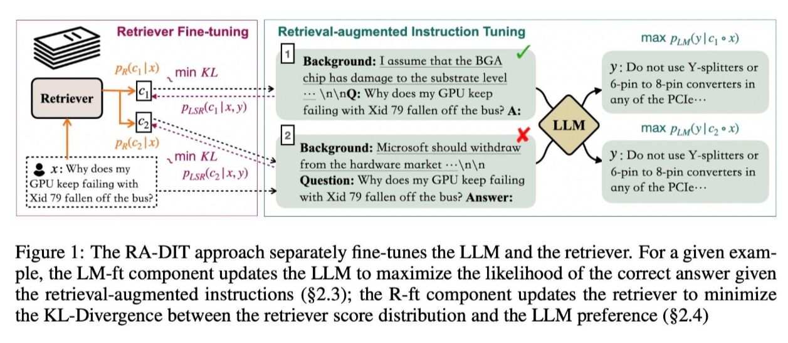

### 3.8 查询转换（Query Transformations）

- 动机：在某些情况下，用户的 query 可能出现表述不清、需求复杂、内容无关等问题；
- 查询转换（Query Transformations）：利用了大型语言模型(LLM)的强大能力，通过某种提示或方法将原始的用户问题转换或重写为更合适的、能够更准确地返回所需结果的查询。LLM的能力确保了转换后的查询更有可能从文档或数据中获取相关和准确的答案。
- 查询转换的核心思想：用户的原始查询可能不总是最适合检索的，所以我们需要某种方式来改进或扩展它。

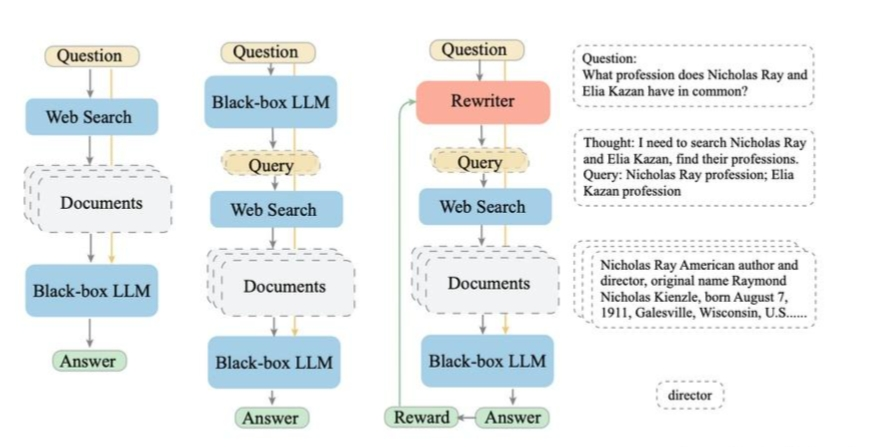

### 3.9 bert在RAG中具体是起到了一个什么作用，我刚搜了下nsp的内容，但有点没法将这几者联系起来

RAG 中，对于一些 传统任务（eg：分类、抽取等）用 bert 效率会快很多，虽然会牺牲一点点效果，但是 比起 推理时间，前者更被容忍；而对于一些生成式任务（改写、摘要等），必须得用 LLMs，原因：1. Bert 窗口有限，只支持 512个字符，对于 这些生成任务是远远不够的；2. LLMs 生成能力 比 Bert 系列要强很多，这个时候，时间换性能 就变得很有意义

## 四、RAG 索引优化有哪些优化策略？

### 4.1 嵌入 优化策略

1. 微调嵌入
   1. 影响因素：影响到 RAG 的有效性；
   2. 目的：让检索到的内容与查询之间的相关性更加紧密；
   3. 作用：可以比作在语音生成前对“听觉”进行调整，优化检索内容对最终输出的影响。特别是在处理不断变化或罕见术语的专业领域，这些定制化的嵌入方法能够显著提高检索的相关性。

2. 动态嵌入（Dynamic Embedding）
   1. 介绍：不同于静态嵌入（static embedding），动态嵌入根据单词出现的上下文进行调整，为每个单词提供不同的向量表示。例如，在 Transformer 模型（如 BERT）中，同一单词根据周围词汇的不同，其嵌入也会有所变化。

3. 检索后处理流程
   1. 动机：
      1. 一次性向大语言模型展示所有相关文档可能会超出其处理的上下文窗口限制。
      2. 将多个文档拼接成一个冗长的检索提示不仅效率低，还会引入噪声，影响大语言模型聚焦关键信息。
   2. 优化方法：
      1. ReRank（重新排序）
      2. Prompt 压缩
      3. RAG 管道优化
      4. 混合搜索的探索
      5. 递归检索与查询引擎
      6. StepBack-prompt 方法
      7. 子查询
      8. HyDE 方法

### 4.2 RAG检索召回率低，一般都有哪些解决方案呀。尝试过不同大小的chunk，和混合检索。效果都不太好，然后优化？

个人排查方式：
1. 知识库里面是否有对应答案？如果没有那就是知识库覆盖不全问题
2. 知识库有，但是没召回：
   1. q1：知识库知识是否被分割掉，导致召回出错，解决方法 修改分割方式 or 利用bert 进行上下句预测 保证知识点完整性
   2. q2：知识没有被召回，分析 query 和 doc 的特点： 字相关还是语义相关，一般建议是先用 es做召回，然后才用模型做精排

### 4.3 RAG 如何 优化索引结构?

构建 RAG 时，块大小是一个关键参数。它决定了我们从向量存储中检索的文档的长度。小块可能导致文档缺失一些关键信息，而大块可能引入无关的噪音。

找到最佳块大小是要找到正确的平衡。如何高效地做到这一点？试错法（反复验证）。

然而，这并不是让你对每一次尝试进行一些随机猜测，并对每一次经验进行定性评估。

**你可以通过在测试集上运行评估并计算指标来找到最佳块大小**。LlamaIndex 有一些功能可以做到这一点。可以在他们的博客中了解更多。

### 4.4 如何通过 混合检索 提升 RAG 效果?

虽然向量搜索有助于检索与给定查询相关的语义相关块，但有时在匹配特定关键词方面缺乏精度。根据用例，有时可能需要精确匹配。

想象一下，搜索包含数百万电子商务产品的矢量数据库，对于查询“阿迪达斯参考 XYZ 运动鞋白色”，最上面的结果包括白色阿迪达斯运动鞋，但没有一个与确切的 XYZ 参考相匹配。

相信大家都不能接受这个结果。为了解决这个问题，混合检索是一种解决方案。该策略利用了矢量搜索和关键词搜索等不同检索技术的优势，并将它们智能地结合起来。

通过这种混合方法，您仍然可以匹配相关关键字，同时保持对查询意图的控制。

查看 Pinecone的入门指南，了解更多关于混合搜索的信息（文末附链接）。

### 4.5 如何通过 重新排名 提升 RAG 效果?

当查询向量存储时，前K个结果不一定按最相关的方式排序。当然，它们都是相关的，但在这些相关块中，最相关的块可能是第5或第7个，而不是第1或第2个。

这就是重新排名的用武之地。

重新排名的简单概念是将最相关的信息重新定位到提示的边缘，这一概念已在各种框架中成功实现，包括 LlamaIndex、LangChain 和 HayStack。

例如，Diversity Ranker 专注于根据文档的多样性进行重新排序，而LostInTheMiddleRanker在上下文窗口的开始和结束之间交替放置最佳文档。

## 五、RAG 索引数据优化有哪些优化策略？

### 5.1 RAG 如何 提升索引数据的质量?

索引的数据决定了 RAG 答案的质量，因此首要任务是在摄取数据之前尽可能对其进行整理。（垃圾输入，垃圾输出仍然适用于此）

通过删除重复/冗余信息，识别不相关的文档，检查事实的准确性（如果可能的话）来实现这一点。

使用过程中，对 RAG 的维护也很重要，还需要添加机制来更新过时的文档。

在构建 RAG 时，清理数据是一个经常被忽视的步骤，因为我们通常倾向于倒入所有文档而不验证它们的质量。以下我建议可以快速解决一些问题：

1. 通过清理特殊字符、奇怪的编码、不必要的 HTML 标签来消除文本噪音……还记得使用正则表达式的老的 NLP 技术吗？可以把他们重复使用起来；
2. 通过实施一些主题提取、降维技术和数据可视化，发现与主题无关的文档，删除它们；
3. 通过使用相似性度量删除冗余文档

### 5.2 如何通过添加元数据 提升 RAG 效果?

将元数据与索引向量结合使用有助于更好地构建它们，同时提高搜索相关性。

以下是一些元数据有用的情景：

- 如果你搜索的项目中，时间是一个维度，你可以根据日期元数据进行排序
- 如果你搜索科学论文，并且你事先知道你要找的信息总是位于特定部分，比如实验部分，你可以将文章部分添加为每个块的元数据并对其进行过滤仅匹配实验

元数据很有用，因为它在向量搜索之上增加了一层结构化搜索。

### 5.3 如何通过 输入查询与文档对齐 提升 RAG 效果?

LLMs 和 RAGs 之所以强大，因为它们可以灵活地用自然语言表达查询，从而降低数据探索和更复杂任务的进入门槛。

然而，有时，用户用几个词或短句的形式作为输入查询，查询结果会出现与文档之间存在不一致的情况。

通过一个例子来理解这一点。这是关于马达引擎的段落（来源：ChatGPT）

> 发动机堪称工程奇迹，以其复杂的设计和机械性能驱动着无数的车辆和机械。其核心是，发动机通过一系列精确协调的燃烧事件将燃料转化为机械能。这个过程涉及活塞、曲轴和复杂的阀门网络的同步运动，所有这些都经过仔细校准，以优化效率和功率输出。现代发动机有多种类型，例如内燃机和电动机，每种都有其独特的优点和应用。对创新的不懈追求不断增强汽车发动机技术，突破性能、燃油效率和环境可持续性的界限。无论是在开阔的道路上为汽车提供动力还是驱动工业机械，电机仍然是现代世界动态运动的驱动力。

在这个例子中，我们制定一个简单的查询，“你能简要介绍一下马达引擎的工作原理吗？”，与段落的余弦相似性为 0.72。

其实已经不错了，但还能做得更好吗？

为了做到这一点，我们将不再通过段落的嵌入来索引该段落，而是通过其回答的问题的嵌入来索引该段落。

考虑这三个问题，段落分别回答了这些问题：

1. 发动机的基本功能是什么？
2. 发动机如何将燃料转化为机械能？
3. 发动机运行涉及哪些关键部件，它们如何提高发动机的效率？

通过计算得出，它们与输入查询的相似性分别为：

1. 0.864
2. 0.841
3. 0.845

这些值更高，表明输入查询与问题匹配得更精确。

将块与它们回答的问题一起索引，略微改变了问题，但有助于解决对齐问题并提高搜索相关性：我们不是优化与文档的相似性，而是优化与底层问题的相似性。

### 5.4 如何通过 提示压缩 提升 RAG 效果?

研究表明，在检索上下文中的噪声会对RAG性能产生不利影响，更精确地说，对由 LLM 生成的答案产生不利影响。

一些方案建议在检索后再应用一个后处理步骤，以压缩无关上下文，突出重要段落，并减少总体上下文长度。

选择性上下文等方法和 LLMLingua 使用小型LLM来计算即时互信息或困惑度，从而估计元素重要性。

### 5.5 如何通过 查询重写和扩展 提升 RAG 效果?

当用户与 RAG 交互时，查询结果不一定能获得最佳的回答，并且不能充分表达与向量存储中的文档匹配的结果。

为了解决这个问题，在送到 RAG 之前，我们先发生给 LLM 重写此查询。

这可以通过添加中间 LLM 调用轻松实现，但需要继续了解其他的技术实现（参考论文《Query Expansion by Prompting Large Language Models》）。

## RAG 未来发展方向

RAG 的三大未来发展方向：垂直优化、横向扩展以及 RAG 生态系统的构建。

### Rag 的垂直优化

尽管 RAG 技术在过去一年里取得了显著进展，但其垂直领域仍有几个重点问题有待深入探究：

1. RAG 中长上下文的处理问题
2. RAG 的鲁棒性研究
3. RAG 与微调（Fine-tuning）的协同作用
4. RAG 的工程应用

在工程实践中，诸如如何在大规模知识库场景中提高检索效率和文档召回率，以及如何保障企业数据安全——例如防止 LLM 被诱导泄露文档的来源、元数据或其他敏感信息——都是亟待解决的关键问题。

### RAG 的水平扩展

在水平领域，RAG 的研究也在迅速扩展。从最初的文本问答领域出发，RAG 的应用逐渐拓展到更多模态数据，包括图像、代码、结构化知识、音视频等。

### RAG 生态系统

- 下游任务和评估

通过整合来自广泛知识库的相关信息，RAG 展示了在处理复杂查询和生成信息丰富回应方面的巨大潜力。

众多研究表明，RAG 在开放式问题回答、事实验证等多种下游任务中表现优异。RAG 模型不仅提升了下游应用中信息的准确性和相关性，还增加了回应的多样性和深度。

RAG 的成功为其在多领域应用的适用性和普适性的探索铺平了道路，未来的工作将围绕此进行。特别是在医学、法律和教育等专业领域的知识问答中，RAG 的应用可能会相比微调 (fine-tuning) 提供更低的训练成本和更优的性能表现。

同时，完善 RAG 的评估体系，以更好地评估和优化它在不同下游任务中的应用，对提高模型在特定任务中的效率和效益至关重要。这涉及为各种下游任务开发更精准的评估指标和框架，如上下文相关性、内容创新性和无害性等。

此外，增强 RAG 模型的可解释性，让用户更清楚地理解模型如何以及为何作出特定反应，也是一项重要任务。

- 技术栈

在 RAG 的技术生态系统中，相关技术栈的发展起着推动作用。例如，随着 ChatGPT 的流行，LangChain 和 LLamaIndex 迅速成为知名技术，它们提供丰富的 RAG 相关 API，成为大模型时代的关键技术之一。

与此同时，新型技术栈也在不断涌现。尽管这些新技术并不像 LangChain 和 LLamaIndex 那样功能众多，但它们更注重自身的独特特性。例如，Flowise AI6 着重于低代码操作，使用户能够通过简单的拖拽实现 RAG 代表的各类 AI 应用。其他新兴技术如 HayStack、Meltno 和 Cohere Coral 也在不断发展。

技术栈的发展与 RAG 的进步相互促进。新技术对现有技术栈提出了更高的要求，而技术栈功能的优化又进一步推动了 RAG 技术的发展。综合来看，RAG 工具链的技术栈已经初步建立，许多企业级应用逐步出现。然而，一个全面的一体化平台仍在完善中。


## 参考

1. Chatbots | ️ Langchain
2. Rerankers and Two-Stage Retrieval | Pinecone
3. Custom Retriever combining KG Index and VectorStore Index
4. Enhanced QA Integrating Unstructured Knowledge Graph Using Neo4j and LangChain
5. https://blog.langchain.dev/using-a-knowledge-graph-to-implement-a-devops-rag-application/
6. AI pursuer：揭秘Self-RAG技术内幕
7. Multi-Vector Retriever for RAG on tables, text, and images：Multi-Vector Retriever for RAG on tables, text, and images
8. https://github.com/langchain-ai/langchain/blob/master/cookbook/Semi_Structured_RAG.ipynb?ref=blog.langchain.dev
9. Unstructured | The Unstructured Data ETL for Your LLM
10. https://github.com/langchain-ai/langchain/blob/master/cookbook/Semi_structured_and_multi_modal_RAG.ipynb?ref=blog.langchain.dev
11. https://github.com/langchain-ai/langchain/blob/master/cookbook/Semi_structured_multi_modal_RAG_LLaMA2.ipynb?ref=blog.langchain.dev
12. 对于大模型RAG技术的一些思考 https://mp.weixin.qq.com/s?__biz=MzU1OTk1MDE2MQ==&mid=2247484541&idx=1&sn=87c558a76ffede9472b808f6ae8cdb32
13. 检索增强生成（RAG）有什么好的优化方案？ https://www.zhihu.com/question/628651389/answer/3352768451


