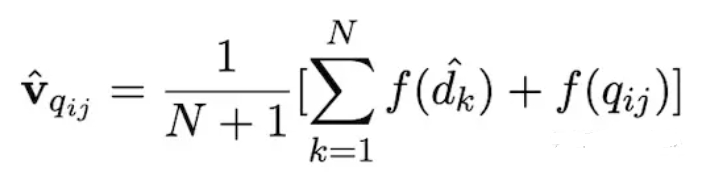
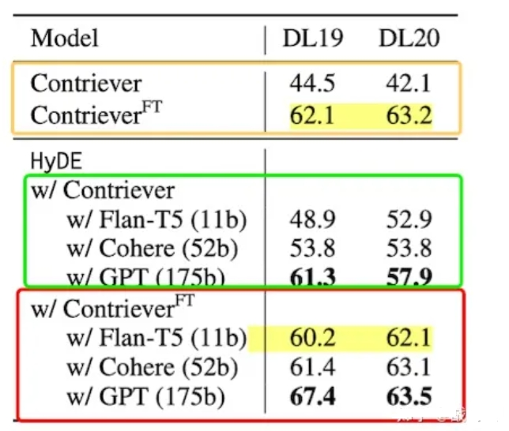
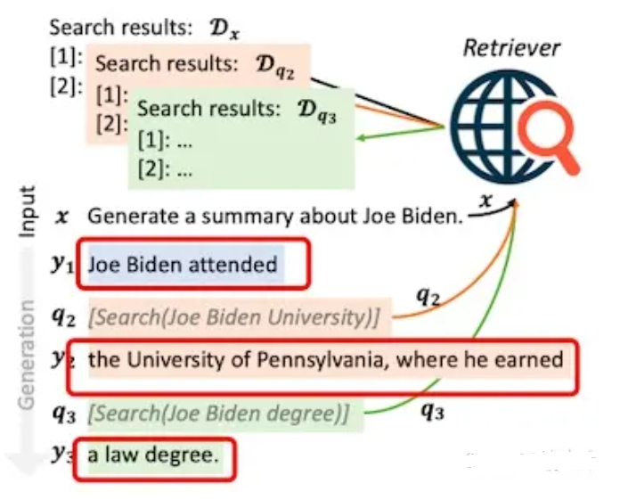
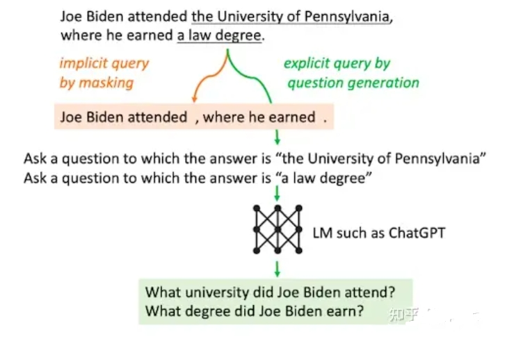

# 大模型外挂知识库优化——如何利用大模型辅助召回？

- [大模型外挂知识库优化——如何利用大模型辅助召回？](#大模型外挂知识库优化如何利用大模型辅助召回)
  - [一、为什么需要使用大模型辅助召回？](#一为什么需要使用大模型辅助召回)
  - [策略一： HYDE](#策略一-hyde)
    - [1. 介绍一下 HYDE 思路？](#1-介绍一下-hyde-思路)
    - [2. 介绍一下 HYDE 问题？](#2-介绍一下-hyde-问题)
  - [策略二： FLARE](#策略二-flare)
    - [1. 为什么 需要 FLARE ？](#1-为什么-需要-flare-)
    - [2.  FLARE 有哪些召回策略？](#2--flare-有哪些召回策略)
      - [2.1 策略1](#21-策略1)
        - [2.1.1 策略1 思路？](#211-策略1-思路)
        - [2.1.2 策略1 缺陷？](#212-策略1-缺陷)
      - [2.2 策略2](#22-策略2)
        - [2.2.1 策略2 思路？](#221-策略2-思路)
  - [致谢](#致谢)

## 一、为什么需要使用大模型辅助召回？

我们可以通过向量召回的方式从文档库里召回和用户问题相关的文档片段，同时输入到LLM中，增强模型回答质量。

常用的方式直接用用户的问题进行文档召回。但是很多时候，**用户的问题是十分口语化的，描述的也比较模糊，这样会影响向量召回的质量，进而影响模型回答效果**。

## 策略一： HYDE

- 论文：《Precise Zero-Shot Dense Retrieval without Relevance Labels》
- 论文地址：https://arxiv.org/pdf/2212.10496.pdf

### 1. 介绍一下 HYDE 思路？

1. **用LLM根据用户query生成k个“假答案”**。（大模型生成答案采用sample模式，保证生成的k个答案不一样。此时的回答内容很可能是存在知识性错误，因为如果能回答正确，那就不需要召回补充额外知识了对吧。不过不要紧，我们知识想通过大模型去理解用户的问题，生成一些“看起来”还不错的假答案）
2. **利用向量化模型，将生成的k的假答案和用户的query变成向量**；
3. 将k+1个向量取平均：其中dk为第k个生成的答案，q为用户问题，f为向量化操作。

4. 利用融合向量v从文档库中召回答案。融合向量中既有用户问题的信息，也有想要答案的模式信息，可以增强召回效果

### 2. 介绍一下 HYDE 问题？

该方法在结合微调过的向量化模型时，效果就没那么好了，非常依赖打辅助的LLM的能力。

> 原始的该模型并未在TREC DL19/20数据集上训练过。模型有上标FT指的是向量化模型在TREC DL相关的数据集上微调过的。黄框标出来的是未使用hyde技术的baseline结果。绿框标出来的是未微调的向量化模型使用hyde技术的实验结果。红框标出来的是微调过的向量化模型使用hyde技术的实验结果。实验指标为NDCG@10。可以发现，对于没有微调过的向量户化模型（zero shot场景），hyde还是非常有用的，并且随着使用的LLM模型的增大，效果不断变好（因为LLM的回答质量提高了）。非常有意思的一点是是对于微调过的向量化模型，如果使用比较小的LLM生成假答案（小于52B参数量），hdye技术甚至会带来负面影响。

## 策略二： FLARE

- 论文：《Active REtrieval Augmented Generation》
- 论文地址：https://arxiv.org/abs/2305.06983

### 1. 为什么 需要 FLARE ？

对于大模型外挂知识库，大家通常的做法是根据用户query一次召回文档片段，让模型生成答案。只进行一次文档召回在长文本生成的场景下效果往往不好，生成的文本过长，更有可能扩展出和query相关性较弱的内容，如果模型没有这部分知识，容易产生模型幻觉问题。**一种解决思路是随着文本生成，多次从向量库中召回内容**。

### 2.  FLARE 有哪些召回策略？

1. 每生成固定的n个token就召回一次；
2. 每生成一个完整的句子就召回一次；
3. 用户query一步步分解为子问题，需要解答当前子问题时候，就召回一次

已有的多次召回方案比较被动，**召回文档的目的是为了得到模型不知道的信息**，a、b策略并不能保证不需要召回的时候不召回，需要召回的时候触发召回。c.方案需要设计特定的prompt工程，限制了其通用性。

作者在本文里提出了两种更主动的多次召回策略，让模型自己决定啥时候触发召回操作。

#### 2.1 策略1

##### 2.1.1 策略1 思路？

通过设计prompt以及提供示例的方式，让模型知道当遇到需要查询知识的时候，提出问题，并按照格式输出，和toolformer的模式类似。

1. 提出问题的格式为[Serch(“模型自动提出的问题”)]（称其为主动召回标识）。利用模型生成的问题去召回答案。
2. 召回出答案后，将答案放到用户query的前边，然后去掉主动召回标识之后，继续生成。
3. 当下一次生成主动召回标识之后，将上一次召回出来的内容从prompt中去掉。

下图展示了生成拜登相关答案时，触发多次召回的例子，分别面对拜登在哪上学和获得了什么学位的知识点上进行了主动召回标识的生成。

##### 2.1.2 策略1 缺陷？

1. LLM不愿意生成主动召回标识。解决方法：对"["对应的logit乘2，增加生成"["的概率，"["为主动召回标识的第一个字，进而促进主动召回标识的生成。
2. 过于频繁的主动召回可能会影响生成质量。解决方法：在刚生成一次主动召回标识、得到召回后的文档、去掉主动召回标识之后，接下来生成的几个token禁止生成"["。
3. 不微调该方案不太可靠，很难通过few shot的方式让模型生成这种输出模式。

#### 2.2 策略2

##### 2.2.1 策略2 思路？

策略1存在的第3点缺陷比较知名。因此作者提出了另外一个策略。该策略基于一个假设：**模型生成的词对应该的概率能够表现生成内容的置信度**。（传统的chatgpt接口是用不了策略2的，因为得不到生成每个词的概率。）

1. 根据用户的query，进行第一次召回，让模型生成答案。
2. 之后，每生成64个token，用NLTK工具包从64个token里边找到第一个完整句子，当作“假答案”，扔掉多余的token。（和第一篇文章思想一样，利用LLM生成符合回答模式的“假答案”）
3. 如果“假答案”里有任意一个token对应的概率，低于某一阈值，那么就利用这个句子进行向量召回。触发召回的“假答案”很可能包含事实性错误，降低召回准确率。设计了两种方法解决这个问题。方法1:将“假答案”中生成概率低于某一阈值的token扔掉（低概率的token很有可能存在错误信息），然后再进行向量召回。方法2:利用大模型能力，对“假答案”中置信度低的内容进行提问，生成一个问题，用生成的问题进行向量召回。
4. 利用召回出来的文本，重新生成新的“真答案”，然后进行下一个句子的生成。

> 依然针对拜登的问题，下图给出了例子。

## 致谢

- 【大模型外挂知识库优化】大模型辅助召回  https://zhuanlan.zhihu.com/p/653808554

