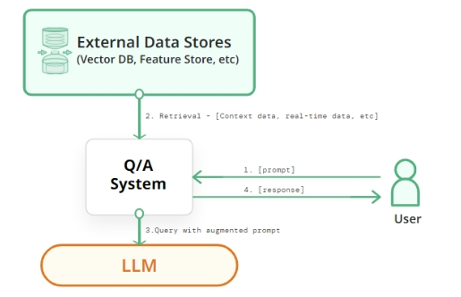
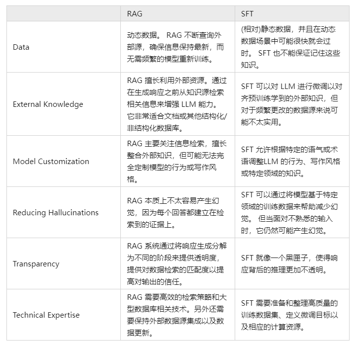
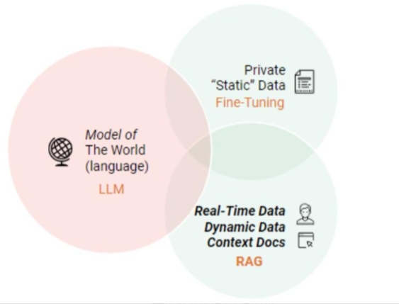
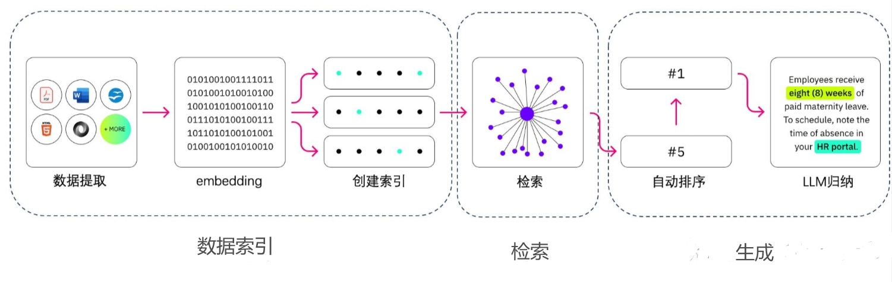
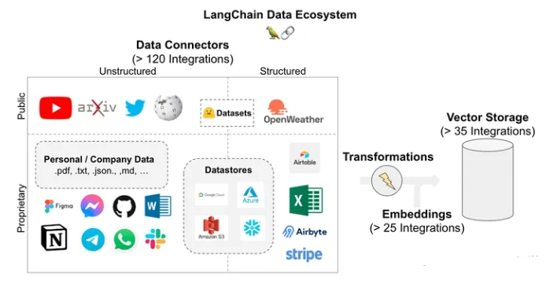
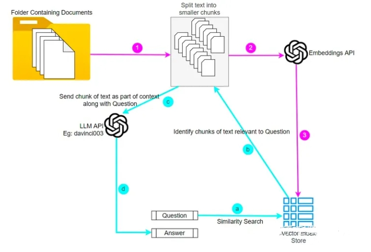
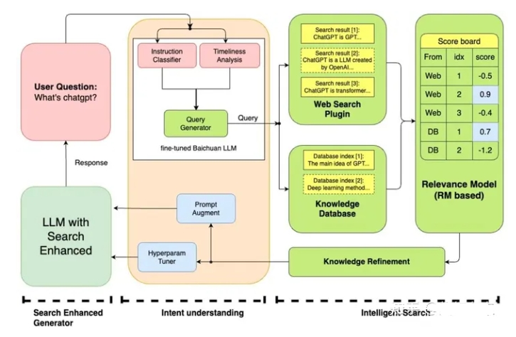
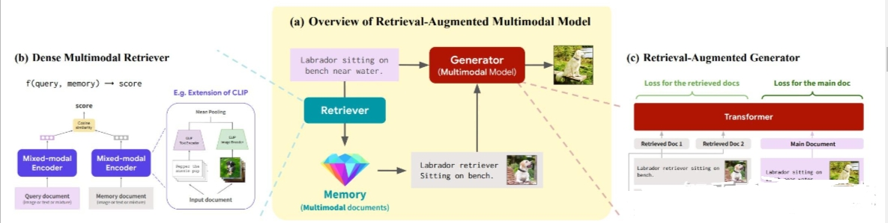

# RAG（Retrieval-Augmented Generation）面 

- [RAG（Retrieval-Augmented Generation）面](#ragretrieval-augmented-generation面)
  - [一、LLMs 已经具备了较强能力了，存在哪些不足点?](#一llms-已经具备了较强能力了存在哪些不足点)
  - [二、什么是 RAG?](#二什么是-rag)
    - [2.1 R：检索器模块](#21-r检索器模块)
      - [2.1.1 如何获得准确的语义表示？](#211-如何获得准确的语义表示)
      - [2.1.2 如何协调查询和文档的语义空间？](#212-如何协调查询和文档的语义空间)
      - [2.1.3 如何对齐检索模型的输出和大语言模型的偏好？](#213-如何对齐检索模型的输出和大语言模型的偏好)
    - [2.2 G：生成器模块](#22-g生成器模块)
      - [2.2.1 生成器介绍](#221-生成器介绍)
      - [2.2.2 如何通过后检索处理提升检索结果？](#222-如何通过后检索处理提升检索结果)
      - [2.2.3 如何优化生成器应对输入数据？](#223-如何优化生成器应对输入数据)
  - [三、使用 RAG 的好处?](#三使用-rag-的好处)
  - [四、RAG V.S. SFT](#四rag-vs-sft)
  - [五、介绍一下 RAG 典型实现方法？](#五介绍一下-rag-典型实现方法)
    - [5.1 如何 构建 数据索引？](#51-如何-构建-数据索引)
    - [5.2 如何 对数据进行 检索（Retrieval）？](#52-如何-对数据进行-检索retrieval)
    - [5.3 对于 检索到的文本，如果生成正确回复？](#53-对于-检索到的文本如果生成正确回复)
  - [六、介绍一下 RAG 典型案例？](#六介绍一下-rag-典型案例)
    - [6.1 ChatPDF 及其 复刻版](#61-chatpdf-及其-复刻版)
    - [6.2 Baichuan](#62-baichuan)
    - [6.3 Multi-modal retrieval-based LMs](#63-multi-modal-retrieval-based-lms)
  - [七、RAG 存在什么问题？](#七rag-存在什么问题)
  - [致谢](#致谢)

## 一、LLMs 已经具备了较强能力了，存在哪些不足点?

在 LLM 已经具备了较强能力的基础上，仍然存在以下问题：

- **幻觉问题**：LLM 文本生成的底层原理是基于概率的 token by token 的形式，因此会不可避免地产生“一本正经的胡说八道”的情况；
- **时效性问题**：LLM 的规模越大，大模型训练的成本越高，周期也就越长。那么具有时效性的数据也就无法参与训练，所以也就无法直接回答时效性相关的问题，例如“帮我推荐几部热映的电影？”；
- **数据安全问题**：通用的 LLM 没有企业内部数据和用户数据，那么企业想要在保证安全的前提下使用 LLM，最好的方式就是把数据全部放在本地，企业数据的业务计算全部在本地完成。而在线的大模型仅仅完成一个归纳的功能；

## 二、什么是 RAG?

RAG（Retrieval Augmented Generation, 检索增强生成），即 LLM 在回答问题或生成文本时，先会从大量文档中检索出相关的信息，然后基于这些信息生成回答或文本，从而提高预测质量。


> RAG for LLMs

### 2.1 R：检索器模块

在 RAG技术中，“R”代表检索，其作用是从大量知识库中检索出最相关的前 k 个文档。然而，构建一个高质量的检索器是一项挑战。研究探讨了三个关键问题：

#### 2.1.1 如何获得准确的语义表示？

在 RAG 中，语义空间指的是查询和文档被映射的多维空间。以下是两种构建准确语义空间的方法。

1. 块优化

处理外部文档的第一步是分块，以获得更细致的特征。接着，这些文档块被嵌入。

选择分块策略时，需要考虑被索引内容的特点、使用的嵌入模型及其最适块大小、用户查询的预期长度和复杂度、以及检索结果在特定应用中的使用方式。实际上，准确的查询结果是通过灵活应用多种分块策略来实现的，并没有最佳策略，只有最适合的策略。

2. 微调嵌入模型

在确定了 Chunk 的适当大小之后，我们需要通过一个嵌入模型将 Chunk 和查询嵌入到语义空间中。如今，一些出色的嵌入模型已经问世，例如 UAE、Voyage、BGE等，它们在大规模语料库上预训练过

#### 2.1.2 如何协调查询和文档的语义空间？

在 RAG 应用中，有些检索器用同一个嵌入模型来处理查询和文档，而有些则使用两个不同的模型。此外，用户的原始查询可能表达不清晰或缺少必要的语义信息。因此，协调用户的查询与文档的语义空间显得尤为重要。研究介绍了两种关键技术：

1. 查询重写

一种直接的方式是对查询进行重写。

可以利用大语言模型的能力生成一个指导性的伪文档，然后将原始查询与这个伪文档结合，形成一个新的查询。

也可以通过文本标识符来建立查询向量，利用这些标识符生成一个相关但可能并不存在的“假想”文档，它的目的是捕捉到相关的模式。

此外，多查询检索方法让大语言模型能够同时产生多个搜索查询。这些查询可以同时运行，它们的结果一起被处理，特别适用于那些需要多个小问题共同解决的复杂问题。

2. 嵌入变换

在 Liu 于 2023 年提出的 LlamaIndex 中，研究者们通过在查询编码器后加入一个特殊的适配器，并对其进行微调，从而优化查询的嵌入表示，使之更适合特定的任务。

Li 团队在 2023 年提出的 SANTA 方法，就是为了让检索系统能够理解并处理结构化的信息。他们提出了两种预训练方法：一是利用结构化与非结构化数据之间的自然对应关系进行对比学习；二是采用了一种围绕实体设计的掩码策略，让语言模型来预测和填补这些被掩盖的实体信息。

#### 2.1.3 如何对齐检索模型的输出和大语言模型的偏好？

在 RAG流水线中，即使采用了上述技术来提高检索模型的命中率，仍可能无法改善 RAG 的最终效果，因为检索到的文档可能不符合大语言模型的需求。

因此，研究介绍了如下方法：

**大语言模型的监督训练**：REPLUG使用检索模型和大语言模型计算检索到的文档的概率分布，然后通过计算 KL 散度进行监督训练。

这种简单而有效的训练方法利用大语言模型作为监督信号，提高了检索模型的性能，消除了特定的交叉注意力机制的需求。

此外，也有一些方法选择在检索模型上外部附加适配器来实现对齐，这是因为微调嵌入模型可能面临一些挑战，比如使用 API 实现嵌入功能或计算资源不足等。因此，一些方法选择在检索模型上外部附加适配器来实现对齐。

除此之外，PKG通过指令微调将知识注入到白盒模型中，并直接替换检索模块，用于根据查询直接输出相关文档。

### 2.2 G：生成器模块

#### 2.2.1 生成器介绍

- 介绍：在 RAG 系统中，生成组件是核心部分之一
- 作用：将检索到的信息转化为自然流畅的文本。在 RAG 中，生成组件的输入不仅包括传统的上下文信息，还有通过检索器得到的相关文本片段。这使得生成组件能够更深入地理解问题背后的上下文，并产生更加信息丰富的回答。此外，生成组件还会根据检索到的文本来指导内容的生成，确保生成的内容与检索到的信息保持一致。

正是因为输入数据的多样性，我们针对生成阶段进行了一系列的有针对性工作，以便更好地适应来自查询和文档的输入数据。

#### 2.2.2 如何通过后检索处理提升检索结果？

- 介绍：后检索处理指的是，在通过检索器从大型文档数据库中检索到相关信息后，对这些信息进行进一步的处理、过滤或优化。
- 主要目的：提高检索结果的质量，更好地满足用户需求或为后续任务做准备。
- 后检索处理策略：包括信息压缩和结果的重新排序。

#### 2.2.3 如何优化生成器应对输入数据？

- 生成器工作：负责将检索到的信息转化为相关文本，形成模型的最终输出。
- 其优化目的：在于确保生成文本既流畅又能有效利用检索文档，更好地回应用户的查询。

RAG 的输入不仅包括查询，还涵盖了检索器找到的多种文档（无论是结构化还是非结构化）。一般在将输入提供给微调过的模型之前，需要对检索器找到的文档进行后续处理。

值得注意的是，RAG 中对生成器的微调方式与大语言模型的普通微调方法大体相同，包括有通用优化过程以及运用对比学习等。

## 三、使用 RAG 的好处?

RAG 方法使得开发者不必为每一个特定的任务重新训练整个大模型，只需要外挂上知识库，即可为模型提供额外的信息输入，提高其回答的准确性。RAG模型尤其适合知识密集型的任务。

- **可扩展性 (Scalability)**：减少模型大小和训练成本，并允许轻松扩展知识
- **准确性 (Accuracy)**：通过引用信息来源，用户可以核实答案的准确性，这增强了人们对模型输出结果的信任。
- **可控性 (Controllability)**：允许更新或定制知识
- **可解释性 (Interpretability)**：检索到的项目作为模型预测中来源的参考
- **多功能性 (Versatility)**：RAG 可以针对多种任务进行微调和定制，包括QA、文本摘要、对话系统等；
- **及时性**：使用检索技术能识别到最新的信息，这使 RAG 在保持回答的及时性和准确性方面，相较于只依赖训练数据的传统语言模型有明显优势。
- **定制性**：通过索引与特定领域相关的文本语料库，RAG 能够为不同领域提供专业的知识支持。
- **安全性**：RAG 通过数据库中设置的角色和安全控制，实现了对数据使用的更好控制。相比之下，经过微调的模型在管理数据访问权限方面可能不够明确。 

## 四、RAG V.S. SFT 

实际上，对于 LLM 存在的上述问题，SFT 是一个最常见最基本的解决办法，也是 LLM 实现应用的基础步骤。那么有必要在多个维度上比较一下两种方法：



当然这两种方法并非非此即彼的，合理且必要的方式是结合业务需要与两种方法的优点，合理使用两种方法。



## 五、介绍一下 RAG 典型实现方法？

RAG 的实现主要包括三个主要步骤：数据索引、检索和生成。



### 5.1 如何 构建 数据索引？

数据索引一般是一个离线的过程，主要是将私域数据向量化后构建索引并存入数据库的过程。主要包括：数据提取、文本分割、向量化（embedding）及创建索引等环节。

1. step 1：数据提取

即从原始数据到便于处理的格式化数据的过程，具体工程包括：

- **数据获取**：包括多格式数据（eg：PDF、word、markdown以及数据库和API等）加载、不同数据源获取等，根据数据自身情况，将数据处理为同一个范式；
  - **Doc类文档**：直接解析其实就能得到文本到底是什么元素，比如标题、表格、段落等等。这部分直接将文本段及其对应的属性存储下来，用于后续切分的依据；
  - **PDF类文档**：
    - 难点：如何完整恢复图片、表格、标题、段落等内容，形成一个文字版的文档。
    - 解决方法：使用了多个开源模型进行协同分析，例如版面分析使用了百度的PP-StructureV2，能够对Text、Title、Figure、Figure caption、Table、Table caption、Header、Footer、Reference、Equation10类区域进行检测，统一了OCR和文本属性分类两个任务；
  - **PPT类文档**：
    - 难点：如何对PPT中大量的流程图，架构图进行提取，因为这些图多以形状元素在PPT中呈现，如果光提取文字，大量潜藏的信息就完全丢失了。
    - 解决方法：将PPT转换成PDF形式，然后用上述处理PDF的方式来进行解析。
- **数据清洗**：对源数据进行去重、过滤、压缩和格式化等处理；
- **信息提取**：提提取数据中关键信息，包括文件名、时间、章节title、图片等信息。

2. Step 2: 文本分割（Chunking）

- 动机：
  - 由于文本可能较长，或者仅有部分内容相关的情况下，需要对文本进行分块切分
- 主要考虑两个因素：
  - embedding模型的Tokens限制情况；
  - 语义完整性对整体的检索效果的影响；
- 分块的方式有：
  - 句分割：以”句”的粒度进行切分，保留一个句子的完整语义。常见切分符包括：句号、感叹号、问号、换行符等；
  - 固定大小的分块方式：根据embedding模型的token长度限制，将文本分割为固定长度（例如256/512个tokens），这种切分方式会损失很多语义信息，一般通过在头尾增加一定冗余量来缓解。
  - 基于意图的分块方式：
    - 句分割：最简单的是通过句号和换行来做切分，常用的意图包有基于NLP的NLTK和spaCy；
    - 递归分割：通过分而治之的思想，用递归切分到最小单元的一种方式；
    - 特殊分割：用于特殊场景。
- 常用的工具：
  - langchain.text_splitter 库中的类CharacterTextSplitter：可以指定分隔符、块大小、重叠和长度函数来拆分文本。



3. Step 3: 向量化（embedding）及创建索引

- 向量化（embedding）
  - 思路：将文本、图像、音频和视频等转化为向量矩阵的过程，也就是变成计算机可以理解的格式。
  - 常见的embedding模型：
    - [ChatGPT-Embedding](https://platform.openai.com/docs/guides/embeddings/what-are-embeddings)
    - [ERNIE-Embedding V1](https://cloud.baidu.com/doc/WENXINWORKSHOP/s/alj562vvu)
    - [M3E](https://huggingface.co/moka-ai/m3e-base)
    - [BGE](https://huggingface.co/BAAI/bge-base-en-v1.5)
- 创建索引：
  - 思路：数据向量化后构建索引，并写入数据库的过程可以概述为数据入库过程。
  - 常用的工具：FAISS、Chromadb、ES、milvus等;
  - 注：一般可以根据业务场景、硬件、性能需求等多因素综合考虑，选择合适的数据库。

### 5.2 如何 对数据进行 检索（Retrieval）？

- 动机：检索环节是获取有效信息的关键环节
- 思路：
  - **元数据过滤**：当我们把索引分成许多chunks的时候，检索效率会成为问题。这时候，如果可以通过元数据先进行过滤，就会大大提升效率和相关度。
  - **图关系检索**：即引入知识图谱，将实体变成node，把它们之间的关系变成relation，就可以利用知识之间的关系做更准确的回答。特别是针对一些多跳问题，利用图数据索引会让检索的相关度变得更高；
  - **检索技术**：检索的主要方式还是这几种：
    - **向量化（embedding）相似度检索**：相似度计算方式包括欧氏距离、曼哈顿距离、余弦等；
    - **关键词检索**：这是很传统的检索方式，元数据过滤也是一种，还有一种就是先把chunk做摘要，再通过关键词检索找到可能相关的chunk，增加检索效率；
    - **全文检索**：
    - **SQL检索**：更加传统的检索算法。
  - **重排序（Rerank）**：相关度、匹配度等因素做一些重新调整，得到更符合业务场景的排序。
  - **查询轮换**：这是查询检索的一种方式，一般会有几种方式：
    - **子查询**：可以在不同的场景中使用各种查询策略，比如可以使用LlamaIndex等框架提供的查询器，采用树查询（从叶子结点，一步步查询，合并），采用向量查询，或者最原始的顺序查询chunks等；
    - **HyDE**：这是一种抄作业的方式，生成相似的或者更标准的 prompt 模板。

### 5.3 对于 检索到的文本，如果生成正确回复？

文本生成就是将原始 query 和检索得到的文本组合起来输入模型得到结果的过程，本质上就是个 prompt engineer ing 过程。

此外还有全流程的框架，如 Langchain 和 LlamaIndex ，都非常简单易用，如：

```s
from langchain.chat_models import ChatOpenAI
from langchain.schema.runnable import RunnablePassthrough

llm = ChatOpenAI(model_name="gpt-3.5-turbo", temperature=0)
rag_chain = {"context": retriever, "question": RunnablePassthrough()} | rag_prompt | llm
rag_chain.invoke("What is Task Decomposition?")
```

## 六、介绍一下 RAG 典型案例？

### 6.1 ChatPDF 及其 复刻版

 > 参考：https://www.chatpdf.com/

ChatPDF的实现流程如下：

1. ChatPDF首先读取PDF文件，将其转换为可处理的文本格式，例如txt格式；
2. ChatPDF会对提取出来的文本进行清理和标准化，例如去除特殊字符、分段、分句等，以便于后续处理。这一步可以使用自然语言处理技术，如正则表达式等；
3. ChatPDF使用OpenAI的Embeddings API将每个分段转换为向量，这个向量将对文本中的语义进行编码，以便于与问题的向量进行比较；
4. 当用户提出问题时，ChatPDF使用OpenAI的Embeddings API将问题转换为一个向量，并与每个分段的向量进行比较，以找到最相似的分段。这个相似度计算可以使用余弦相似度等常见的方法进行；
5. ChatPDF将找到的最相似的分段与问题作为prompt，调用OpenAI的Completion API，让ChatGPT学习分段内容后，再回答对应的问题；
6. ChatPDF会将ChatGPT生成的答案返回给用户，完成一次查询。



### 6.2 Baichuan

 > 参考：https://www.baichuan-ai.com/home



百川大模型的搜索增强系统融合了多个模块，包括:

- 指令意图理解:深入理解用户指令
- 智能搜索:精确驱动查询词的搜索
- 结果增强:结合大语言模型技术来优化模型结果生成的可靠性。

通过这一系列协同作用，大模型实现了更精确、智能的模型结果回答，通过这种方式减少了模型的幻觉。

### 6.3 Multi-modal retrieval-based LMs

> 参考：https://cs.stanford.edu/~myasu/blog/racm3/

RA-CM3 是一个检索增强的多模态模型，其包含了一个信息检索框架来从外部存储库中获取知识，具体来说，作者首先使用预训练的 CLIP 模型来实现一个检索器（retriever），然后使用 CM3 Transformer 架构来构成一个生成器（generator），其中检索器用来辅助模型从外部存储库中搜索有关于当前提示文本中的精确信息，然后将该信息连同文本送入到生成器中进行图像合成，这样设计的模型的准确性就会大大提高。



## 七、RAG 存在什么问题？

- **检索效果依赖 embedding 和检索算法**。目前可能检索到无关信息，反而对输出有负面影响；
- **大模型如何利用检索到的信息仍是黑盒的**。可能仍存在不准确（甚至生成的文本与检索信息相冲突）；
- **对所有任务都无差别检索 k 个文本片段，效率不高**，同时会大大增加模型输入的长度；
- **无法引用来源，也因此无法精准地查证事实**，检索的真实性取决于数据源及检索算法。


## 致谢

- NLP（廿一）：从 RAG 到 Self-RAG —— LLM 的知识增强 https://zhuanlan.zhihu.com/p/661465330
- 基于多向量检索器的多模态 RAG 实现:https://xie.infoq.cn/article/e7ce7dee36a38fc04a4c88705
- Self-RAG 框架：更精准的信息检索与生成 https://cloud.tencent.com/developer/article/2356535
- 【进展】大模型自主调优的两种路径：Self-Instruct & Self-RAG https://zhuanlan.zhihu.com/p/664670894
- SELF-RAG - 自我反思的检索增强生成：学习检索、生成和批评 https://zhuanlan.zhihu.com/p/663814320
- 对于大模型RAG技术的一些思考 https://mp.weixin.qq.com/s?__biz=MzU1OTk1MDE2MQ==&mid=2247484541&idx=1&sn=87c558a76ffede9472b808f6ae8cdb32

