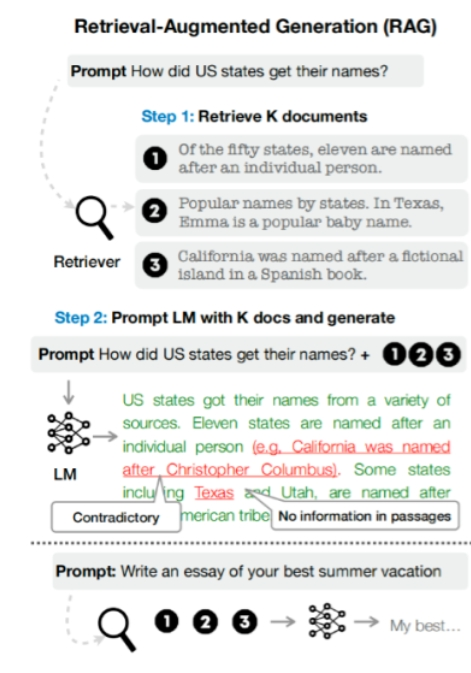
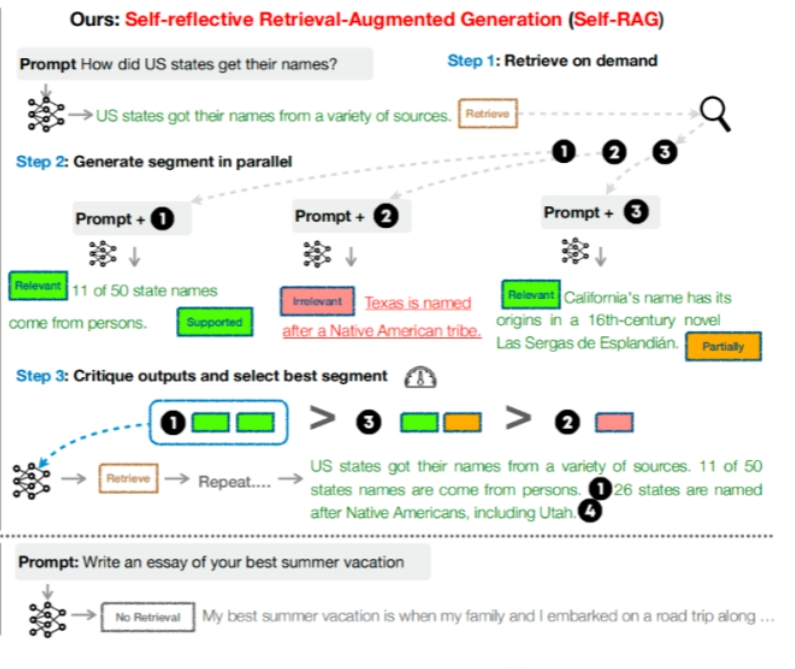
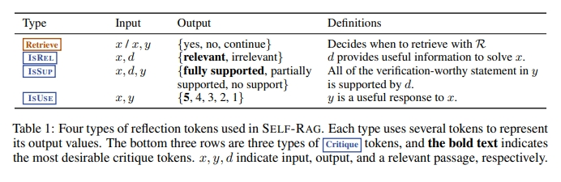
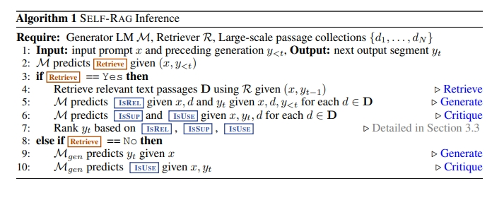
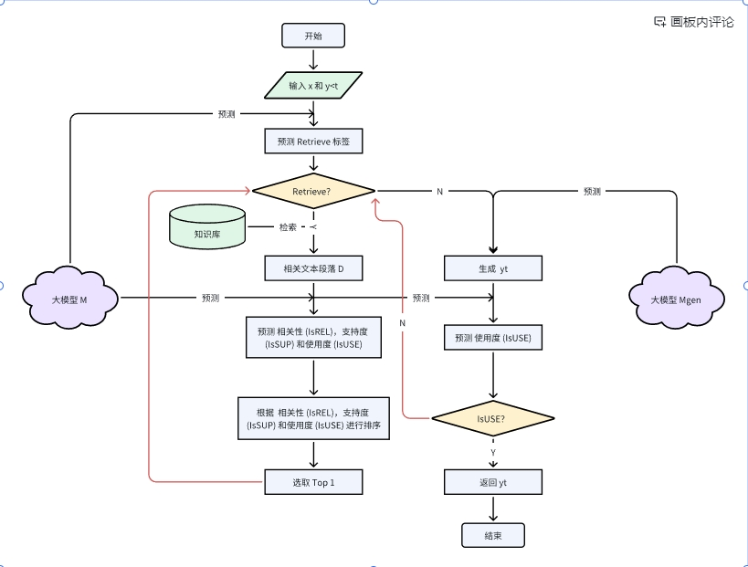
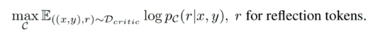
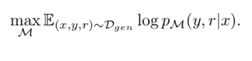
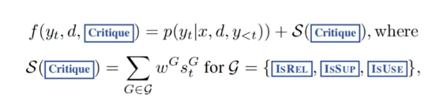
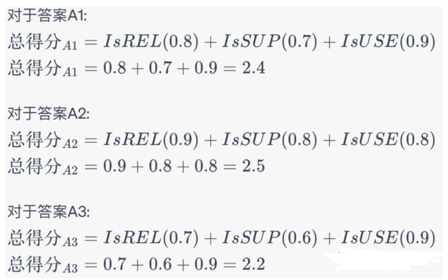

# Self-RAG 篇

> 论文名称：Self-RAG: Learning to Retrieve, Generate, and Critique through Self-Reflection
> 
> 论文链接: https://arxiv.org/abs/2310.11511
> 
> github: https://github.com/AkariAsai/self-rag.git

- [Self-RAG 篇](#self-rag-篇)
  - [一、动机](#一动机)
    - [1.1 LLMs 已经具备了较强能力了，存在哪些不足点?](#11-llms-已经具备了较强能力了存在哪些不足点)
    - [1.2 什么是 RAG?](#12-什么是-rag)
    - [1.3 RAG 存在什么问题？](#13-rag-存在什么问题)
  - [二、SELF-RAG 核心思想 是什么？](#二self-rag-核心思想-是什么)
  - [三、SELF-RAG 处理流程 是什么？](#三self-rag-处理流程-是什么)
  - [四、介绍一下 SELF-RAG 核心算法 是什么？](#四介绍一下-self-rag-核心算法-是什么)
  - [五、SELF-RAG 问题的形式化和概述？](#五self-rag-问题的形式化和概述)
    - [5.1 SELF-RAG 推理概述](#51-self-rag-推理概述)
    - [5.2 SELF-RAG 训练概述](#52-self-rag-训练概述)
  - [六、SELF-RAG 训练](#六self-rag-训练)
    - [6.1 训练评判模型(critic model)](#61-训练评判模型critic-model)
    - [6.2 训练生成模型(generator model)](#62-训练生成模型generator-model)
  - [七、Self-RAG 推理](#七self-rag-推理)
    - [7.1 基于阈值的自适应检索（Adaptive retrieval with threshold）](#71-基于阈值的自适应检索adaptive-retrieval-with-threshold)
    - [7.2 基于评判tokens的树解码（Tree-decoding with critique tokens）](#72-基于评判tokens的树解码tree-decoding-with-critique-tokens)
      - [7.2.1 基本框架](#721-基本框架)
      - [7.2.2 评判得分（critic score）的计算](#722-评判得分critic-score的计算)
      - [7.2.3 在解码过程中使用 Critique](#723-在解码过程中使用-critique)
      - [7.2.4 在多个偏好之间进行权衡](#724-在多个偏好之间进行权衡)
      - [7.2.5 举例说明树解码(tree-decoding)算法](#725-举例说明树解码tree-decoding算法)
  - [八、Self-RAG 优势](#八self-rag-优势)
  - [致谢](#致谢)

## 一、动机

### 1.1 LLMs 已经具备了较强能力了，存在哪些不足点?

在 LLM 已经具备了较强能力的基础上，仍然存在以下问题：

- **幻觉问题**：LLM 文本生成的底层原理是基于概率的 token by token 的形式，因此会不可避免地产生“一本正经的胡说八道”的情况；
- **时效性问题**：LLM 的规模越大，大模型训练的成本越高，周期也就越长。那么具有时效性的数据也就无法参与训练，所以也就无法直接回答时效性相关的问题，例如“帮我推荐几部热映的电影？”；
- **数据安全问题**：通用的 LLM 没有企业内部数据和用户数据，那么企业想要在保证安全的前提下使用 LLM，最好的方式就是把数据全部放在本地，企业数据的业务计算全部在本地完成。而在线的大模型仅仅完成一个归纳的功能；

### 1.2 什么是 RAG?

RAG（Retrieval Augmented Generation, 检索增强生成）:

- Step 1: 基于一个特定的提示（例如：“How did US states get their names?”）从数据源中检索K个文档;
- Step 2: 使用这K个检索到的文档来引导语言模型(LM)生成答案。


> RAG for LLMs

### 1.3 RAG 存在什么问题？

- **检索效果依赖 embedding 和检索算法**。目前可能检索到无关信息，反而对输出有负面影响；
- **大模型如何利用检索到的信息仍是黑盒的**。可能仍存在不准确（甚至生成的文本与检索信息相冲突）；
- **对所有任务都无差别检索 k 个文本片段，效率不高**，同时会大大增加模型输入的长度；
- **无法引用来源，也因此无法精准地查证事实**，检索的真实性取决于数据源及检索算法。

## 二、SELF-RAG 核心思想 是什么？

- 自反思的检索增强生成方法（SELF-RAG） 核心思想：**通过按需检索和自我反思来改进LLM的生成质量**。SELF-RAG会训练一个任意的LM，使其能够反思自己的生成过程，并生成任务输出和中间的特殊tokens（reflection tokens）。**这些reflection(反思) tokens被分类为检索tokens和批评tokens，分别表示需要检索的需求和其生成质量**。

## 三、SELF-RAG 处理流程 是什么？



- Step 1: **基于同样的提示，按需进行检索**。这意味着可能不是一次性检索所有文档，而是根据需要逐个检索;
- Step 2: **并行生成各个段落，每个提示后都跟着一个检索到的文档**。例如，Prompt + 1会生成与第一个文档相关的内容，同理，Prompt + 2和Prompt + 3也是如此;
- Step 3: **对输出进行评价，并选择最佳的段落**。这一步骤是Self-RAG的核心，它使模型能够评判自己的输出，选择最准确和相关的段落，并对其进行迭代或改进;

> 注：图片最下方还展示了Self-RAG模型在处理不同类型的问题时可能的行为。**例如，在请求写一篇关于“最佳夏日假期”的文章时，模型可能会选择不进行检索，直接生成答案。**

## 四、介绍一下 SELF-RAG 核心算法 是什么？

- SELF-RAG是一个增强语言模型质量和事实性的框架，**通过检索和自我反思实现**，而不损失原始创造性和多功能性。
- 该框架使模型可以**根据检索到的段落生成文本，并使用“反思tokens”自我评估输出的相关性和完整性**。
- 与普通的RAG方法不同，**SELF-RAG更加选择性地进行检索，确保从引用源获得完整支持**。



Table-1 展示了一个名为 "SELF-RAG" 的系统中使用的四种反思tokens的类型：

1. Retrieve：决策过程，它决定了是否从某个资源 R 中检索信息；
2. IsREL：验证过程，用于检查提供的响应 y 中的声明是否得到了数据 d 的支持；
3. IsSUP：验证过程，用于检查提供的响应 y 中的声明是否得到了数据 d 的支持；
4. IsUSE：评估过程，旨在评估给定的响应 y 对于问题 x 有多么有用。输出是一个从1到5的评分，5分代表最有用。

## 五、SELF-RAG 问题的形式化和概述？

### 5.1 SELF-RAG 推理概述

SELF-RAG 涉及三个主要组件：生成器语言模型（LM）、检索器（R）、以及大型文本段落集合（D）



- step 1：输入一个提示 x 和先前的生成 y<t；
- step 2：使用模型 M 预测是否需要检索；
- step 3：如果预测结果是“Yes”，则：
  - 1. 使用检索器 R 获取与输入 x 和 y_t-1 相关的文本段落 D；
  - 2. 模型预测每个检索到的文本段落 d 相对于输入 x 和生成的文本 yt 的相关性 (IsREL)，支持度 (IsSUP) 和使用度 (IsUSE)；
  - 3. 根据这些预测对 yt 进行排名；
- step 4：如果预测结果是“No”，则：
  - 1. 直接使用生成器模型 M_gen 预测输出 yt；
  - 2. 然后给定x, yt，预测输出是否有用；



该算法结合了检索和生成两种方法：

- 首先，它会判断是否需要检索信息。如果需要，它会从大型文本集合中检索相关段落；
- 然后基于这些信息进行生成。如果不需要检索，它会直接进行生成。

### 5.2 SELF-RAG 训练概述 

1. SELF-RAG 的目标

SELF-RAG 的设计**使得任意的语言模型（LM）可以生成包含“反思tokens”(reflection tokens) 的文本**。这些token来自于扩展的模型词汇（即，原始词汇加上反思tokens）。

2. 训练细节

生成模型M是在一个经过筛选的语料库上进行训练的，**该语料库包含由检索器R检索到的段落和由评判模型C预测的反思tokens**。

3. 评判模型C

它被训练用于生成反思tokens，这些tokens用于评估检索到的段落和给定任务的输出质量。

4. 使用评判模型的目的

在离线情况下，使用评判模型可以将反思tokens插入到任务输出中, 更新训练语料。

5. 最终训练的目标

使用传统的LM目标，训练最终的生成模型 ，使其能够自己生成反思tokens，而不需要在推理时依赖评判模型。

## 六、SELF-RAG 训练

### 6.1 训练评判模型(critic model)

1. 数据收集

利用GPT-4生成reflection tokens，然后将其知识提炼到一个内部评判模型C（in-house C）

2. 评判学习(critic learning)

- 训练数据集 D_critic；
- 使用预训练的LM（语言模型）对C进行初始化，训练评判模型的目标：最大化似然。希望最大化关于D_critic的期望值，其中期望值基于某些"reflection tokens"的条件概率的对数。



- 初始模型可以是任何预训练的LM，这里选择了与生成器LM相同的模型，即 Llama 2-7B
- 评判模型在大多数"reflection token"类别上达到了超过90%的与GPT-4基于的预测的一致性。

### 6.2 训练生成模型(generator model)

1. 数据收集

- 对于输出 y 中的每个片段 yt，模型会使用 C（评判模型）来评估是否需要进一步的检索。
- 如果需要检索，会添加一个特殊的检索token:  Retrieve=Yes，接着，R（检索算法）会检索最相关的 K 个文章或段落，记为 D。
- 对于每一个检索到的文章或段落，C（评判模型）会进一步评估这个段落是否与当前的任务相关，并给出一个 IsREL（是否相关）的预测。
- 如果该段落被认为是相关的，C 会进一步评估这个段落是否支持模型的生成，并给出一个 IsSUP（是否支持）的预测。
- IsUSE 可能代表着模型对检索到的内容的整体效用或有用性的评估。
- 最后，与反思tokens一起增强的输出和原始的输入对被添加到 Dgen，作为一个训练数据集。

2. 生成学习(generator learning)

- 使用反思tokens的经过修改过的语料库Dgen来训练生成器模型 
- 目标函数描述了最大化 M 在给定输入 x 的情况下，对输出 y 和相关的信息 r 的概率的对数似然。



- 与C（评判模型）训练不同，生成器M学习预测目标输出以及反思tokens。训练期间，将检索到的文本块（由<p>和</p>围绕）进行遮挡以进行损失计算。这意味着模型在计算损失时不考虑这些检索到的文本块。原始词汇V通过一组反思tokens（如<Critique>和<Retrieve>）进行扩展。这表示这些tokens被加入到词汇中，使模型能够使用这些特定的tokens来生成输出。

## 七、Self-RAG 推理

论文介绍了 SELF-RAG 模型如何在推理阶段生成反思tokens，这使得它能够自我评估其输出。这一功能使 SELF-RAG 能够在推理阶段进行控制，从而根据不同的任务需求调整其行为。

### 7.1 基于阈值的自适应检索（Adaptive retrieval with threshold）

1. SELF-RAG 可以动态决定何时检索文本段落，这是通过预测 Retrieve 来完成的。此外，框架还允许设定一个阈值；
2. 如果生成的token是 Retrieve=Yes， 且在所有输出tokens中的标准化值超过了指定的阈值，则触发检索。

### 7.2 基于评判tokens的树解码（Tree-decoding with critique tokens）

#### 7.2.1 基本框架

- 第1步：当每一步进行到t时，依据是否需要检索，可以基于硬或软条件进行。
- 第2步：R会检索出K个段落，而生成器M会处理这些段落，从中产生K个不同的续写候选。
- 第3步：之后进行一个段落级别的束搜索（使用beam size=B），从而在时间戳t获得最优的续写序列。
- 第4步：每一段的得分将根据与段落d的关系进行更新。

#### 7.2.2 评判得分（critic score）的计算

- 每个片段yt关于段落d的得分与每个critique token类型的标准化概率的线性加权和相关。
- 对于每一个critic token组（例如 IsREL），其在时间戳t的得分会被记作s^G_t。
- 计算一个段的得分（compute a segment score），计算公式如下图：



> 公式中参数说明: 
> ① p(yt | x, d, y<t) 是一个条件概率，表示给定输入x、段落d和之前的输出y<t时，产生输出yt的概率。而S(Critique)是critic token的得分。
> ② S(Critique)的计算是一个求和操作，涉及到所有的G组的critic token的加权得分。具体的组可以是IsREL, IsSUP, IsUSE等。
> ③ s^G_t: 这是最想要的reflection token的生成概率
> ④ G的不同可能值: critique token类型G可以有多个不同的值，例如: IsREL, IsSUP, IsUSE
> ⑤ 权重w^G: 这些权重是可以调整的超参数，以自定义模型在推理期间的行为。通过调整这些权重，可以强调某些期望的行为并降低其他行为。

#### 7.2.3 在解码过程中使用 Critique

在解码阶段强制执行硬约束(hard constraints)，这意味着模型可以被设置为基于这些critic token完全避免产生某些输出。

#### 7.2.4 在多个偏好之间进行权衡

在模型训练中平衡多个目标，模型需要在不同的输出偏好之间取得平衡。

#### 7.2.5 举例说明树解码(tree-decoding)算法

```s
第1步：初始化
输入：什么是机器学习？

第2步：检索阶段
假设我们的检索模块R从知识库中检索到了三个可能的相关段落K：
K1: “机器学习是一种数据分析方法...”
K2: “机器学习涉及使用算法...”
K3: “在机器学习中，计算机...”

第3步：生成阶段
使用生成器M，对于每个检索到的段落，尝试生成一个答案。得到：
A1: “机器学习是一种使计算机能够从数据中学习的技术。”
A2: “机器学习是使用算法来解析数据，从中学习，然后做出决策或预测的过程。”
A3: “机器学习是计算机不直接编程来执行任务的技术。”

第4步：评判得分(critic tokens)
对于每个答案，使用不同的critic token来评估其质量。
例如，我们使用以下critic token：
IsREL: 是否与问题相关
IsSUP: 是否有足够的支持信息
IsUSE: 是否有实用价值

得到的得分可能是：
A1: IsREL=0.8, IsSUP=0.7, IsUSE=0.9
A2: IsREL=0.9, IsSUP=0.8, IsUSE=0.8
A3: IsREL=0.7, IsSUP=0.6, IsUSE=0.9

第5步：总得分计算阶段
在此阶段，目标是为每个生成的答案或句子计算一个得分。这个得分是基于与所提取的文档或文献的关系而来。
首先，为每个答案计算基于critic token的总得分。我们可以使用权重为每个critic token加权，但为了简化，我们这里假设每个critic token的权重为1。
```



```s
第6步：选择最佳答案
beam search是一种启发式搜索策略，它在每一步中仅保留得分最高的k个解决方案，其中k是beam的大小。这样，它可以避免考虑所有可能的解决方案，从而更快地找到一个好的答案。

在我们的情境中，我们可以将每个答案看作是一个叶子节点，每个critic token都是树的一个层级。因此，基于每个critic token对答案进行评分就像是从树的根部到一个叶子节点的路径。

现在，让我们模拟一个beam size = 2的beam search：
①  (基于IsREL)
A1: 0.8
A2: 0.9
A3: 0.7
此时，只保留最高的两个得分，所以A2和A1进入beam。

②  (加上IsSUP)
我们只计算beam中的答案：
A1 的得分 = 0.8 + 0.7 = 1.5
A2 的得分 = 0.9 + 0.8 = 1.7
A3不在beam中，所以我们不再计算它的得分。此时，A2和A1的得分仍然是最高的，所以它们继续留在beam中。

③ (加上IsUSE)
再次，我们只计算beam中的答案：
A1 的总得分 = 1.5 + 0.9 = 2.4
A2 的总得分 = 1.7 + 0.8 = 2.5
A2有最高的总得分，所以它被选为最佳答案。
```

## 八、Self-RAG 优势

- 优势-1 ：SELF-RAG为每个段落提供了引用，并自我评估输出是否受到段落的支持，从而便于事实验证。
- 优势-2：SELF-RAG进一步提供了一个可定制的解码算法，满足由反思token预测定义的硬或软约束。特别地，我们的推理时间算法使我们能够：(1) 为不同的下游应用灵活地调整检索频率；(2) 通过段级束搜索(segment-level beam search)利用反思tokens概率的加权线性和作为段得分(segment score)，根据用户偏好定制模型的行为。

## 致谢

- Self-RAG 框架：更精准的信息检索与生成 https://cloud.tencent.com/developer/article/2356535
- 【进展】大模型自主调优的两种路径：Self-Instruct & Self-RAG https://zhuanlan.zhihu.com/p/664670894
- SELF-RAG - 自我反思的检索增强生成：学习检索、生成和批评 https://zhuanlan.zhihu.com/p/663814320

