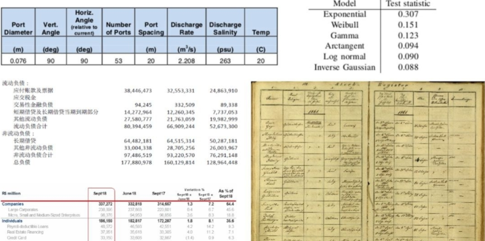

# 大模型（LLMs）RAG 版面分析——表格识别方法篇

- [大模型（LLMs）RAG 版面分析——表格识别方法篇](#大模型llmsrag-版面分析表格识别方法篇)
  - [一、为什么需要识别表格？](#一为什么需要识别表格)
  - [二、介绍一下 表格识别 任务？](#二介绍一下-表格识别-任务)
  - [三、有哪些 表格识别方法？](#三有哪些-表格识别方法)
    - [3.1 传统方法](#31-传统方法)
    - [3.2 pdfplumber表格抽取](#32-pdfplumber表格抽取)
      - [3.2.1 pdfplumber 如何进行 表格抽取？](#321-pdfplumber-如何进行-表格抽取)
      - [3.2.2 pdfplumber 常见的表格抽取模式？](#322-pdfplumber-常见的表格抽取模式)
    - [3.3 深度学习方法-语义分割](#33-深度学习方法-语义分割)
      - [3.3.1 table-ocr/table-detect：票据图片复杂表格框识别(票据单元格切割)](#331-table-ocrtable-detect票据图片复杂表格框识别票据单元格切割)
      - [3.3.2 腾讯表格图像识别](#332-腾讯表格图像识别)
      - [3.3.3 TableNet](#333-tablenet)
      - [3.3.4 CascadeTabNet](#334-cascadetabnet)
      - [3.3.5 SPLERGE](#335-splerge)
      - [3.3.6 DeepDeSRT](#336-deepdesrt)
  - [致谢](#致谢)

## 一、为什么需要识别表格？

表格的尺寸、类型和样式展现出多样化的特征，如背景填充的差异性、行列合并方法的多样性以及内容文本类型的不一致性等。同时，现有的文档资料不仅涵盖了现代电子文档，也包括历史的手写扫描文档，这些文档在样式设计、光照条件以及纹理特性等方面存在显著差异。因此，表格识别一直是文档识别领域的重大挑战。下图所示为一个示例：

> 注：左上：有颜色背景的全线表，右上：少线表，左中：无线表，左下：有复杂表格线条样式的表格，右下：拍照得到的手写历史文档。

## 二、介绍一下 表格识别 任务？

表格识别包括表格检测和表格结构识别两个子任务。

表格识别过程可细分为两个关键步骤：

- **表格定位（Table Localization）**：此阶段涉及识别并划定表格的整体边界，采用的技术手段包括但不限于目标检测算法，如YOLO、Faster RCNN或Mask RCNN，甚至有时借助生成对抗网络（GAN）来精确勾勒出表格的外在轮廓。

- **表格元素解析与结构重建（Table Element Parsing and Structure Reconstruction）**：
  - **表格单元格划分（Cell Detection）**：这一子任务着重于识别和区分表格内部的各个单元格，不论它们是由连续线条完全包围还是部分包围，抑或是无明显线条分隔。
  - **表格结构理解（Table Structure Understanding）**：在此环节中，系统深入分析表格区域以提取其中的数据内容及其内在逻辑关系，明确行与列的分布规律以及单元格之间的层次关联，最终实现对表格原始结构的高度准确复原。

## 三、有哪些 表格识别方法？

### 3.1 传统方法

利用规则指导和图像处理技术，执行如下步骤以识别结构：

1. 应用腐蚀与膨胀算法来细化和增强目标区域边界特征。
2. 通过分析像素连通性，确定并标记图像中的各个显著区域。
3. 实施线段检测和直线拟合技术，精确描绘出图像内的线性结构元素。
4. 计算这些线性结构之间的交点，以此构建可能的边框或连接关系网络。
5. 合并初步检测到的边界框（猜测框），运用智能合并策略减少冗余并提高精度。
6. 根据尺寸筛选优化，剔除不符合预期大小条件的候选区域，从而获得更为准确的目标识别结果。

### 3.2 pdfplumber表格抽取

> 参考：https://github.com/jsvine/pdfplumber#extracting-tables

#### 3.2.1 pdfplumber 如何进行 表格抽取？

1. 因为表格及单元格都是存在边界的（由可见或不可见的线表示），所以第一步，pdfplumber是找到可见的或猜测出不可见的候选表格线。
2. 因为表格以及单元格基本上都是定义在一块矩形区域内，所以第二步，pdfplumber是根据候选的表格线确定它们的交点。根据得到的交点，找到它们围成的最小的单元格。把连通的单元格整合到一起，生成一个检测出的表格对象。

#### 3.2.2 pdfplumber 常见的表格抽取模式？

- lattice抽取线框类的表格

1. 把pdf页面转换成图像
2. 通过图像处理的方式，从页面中检测出水平方向和竖直方向可能用于构成表格的直线。
3. 根据检测出的直线，生成可能表格的bounding box
4. 确定表格各行、列的区域
5. 根据各行、列的区域，水平、竖直方向的表格线以及页面文本内容，解析出表格结构，填充单元格内容，最终形成表格对象。

- stream抽取非线框类的表格

1. 通过pdfminer获取连续字符串（串行）
2. 通过文本对齐的方式确定可能表格的bounding box（文本块）
3. 确定表格各行、列的区域
4. 根据各行、列的区域以及页面上的文本字符串，解析表格结构，填充单元格内容，最终形成表格对象。

### 3.3 深度学习方法-语义分割

#### 3.3.1 table-ocr/table-detect：票据图片复杂表格框识别(票据单元格切割)

1. table-ocr

> https://github.com/chineseocr/table-ocr

- 思路：运用unet实现对文档表格的自动检测，表格重建

2. table-detect

> https://github.com/chineseocr/table-detect

- 思路：table detect(yolo) , table line(unet) （表格检测/表格单元格定位）

#### 3.3.2 腾讯表格图像识别

> github : https://github.com/tommyMessi/tableImageParser_tx

- 思路：图像分割，分割类别是4类：横向的线，竖向的线，横向的不可见线，竖向的不可见线，类间并不互斥，也就是每个像素可能同时属于多种类别，这是因为线和线之间有交点，交点处的像素是同属多条线的。
- 模型：对比DeepLab系列，fcn，Unet，SegNet等，收敛最快的是Unet。
- 已测试，效果惨不忍睹

#### 3.3.3 TableNet

- 论文：《TableNet: Deep Learning Model for End-to-end Table Detection and Tabular Data Extraction from Scanned Document Images》
- 论文链接：https://www.researchgate.net/publication/337242893_TableNet_Deep_Learning_Model_for_End-to-end_Table_Detection_and_Tabular_Data_Extraction_from_Scanned_Document_Images
- 简介：TableNet 是一个现代深度学习架构，由 TCS 研究年的团队在 2019 年提出。主要动机是通过手机或相机从扫描的表格中提取信息。他们提出了一个解决方案，其中包括准确检测图像中的表格区域，然后检测和提取检测到表的行和列中的信息。
- [数据集](https://www.icst.pku.edu.cn/cpdp/sjzy/index.htm)：使用的数据集是马莫特。它有2000页PDF格式，这是收集与相应的地面真相。这还包括中文页面。
- 架构：

该体系结构基于 Long 等人，这是用于语义分段的编码器解码器模型。相同的编码器/解码器网络用作用于表提取的 FCN 体系结构。使用 Tesseract OCR 对图像进行预处理和修改。

该模型分两个阶段派生，将输入主题为深度学习技术。在第一阶段，他们使用了预先训练的VGG-19网络的重量。它们已用 1x1 卷积层替换了已使用的 VGG 网络的完全连接层。所有卷积层后跟 ReLU 激活和概率 0.8 的辍学层。他们称第二阶段为解码网络，由两个分支组成。这是根据直觉，列区域是表区域的子集。因此，单个编码网络可以使用表和列区域的特征以更好的精度筛选出活动区域。第一个网络的输出将分发到两个分支。在第一个分支中，应用两个卷积操作，并升级最终要素图以满足原始图像尺寸。在用于检测列的另一个分支中，有一个附加的卷积层，具有 ReLU 激活函数，还有一个与前面提到的相同的辍学概率的辍学层。要素贴图在 （1x1） 卷积层后使用小步卷积进行向上采样。

- 输出：使用模型处理文档后，将生成表和列的掩码。这些蒙版用于从图像中筛选出表及其列区域。现在使用 Tesseract OCR，从分段区域中提取信息。
- 效果：他们还提出了与ICDAR进行微调的相同型号，其性能优于原始型号。微调车型的召回、精度和 F1 得分分别是 0.9628、0.9697 和 0.9662。原始模型的记录指标为 0.9621、0.9547、0.9583。

#### 3.3.4 CascadeTabNet

- 开源代码:
  - 开源代码（star:650）：https://github.com/DevashishPrasad/CascadeTabNet
  - 开源代码（star:1）：https://github.com/virtualsocie
- 介绍：

一种基于端到端深度学习的方法，它使用级联掩码R-CNN HRNet模型来进行表检测和结构识别。其优点：

1. 提出了级联网络：一种基于级联掩膜区域的CNN高分辨率网络(Cascade mask R-CNN HRNet)模型检查表的区域，同时从检测的表中识别结构体信息
2. 端到端解决表格检测和表格识别两个子任务
3. 用实例分割解决表检测，提高精度
4. 展示了一种有效的基于迭代迁移学习的方法，可以帮助模型使用少量的训练数据在不同类型的数据集上运行良好

> 采用两阶段转移学习策略，利用少量数据，使单个模型学习端到端表识别。在这一策略中，迁移学习在同一模型上进行两次。检测图像中的表成为CNN模型的一项特定任务，该模型先前在一个包含数十万个图像的数据集上训练，以检测来自上千个类的对象。因此，在转移学习的第一次迭代中，我们在训练前使用预先训练好的imagenetcoco模型权重初始化CNN模型。它使CNN模型只学习特定于任务的高级特征，同时获得了一些优点，如对训练数据的需求较少，以及由于预先知道而减少了总的训练时间。经过训练，CNN成功地预测了图像中表的检测掩码。类似地，在第二次迭代中，模型再次在较小的数据集上进行微调，以完成更具体的任务，即预测无边界表中的单元掩码，并根据表的类型检测表。另一个具有挑战性和特殊性的任务是针对特定类型的文档图像（latex文档）进行表检测。在执行迭代转移学习时，我们不会在任何阶段冻结模型中的任何层。

#### 3.3.5 SPLERGE

- 论文名称：Deep Splitting and Merging for Table Structure Decomposition
- 论文地址：https://ieeexplore.ieee.org/document/8977975
- 论文代码：https://github.com/CharlesWu123/SPLERGE
- 思想：一种先自顶向下、再自底向上的两阶段表格结构识别方法SPLERGE，分为Split和Merge两个部分。Split部分先把整个表格区域分割成表格所具有的网格状结构，该部分由图11所示的深度学习模块组成两个独立的模型，分别预测表格区域的行分割和列分割情况。最终，模型预测每一行或列像素是否属于单元格间的分隔符区域。而Merge部分则是对Split的结果中的每对邻接网格对进行预测，判断它们是否应该合并。

#### 3.3.6 DeepDeSRT

- 论文名称：DeepDeSRT:Deep Learning for Detection and Structure Recognition of Tables in Document Images
- 论文地址：https://www.dfki.de/fileadmin/user_upload/import/9672_PID4966073.pdf
- 论文代码：https://github.com/CharlesWu123/SPLERGE
- 思路：

DeepDeSRT 是一个神经网络框架，用于检测和理解文档或图像中的表。它有两个解决方案，如标题中提及：

1. 它提供了一个基于学习的深度解决方案，用于文档图像中的表检测。
2. 它提出了一种基于深度学习的表结构识别方法，即识别检测到的表中的行、列和单元格位置。

- 数据集：使用的数据集是 ICDAR 2013 表竞争数据集，包含 67 个文档，总页数为 238 页。
- 结构：

1. 表格检测：建议的模型使用快速 RCNN 作为检测表的基本框架。该体系结构分为两个不同的部分。在第一部分中，他们根据所谓的区域建议网络 （RPN） 的输入图像生成区域建议。第二部分，他们使用快速RCNN对区域进行分类。为了支持此体系结构，他们使用了ZFNet和 VGG-16 的权重。
2. 结构识别：成功检测到表并了解其位置后，了解其内容的下一个挑战是识别和定位构成表物理结构的行和列。因此，他们使用完全连接的网络与 VGG-16 的权重，从行和列中提取信息。

## 致谢

- 表格识别方法综述  https://zhuanlan.zhihu.com/p/385673899
- pdfplumber Extracting tables： https://github.com/jsvine/pdfplumber#extracting-tables
- Camelot: PDF Table Extraction for Humans：https://github.com/atlanhq/camelot
- https://iceflameworm.github.io/tags/表格检测/
- pdfplumber是怎么做表格抽取的（一）  https://zhuanlan.zhihu.com/p/100460222
- 走进AI时代的文档识别技术 之表格图像识别  https://cloud.tencent.com/developer/article/1452973
- 使用深度学习进行表检测、信息提取和构建  https://blog.csdn.net/yuquan0405/article/details/109602557

