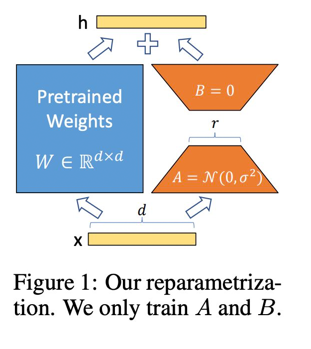
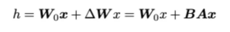
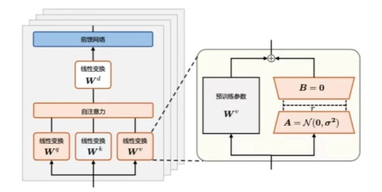
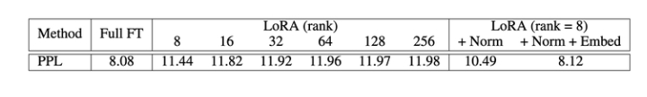
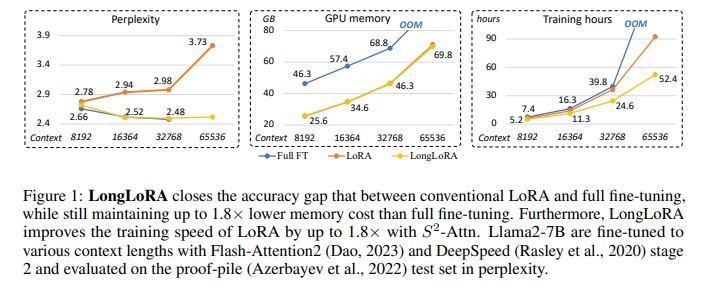
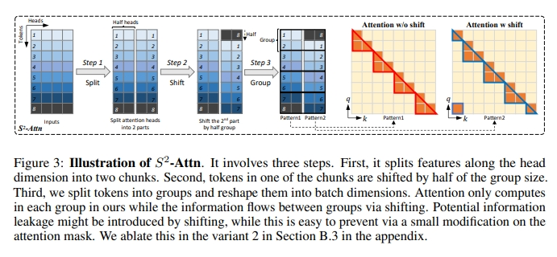
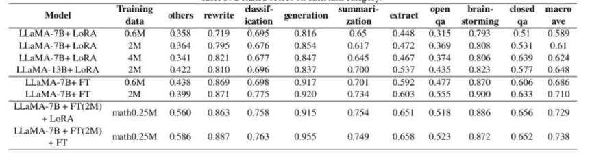
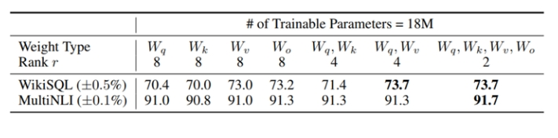

# LoRA 系列常见面试题篇

- [LoRA 系列常见面试题篇](#lora-系列常见面试题篇)
  - [一、LoRA篇](#一lora篇)
    - [1.1 什么是 LoRA？](#11-什么是-lora)
    - [1.2 LoRA 的思路是什么？](#12-lora-的思路是什么)
    - [1.3 LoRA 的特点是什么？](#13-lora-的特点是什么)
    - [1.4 简单描述一下 LoRA?](#14-简单描述一下-lora)
    - [1.5 解释一下 LORA 微调的原理和计算流程？](#15-解释一下-lora-微调的原理和计算流程)
  - [二、LoRA变体篇](#二lora变体篇)
    - [2.1 QLoRA篇](#21-qlora篇)
      - [2.1.1 QLoRA 的思路是怎么样的？](#211-qlora-的思路是怎么样的)
      - [2.1.2 QLoRA 的特点是什么？](#212-qlora-的特点是什么)
      - [2.1.3 QLORA相比LORA做了哪些改进?](#213-qlora相比lora做了哪些改进)
    - [2.2 AdaLoRA篇](#22-adalora篇)
      - [2.2.1 AdaLoRA 的思路是怎么样的？](#221-adalora-的思路是怎么样的)
    - [2.3 LongLoRA篇](#23-longlora篇)
      - [2.3.1 为什么需要 LongLoRA？](#231-为什么需要-longlora)
      - [2.3.2 LongLoRA 思路是什么？](#232-longlora-思路是什么)
      - [2.3.3 介绍一下 shift short attention？](#233-介绍一下-shift-short-attention)
  - [三、Lora的矩阵怎么初始化？为什么要初始化为全0？](#三lora的矩阵怎么初始化为什么要初始化为全0)
  - [四、LoRA权重是否可以合入原模型？](#四lora权重是否可以合入原模型)
  - [五、ChatGLM-6B LoRA后的权重多大？](#五chatglm-6b-lora后的权重多大)
  - [六、LoRA 微调优点是什么？](#六lora-微调优点是什么)
  - [七、LoRA微调方法为啥能加速训练？](#七lora微调方法为啥能加速训练)
  - [八、如何在已有LoRA模型上继续训练？](#八如何在已有lora模型上继续训练)
  - [九、LoRA 缺点是什么？](#九lora-缺点是什么)
  - [十、LoRA这种微调方法和全参数比起来有什么劣势吗？](#十lora这种微调方法和全参数比起来有什么劣势吗)
  - [十一、LORA应该作用于Transformer的哪个参数矩阵？](#十一lora应该作用于transformer的哪个参数矩阵)
  - [十二、LoRA 微调参数量怎么确定？](#十二lora-微调参数量怎么确定)
  - [十三、Rank 如何选取？](#十三rank-如何选取)
  - [十四、alpha参数 如何选取？](#十四alpha参数-如何选取)
  - [十五、LoRA 高效微调 如何避免过拟合？](#十五lora-高效微调-如何避免过拟合)
  - [十六、微调大模型时, 优化器如何？](#十六微调大模型时-优化器如何)
  - [十七、哪些因素会影响内存使用？](#十七哪些因素会影响内存使用)
  - [十八、LoRA权重是否可以合并？](#十八lora权重是否可以合并)
  - [十九、是否可以逐层调整LoRA的最优rank？](#十九是否可以逐层调整lora的最优rank)
    - [二十、LORA 微调有哪些超参数需要注意?](#二十lora-微调有哪些超参数需要注意)
  - [实践篇](#实践篇)
    - [1. LoRA 微调计算可训练参数的比例 如何确定？](#1-lora-微调计算可训练参数的比例-如何确定)
    - [2. LoRA 微调结果如何保存？](#2-lora-微调结果如何保存)
  - [致谢](#致谢)

## 一、LoRA篇

### 1.1 什么是 LoRA？

- 介绍： **固定大模型，增加低秩分解的矩阵来适配下游任务**，从而以极小的参数量来实现大模型的间接训练。

### 1.2 LoRA 的思路是什么？

在原模型旁边增加一个旁路，通过低秩分解（先降维再升维）来模拟参数的更新量；

1. 训练时，原模型固定，只训练降维矩阵A和升维矩阵B；
2. 推理时，可将BA加到原参数上，不引入额外的推理延迟；
3. 初始化，A采用高斯分布初始化，B初始化为全0，保证训练开始时旁路为0矩阵；

可插拔式的切换任务，当前任务W0+B1A1，将lora部分减掉，换成B2A2，即可实现任务切换；



> 秩的选取:对于一般的任务，rank=1,2,4,8足矣，而对于一些领域差距比较大的任务可能需要更大的rank。

### 1.3 LoRA 的特点是什么？

- 将BA加到W上可以消除推理延迟；
- 可以通过可插拔的形式切换到不同的任务；
- 设计的比较好，简单且效果好；

### 1.4 简单描述一下 LoRA?

LoRA的实现思想很简单，就是冻结一个预训练模型的矩阵参数，并选择用A和B矩阵来替代，在下游任务时只更新A和B。

### 1.5 解释一下 LORA 微调的原理和计算流程？

语言模型针对特定任务微调之后，权重矩阵通常具有很低的本征秩。

研究人员认为参数更新量即便投影到较小的子空间中，也不会影响学习的有效性因此，提出固定预训练模型参数不变，在原本权重矩阵旁路添加低秩矩阵的乘积作为可训练参数，用以模拟参数的变化量。

具体来说，假设预训练权重为 W0 ，可训练参数为 AW=BA。初始化时矩阵 A通过高斯函数初始化，矩阵 B为零初始化，使得训练开始之前旁路对原模型不造成影响即参数改变量为 0。对于该权重的输入x来说，输出为下式:



LORA 方法的计算流程如图所示:




## 二、LoRA变体篇

### 2.1 QLoRA篇

#### 2.1.1 QLoRA 的思路是怎么样的？

- 使用一种新颖的高精度技术将预训练模型量化为 4 bit；
- 然后添加一小组可学习的低秩适配器权重，这些权重通过量化权重的反向传播梯度进行微调。

#### 2.1.2 QLoRA 的特点是什么？

使用 QLoRA 微调模型，可以显著降低对于显存的要求。同时，模型训练的速度会慢于LoRA。

#### 2.1.3 QLORA相比LORA做了哪些改进?

QLORA(Quantized LoRA)是在LORA(Low-RankAdaptation)的基础上进行的改进，旨在进一步减少微调大语言模型时的内存占用，同时保持或仅轻微牺牲性能。以下是QLORA相比LORA所做的主要改进:

- 4-bit NormalFloat(NF4): QLORA引入了一种新的数据类型，即4-bit NormalFloat，这是一种理论上最优的数据类型，特别适用于正态分布的权重。这种数据类型通过确保每个量化箱有相同数量的值来避免量化误差，对于异常值的处理有好处。
- 双重量化(DoubleQuantization):QLORA采用了双重量化技术，即对量化常数进行量化，以进一步减少内存占用。这种方法通过量化第一层量化的常数作为输入，进行第二次量化，从而减少了量化常数本身的内存占用。
- 分页优化器(Paged0ptimizers):QLORA使用NVIDIA的统一内存特性，通过自动在CPU和GPU之间进行页面到页面的传输，来管理梯度更新时可能出现的内存峰值。这种方法允许在GPU内存不足时，将优化器状态自动转移到CPURAM，然后在需要时再将其移回GPU内存。
- 内存使用效率:QLORA通过上述技术显著降低了微调65B参数模型所需的平均内存需求，从需要超过780GB的GPU内存降低到小于48GB，而不会降低运行时间或预测性能。
- 性能保持:QLORA在减少内存需求的同时，能够保持与fp16微调基线相当的性能。这使得最大的公开可用模型能够在单个GPU上进行微调，大大提高了LLM微调的可访问性。

总的来说，QLORA通过结合量化技术和LORA的低秩适配器权重，实现了在保持性能的同时显著降低内存占用，使得在资源有限的硬件上微调大型模型成为可能。

### 2.2 AdaLoRA篇

#### 2.2.1 AdaLoRA 的思路是怎么样的？

对LoRA的一种改进，它**根据重要性评分动态分配参数预算给权重矩阵，将关键的增量矩阵分配高秩以捕捉更精细和任务特定的信息，而将较不重要的矩阵的秩降低，以防止过拟合并节省计算预算**。

### 2.3 LongLoRA篇

#### 2.3.1 为什么需要 LongLoRA？

- 问题一：用较长的上下文长度训练 LLM 的计算成本很高，需要大量的训练时间和 GPU 资源。

> 例如，对上下文长度为 8192 的自注意层进行训练需要的计算成本是 2048 的 16 倍。

- 问题二： LoRA 训练长语境模型既不够有效，也不够高效

LoRA 利用低秩矩阵来修改自我注意区块中的线性投影层，这种方法通常很有效，并能减少可训练参数的数量。

然而，使用 LoRA 训练长语境模型既不够有效，也不够高效。

> 就有效性而言，如表所示，**普通的低秩适应在长语境扩展中会导致较高的复杂度。将等级提高到更高的值**，例如rank = 256，并不能缓解这一问题。



> 在效率方面，**无论是否采用 LoRA，计算成本都会随着上下文规模的扩大而急剧增加，这主要是由于标准的self-attention机制造成的（Vaswani 等人，2017 年）**。如图 1 所示，即使采用 LoRA，当上下文窗口扩大时，标准 LLaMA2 模型的训练时间也会大幅增加。



#### 2.3.2 LongLoRA 思路是什么？

LongLoRA 从两个方面加快了 LLM 的上下文扩展：

- 思路一：shift short attention
  - 虽然在推理过程中需要密集的全局注意力，但通过sparse local attention可以有效地对模型进行微调。**LongLoRA 使用的shift short attention（$S^2$-Attn）可以有效地实现上下文扩展，从而节省大量计算量**，其性能与使用 vanilla attention进行微调的效果类似。特别是，在训练中只需两行代码即可实现，而在推理中则是可选的。
- 思路二：重新审视了上下文扩展的参数高效微调机制
  - LongLoRA 发现在可训练嵌入和规范化的前提下，用于上下文扩展的 LoRA 运行良好。LongLoRA 在从 7B/13B 到 70B 的 LLaMA2 模型的各种任务上都取得了很好的实证结果。LongLoRA 采用 LLaMA2 7B 从 4k 上下文到 100k，或 LLaMA2 70B 到 32k，在一台 8 * A100 机器上实现。LongLoRA 扩展了模型的上下文，同时保留了它们的原始架构，并与大多数现有技术兼容，如 FlashAttention-2。此外，为了使 LongLoRA 实用化，我们还收集了一个数据集 LongQA，用于监督微调。

#### 2.3.3 介绍一下 shift short attention？



shift short attention 包含三个步骤：

1. 首先，它将特征沿头部维度分成两块。
2. 其次，将其中一个块中的标记移动到组大小的一半。
3. 第三，我们将标记分成若干组，并将其重塑为批次维度。

在 LongLoRA 方法中，注意力只在每个组中进行计算，而标准自我注意力则在所有标记之间进行计算。组与组之间的信息流动是通过移位实现的。

## 三、Lora的矩阵怎么初始化？为什么要初始化为全0？

矩阵B被初始化为0，而矩阵A正常高斯初始化

如果B，A全都初始化为0，那么缺点与深度网络全0初始化一样，很容易导致梯度消失(因为此时初始所有神经元的功能都是等价的)。

如果B，A全部高斯初始化，那么在网络训练刚开始就会有概率为得到一个过大的偏移值Δ W 从而引入太多噪声，导致难以收敛。

因此，一部分初始为0，一部分正常初始化是为了在训练开始时维持网络的原有输出(初始偏移为0)，但同时也保证在真正开始学习后能够更好的收敛。

## 四、LoRA权重是否可以合入原模型？

可以，将训练好的低秩矩阵（B*A）+原模型权重合并（相加），计算出新的权重。

## 五、ChatGLM-6B LoRA后的权重多大？

rank 8 target_module query_key_value条件下，大约15M。

## 六、LoRA 微调优点是什么？

1. 一个中心模型服务多个下游任务，节省参数存储量
2. 推理阶段不引入额外计算量
3. 与其它参数高效微调方法正交，可有效组合
4. 训练任务比较稳定，效果比较好
5. LoRA 几乎不添加任何推理延迟，因为适配器权重可以与基本模型合并
6. 效果好，可插拔，不引入额外的推理延时

## 七、LoRA微调方法为啥能加速训练？

- **只更新了部分参数**：比如LoRA原论文就选择只更新Self Attention的参数，实际使用时我们还可以选择只更新部分层的参数；
- **减少了通信时间**：由于更新的参数量变少了，所以（尤其是多卡训练时）要传输的数据量也变少了，从而减少了传输时间；
- **采用了各种低精度加速技术**，如FP16、FP8或者INT8量化等。

这三部分原因确实能加快训练速度，然而它们并不是LoRA所独有的，事实上几乎都有参数高效方法都具有这些特点。**LoRA的优点是它的低秩分解很直观，在不少场景下跟全量微调的效果一致，以及在预测阶段不增加推理成本**。

## 八、如何在已有LoRA模型上继续训练？

理解此问题的情形是：已有的lora模型只训练了一部分数据，要训练另一部分数据的话，是在这个lora上继续训练呢，还是跟base 模型合并后再套一层lora，或者从头开始训练一个lora？

我认为把之前的LoRA跟base model 合并后，继续训练就可以，为了保留之前的知识和能力，训练新的LoRA时，加入一些之前的训练数据是需要的。另外，每次都重头来成本高。

## 九、LoRA 缺点是什么？

缺点很明显，**参与训练的模型参数量不多，也就百万到千万级别的参数量，所以效果比全量微调差很多。可能在扩散模型上感知没那么强，但在LLM上，个人感觉表现还是差距挺大的**。

## 十、LoRA这种微调方法和全参数比起来有什么劣势吗？

如果有足够计算资源以及有10k以上数据，我还是建议全参数微调，lora的一个初衷就是为了解决不够计算资源的情况下微调，只引入了少量参数，就可以在消费级gpu上训练，但lora的问题在于它不能节省训练时间，相比于全量微调，他要训练更久，同时因为可训练参数量很小，在同样大量数据训练下，比不过全量微调。



## 十一、LORA应该作用于Transformer的哪个参数矩阵？



从上图我们可以看到：

- 将所有微调参数都放到attention的某一个参数矩阵的效果并不好，将可微调参数平均分配到 Wq 和 Wk 的效果最好
- 即使是秩仅取4也能在 ∆W 中获得足够的信息 

因此在实际操作中，应当将可微调参数分配到多种类型权重矩阵中，而不应该用更大的秩单独微调某种类型的权重矩阵。

## 十二、LoRA 微调参数量怎么确定？

LoRA 模型中可训练参数的结果数量取决于低秩更新矩阵的大小，其主要由秩 r 和原始权重矩阵的形状确定。实际使用过程中，通过选择不同的 lora_target 决定训练的参数量。

> 以 LLama 为例：

```s
  --lora_target q_proj,k_proj,v_proj,o_proj,gate_proj,up_proj,down_proj 
```

## 十三、Rank 如何选取？

Rank的取值作者对比了1-64，**效果上Rank在4-8之间最好，再高并没有效果提升**。不过论文的实验是面向下游单一监督任务的，因此在指令微调上根据指令分布的广度，Rank选择还是需要在8以上的取值进行测试。

## 十四、alpha参数 如何选取？

alpha其实是个缩放参数，本质和learning rate相同，所以为了简化我默认让alpha=rank，只调整lr，这样可以简化超参。

## 十五、LoRA 高效微调 如何避免过拟合？

减小r或增加数据集大小可以帮助减少过拟合。还可以尝试增加优化器的权重衰减率或LoRA层的dropout值。

## 十六、微调大模型时, 优化器如何？

除了Adam和AdamW，其他优化器如Sophia也值得研究，它使用梯度曲率而非方差进行归一化，可能提高训练效率和模型性能。

## 十七、哪些因素会影响内存使用？

内存使用受到模型大小、批量大小、LoRA参数数量以及数据集特性的影响。例如，使用较短的训练序列可以节省内存。

## 十八、LoRA权重是否可以合并？

可以将多套LoRA权重合并。训练中保持LoRA权重独立，并在前向传播时添加，训练后可以合并权重以简化操作。

## 十九、是否可以逐层调整LoRA的最优rank？

理论上，可以为不同层选择不同的LoRA rank，类似于为不同层设定不同学习率，但由于增加了调优复杂性，实际中很少执行。

### 二十、LORA 微调有哪些超参数需要注意?

LORA(Low-RankAdaptation)微调时，主要涉及以下几个超参数需要注意:

- 秩(Rank):这是LORA中最重要的参数之一，它决定了LORA矩阵的秩或维度，直接影响模型的复杂度和容量。较高的r值意味着更强的表达能力，但可能导致过拟合;较低的r值可以减少过拟合，但可能降低表达能力。实验中建议的r值通常为1、2、4、8或64，其中4或8在大多数情况下效果最好。
- 缩放因子(Alpha):LORA引入了一个额外的缩放系数alpha，用于在前向传播过程中将LORA权重应用于预训练模型中。这个系数与秩参数rank一起使用，如下所示:scaling=alpha/rank。LoRA权重的值越大，其影响就越大。在实践中，将alpha设置为rank的两倍是一种常见的做法。
- 权重衰减(WeightDecay):在使用AdamW或SGD等优化器时，可以通过增加权重衰减率来帮助防止过拟合，特别是在选择较大的r值时。
- 学习率(LearningRate):学习率是微调过程中的关键超参数，需要根据模型和数据集的具体情况进行调整。
- 优化器选择:LORA微调可以使用不同的优化器，如SGD、Adam或AdamW。优化器的选择会影响内存占用和训练效率。
- 选代次数(Epochs):微调时的选代次数也是需要考虑的超参数。过多的选代可能导致过拟合，而迭代次数不足可能导致模型未能充分学习。
- 批次大小(Batchsize):批次大小会影响内存使用和训练速度，需要根据可用的硬件资源进行调整。
- 数据集大小和质量:虽然不是传统意义上的超参数，但数据集的大小和质量对LORA微调的效果有重要影响。高质量的数据集可以帮助模型更好地适应新任务。

## 实践篇

### 1. LoRA 微调计算可训练参数的比例 如何确定？

可以通过 numel 方法获取张量中参数的数量和 requires_grad 方法获取模型张量是否进行梯度计算来计算可训练参数的比例：

```s
# 打印可训练参数
def print_trainable_params(model: torch.nn.Module) -> None:
    trainable_params, all_param = 0, 0
    for param in model.parameters():
        num_params = param.numel()
        # if using DS Zero 3 and the weights are initialized empty
        if num_params == 0 and hasattr(param, "ds_numel"):
            num_params = param.ds_numel
        all_param += num_params
        if param.requires_grad:
            trainable_params += num_params
    print("trainable params: {:d} || all params: {:d} || trainable%: {:.4f}".format(
        trainable_params, all_param, 100 * trainable_params / all_param))
>>>
trainable params: 62586880 || all params: 13078451200 || trainable:0.4785 
```

### 2. LoRA 微调结果如何保存？


## 致谢

- [LLM] LongLoRA：高效微调长语境LLM｜LoRA对于长context finetune为什么不行了？ https://zhuanlan.zhihu.com/p/660843640


