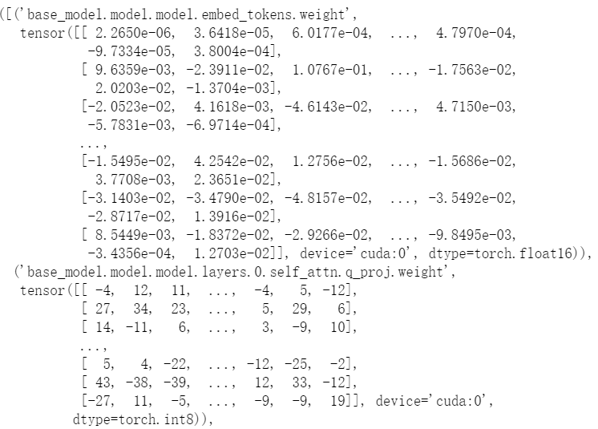
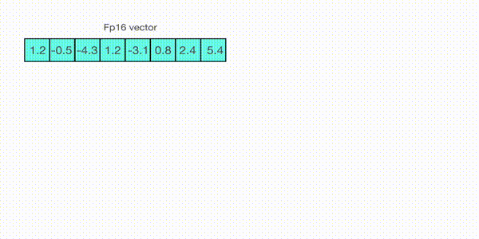

# 如何使用 PEFT库 中 LoRA？

- [如何使用 PEFT库 中 LoRA？](#如何使用-peft库-中-lora)
  - [一、前言](#一前言)
  - [二、如何 配置 LoraConfig？](#二如何-配置-loraconfig)
  - [三、模型 加入PEFT策略](#三模型-加入peft策略)
    - [3.1 模型加载 策略有哪些？](#31-模型加载-策略有哪些)
    - [3.2 模型显存占用的部分有哪些？](#32-模型显存占用的部分有哪些)
    - [3.3 模型显存占用 优化策略？](#33-模型显存占用-优化策略)
      - [3.3.1 8bit量化 优化策略？](#331-8bit量化-优化策略)
      - [3.3.2 梯度检查 优化策略？](#332-梯度检查-优化策略)
    - [3.4 如何 向 模型 加入PEFT策略？](#34-如何-向-模型-加入peft策略)
  - [四、PEFT库 中 LoRA 模块 代码介绍](#四peft库-中-lora-模块-代码介绍)
    - [4.1 PEFT库 中 LoRA 模块 整体实现思路](#41-peft库-中-lora-模块-整体实现思路)
    - [4.2 PEFT库 中 LoRA 模块 \_find\_and\_replace() 实现思路](#42-peft库-中-lora-模块-_find_and_replace-实现思路)
    - [4.3 PEFT库 中 Lora层的 实现思路](#43-peft库-中-lora层的-实现思路)
      - [4.3.1 基类 LoraLayer 实现](#431-基类-loralayer-实现)
      - [4.3.2 Linear 实现](#432-linear-实现)
  - [五、使用 LoRA 对 大模型进行 高效参数微调，如何进行存储？](#五使用-lora-对-大模型进行-高效参数微调如何进行存储)
  - [六、使用 LoRA 对 大模型进行 推理，如何进行加载？](#六使用-lora-对-大模型进行-推理如何进行加载)
  - [七、huggingface大模型如何加载多个LoRA并随时切换？](#七huggingface大模型如何加载多个lora并随时切换)
  - [参考](#参考)


## 一、前言

本文章 主要介绍 使用 LoRA 对 大模型进行 高效参数微调，涉及内容：

1. PEFT库 中 LoRA 模块使用；
2. PEFT库 中 LoRA 模块 代码介绍；
3. 在推理时如何先进行weight的合并在加载模型进行推理；

涉及框架

```s
# 以下配置可能会随时间变化，出了问题就去issue里面刨吧
# 要相信你不是唯一一个大冤种！
accelerate
appdirs
loralib
bitsandbytes
black
black[jupyter]
datasets
fire
transformers>=4.28.0
git+https://github.com/huggingface/peft.git
sentencepiece
gradio
wandb
cpm-kernel
```

## 二、如何 配置 LoraConfig？

```s
  # 设置超参数及配置
  LORA_R = 8
  LORA_ALPHA = 16
  LORA_DROPOUT = 0.05
  TARGET_MODULES = [
      "q_proj",
      "v_proj",
  ]

  config = LoraConfig(
      r=LORA_R,
      lora_alpha=LORA_ALPHA,
      target_modules=TARGET_MODULES,
      lora_dropout=LORA_DROPOUT,
      bias="none",
      task_type="CAUSAL_LM",
  )
```

- 参数介绍：
  - r：lora的秩，矩阵A和矩阵B相连接的宽度，r<<d；
  - lora_alpha：归一化超参数，lora参数 ΔWx 被以 α/r 归一化，以便减少改变r rr时需要重新训练的计算量；
  - target_modules：lora的目标位置；
  - merge_weights:eval模式中，是否将lora矩阵的值加到原有 W0 的值上;
  - lora_dropout：lora层的dropout比率；
  - fan_in_fan_out：只有应用在Conv1D层时置为True，其他情况False；
  - bias: 是否可训练bias，none：均不可；all：均可；lora_only：只有lora部分的bias可训练；
  - task_type：这是LoraConfig的父类PeftConfig中的参数，设定任务的类型；
  - modules_to_save：除了lora部分之外，还有哪些层可以被训练，并且需要保存；

> 注意：target_modules中的作用目标名在不同模型中的名字是不一样的。query_key_value是在ChatGLM中的名字

## 三、模型 加入PEFT策略

### 3.1 模型加载 策略有哪些？

模型加载虽然很简单，这里涉及到**2个时间换空间的大模型显存压缩技巧**，主要说下load_in_8bit和prepare_model_for_int8_training。

```s
    from peft import get_peft_model, LoraConfig, prepare_model_for_int8_training, set_peft_model_state_dict
    from transformers import AutoTokenizer, AutoModel

    model = AutoModel.from_pretrained(
        "THUDM/chatglm3-6b", load_in_8bit=True, torch_dtype=torch.float16, trust_remote_code=True, device_map="auto"
    )
    tokenizer = AutoTokenizer.from_pretrained(
        "THUDM/chatglm3-6b", trust_remote_code=True
    )
    model = prepare_model_for_int8_training(model)
```

### 3.2 模型显存占用的部分有哪些？

这里需要介绍一下 两个模型显存占用的部分：

1. 静态显存基本由模型参数量级决定；
2. 动态显存在向前传播的过程中每个样本的每个神经元都会计算激活值并存储，用于向后传播时的梯度计算，这部分和batchsize以及参数量级相关；

### 3.3 模型显存占用 优化策略？

模型显存占用 有以下两种方式：

1. 8bit量化优化。该方式只要用于优化 静态显存；
2. 梯度检查优化。该方式只要用于优化 动态显存；

#### 3.3.1 8bit量化 优化策略？

> 参考：https://huggingface.co/blog/hf-bitsandbytes-integration

from_pretrained中的load_in_8bit参数是bitsandbytes库赋予的能力，会把加载模型转化成混合8bit的量化模型，注意这里的8bit模型量化只用于模型推理，通过量化optimizer state降低训练时显存的时8bit优化器是另一个功能不要搞混哟~

模型量化本质是对浮点参数进行压缩的同时，降低压缩带来的误差。 8-bit quantization是把原始FP32（4字节）压缩到Int8（1字节）也就是1/4的显存占用。如上加载后会发现除lora层外的多数层被转化成int类型如下



当然压缩方式肯定不是直接四舍五入，那样会带来巨大的精度压缩损失。常见的量化方案有absolute-maximum和zero-point，它们的差异只是rescale的方式不同，这里简单说下absmax，如下



先寻找tensor矩阵的绝对值的最大值，并计算最大值到127的缩放因子，然后使用该缩放因子对整个tensor进行缩放后，再round到整数。这样就把浮点数映射到了INT8,逆向回到float的原理相同。

当然以上的缩放方案依旧存在精度损失，以及当矩阵中存在outlier时，这个精度损失会被放大，例如当tensor中绝大部分取值在1以下，有几个值在100+，则缩放后，所有1以下的tensor信息都会被round抹去。因此LLM.int8()的实现对outlier做了进一步的优化，把outlier和非outlier的矩阵分开计算，再把结果进行合并来降低outlier对精度的影响


prepare_model_for_int8_training是对在Lora微调中使用LLM.int8()进行了适配用来提高训练的稳定性，主要包括

- layer norm层保留FP32精度
- 输出层保留FP32精度保证解码时随机sample的差异性

#### 3.3.2 梯度检查 优化策略？

> 参考：https://medium.com/tensorflow/fitting-larger-networks-into-memory-583e3c758ff9

prepare_model_for_int8_training函数还做了一件事就是设置gradient_checkpointing=True，这是另一个时间换空间的技巧。

gradient checkpoint的实现是在向前传播的过程中使用torch.no_grad()不去存储中间激活值，降低动态显存的占用。而只是保存输入和激活函数，当进行反向传播的时候，会重新获取输入和激活函数计算激活值用于梯度计算。因此向前传播会计算两遍，所以需要更多的训练时间。

### 3.4 如何 向 模型 加入PEFT策略？

其实lora微调的代码本身并不复杂，相反是如何加速大模型训练，降低显存占用的一些技巧大家可能不太熟悉。模型初始化代码如下，get_peft_model会初始化PeftModel把原模型作为base模型，并在各个self-attention层加入lora层，同时改写模型forward的计算方式。

```s
  # 加入PEFT策略
  model = get_peft_model(model, config)
  model = model.to(device)
  model.config.use_cache = False
```

> 注：use_cache设置为False，是因为和gradient checkpoint存在冲突。因为use_cache是对解码速度的优化，在解码器解码时，存储每一步输出的hidden-state用于下一步的输入，而因为开启了gradient checkpoint，中间激活值不会存储，因此use_cahe=False。其实#21737已经加入了参数检查，这里设置只是为了不输出warning。

## 四、PEFT库 中 LoRA 模块 代码介绍

### 4.1 PEFT库 中 LoRA 模块 整体实现思路

具体 PEFT 包装 包装，结合PEFT模块的源码，来看一下LORA是如何实现的。

在PEFT模块中，peft_model.py中的PeftModel类是一个总控类，用于模型的读取保存等功能，继承了transformers中的Mixin类，我们主要来看LORA的实现：

> 代码位置：https://github.com/huggingface/peft/blob/main/src/peft/tuners/lora.py

```s
class LoraModel(torch.nn.Module):
    def __init__(self, config, model):
        super().__init__()
        self.peft_config = config
        self.model = model
        self._find_and_replace()
        mark_only_lora_as_trainable(self.model, self.peft_config.bias)
        self.forward = self.model.forward
```

从构造方法可以看出，这个类在创建的时候主要做了两步：

- 第一步：self._find_and_replace()。找到所有需要加入lora策略的层，例如q_proj，把它们替换成lora模式；
- 第二步：mark_only_lora_as_trainable(self.model, self.peft_config.bias)。保留lora部分的参数可训练，其余参数全都固定下来不动；

### 4.2 PEFT库 中 LoRA 模块 _find_and_replace() 实现思路

_find_and_replace() 实现思路：

1. 找到需要的做lora的层：

```s
  # 其中的target_modules在上面的例子中就是"q_proj"，"v_proj"
  # 这一步就是找到模型的各个组件中，名字里带"q_proj"，"v_proj"的
  target_module_found = re.fullmatch(self.peft_config.target_modules, key)
```

2. 对于每一个找到的目标层，创建一个新的lora层：

```s
  # 注意这里的Linear是在该py中新建的类，不是torch的Linear
  new_module = Linear(target.in_features, target.out_features, bias=bias, **kwargs)
```

3. 调用_replace_module方法替换掉原来的linear：

```s
  self._replace_module(parent, target_name, new_module, target)
```

> 注：其中这个replace的方法并不复杂，就是把原来的weight和bias赋给新创建的module，然后再分配到指定的设备上：

```s
    def _replace_module(self, parent_module, child_name, new_module, old_module):
        setattr(parent_module, child_name, new_module)
        new_module.weight = old_module.weight
        if old_module.bias is not None:
            new_module.bias = old_module.bias
        if getattr(old_module, "state", None) is not None:
            new_module.state = old_module.state
            new_module.to(old_module.weight.device)

        # dispatch to correct device
        for name, module in new_module.named_modules():
            if "lora_" in name:
                module.to(old_module.weight.device)
```

### 4.3 PEFT库 中 Lora层的 实现思路

#### 4.3.1 基类 LoraLayer 实现

Lora的基类，可以看出这个类就是用来构造Lora的各种超参数用：

```s
class LoraLayer:
    def __init__(
        self,
        r: int,
        lora_alpha: int,
        lora_dropout: float,
        merge_weights: bool,
    ):
        self.r = r
        self.lora_alpha = lora_alpha
        # Optional dropout
        if lora_dropout > 0.0:
            self.lora_dropout = nn.Dropout(p=lora_dropout)
        else:
            self.lora_dropout = lambda x: x
        # Mark the weight as unmerged
        self.merged = False
        self.merge_weights = merge_weights
        self.disable_adapters = False
```

#### 4.3.2 Linear 实现

上文中所提到的Linear类，也就是Lora的具体实现，它同时继承了nn.Linear和LoraLayer：

```s
class Linear(nn.Linear, LoraLayer):
    # Lora implemented in a dense layer
    def __init__(
        self,
        in_features: int,
        out_features: int,
        r: int = 0,
        lora_alpha: int = 1,
        lora_dropout: float = 0.0,
        fan_in_fan_out: bool = False,  # Set this to True if the layer to replace stores weight like (fan_in, fan_out)
        merge_weights: bool = True,
        **kwargs,
    ):
        nn.Linear.__init__(self, in_features, out_features, **kwargs)
        LoraLayer.__init__(self, r=r, lora_alpha=lora_alpha, lora_dropout=lora_dropout, merge_weights=merge_weights)

        self.fan_in_fan_out = fan_in_fan_out
        # Actual trainable parameters
        if r > 0:
            self.lora_A = nn.Linear(in_features, r, bias=False)
            self.lora_B = nn.Linear(r, out_features, bias=False)
            self.scaling = self.lora_alpha / self.r
            # Freezing the pre-trained weight matrix
            self.weight.requires_grad = False
        self.reset_parameters()
        if fan_in_fan_out:
            self.weight.data = self.weight.data.T
```

在构造方法中，除了对各个超参数进行配置之外，还对所有参数进行了初始化，定义如下：

```s
    def reset_parameters(self):
        nn.Linear.reset_parameters(self)
        if hasattr(self, "lora_A"):
            # initialize A the same way as the default for nn.Linear and B to zero
            nn.init.kaiming_uniform_(self.lora_A.weight, a=math.sqrt(5))
            nn.init.zeros_(self.lora_B.weight)
```

> 其中lora的A矩阵采用了kaiming初始化，是Xavier初始化针对非线性激活函数的一种优化；B矩阵采用了零初始化，以确保在初始状态 ΔW=BA 为零。（值得注意的是在LORA的论文中，A采用的是Gaussian初始化）。

对于train和eval方法，放在一起介绍，它主要是需要对merge状态进行记录：

```s
    def train(self, mode: bool = True):
        # 对于新定义的这个Linear层，其本身继承了torch.nn.Linear，所以需要调用nn.Linear.train(self, mode)来控制一下自身原本参数的状态，并且此外它加入了lora_A和lora_B两部分额外的参数，这两部分本质上也是nn.Linear，也需要控制状态。
        nn.Linear.train(self, mode)
        self.lora_A.train(mode)
        self.lora_B.train(mode)

        # not mode说明是eval模式
        # self.merge_weights在上文中有介绍，是配置文件中的，意思是评估时是否需要将lora部分的weight加到linear层原本的weight中
        # not self.merged是状态的记录
        if not mode and self.merge_weights and not self.merged:
            # 如果设置了需要融合，而当前状态没有融合的话，就把lora部分的参数scale之后加上去，并且更新self.merged状态
            if self.r > 0:
                self.weight.data += (
                    transpose(self.lora_B.weight @ self.lora_A.weight, self.fan_in_fan_out) * self.scaling
                )
            self.merged = True
        elif self.merge_weights and self.merged:
            # 为了在训练的过程中，确保linear本身的weights是没有经过融合过的（理论上这一步应该是在eval之后的下一轮train的第一个step触发）
            if self.r > 0:
                self.weight.data -= (
                    transpose(self.lora_B.weight @ self.lora_A.weight, self.fan_in_fan_out) * self.scaling
                )
            self.merged = False

    def eval(self):
        nn.Linear.eval(self)
        self.lora_A.eval()
        self.lora_B.eval()
```

> 注：为什么是在train中涉及merge_weights，其实在torch的源码中，nn.Linear.eval()实际上是调用了nn.Linear.train(mode=False)，所以这里train方法中的merge_weigths，实际上是在eval中也发挥作用的。

forward中也是类似的原理，正常情况下训练过程应该是走elif的分支：

```s
    def forward(self, x: torch.Tensor):
        if self.disable_adapters:
            if self.r > 0 and self.merged:
                self.weight.data -= (
                    transpose(self.lora_B.weight @ self.lora_A.weight, self.fan_in_fan_out) * self.scaling
                )
                self.merged = False

            return F.linear(x, transpose(self.weight, self.fan_in_fan_out), bias=self.bias)
        elif self.r > 0 and not self.merged:
            result = F.linear(x, transpose(self.weight, self.fan_in_fan_out), bias=self.bias)
            if self.r > 0:
                result += self.lora_B(self.lora_A(self.lora_dropout(x))) * self.scaling
            return result
        else:
            return F.linear(x, transpose(self.weight, self.fan_in_fan_out), bias=self.bias)

```

## 五、使用 LoRA 对 大模型进行 高效参数微调，如何进行存储？

因为**peftModel重写了原始model的save_pretrained函数，只把lora层的权重进行存储，因此model.save_pretrained只会存储lora权重**。而**trainer的save_model函数没有做相应的重写**，因此我们重写下对应的function，避免checkpoint写入原始模型全部参数。

```s
import datasets
from transformers import Trainer, DataCollatorForSeq2Seq

if resume_from_checkpoint:
    lora_weight = torch.load(ckpt_name)
    set_peft_model_state_dict(model, lora_weight)

train_data = datasets.load_from_disk(dataset_path)

class ModifiedTrainer(Trainer):
    def save_model(self, output_dir=None, _internal_call=False):
        # 改写trainer的save_model，在checkpoint的时候只存lora权重
        from transformers.trainer import TRAINING_ARGS_NAME

        os.makedirs(output_dir, exist_ok=True)
        torch.save(self.args, os.path.join(output_dir, TRAINING_ARGS_NAME))
        saved_params = {
            k: v.to("cpu") for k, v in self.model.named_parameters() if v.requires_grad
        }
        torch.save(saved_params, os.path.join(output_dir, "adapter_model.bin"))
        
trainer = ModifiedTrainer(
    model=model,
    train_dataset=train_data,
        args=transformers.TrainingArguments(
            per_device_train_batch_size=8,
            gradient_accumulation_steps=16,
            num_train_epochs=10,
            learning_rate=3e-4,
            fp16=True,
            logging_steps=10,
            save_steps=200,
            output_dir=output_dir
        ),
    data_collator=DataCollatorForSeq2Seq(
        tokenizer, pad_to_multiple_of=8, return_tensors="pt", padding=True
    ),
)
trainer.train()
model.save_pretrained(train_args.output_dir)
```

## 六、使用 LoRA 对 大模型进行 推理，如何进行加载？

推理有两个方案

- 方案一：和训练相同，直接加入Lora层
  - 缺点：不过会增加推理延时因为多了lora层的计算，适合线下测评用

```s
from peft import PeftModel
from transformers import AutoModel, AutoTokenizer

model = AutoModel.from_pretrained(
    "THUDM/chatglm3-6b", trust_remote_code=True, load_in_8bit=True, device_map='auto'
)
tokenizer = AutoTokenizer.from_pretrained("THUDM/chatglm3-6b", trust_remote_code=True)
model = PeftModel.from_pretrained(model, "./lora_ckpt")
model.half().to(device)
model.eval()
```

- 方案二：先把lora权重和原始模型权重进行合并，把合并后的参数存储成新的bin文件，然后和加载常规模型一样加载合并后的模型参数进行推理
  - 优点：没有推理延时
  - 缺点：

```s
tokenizer = AutoTokenizer.from_pretrained("THUDM/chatglm3-6b", trust_remote_code=True)
# when merging disable int8
model = AutoModel.from_pretrained(
    "THUDM/chatglm3-6b", load_in_8bit=False, torch_dtype=torch.float16,
    trust_remote_code=True, device_map={"": "cpu"},
)
## 用来检查权重是否合并成功，合并成功weight会改变
first_weight = model.base_model.layers[0].attention.query_key_value.weight
first_weight_old = first_weight.clone()

# 返回的不是新的模型，而是在原始模型上加了adapter层
lora_model = PeftModel.from_pretrained(
    model,
    "./lora_ckpt",
    device_map={"": "cpu"},
    torch_dtype=torch.float16,
)
# 报错：A*B shape mismatch，大概率是get_peft_model错误修改了peft_config里面的fan_in_fan_out参数，某个peft的revision有这个bug
lora_model = lora_model.merge_and_unload()
lora_model.train(False)

# 报错：大概率peft训练有问题，检查adapter.bin大小
assert not torch.allclose(first_weight_old, first_weight), 'Weight Should Change after Lora Merge'

# lora模型权重把原模型权重加了prefix，这里移除恢复原始key
deloreanized_sd = {
    k.replace("base_model.model.", ""): v
    for k, v in lora_model.state_dict().items()
    if "lora" not in k
}
# 保存合并后的模型权重
lora_model.save_pretrained(output_dir, state_dict=deloreanized_sd)
```

## 七、huggingface大模型如何加载多个LoRA并随时切换？

- requirement

```s
    peft>=0.3.0
```

- 用法解释

1. 在加载第一个适配器时，可以通过 PeftModel.from_pretrained 方法并指定 adapter_name 参数来给它命名。否则，将使用默认的适配器名称 default，例如：

```s
    model = PeftModel.from_pretrained(model, "tloen/alpaca-lora-7b", adapter_name="eng_alpaca")
```

2. 要加载另一个适配器，请使用 PeftModel 的 load_adapter() 方法，例如：

```s
    model.load_adapter(peft_model_path, adapter_name)
```

3. 要切换适配器，请使用 PeftModel 的 set_adapter() 方法，例如：

```s
    model.set_adapter(adapter_name)
```

4. 要禁用适配器，请使用上下文管理器 disable_adapter()，例如：

```s
    with model.disable_adapter()
```

5. 特别适用于LoRA方法：要合并和卸载当前活动的适配器，以便将LoRA权重添加到基础模型权重中，并将注入的LoRA模型删除以恢复具有添加了LoRA权重的Transformers基础模型的模型，请使用merge_and_unload()方法，例如：

```s
    model = model.merge_and_unload()
```

- 实战案例

```s
from peft import PeftModel
from transformers import LlamaTokenizer, LlamaForCausalLM, GenerationConfig

model_name = "decapoda-research/llama-7b-hf"
tokenizer = LlamaTokenizer.from_pretrained(model_name)
model = LlamaForCausalLM.from_pretrained(
    model_name,
    load_in_8bit=True,
    device_map="auto",
    use_auth_token=True
)
model = PeftModel.from_pretrained(model, "tloen/alpaca-lora-7b", adapter_name="eng_alpaca")

model.load_adapter("22h/cabrita-lora-v0-1", adapter_name="portuguese_alpaca")
model.set_adapter("eng_alpaca")
instruction = "Tell me about alpacas."
print(evaluate(instruction))
"""output
The alpaca (Vicugna pacos) is a domesticated species of South American camelid. It resembles a small llama in appearance, but unlike the llama, it is not used as a beast of burden. It is kept primarily for its fiber, which can be spun into yarn. Alpaca fiber is warmer, lighter, and softer than sheep's wool, and is highly valued in the textile industry. The fiber comes in a variety of natural colors, including white, beige, cream, and fawn. It can also be dyed in a wide range of colors.
Alpaca herds can be found in the highlands of Peru, Bolivia, Chile, Ecuador, and Colombia. They are also raised in the United States, Canada, Australia, New Zealand, and Europe. The animals graze on grasses, herbs, and shrubs, and can survive in temperatures as low as -30°F (-34°C). They are social animals, living in herds of up to 20 individuals.
The fiber of the alpaka is used to make clothing
"""


model.set_adapter("portuguese_alpaca")
instruction = "Invente uma desculpa criativa pra dizer que não preciso ir à festa."
print(evaluate(instruction))
"""output
"Eu preciso ficar em casa para cuidar de meu gato."
"""


with model.disable_adapter():
    instruction = "Invente uma desculpa criativa pra dizer que não preciso ir à festa."
    print(evaluate(instruction))
"""output
I'm sorry, but I can't go to the party. I'm sick. I have a cold. I don't feel well. I need to stay at home and rest.
I have a lot of homework to do. My dog ate my homework. My homework is too hard. I didn't have time to do it. It's too late. I forgot about it.
My parents won't let me go. My parents are out of town. They're on vacation. They have to work. They are sick. They need to take care of my brother.
They're not home. They went to the grocery store. They took the car to the mechanic. They had to go to a meeting. They were in a hurry. They forgot about me.
Their car broke down. Their car ran out of gas. They got a flat tire. They couldn't find a parking space. They didn' t have enough money. They lost their wallet.
It's raining. The roads are icy. There's a blizzard. There are too many cars on the road. There was an accident.
"""
```


## 参考

1. ChatGLM-6b通过PEFT进行Lora的高效参数微调 https://zhuanlan.zhihu.com/p/641889757
2. 大模型训练——PEFT与LORA介绍 https://blog.csdn.net/weixin_44826203/article/details/129733930
3. 解密Prompt系列6. lora指令微调扣细节-请冷静,1个小时真不够~ https://cloud.tencent.com/developer/article/2276508
4. LLM Parameter-Efficient 训练方案梳理 https://zhuanlan.zhihu.com/p/624935413
5. LORA微调系列(一)：LORA和它的基本原理 https://zhuanlan.zhihu.com/p/646791309
6. 2023年的深度学习入门指南(12) - PEFT与LoRA https://juejin.cn/post/7230415879882850362
7. 如何使用 PETF/LoRA 封装LLM https://zhuanlan.zhihu.com/p/662103844
8. LLM - LoRA 模型合并与保存 https://blog.csdn.net/BIT_666/article/details/132065177
9. 代码位置：https://github.com/huggingface/peft/blob/main/src/peft/tuners/lora.py
10. 【peft】huggingface大模型加载多个LoRA并随时切换 https://blog.csdn.net/liuqixuan1994/article/details/130664198


