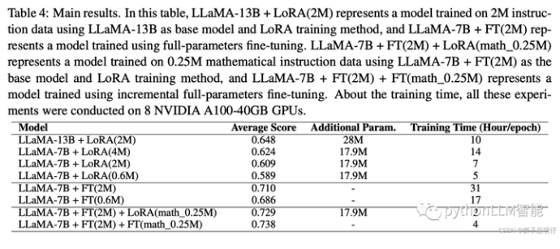
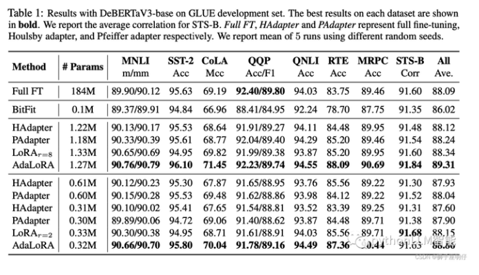
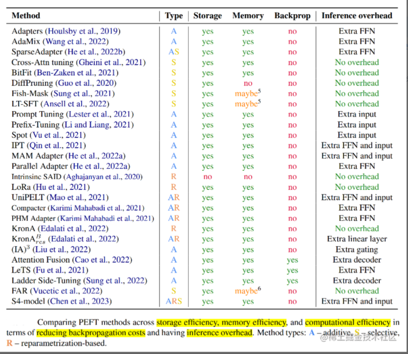
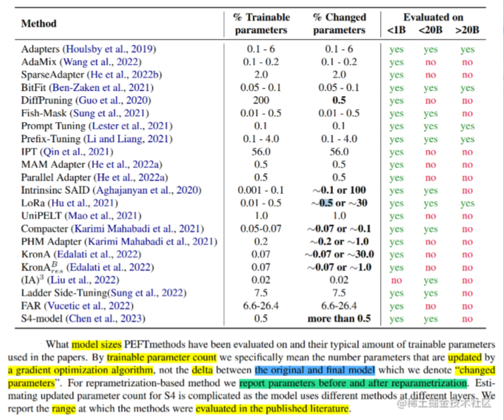

# 大模型（LLMs）参数高效微调(PEFT) 面

- [大模型（LLMs）参数高效微调(PEFT) 面](#大模型llms参数高效微调peft-面)
  - [1. 微调方法是啥？如何微调？](#1-微调方法是啥如何微调)
  - [2. 为什么需要 PEFT？](#2-为什么需要-peft)
  - [3. 介绍一下 PEFT？](#3-介绍一下-peft)
  - [4. PEFT 有什么优点？](#4-peft-有什么优点)
  - [5. 微调方法批处理大小模式GPU显存速度？](#5-微调方法批处理大小模式gpu显存速度)
    - [6. Peft 和 全量微调区别？](#6-peft-和-全量微调区别)
  - [7. 多种不同的高效微调方法对比](#7-多种不同的高效微调方法对比)
  - [8. 当前高效微调技术存在的一些问题](#8-当前高效微调技术存在的一些问题)
  - [9. 高效微调技术最佳实践](#9-高效微调技术最佳实践)
  - [10. PEFT 存在问题？](#10-peft-存在问题)
  - [11. 能不能总结一下各种参数高效微调方法？](#11-能不能总结一下各种参数高效微调方法)

## 1. 微调方法是啥？如何微调？

fine-tune，也叫全参微调，bert微调模型一直用的这种方法，全部参数权重参与更新以适配领域数据，效果好。

prompt-tune, 包括p-tuning、lora、prompt-tuning、adaLoRA等delta tuning方法，部分模型参数参与微调，训练快，显存占用少，效果可能跟FT（fine-tune）比会稍有效果损失，FT效果稍好于LoRA。



peft的论文《ADAPTIVE BUDGET ALLOCATION FOR PARAMETER- EFFICIENT FINE-TUNING》显示的结果：AdaLoRA效果稍好于FT。



## 2. 为什么需要 PEFT？

在面对特定的下游任务时，如果进行Full FineTuning（即对预训练模型中的所有参数都进行微调），太过低效；而如果采用固定预训练模型的某些层，只微调接近下游任务的那几层参数，又难以达到较好的效果。

## 3. 介绍一下 PEFT？

PEFT技术旨在**通过最小化微调参数的数量和计算复杂度，来提高预训练模型在新任务上的性能，从而缓解大型预训练模型的训练成本**。这样一来，即使计算资源受限，也可以利用预训练模型的知识来迅速适应新任务，实现高效的迁移学习。

## 4. PEFT 有什么优点？

PEFT技术可以在提高模型效果的同时，大大缩短模型训练时间和计算成本，让更多人能够参与到深度学习研究中来。除此之外，FEFT可以缓解全量微调带来灾难性遗忘的问题。

## 5. 微调方法批处理大小模式GPU显存速度？

微调方法批处理大小模式GPU显存速度

```s
 LoRA (r=8) 16 FP16 28GB 8ex/s
 LoRA (r=8) 8 FP16 24GB 8ex/s
 LoRA (r=8) 4 FP16 20GB 8ex/s
 LoRA (r=8) 4 INT8 10GB 8ex/s
 LoRA (r=8) 4 INT4 8GB 8ex/s
 P-Tuning (p=16) 4 FP16 20GB 8ex/s
 P-Tuning (p=16) 4 INT8 16GB 8ex/s
 P-Tuning (p=16) 4 INT4 12GB 8ex/s
 Freeze (l=3) 4 FP16 24GB 8ex/s
 Freeze (l=3) 4 INT8 12GB 8ex/s
```

### 6. Peft 和 全量微调区别？

所谓的 fune-tine 只能改变风格, 不能改变知识, 是因为我们的 fine-tune, 像是 LoRA 本来就是低秩的, 没办法对模型产生决定性的改变. 要是全量微调, 还是可以改变知识的.

## 7. 多种不同的高效微调方法对比

像P-Tuning v2、LoRA等都是综合评估很不错的高效微调技术。如果显存资源有限可以考虑QLoRA；如果只是解决一些简单任务场景，可以考虑P-Tuning、Prompt Tuning也行。

下表从参数高效方法类型、是否存储高效和内存高效、以及在减少反向传播成本和推理开销的计算高效五个维度比较了参数高效微调方法。



下表展示了各种参数高效方法的参与训练的参数量、最终模型与原始模型的改变参数（delta值）以及论文中参与评估的模型的范围（<1B、<20B、>20B）。



从表中可以看到，Prompt Tuning、Prefix Tuning、LoRA等少部分微调技术针对不同参数规模的模型进行过评估，同时，这几种方式也是目前应用比较多的高效微调方法。

## 8. 当前高效微调技术存在的一些问题

当前的高效微调技术很难在类似方法之间进行直接比较并评估它们的真实性能，主要的原因如下所示：

- **参数计算口径不一致**：参数计算可以分为三类：可训练参数的数量、微调模型与原始模型相比改变的参数的数量、微调模型和原始模型之间差异的等级。例如，DiffPruning更新0.5%的参数，但是实际参与训练的参数量是200%。这为比较带来了困难。尽管可训练的参数量是最可靠的存储高效指标，但是也不完美。 Ladder-side Tuning使用一个单独的小网络，参数量高于LoRA或BitFit，但是因为反向传播不经过主网络，其消耗的内存反而更小。
- **缺乏模型大小的考虑**：已有工作表明，大模型在微调中需要更新的参数量更小（无论是以百分比相对而论还是以绝对数量而论），因此（基）模型大小在比较不同PEFT方法时也要考虑到。
- **缺乏测量基准和评价标准**：不同方法所使用的的模型/数据集组合都不一样，评价指标也不一样，难以得到有意义的结论。
- **代码实现可读性差**：很多开源代码都是简单拷贝Transformer代码库，然后进行小修小补。这些拷贝也不使用git fork，难以找出改了哪里。即便是能找到，可复用性也比较差（通常指定某个Transformer版本，没有说明如何脱离已有代码库复用这些方法）。

## 9. 高效微调技术最佳实践

针对以上存在的问题，研究高效微调技术时，建议按照最佳实践进行实施：

- 明确指出参数数量类型。
- 使用不同大小的模型进行评估。
- 和类似方法进行比较。
- 标准化PEFT测量基准。
- 重视代码清晰度，以最小化进行实现。

## 10. PEFT 存在问题？

相比全参数微调，大部分的高效微调技术目前存在的两个问题：

1. 推理速度会变慢；
2. 模型精度会变差；

## 11. 能不能总结一下各种参数高效微调方法？

本文针对之前介绍的几种参数高效微调方法进行了简单的概述，主要有如下几类：

- 增加额外参数，如：Prefix Tuning、Prompt Tuning、Adapter Tuning及其变体。
- 选取一部分参数更新，如：BitFit。
- 引入重参数化，如：LoRA、AdaLoRA、QLoRA。
- 混合高效微调，如：MAM Adapter、UniPELT。

并比较了不同的高效微调方法之间的差异；同时，还指出当前大多数高效微调方法存在的一些问题并给出了最佳实践。


