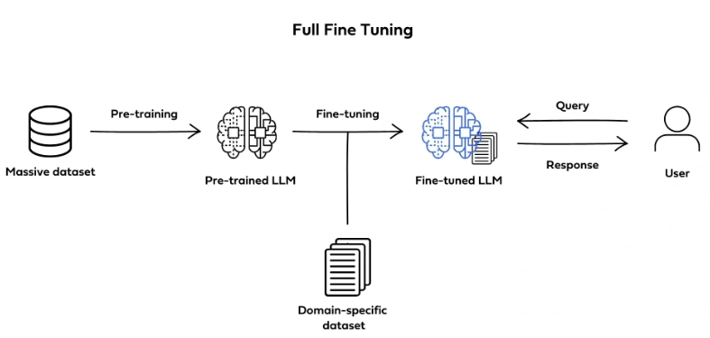
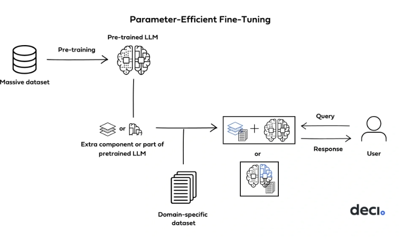

# SFT 对比篇

- [SFT 对比篇](#sft-对比篇)
  - [一、SFT 微调方案如何选择？](#一sft-微调方案如何选择)
  - [二、Full Fine Tuning vs Parameter-Efficient Fine-Tuning](#二full-fine-tuning-vs-parameter-efficient-fine-tuning)
  - [三、Full Fine Tuning 篇](#三full-fine-tuning-篇)
    - [3.1 介绍一下 Full Fine Tuning？](#31-介绍一下-full-fine-tuning)
    - [3.2 介绍一下 Full Fine Tuning 优点？](#32-介绍一下-full-fine-tuning-优点)
    - [3.3 介绍一下 Full Fine Tuning 缺点？](#33-介绍一下-full-fine-tuning-缺点)
  - [四、Parameter-Efficient Fine-Tuning 篇](#四parameter-efficient-fine-tuning-篇)
    - [4.1 介绍一下 Parameter-Efficient Fine-Tuning？](#41-介绍一下-parameter-efficient-fine-tuning)
  - [五、LoRA 篇](#五lora-篇)
    - [5.1 介绍一下 LoRA？](#51-介绍一下-lora)
    - [5.2 介绍一下 LoRA 流程？](#52-介绍一下-lora-流程)
    - [5.3 介绍一下 LoRA 优点？](#53-介绍一下-lora-优点)
    - [5.4 介绍一下 LoRA 缺点？](#54-介绍一下-lora-缺点)
  - [六、QLoRA 篇](#六qlora-篇)
    - [6.1 介绍一下 QLoRA？](#61-介绍一下-qlora)
    - [6.2 介绍一下 QLoRA 流程？](#62-介绍一下-qlora-流程)
  - [七、Adapter Tuning 篇](#七adapter-tuning-篇)
    - [6.1 介绍一下 Adapter Tuning？](#61-介绍一下-adapter-tuning)
    - [6.2 介绍一下 Adapter Tuning 流程？](#62-介绍一下-adapter-tuning-流程)
  - [八、Prefix Tuning 篇](#八prefix-tuning-篇)
    - [6.1 介绍一下 Prefix Tuning？](#61-介绍一下-prefix-tuning)
    - [6.2 介绍一下 Prefix Tuning 训练示例？](#62-介绍一下-prefix-tuning-训练示例)
  - [九、Prompt Tuning 篇](#九prompt-tuning-篇)
    - [9.1 介绍一下 Prompt Tuning？](#91-介绍一下-prompt-tuning)
    - [9.2 介绍一下 Prompt Tuning 优点？](#92-介绍一下-prompt-tuning-优点)
    - [9.3 介绍一下 Prompt Tuning 缺点？](#93-介绍一下-prompt-tuning-缺点)
    - [9.4 介绍一下 Prompt Tuning 训练示例？](#94-介绍一下-prompt-tuning-训练示例)
  - [十、P-Tuning 篇](#十p-tuning-篇)
    - [10.1 介绍一下 P-Tuning？](#101-介绍一下-p-tuning)
    - [10.2 介绍一下 P-Tuning 优点？](#102-介绍一下-p-tuning-优点)
    - [10.3 介绍一下 P-Tuning 缺点？](#103-介绍一下-p-tuning-缺点)
  - [十一、P-Tuning V2 篇](#十一p-tuning-v2-篇)
    - [11.1 介绍一下 P-Tuning V2？](#111-介绍一下-p-tuning-v2)
    - [11.2 介绍一下 P-Tuning V2 优点？](#112-介绍一下-p-tuning-v2-优点)
  - [致谢](#致谢)

## 一、SFT 微调方案如何选择？

- SFT 微调方案选择的影响因素：
  - 任务复杂性
  - 可用的数据量
  - 计算资源期望的性能
  - 泛化能力(是否过拟合)

> 例如，对于需要细粒度控制的复杂任务，P-Tuning v2或LSTM基础的P-Tuning可能更适合。而对于计算资源有限的情况，可以选择LORA或Adapter Tuning等方法。

## 二、Full Fine Tuning vs Parameter-Efficient Fine-Tuning

## 三、Full Fine Tuning 篇

### 3.1 介绍一下 Full Fine Tuning？

微调是在较小的、特定于任务的标注数据集上进一步训练已经预训练的 LLM 的过程。在完全微调中，所有模型参数都会更新，使其与预训练类似，只是它是在带标签且更小的数据集上完成的。

### 3.2 介绍一下 Full Fine Tuning 优点？

1. 比从头开始训练需要更少的数据
2. 提高准确性
3. 增强稳健性

### 3.3 介绍一下 Full Fine Tuning 缺点？

1. 计算成本高
2. 大量内存需求
3. 时间和专业知识密集

## 四、Parameter-Efficient Fine-Tuning 篇

### 4.1 介绍一下 Parameter-Efficient Fine-Tuning？

参数高效微调(PEFT)使用技术通过仅更新一小部分总参数来进一步调整预训练模型。PEFT保留了预训练的知识，同时可以进行更快、更高效的训练，

## 五、LoRA 篇

### 5.1 介绍一下 LoRA？

LoRA是Low-Rank Adaptation of LargeLanguage Models的缩写，是最常用的PEFT方法，使用重新参数化，该技术通过执行低秩近似来缩小可训练参数集的大小。

### 5.2 介绍一下 LoRA 流程？

1. 选择要调整的权重矩阵
2. 引入两个低秩矩阵
3. 计算低秩更新
4. 结合原始权重

### 5.3 介绍一下 LoRA 优点？

1. 任务切换效率高
2. 需要更少的GPU
3. 高精度

### 5.4 介绍一下 LoRA 缺点？

1. 多个任务的高精度微调，或者说足够复杂的任务下，表现可能不如全面微调

## 六、QLoRA 篇

### 6.1 介绍一下 QLoRA？

QLoaRA(Quantized Low-Rank Adaptation)是一种高效的模型微调方法，在LoRA的基础上引入了深度量化的过程。

QLORA使用一种新颖的高精度技术将预训练模型量化为4-bit。这种技术包括一种低精度存储数据类型(4-bit NormalFloat，简写为NF4)和一种计算数据类型(16-bit BrainFloat)。这样做可以在保持整个模型精度损失极小的同时减少存储需求。

### 6.2 介绍一下 QLoRA 流程？

1. 将模型用4-bit加载
2. 在训练时把数值反量化到bf16后进行训练

> 量化过程:
> 4-bit量化意味着每个权重仅由4个比特表示，量化过程需要选择哪些值最重要并将它们映射到这16个可能的值上。
> 首先确定量化的范围，比如从-1到1，然后将这个范围划分为16个区间，每个区间对应一个4-bit的值。
> 其次，将原始的32位浮点数值映射到最近的化区间上。例如，如果原始值是0.85，且0.8 和 0.9是两个最近的量化点，根据舍入规则，0.85可能被量化为0.8或0.9

## 七、Adapter Tuning 篇

### 6.1 介绍一下 Adapter Tuning？

Adapter Tuning在模型的每个层或者某些特定层之间插入小的神经网络模块，称为“adapter”，这些adapter是可以训练的，而原始模型的参数则保持不变。

### 6.2 介绍一下 Adapter Tuning 流程？

1. 预训练模型作为基础
2. 插入适配器
3. 保持预训练参数不变
4. 训练适配器
5. 任务特定的调整
6. 高效和灵活

## 八、Prefix Tuning 篇

### 6.1 介绍一下 Prefix Tuning？

Prefix Tuning:可学习前缀则更多地用于提供输入数据的直接上下文信息，这些前缀作为模型内部表示的一部分，可以影响整个模型的行为。

### 6.2 介绍一下 Prefix Tuning 训练示例？

> 输入序列: [Prefix1][Prefix2][Prefix3]"| want towatch a movie."
> 
> 问题:根据前缀生成后续的自然语言文本。
> 
> 答案:模型生成的文本，如“that is exciting andfun.”

> 提示:前缀本身提供上下文信息，没有单独的外部提示

## 九、Prompt Tuning 篇

### 9.1 介绍一下 Prompt Tuning？

Prompt Tuning:可学习向量(通常称为prompt tokens)旨在模仿自然语言提示的形式，它们被设计为引导模型针对特定任务生成特定类型的输出。这些向量通常被看作是任务指导信息的一部分，倾向于用更少量的向量模仿传统的自然语言提示。

### 9.2 介绍一下 Prompt Tuning 优点？

在处理多种任务时表现良好

### 9.3 介绍一下 Prompt Tuning 缺点？

可能在处理特别复杂或需要细粒度控制的任务时受限

### 9.4 介绍一下 Prompt Tuning 训练示例？

> 输入序列:[Prompt1][Prompt2]"这部电影令人振奋。"
> 
> 问题: 评价这部电影的情感倾向。
> 
> 答案:模型需要预测情感倾向(例如“积极”)
> 
> 提示:无明确的外部提示，[Prompt1][Prormpt2]充当引导模型的内部提示，因为这里的问题是隐含的，即判断文本中表达的情感倾向、

## 十、P-Tuning 篇

### 10.1 介绍一下 P-Tuning？

使用一个可训练的LSTM模型(称为prompt_encoder)来动态生成虚拟标记嵌入，允许根据输入数据的不同生成不同的嵌入，连续提示被插入到输入序列的embedding力，只作用于第一层。

### 10.2 介绍一下 P-Tuning 优点？

1. 更好的适应性和灵活性
2. 改进的上下文理解
3. 参数共享和泛化能力

### 10.3 介绍一下 P-Tuning 缺点？

1. 相对复杂，因为它设计一个额外的LSTM模型来生成虚拟标记嵌入
2. 约束了要优化的参数量
3. 模型层数越深，tuning的稳定性难以保证

## 十一、P-Tuning V2 篇

### 11.1 介绍一下 P-Tuning V2？

在P-Tuning的基础上，将只在第一层插入连续提示修改为在许多层都插入连续提示，而不仅仅是输入层

### 11.2 介绍一下 P-Tuning V2 优点？

应对复杂的NLU任务和小型模型方面，相比P-Tuning具有更出色的效能。

## 致谢

- LORA、P-Tuning等10种不同微调方案简述 https://www.xiaohongshu.com/explore/661f158c0000000003022da8

