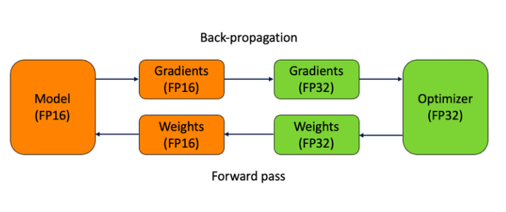

# 大模型（LLMs）推理面

- [大模型（LLMs）推理面](#大模型llms推理面)
  - [一、为什么大模型推理时显存涨的那么多还一直占着？](#一为什么大模型推理时显存涨的那么多还一直占着)
  - [二、大模型在gpu和cpu上推理速度如何？](#二大模型在gpu和cpu上推理速度如何)
  - [三、推理速度上，int8和fp16比起来怎么样？](#三推理速度上int8和fp16比起来怎么样)
  - [四、大模型有推理能力吗？](#四大模型有推理能力吗)
  - [五、大模型生成时的参数怎么设置？](#五大模型生成时的参数怎么设置)
  - [六、有哪些省内存的大语言模型训练/微调/推理方法？](#六有哪些省内存的大语言模型训练微调推理方法)
    - [6.1 如何 估算模型所需的RAM？](#61-如何-估算模型所需的ram)
    - [6.2 Fp16-mixed precision](#62-fp16-mixed-precision)
    - [6.3 Int8-bitsandbytes](#63-int8-bitsandbytes)
    - [6.4 LoRA](#64-lora)
    - [6.5 Gradient Checkpointing](#65-gradient-checkpointing)
    - [6.6 Torch FSDP+CPU offload](#66-torch-fsdpcpu-offload)
  - [七、如何让大模型输出合规化](#七如何让大模型输出合规化)
  - [八、应用模式变更](#八应用模式变更)
  - [九、模型输出的分布比较稀疏，怎么处理？](#九模型输出的分布比较稀疏怎么处理)
  - [十、在使用LLM（Lamma2模型）对同一组prompt重复进行5次 greedy 预测时，为什么针对相同的prompt，模型所得出的答案会出现不一致的情况？](#十在使用llmlamma2模型对同一组prompt重复进行5次-greedy-预测时为什么针对相同的prompt模型所得出的答案会出现不一致的情况)
  - [十一、如果做二分类的few shot任务，In Context Learning和Supervised Fine-tuning主要的区别是什么？](#十一如果做二分类的few-shot任务in-context-learning和supervised-fine-tuning主要的区别是什么)
  - [十二、大模型训练经常出现一些OOM问题，在现有硬件基础下，有什么性能提升trick](#十二大模型训练经常出现一些oom问题在现有硬件基础下有什么性能提升trick)
  - [十三、LLaMA模型输入句子理论上可以无限长吗？](#十三llama模型输入句子理论上可以无限长吗)
  - [十四、如何让大模型处理更长的文本？](#十四如何让大模型处理更长的文本)
  - [十五、大模型推理时，显存中有那几部分数据？](#十五大模型推理时显存中有那几部分数据)
  - [十六、如何让大模型处理更长的文本?](#十六如何让大模型处理更长的文本)

## 一、为什么大模型推理时显存涨的那么多还一直占着？

1. 首先，序列太长了，有很多Q/K/V；
2. 其次，因为是逐个预测next token，每次要缓存K/V加速解码。

## 二、大模型在gpu和cpu上推理速度如何？

7B量级下：
- cpu推理速度约10token/s；
- 单卡A6000和8核AMD的推理速度通常为 10:1。

## 三、推理速度上，int8和fp16比起来怎么样？

根据实践经验，int8模式一般推理会明显变慢（huggingface的实现）

## 四、大模型有推理能力吗？

大模型有推理能力。有下面2个方面的体现：

ChatGPT拥有in-context correction的能力，即如果说错了，给出矫正，ChatGPT能“听懂”错在哪儿了，并向正确的方向修正。in-context correction要比in-context learning难了太多，描述越详细清楚，ChatGPT回答得越好。要知道，越详细的描述，在预训练的文本里越难匹配到的。

在询问ChatGPT互联网上并不存在内容的时候，能给出较好答案（如用ChatGPT学建模）；ChatGPT能通过信息猜你心中的想法；你可以制定一个全新的游戏规则让ChatGPT和你玩，ChatGPT可以理解。

## 五、大模型生成时的参数怎么设置？

生成模型预测调参建议：

建议去调整下 top_p, num_beams, repetition_renalty, temperature, do_sample=True;
数据生成有重复，调高repetition_renalty；

生成任务表达单一的，样本也不多的，可适当调低 temperature，生成的样子跟训练集的比较像；如果要复现训练集的效果，temperature=0.01即可。

以上是经验参数，具体调参根据任务而定，不是固定的。

- 参数解释：

```s
top_p=0.9,
#Moderately increase the probability threshold of nucleus sampling to increase the quantity of candidate tokens and increase generation diversity.

temperature=1.0,
#The previous low temperature parameter could lead to a severe polarization in the probability distribution of generated words, which degenerates the generation strategy into greedy decoding.

do_sample=True,
#do_sample parameter is set to False by default. After setting to True, the generation methods turn into beam-search multinomial sampling decoding strategy.

no_repeat_ngram_size=6,
#Configure the probability of the next repeating n-gram to 0, to ensure that there are no n-grams appearing twice. This setting is an empirical preliminary exploration.

repetition_penalty=1.8,
#For words that have appeared before, in the subsequent prediction process, we reduce the probability of their reoccurrence by introducing the repetition_penalty parameter. This setting is an empirical preliminary exploration.
```

## 六、有哪些省内存的大语言模型训练/微调/推理方法？

- 动机：大模型（LLMs）现在是 NLP 领域的最主流方法之一，但是大模型的训练/微调/推理需要的内存也越来越多。

举例来说，即使 RTX 3090 有着 24GB 的 RAM，是除了 A100 之外显存最大的显卡。但使用一块 RTX 3090 依然无法 fp32 精度训练最小号的 LLaMA-6B。

- Memory-Efficient 的 LLMs 的训练/微调/推理方法
  - fp16
  - int8
  - LoRA
  - Gradient checkpointing
  - Torch FSDP
  - CPU offloading

### 6.1 如何 估算模型所需的RAM？

首先，我们需要了解如何根据参数量估计模型大致所需的 RAM，这在实践中有很重要的参考意义。

我们需要通过估算设置 batch_size，设置模型精度，选择微调方法和参数分布方法等。

接下来，我们用LLaMA-6B 模型为例估算其大致需要的内存。

首先考虑精度对所需内存的影响：

- fp32 精度，一个参数需要 32 bits, 4 bytes.
- fp16 精度，一个参数需要 16 bits, 2 bytes.
- int8 精度，一个参数需要 8 bits, 1 byte.

其次，考虑模型需要的 RAM 大致分三个部分：

- 模型参数
- 梯度
- 优化器参数
- 模型参数：等于参数量*每个参数所需内存。
  - 对于 fp32，LLaMA-6B 需要 6B*4 bytes = 24GB内存
  - 对于 int8，LLaMA-6B 需要 6B*1 byte = 6GB
- 梯度：同上，等于参数量*每个梯度参数所需内存。
- 优化器参数：不同的优化器所储存的参数量不同。

对于常用的 AdamW 来说，需要储存两倍的模型参数（用来储存一阶和二阶momentum）。

- fp32 的 LLaMA-6B，AdamW 需要 6B*8 bytes = 48 GB
- int8 的 LLaMA-6B，AdamW 需要 6B*2 bytes = 12 GB

除此之外，CUDA kernel 也会占据一些 RAM，大概 1.3GB 左右，查看方式如下。

```s
    > torch.ones((1，1)).to("cuda")
    > print_gpu_utilization()
    >>>
    GPU memory occupied: 1343 MB
```

综上，int8 精度的 LLaMA-6B 模型部分大致需要 6GB+6GB+12GB+1.3GB = 25.3GB 左右。
再根据LLaMA的架构（hidden_size = 4096, intermediate_size =11008, num_hidden_layers = 32, context_length = 2048）计算中间变量内存。
每个 instance 需要：

```s
    (4096 +11008)* 2048 *32 * 1byte = 990MB
```

所以一张 A100（80GB RAM）大概可以在 int8 精度；batch_size = 50 的设定下进行全参数训练。

查看消费级显卡的内存和算力：

> 2023 GPU Benchmark and Graphics Card Comparison Chart：https://www.gpucheck.com/gpu-benchmark-graphics-card-comparison-chart

### 6.2 Fp16-mixed precision



混合精度训练的大致思路是在 forward pass 和 gradient computation 的时候使用 fp16 来加速，但是在更新参数时使用 fp32。

> 用 torch 实现：

CUDA Automatic Mixed Precision examples：https://pytorch.org/docs/stable/notes/amp_examples.html

torch fp16 推理：直接使用 model.half() 将模型转换为fp16.
```s
    model.eval()
    model.half()
```

使用 Huggingface Transformers：在 TrainingArguments 里声明 fp16=Truehttps://huggingface.co/docs/transformers/perf_train_gpu_one#fp16-training

### 6.3 Int8-bitsandbytes

Int8 是个很极端的数据类型，它最多只能表示 - 128～127 的数字，并且完全没有精度。

为了在训练和 inference 中使用这个数据类型，bitsandbytes 使用了两个方法最大程度地降低了其带来的误差：

1. vector-wise quantization
2. mixed precision decompasition

Huggingface 在这篇文章中用动图解释了 quantization 的实现：https://huggingface.co/blog/hf-bitsandbytes-integration

> 论文：LLM.int8(): 8-bit Matrix Multiplication for Transformers at Scale：https://arxiv.org/abs/2208.07339

借助 Huggingface PEFT，使用 int8 训练 opt-6.5B 的完整流程：https://github.com/huggingface/peft/blob/main/examples/int8_training/Finetune_opt_bnb_peft.ipynb

### 6.4 LoRA

Low-Rank Adaptation 是微调 LLMs 最常用的省内存方法之一。


LoRA 发现再微调 LLMs 时，更新矩阵（update matrix）往往特别 sparse，也就是说 update matrix 是低秩矩阵。LoRA 的作者根据这一特点将 update matrix reparametrize 为两个低秩矩阵的积积 。

其中，，A 和 B 的秩为 r，且 。

如此一来，A+B 的参数量将大大小于 .

> LoRA 的论文：https://arxiv.org/pdf/2106.09685.pdf
> 
> 借助 Huggingface PEFT 框架，使用 LoRA 微调 mt0：https://github.com/huggingface/peft/blob/main/examples/conditional_generation/peft_lora_seq2seq.ipynb

### 6.5 Gradient Checkpointing

在 torch 中使用 - 把 model 用一个 customize 的 function 包装一下即可，详见：

Explore Gradient-Checkpointing in PyTorch：https://qywu.github.io/2019/05/22/explore-gradient-checkpointing.html

在 Huggingface Transformers 中使用：https://huggingface.co/docs/transformers/v4.27.2/en/perf_train_gpu_one#gradient-checkpointing

### 6.6 Torch FSDP+CPU offload

Fully Sharded Data Paralle（FSDP）和 DeepSpeed 类似，均通过 ZeRO 等分布优化算法，减少内存的占用量。其将模型参数，梯度和优化器状态分布至多个 GPU 上，而非像 DDP 一样，在每个 GPU 上保留完整副本。

CPU offload 则允许在一个 back propagation 中，将参数动态地从 GPU -> CPU, CPU -> GPU 进行转移，从而节省 GPU 内存。

> Huggingface 这篇博文解释了 ZeRO 的大致实现方法：https://huggingface.co/blog/zero-deepspeed-fairscale
> 
> 借助 torch 实现 FSDP，只需要将 model 用 FSDPwarp 一下；同样，cpu_offload 也只需要一行代码：https://pytorch.org/blog/introducing-pytorch-fully-sharded-data-parallel-api/
> 
> 在这个可以查看 FSDP 支持的模型：https://pytorch.org/docs/stable/fsdp.html
> 
> 在 Huggingface Transformers 中使用 Torch FSDP：https://huggingface.co/docs/transformers/v4.27.2/en/main_classes/trainer#transformers.Trainin
> 
> 根据某些 issue，shard_grad_op（只分布保存 optimizer states 和 gradients）模式可能比 fully_shard 更稳定：https://github.com/tatsu-lab/stanford_alpaca/issues/32

## 七、如何让大模型输出合规化

根据用户的输入问题内容，大模型进行生成回答的内容，但是生成的回答，不直接对外输出给用户。需要进行合规的处理，因为大模型的输出内容不可控，对于严肃的场景，以免引起用户的投诉。所以需要进合并处理。

目前处理的方法，模型生成内容，再把这些内容生成向量，再查询话术向量库，得到最相似的话术。如果查询结果或相似得分比较阈值低或者查询不到结果，则走兜底策略。兜底策略按用户所在的对话阶段，实验不同的兜底话术。或者使用万能兜底话术。

## 八、应用模式变更

机器人销售场景的case:

纯大模型AI模式，最初直接是大模型机器人直接和用户对话，全流程都是大模型对话走流程。

对比之前的AI（小模型意图、话术策略）+人工模式，发现之前的初始阶段通过率高些，初步判断可能是用户说的太发散，大模型不好收敛。

就调整为AI+大模型AI模式。这样前面的AI主要是小模型意图、话术策略模式，任务引导更明确。大模型可以更好的和有意向的用户进行交互，更容易引导用户成单。

## 九、模型输出的分布比较稀疏，怎么处理？

可以采用一些方法来处理模型输出的分布稀疏，例如使用softmax函数的温度参数调节来平滑输出分布，或者引入正则化技术，如Dropout，以减少模型对特定类别的过度依赖。

## 十、在使用LLM（Lamma2模型）对同一组prompt重复进行5次 greedy 预测时，为什么针对相同的prompt，模型所得出的答案会出现不一致的情况？

当同一个prompt与不同的prompt一同置于一个batch处理时，每个prompt的padding数量会依据 batch 中最长prompt的长度来确定，因此，原始prompt在添加相应padding后变成 prompt + padding，所以原先两个prompt其实不能exactly一致。虽然在Transformer模型中，对于padding部分在 attention 中通常会被设定为一个非常小的数值（如2-32+1），确保softmax(QTK)运算时，padding部分权重近乎为零，但鉴于大型模型结构的深度较大，这些累加起来的极小值在模型的最后一层仍有可能被放大并占据一定的权重，这就意味着padding部分事实上也会对最终预测结果产生影响。

## 十一、如果做二分类的few shot任务，In Context Learning和Supervised Fine-tuning主要的区别是什么？

In Context Learning主要是将few shot数据加入Prompt中，然后让模型进行预测，不改变模型的参数。而Supervised Fine-tuning主要把few shot数据进行继续训练。在真实场景中，In Context Learning对label准确率要求较低，也就是label在出错的情况下，仍然可以凭借模型本身能力完成准确预测。而Supervised Fine-tuning对label准确率要求较高，因为改变了模型参数，因此label必须准确。

## 十二、大模型训练经常出现一些OOM问题，在现有硬件基础下，有什么性能提升trick

- 梯度累积
- 混合精度训练
- 减轻模型参数
- 分布式训练
- 减少批量大小
- 增加硬件资源
- 数据处理与加载优化：例如，可以使用数据流水线技术来并行加载和处理数据，减少内存中同时存在的数据量

## 十三、LLaMA模型输入句子理论上可以无限长吗？

不可以

- 受限于计算资源
- 训练阶段长句子会导致梯度消失或者梯度爆炸（因为它依赖前面的词进行最大似然估计作为损失函数，这个最大似然估计化简一下就是连乘的形式，容易造成梯度消失或者梯度爆炸）
- 推理阶段会增加预测错误率

## 十四、如何让大模型处理更长的文本？

- 分块处理，同时重叠保证连贯性
- 增加模型参数量，复杂化模型架构，提高对更长文本的捕捉与表达能力

## 十五、大模型推理时，显存中有那几部分数据？

- 模型参数
- 输入数据
- 计算中间结果
- 内存管理策略：某些深度学习框架在推理时采用了一种延迟释放显存的策略，即显存不会立即释放，而是保留一段时间以备后续使用。这种策略可以减少显存的分配和释放频率，提高推理效率，但也会导致显存一直占用的现象。

## 十六、如何让大模型处理更长的文本?

- 使用模型架构，如Transformer，它可以有效地处理长序列；
- 使用内存机制，如外部记忆或缓存，来存储和检索长文本中的信息；
- 使用分块方法，将长文本分割成更小的部分，然后分别处理这些部分。


