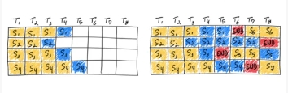

## LLMs 大模型 推理优化篇

### 1、大模型上线之后为什么还需要进行推理优化？

1、缩短推理延迟；
2、减少 GPU 显存占用，降低部署成本；

### 2、大模型中的推理优化技术，你能聊聊吗?

- 分布式优化里的张量并行，流水线并行，NCCL通信优化
- 低比特量化，有INT4/INT8 权重量化，AWQ自适应量化，KVCache量化
- 显存优化中里的Paged Attention,FlashAttention
- 算子优化中的算子融合，GEMM高性能算子
- 服务优化，有Continous Batching,Dynamic Batching, Async Serving
- 投机采样(Speculative Decoding)
- 美杜莎头(Medusa Heads)：Medusa的核心在于它在LLM的幕后隐藏层上增加的多个Heads，使它们并行工作，预测接下来的内容。通过同时接受更多的tokens来增强解碼过程的效率，从而减少了所需的解碼步骤数量。相比于投机采样，它不需要一个额外的小模型缺点是需要修改模型的训练代碼。
- LookaheadDecoding
- EAGLE

### 3、大模型服务的吞吐率太小怎么办?

- 吞吐率是怎么计算的:

吞吐率=处理的请求N/延时

> 也就是:在一定时间内，服务处理的请求数除以消耗的时间。

- 解决方法：

1. 大模型的单次推理延迟：首先是可以减少计算量，可以采用权重+基活量化来解诀，如果profile到服务的计算资源还有空余，比如GPU的利用率只有60%，也可以用投机采样方法来做，即用一个小模型来猜测+大模型验证的方式。
2. 提高访存的利用率：
   1. 一是在显存运行的情况下，增大模型一次处理的batchsize。这里就有多种方法，静态的batching，动态batching，以及连续的batching等等，差别就是合并batch的方式不同而已；
   2. 二是在业务条件允许下，水平扩展，增加节点数，这里就要考虑都scaling的问题，即增加节点数后，要尽可能蕞大化利用每个节点的计算能力，这就需要考虑到负载均衡的问题。比如用K8S+GPU利用率监测+0LB负载均衡来调优
3. continuous batching技术
   1. 为什么有这个方法呢?原因是大模型服务不能假定固定长度的输入序列，也不能假定固定长度的输出序列。因此对于static batching或者dynamic batching来说，生成输出的变化可能会导致GPU严重未充分利用；
   2. 思路：采用了迭代级调度，一旦批中的一个序列完成生成，就可以在其位置插入一个新的序列，从而实现比静态批处理更高的GPU利用率，如下图:

> 我们来看这张图，它使用连续批处理完成七条序列。左图显示了单个选代后的批，右图显示了多次迭代后的批
> 
> 一旦一个序列产生结束序列标记，我们在其位置插入新的序列(即序列S5、S6和S7)。这实现了更高的 GPU 利用率，因为GPU不需要等待所有序列完成才开始新的一个。
> 
> 实际在代码实现时，还需要根据服务是流式输出还是一次性输出做进一步优化。
> 
> 如果是流式输出，则需要利用异步协程的async和await来实现计算资源的切换，实现在token粒度级多用户输出。
> 
> 更进一步，在这个过程中，tokenize和detokenize也可以用异步协程来实现，进一步提高编解碼速度。

### 4、简述一下 Continous Batching？

Continous Batching:将多个请求合并一个batch 送给大模型处理，是提升 GPU推理吞吐量(throughput)的一种有效方法。

