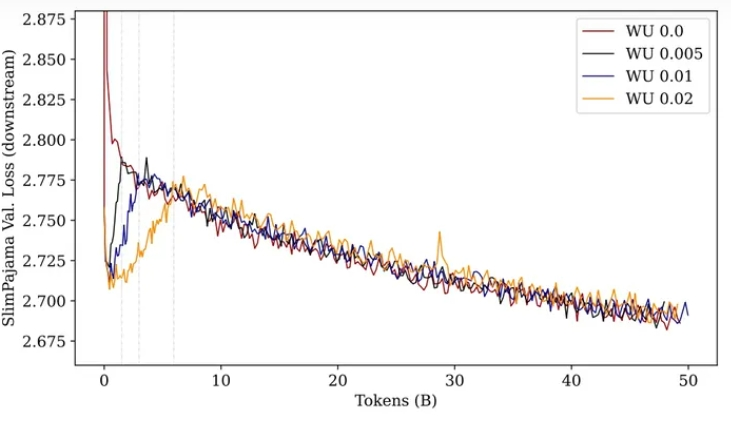
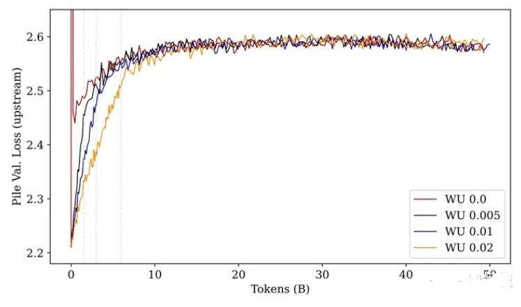
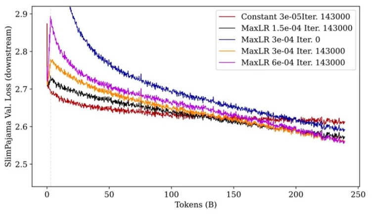
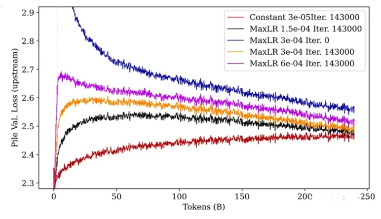
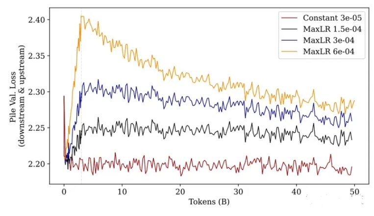
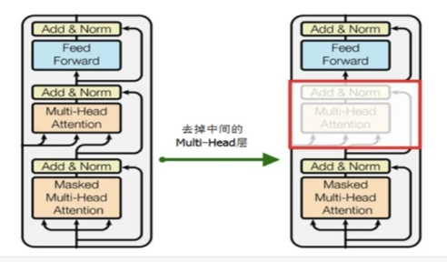
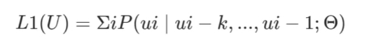
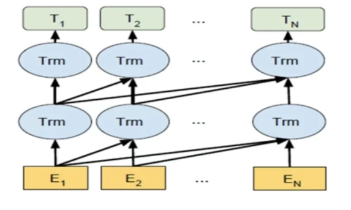
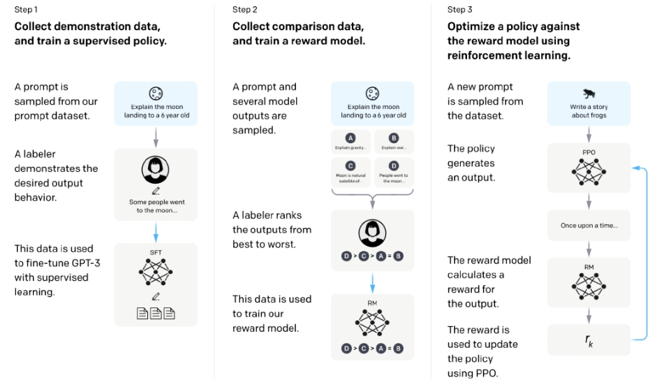

# 大模型（LLMs）增量预训练篇

- [大模型（LLMs）增量预训练篇](#大模型llms增量预训练篇)
  - [1 为什么要增量预训练？](#1-为什么要增量预训练)
  - [2 进行 增量预训练 需要做哪些准备工作？](#2-进行-增量预训练-需要做哪些准备工作)
  - [3 增量预训练 所用 训练框架？](#3-增量预训练-所用-训练框架)
  - [4 增量预训练 训练流程 是怎么样？](#4-增量预训练-训练流程-是怎么样)
  - [5 增量预训练 一般需要多大数据量？](#5-增量预训练-一般需要多大数据量)
  - [6 增量预训练 过程中，loss 上升正常么？](#6-增量预训练-过程中loss-上升正常么)
  - [7 增量预训练 过程中，lr 如何设置？](#7-增量预训练-过程中lr-如何设置)
  - [8 增量预训练 过程中，warmup\_ratio 如何设置？](#8-增量预训练-过程中warmup_ratio-如何设置)
  - [9 warmup 的步数 对 大模型继续预训练 是否有影响？](#9-warmup-的步数-对-大模型继续预训练-是否有影响)
  - [10 学习率 大小 对 大模型继续预训练 后 上下游任务影响？](#10-学习率-大小-对-大模型继续预训练-后-上下游任务影响)
  - [11 在初始预训练中使用 Rewarmup 对 大模型继续预训练 性能 影响？](#11-在初始预训练中使用-rewarmup-对-大模型继续预训练-性能-影响)
  - [12 聊聊 LLM 预训练的基本原理](#12-聊聊-llm-预训练的基本原理)
  - [13 LLM 预训练阶段有哪几个关键步骤?](#13-llm-预训练阶段有哪几个关键步骤)
  - [致谢](#致谢)

## 1 为什么要增量预训练？

有一种观点，**预训练学知识，指令微调学格式，强化学习对齐人类偏好**，[LIMA](https://arxiv.org/abs/2305.11206)等论文算是这一观点的证据。

**所以要想大模型有领域知识，得增量预训练**。（靠指令微调记知识不靠谱，不是几十w条数据能做到的。）

## 2 进行 增量预训练 需要做哪些准备工作？

1. 模型底座选型

主流是LLaMA，因为[scaling法则](https://arxiv.org/abs/2001.08361)，可能LLaMA做了充分预训练。（当然有版权问题）

这里备选BLOOM，感觉基座比LLaMA差，但是也有7B版本。

[Falcon](https://huggingface.co/tiiuae/falcon-40b)、[CPM-bee](https://huggingface.co/openbmb/cpm-bee-10b)、[Aquila](https://model.baai.ac.cn/model-detail/100098)、[Baichuan](https://huggingface.co/baichuan-inc/baichuan-7B)待实验，license友好，但生态和效果都是问题。其实，因为结构上都类似LLaMA，未来估计会出现整合这些模型的项目。

（Falcon公布的训练语料中没有中文）

这里没列ChatGLM和ChatGLM2，因为有种说法在SFT模型上增量预训练效果比较差。（未证实）

2. 数据收集

这里最经典的开源预训练数据还是[wudao](https://data.baai.ac.cn/details/WuDaoCorporaText)的200G和the [pile](https://pile.eleuther.ai/)这两个数据集（怀念一下Open-Llama）

加起来有1T的文本量，足够前期玩耍了。

其实，刚开始实践的时候，不需要太多样本，先收集GB量级的领域文本跑通流程即可。

3. 数据清洗

当然这里数据治理可能是chatgpt魔法的最关键的部分，最基础的是把网页爬取数据中的广告清理掉。

Falcon论文里介绍了数据清洗的手段，对于我们很有参考意义。

## 3 增量预训练 所用 训练框架？

1. 超大规模训练

如果是真大规模炼丹，那没什么好说的，直接3D并行。

Megatron-Deepspeed拥有多个成功案例，炼LLaMA可以参考LydiaXiaohongLi大佬的实现。（实在太强）

> https://github.com/microsoft/Megatron-DeepSpeed/pull/139

炼BLOOM可以直接找到Bigscience的git仓库。

然而，转checkpoint还是挺费劲的。

2. 少量节点训练

小门小户一共就几台机器几张卡的话，3D并行有点屠龙术了。

张量并行只有在nvlink环境下才会起正向作用，但提升也不会太明显。

可以分2种情况：

- 单节点或者多节点（节点间通信快）：直接deepspeed ZeRO吧。（笔者用了linly的增量预训练代码，但有能力的最好用其他代码）比如，Open-Llama的fork版本。

> https://github.com/RapidAI/Open-Llama

- 多节点（但节点间通信慢）：考虑用流水线并行，参考另一个大佬的实现。

> https://github.com/HuangLK/transpeeder

3. 少量卡训练

如果资源特别少，显存怎么也不够，可以上LoRA。

> https://github.com/shibing624/MedicalGPT

## 4 增量预训练 训练流程 是怎么样？

1. 数据预处理

参考LLaMA的预训练长度，也把数据处理成2048长度（如果不够，做补全）

这里要吐槽，tencentpretrain数据处理脚本的默认长度竟然是128。

2. 分词器

有很多工作加LLaMA中文词表，但是考虑到没有定论说加中文词表会更好，先用原版的吧，500k的tokenizer.model。

> https://github.com/ymcui/Chinese-LLaMA-Alpaca

3. 原始模型

可以使用一个中文增量预训练后的版本，当然这里坑挺大的，各家框架的模型层名不太一样。

为了快速跑通，用脚本快速转一下，能成功加载就行。

4. 训练参数

如果显存不够，可以zero3+offload。其他参数暂时默认吧。（事实上没有想象中慢）

多机的话可以配一下deepspeed的hostfile。

5. 观测训练进展

这一点可能是最重要的，跑通只是第一步，根据训练情况反复调整比较重要。

可以使用wandb，记录loss，flops，吞吐速度，已消耗的token数，和测试ppl。

6. 模型转换

不同框架的checkpoint格式不同，还会根据并行度分成很多个文件。

以ZeRO为例，我的转换流程（很挫）是：

- zero to f32
- f32 to fp16
- fp16 to huggingface格式

7. 模型测试

转为标准huggingface格式后可以用各种支持llama的前端加载，比如[text-generation-webui](https://github.com/oobabooga/text-generation-webui)。

可以简单测试下续写能力，验证下模型是否正常。

至此，我们获得了1个增量预训练过的大模型基座。

## 5 增量预训练 一般需要多大数据量？

首先要确保你有足够大量的数据集，至少有几B的token；否则几十条数据的情况我更推荐模型微调。

## 6 增量预训练 过程中，loss 上升正常么？

通常 增量预训练 开始的阶段会出现一段时间的loss上升，随后慢慢收敛。

## 7 增量预训练 过程中，lr 如何设置？

学习率是一个很重要的参数，因为 lr 的大小会出现以下问题：

- 如果lr过大，那loss值收敛会更困难，旧能力损失的会更大；
- 如果lr过小，那可能难以学到新知识。

当你数据集比较小（例如100B以下？），那建议使用较小的学习率。例如可以使用pre-train阶段最大学习率的10%。通常7B模型pre-train阶段的学习率大概是3e-4，所以我们可以选择3e-5。

并且需要根据你的batch size做相应缩放。通常lr缩放倍数为batch size倍数的开方。例如batch size增大4倍，学习率对应扩大2倍即可。

## 8 增量预训练 过程中，warmup_ratio 如何设置？

warmup_ratio也很重要。通常LLM训练的warmup_ratio是epoch * 1%左右。例如pre-train阶段一般只训一个epoch，则ratio是0.01；SFT通常3个epoch，ratio对应为0.03。

但是如果做CPT，建议warmup_ratio调大一点。如果你的数据集很大，有几百b，那warmup其实不影响最重的模型效果。但通常我们的数据集不会有那么大，所以更小的ratio可以让模型“过渡”得更平滑。

学习率和warmup_ratio是两个相辅相成的概念，二者通常是成正比的关系。或者说如果你正在用一个较大的学习率，那你或许可以同时尝试增加warmup来防止模型“烂掉”。

## 9 warmup 的步数 对 大模型继续预训练 是否有影响？

- warmup 介绍：warmup 是一种 finetune 中常用的策略，指学习率从一个很小的值慢慢上升到最大值；
- 对比实验设计：使用 不同 4 种不同预热步数（eg：0%, 0.5%, 1%, 2%）来进行实验

> 不同预热百分比步数的性能图，上图为下游任务 loss，下图为上游任务 loss

- 实验结果：当模型经过「充分」训练后，不管多长的预热步数最后的性能都差不多。

> 注：但，这种前提是「充分训练」，如果只看训练前期的话，使用更长的预热步数（黄色的线），无论是「上游任务」还是「下游任务」，模型的 Loss 都要比其他预热步数要低（下游学的快，上游忘的慢）。

## 10 学习率 大小 对 大模型继续预训练 后 上下游任务影响？

- 对比实验：使用了 4 种不同的最大学习率进行对比实验

> 不同最大学习率的性能图，上图为下游任务 loss，下图为上游任务 loss

- 实验结论：
  - **经过充分训练后，学习率越大（紫色），下游性能最好，上游性能最差（忘得最多）。**
  - 未经过预训练的模型（蓝色）无论是上游任务还是下游任务，都不如预训练过的模型效果。

> 注：前期训练，尽管紫色线条在最后的 loss 是最低的，但在前期 loss 会增加的非常大，随后下降。
> 解释一下这里为什么这么关注训练前期，是因为在真实训练中，我们可能不一定会增强图中所示的 250B 这么多的 tokens，尤其是在模型参数很大的情况中。所以，当资源不允许充分训练的情况下，较小的学习率和较长的 warmup 步数可能是一个不错的选择。

## 11 在初始预训练中使用 Rewarmup 对 大模型继续预训练 性能 影响？

- 对比实验：不切换数据集，而是继续在之前的「预训练数据集（The Pile）」上继续训练：

> 继续在预训练数据集上进行预训练

- 实验结果：无论使用多大学习率的 warmup 策略，效果都不如使用常量学习率。

这进一步证明，在原数据集上使用 warmup 接着训练会造成性能损伤，学习率越大则损伤越大，

且这种损伤是无法在后续的训练中被找回的。

> 注：PS：这里提示我们，当预训练中遇到了训练中断需要继续训练时，我们应该在重新开始训练时将学习率恢复到中断之前的状态（无论是数值还是衰减率）。

## 12 聊聊 LLM 预训练的基本原理

大语言模型预训练采用了 Transformer 模型的解码器部分，由于没有编码器部分，大语言模型去掉了中间的与编码器交互的多头注意力层。

如下图所示，左边是 Transformer 模型的解码器右边是大语言模型的预训练架构

大语言模型预训练是通过上文的词来预测下一个词，属于无监督的预训练。比如，给定一个无监督的语料 U={u1,...,un}，而预训练语言模型是要使得下面式子最大化:

即如下图所示，通过上文，来预测下一个单词，属于自回归模型，也叫做 AR 模型。

AR 模型，即指从左往右学习的模型。AR 模型从上文学习，并将上一步的结果作为回归模型的输入，以预测下一个词。

在预测时，AR 模型只能看到上文的词，而无法知晓下文的词。AR 模型通常用于生成式任务，尤其是长文本的生成能力很强。

在大语言模型的预训练中，还采用了in-context learning 技术。为了让模型能够理解人类的意图，与人类的思想对齐，会构造类似这样数据:在句子前加上一个任务(task)，同时会给出完成该任务的几个示例。

例如，向模型输入“请将中文翻译成英文。你好Hello，再见，goodbye，销售，”，然后让模型学习下一个输出“sell”。通过示例的个数又可以分为:

1、few-show learning: 允许输入数条示例和一则任务说明;
2、one-shot learning: 只允许输入一条示例和一则任务说明;
3、zero-shot learning: 不允许输入任何范例，只允许输入一则任务说明

zero-shot learning 可以表示为 p(output|input, task)

通过引入 in-context learning 技术，使得预训练的大语言模型直接拥有完成特定任务的能力。

## 13 LLM 预训练阶段有哪几个关键步骤?

大语言模型预训练是指采用大量数据喂入大规模模型去训练语言模型，得到初始化的模型参数。

随着 ChatGPT的出现，在完成大语言模型的预训练后，还会采用监督学习、奖励模型以及强化学习进行进一步的微调，叫做 RLHF。

预训练后续阶段主要分为三个步骤(如下图所示)：

- 步骤 1: **SFT 监督微调**，训练监督策略模型。在大语言模型的训练过程中，需要标记者参与监督过程;
- 步骤 2: **奖励模型训练**。借助标记者的人工标注，训练出合意的奖励模型，为监督策略建立评价标准;
- 步骤 3: **PPO 强化学习模型训练**，采用近端策略优化进行强化学习。通过监督学习策略生成PPO 模型，将最优结果用于优化和迭代原有的 PPO 模型参数。

## 致谢

- LLM微调经验&认知-2  https://zhuanlan.zhihu.com/p/676723672
- 如何更好地继续预训练（Continue PreTraining） https://zhuanlan.zhihu.com/p/654463331

