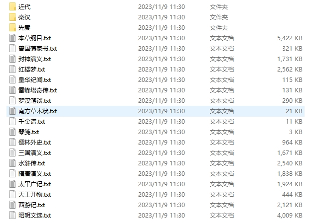
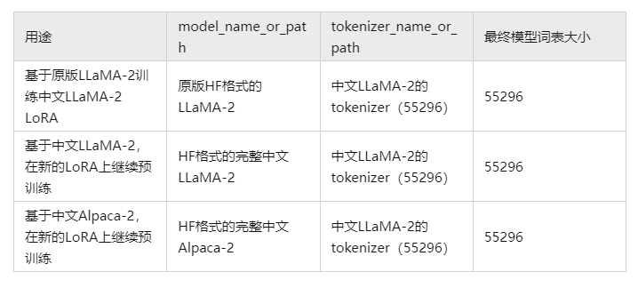
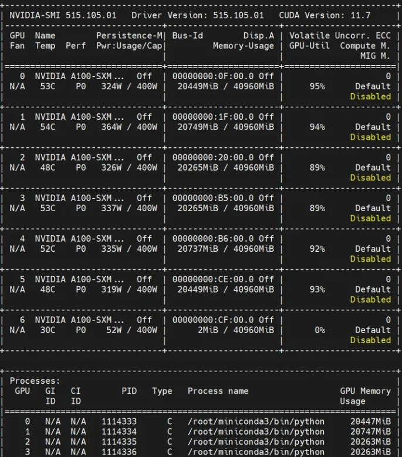
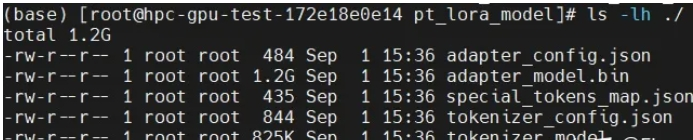
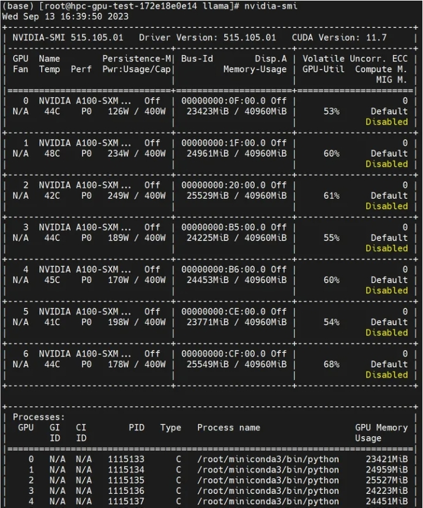
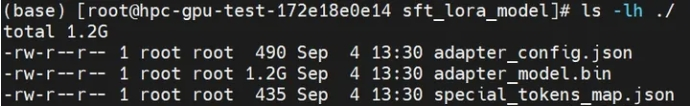
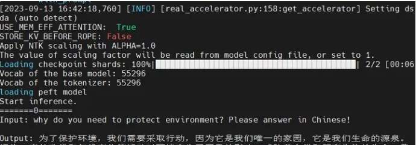

# 基于lora的llama2二次预训练

- [基于lora的llama2二次预训练](#基于lora的llama2二次预训练)
  - [一、为什么需要 对 llama2 做 基于lora的二次预训练?](#一为什么需要-对-llama2-做-基于lora的二次预训练)
  - [二、基于lora的llama2二次预训练 的目标是什么？](#二基于lora的llama2二次预训练-的目标是什么)
  - [三、基于lora的llama2二次预训练 的思想是什么？](#三基于lora的llama2二次预训练-的思想是什么)
  - [四、基于lora的llama2二次预训练 语料构建思路？](#四基于lora的llama2二次预训练-语料构建思路)
  - [五、如何 基于lora的llama2二次预训练 ？](#五如何-基于lora的llama2二次预训练-)
    - [5.1 基于lora的llama2二次预训练 参数介绍](#51-基于lora的llama2二次预训练-参数介绍)
    - [5.2 基于lora的llama2二次预训练](#52-基于lora的llama2二次预训练)
  - [六、如何 基于lora的llama2 微调 ？](#六如何-基于lora的llama2-微调-)
    - [6.1 训练数据介绍](#61-训练数据介绍)
    - [6.2 基于lora的llama2 微调 参数介绍](#62-基于lora的llama2-微调-参数介绍)
    - [6.3 基于lora的llama2 微调](#63-基于lora的llama2-微调)
  - [七、如何 使用 基于lora的llama2 做推理 ？](#七如何-使用-基于lora的llama2-做推理-)
  - [致谢](#致谢)

## 一、为什么需要 对 llama2 做 基于lora的二次预训练?

加入中文训练语料进行llama2的二次预训练，这样模型就可以增加支持中文输出的能力。

## 二、基于lora的llama2二次预训练 的目标是什么？

在保持预训练模型权重不变的情况下，通过添加额外的网络层并仅训练这些新增的网络层参数，实现大模型的高效微调（peft）。

## 三、基于lora的llama2二次预训练 的思想是什么？

思想：基于对模型本征维度（intrinsic dimension）的理解。

> “本征维度”是指模型中真正有用的、能够影响模型输出的参数数量。
> Aghajanyan研究发现，预训练模型的内在维度实际上非常小，即只有一小部分参数对模型输出有显著影响。就是存在一个极低维度的参数，微调它和在全参数空间中微调能起到相同的效果
> LORA假设模型在任务适配过程中权重的改变量是低秩（low rank）
> W=W0+ΔW，ΔW=BA
> 参数更新范围：只训练新增的网络层参数

## 四、基于lora的llama2二次预训练 语料构建思路？

1. 预训练 数据集 下载

本项目 基于lora的llama2二次预训练 语料 来自 [中文书籍](https://github.com/shjwudp/shu)，一个 中文书籍收录整理 项目。

```s
    $ git clone https://github.com/shjwudp/shu.git
```

2. 数据集格式介绍




> 介绍：数据集格式，.txt结尾

3. 数据集介绍

```s
《红楼梦》

曹雪芹 　高鄂  著

第一回  甄士隐梦幻识通灵　贾雨村风尘怀闺秀

列位看官：你道此书从何而来？说起根由，虽近荒唐，细按则深有趣味。待在下将此来历注明，方使阅者了然不惑。

原来女娲氏炼石补天之时，于大荒山无稽崖炼成高经十二丈、方经二十四丈顽石三万六千五百零一块。娲皇氏只用了三万六千五百块，只单单剩了一块未用，便弃在此山青埂峰下。谁知此石自经煅炼之后，灵性已通，因见众石俱得补天，独自己无材不堪入选，遂自怨自叹，日夜悲号惭愧。

一日，正当嗟悼之际，俄见一僧一道远远而来，生得骨格不凡，丰神迥别，说说笑笑，来至峰下，坐于石边，高谈快论：先是说些云山雾海、神仙玄幻之事，后便说到红尘中荣华富贵。此石听了，不觉打动凡心，也想要到人间去享一享这荣华富贵，但自恨粗蠢，不得已，便口吐人言，向那僧道说道：“大师，弟子蠢物，不能见礼了！适闻二位谈那人世间荣耀繁华，心切慕之。弟子质虽粗蠢，性却稍通，况见二师仙形道体，定非凡品，必有补天济世之材，利物济人之德。如蒙发一点慈心，携带弟子得入红尘，在那富贵场中，温柔乡里受享几年，自当永佩洪恩，万劫不忘也！”二仙师听毕，齐憨笑道：“善哉，善哉！那红尘中有却有些乐事，但不能永远依恃；况又有‘美中不足，好事多磨’八个字紧相连属，瞬息间则又乐极悲生，人非物换，究竟是到头一梦，万境归空，倒不如不去的好。”这石凡心已炽，那里听得进这话去，乃复苦求再四。二仙知不可强制，乃叹道：“此亦静极思动，无中生有之数也！既如此，我们便携你去受享受享，只是到不得意时，切莫后悔！”石道：“自然，自然。”那僧又道：“若说你性灵，却又如此质蠢，并更无奇贵之处。如此也只好踮脚而已。也罢！我如今大施佛法，助你助，待劫终之日，复还本质，以了此案。你道好否？”石头听了，感谢不尽。那僧便念咒书符，大展幻术，将一块大石登时变成一块鲜明莹洁的美玉，且又缩成扇坠大小的可佩可拿。那僧托于掌上，笑道：“形体倒也是个宝物了！还只没有实在的好处，须得再镌上数字，使人一见便知是奇物方妙。然后好携你到那昌明隆盛之邦、诗礼簪缨之族、花柳繁华地、温柔富贵乡去安身乐业。”石头听了，喜不能禁，乃问：“不知赐了弟子那哪几件奇处？又不知携了弟子到何地方？望乞明示，使弟子不惑。”那僧笑道：“你且莫问，日后自然明白的。”说着，便袖了这石，同那道人飘然而去，竟不知投奔何方何舍。

后来，不知过了几世几劫，因有个空空道人访道求仙，从这大荒山无稽崖青埂峰下经过，忽见一大块石上字迹分明，编述历历。空空道人乃从头一看，原来就是无材补天，幻形入世，蒙茫茫大士、渺渺真人携入红尘，历尽离合悲欢、炎凉世态的一段故事。后面又有一首偈云：

无材可去补苍天，枉入红尘若许年。此系身前身后事，倩谁记去作奇传？

诗后便是此石坠落之乡，投胎之处，亲自经历的一段陈迹故事。其中家庭闺阁琐事，以及闲情诗词倒还全备，或可适趣解闷；然朝代年纪、地舆邦国却反失落无考。

空空道人遂向石头说道：“石兄，你这一段故事，据你自己说有些趣味，故编写在此，意欲问世传奇。据我看来：第一件，无朝代年纪可考；第二件，并无大贤大忠理朝廷、治风俗的善政，其中只不过几个异样女子，或情或痴，或小才微善，亦无班姑、蔡女之德能。我纵抄去，恐世人不爱看呢！”石头笑答道：“我师何太痴耶！若云无朝代可考，今我师竟借汉、唐等年纪添缀，又有何难？但我想，历来野史，皆蹈一辙，莫如我这不借此套者，反倒新奇别致。不过只取其事体情理罢了，又何必拘拘于朝代年纪哉！再者，市井俗人喜看理治之书者甚少，爱适趣闲文者特多。历来野史，或讪谤君相，或贬人妻女，奸淫凶恶，不可胜数。更有一种风月笔墨，其淫秽污臭，屠毒笔墨，坏人子弟，又不可胜数。至若佳人才子等书，则又千部共出一套，且其中终不能不涉于淫滥，以致满纸潘安、子建、西子、文君。不过作者要写出自己的那两首情诗艳赋来，故假拟出男女二人名姓，又必旁出一小人其间拨乱，亦如剧中之小丑然。且鬟婢开口即者也之乎，非文即理。故逐一看去，悉皆自相矛盾、大不近情理之话，竟不如我半世亲睹亲闻的这几个女子，虽不敢说强似前代书中所有之人，但事迹原委，亦可以消愁破闷；也有几首歪诗熟话，可以喷饭供酒。至若离合悲欢，兴衰际遇，则又追踪蹑迹，不敢稍加穿凿，徒为供人之目而反失其真传者。今之人，贫者日为衣食所累，富者又怀不足之心；纵然一时稍闲，又有贪淫恋色、好货寻愁之事，哪里有工夫去看那理治之书！所以，我这一段故事，也不愿世人称奇道妙，也不定要世人喜悦检读，只愿他们当那醉淫饱卧之时，或避世去愁之际，把此一玩，岂不省了些寿命筋力？就比那谋虚逐妄，却也省了口舌是非之害、腿脚奔忙之苦。再者，亦令世人换新眼目，不比那些胡牵乱扯，忽离忽遇，满纸才人淑女、子建、文君、红娘、小玉等通共熟套之旧稿。我师意为何如？”

空空道人听如此说，思忖半晌，将一这《石头记》再检阅一遍，因见上面虽有些指奸责佞、贬恶诛邪之语，亦非伤时骂世之旨；及至君仁臣良、父慈子孝，凡伦常所关之处，皆是称功颂德，眷眷无穷，实非别书之可比。虽其中大旨谈情，亦不过实录其事，又非假拟妄称，一味淫邀艳约，私订偷盟之可比。因毫不干涉时世，方从头至尾抄录回来，问世传奇。因空见色，由色生情，传情入色，自色悟空，空空道人遂易名为情僧，改《石头记》为《情僧录》。至?玉峰题曰《红楼梦》。东鲁孔梅溪则题曰《风月宝鉴》。后因曹雪芹于悼红轩中，披阅十载，增删五次，纂成目录，分出章回，则题曰《金陵十二钗》，并题一绝云：

满纸荒唐言，一把辛酸泪！都云作者痴，谁解其中味？

至脂砚斋甲戌抄阅再评，仍用《石头记》。

出则既明，且看石上是何故事。按那石上书云：
...
```
> 红楼梦.txt

## 五、如何 基于lora的llama2二次预训练 ？

- 实现代码：[run_clm_pt_with_peft.py](https://github.com/ymcui/Chinese-LLaMA-Alpaca-2/blob/main/scripts/training/run_clm_pt_with_peft.py)

### 5.1 基于lora的llama2二次预训练 参数介绍

1. 预训练模型参数

```s
@dataclass
class ModelArguments:
    """
    Arguments pertaining to which model/config/tokenizer we are going to fine-tune, or train from scratch.
    """

    model_name_or_path: Optional[str] = field(
        default=None,
        metadata={
            "help": (
                "The model checkpoint for weights initialization.Don't set if you want to train a model from scratch."
            )
        },
    )
    tokenizer_name_or_path: Optional[str] = field(
        default=None,
        metadata={
            "help": (
                "The tokenizer for weights initialization.Don't set if you want to train a model from scratch."
            )
        },
    )
    model_type: Optional[str] = field(
        default=None,
        metadata={"help": "If training from scratch, pass a model type from the list: " + ", ".join(MODEL_TYPES)},
    )
    config_overrides: Optional[str] = field(
        default=None,
        metadata={
            "help": (
                "Override some existing default config settings when a model is trained from scratch. Example: "
                "n_embd=10,resid_pdrop=0.2,scale_attn_weights=false,summary_type=cls_index"
            )
        },
    )
    config_name: Optional[str] = field(
        default=None, metadata={"help": "Pretrained config name or path if not the same as model_name"}
    )
    tokenizer_name: Optional[str] = field(
        default=None, metadata={"help": "Pretrained tokenizer name or path if not the same as model_name"}
    )
    cache_dir: Optional[str] = field(
        default=None,
        metadata={"help": "Where do you want to store the pretrained models downloaded from huggingface.co"},
    )
    use_fast_tokenizer: bool = field(
        default=True,
        metadata={"help": "Whether to use one of the fast tokenizer (backed by the tokenizers library) or not."},
    )
    model_revision: str = field(
        default="main",
        metadata={"help": "The specific model version to use (can be a branch name, tag name or commit id)."},
    )
    use_auth_token: bool = field(
        default=False,
        metadata={
            "help": (
                "Will use the token generated when running `huggingface-cli login` (necessary to use this script "
                "with private models)."
            )
        },
    )
    torch_dtype: Optional[str] = field(
        default=None,
        metadata={
            "help": (
                "Override the default `torch.dtype` and load the model under this dtype. If `auto` is passed, the "
                "dtype will be automatically derived from the model's weights."
            ),
            "choices": ["auto", "bfloat16", "float16", "float32"],
        },
    )

    def __post_init__(self):
        if self.config_overrides is not None and (self.config_name is not None or self.model_name_or_path is not None):
            raise ValueError(
                "--config_overrides can't be used in combination with --config_name or --model_name_or_path"
            )
```

- 关键参数介绍：
  - model_name_or_path：预训练模型地址
  - tokenizer_name_or_path：：预训练模型 tokenizer 地址
  - model_type：大模型类型



2. 预训练 数据参数介绍

```s
@dataclass
class DataTrainingArguments:
    """
    Arguments pertaining to what data we are going to input our model for training and eval.
    """

    dataset_dir: Optional[str] = field(
        default=None, metadata={"help": "The name of the dataset to use (via the datasets library)."}
    )
    dataset_config_name: Optional[str] = field(
        default=None, metadata={"help": "The configuration name of the dataset to use (via the datasets library)."}
    )
    train_file: Optional[str] = field(default=None, metadata={"help": "The input training data file (a text file)."})
    validation_file: Optional[str] = field(
        default=None,
        metadata={"help": "An optional input evaluation data file to evaluate the perplexity on (a text file)."},
    )
    max_train_samples: Optional[int] = field(
        default=None,
        metadata={
            "help": (
                "For debugging purposes or quicker training, truncate the number of training examples to this "
                "value if set."
            )
        },
    )
    max_eval_samples: Optional[int] = field(
        default=None,
        metadata={
            "help": (
                "For debugging purposes or quicker training, truncate the number of evaluation examples to this "
                "value if set."
            )
        },
    )
    streaming: bool = field(default=False, metadata={"help": "Enable streaming mode"})
    block_size: Optional[int] = field(
        default=None,
        metadata={
            "help": (
                "Optional input sequence length after tokenization. "
                "The training dataset will be truncated in block of this size for training. "
                "Default to the model max input length for single sentence inputs (take into account special tokens)."
            )
        },
    )
    overwrite_cache: bool = field(
        default=False, metadata={"help": "Overwrite the cached training and evaluation sets"}
    )
    validation_split_percentage: Optional[float] = field(
        default=0.05,
        metadata={
            "help": "The percentage of the train set used as validation set in case there's no validation split"
        },
    )
    preprocessing_num_workers: Optional[int] = field(
        default=None,
        metadata={"help": "The number of processes to use for the preprocessing."},
    )
    keep_linebreaks: bool = field(
        default=True, metadata={"help": "Whether to keep line breaks when using TXT files or not."}
    )
    data_cache_dir: Optional[str] = field(default="./", metadata={"help": "The datasets processed stored"})

    def __post_init__(self):
        if self.streaming:
            require_version("datasets>=2.0.0", "The streaming feature requires `datasets>=2.0.0`")
```

3. 预训练 模型参数介绍

```s
@dataclass
class MyTrainingArguments(TrainingArguments):
    trainable : Optional[str] = field(default="q_proj,v_proj")
    lora_rank : Optional[int] = field(default=8)
    lora_dropout : Optional[float] = field(default=0.1)
    lora_alpha : Optional[float] = field(default=32.)
    modules_to_save : Optional[str] = field(default=None)
    debug_mode : Optional[bool] = field(default=False)
    peft_path : Optional[str] = field(default=None)
    flash_attn : Optional[bool] = field(default=False)
    double_quant: Optional[bool] = field(default=True)
    quant_type: Optional[str] = field(default="nf4")
    load_in_kbits: Optional[int] = field(default=16)
```

### 5.2 基于lora的llama2二次预训练 

```s
########参数设置########
lr=2e-4  # 学习率
lora_rank=64 # LoRA低秩矩阵的维数
lora_alpha=128 #  LoRA低秩矩阵的缩放系数，为一个常数超参，调整alpha与调整学习率类似
lora_trainable="q_proj,v_proj,k_proj,o_proj,gate_proj,down_proj,up_proj" # 可训练的 LORA 模块，q_proj、k_proj和v_proj是多头注意力机制中的三个线性变换，用于将输入的token映射到一个高维向量空间中，以便于模型对输入进行处理；o_proj则是多头注意力机制的输出层，它将模型的输出映射到一个概率分布上，以便于模型预测下一个token；gate_proj、down_proj和up_proj则是在LoRA微调方法中使用的一些层
modules_to_save="embed_tokens,lm_head" # 需要保存的模块，embed_tokens层将输入的token映射到一个高维向量空间中，以便于模型对输入进行处理。lm_head层则是预测下一个token的输出层，它将模型的输出映射到一个概率分布上，以便于模型预测下一个token
lora_dropout=0.05 # LoRA 层的丢弃（dropout）率，取值范围为[0, 1)

pretrained_model=/root/llama/all_transformer # 预训练模型路径
chinese_tokenizer_path=/root/llama/all_transformer # 中文分词器路径
dataset_dir=/root/llama/data # 数据集路径
data_cache=./cache/ # 数据缓存路径
per_device_train_batch_size=1 # 每个设备上的训练批次大小
gradient_accumulation_steps=1 # 梯度累积步数
output_dir=output_dir # 输出目录路径
block_size=512 # 设置最大序列长度为512，超过这个长度的序列将被截断或填充
# resume_from=output_dir/checkpoint-24000 # 从哪个检查点恢复训练
training_steps=25000


deepspeed_config_file=scripts/training/ds_zero2_no_offload.json

########启动命令########
torchrun --nnodes 1 --nproc_per_node 1 scripts/training/run_clm_pt_with_peft.py \
    --deepspeed ${deepspeed_config_file} \
    --model_name_or_path ${pretrained_model} \
    --tokenizer_name_or_path ${chinese_tokenizer_path} \
    --dataset_dir ${dataset_dir} \
    --data_cache_dir ${data_cache} \
    --validation_split_percentage 0.001 \
    --per_device_train_batch_size ${per_device_train_batch_size} \
    --do_train \
    --seed $RANDOM \
    --fp16 \
    --max_steps ${training_steps} \
    --num_train_epochs 1 \
    --lr_scheduler_type cosine \
    --learning_rate ${lr} \
    --warmup_ratio 0.05 \
    --weight_decay 0.01 \
    --logging_strategy steps \
    --logging_steps 10 \
    --save_strategy steps \
    --save_total_limit 3 \
    --save_steps 500 \
    --gradient_accumulation_steps ${gradient_accumulation_steps} \
    --preprocessing_num_workers 8 \
    --block_size ${block_size} \
    --output_dir ${output_dir} \
    --overwrite_output_dir \
    --ddp_timeout 30000 \
    --logging_first_step True \
    --lora_rank ${lora_rank} \
    --lora_alpha ${lora_alpha} \
    --trainable ${lora_trainable} \
    --modules_to_save ${modules_to_save} \
    --lora_dropout ${lora_dropout} \
    --torch_dtype float16 \
    --resume True \
    --resume_from_checkpoint ${resume_from} \
    --gradient_checkpointing \
    --ddp_find_unused_parameters False
```


> 基于lora的llama2二次预训练 显存占用


> 基于lora的llama2二次预训练 模型

## 六、如何 基于lora的llama2 微调 ？

- 实现代码：[run_clm_sft_with_peft.py](https://github.com/ymcui/Chinese-LLaMA-Alpaca-2/blob/main/scripts/training/run_clm_sft_with_peft.py)

### 6.1 训练数据介绍

本次 基于lora的llama2 Lora 微调 这样使用 standford 开源的的 [stanford_alpaca](https://github.com/tatsu-lab/stanford_alpaca) 项目，该项目 提供了廉价的对llama模型微调方法——利用openai提供的gpt模型api生成质量较高的 [instruct tuning数据](https://github.com/tatsu-lab/stanford_alpaca/blob/main/alpaca_data.json)（仅52k），并且基于这些数据微调模型。

在prompt设计上，精调以及预测时采用的都是原版Stanford Alpaca不带input的模版。对于包含input字段的数据，采用f"{instruction}+\n+{input}"的形式进行拼接。

但是由于 该数据集是 英文的，所以 使用 [Chinese-LLaMA-Alpaca](https://github.com/ymcui/Chinese-LLaMA-Alpaca/) 开源的 [中文Alpaca数据](https://github.com/ymcui/Chinese-LLaMA-Alpaca/blob/main/data/alpaca_data_zh_51k.json)，该数据集包含51k个从ChatGPT (gpt-3.5-turbo)爬取的指令数据。

```s
[
  {
    "instruction": "我们如何在日常生活中减少用水？",
    "input": "",
    "output": "1. 使用节水装置，如节水淋浴喷头和水龙头。 \n2. 使用水箱或水桶收集家庭废水，例如洗碗和洗浴。 \n3. 在社区中提高节水意识。 \n4. 检查水管和灌溉系统的漏水情况，并及时修复它们。 \n5. 洗澡时间缩短，使用低流量淋浴头节约用水。 \n6. 收集雨水，用于园艺或其他非饮用目的。 \n7. 刷牙或擦手时关掉水龙头。 \n8. 减少浇水草坪的时间。 \n9. 尽可能多地重复使用灰水（来自洗衣机、浴室水槽和淋浴的水）。 \n10. 只购买能源效率高的洗碗机和洗衣机。"
  },
  {
    "instruction": "编辑文章，使其更吸引读者。",
    "input": "自主机器人是计算机控制的机器，被编程执行特定任务而不需要任何人类输入。自主机器人在各个行业中被越来越广泛地应用，从制造业到医疗保健再到安全。",
    "output": "自主机器人是计算机控制的机器，被编程执行特定任务而不需要任何人类输入，从而实现了新的效率、精确度和可靠性水平。自主机器人在各个行业中被越来越广泛地应用，从制造业，它们可以使用精度和一致的质量组装复杂的组件，到医疗保健，可以协助进行医疗测试和处理，再到安全，可以监控大面积地区，保障人们和财产的安全。自主机器人还可以减少在危险或有害环境中的错误和增加安全，在工业流程的检查或维修期间等。由于其多样性，自主机器人将彻底改变我们工作方式的方式，使任务变得更加简单、快速，最终更加愉悦。"
  },
  ...
]
```

### 6.2 基于lora的llama2 微调 参数介绍

1. 基于lora的llama2 微调 大模型路径参数

```s
@dataclass
class ModelArguments:
    """
    Arguments pertaining to which model/config/tokenizer we are going to fine-tune, or train from scratch.
    """

    model_name_or_path: Optional[str] = field(
        default=None,
        metadata={
            "help": (
                "The model checkpoint for weights initialization.Don't set if you want to train a model from scratch."
            )
        },
    )
    tokenizer_name_or_path: Optional[str] = field(
        default=None,
        metadata={
            "help": (
                "The tokenizer for weights initialization.Don't set if you want to train a model from scratch."
            )
        },
    )

    config_overrides: Optional[str] = field(
        default=None,
        metadata={
            "help": (
                "Override some existing default config settings when a model is trained from scratch. Example: "
                "n_embd=10,resid_pdrop=0.2,scale_attn_weights=false,summary_type=cls_index"
            )
        },
    )
    config_name: Optional[str] = field(
        default=None, metadata={"help": "Pretrained config name or path if not the same as model_name"}
    )
    tokenizer_name: Optional[str] = field(
        default=None, metadata={"help": "Pretrained tokenizer name or path if not the same as model_name"}
    )
    cache_dir: Optional[str] = field(
        default=None,
        metadata={"help": "Where do you want to store the pretrained models downloaded from huggingface.co"},
    )
    use_fast_tokenizer: bool = field(
        default=True,
        metadata={"help": "Whether to use one of the fast tokenizer (backed by the tokenizers library) or not."},
    )
    model_revision: str = field(
        default="main",
        metadata={"help": "The specific model version to use (can be a branch name, tag name or commit id)."},
    )
    use_auth_token: bool = field(
        default=False,
        metadata={
            "help": (
                "Will use the token generated when running `huggingface-cli login` (necessary to use this script "
                "with private models)."
            )
        },
    )
    torch_dtype: Optional[str] = field(
        default=None,
        metadata={
            "help": (
                "Override the default `torch.dtype` and load the model under this dtype. If `auto` is passed, the "
                "dtype will be automatically derived from the model's weights."
            ),
            "choices": ["auto", "bfloat16", "float16", "float32"],
        },
    )

    def __post_init__(self):
        if self.config_overrides is not None and (self.config_name is not None or self.model_name_or_path is not None):
            raise ValueError(
                "--config_overrides can't be used in combination with --config_name or --model_name_or_path"
            )

```

- 关键参数介绍：
  - model_name_or_path：预训练模型地址
  - tokenizer_name_or_path：：预训练模型 tokenizer 地址
  - ...

2. 基于lora的llama2 微调 数据参数介绍

```s
@dataclass
class DataTrainingArguments:
    """
    Arguments pertaining to what data we are going to input our model for training and eval.
    """

    dataset_dir: Optional[str] = field(
        default=None, metadata={"help": "The name of the dataset to use (via the datasets library)."}
    )

    train_file: Optional[str] = field(default=None, metadata={"help": "The input training data file (a text file)."})
    validation_file: Optional[str] = field(
        default=None,
        metadata={"help": "An optional input evaluation data file to evaluate the perplexity on (a text file)."},
    )

    overwrite_cache: bool = field(
        default=False, metadata={"help": "Overwrite the cached training and evaluation sets"}
    )
    validation_split_percentage: Optional[float] = field(
        default=0.05,
        metadata={
            "help": "The percentage of the train set used as validation set in case there's no validation split"
        },
    )
    preprocessing_num_workers: Optional[int] = field(
        default=None,
        metadata={"help": "The number of processes to use for the preprocessing."},
    )
    keep_linebreaks: bool = field(
        default=True, metadata={"help": "Whether to keep line breaks when using TXT files or not."}
    )
    data_cache_dir: Optional[str] = field(default=None, metadata={"help": "The datasets processed stored"})

    max_seq_length: Optional[int] = field(default=1024)
```

3. 基于lora的llama2 微调 模型参数介绍

```s
@dataclass
class MyTrainingArguments(TrainingArguments):
    trainable : Optional[str] = field(default="q_proj,v_proj")
    lora_rank : Optional[int] = field(default=8)
    lora_dropout : Optional[float] = field(default=0.1)
    lora_alpha : Optional[float] = field(default=32.)
    modules_to_save : Optional[str] = field(default=None)
    peft_path : Optional[str] = field(default=None)
    flash_attn : Optional[bool] = field(default=False)
    double_quant: Optional[bool] = field(default=True)
    quant_type: Optional[str] = field(default="nf4")
    load_in_kbits: Optional[int] = field(default=16)
```

### 6.3 基于lora的llama2 微调

```s
lr=1e-4
lora_rank=64
lora_alpha=128
lora_trainable="q_proj,v_proj,k_proj,o_proj,gate_proj,down_proj,up_proj"
modules_to_save="embed_tokens,lm_head"
lora_dropout=0.05

pretrained_model=/root/llama/correspond_output_dir
chinese_tokenizer_path=/root/llama/correspond_output_dir
dataset_dir=data_pt
per_device_train_batch_size=1
per_device_eval_batch_size=1
gradient_accumulation_steps=8
max_seq_length=512
output_dir=sft_output_dir2
validation_file=data_pt/alpaca_data_zh_51k.json
training_steps=6000


deepspeed_config_file=scripts/training/ds_zero2_no_offload.json

torchrun --nnodes 1 --nproc_per_node 7 scripts/training/run_clm_sft_with_peft.py \
    --deepspeed ${deepspeed_config_file} \
    --model_name_or_path ${pretrained_model} \
    --tokenizer_name_or_path ${chinese_tokenizer_path} \
    --dataset_dir ${dataset_dir} \
    --per_device_train_batch_size ${per_device_train_batch_size} \
    --per_device_eval_batch_size ${per_device_eval_batch_size} \
    --do_train \
    --do_eval  \
    --eval_steps 1000 \
    --seed $RANDOM \
    --fp16 \
    --num_train_epochs 1 \
    --lr_scheduler_type cosine \
    --learning_rate ${lr} \
    --warmup_ratio 0.03 \
    --weight_decay 0 \
    --logging_strategy steps \
    --logging_steps 10 \
    --save_strategy steps \
    --save_total_limit 3 \
    --evaluation_strategy steps \
    --eval_steps 6000 \
    --save_steps 3000 \
    --gradient_accumulation_steps ${gradient_accumulation_steps} \
    --preprocessing_num_workers 8 \
    --max_steps ${training_steps} \
    --max_seq_length ${max_seq_length} \
    --output_dir ${output_dir} \
    --overwrite_output_dir \
    --ddp_timeout 30000 \
    --logging_first_step True \
    --lora_rank ${lora_rank} \
    --lora_alpha ${lora_alpha} \
    --trainable ${lora_trainable} \
    --lora_dropout ${lora_dropout} \
    --modules_to_save ${modules_to_save} \
    --torch_dtype float16 \
    --validation_file ${validation_file}
```





## 七、如何 使用 基于lora的llama2 做推理 ？

```s
python scripts/inference/inference_hf.py \ 
    --base_model  correspond_output_dir \ # 基础模型
    --lora_model  sft_output_dir2/sft_lora_model \ # 如果没有设置，将在基础模型上执行推理
    --tokenizer_path correspond_output_dir \ # 分词器路径
    --with_prompt  # 自动用提示符包装输入
```




## 致谢

- Chinese LLama2的二次预训练、Lora微调  https://zhuanlan.zhihu.com/p/656795040
- Chinese-LLaMA-Alpaca-2 https://github.com/ymcui/Chinese-LLaMA-Alpaca-2


