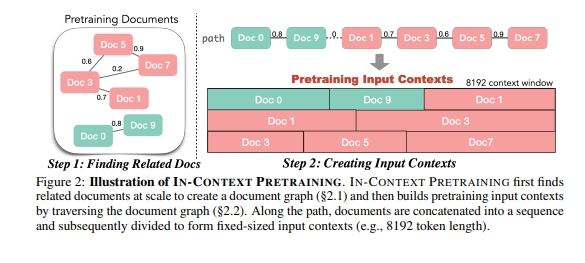

# 增量预训练（Pretrain）样本拼接篇

- [增量预训练（Pretrain）样本拼接篇](#增量预训练pretrain样本拼接篇)
  - [一、Pretrain阶段，为什么需要拼接拼接？](#一pretrain阶段为什么需要拼接拼接)
  - [二、有哪些 拼接方式？](#二有哪些-拼接方式)
    - [2.1 拼接方式一：Random Concatenate](#21-拼接方式一random-concatenate)
    - [2.2 拼接方式二：Random Concatenate + NoiseMask](#22-拼接方式二random-concatenate--noisemask)
    - [2.3 拼接方式三：Random Concatenate + Cluster](#23-拼接方式三random-concatenate--cluster)
    - [2.4 拼接方式四：IN-CONTEXT PRETRAINING](#24-拼接方式四in-context-pretraining)
  - [致谢](#致谢)

## 一、Pretrain阶段，为什么需要拼接拼接？

为了提高pretrain效率、拓展LLM最大长度，随机将若干条短文本进行拼接是pretrain阶段常见手段。

## 二、有哪些 拼接方式？

### 2.1 拼接方式一：Random Concatenate

随机将短文本 {examples_i}  拼接成 {examples_k} 以打满maxLen是pretrain的常见手段，该方法不仅能够降低padding占比、提高训练效率，还能使LLM具备更好的长文本处理能力。

但笔者认为，绝大多数情况下构成 Example  的多个 examples 彼此互不相关，无法提供有效的上下文信息，LLM自然也无法从拓宽的窗口中获得反馈。甚至，在语料较少、分布比较集中时，LLM很有可能从多次、偶然的（因拼接导致的）噪音共现中拟合到错误的特征。当然，如果语料足够多、分布足够广，LLM仍能通过足够的contrastive，逐渐聚焦于 examples 本身而非其他无关 examples 。此外，也有一些使用specialToken对 examples 进行软隔离的方案，但没有额外的正则手段时，使用specialToken进行隔离或许只是鸡生蛋、蛋生鸡的死循环。

### 2.2 拼接方式二：Random Concatenate + NoiseMask

为缓解2.1所述的无关 examples 间的噪音共现问题，笔者尝试过添加自定义attentionMask，使LLM在pretrain 时仅 focus on 当前 example ，经笔者测试，该方法在ICL few-shot上相比2.1（也即常规pretrain方法）有1.6%左右的提升。

```s
def segment_causal_mask(input_ids, device, val=float("-inf")):
    bsz, tgt_len = input_ids.shape
    cum_lens = torch.arange(1, tgt_len+1, device=device).unsqueeze(0) * \
               torch.eq(input_ids, EosTokenId).int().to(device)

    mask = torch.zeros([bsz, tgt_len, tgt_len]).to(device)
    for i, _cum_lens in enumerate(cum_lens):
        for v in _cum_lens:
            mask[i,v:,:v] = val

    return mask
```

但这种方式仍存在一个问题，相对位置编码（如ALIBI、ROPE）的token-wise相对位置信息会在attentionScore矩阵对应位置有所体现，如果施加了attentionMask，这部分相对位置信息经过softmax会被完全掩盖/误杀，也即LLM无法在BP过程中，从跨 examples 间获得反馈（不论是相对位置的反馈还是语义信息的反馈）。因此在不考虑外推性的前提下，这种pretrain方法仍是在短文本窗口内进行训练，没有真正意义上实现maxLen级别的长文本训练，只能起到提高训练效率的作用。

另外，尽管2.1中没有利用attentionMask，LLM是否能从无关 examples 构成的窗口中获取对（更远）相对位置的正向反馈仍然存疑（如果数据构成表现为远的都不相关，即便没有mask，LLM也倾向于忽略更远的tokens），或许这也是多数LLM在拓宽maxLen之后，长文本支持效果仍然差强人意的原因之一。

### 2.3 拼接方式三：Random Concatenate + Cluster

鉴于2.2存在的问题，能否既不施加attentionMask，也能让LLM不受跨 examples 干扰甚至还能获益的方法呢？一个直观的想法就是以实体、语义等维度对 {examples_i} 进行聚类，使构成同一个 Example 的 examples 存在真实可靠的信息共现前提，从而LLM更加不容易从噪音共现中学偏，也能从pretrain中适应更加广泛全局的attention、从而具备更好的长文本处理能力。

笔者曾经尝试沿实体维度进行聚类，但发现了一个比较棘手的问题：信息重复，以及经过关键词、语义去重后仍难以避免的信息泄露（或者说二者本质相同，只是程度的分别）。在此情况下LLM有从memorize变成了copy的风险，或许这就是后来实验结论没有显著的原因。

本文作者提出的ICLM实际上也是一种类似的方法，即基于语义对 examples 进行聚合、拼接，因此笔者开始时也十分好奇作者如何妥善处理泄露问题。

### 2.4 拼接方式四：IN-CONTEXT PRETRAINING

作者在文中提出的pretrain方法，基本思想是在拼接时，利用语义相似度，优先将最相似的 
 进行拼接，从而构成语义更加连贯流畅的上下文，基本流程如下图：

1. 将 {examples_i} embedding化（作者使用了contriever）；
2. 基于余弦距离进行数据去重；
3. 基于旅行商思想，不断串联最相关的 examples（每个 example 用完即扔，不会repeat）；
4. 基于拼接后的 {examples_k} 进行pretrain；



作者在文中多次强调了数据去重的重要性，并经过消融实验验证了去重对ICLM的正向增益。相比实体，沿语义聚合的 {examples_i} 分布更加平缓，受泄露影响的风险更低；此外，分布更广泛的数据、更妥善的去重操作，或许也是ICLM能够有效的重要原因。

## 致谢

- IN-CONTEXT PRETRAINING: LANGUAGE MODELING BEYOND DOCUMENT BOUNDARIES https://arxiv.org/pdf/2310.10638.pdf
- LLM在Pretrain时如何做好拼接 https://zhuanlan.zhihu.com/p/676647785
