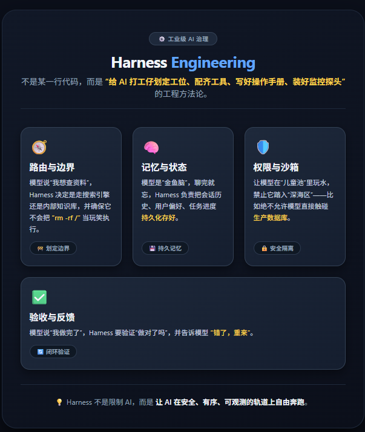
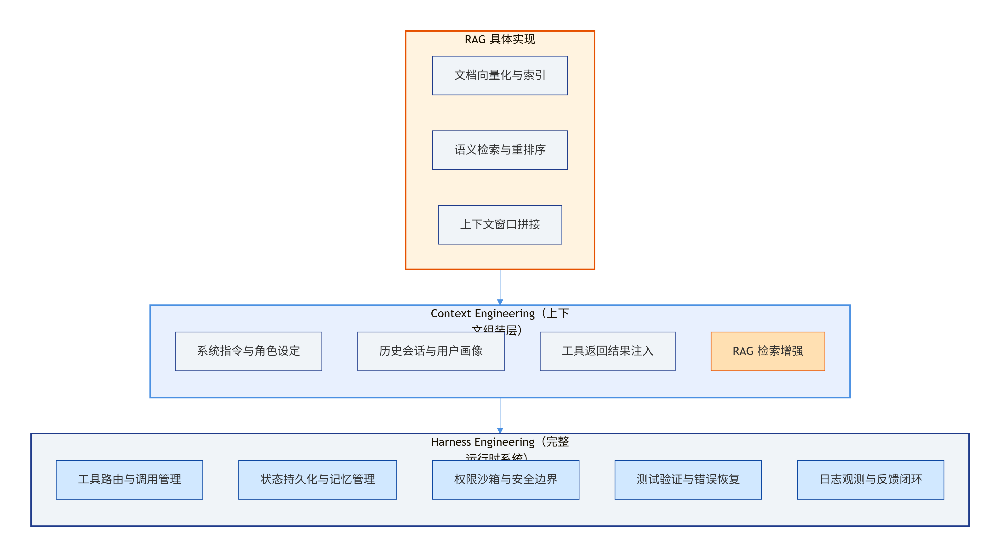

# Hermes Agent 面试高频题——Harness Engineering 基础概念

## 引言：为什么你明明感觉模型“懂了”，落地时却总“废了”？

不少同学都有过这种“颅内高潮”式的面试经历：面试官问“RLHF 怎么训”，你对答如流；问“Multi-Head Attention 复杂度”，你倒背如流。结果面试官突然画风一转，轻描淡写问了句：“那你觉得，一个只有裸模型的 Agent，为什么上不了线？”

这时候如果你愣住，或者开始背 Prompt 工程的口诀，抱歉——在面试官眼里，你已经从“算法大神”被悄悄划到了“玩具玩家”那一栏。

因为大厂现在根本不缺能调参的人，缺的是**能把模型当人用、当生产工具管起来的人**。这就是今天我们要死磕的**Harness Engineering（束具工程）**——大模型面试中一道没有题库、全靠真理解的“分水岭”。

> 如果说模型是 Agent 的“大脑”，那 Harness 就是它的“骨架 + 神经系统 + 肌肉记忆”。大脑再聪明，没有骨架撑着，也不过是一滩瘫在桌上的软组织。

## 1. 【⭐】什么是 Harness Engineering？为什么说 Agent = Model + Harness？

**💡 考察点：**  
面试官不是要你背定义，而是想看你能不能分清“模型能力”和“工程化能力”之间的楚河汉界。很多候选人把“调用 API”等同于“构建 Agent”，这恰恰是踩雷的开始。

**🎯 高分解题姿势：**

Harness Engineering 不是某一行代码，而是一套 **“给 AI 打工仔划定工位、配齐工具、写好操作手册、装好监控探头”** 的工程方法论。

具体来说，它负责四件大事：
1. **路由与边界**：模型说“我想查资料”，Harness 决定是走搜索引擎还是内部知识库，并确保它不会把“rm -rf /”当玩笑执行。
2. **记忆与状态**：模型是“金鱼脑”，聊完就忘，Harness 负责把会话历史、用户偏好、任务进度持久化存好。
3. **权限与沙箱**：让模型在“儿童池”里玩水，禁止它踏入“深海区”——比如绝不允许模型直接触碰生产数据库。
4. **验收与反馈**：模型说“我做完了”，Harness 要验证“做对了吗”，并告诉模型“错了，重来”。

**公式可以这样理解：**

$$ \text{Agent} = \underbrace{\text{Model}}_{\text{大脑：推理与生成}} + \underbrace{\text{Harness}}_{\text{骨架 + 手脚 + 神经系统：执行、记忆、边界、纠错}} $$

模型负责“提议”——它说“我觉得应该这么做”；Harness 负责“在边界内执行并证明做完”。没有 Harness 的模型，就像一个只会纸上谈兵的顾问，报告写得漂亮，但连个 PPT 都不会帮你保存。

## 2. 【⭐】Harness Engineering 和 Prompt Engineering 有什么区别？

**💡 考察点：**  
这是面试官最爱用的“概念照妖镜”。如果你回答“差不多，都是调优”，那基本就凉了。面试官想听的是**层次感**——你能不能一眼看穿哪个是“战术”，哪个是“战略”。

**🎯 高分解题姿势：**

一句话扎穿本质：**Prompt Engineering 是你怎么跟模型说话；Harness Engineering 是你怎么给 Agent 搭工作台。**

| 维度 | Prompt Engineering | Harness Engineering |
| :--- | :--- | :--- |
| **核心命题** | “怎么说，模型才听得懂、答得好？” | “怎么干，Agent 才靠得住、不出事？” |
| **作用范围** | 单次对话或单轮推理 | Agent 的完整生命周期（从启动到任务终结） |
| **产出物** | 提示词模板、COT 链路、Few-shot 样本 | 编排循环、工具注册中心、状态机、沙箱策略 |
| **失败后果** | 回答有点蠢，或者格式不对 | Agent 直接失控、执行非法操作、任务中断 |
| **调优手段** | 措辞调整、上下文拼装、角色扮演 | 代码重构、状态回滚、权限收紧、观测补全 |

> 打个比方：Prompt Engineering 是**教练给运动员喊战术**；Harness Engineering 是**给运动员建训练馆、装体能监测仪、请康复师、买保险**。战术喊得再好，没有场馆和保障，运动员照样练废。

## 3. 【⭐】Harness Engineering 和 Context Engineering / RAG 是什么关系？

**💡 考察点：**  
这题考的是**概念洁癖**——很多候选人会把 RAG、上下文管理和 Harness 搅成一锅粥。面试官要看你能不能把这三个概念像俄罗斯套娃一样，清晰地一层套一层。

**🎯 高分解题姿势：**

它们仨的关系不是“并列”，而是**层层包裹**的嵌套关系：

$$ \text{RAG} \subset \text{Context Engineering} \subset \text{Harness Engineering} $$

- **RAG（检索增强生成）**：最内层。它是**一种具体的技术手段**，通过向量检索把外部文档塞进上下文，帮模型“开卷考试”。它只解决“知识不够新”这一个痛点。
- **Context Engineering（上下文工程）**：中间层。它不关心你用的是 RAG 还是长上下文窗口，它只关心 **“这次推理，模型该知道什么”** ——包括系统指令、历史记忆、用户画像、工具返回的结果。它解决的是“信息如何组装”。
- **Harness Engineering**：最外层。它把 Context Engineering 当作一个子模块，但还要管工具怎么路由、状态怎么持久化、权限怎么卡死、错误怎么重试、结果怎么验证。它解决的是 **“整个系统怎么稳”**。

**架构关系图如下：**

面试时你能把这个嵌套关系画出来，面试官基本就会在评分表上给你打个“概念清晰”的勾。

## 4. 【⭐】为什么说“除了模型都是 Harness”？

**💡 考察点：**  
这是一道**边界探测题**。面试官想看你知道 Harness 的“地盘”到底有多大——是只包括几行胶水代码，还是涵盖了整个 MLOps 链路？

**🎯 高分解题姿势：**

这句话的潜台词是：**模型权重只占整个 Agent 系统代码量的 5%，但它决定了 50% 的天花板；剩下的 95% 的工程代码，决定了系统是“神兵利器”还是“塑料玩具”。**

一个可上线的 Agent，除了加载模型权重的那几行代码之外，**所有东西**都是 Harness：

| 组件 | 是否属于 Harness | 说明 |
| :--- | :--- | :--- |
| 系统提示词与工具 JSON Schema | ✅ 是 | 模型不看这些就是“裸奔” |
| MCP 中间件与协议转换 | ✅ 是 | 模型不会自己装驱动 |
| 会话存储（Redis / PostgreSQL） | ✅ 是 | 模型根本没有记忆体 |
| 沙箱环境（Docker / Wasm） | ✅ 是 | 模型不会给自己画地为牢 |
| RBAC 权限控制 | ✅ 是 | 模型不懂“谁能删表” |
| 成本预算与 Token 配额 | ✅ 是 | 模型只会烧钱，不会省钱 |
| 测试验证框架与断言 | ✅ 是 | 模型不会给自己写单元测试 |
| 可观测性（Tracing / Metrics / Logs） | ✅ 是 | 模型瞎了，你得帮它装眼睛 |

**为什么裸模型上不了线？** 很简单——模型是**概率性的**，而生产环境是**确定性的**。Harness 就是在概率和确定性之间修一座桥。没有这座桥，模型再强，也只是一台“装了 F1 引擎的购物车”——踩一脚油门就散架。

## 5. 【⭐】Harness.io 和 Agent Harness 怎么区分？（高频陷阱题）

**💡 考察点：**  
这道题堪称面试界的“语文考试”。很多候选人简历上写着“熟悉 Harness”，面试官随口一问“你说的是哪个 Harness”，直接哑火。这题不考技术深度，考的是**你是否知道自己在说什么**。

**🎯 高分解题姿势：**

这俩玩意儿唯一的共同点就是拼写相同，其他全是雷区：

| 维度 | Harness.io | Agent Harness |
| :--- | :--- | :--- |
| **本质** | 一家商业软件公司（CI/CD 平台） | 一种工程方法论 / 运行时系统 |
| **核心产品** | 持续交付、云成本管理、功能开关 | 包裹 LLM 的工具路由、状态管理、权限沙箱 |
| **目标用户** | DevOps 工程师、运维团队 | AI 应用开发者、算法工程师 |
| **技术栈** | Kubernetes、GitOps、云原生 | Python、FastAPI、MCP 协议、向量库 |
| **如果搞混** | 面试官会觉得你连百度都没打开过 | 直接判定为“概念不清，工程底子薄” |

**面试求生指南：**  
一旦面试官提到“Harness”，**务必条件反射式反问**：“请问您指的是 Harness.io 的 CI/CD 平台，还是大模型 Agent 领域的 Harness Engineering？”——这句话一出口，面试官心里对你的印象分至少 +20，因为**你在帮他消除歧义，而不是给他挖坑**。

# 总结：Harness 不是“附加题”，而是“入场券”

很多算法同学对 Harness 有天然的排斥感，觉得“我是搞模型的，工程化的破事与我何干？”——但现实是，**2026 年的招聘市场，纯调参岗已经卷成红海，而懂 Harness 的算法工程师，才是各大厂争抢的香饽饽。**

这 5 道题只是 Harness 世界的“开胃菜”，它们的核心逻辑只有一条：

> **模型是天赋，Harness 是职业素养。天赋决定你能飞多高，职业素养决定你能飞多久。**

如果你今天能清晰地回答出“Agent = Model + Harness”不是一句 slogan，而是一套**可落地、可观测、可迭代的工程体系**，那恭喜你——你已经跑赢了 80% 只会背 Transformer 论文摘要的候选人。

**但别急着飘，真正的硬仗在后面。** 下一期我们会深入 Harness 的“内脏”——**工具路由、MCP 协议、状态机设计与错误恢复**，到时候你会明白：让 Agent 干活不难，让 Agent **一直干对活**，才是地狱级副本。

觉得有用？**转发给你身边那个还在死磕 Prompt 的兄弟，让他也醒醒。** 评论区留下你对 Harness 最头疼的问题，点赞最高的，我们下期单独开篇硬核拆解。
