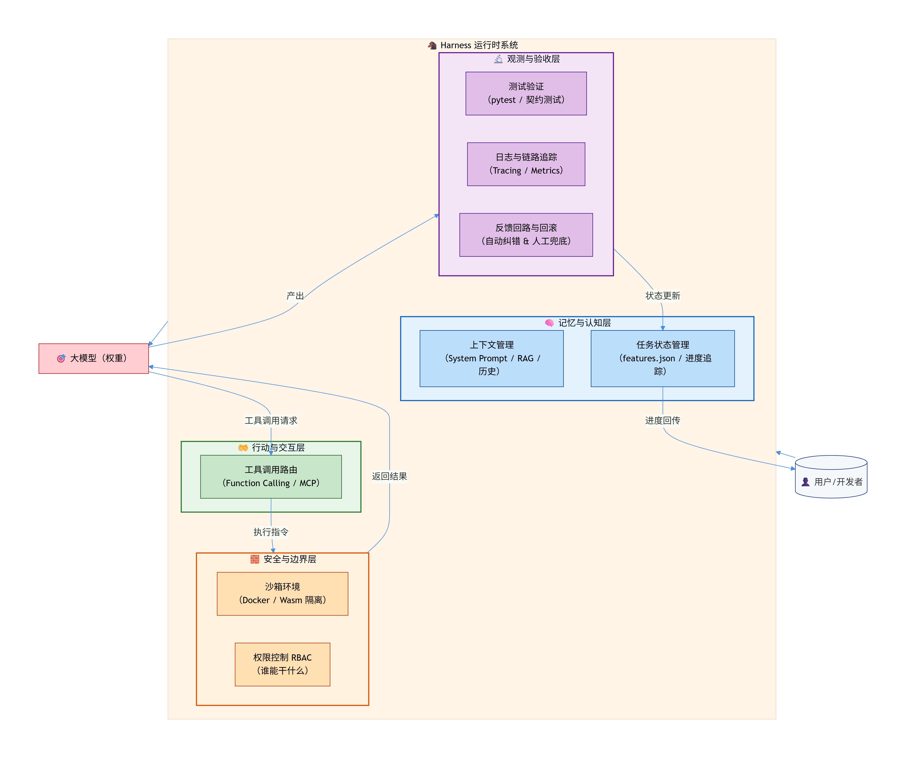
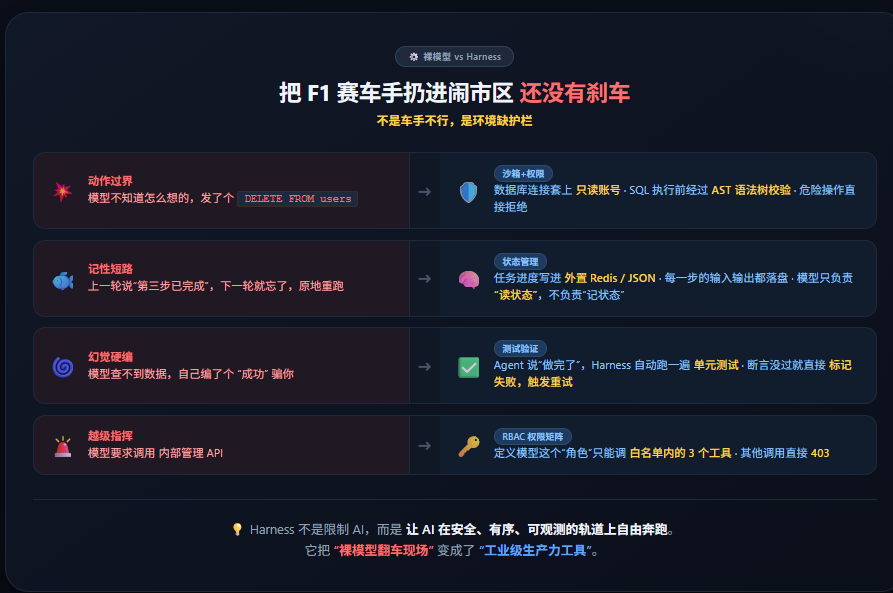
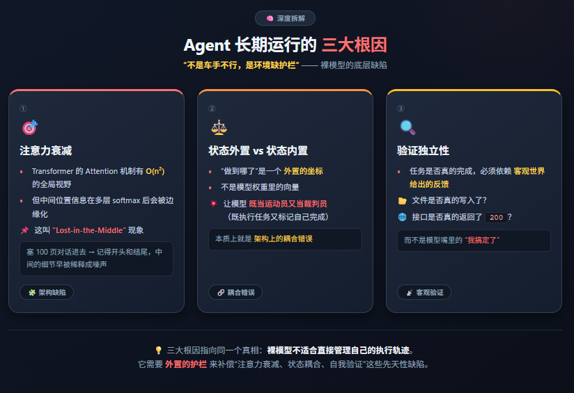
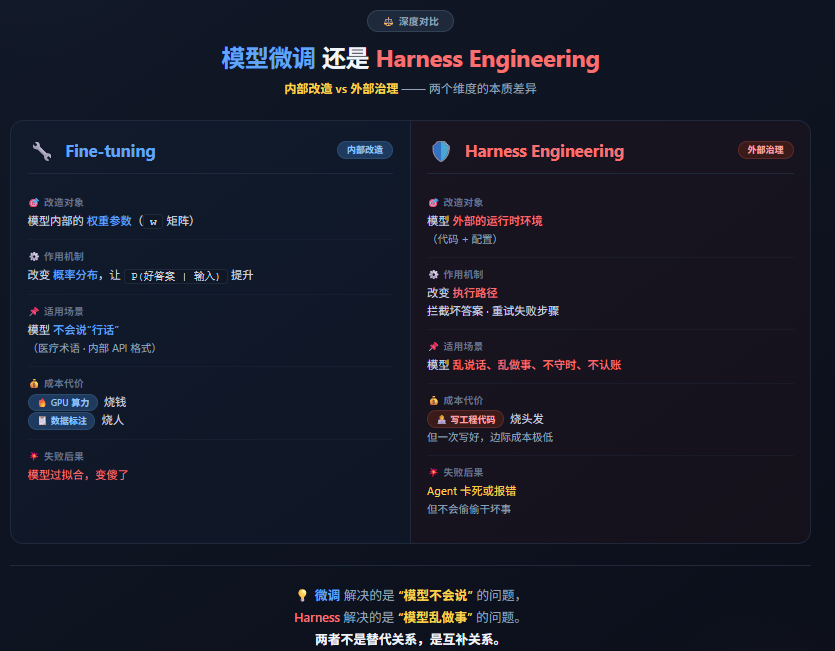
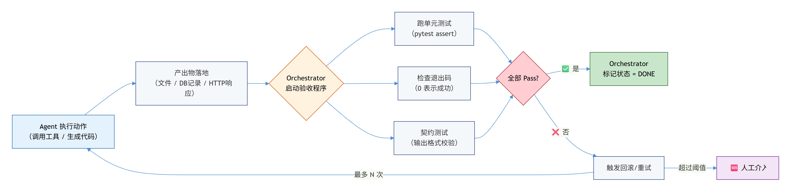

# Harness Engineering 高频题-Harness 核心机制

## 6. 【⭐】Harness 包含哪些核心模块？——别跟我说“就那些组件”

**💡 考察点：**  
这题表面是考背诵，实则是考“工程化颗粒度”。你说出“工具调用、记忆管理”只是小学生水平；能把模块按**职能域**分类，并画出协作关系，才是面试官愿意打高分的人。

**🎯 高分解题姿势：**

Harness 不是一堆零碎功能的堆砌，而是一套**四层防御体系**。我把它拆解为 **“脑、手、墙、眼”** 四大支柱，你按这个逻辑讲，面试官瞬间觉得你脑子里有架构图：

| 支柱 | 核心模块 | 一句话解释 |
| :--- | :--- | :--- |
| **🧠 记忆与认知层** | 上下文管理、任务状态管理 | 让模型知道自己“从哪来、到哪去、干到哪步了” |
| **🤲 行动与交互层** | 工具调用、MCP 中间件 | 让模型能“动手”查资料、调接口、写代码 |
| **🧱 安全与边界层** | 沙箱环境、权限控制（RBAC） | 给模型画地为牢，越权操作直接物理拦截 |
| **🔬 观测与验收层** | 测试验证、日志观测、反馈回路、人工干预与回滚 | 让模型的每一次“抽风”都有迹可循、有药可救 |

**全貌架构协同图（面试推荐手绘版）：**

> 这图一摆，面试官就知道你不是“纸上谈兵”，而是真正用工程思维拆解过 Agent 系统。

## 7. 【⭐】裸 LLM 直接做 Agent 有什么问题？Harness 怎么解决？

**💡 考察点：**  
这题问的不是“有没有问题”，而是“问题有多痛”。面试官想听你有没有被线上 Agent 坑到半夜爬起来改代码的真实体感。

**🎯 高分解题姿势：**

裸模型做 Agent，就像把 F1 赛车手扔进闹市区还没有刹车——**不是车手不行，是环境缺护栏**。具体痛点与 Harness 的“四连杀”如下：

**一句话金句收尾：**
> Harness 的哲学不是“给模型更好的脑子”，而是**给模型装上带减速带和护栏的赛道**。脑子再好，没有赛道，一脚油门就是车毁人亡。

## 8. 【⭐】更长上下文能解决 Agent “烂尾”问题吗？（经典剥洋葱题）

**💡 考察点：**  
这题是面试官最爱用的“认知陷阱”。如果你点头说“能”，他下一句就是“那 10M 上下文是不是可以干掉所有 Agent 框架了？”——你当场死亡。

**🎯 高分解题姿势：**

**答案就是一个字：不能。** 更长的上下文窗口，充其量只是把“烂尾”的时间点往后推了推，但并没有消灭“烂尾”的根源。

**根因深度拆解：**
1. **注意力衰减**：Transformer 的 Attention 机制虽然有 O(n²) 的全局视野，但中间位置的信息在多层 softmax 后会被边缘化。这叫 **“Lost-in-the-Middle” 现象**——你塞 100 页对话进去，模型记得开头和结尾，中间的细节早被稀释成噪声了。
2. **状态外置 vs 状态内置**：哪怕模型真的全记住了，“做到哪了”这件事本质上是一个**外置的坐标**，而不是模型权重里的向量。让模型既当运动员又当裁判员（既执行任务又标记自己完成），本身就是架构上的耦合错误。
3. **验证独立性**：任务是否真的完成了，必须依赖客观世界给出的反馈（比如文件是否真的写入了、接口是否真的返回了 200），而不是模型嘴里的“我搞定了”。

**正确的组合拳方案（公式化表达）：**

$$ \text{任务不烂尾} = \underbrace{\text{外置状态清单}}_{\text{features.json 逐项打勾}} + \underbrace{\text{客观真值验证}}_{\text{pytest / 接口契约}} + \underbrace{\text{短上下文聚焦}}_{\text{每次只读当前 step 的上下文，不加载全量历史}} $$

> **人话解释**：上下文再长，也只是“记忆力好”；但“不烂尾”靠的是“项目管理”——你得有进度看板（外置状态），还得有质量检测员（自动化测试）。记忆力好的员工如果没有这两样，照样把项目拖黄。

---

## 9. 【⭐】Harness 和模型微调（Fine-tuning）是什么关系？

**💡 考察点：**  
这道题考的是**预算分配思维**。面试官想看你知道什么时候该花 GPU 算力去“训”，什么时候该花工程人力去“管”。

**🎯 高分解题姿势：**

用一句大白话切开：**微调是给模型“补课”，Harness 是给模型“立规矩”。**

**现实中的“组合拳”策略（面试加分项）：**
> 先用 **LoRA 微调**花 100 块钱让模型搞清楚公司内部 50 个 API 的具体入参格式（提升准确率），再用 **Harness** 把模型的每一次 API 调用权限锁死、预算设上限、失败自动重试。**微调负责“干得快”，Harness 负责“不出事”。** 没有微调，Harness 救不了模型的“笨”；没有 Harness，微调只会造出一个“执行力超强的破坏王”。

## 10. 【⭐】谁决定任务“完成”？（终极卸妆题）

**💡 考察点：**  
这是整个模块的“终极大BOSS”。前面 9 道题都在铺垫，就为了在这道题上考验你的**确定性思维**。大模型本质上是一个概率模型，而生产环境要的是 100% 的确定性交付。你到底站在哪一边？

**🎯 高分解题姿势：**

**正确答案只有四个字：客观真值。**

千万别被 Agent 输出的 `"status": "completed"` 或者 `"I am done"` 给骗了。模型输出这些词，只是因为它的概率分布里这些词的概率最高，并不代表它真的把文件写进了磁盘。

**Harness 中的“完成判定”闭环流程：**

**硬核公式（面试时甩出来，震住全场）：**

设 Agent 完成动作为集合 $A$，Harness 定义的真值验证函数为 $V(A)$，则：

$$ \text{Task}_{\text{DONE}} \iff V(A) = \text{True} $$

其中 $V(A)$ 包含且仅包含客观检查项（文件存在、DB 写入了预期行数、HTTP 状态码 = 200、JSON Schema 校验通过）。**Agent 的自我声明不参与 $V$ 的运算。**

> **一句话诛心总结**：在 Harness 的世界观里，**Agent 说“我做完了”只代表它“以为”自己做完了**。只有 Orchestrator 亲自检查过现场（测试通过），这活儿才算真正干完。这就是大模型工程化跟“聊天机器人”最本质的分水岭。

## 📢 模块二收官：别把 Harness 当“附加题”，它就是“及格线”

这 5 道题环环相扣，背后的逻辑链条非常清晰：**裸模型有缺陷 → 需要 Harness 补位 → 补位得靠具体模块 → 但不是堆模块就完了 → 必须靠客观机制判定收场。**

2026 年的算法面试，已经不可能让你只背个 Transformer 结构就糊弄过去了。大厂现在要的是**既懂模型嘴巴怎么张，又懂模型手脚怎么绑**的复合型选手。Harness 这 5 道题，就是检验你“工程落地基因”的测谎仪。

> 你现在流的汗，都是为了防止将来线上 Agent 闯祸时流的泪。把这套逻辑焊进脑子里，比背一百道 LeetCode 都管用。

觉得这一期把 Harness 的内脏翻了个底朝天？**赶紧转给那个正在实验室里把大模型 API 当“神”供着的师弟师妹**，让他们早点醒过来。评论区聊聊：你在实际开发 Agent 时，遇到过最离谱的一次“烂尾”是什么？点赞最高的，下期拿它当反面教材庖丁解牛！👇