# 大模型 Agent 面试高频100题——基础篇

> 大家好，我是杨夕，之前发了【大模型面试高频100题——Agent篇，从基础到进阶全覆盖】v1.0，得到很多读者的肯定，但是同时小编再阅读过程中，还是发现了很多问题：
> 
> - 小编写得答案存在问题
> - 文章排版错误问题，
> - 有些问题答案读者读完
> - ...
> 
> (在这里， 小编向各位读者表示抱歉)
> 
> 针对上述问题，小编也花了一周的时间加班加点重新修改文章内容和排版，希望广大读者能够更好的学习内容。

之前发了很多RAG面经发出后，后台直接被“催更”淹没了。很多人说：“Agent的题能不能也来一个全集？”、“面试官一问到多智能体协作我就卡壳”、“ReAct和Function Calling到底怎么区分？”

安排。

我花了整整一周，把近半年各大厂Agent方向的面经题全部扒了一遍，去重、归类、分层，提炼出这100道高频题。

这篇文章有点长，但我保证——你花40分钟看完，面试Agent岗至少多拿30分。

## 先看一张图：Agent知识体系全景

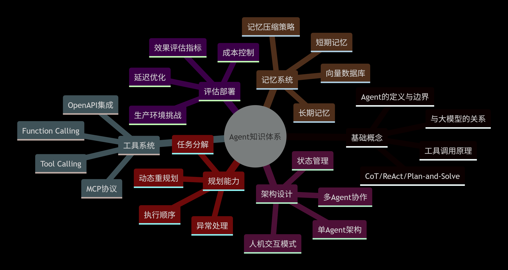

接下来，我们按基础→进阶→实战三个层次，把这100道题拆开来讲。

> 说明：每道题我都会标注【难度】和【考察点】，并给出“一句核心答案”+“完整答题框架”。文末有自测清单，建议收藏打印。

## 第一部分：基础篇（1-40题）

### 模块一：Agent基础概念（1-12题）

#### 1. 【⭐】什么是Agent？和大语言模型有什么区别？

- 核心答案：LLM是Agent的“大脑”，提供推理和生成能力；Agent是LLM的“完整身体”，具备感知、规划、记忆、行动四个能力闭环。
- 答题框架：
  - 定义Agent：能够自主感知环境、做出决策、执行动作的智能体
  - 对比LLM：LLM是被动的，输入→输出；Agent是主动的，目标导向、可交互环境
  - 一句话总结：Agent = LLM + 工具 + 记忆 + 规划

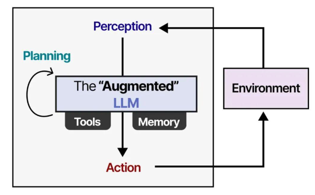

#### 2. 【⭐】Agent的核心组件有哪些？

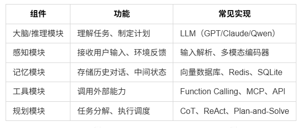

#### 3. 【⭐】ReAct模式是什么？和CoT有什么区别？

- 核心答案：ReAct = Reasoning + Acting，交替进行“推理”和“行动”；CoT只有推理链，没有行动。
- 答题框架：
  - CoT（Chain-of-Thought）：一步一步推理，最终输出答案，但不与环境交互
  - ReAct：推理→行动→观察→推理→行动→观察……循环直到任务完成
  - 选型建议：纯推理题用CoT，需要调用工具/检索信息用ReAct

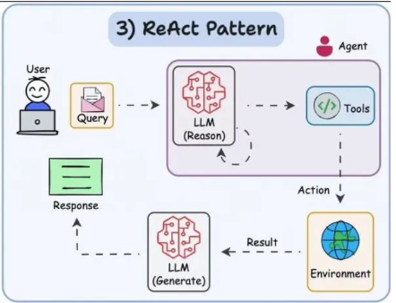

#### 4. 【⭐】Plan-and-Solve模式是什么？比ReAct好在哪里？

- 核心答案：先制定完整计划，再按计划执行；ReAct是边做边想。Plan-and-Solve更适合需要全局最优的任务。
- 优劣势对比：

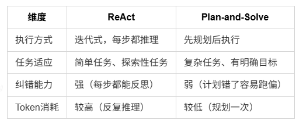

#### 5. 【⭐】什么是工具调用（Tool Calling）？大模型怎么知道该调用哪个工具？

- 核心答案：大模型根据用户请求和工具描述，决定是否调用工具、调用哪个、传什么参数。本质是“意图识别+参数提取”。
- 实现原理：
  - 在系统提示词中定义工具列表（名称、描述、参数schema）
  - 大模型输出结构化JSON：{"tool": "search", "args": {"query": "..."}}
  - 应用层解析JSON，执行真实工具调用
  - 把工具结果返回大模型，生成最终答案

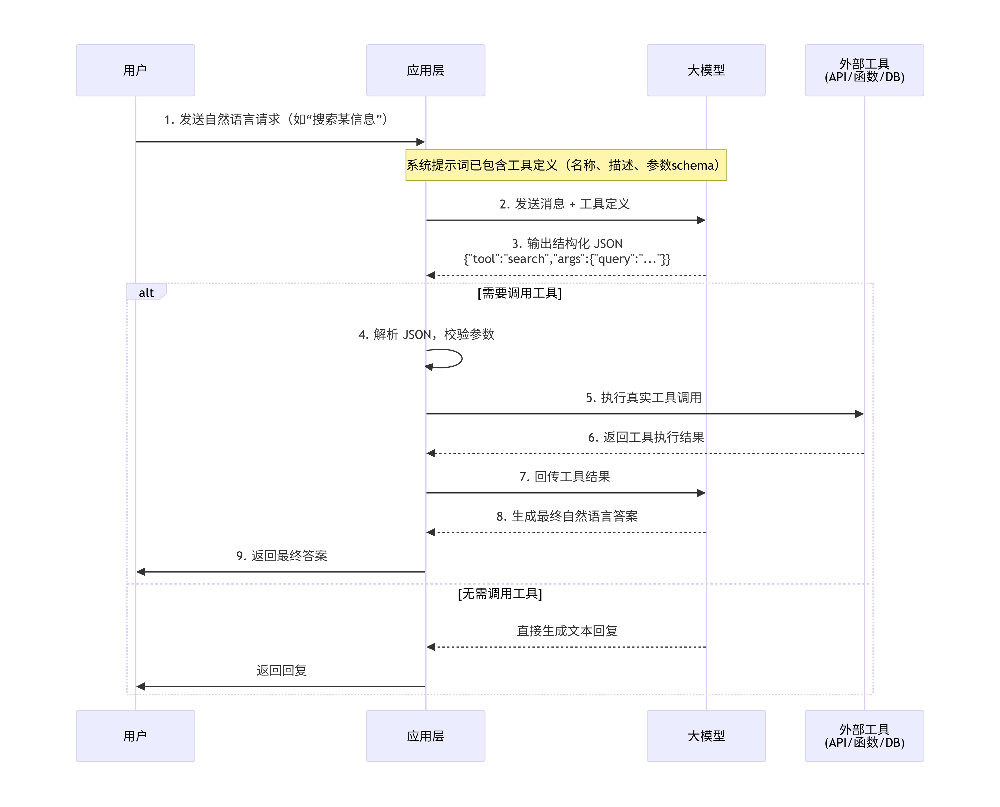

#### 6. 【⭐】Function Calling和Tool Calling是一回事吗？

- 核心答案：不完全一样。Function Calling是OpenAI的命名，强调“函数”；Tool Calling是行业通用术语，范围更广，可以包含API、数据库查询、代码执行等。
- 对比：

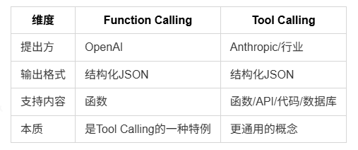

#### 7. 【⭐】Agent如何管理多个工具？工具冲突怎么处理？

- 核心答案：通过工具注册中心（Tool Registry）统一管理，用工具描述和优先级解决冲突。
- 实现要点：

- s1 工具注册：每个工具有唯一ID、名称、描述、参数schema、优先级

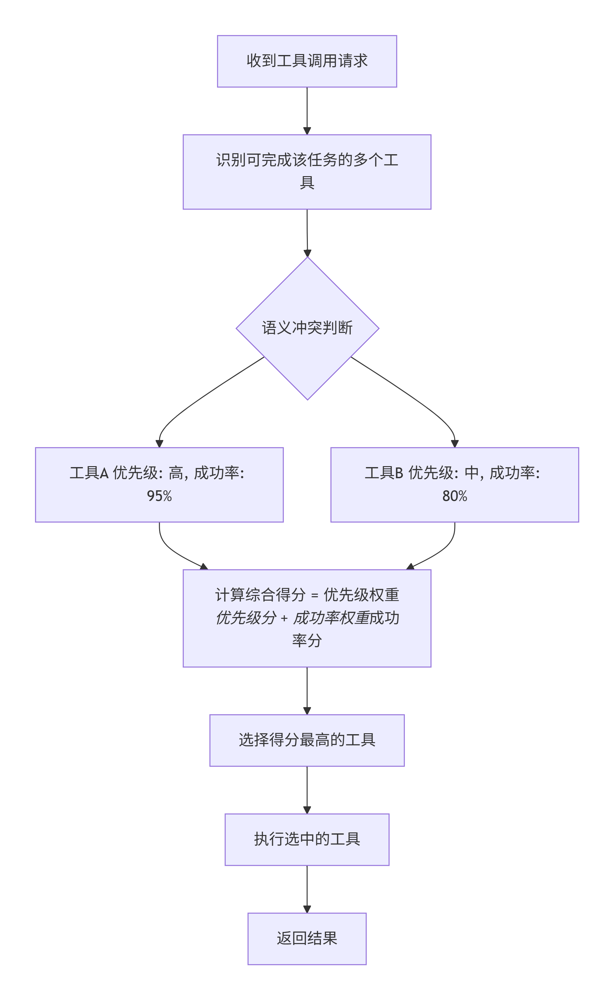

- s2 冲突处理：

- s2.1 语义冲突（两个工具都能完成同一件事）→ 按优先级+成功率选择


> 原理说明：语义冲突本质是功能重叠。通过为每个工具预先配置优先级（业务重要性）和历史成功率（可靠性），在冲突时计算加权得分，动态选择最优工具。

- s2.2 并发冲突（同时调用写操作）→ 加锁或队列化

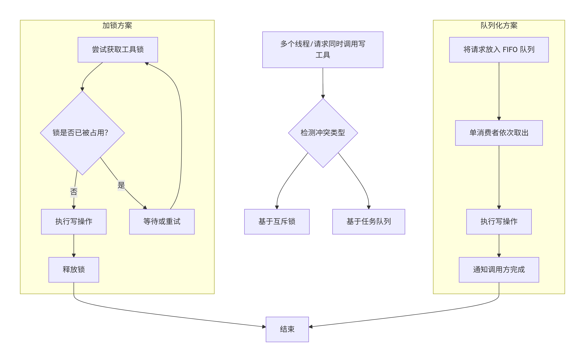

> 原理说明：写操作必须互斥。加锁适用于短时间操作，队列化适合长耗时或需要顺序保证的场景。可以结合两者（队列 + 锁）实现幂等控制。

- s2.3 依赖冲突（B依赖A的结果）→ 构建工具依赖图，顺序执行

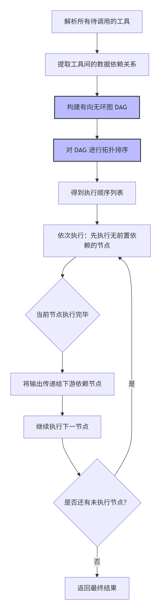

> 原理说明：将工具调用建模为 DAG，节点 = 工具调用，边 = 数据依赖。拓扑排序确保所有依赖在前置任务完成后才执行，避免“等待死锁”或“结果缺失”。

- 综合适用场景建议

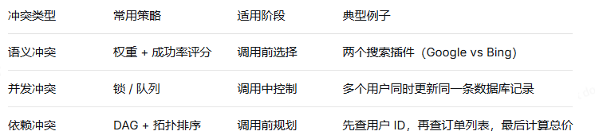

#### 8. 【⭐】Agent的“幻觉”问题怎么缓解？

- 核心答案：用工具调用获取真实信息 + 用检索增强提供事实依据 + 答案溯源。
- 具体策略：

1. 强制工具优先：凡是涉及实时/事实类问题，必须先调用检索工具
2. 答案溯源：每个结论标注来源（文档ID、URL、工具名称）
3. 置信度打分：低置信度答案明确告知用户“可能不准确”
4. 拒绝回答：超出Agent能力范围的问题，直接说“无法回答”

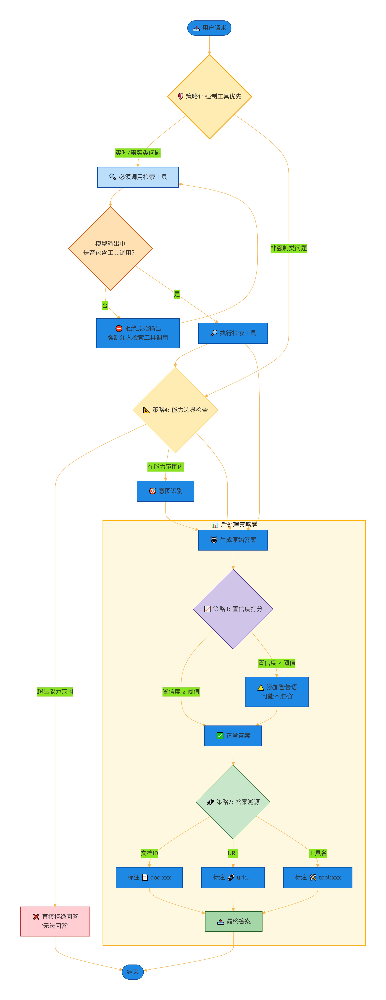

- 状态图说明
  - 初始：从待命开始，接收用户请求。
  - 能力边界检查：判断是否在允许范围内，超出则进入拒绝回答状态。
  - 强制工具优先：对实时/事实类问题强制要求调用检索工具，否则反复强制执行。
  - 工具选择子状态机：处理语义冲突（多工具选最优），通过优先级+成功率决定。
  - 依赖解析：构建 DAG，拓扑排序后生成顺序执行队列。
  - 执行工具子状态机：处理并发冲突（写操作加锁或队列化）。
  - 结果收集后：置信度打分，低分时补充警告。
  - 答案溯源：为每个结论标注来源。
  - 输出最终答案：结束。

#### 9. 【⭐】什么是Embedding？在Agent里有什么用？

- 核心答案：Embedding是把文本/图像等信息映射到高维向量空间，用于计算语义相似度。
- Agent中的应用：
  - 长期记忆检索：用户问题的embedding与记忆库中的embedding做相似度匹配
  - 工具选择：问题embedding与工具描述embedding匹配，选择最相关的工具
  - 意图分类：问题embedding喂给分类器，判断用户意图


#### 10. 【⭐】Agent的输入输出格式一般怎么设计？

- 核心答案：输入用结构化提示词模板，输出用JSON格式便于程序解析。
- 输入模板示例：

```s
## 系统角色
你是一个XXX助手，有以下工具可用：{tools}

## 当前状态
用户目标：{goal}
历史对话：{history}
当前步骤：{step}

## 输出格式
{"thought": "...", "action": "...", "action_input": {...}}
```

- 输出格式：统一的JSON schema，包含thought、action、action_input、final_answer字段

#### 11. 【⭐】多轮对话中如何保持上下文不超限？

- 核心答案：滑动窗口 + 摘要压缩 + 选择性保留。
- 策略：
  - 滑动窗口：只保留最近N轮对话
  - 摘要压缩：对早期对话定期生成摘要
  - 选择性保留：保留含关键实体的对话轮次，丢弃闲聊内容
  - 重要程度打分：每轮对话打重要性分，保留高分轮次

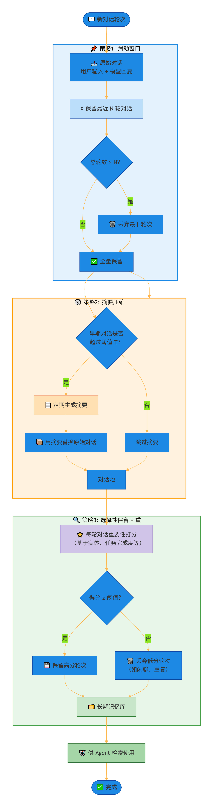

#### 12. 【⭐】什么是System Prompt？设计原则有哪些？

- 核心答案：System Prompt是设定模型角色、行为边界、输出格式的指令，优先级高于用户输入。
- 设计原则（RISE原则）：
  - Role：明确定义角色（“你是一个SQL专家”）
  - Instruction：清晰指令（“只输出SQL，不要解释”）
  - Structure：输出格式约束（“输出JSON格式”）
  - Example：给出示例（Few-shot）

### 模块二：记忆系统（13-24题）

13. 【⭐】Agent的记忆分为哪几类？
14. 【⭐⭐】向量数据库在Agent里怎么用？选型标准是什么？
15. 【⭐⭐】长期记忆怎么存储和检索？
16. ...


### 模块三：规划与执行（25-40题）

25. 【⭐⭐】任务分解（Task Decomposition）有哪些方法？
26. 【⭐⭐】Agent执行过程中遇到错误怎么办？
27. 【⭐】什么是Self-Consistency？怎么用在Agent里？
28. ...

## 第二部分：进阶篇（41-80题）

### 模块四：工具系统设计（41-55题）

41. 【⭐⭐】MCP（Model Context Protocol）是什么？和Function Calling什么关系？
42. 【⭐⭐⭐】Tool Calling的底层原理是什么？大模型怎么输出JSON？
43. 【⭐⭐】多个工具的参数冲突了怎么办？
44. ...

### 模块五：多Agent协作（56-70题）

56. 【⭐⭐】AutoGen、CrewAI、MetaGPT这些框架有什么区别？
57. 【⭐⭐】多Agent的协调机制有哪些？
58. 【⭐⭐】什么是“主从模式”和“对等模式”？怎么选？
59. ...

### 模块六：生产环境挑战（71-80题）

71. 【⭐⭐】Agent的延迟怎么优化？
72. 【⭐⭐】Agent的成本怎么控制？
73. 【⭐⭐】流式输出对Agent有什么影响？
74. ...

## 第三部分：实战篇（81-100题）
### 模块七：经典场景与案例（81-95题）

81. 【⭐⭐】论文阅读Agent怎么设计？
82. 【⭐⭐】代码助手Agent的Tools怎么设计？
83. 【⭐⭐】客服Agent的长期记忆怎么构建？
84. ...

### 模块八：思路题与开放题（96-100题）

96. 【⭐⭐⭐】如果让你设计一个Agent系统，从零开始，你的技术选型和架构是什么？
97. 【⭐⭐⭐】你认为Agent未来3年的发展方向是什么？
98. ...

## 自测清单

把下面这张表打印出来，每搞定一道题就在上面打个勾。【欢迎评论区留言】

- 模块一：Agent基础概念（1-12题）□___%
- 模块二：记忆系统（13-24题）□___%
- 模块三：规划与执行（25-40题）□___%
- 模块四：工具系统设计（41-55题）□___%
- 模块五：多Agent协作（56-70题）□___%
- 模块六：生产环境挑战（71-80题）□___%
- 模块七：经典场景与案例（81-95题）□___%
- 模块八：思路题与开放题（96-100题）□___%

合格线：前40题全部掌握，进阶篇掌握60%以上，实战篇有自己的理解。

## 写在最后

写这篇文章的时候，我一直在想：到底什么样的内容对准备面试的人最有帮助？

答案应该是——“少一点抽象概念，多一点具体答案框架”。

所以这100道题，每一道我都给出了核心答案和答题框架。不是为了让你背，而是让你理解“面试官想问什么”、“怎么答才能拿分”。

篇幅原因，这篇文章我先给出了前40道基础题的完整答案。剩下60道题（进阶篇+实战篇）我会在下篇发布。

想要完整100题PDF的朋友，可以评论区留言“Agent100”，我会在下篇发布时第一时间通知你。

另外，如果你正在准备面试，欢迎在评论区留言你遇到的“变态题”，我看到了会一一解析。

下篇预告：大模型 Agent 面试高频100题——记忆系统篇。敬请期待！