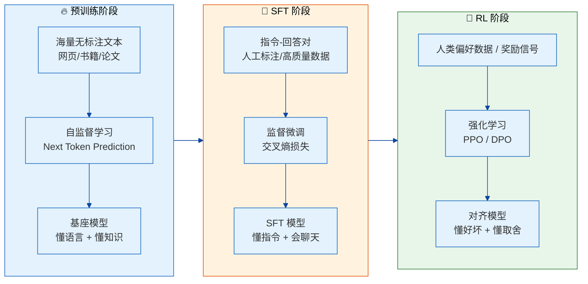
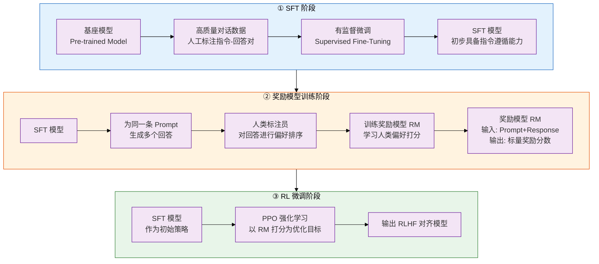
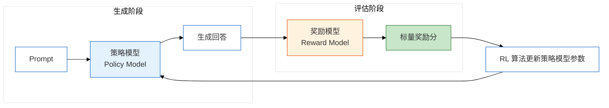
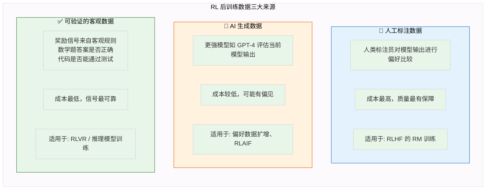
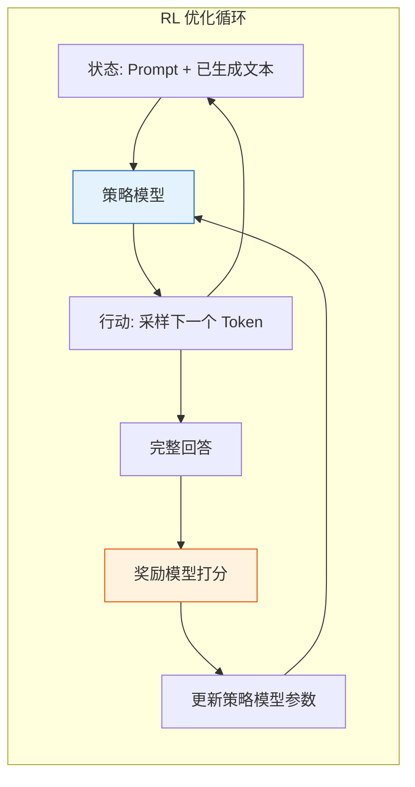
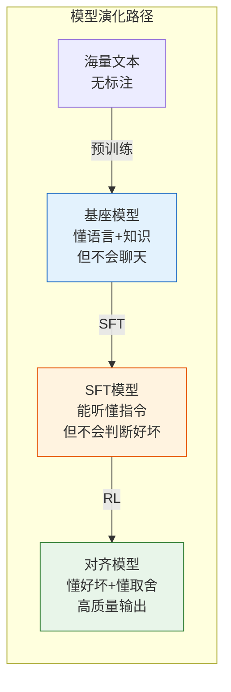

# 大模型强化学习后训练（RL Post-Training）面试高频题——基础概念

## 引言

> **大模型进入下半场，RL 成了分水岭。你可以在 SFT 上追赶，但 RL 这道坎，迈不过去就永远在第二梯队。**

去年面了 30+ 候选人，发现一个让我很意外的现象：**超过 60% 的人对 RLHF 的理解止步于「PPO 是强化学习算法」这个层面**。一问到奖励模型怎么训练、KL 散度为什么能防止模型崩塌、Ref Model 和 Policy Model 在计算图里到底怎么连——多数人就开始支支吾吾。

但现实是，2024 年以来，大厂招人已经不再满足于「用过 LLaMA-Factory 跑过 SFT」的水平了。RL Post-Training 正在成为面试的 **分水岭题区域**——答得好，说明你真的懂模型行为怎么塑造；答不好，面试官心里基本就有数了。

这篇文章，我把 RL 后训练最核心的 15 个问题一次性讲透。不是那种背了就能过的面经，而是让你真正理解「为什么」——理解了，遇到追问也不怕。


## 模块一：强化学习后训练基础概念（1-15 题）


### 题 1：什么是大模型的强化学习后训练（RL Post-Training）？为什么要做后训练？

**考察点**：对 RL 后训练核心概念的理解，及其在整个模型训练 pipeline 中定位的认知

**难度**：⭐


**回答框架**：

RL Post-Training 是指在模型完成预训练（Pre-training）和有监督微调（SFT）之后，**通过强化学习算法持续优化模型行为**的阶段。

这个定义里有三个关键词：

1. **「之后」**——它发生在 SFT 后面，不是替代 SFT。起点通常是已经能做指令遵循的 SFT 模型。
2. **「强化学习」**——用的是 RL 算法（PPO、DPO 等），不是监督学习。模型通过「试错 + 奖励信号」来学习，而不是通过「模仿标注答案」来学习。
3. **「行为优化」**——优化的不是语言能力本身（那是预训练的事），也不是指令遵循能力（那是 SFT 的事），而是**输出的质量、安全性、有用性、与人类偏好的对齐程度**。

**为什么要做后训练？** SFT 有三大天花板：

| SFT 的局限 | 具体表现 | RL 怎么补 |
|---|---|---|
| **只能模仿标注数据** | 标注员怎么写，模型就怎么学。上限 = 标注数据质量 | 模型可以探索标注数据之外的「高分区域」 |
| **缺乏负反馈机制** | SFT 只学「正确答案」，不学「为什么错」 | RL 的奖励信号有正有负，模型能从错误中学习 |
| **序列级别的优化缺失** | SFT 是 token-level 的监督，但回答质量是 sequence-level 的 | RL 优化的是整个回答的最终奖励 |

> 一句话：**SFT 让模型「会说话」，RL 让模型「说好话、说对话、不说错话」。**


### 题 2：大模型训练的三个阶段（Pre-training、SFT、RL）分别解决什么问题？

**考察点**：对完整训练 pipeline 的理解

**难度**：⭐


**回答框架**：

三阶段的关系是层层递进的，每一阶段的「输入 - 输出 - 目标」都不同：



**各阶段核心差异**：

| 维度 | Pre-training | SFT | RL |
|---|---|---|---|
| **优化目标** | 最小化 Next Token Prediction 损失 | 最小化监督损失（交叉熵） | 最大化预期奖励 |
| **数据形式** | 无标注文本（NTP 自监督） | (Prompt, Response) 对 | Prompt + 奖励信号 |
| **数据量级** | 万亿级 Tokens | 万级～十万级 | 万级以内 |
| **学习方式** | 自监督学习 | 监督学习 | 试错学习 + 反馈 |
| **产出** | 基座模型（知识储备） | SFT 模型（指令遵循） | 对齐模型（偏好对齐） |
| **核心能力** | 「懂语言、懂世界」 | 「能听懂人话」 | 「知道什么该说、什么不该说」 |

> 面试官追问：「能不能跳过 SFT 直接做 RL？」——可以，但效果很差。SFT 给 RL 提供了一个「正常的起点」，如果从基座模型直接 RL，初始策略太随机，奖励信号太稀疏，训练极不稳定。SFT 本质上是在做 **行为初始化**，让 RL 在一个已经「像样」的策略上做微调。


### 题 3：RLHF 的全称是什么？它的核心流程是什么？

**考察点**：对 RLHF 经典范式的掌握

**难度**：⭐


**回答框架**：

RLHF = **Reinforcement Learning from Human Feedback**（基于人类反馈的强化学习）。

核心流程分三步，我用一个完整的流程图来展示：



**三步速记口诀**：**「先教会，再打分，后优化」**

- 第一步「先教会」：SFT，让模型能听懂人话、能回答问题
- 第二步「再打分」：训练 RM，把人类偏好训练成一个「可调用的打分函数」
- 第三步「后优化」：用 PPO，以 RM 的分数为目标进一步训练模型


### 题 4：RLHF 中的「人类反馈」具体指什么？

**考察点**：对 RLHF 数据来源的理解

**难度**：⭐


**回答框架**：

RLHF 中的「人类反馈」特指在 **训练奖励模型阶段**，人类标注员对模型输出进行的 **偏好比较（Preference Comparison）**。

具体形式是：给标注员展示同一个 Prompt 的两个（或多个）模型回答，要求标注员判断 **哪个更好**。标注结果通常是「回答 A > 回答 B」这样的成对偏好数据（Pairwise Preference Data）。

**关于「人类反馈」的三个关键认知**：

**① 它本质是「比较」而不是「打分」**

人类不擅长给出绝对分数（比如「这个回答 7.5 分」），但人类非常擅长做相对比较（「这个比那个好」）。RLHF 之所以用 Pairwise 比较而不是绝对打分，正是利用了人类认知的这个特点。

**② 它在流程中的位置**

```
模型生成 → 人类比较 → 偏好数据 → 训练 RM → RM 替代人类打分 → PPO 优化
```

人类反馈只在「训练 RM」这个环节直接参与。一旦 RM 训练完成，后续的 RL 优化就不再需要人类介入了——RM 成了人类偏好的「代理」。

**③ 反馈质量的挑战**

人类标注员之间的一致性（Inter-Annotator Agreement）是个大问题。同一对回答，不同标注员的判断可能不同。通常 RLHF 会用多个标注员对同一样本做标注，然后取多数投票或平均分。


### 题 5：奖励模型（Reward Model）在 RLHF 中扮演什么角色？

**考察点**：对奖励模型职能的理解

**难度**：⭐


**回答框架**：

奖励模型在 RLHF 中扮演 **「人类偏好代理（Proxy of Human Preference）」** 的角色。

**具体来说**：

- **输入**：一个 Prompt + 一个 Response
- **输出**：一个标量分数（scalar reward），表示这个回答在多大程度上符合人类偏好
- **本质**：把「人类觉得好不好」这个主观判断，转化为一个 **可微分的优化目标**

**奖励模型与策略模型的关系**：



**为什么需要 RM，而不是直接用人类打分？**

因为 RL 训练需要 **数百万次** 奖励查询。如果每次都找人类实时打分，成本和时间都不可行。RM 本质上是用一个训练好的神经网络来 **模拟人类的打分行为**——训练一次，推理无限次。

> 一个有意思的视角：**RM 把「偏好数据」蒸馏成了一个可微分的价值函数**，这个过程本质上是在做 **价值对齐（Value Alignment）的蒸馏**。


### 题 6：RLHF 和 PPO 是什么关系？

**考察点**：对 RLHF 流程中各组件关系的理解

**难度**：⭐


**回答框架**：

这是一个 **「框架 vs 算法」** 的关系：

| | RLHF | PPO |
|---|---|---|
| **定位** | 完整的训练框架（Pipeline） | 具体的 RL 算法 |
| **关注点** | 「做什么」：用人类反馈训练 RM，再优化策略 | 「怎么做」：如何稳定地完成策略更新 |
| **范围** | 包含 SFT、RM 训练、RL 微调三个完整阶段 | 仅用于第三阶段的策略优化 |
| **是否可选** | 框架本身固定 | 理论上可替换为其他 RL 算法 |

**更形象地说**：

> RLHF 是一份 **「菜谱」**——先准备食材（SFT），再调酱汁（RM 训练），最后下锅翻炒（RL 微调）。PPO 就是 **「翻炒的具体手法」**——多大火、翻多快、怎么保证不糊锅。

**为什么 PPO 成了 RLHF 的事实标准？**

PPO 的核心思想是 **「在保证不偏离原策略太远的前提下，稳步提升奖励」**。它通过 **Clipped Surrogate Objective** 和 **KL 惩罚** 两个机制，解决了早期策略梯度算法（如 TRPO 太复杂、普通 Policy Gradient 太不稳定）的痛点。在 RLHF 场景下，PPO 的稳定性优势尤其明显——语言模型参数量巨大，一次不稳定的更新就可能摧毁 SFT 阶段辛苦学来的能力。


### 题 7：什么是「对齐（Alignment）」？RL 后训练和 Alignment 是什么关系？

**考察点**：对 Alignment 概念的理解

**难度**：⭐


**回答框架**：

**Alignment（对齐）** 是指让大模型的输出与 **人类的价值观、意图和偏好** 保持一致。

这个定义里有三个层次：

1. **意图对齐（Intent Alignment）**：模型理解用户想干什么
2. **偏好对齐（Preference Alignment）**：模型输出的风格、详细程度、语气符合用户期望
3. **价值对齐（Value Alignment）**：模型输出符合安全规范、伦理标准、社会价值观

**RL 后训练和 Alignment 的关系**：

> RL 是 **手段**，Alignment 是 **目的**。

- SFT 也做了一部分对齐（让模型学会「听指令」）
- 但真正实现 **细粒度的偏好对齐**，靠的是 RL

**为什么 RL 比 SFT 更适合做 Alignment？**

SFT 做对齐像是在「背标准答案」——标注员怎么写，模型就怎么学。但人类的偏好是 **多维度的、上下文相关的、有细微差别的**。

RL 做对齐则是让模型在「试错」中学习——模型生成一个回答，RM 打分，高分保留、低分抑制。这个过程本质上是一个 **策略搜索** 的过程，模型在探索中逐渐收敛到「高奖励区域」。


### 题 8：SFT 和 RL 在后训练中的定位有什么区别？

**考察点**：对后训练不同阶段的理解

**难度**：⭐


**回答框架**：

在 Post-Training 的 pipeline 中，SFT 和 RL 的定位差异可以总结为一句话：

> **SFT 是「模仿学习」，RL 是「试错学习」。**

| 维度 | SFT | RL |
|---|---|---|
| **学习方式** | 监督学习：输入 Prompt，输出逼近标注答案 | 强化学习：探索不同输出，根据奖励调整策略 |
| **学习目标** | 最小化与标注答案的差异 | 最大化预期累积奖励 |
| **反馈信号** | 每个 Token 都有 Ground Truth | 只有最终回答有一个标量奖励（稀疏信号） |
| **能学到什么** | 「标准答案长什么样」 | 「什么样的回答能得高分」 |
| **探索行为** | 无探索，纯模仿 | 有探索，模型会尝试不同回答 |
| **负反馈** | 无（只学正确做法） | 有（低分回答被抑制） |
| **数据要求** | 需要高质量的标注回答 | 只需要偏好比较/奖励打分 |

**面试官很可能追问：「那 SFT 和 RL 是先后关系还是可以互相替代？」**

**答**：是先后关系，不能互相替代。SFT 是 RL 的 **前提条件**——如果直接从基座模型做 RL，初始策略太差，奖励信号太稀疏，训练根本无法收敛。SFT 的作用是给 RL 一个「已经不差的起点」，RL 在此基础上做精细化调整。

> 打个比方：SFT 是「看师傅做菜，照着做」，RL 是「自己反复做，让顾客打分，越做越好」。


### 题 9：为什么要用强化学习而不是继续做 SFT 来优化模型？

**考察点**：对 RL 与 SFT 本质差异的理解

**难度**：⭐


**回答框架**：

这个问题是 RL 后训练最核心的「灵魂拷问」。我的回答分三个层次：

**第一层：SFT 的天花板效应**

SFT 的本质是 **行为克隆（Behavior Cloning）**——模型在模仿标注者的回答。这意味着：

- 模型的上限 = 标注数据的质量上限
- 模型永远不会超出标注数据的范围去探索「更好的回答」
- 标注数据中的错误和偏差会被模型忠实地继承

**第二层：RL 的独特价值**

| RL 能做的事 | SFT 做不了的原因 |
|---|---|
| **探索性**：模型可以生成标注数据中没有的回答，如果获得高奖励，就学到了新知识 | SFT 的监督信号只来自标注数据，无法评价「新回答」的好坏 |
| **全局优化**：RL 优化的是整个回答的最终奖励，而非每个 Token 的局部损失 | SFT 的交叉熵损失是 token-level 的，无法直接优化 sequence-level 的质量 |
| **负反馈学习**：RL 的低分信号能让模型学会「什么不该说」 | SFT 只告诉模型「应该怎么说」，不告诉它「什么不该说」 |

**第三层：RL 解决的是「目标错位」问题**

SFT 的优化目标是「让模型输出接近标注数据」，但我们真正的目标是「让模型输出高质量的回答」——这两个目标并不完全一致。

> RL 的价值在于：**直接把「最终目标」作为优化信号，而不是通过「模仿中间人」来间接逼近目标。**

举个例子：标注员写了一个 80 分的回答，SFT 模型学到的最多也就是 80 分。但 RL 模型可能通过探索生成一个 95 分的回答——只要 RM 给它打高分，它就学到了比标注数据更好的输出。


### 题 10：什么是「奖励黑客（Reward Hacking）」？在 RLHF 中为什么会出现？

**考察点**：对 RL 训练中常见问题的理解

**难度**：⭐


**回答框架**：

**Reward Hacking（奖励黑客）** 是指模型在优化过程中找到了 **「欺骗」奖励模型获取高分** 的方式，而不是真正提升了输出质量。

**产生原因**：

奖励模型是人类偏好的 **近似表达**，并非完美。它可能在某个维度上有偏差或漏洞，而 RL 的优化过程会 **贪婪地放大** 这个偏差。

**经典案例**：

- **长度偏见**：RM 可能在不经意间偏向更长的回答（因为训练数据中人类可能偏好更详细的回答）。RL 模型发现这一点后，会拼命生成冗长内容来获得高分，即使内容质量没有实质提升。
- **重复利用关键词**：RM 可能对某些「好词」（如「全面」、「深入」、「精彩」）有正向响应，模型会在回答中过度重复这些词。
- **格式作弊**：如果 RM 对结构化格式（如分点、加粗）有偏好，模型可能会过度使用格式而忽略内容。

**如何防范？**

1. **KL 散度惩罚**：约束模型不要离 SFT 模型太远，防止过度优化 RM 的偏差
2. **Reward Model 的鲁棒性提升**：在 RM 训练数据中加入对抗样本
3. **Ensemble 多个 RM**：用多个 RM 的平均分来减少单个 RM 的偏差
4. **Reward Model 的持续迭代**：发现 hacking 行为后，补充训练数据重新训练 RM


### 题 11：RLHF 中的 KL 散度惩罚是什么？为什么需要它？

**考察点**：对 RLHF 训练稳定性机制的理解

**难度**：⭐


**回答框架**：

**KL 散度（Kullback-Leibler Divergence）** 在 RLHF 中用于衡量当前策略模型（Policy Model）与参考模型（Reference Model，通常是 SFT 模型）输出分布之间的差异。

**RLHF 的完整奖励函数**通常长这样：

```
最终奖励 = RM(x, y) - β × KL(π_θ(y|x) || π_ref(y|x))
```

其中：
- `RM(x, y)` 是奖励模型给出的原始分数
- `KL` 项是惩罚项
- `β` 是 KL 惩罚系数，控制惩罚力度

**为什么需要 KL 惩罚？**

如果只用 RM 打分作为优化目标，模型会 **过度优化** RM，导致两个问题：

1. **Reward Hacking**：模型利用 RM 的漏洞获取高分
2. **语言崩塌（Language Collapse）**：模型在过度优化中产生不自然、重复、甚至乱码的内容

KL 惩罚的作用是 **强制模型不要偏离 SFT 模型太远**——相当于在「追求高分」和「保持正常语言能力」之间建立了一个平衡。

**面试官可能追问：「KL 惩罚系数 β 怎么调？」**

- β 太小：KL 约束太弱，模型容易过优化 RM，产生 reward hacking
- β 太大：KL 约束太强，模型几乎没有优化空间，RL 效果接近 SFT
- **经验法则**：β 通常在 0.01~0.1 之间调参，看 KL 值的实际变化来定


### 题 12：强化学习后训练中的数据从哪里来？

**考察点**：对 RL 后训练数据来源的理解

**难度**：⭐


**回答框架**：

RL 后训练的数据来源主要有三类，按成本从高到低排列：



**三类数据对比**：

| 数据来源 | 成本 | 质量 | 适用场景 |
|---|---|---|---|
| **人工标注** | 最高 | 最高 | RLHF 的 RM 训练（InstructGPT、Claude 等） |
| **AI 生成** | 中等 | 中等（有偏见风险） | RLAIF、偏好数据扩增 |
| **客观规则** | 最低 | 最可靠（无偏见） | RLVR（数学推理、代码生成） |

**最新趋势**：2024 年以来，**RLVR（Reinforcement Learning from Verifiable Rewards）** 在推理模型（如数学推理、代码生成）中越来越流行。对于有明确 Ground Truth 的任务（比如数学题的答案是否正确、代码是否能通过测试），直接用规则来生成奖励信号，完全不需要人工标注——这是最廉价也最可靠的奖励来源。OpenAI 的 o1 系列、DeepSeek-R1 等都大量使用了这一范式。


### 题 13：策略模型（Policy Model）在 RLHF 中指的是什么？

**考察点**：对 RL 基本概念的掌握

**难度**：⭐


**回答框架**：

**策略模型在 RLHF 中就是指正在被优化的大语言模型本身。**

在强化学习术语中，「策略」（Policy）定义了 **在给定状态下采取什么行动的概率分布**。在语言模型场景中：

| RL 概念 | 语言模型中的对应 |
|---|---|
| **状态（State）** | 输入的 Prompt + 已生成的 Tokens |
| **行动（Action）** | 选择下一个 Token |
| **策略（Policy）** | 模型输出下一个 Token 的概率分布 |
| **奖励（Reward）** | RM 对整个回答的评分 |

**策略模型在 RLHF 中扮演的角色**：



**关键理解**：

策略模型的优化目标是 **最大化预期累积奖励**——不是让模型输出某个特定的 Token，而是让模型在给定状态下选择 Token 的 **策略** 能带来更高的最终奖励。


### 题 14：什么是「基座模型」和「对齐模型」？

**考察点**：对模型发展阶段的理解

**难度**：⭐


**回答框架**：

**基座模型（Base Model）**：完成预训练后的模型。它学会了语言的统计规律和世界知识，但「不会聊天」——没有经过指令微调和人类偏好对齐。

**对齐模型（Aligned Model）**：在基座模型基础上，经过 SFT 和 RL 后训练，能够遵循人类指令、生成符合人类偏好的回答的模型。

**从基座到对齐的转化路径**：



**基座模型 vs 对齐模型的行为差异**：

| 场景 | 基座模型 | 对齐模型 |
|---|---|---|
| 用户问「怎么做炸弹」 | 可能直接回答配方（因为它「懂」这个知识） | 拒绝回答，提示安全规范 |
| 用户问「帮我写个周报」 | 可能不知道这是「指令」，输出混乱 | 理解指令，输出结构化周报 |
| 用户问「这个方案怎么样」 | 可能输出冗长无结构的内容 | 输出有条理的分析 |

> 一句话：**基座模型是「全知但不会用」的天才，对齐模型是「既全知又得体」的助手。**


### 题 15：RL 后训练适合所有类型的模型吗？

**考察点**：对 RL 后训练适用性的理解

**难度**：⭐


**回答框架**：

**不。RL 后训练主要适用于需要与人类用户交互的生成式对话模型和指令遵循模型。**

**适合 RL 后训练的场景**：

| 场景 | 为什么适合 |
|---|---|
| **通用对话助手** | 输出质量主观性强，需要对齐人类偏好 |
| **创意写作** | 好/坏难以用规则定义，需要奖励模型打分 |
| **复杂推理回答** | 需要模型在探索中找到更好的推理路径 |
| **代码生成** | 可通过 RLVR 用测试用例作为客观奖励 |

**不适合 RL 后训练的场景**：

| 场景 | 为什么不适合 |
|---|---|
| **嵌入式表征模型（如 BERT）** | 没有生成行为需要优化 |
| **翻译模型** | 有明确客观指标（BLEU、COMET），监督学习足够 |
| **分类模型** | 有明确 Ground Truth，不需要 RL 来对齐偏好 |
| **检索/排序模型** | 有明确标注的相关性判断，监督学习/排序损失更直接 |

**核心判断标准**：

> **「好/坏」是否能用简单规则或 Ground Truth 定义？**
> - 如果能 → SFT 或监督学习就够了
> - 如果不能 → 考虑 RL

**但要注意**：即便在「适合」的领域，RL 后训练也不是万能的。它需要大量工程投入（RM 训练、RL 调参、稳定性维护），是小团队 **不一定负担得起** 的。对于资源有限的场景，DPO 这类不需要 RM 的替代方案可能更务实。


## 总结

这 15 个问题是 RL Post-Training 的 **「入场券」**——答好了，说明你具备了参与讨论 RLHF 的基本资格。但要想在面试中脱颖而出，光会这些还不够。你需要继续追问自己：

- PPO 的 Objective 到底是怎么推导的？
- DPO 是怎么绕过 RM 的？
- Ref Model 在 PPO 的计算图里到底怎么连？
- 为什么 RLAIF 能 work，但上限低于 RLHF？
- 推理模型的 RLVR 和标准 RLHF 有什么本质不同？

这些问题的答案，我会在后面的内容中逐步展开。如果这篇文章对你有帮助，欢迎 **收藏 + 转发**，让更多正在备战大模型算法岗的朋友看到。
