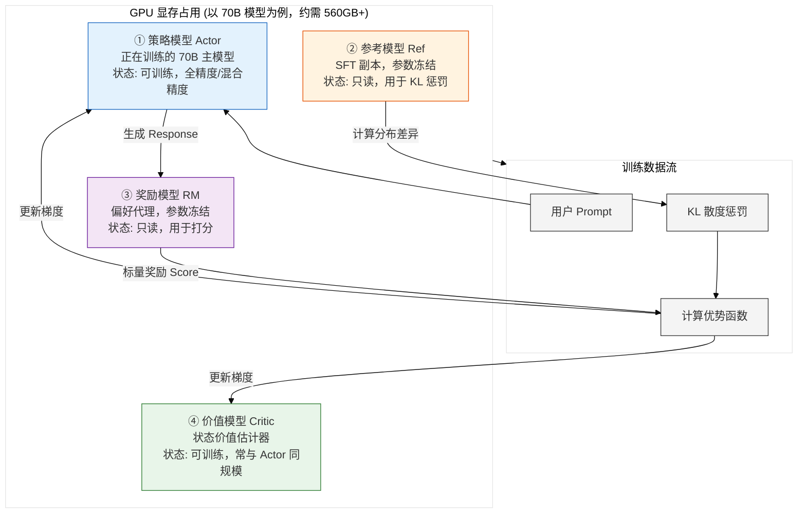
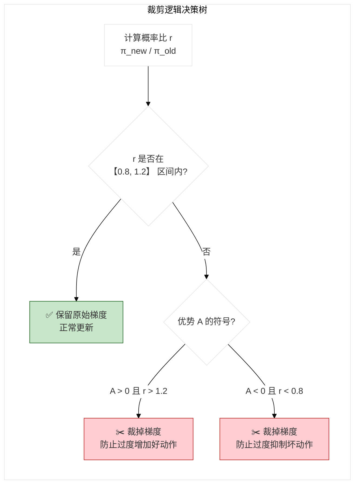
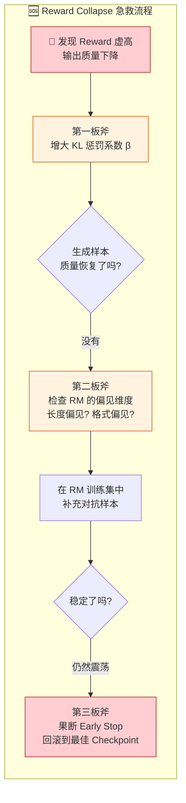
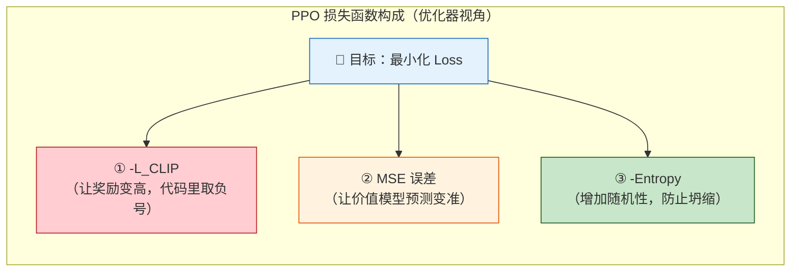

# 大模型强化学习后训练（RL Post-Training）面试高频题——PPO 深度解析

## 引言

> **大模型进入下半场，RL 成了分水岭。你可以在 SFT 上追赶，但 RL 这道坎，迈不过去就永远在第二梯队。**

去年面了 30+ 候选人，发现一个让我很意外的现象：**超过 60% 的人对 RLHF 的理解止步于「PPO 是强化学习算法」这个层面**。一问到奖励模型怎么训练、KL 散度为什么能防止模型崩塌、Ref Model 和 Policy Model 在计算图里到底怎么连——多数人就开始支支吾吾。

但现实是，2024 年以来，大厂招人已经不再满足于「用过 LLaMA-Factory 跑过 SFT」的水平了。RL Post-Training 正在成为面试的 **分水岭题区域**——答得好，说明你真的懂模型行为怎么塑造；答不好，面试官心里基本就有数了。

这篇文章，我把 RL 后训练最核心的 **30 个问题**一次性讲透，外加 **PPO 公式完整手撕推导**。不是那种背了就能过的面经，而是让你真正理解「为什么」——理解了，遇到追问也不怕。

> **如果这篇文章对你有帮助，欢迎收藏 + 转发，让更多正在备战大模型算法岗的朋友看到。**

## 模块二：PPO 深度解析（16-30 题）

> **如果说 RLHF 是算法岗的「龙门」，那 PPO 就是龙门上最窄的那道缝——跳过去，后面是海阔天空；卡在这儿，前面所有努力都白费。**

面试到大模型岗的中后期，RL 这一关是必问的。而 PPO，作为 RLHF 的事实标准算法，基本是 **“逢面必考”** 的硬骨头。很多同学背了 PPO 的全称和公式，但一问到「为什么是 4 个模型」「优势函数怎么算」「Reward Collapse 怎么救」就瞬间卡壳。

真正的面试官从不满足于你背出 $L^{CLIP}$ 公式，他们想看的是：**你在工程上有没有踩过坑？你理不理解大模型 RL 和游戏 RL 的本质区别？**

### 题 16：PPO 的全称是什么？它的核心思想是什么？

**考察点**：对 PPO 算法的基本理解

**难度**：⭐

**核心回答**：

PPO 全称 **Proximal Policy Optimization（近端策略优化）**。它的核心思想只有一句话：**在保证策略更新“不翻车”的前提下，迈出当前能迈的最大一步。**

在 RL 里，策略更新是个走钢丝的活儿。步子太小（像普通策略梯度），数据利用率低，训练慢得要命；步子太大（像某些 naive 实现），模型参数一哆嗦直接崩塌，输出乱码。PPO 的“近端”二字，精髓就在于它用了一个极其轻量的 **裁剪（Clipping）机制**，硬生生地把新旧策略的概率比锁死在 `[1-ε, 1+ε]` 这个安全区间里。

> **面试官内心 OS**：能答出“防止步子太大扯着蛋”这个感觉，比死背公式强十倍。

### 题 17：PPO 相比 TRPO 有什么优势？为什么大家都选 PPO 而不选 TRPO？

**考察点**：对 RL 算法演进脉络的了解

**难度**：⭐⭐

**核心回答**：

TRPO（Trust Region Policy Optimization）是 PPO 的前辈，它俩的“爹”是同一个思想——**置信域（Trust Region）**。但 TRPO 实现约束的方式太“学院派”了：它要把 KL 散度当作硬约束，每次更新前需要计算 Fisher 信息矩阵（二阶导数近似），这在参数动辄几十亿的大模型面前，**计算开销是灾难性的**。

PPO 的伟大之处在于 **“用一个一阶的裁剪操作，近似了一个二阶的硬约束”**。

| 维度 | TRPO | PPO |
|---|---|---|
| **约束方式** | 硬约束（KL ≤ δ） | 软约束（裁剪目标函数） |
| **计算复杂度** | 需要 Fisher 矩阵 + Conjugate Gradient | 仅需一阶梯度下降 |
| **代码实现** | 复杂，容易出 bug | 极简，几行代码搞定 |
| **大模型适配性** | 几乎无法扩展到 7B+ 模型 | 完美适配，显存可控 |

面试官如果追问“那 PPO 一定比 TRPO 效果好么？”——答：不一定，理论上 TRPO 的约束更严谨，但 PPO 用极低的工程代价换取了接近的效果，在大模型场景下，**工程可行性 > 理论严谨性**。

### 题 18：PPO 在 RLHF 中为什么需要同时加载 4 个模型？这 4 个模型分别干嘛的？

**考察点**：对 PPO 训练资源消耗和架构的深度理解

**难度**：⭐⭐⭐

> **这是 RLHF 工程面最经典的“一针见血”题，答不好直接暴露没实操过。**

**核心回答**：

在 RLHF 的标准 PPO 实现中（以 DeepSpeed-Chat 或 TRLX 为例），显存里同时常驻着 4 个“庞然大物”：

**各司其职详解**：

1.  **策略模型（Actor）**：正在被千锤百炼的“主将”。每个 batch 都会更新参数，是显存消耗和计算的大头。
2.  **参考模型（Ref）**：Actor 的“初心”锚点。它永远停留在 SFT 刚结束时的状态，用来计算 KL 散度，**防止模型在追逐高分时彻底忘了怎么做个“正常人”**。
3.  **奖励模型（RM）**：手握“生杀大权”的裁判。它只负责给 Actor 生成的回答打分，参数绝对冻结，不参与 RL 训练。
4.  **价值模型（Critic）**：策略模型的“军师”。它不负责生成文本，而是负责预估“当前状态到底值多少分”，辅助计算优势函数，降低方差。

> **追问暴击**：“4 个 70B 模型，FP16 下显存轻松突破 560GB，单机装不下怎么办？”
> **高情商回答**：必须上 **ZeRO-3（参数分片）** + **模型并行/流水线并行**，同时配合 **CPU Offload（将 Ref 和 RM 的部分参数临时卸载到 CPU 内存）**。实际工程中，往往用 8×80GB A100 或 H800 集群才能跑顺。

### 题 19：PPO 中的「裁剪机制」具体是怎么工作的？能不能讲一下直觉？

**考察点**：对 PPO 核心算法细节的数学直觉

**难度**：⭐⭐⭐

**核心回答**：

我们先不堆公式，先讲直觉。PPO 的裁剪盯住了一个关键指标：**概率比（Probability Ratio）** $r = \pi_{\text{new}} / \pi_{\text{old}}$。

- 如果某个动作在旧策略下概率是 0.1，新策略下变成了 0.2，那么 $r = 2.0$，说明这个动作的“被选中权重”翻倍了。
- PPO 说：**“翻倍可以，但翻 3 倍、5 倍绝对不行！”**

于是它画了一条“高压线”：$[1-\epsilon, 1+\epsilon]$（$\epsilon$ 通常取 0.2）。如果 $r$ 超出了这个区间，梯度就直接被“咔嚓”裁掉（置 0）。

**具体场景拆解（假设 ε=0.2）**：

| 场景 | 优势 A | 概率比 r | 裁剪后的有效值 | 模型的行为 |
|---|---|---|---|---|
| **好动作，想猛推** | A > 0 | r = 1.5（超了 1.2） | 被裁成 1.2 | 梯度消失，停止增加这个动作的概率。防止“过度自信”。 |
| **坏动作，想猛踩** | A < 0 | r = 0.5（低于 0.8） | 被裁成 0.8 | 梯度消失，停止减少这个动作的概率。防止模型“因噎废食”，直接把这个动作概率打成 0。 |
| **安全动作** | A > 0 或 < 0 | r 在 [0.8, 1.2] 内 | 保持原值 | 正常梯度更新，大步向前。 |

> **一句话总结**：裁剪机制是 PPO 的 **“安全气囊”** ——它不关心你为什么飙车（探索），但只要你快撞墙了（比例严重失调），它就立刻弹出来保护你。

### 题 20：PPO 训练中如何计算优势函数？为什么不用简单的奖励？

**考察点**：对 GAE（广义优势估计）的理解

**难度**：⭐⭐

**核心回答**：

如果直接把奖励模型的分数拿来更新 Token，相当于把整场比赛的胜负归功于某一个球员的一次传球——**极其不合理**。这就是 RL 里的**信用分配（Credit Assignment）**问题。

所以我们要引入 **优势函数（Advantage）**：$A = Q(s,a) - V(s)$。它回答的是：“在当前这个局面下，你选的这个 Token，**比你的平均水平好多少？**”

在 RLHF 中，我们用 **GAE（Generalized Advantage Estimation）** 来计算。GAE 通过一个参数 $\lambda$（通常取 0.95~0.99），巧妙地平衡了 **偏差（Bias）** 和 **方差（Variance）**：

- $\lambda$ 趋近于 0：只看当前步的 TD 误差（1-step TD），**方差小但偏差大**。因为后续所有奖励全靠 Critic 模型“脑补”（自举），如果 Critic 估计不准，就会引入系统误差（像个近视眼，只看脚下，远处的路全靠猜）。
- $\lambda$ 趋近于 1：看完整条轨迹的回报（Monte Carlo），**偏差小但方差大**。因为每一步的真实奖励都被累加进来，引入了大量随机噪声（像走迷宫时亲眼见证了全程，但路上各种偶然波动都被记入账本）。

**工程实操**：我们只把 Reward Model 给出的最终分数放在序列的**最后一个有效 Token** 上，然后利用 GAE 的时序差分（TD）公式，把这个分数**反向传播、回传**到前面的每一个 Token 上。

### 题 21：RLHF 中为什么说 PPO 的超参数很敏感？你最关注哪几个？

**考察点**：对 PPO 工程落地痛点的真实认知

**难度**：⭐⭐⭐

**核心回答**：

因为 **RM（奖励模型）是静态的，而 Actor（策略模型）是动态的、非平稳的。** 你用静态的裁判去评判一个越跑越偏的运动员，**超参数一抖，模型就崩**。

我在调参时，神经最紧绷的是这三个“定时炸弹”：

1.  **KL 惩罚系数（β）**：这是最核心的平衡木。
    - β 太小（如 0.01）：模型放飞自我，Reward Hacking，输出一堆感叹号和毫无根据的“好”。
    - β 太大（如 0.5）：模型被死死按在 SFT 上，RL 训了等于白训，奖励曲线纹丝不动。
2.  **学习率（LR）**：SFT 的 LR 通常是 `1e-5` 到 `5e-5`，但 PPO 的 LR 往往要砍到 `1e-6` 甚至 `5e-7`。因为 RL 的梯度噪声极大，LR 高了模型直接“失忆”。
3.  **裁剪范围（ε）**：0.2 是通用默认值。如果发现训练中奖励剧烈震荡，把 ε 缩小到 0.1 或 0.15 是首选止血方案。

### 题 22：什么是「奖励坍塌（Reward Collapse）」？真遇到了你怎么救？

**考察点**：对 RLHF 训练失败模式的实战处理能力

**难度**：⭐⭐⭐

**核心回答**：

**奖励坍塌（Reward Collapse）** 是 RLHF 最可怕的噩梦——你盯着训练曲线，发现 Reward 蹭蹭往上涨，心里正美呢，打开几个生成样本一看，满屏都是“好的！很好！非常好！太棒了！”的废话文学。**分数在飞升，智商在掉线。**

这背后是经典的 **Goodhart 定律**：当一个指标成为目标，它就不再是好指标。

**我的“急救三板斧”**：

**进阶预防**：工业界早已不满足于单打独斗，而是采用 **RM Ensemble（集成）**——训练 3~5 个 Reward Model，取分数的均值或中位数。你想 hack 一个裁判容易，想同时 hack 五个裁判就难了。

### 题 23：PPO 中的「策略熵」惩罚有什么用？不加会怎样？

**考察点**：对探索与利用（Exploration vs Exploitation）的理解

**难度**：⭐⭐

**核心回答**：

策略熵（Entropy）衡量的就是模型的 **“好奇心”**。

在 RLHF 里，不加熵惩罚的后果非常直接：**模型会坍缩成一个“复读机”**。它一旦发现某个句式（比如“首先，其次，最后”）能稳定获得高分，就会在每个 Prompt 下都套用这个模板，完全不顾用户问的是“怎么写代码”还是“怎么做饭”。

加入熵惩罚（通常是最大化熵），相当于在损失函数里加了一根 **“探索奖金”**——鼓励模型保持输出的多样性。这样模型才不会变成没有感情的刷分机器。

### 题 24：在超大模型（>70B）上做 PPO 训练，最让你头疼的工程挑战是什么？

**考察点**：大规模分布式 RL 的工程素养

**难度**：⭐⭐⭐

**核心回答**：

> 在 70B 模型上跑 PPO，算法逻辑占 20%，**分布式通信和显存搬运占 80%**。

头号天坑是 **显存碎片化和 OOM（显存溢出）**。4 个 70B 模型光是加载进显存就够喝一壶的了。我们现在的解法是 **“分时复用 + 异构存储”**：

1.  **全参分片（ZeRO-3）**：把模型参数、梯度、优化器状态切碎分到 8 张甚至 16 张卡上。
2.  **CPU Offload（卸载）**：参考模型（Ref）和奖励模型（RM）在计算前一刻才从 CPU 内存拉到显存，算完立刻扔掉。
3.  **Activation Checkpointing（重计算）**：牺牲 30% 的计算时间，换取 50% 的显存释放。

二号天坑是 **通信墙（Communication Wall）**。PPO 是“生成（Rollout）”和“训练（Train）”交替进行的。生成时是纯推理，计算密集；训练时是反向传播，通信密集。频繁地在推理和训练模式间切换，导致 **All-Reduce（梯度同步）** 的开销极大。

### 题 25：RLHF 中参考模型（Reference Model）的作用是什么？为什么不用基座模型做参考？

**考察点**：对 KL 散度约束机制的深层理解

**难度**：⭐⭐

**核心回答**：

参考模型是一根 **“防止失忆的保险绳”**。

如果拿基座模型（Base Model）做参考，那 KL 散度惩罚只会强迫模型保持“补全文本”的能力，但这毫无意义。我们要保持的是 **“会聊天、会听指令”** 的能力，而这正是 SFT 阶段赋予模型的。因此，**参考模型必须是 SFT 之后的模型**。

在代码实现上，参考模型和策略模型的结构完全相同，但它的参数 **`requires_grad=False`**（冻结），并且在 RL 训练开始前就被完整地复制了一份。

### 题 26：PPO 训练中，优势函数为正和为负的样本分别怎么处理？

**考察点**：对 PPO 更新策略不对称性的细节把控

**难度**：⭐⭐⭐

**核心回答**：

这是一个很好的细节追问。正负优势的处理在 PPO 里是 **非对称（Asymmetric）** 的。

- **正优势（A > 0）**：说明这个回答比平均好。我们需要 **增加** 生成这类 Token 的概率。裁剪限制在 $1+\epsilon$，意思是“好，但别好得太过分”。
- **负优势（A < 0）**：说明这个回答比平均差。我们需要 **减少** 生成这类 Token 的概率。裁剪限制在 $1-\epsilon$，意思是“差，但别一杆子打死”。

**工程冷知识**：很多工业界实现会给负优势的样本施加 **更弱的 KL 惩罚**，或者对负样本的梯度进行 **梯度裁剪（Gradient Clipping）** 更温和一些。因为过度打压负样本，极易导致模型 **“模式崩塌（Mode Collapse）”**——模型直接摆烂，生成一些模棱两可、不痛不痒的内容来规避风险。

### 题 27：为什么要用 PPO 而不是直接用基础的策略梯度（REINFORCE）？

**考察点**：对 RL 算法演进必要性的理解

**难度**：⭐⭐

**核心回答**：

REINFORCE 是 RL 界的“老古董”，在 RLHF 场景下有两个致命伤：

1.  **方差极大（Noisy as Hell）**：REINFORCE 用一整条轨迹的**总回报**来更新梯度。比如生成一个 2048 Token 的回答，最后得分 0.8，它会把 0.8 的功劳平均归给前面的无关 Token（比如“今天天气真好”）。这导致梯度噪声巨大，模型根本学不到有效信息。
2.  **样本效率为 0**：REINFORCE 是 On-policy 的，参数更新一次，之前采样生成的几万条回答就全废了，必须用新模型重新生成。

PPO 通过 **重要性采样（Importance Sampling）** 解决了样本复用问题，用 **GAE** 解决了方差问题。可以说，PPO 是在 REINFORCE 的骨架上，**装上了 GAE（减方差）和 Clipping（防崩塌）两副盔甲**。

### 题 28：RLHF 中为什么 PPO 比 DPO 贵？具体贵在哪里？

**考察点**：对 PPO 与 DPO 成本构成的量化理解

**难度**：⭐⭐⭐

**核心回答**：

如果 DPO 的成本是 1 倍，那 PPO 的成本大约是 **3~5 倍**。这多出来的钱主要烧在 **“生成（Rollout）”** 上。

**成本拆解表**：

| 成本环节 | PPO | DPO | 备注 |
|---|---|---|---|
| **显存占用** | 4 个 70B 模型（~560GB） | 2 个 70B 模型（~280GB） | PPO 需要额外的 RM 和 Critic |
| **生成采样（Rollout）** | **🔥 极其昂贵** 每轮更新都要用 Actor 生成海量新回答 | **✅ 免费** 直接复用离线偏好数据集 | 生成 100 万条回答的推理成本是巨大的 |
| **梯度更新** | 多轮 PPO Epoch | 单轮 DPO Loss | PPO 训练时间更长 |

**具体的成本占比**：在 PPO 的总训练时长中，**Rollout 生成占 70%~80%**，梯度反向传播反而只占 20%~30%。这也是为什么业界对于数学推理、代码等有客观答案的任务，开始转向 PPO（因为能用规则给 Reward），而对于通用聊天，DPO 凭借低成本占据了一席之地。

### 题 29：PPO 中 Value Network（Critic）的损失函数是什么？

**考察点**：对 Critic 网络训练细节的理解

**难度**：⭐⭐

**核心回答**：

Critic（价值模型）的本质是做**回归拟合**，它的目标是预测“当前状态 s 下，未来能拿到的总折扣回报”。

它的损失函数是标准的 **均方误差（Mean Squared Error, MSE）**：

$$L_{\text{Critic}} = \mathbb{E}_t \left[ \frac{1}{2} \left( V(s_t) - \hat{R}_t \right)^2 \right]$$

简单直白：让 Critic 的预测值 $V(s)$ 拼命去逼近我们通过 GAE 算出来的真实回报 $\hat{R}_t$。**Critic 学得越准，优势函数 $A = Q - V$ 的方差就越小，Actor（主模型）的更新就越丝滑。**

注意，Critic 和 Actor 虽然共享同一个主干网络（Transformer），但它们的 **输出头（Head）是分开的**。在 Backbone 后面，一个头输出词表概率（Actor），另一个头输出一个标量值（Critic）。

### 题 30：PPO 在 RLHF 中如何处理变长的序列（不同长度的回答）？

**考察点**：对序列建模中工程实现的细节理解

**难度**：⭐⭐

**核心回答**：

现实中的 Prompt 回答有长有短，但 GPU 喜欢“强迫症”——它只接受整齐划一的矩阵（Tensor）。

所以我们的做法是：**Padding（填充） + Attention Mask（掩码）**。

1.  设定一个最大长度（比如 2048），短的回答在后面补上特殊的 `[PAD]` Token。
2.  **最关键的一步：Loss Mask**。在计算损失函数和优势函数时，我们必须传入一个 `Mask` 矩阵，**把 `[PAD]` 位置的梯度全部置为 0**，告诉模型：“这些位置是凑数的，千万别学！”
3.  **奖励赋值**：奖励模型给整个序列打出的那个唯一分数，我们只把这个分数挂载在 **最后一个有效 Token（即 EOS Token）** 的位置上。通过 GAE 的时序差分公式，这个分数会自然地向后传递到前面的有效 Token。

## 附录：PPO 核心公式完整手撕推导（面试黑板题专用）

> **面试官：“你刚才讲得不错，来，上黑板，把 PPO 的 Clipping 目标函数写一下，再把 GAE 的递推公式推一遍。”——这一刻，多少英雄好汉折在了“手撕公式”这一步。**

别怕。RL 的公式看起来像天书，但拆开了揉碎了，全是初等数学的加减乘除。下面带你 **把 PPO 的 5 个核心公式“解剖”得明明白白**。面试时你能把下面的推导逻辑讲出来，**比单纯默写公式含金量高 10 倍**。

### 前置约定（符号说明）

| 符号 | 含义 | 通俗解释 |
|---|---|---|
| $s_t$ | 状态 (State) | 当前已生成的 Prompt + 已输出的 Tokens |
| $a_t$ | 行动 (Action) | 这一步要选出的那个 Token |
| $\pi_\theta$ | 策略模型 (Actor) | 正在被训练的大模型，$\theta$ 是它的参数 |
| $\pi_{\text{old}}$ | 旧策略 | PPO 更新前的模型副本，用来限制步子不能迈太大 |
| $A_t$ | 优势函数 (Advantage) | 这一步选的 Token 比“平均水平”好多少（正数就是好） |
| $r_t(\theta)$ | 概率比 (Ratio) | 同一个 Token，在新策略下被选中的概率是旧策略的多少倍 |

### 公式一：KL 散度惩罚奖励（一切的起点）

在 RLHF 中，模型最终优化的奖励**不是** RM 的原始打分，而是**经过“紧箍咒”修正后的分数**。

**数学定义**：
$$R_{\text{final}}(x, y) = R_{RM}(x, y) - \beta \cdot \text{KL}(\pi_\theta \parallel \pi_{\text{ref}})$$

**手撕推导（把 KL 拆开看）**：
$$\text{KL}(\pi_\theta \parallel \pi_{\text{ref}}) = \mathbb{E}_{a \sim \pi_\theta} \left[ \log \frac{\pi_\theta(a|s)}{\pi_{\text{ref}}(a|s)} \right] = \log \frac{\pi_\theta(y|x)}{\pi_{\text{ref}}(y|x)}$$

**为什么是“减号”？** 因为 $\log \frac{\pi_\theta}{\pi_{\text{ref}}}$ 是正的（分布差异越大，值越大）。为了让模型在追求高分时不敢乱跑，必须**减去**这个正数。$\beta$ 就是惩罚的“力度旋钮”：

- $\beta \uparrow$：模型死死抱住 SFT 大腿，不敢探索（效果接近 SFT）。
- $\beta \downarrow$：模型放飞自我，容易把 Reward Model 的漏洞放大，产生乱码或复读机。

### 公式二：概率比（Ratio）—— 衡量“变化幅度”的尺子

这是 PPO 所有操作的核心对象。我们要时刻盯住这个 $r$，看它是不是飘了。

**数学定义**：
$$r_t(\theta) = \frac{\pi_\theta(a_t|s_t)}{\pi_{\text{old}}(a_t|s_t)}$$

**极简大白话**：
假设“你好”这个词，在旧模型（$\pi_{\text{old}}$）眼里有 10% 的概率被选中（0.1），新模型（$\pi_\theta$）训练了一轮后觉得它特别好，把概率提到了 25%（0.25）。
那么 $r = 0.25 / 0.1 = \mathbf{2.5}$。**意思就是：新模型对“你好”这个词的重视程度，一夜之间暴涨了 2.5 倍。**

PPO 说：**“涨 2.5 倍？太多了！必须裁掉你！”**

### 公式三：PPO 裁剪目标函数（Clipping Objective）—— 面试必默写

这是 PPO 论文最核心的公式，面试官让上黑板，90% 是写它。

**数学定义（标准形式）**：
$$L^{\text{CLIP}}(\theta) = \mathbb{E}_t \left[ \min \left( r_t(\theta) A_t, \ \text{clip}(r_t(\theta), 1-\epsilon, 1+\epsilon) \cdot A_t \right) \right]$$

**分段推导（假设 $\epsilon = 0.2$，裁剪区间为 $[0.8, 1.2]$）：**

**情况 1：这是个好动作（$A_t > 0$，比如 +1）**
我们要让这个动作概率越大越好。但 PPO 限制了上限：

- 如果 $r = 1.1$（没超 1.2）：$L = \min(1.1, 1.1) = 1.1$。**正常更新，给梯度。**
- 如果 $r = 1.5$（超了 1.2）：裁剪后 $\text{clip}(r) = 1.2$。此时 $L = \min(1.5, 1.2) = 1.2$。
  **梯度消失！** 因为 $1.5$ 这个值被 $min$ 函数无情地抛弃了（$min$ 取了较小的 $1.2$，而 $1.2$ 是一个常数，导数为 0）。模型心想：“你想把概率推高到 1.5 倍？不行，我只能帮你到 1.2 倍，剩下的你自己看着办。”

**情况 2：这是坏动作（$A_t < 0$，比如 -1）**
我们要打压这个动作。但 PPO 限制了打压的下限：

- 如果 $r = 0.9$（没低于 0.8）：$L = \min(-0.9, -0.9) = -0.9$。**正常打压。**
- 如果 $r = 0.5$（低于 0.8，概率暴跌）：裁剪后 $\text{clip}(r) = 0.8$。此时 $L = \min(-0.5, -0.8)$。
  注意，在负数范围内，**$-0.5$ 大于 $-0.8$**，所以 $min$ 取的是 **$-0.8$**。
  **梯度又消失了！** 模型想把概率打到 0.5 倍？不行！底线是 0.8 倍，再低就不让你学了（防止因噎废食）。

### 公式四：GAE（广义优势估计）—— 解决“功劳归谁”的问题

为什么奖励模型只给了句子末尾一个总分，模型却能知道**前面每一个 Token** 该不该表扬？

**靠的就是 GAE 的“反向传播”递推公式**：

先计算单步的时序差分误差 $\delta_t$：
$$\delta_t = r_t + \gamma V(s_{t+1}) - V(s_t)$$

**字母翻译成人话**：

- $r_t$：你在这一步拿到的即时奖励（RLHF 中只有最后一步有分，中间全是 0）。
- $V(s_{t+1})$：Critic（价值模型）预测的“下一步的状态值多少钱”。
- $V(s_t)$：Critic 预测的“当前这一步状态值多少钱”。

如果 $\delta_t$ 是正数，说明 **“当前这一步的状态价值，比预期要好”**。

**最终 GAE 计算公式（累加）**：
$$\hat{A}_t^{GAE} = \sum_{l=0}^{\infty} (\gamma \lambda)^l \delta_{t+l}$$

**展开成递推形式（面试常考手推）**：
$$\hat{A}_t = \delta_t + \gamma\lambda \cdot \delta_{t+1} + (\gamma\lambda)^2 \cdot \delta_{t+2} + (\gamma\lambda)^3 \cdot \delta_{t+3} + \dots$$

$$\hat{A}_t = \delta_t + \gamma\lambda \cdot \hat{A}_{t+1}$$

**为什么要这么设计？**

- $\gamma$（折扣因子，如 0.99）：越远的事影响越小。
- $\lambda$（GAE 参数，如 0.95）：**方差和偏差的调节旋钮**。
  - $\lambda = 0$：只看当前步（依赖 Critic 自举），**方差小但偏差大**，等价于短视的 1-step TD。
  - $\lambda = 1$：看完整条轨迹（Monte Carlo），偏差小，但每一步的噪声都加进来了（**方差巨大**）。
  - $\lambda = 0.95$：取中庸之道，这也是 RLHF 的默认黄金值。

### 公式五：PPO 总损失函数（Actor + Critic + Entropy）

面试最后，面试官可能会问：“所以你的整体 Loss 长什么样？”

**数学定义（三位一体）**：
$$L^{PPO}(\theta) = \mathbb{E}_t \left[ \underbrace{-L^{\text{CLIP}}(\theta)}_{\text{① Actor 目标}} + \underbrace{\frac{1}{2} \left( V_\theta(s_t) - \hat{R}_t \right)^2}_{\text{② Critic 目标}} - \underbrace{c \cdot S[\pi_\theta]}_{\text{③ 熵奖励}} \right]$$

**符号推导拆解**：

**① 为什么 Actor 前面有个负号？**
因为神经网络的优化器（如 Adam）只会做 **“梯度下降（最小化 Loss）”**。而我们希望**最大化**奖励（$L^{\text{CLIP}}$ 越大代表奖励越高）。所以必须加负号，把“最大化问题”变成“最小化问题”：$\text{Loss}_{\text{Actor}} = - L^{\text{CLIP}}$。

**② Critic（Value Loss）为什么是 1/2 ？**
只是为了求导方便。因为 $\frac{d}{dx} (\frac{1}{2}x^2) = x$，求导后系数刚好消掉。

**③ 为什么熵是减号？**
$S[\pi_\theta]$ 是熵（越大代表模型越随机，探索性越强）。我们希望熵大一点，所以要**最小化负的熵**（即 $-S$），这样优化器就会拼命把熵往大了拉。

### 面试终极追问：“如果让你手写伪代码实现 PPO 更新，顺序是什么？”

公式背完了，面试官可能还会多问一句工程流，这题答出来直接“加分”，完整流程如下：

1.  **Rollout 采样**：用 Actor 跑一批 Prompt，生成回答，存下每个 Token 的 `log_probs`（概率对数）和状态值 $V(s)$。
2.  **计算 Reward**：用 RM 给整个回答打分，加上 KL 惩罚（公式一），得到最终奖励序列。
3.  **计算 GAE（公式四）**：从最后一个 Token 往前倒推，利用递推公式 $\hat{A}_t = \delta_t + \gamma\lambda \cdot \hat{A}_{t+1}$，算出每一步的优势值 $A_t$，并算出真实回报 $\hat{R}_t$。
4.  **更新 Critic**：最小化 $\text{MSE}(V(s_t) - \hat{R}_t)$（公式五的第二项）。
5.  **更新 Actor**：计算当前新策略的 `new_log_probs`，算出 $r_t$（公式二），代入 $L^{\text{CLIP}}$（公式三）计算损失，反向传播。
6.  **重复步骤 4 和 5**，多走几个 Epoch（通常是 3~5 个），然后再回到步骤 1 重新采样。

# 总结

这 30 个问题 + 全套公式推导是 RL Post-Training 面试的 **“通关地图”**。

| 阶段 | 核心目标 | 关键检验点 |
|---|---|---|
| **基础概念（1-15）** | 检验是否理解“为什么需要 RL” | 能否说清 SFT vs RL 的本质差异、RLHF 的三步流程 |
| **PPO 深度（16-30）** | 检验是否具备工程落地能力 | 能否解释 4 个模型的显存占用、Reward Collapse 的急救方案 |
| **公式手撕（附录）** | 检验数学功底是否扎实 | 能否在白板上流畅推导 Clipping 分段逻辑和 GAE 递推式 |

能把这 30 道题讲透的候选人，基本已经踏进了大厂核心算法岗的“决赛圈”。

PPO 在 RLHF 中的地位，就好比 **Backpropagation（反向传播）在深度学习中的地位**——你可以不去手写它，但如果你不懂它的梯度流动和工程约束，你就永远只是个调包侠，做不了架构师。

**如果这篇文章让你对 RL 后训练有了“通透了”的感觉，不妨点个「在看」或「转发」给正在备战金九银十的兄弟。大模型这碗饭，咱们信息同频，才能一起端稳。** 🔥

---

**下期预告**：模块三——DPO（直接偏好优化）与 Reward Model 的“神仙打架”。为什么 DPO 能绕过 RL 的复杂工程？它真的能完全取代 PPO 吗？我们下回见分晓。