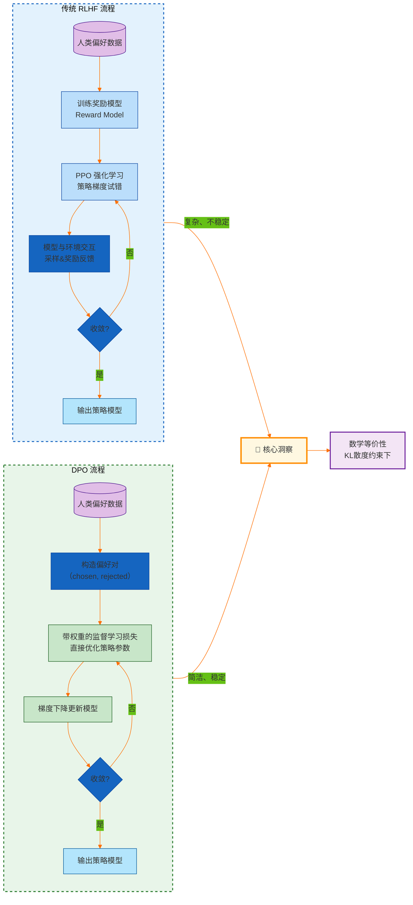
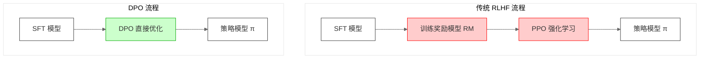
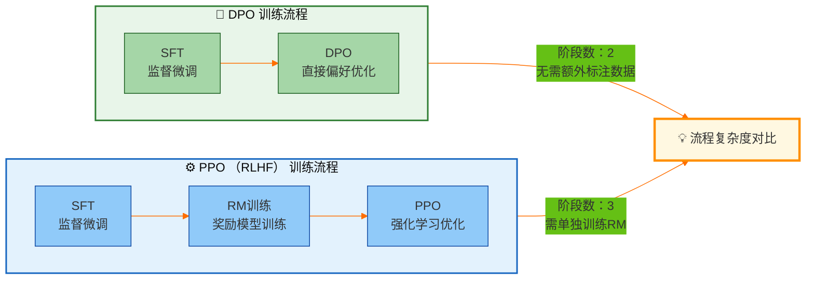
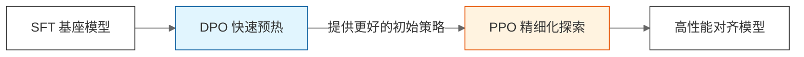

# 大模型强化学习后训练（RL Post-Training）面试高频题——DPO 深度解析

## 引言：你的面试官，可能自己都说不清DPO和RLHF的区别

每次面试，只要聊到**RLHF**和**DPO**，气氛就会变得微妙起来。

面试官问：“你为什么选择DPO而不是PPO？”

然后，不少面试者就开始背书：“DPO更简单，不需要训练奖励模型，RLHF太复杂了……”——停！这种教科书式回答，我只能给个**⭐⭐**。

为什么？因为你只是在复述论文摘要，没有展示出你**真正理解**了这两种方法背后的**博弈**。面试官想听的，是你对**“离线优化 vs 在线探索”**、**“显存瓶颈 vs 理论上限”**的深刻洞察。他要的，是你能像一个高级架构师一样，根据业务场景做技术选型，而不是像一个调包侠一样，只会跑开源代码。

今天，我就带你彻底拆解DPO面试题背后的**底层逻辑**，让你不仅知道“是什么”，更能侃侃而谈“为什么”和“选哪个”。这篇文章会有点干，但看完绝对能让你在面试中降维打击。

---

## 模块三：DPO 深度解析（31-40题）

### 31. 【⭐⭐】DPO 的全称是什么？它的核心思想是什么？

-   **考察点**：对 DPO 算法的基本理解
-   **得分项**：能说出全称、能解释核心思想、能说明其与 RLHF 的本质区别

#### 🎯 标准答案

**DPO** 的全称是 **Direct Preference Optimization**，即**直接偏好优化**。

其核心思想可以用一句话概括：**将「强化学习」问题转化为「监督学习」问题**。

在传统的 RLHF（基于人类反馈的强化学习）中，我们需要先训练一个独立的**奖励模型（Reward Model）**来模仿人类偏好，然后再用**PPO**等强化学习算法，让模型在“游戏”中去最大化这个奖励。这就像你想训练一只狗狗做动作，得先找个裁判（奖励模型）打分，然后让狗狗不断试错（PPO）去讨好裁判。这个过程不仅复杂，而且极其不稳定。

DPO 的革命性在于：它通过数学推导，证明了在满足一定约束（KL散度）的情况下，这个复杂的“裁判+试错”过程可以**直接通过一个带权重的监督学习损失函数来解决**。换句话说，DPO 绕过了奖励模型训练和强化学习采样，直接利用偏好数据去更新模型参数。

> **💡 深度理解**
> DPO 的出现，本质上是因为 RLHF 的 pipeline 太“重”了。它需要加载4个模型（Actor、Reference、Reward、Critic），对显存是巨大的考验。DPO 将问题简化，使得**在消费级显卡（如4090）上微调70B级别的模型成为可能**，极大地推动了LLM对齐技术的民主化。

---

### 32. 【⭐⭐】DPO 是如何绕过奖励模型训练的？

-   **考察点**：对 DPO 数学推导的理解
-   **得分项**：能解释 DPO 的关键数学洞察、能说明「闭式解」的含义

#### 🎯 标准答案

DPO最精妙的地方在于它通过数学推导，把原本需要“强化学习”才能解决的问题，转化成了“监督学习”问题。下面我们从最基础的 RLHF 优化目标出发，一步步推导。

**第一步：RLHF 的优化目标是什么？**

在 RLHF 中，我们希望找到一个最优策略 π，使得它在最大化奖励函数 r 的同时，**不会偏离参考模型（SFT模型）π_ref 太远**。这个约束是通过 **KL 散度** 来衡量的，完整的优化目标可以写成：

$$ \max_{\pi} \mathbb{E}_{y \sim \pi(\cdot|x)} \left[ r(x, y) \right] - \beta \cdot KL(\pi || \pi_{ref}) $$

把 KL 散度展开，我们得到：

$$ \max_{\pi} \mathbb{E}_{y \sim \pi(\cdot|x)} \left[ r(x, y) - \beta \cdot \log \frac{\pi(y|x)}{\pi_{ref}(y|x)} \right] $$

这里的 `β` 就是 KL 惩罚系数，它控制了我们对“偏离参考模型”的容忍度。这个目标函数非常直观：**我们希望模型生成的回答奖励尽可能高，但同时，如果模型为了追求高奖励而离参考模型太远，就会被惩罚。**

> **💡 为什么需要 KL 约束？**
> 如果没有 KL 约束，强化学习会疯狂地“钻空子”，利用奖励模型的漏洞生成一些“奖励很高、但毫无意义”的文本（Reward Hacking）。KL 约束相当于一个“安全带”，确保模型在安全区域内探索。

**第二步：这个优化问题有闭式解**

这是一个带约束的优化问题。我们可以构造拉格朗日函数，对 π 求导并令其为零，从而得到**最优策略的闭式解**：

$$ \pi^*(y|x) = \frac{1}{Z(x)} \pi_{ref}(y|x) \cdot \exp\left(\frac{1}{\beta} r(x,y)\right) $$

其中，$Z(x) = \sum_y \pi_{ref}(y|x) \cdot \exp(r(x,y)/\beta)$ 是一个归一化常数（也叫配分函数）。

这个公式的意思是：**最优模型的输出概率 = 参考模型的概率 × 奖励的指数**。也就是说，如果一个回答的奖励很高，那它在最优模型中的概率就会被放大；如果奖励很低，就会被抑制。

**第三步：把公式反过来——奖励可以被模型表示**

既然最优策略 π* 可以表示为参考策略 π_ref 和奖励 r 的函数，那我们反过来，也可以把奖励 r 表示为最优策略 π* 和参考策略 π_ref 的函数：

$$ r(x,y) = \beta \cdot \log \frac{\pi^*(y|x)}{\pi_{ref}(y|x)} + \beta \cdot \log Z(x) $$

注意，这里的 $Z(x)$ 只与 x 有关，与 y 无关，所以在比较两个回答的相对奖励时可以忽略。

**第四步：代入 Bradley-Terry 偏好模型**

Bradley-Terry 偏好模型告诉我们，人类偏好回答 $y_w$ 而不是 $y_l$ 的概率是：

$$ P(y_w \succ y_l | x) = \sigma \big( r(x, y_w) - r(x, y_l) \big) $$

把上面得到的奖励表达式代入，$Z(x)$ 被抵消了，我们得到：

$$ P(y_w \succ y_l | x) = \sigma \left( \beta \cdot \log \frac{\pi^*(y_w|x)}{\pi_{ref}(y_w|x)} - \beta \cdot \log \frac{\pi^*(y_l|x)}{\pi_{ref}(y_l|x)} \right) $$

**你看到了什么？奖励模型 r 已经完全消失了！** 偏好概率直接由策略模型 π* 和参考模型 π_ref 的**概率比值**决定。

既然偏好概率可以直接用 π 表示，那我们就可以**直接用偏好数据去优化 π**，而完全不需要训练一个独立的奖励模型。这就是 DPO 的完整推导逻辑。

#### 🎯 一句话总结

> RLHF 的优化目标是“最大化奖励 + KL约束”；这个目标有闭式解；闭式解告诉我们“奖励 = 策略比值的对数”；把这个关系代入偏好模型，奖励就被消掉了。于是我们得到了一个**只依赖策略模型和参考模型的损失函数**——这就是 DPO。

### 33. 【⭐⭐】DPO 和 RLHF 的核心差异是什么？

-   **考察点**：对两种方法本质对比的理解
-   **得分项**：能从多个维度对比、能理解各自的适用场景

#### 🎯 标准答案

它们之间的差异是**架构级别**的。为了更直观，我用一张流程图来展示它们 Pipeline 的对比：

**Mermaid 源码：**

> **💡 深度理解**
> 从图中可以清晰地看到，**RLHF 是一条“弯路”**，而 **DPO 是一条“直路”**。这也是为什么 DPO 在工程上如此受欢迎——它极大地降低了分布式训练的复杂度和调试成本。

---

### 34. 【⭐⭐】DPO 的损失函数是什么？

-   **考察点**：对 DPO 实现细节的理解
-   **得分项**：能写出或解释 DPO 的损失函数形式、能说明各项含义

#### 🎯 标准答案

DPO 的损失函数长这样：

$$ L_{DPO}(\pi_\theta; \pi_{ref}) = - \mathbb{E}_{(x, y_w, y_l) \sim D} \left[ \log \sigma\left( \beta \cdot \log\frac{\pi_\theta(y_w|x)}{\pi_{ref}(y_w|x)} - \beta \cdot \log\frac{\pi_\theta(y_l|x)}{\pi_{ref}(y_l|x)} \right) \right] $$

别被这串公式吓倒，我们从里往外拆解：

1.  **核心差值**：`log(π(y_w)/π_ref(y_w)) - log(π(y_l)/π_ref(y_l))`。这衡量的是**“被偏好回答”相对于“参考模型”的胜率，减去“被拒绝回答”相对于“参考模型”的胜率**。
2.  **β 系数**：控制对偏好的敏感度，相当于 RLHF 中的 KL 惩罚系数。
3.  **Log Sigmoid**：将上面的差值转换为一个 0 到 1 之间的概率值，差值越大，概率越接近 1。
4.  **取负号**：我们的目标就是**最大化**这个概率，所以损失函数取负，变成**最小化**。

> **💡 面试官追问：“为什么 DPO 不需要像 RLHF 那样采样？”**
> **回答**：因为 DPO 的损失函数完全基于**离线数据** `D` 计算。它不需要策略模型与环境（或奖励模型）交互去采集新的样本，所有梯度更新都来自于给定的偏好对 `(y_w, y_l)`。这使得 DPO 的训练极其稳定且可复现。

---

### 35. 【⭐⭐】DPO 中的温度参数 β 有什么作用？

-   **考察点**：对 DPO 超参数的理解
-   **得分项**：能解释 β 的作用、能说明不同 β 值的效果

#### 🎯 标准答案

`β` 是 DPO 中最重要的超参数，它直接控制了**模型对偏好数据的“信任程度”**。

从公式中可以看出，`β` 乘以了那个“差值”。这意味着：

-   **β 很小 (e.g., 0.01 - 0.1)**：相当于放大了模型在偏好回答和拒绝回答上的概率差异。模型会**非常激进**地去迎合偏好数据，甚至可能**过拟合**，导致模型严重偏离参考模型，出现“灾难性遗忘”（Catastrophic Forgetting）。
-   **β 很大 (e.g., 0.5 - 1.0)**：相当于缩小了偏好差异的影响。模型会**非常保守**，倾向于让 `π_θ` 尽量接近 `π_ref`，宁可不去学习偏好，也要保证模型的原有能力不丢失。

> **💡 实践建议**
> 在实际调参中，我们通常从一个**中等偏小的 β**（如 0.1）开始尝试。如果发现模型在通用基准（如 MMLU）上掉点严重，则适当**增大 β**；如果发现模型对偏好数据的学习不充分，则适当**减小 β**。这是一个重要的权衡（Trade-off）。

---

### 36. 【⭐⭐】DPO 相比 PPO 有哪些优势和劣势？

-   **考察点**：对两种方法的全面对比能力
-   **得分项**：能从多维度分析优势和劣势、能理解各自的适用场景

#### 🎯 标准答案

这是一道经典的主观题，回答要有结构。我建议用**对比表格**的方式展开，显得你思路清晰。

| 维度 | DPO | PPO (RLHF) |
| :--- | :--- | :--- |
| **训练流程** | **两阶段**：SFT → DPO | **三阶段**：SFT → RM训练 → PPO |
| **资源消耗** | **低**，只需加载 2 个模型 (Actor + Ref) | **极高**，需同时加载 4 个模型 (Actor, Ref, Reward, Critic) |
| **训练稳定性** | **高**，纯监督学习，稳定收敛 | **低**，强化学习，对超参数极度敏感，易崩溃 |
| **数据利用** | **离线**，仅依赖静态偏好数据集 | **在线**，可实时生成新数据探索，理论上限更高 |
| **实现复杂度** | **简单**，只需修改 loss 计算 | **极高**，需要实现GAE、PPO-clip等复杂逻辑 |

> **💡 面试官追问：“那 PPO 还有价值吗？”**
> **回答**：**绝对有。** PPO 的价值在于它的 **“在线探索”** 能力。当偏好数据覆盖不全时，DPO 学到的可能是一个局部最优解。而 PPO 可以通过与奖励模型的实时交互，探索出数据中不存在的、更好的生成路径，从而冲击更高的效果上限。这也是为什么 OpenAI、Anthropic 等顶级 labs 依然坚守 PPO 的原因——**资源充足时，PPO 的上限更高。**

---

### 37. 【⭐⭐】什么场景下 DPO 比 PPO 更合适？什么场景下 PPO 仍有不可替代的价值？

-   **考察点**：对方法适用性的判断能力
-   **得分项**：能给出场景化的建议、能理解选择依据

#### 🎯 标准答案

这考察的是你的**技术选型能力**。

**当以下情况出现时，果断选择 DPO：**

1.  **资源受限**：这是最常见的情况。如果只有 8 张 A100 甚至更少，就别想 PPO 了，DPO 是唯一现实的选择。
2.  **偏好数据质量极高**：如果你的偏好数据来自于高质量的人工标注，且覆盖了你关心的所有场景，DPO 能完美地将这些知识蒸馏到模型中。
3.  **快速迭代验证**：需要快速验证一个新的偏好数据集的 effect，DPO 的快速实验能力是 PPO 无法比拟的。

**而当以下情况出现时，PPO 依然不可替代：**

1.  **追求极致模型表现**：在 AGI 竞赛中，为了榨干模型的最后一点潜力，不计成本地追求最高分，PPO 的探索能力是关键。
2.  **偏好是动态的**：例如，一个复杂的代码生成任务，模型生成的代码是否正确，取决于它是否能通过编译和执行测试。这种奖励信号**无法预先静态标注**，必须在运行时通过工具（如编译器）获取，此时**必须使用 PPO 或 ReAct 框架**。

---

### 38. 【⭐⭐】DPO 对偏好数据的质量要求有多高？数据噪声会影响什么？

-   **考察点**：对 DPO 数据敏感度的理解
-   **得分项**：能说明数据质量的影响、能理解 DPO 如何处理噪声

#### 🎯 标准答案

**DPO 对数据噪声极其敏感，甚至可以用“洁癖”来形容。**

原因在于，**DPO 直接优化模型参数来拟合偏好标签**。在 RLHF 中，如果标注员对某条数据标错了（比如把差回答标成好的），奖励模型可能会把它当作一个“异常点”平滑掉，对最终策略影响有限。但在 DPO 中，**错误的标签会直接转化为梯度，把模型往错误的方向推**。

数据噪声的具体影响：

1.  **错误标签（Label Flip）**：会导致模型学习到完全相反的偏好，严重时会导致模型输出质量崩塌。
2.  **标签不一致**：不同标注员对相同类型回答有分歧，会导致梯度信号相互“打架”，损失函数难以收敛，最终模型学到的是一种“平均”的、模棱两可的偏好。
3.  **偏好强度丢失**：DPO 是“非黑即白”的，它只知道 A > B，但不知道 A 比 B 好多少。这使得模型无法区分“微小差异”和“天壤之别”。

> **💡 工程解法**
> 1.  **数据清洗**：使用多个模型或标注员进行交叉验证，过滤掉一致性低的样本。
> 2.  **数据加权（Weighted DPO）**：给置信度高的样本更高的损失权重，降低噪声样本的影响。
> 3.  **使用迭代 DPO（Iterative DPO）**：通过多轮“生成-标注-训练”来不断提纯数据质量。

---

### 39. 【⭐⭐】DPO 能否与 PPO 结合使用？

-   **考察点**：对方法组合的工程思维
-   **得分项**：能提出组合方案、能说明组合的价值

#### 🎯 标准答案

**当然可以，而且这已经是工业界的标准做法之一。**

它们不是“二选一”的对立关系，而是“优势互补”的协作关系。 下面这图描绘了一种黄金组合策略：

1.  **DPO 预热 + PPO 精调（Warm-up + Fine-tune）**：这是最常见的组合。先用 DPO 对 SFT 模型进行快速、低成本的对齐，把模型的“下限”提上来。然后，再加载奖励模型，用 PPO 进行深度优化，追求“上限”。
2.  **DPO 作为 PPO 的初始化**：直接将 DPO 训练好的模型作为 PPO 的 Actor 初始化。这能有效避免 PPO 在初始阶段因策略随机而产生大量“废 token”，极大加速 PPO 的收敛并节省计算资源。

---

### 40. 【⭐⭐】DPO 和 RLHF 在最终模型质量上有本质差异吗？

-   **考察点**：对方法效果对比的辩证理解
-   **得分项**：能辩证分析两者效果差异、能理解差异来源

#### 🎯 标准答案

**没有本质差异，只有“上限”和“下限”的差异。**

这是一个非常辩证的问题，也是你展现大师级思考的地方。

-   **从“下限”看**：在数据质量相同的情况下，**DPO 的表现通常优于或等于 PPO**。因为 DPO 避开了 PPO 那些令人头疼的超参数和不稳定性，能更稳妥地拟合偏好数据。这就像用自动挡跑赛道，对于普通车手，自动挡可能比手动挡更快。
-   **从“上限”看**：**PPO 拥有更高的理论天花板。** 如果数据覆盖不全，DPO 只能“画地为牢”，在给定的数据里打转。而 PPO 的“在线探索”机制让它能“破圈”，去发现那些数据标注员都没想过的、更好的答案。所以，对于 OpenAI、Google DeepMind 这种追求极限的“专业赛车手”，手动挡（PPO）依然是他们的首选。

---

## 总结

DPO 和 PPO 的争论，本质上是**工程效率**与**模型上限**之间的权衡。

-   如果你是**中小团队**，或者处于**快速实验阶段**，**DPO** 是你的不二之选。它用极低的成本，帮你快速达到一个极高的 baseline。
-   如果你是**大厂核心组**，或者你在冲击 **SOTA（State-of-the-art）** 记录，那么 **PPO** 依然是你武器库中不可或缺的重器。

面试时，请不要再简单地站队“DPO更好”或“PPO更强”。你要做的是向面试官展示：**我懂它们的原理，我清楚它们的优劣，我更能根据具体的业务场景、资源和目标，做出最理性的技术决策。** 这才是资深算法工程师应有的素养。

**送给大家一句话：**
**“用 DPO 守住阵地，用 PPO 冲击高峰。”** 两者结合，才是大模型对齐技术的终极奥义。

最后，如果你觉得这篇文章让你对 DPO 的理解上了一个台阶，不妨**点个赞**、**在看**，或者**分享**给你正在准备面试的朋友。你的支持，是我持续输出深度干货的最大动力！我们下一篇面经见！

