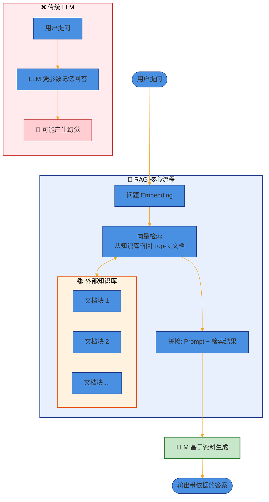
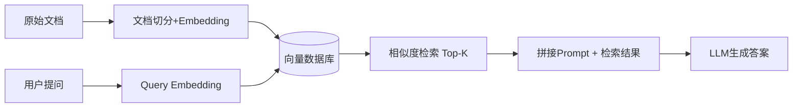
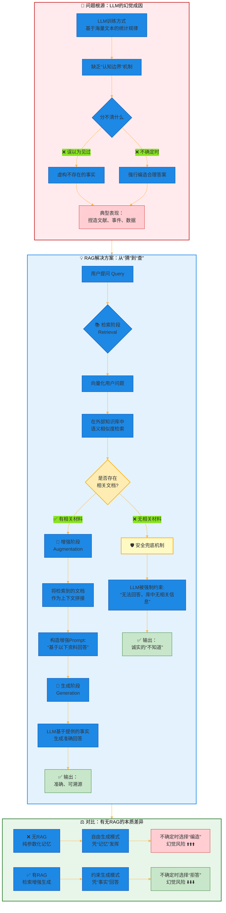
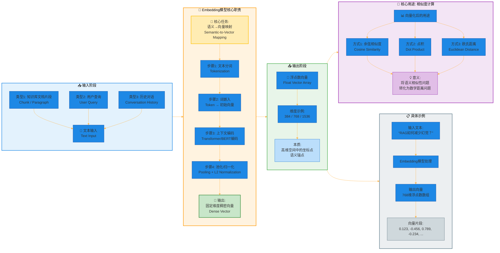
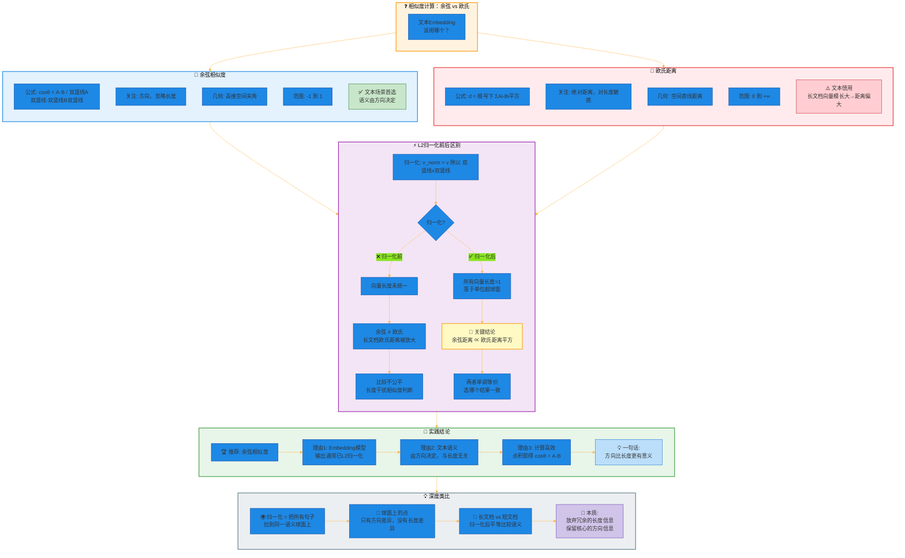
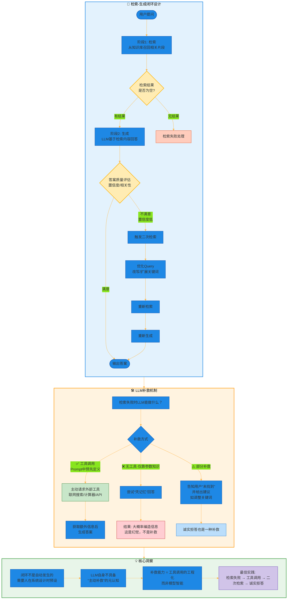
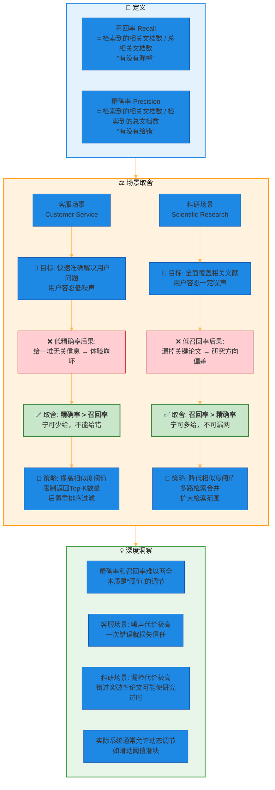
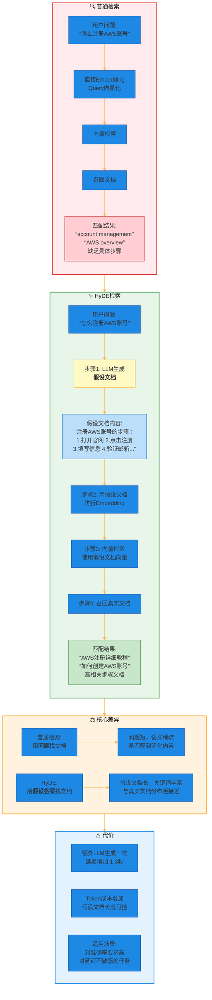
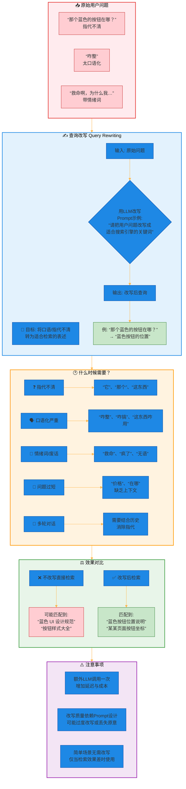
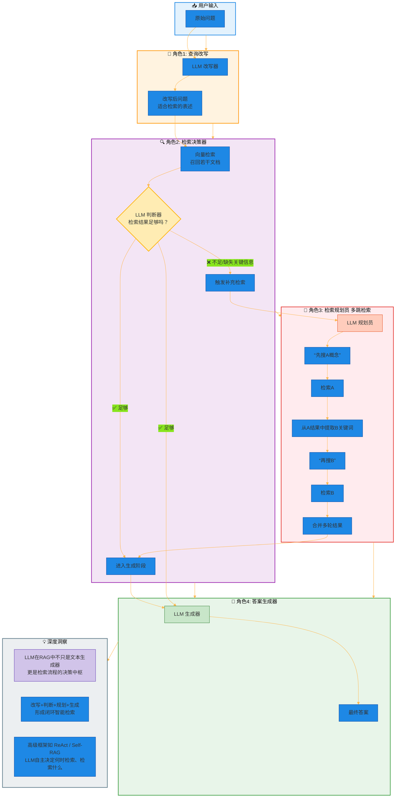

# 大模型面试RAG篇（一）——RAG核心概念与流程

## 引言

> 面试官问你RAG，别只背“检索增强生成”这六个字。  
> 
> 你得让他觉得：这人真干过。

大模型火了两年，RAG成了标配。简历上写着“熟悉RAG”的候选人排着队，但一问细节就卡壳：

- “Embedding模型怎么选？” —— 呃……用OpenAI的那个？  
- “相似度用余弦还是欧氏？” —— 不都一样吗？  
- “检索失败怎么办？” —— 让LLM再生成一次？那不就是幻觉吗。

如果你也有这些模糊地带，这篇文章就是为你准备的。

**基础篇**一共15个高频面试题，每一题都按“一句话答案 + 深度拆解 + 避坑指南”来写。不堆概念，只说人话，附Mermaid流程图——面试时手绘出来就是加分项。

开始之前，记住一条心法：**RAG的本质不是技术堆砌，而是让LLM学会“承认不知道”**。

## 第一部分：基础篇（1-15题）

### 模块一：RAG核心概念与流程

#### 1. 【⭐】RAG全称是什么？一句话说清楚它解决了什么问题。

**RAG = Retrieval-Augmented Generation**（检索增强生成）。

解决的是：**大模型记不住、记不准、编瞎话**的问题。  

说白了，让它“先查资料，再回答问题”，别光凭肚子里那点训练集硬撑。

#### 2. 【⭐】RAG和Fine-tuning的根本区别在哪？各适用什么场景？

| 维度 | RAG | Fine-tuning |
|------|-----|--------------|
| 怎么干 | 动态查外部知识库 | 把知识硬训进模型参数 |
| 知识更新 | 换文档就行，秒级生效 | 得重新训练，费钱费时 |
| 推理成本 | 检索+生成，略高 | 纯生成，低 |
| 适合场景 | 知识经常变、需要可溯源 | 固定风格/任务、私有数据不能外传 |

> 用RAG还是微调？**知识型任务无脑RAG**，风格型任务（比如客服话术、代码格式化）微调更香。

#### 3. 【⭐】RAG的标准Pipeline分几步？

一共4步，别背，要能画出来：

面试官可能会追问：**第一步切分怎么切？** → 分块策略（固定/递归/语义/结构），下一题就讲。

#### 4. 【⭐】为什么RAG能减少幻觉？

大模型瞎编是因为它**不知道边界**——它分不清“自己学过的”和“没见过”的。

RAG强行给它加了个**外挂知识库**。生成之前先问自己：库里有相关材料吗？有，就照着说；没有，就说不知道。

说白了：**把“猜”变成“查”**。

#### 5. 【⭐】Embedding模型在RAG里具体负责什么？输入输出分别是什么？

**负责把文字变成向量**，让计算机能算相似度。

- **输入**：一段文本（比如一个chunk、一句用户问题）
- **输出**：一个浮点数向量，比如 `[0.123, -0.456, 0.789, …]`，维度通常是384、768、1536。

> 选Embedding模型有个坑：**Query和Document最好用同一个模型**，不然“用户问”和“文档里写”的向量空间可能不一致。

#### 6. 【⭐】向量检索和关键词检索（BM25）各自的优缺点？什么时候用哪个？

| 方法 | 优点 | 缺点 | 适用场景 |
|------|------|------|----------|
| 向量检索（语义） | 同义词、近义词也能召回 | 训练数据偏、领域词可能崩 | 口语化提问、内容改述 |
| BM25（关键词） | 精确匹配强、可解释 | 拼写错误、同义词不行 | 专有名词搜索、代码搜索 |

> 别纠结了，**混合检索**（向量+BM25+RRF融合）已经是生产标配。

#### 7. 【⭐】什么是Top-K检索？K=1和K=10各有什么问题？

Top-K就是检索最相似的K个chunk。

- **K=1**：快，但可能漏掉关键上下文。比如问“优缺点”，只看到一个“优点”块就gg了。
- **K=10**：覆盖全，但噪音也进来了。LLM可能被不相关的块带偏。

> 经验值：**K=3~5**。再配合重排序（Re-ranking）把最准的往前放。

#### 8. 【⭐】相似度计算用余弦距离还是欧氏距离？Embedding归一化前后有区别吗？

- 余弦相似度：只看方向，不看长度。**Embedding模型输出通常已经归一化**，这时候余弦≈欧氏（因为 L2 归一化后，余弦距离和欧氏距离单调相关）。
- 欧氏距离：看绝对距离，对向量长度敏感。

> 用谁？ 
> 
> **余弦**更稳，因为文本Embedding的方向比长度更有意义。  
> 
> 归一化前后：不归一化的话，长文档的向量模长大，欧氏距离会偏大。

#### 9. 【⭐】“检索-生成”闭环怎么理解？检索失败LLM能自己补救吗？

闭环不是自动的，是**人可以设计成闭环**——比如先检索，生成答案，发现不靠谱再触发二次检索。

LLM自己能补救吗？**部分能**。如果Prompt里写了“检索结果为空就调用联网搜索”，LLM能主动要求工具调用。但靠它自己凭空补？那是幻觉，不是补救。

#### 10. 【⭐】长上下文LLM（比如Gemini 1.5 Pro 1M token）能取代RAG吗？为什么？

**不能**。理由：

- **成本**：每次请求塞100万token，贵得离谱。
- **延迟**：处理百万token要好几秒。
- **知识更新**：上下文里的信息过时了得重新塞，还不如RAG换文档来得快。
- **可溯源**：RAG能告诉你“答案来自第3页第2段”，长上下文里怎么溯源？

> 长上下文是RAG的**补充**，不是替代。RAG负责精准召回，长上下文负责全量理解。

#### 11. 【⭐】什么是“上下文注入”？Prompt里检索结果放开头还是结尾？

上下文注入就是把检索到的chunk塞进LLM的Prompt里。

**放开头还是结尾？** 做过实验： 

- 放开头（System消息之后）：LLM会先“记住”这些资料，适合需要严格按资料回答的场景。  
- 放结尾（紧挨着用户问题）：LLM会更关注问题，适合多轮对话。

> 我的经验：**放开头 + 加分隔符**，比如 `### 参考资料 ###\n{chunks}\n### 用户问题 ###\n{query}`。

#### 12. 【⭐】RAG的召回率和精确率哪个更重要？在客服场景和科研场景分别怎么取舍？

- **召回率**：真正相关的文档有多少被检索出来。
- **精确率**：检索出来的文档有多少是相关的。

> 场景

- **客服场景**：精确率更重要。用户问你订单号，你给一堆不相关的，体验直接崩。  
- **科研场景**：召回率更重要。宁可多给几篇，不能漏掉关键论文。

> 实际生产中，**先保证召回率≥90%，再用重排序提精确率**。

#### 13. 【⭐】HyDE（Hypothetical Document Embeddings）是什么？举个具体例子说明。

HyDE的做法：**先用LLM对用户问题生成一个“假设文档”**，然后用这个假设文档去向量库里检索。

> 例子：用户问“怎么注册AWS账号”。  
> 
> 普通检索：“register AWS account” → 可能匹配到“account management”这种泛文档。
>   
> HyDE：让LLM先写一篇“假设文档”——《注册AWS账号的步骤：1.打开官网 2.点击注册...》。 
>  
> 这个假设文档里有很多关键词（“注册”、“步骤”、“验证邮箱”），拿去检索反而更准。

**代价**：多了一次LLM生成，延迟和成本增加。

#### 14. 【⭐】什么是“查询改写”（Query Rewriting）？什么时候需要？

查询改写：把用户的口语问题转成更适合检索的表述。

> 例子：用户问“那个蓝色的按钮在哪？”，改写为“蓝色按钮的位置”。

**什么时候需要？**  

- 用户问题里指代不清（“它”、“那个”）  
- 太口语化（“咋整”）  
- 太长、带无关情绪词（“救命啊，为什么我…”）

> 一个简单做法：用LLM自己改写自己，Prompt写“请把用户问题改写成适合搜索引擎的关键词”。

#### 15. 【⭐】RAG里LLM扮演什么角色？只负责生成吗？

不，LLM至少干三件事：

1. **生成最终答案**（这是明面上的）  
2. **改写用户问题**（如果用了查询改写）  
3. **判断检索结果够不够**（高级RAG里，LLM会说“资料不足，我需要再搜一下”）

> 有的框架甚至让LLM决定：先搜A，从A的结果里再搜B，形成**多跳检索**。LLM变成“检索规划员”。

## 结尾

写到这里，基础篇的15个问题已经覆盖了RAG面试中80%的考点。

回顾一下，其实就三条线：

1. **怎么存** —— Embedding、分块、向量数据库  
2. **怎么查** —— 相似度、Top-K、混合检索、HyDE、查询改写  
3. **怎么用** —— 上下文注入、闭环设计、LLM的多角色协作

记住那个心法：**RAG不是让LLM变聪明，而是给它装了个“外挂硬盘”和“查资料的习惯”**。

下一篇我们进入 **进阶篇**：分块策略的坑、Embedding微调实战、Re-ranking的几种玩法、以及Self-RAG怎么让LLM自己决定要不要搜。

如果觉得有帮助，**点个赞/在看**，或者转发给那个正在准备大模型面试的朋友。

评论区留下你想深入的问题——下一篇我专门写。