# 大模型面试RAG篇（二）——分块策略 15 问全解析

> 本文是 RAG 面试系列的第二模块。分块策略直接影响检索命中率、大模型回答质量——所谓“RAG 70%的效果由分块决定”，绝非虚言。下面带你逐一拆解这 15 道高频面试题，附代码、图解和实战坑点。

## ✍️ 引言

> “你的 RAG 系统检索不到正确答案，90% 不是 Embedding 模型不够强，也不是向量数据库选错了——**是分块切得稀烂**。”

这是我带过的第 20 个候选人，在纸上画了半天终于承认：一个 200 字的段落被他一刀切在两块里，关键结论和证据从此天各一方。面试官又问：“chunk_overlap 设 50% 会怎样？” 他愣住，然后沉默。

**分块策略**，在 RAG 面试里就是那道“看起来谁都能说两句，一深挖全露馅”的题。但偏偏，它决定了检索的下限——而你，根本逃不掉。

这一篇，我直接把 **模块二：分块策略（16-30题）** 的 15 道高频题，揉碎了喂给你。代码、流程图、阈值经验、AST 解析、双栏 PDF 坑点……还有面试官最爱追问的“延迟分块到底反转了什么顺序”。

看完这一篇，你不仅能答，还能让面试官点头说 **“嗯，这人是真做过 RAG 的”**。

## 16. 【⭐】为什么说“RAG 70%的效果由分块决定”？不服来辩。

**核心观点**：  
RAG 流程中，**检索是下限，生成是上限**。而检索的“原子单位”就是 chunk。切不好块，顶层设计再牛也救不了——就像厨师用烂食材做菜。

**三个硬理由**：

1. **语义完整性**：chunk 太大 → 引入噪声，污染向量表征；chunk 太小 → 丢失上下文，关键信息被割裂。一个段落里前两句是背景，中间是核心结论，最后是数据支撑——切错了位置，结论和数据就分家。
2. **检索匹配粒度**：Embedding 模型对 128~512 token 的文本表现最佳。短文本容易过泛化（什么都像），长文本容易淹没关键信号。
3. **大模型上下文依赖**：传给 LLM 的 chunk 必须**自包含**。例如问题“第二种方案的时间复杂度是多少？”——如果 chunk 里没带上“第二种方案”的定义，LLM 只能瞎猜。

**反例说服面试官**：  
一个 5000 字的技术文档，按 200 字固定长度切块。某段落在 199 字处被截断，丢失了“综上所述，不建议使用该方法”的结论。用户问“这个方法有什么坑？”，检索到前半段全是正面描述，RAG 回答“该方法表现良好”——完全翻车。

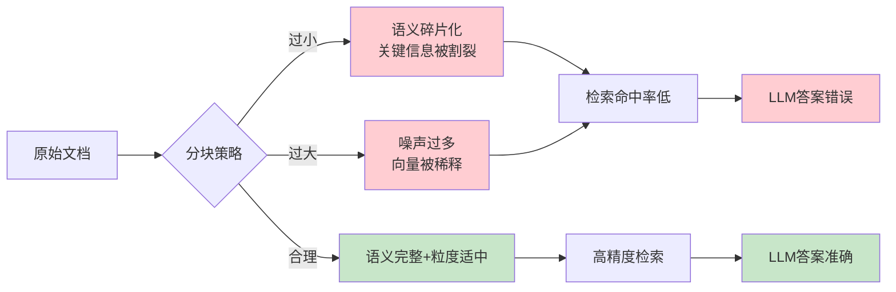

## 17. 【⭐】固定长度分块怎么实现？重叠窗口设多大？给个代码片段。

**实现方式**：按字符数或 token 数切分，通常配合 `chunk_overlap` 让相邻块共享部分内容。重叠能缓解边界信息断裂问题。

**重叠窗口设多大？** 

- 经验值：`overlap = chunk_size * 0.1 ~ 0.25`。  
- 128 token 的块 → overlap 12~32 token；512 token 的块 → overlap 50~128 token。  
- 原则：重叠长度 ≥ 关键句的平均长度（中文约 20~40 字符）。  

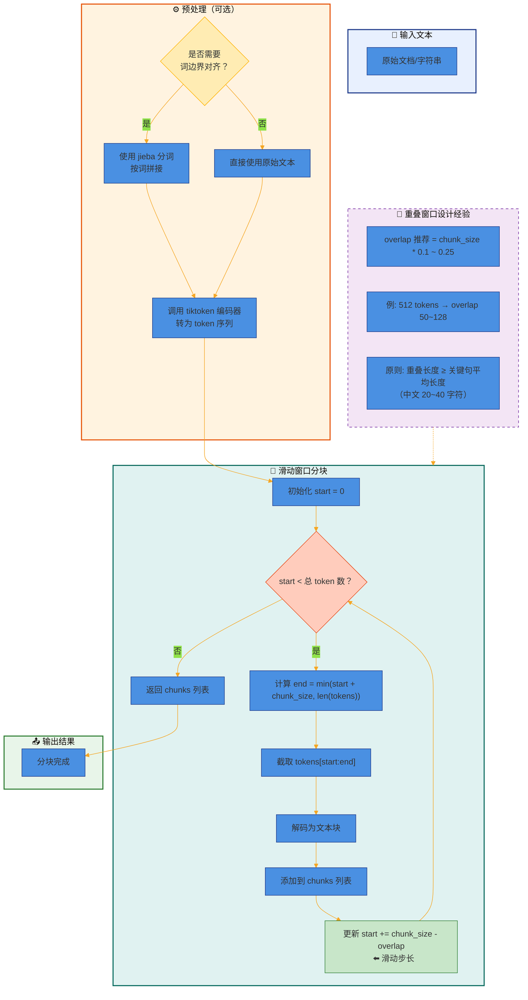

**代码片段（Python + tiktoken）**：

```python
import tiktoken

def fixed_size_chunking(text, chunk_size=500, overlap=100, encoding_name="cl100k_base"):
    enc = tiktoken.get_encoding(encoding_name)
    tokens = enc.encode(text)
    chunks = []
    start = 0
    while start < len(tokens):
        end = min(start + chunk_size, len(tokens))
        chunk_tokens = tokens[start:end]
        chunks.append(enc.decode(chunk_tokens))
        start += chunk_size - overlap  # 滑动起点
    return chunks

# 示例
doc = "..." * 1000
chunks = fixed_size_chunking(doc, chunk_size=512, overlap=64)
print(f"生成 {len(chunks)} 个块")
```

**坑点提醒**：中文按字符切分容易打乱词边界（“机器/学习”变成“机器/学”）。建议先分词，再按 token 数切分，或者直接用 `jieba` 按词边界对齐。

## 18. 【⭐】递归分块的分隔符优先级怎么设计？中文和英文有什么区别？

**设计原则**：从**粗粒度到细粒度**递归尝试分割，优先保持自然语义边界。

优先级：

```s
段落边界（\n\n） > 换行符（\n） > 句子边界（。！？；） > 分句（，、） > 字符
```

**中文与英文的区别**：

| 维度 | 英文 | 中文 |
|------|------|------|
| 句子分隔符 | `. ! ?` 后跟空格 | `。！？；` 无需空格 |
| 段落分隔符 | `\n\n` 或 `\r\n\r\n` | 同样 `\n\n`，但中文段落首行缩进不是可靠标记 |
| 特殊处理 | 缩写（Mr. Dr.）需要避开 | 无此问题 |
| 推荐分隔符优先级 | `\n\n` > `\n` > `. ` > `, ` > 空格 | `\n\n` > `\n` > `。！？；` > `，、` > 字符 |

**实现思路**（伪代码）：

```python
def recursive_split(text, max_size, separators):
    if len(text) <= max_size:
        return [text]
    for sep in separators:
        if sep in text:
            parts = text.split(sep)
            chunks = []
            current = []
            cur_len = 0
            for part in parts:
                if cur_len + len(part) + len(sep) <= max_size:
                    current.append(part)
                    cur_len += len(part) + len(sep)
                else:
                    if current:
                        chunks.append(sep.join(current))
                    current = [part]
                    cur_len = len(part)
            if current:
                chunks.append(sep.join(current))
            # 递归处理超长块
            result = []
            for chunk in chunks:
                if len(chunk) > max_size:
                    result.extend(recursive_split(chunk, max_size, separators[1:]))
                else:
                    result.append(chunk)
            return result
    # 兜底：按字符切分
    return [text[i:i+max_size] for i in range(0, len(text), max_size)]
```

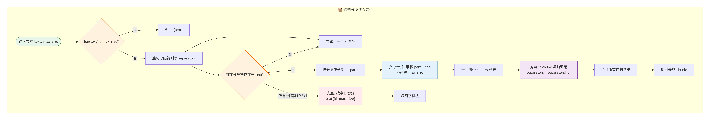

**面试加分点**：  提到 LangChain 的 `RecursiveCharacterTextSplitter` 默认分隔符 `["\n\n", "\n", " ", ""]`，但对中文效果一般。实际生产中可自定义添加 `["。", "！", "？", "；", "，", "、"]`。

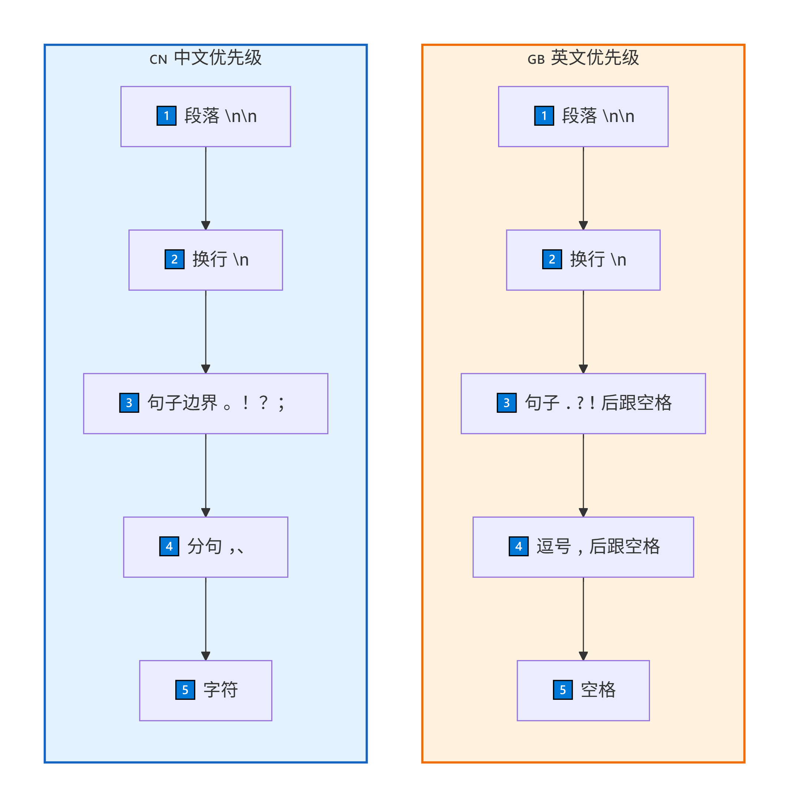

## 19. 【⭐】语义分块怎么判断语义边界？相似度阈值一般设多少？

**核心原理**：利用 Embedding 模型计算相邻句子或窗口的**语义相似度**，相似度曲线发生“骤降”的位置视为语义边界。

**实现步骤**：

1. 将文本分句（用 NLTK、`pkuseg` 或简单正则）。
2. 计算每个句子的向量（或滑动窗口内句子的平均向量）。
3. 计算相邻句子的余弦相似度。
4. 找到相似度低于阈值的点，在此处分块。

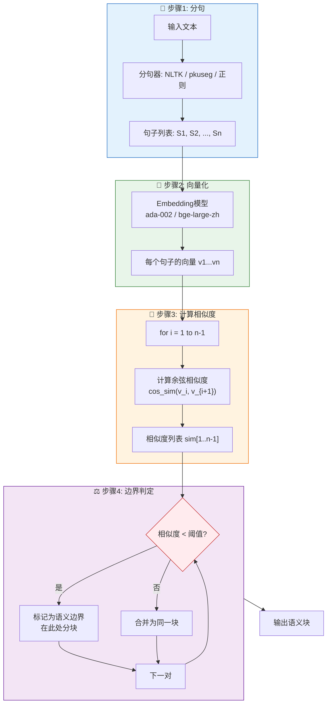

**相似度阈值设置**：

- 通用范围：**0.5 ~ 0.7**，取决于 Embedding 模型和领域。
- 模型 `text-embedding-ada-002`：建议 **0.65** 左右。
- 模型 `bge-large-zh`：建议 **0.55** 左右（因为 BGE 的相似度分布整体偏低）。
- 动态方法：计算相似度序列的**均值减一个标准差**作为阈值。

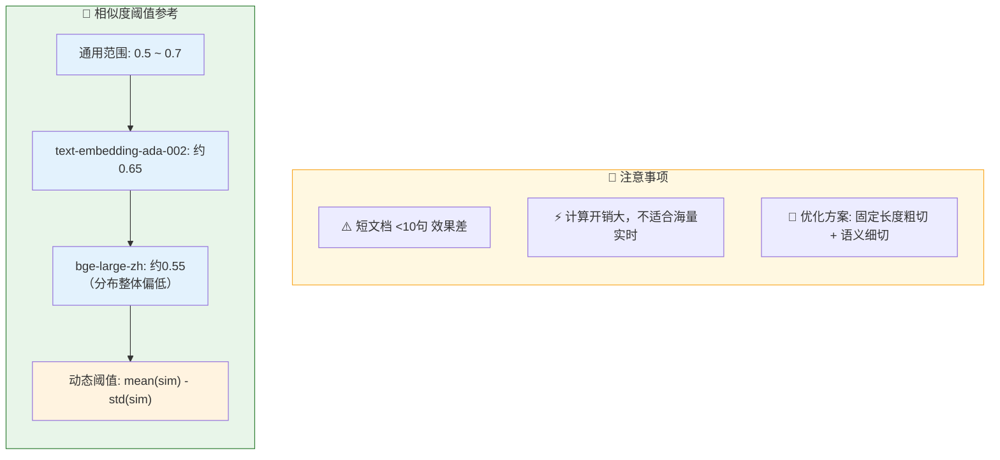

**注意事项**：
- 短文档（< 10 句）效果差，因为统计不显著。
- 计算开销大，不适合海量文档实时分块。
- 可以先用固定长度粗切，再对每个块做语义细切，平衡效率与效果。

## 20. 【⭐】结构化分块（按标题/段落）的解析库有哪些？遇到长章节怎么办？

**常用解析库**：

| 文档类型 | 推荐库 | 特点 |
|----------|--------|------|
| Markdown | `markdown-it-py`、`mistune` | 提取标题层级（H1~H6） |
| HTML | `BeautifulSoup`、`lxml` | 按 `h1/h2/p/div` 切分 |
| Word (.docx) | `python-docx` | 按段落、表格、样式分割 |
| PDF（非扫描） | `pymupdf`、`pdfplumber` | 按页面/段落，保留标题样式 |
| 学术论文（LaTeX） | `latex2text`、正则匹配 `\section` | 按 section/subsection 切 |

**长章节处理策略**：

1. **层级递归**：如果一个章节正文超过 `max_chunk_size`，递归地用子标题继续分割。
2. **标题锚点保留**：每个 chunk 头部携带父标题链（如 `"## 第三章 ## 3.2 实验设置"`），保证自包含。
3. **滑动窗口与结构混合**：对超长章节，按段落自然边界切分后，相邻块保留重叠的引导句。

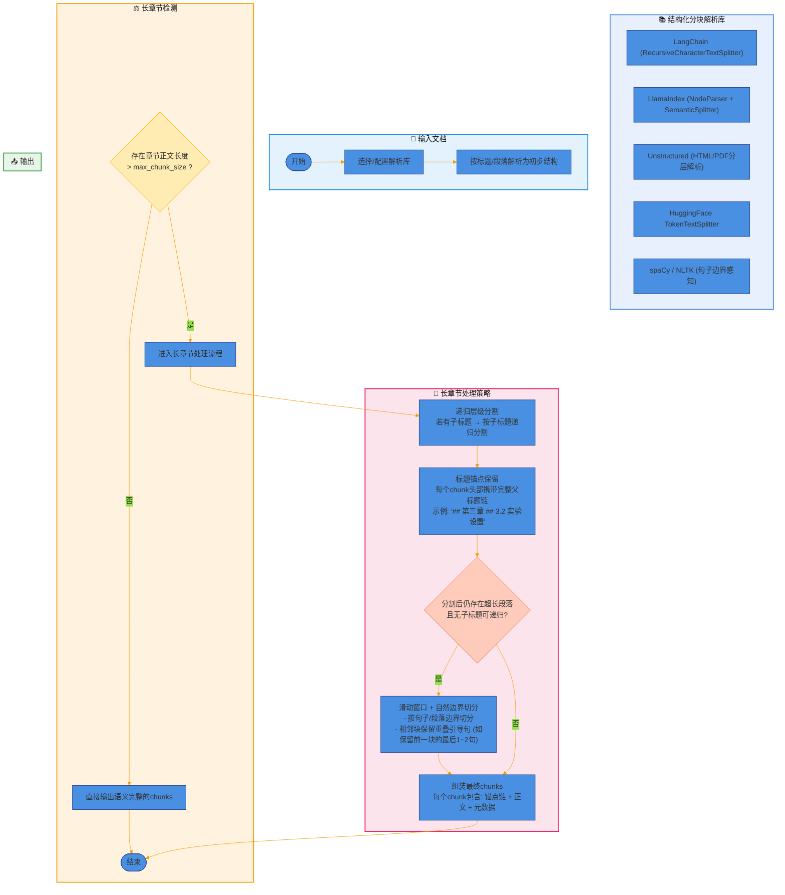

**实战代码（Markdown 分块示例）**：

```python
import re

def split_by_headers(md_text, max_chunk_size=1000):
    lines = md_text.split('\n')
    chunks = []
    current_chunk = []
    current_headers = []  # 记录当前标题栈
    
    for line in lines:
        header_match = re.match(r'(#{1,6})\s+(.*)', line)
        if header_match:
            # 遇到新标题，先保存当前块
            if current_chunk:
                chunks.append('\n'.join(current_chunk))
            # 更新标题栈
            level = len(header_match.group(1))
            title = header_match.group(2)
            current_headers = current_headers[:level-1] + [title]
            current_chunk = [line]
        else:
            current_chunk.append(line)
            # 如果当前块超出大小，需要强制切割
            if len('\n'.join(current_chunk)) > max_chunk_size:
                # 在段落边界切割，并保留当前标题栈
                chunks.append('\n'.join(current_chunk[: -1]))
                current_chunk = current_chunk[-1:]
                # 在切割块前补上标题链
                if current_headers:
                    current_chunk.insert(0, '## ' + ' > '.join(current_headers))
    if current_chunk:
        chunks.append('\n'.join(current_chunk))
    return chunks
```

## 21. 【⭐⭐】延迟分块（查询时分块）反转了什么顺序？存什么、什么时候切？

**核心思想**：  

- 传统流程：**先分块 → 存向量**。 
- 延迟分块：**先存更细粒度的单元（比如句子）→ 查询时动态组合成块**。

**反转顺序**：

- 存储粒度：句子或短语（而不是固定块）。
- 检索时：根据 query 检索相关句子，然后以检索到的句子为中心，**动态拉取前后 N 个句子**组成上下文窗口。

**存什么**：

- 每个句子的 embedding 向量 + 位置信息（文档 ID、段落 ID、句索引）。
- 可选：句子之间的相似度图（用于扩展上下文）。

**什么时候切**：

- 不在索引阶段切，而是在**查询时实时切**。  
- 流程：query → 找到相关句子 → 扩展邻居句子 → 合并成最终块 → 传给 LLM。

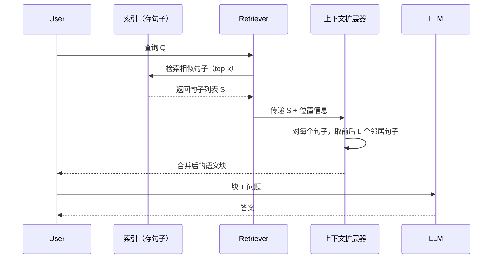

**优缺点**：
- ✅ 避免索引阶段 chunk size 选错导致的永久性信息丢失。
- ✅ 能自适应不同 query 对上下文宽度的需求（有些问题需要更多背景）。
- ❌ 查询延迟增加（需要额外扩展和合并）。
- ❌ 对存储和计算要求更高（需记录细粒度位置关系）。

**典型应用**：  
`Contextual Retrieval`（Anthropic 提出）、`ColBERT` 的后期交互思想。

## 22. 【⭐】chunk size 太小和太大分别会导致什么问题？给个具体例子。

| 问题 | 太小（< 100 token） | 太大（> 1000 token） |
|------|---------------------|----------------------|
| **语义完整性** | 句子被拆散，“虽然…但是…”分成两半 | 多个主题混在一起，向量平均化 |
| **检索精度** | 召回率高但精确率低（单个词匹配） | 精确率可能高，但相关段落被埋没 |
| **LLM 输入** | 上下文不足，缺乏背景 | 超出 LLM 窗口或稀释关键信息 |
| **典型错误** | 问“苹果公司的股价”，chunk 只有“苹果公司”没有“股价” | 问“错误码 404 含义”，chunk 包含整个 HTTP 协议章节，检索得分被其他内容拉低 |

**具体例子**：

- **太小（50 token）**：  
  原文：“RAG 的核心步骤包括：索引、检索、生成。其中索引又分为文档解析、分块、向量化。”  
  切成两块：  
  块1：“RAG 的核心步骤包括：索引、检索、生成。”  
  块2：“其中索引又分为文档解析、分块、向量化。”  
  用户问“RAG 索引阶段有哪些子步骤？” → 块1 不含答案，块2 没有“索引”一词导致检索得分低。

- **太大（1500 token）**：  
  文档包含 A/B/C 三个完全不相关的子话题。用户问“话题 A 的参数是多少？” → 检索时整块与 query 相似度为 0.6（因为包含 B、C 的噪声），而另一个更精确的小块本来可以得到 0.9，但不存在。

## 23. 【⭐】chunk_overlap 太大会有什么副作用？重叠部分会被重复检索吗？

**副作用**：

1. **存储膨胀**：每个块大小 = `chunk_size`，但有效新信息只有 `chunk_size - overlap`。overlap 占 50% 时，存储量翻倍。
2. **检索冗余**：同一个句子出现在相邻两个块中，query 可能同时命中这两个块，造成结果去重负担。
3. **LLM 重复消费**：传给 LLM 的上下文中，大量信息重复，浪费 token，且可能让模型对重复内容过度关注。

**重叠部分会被重复检索吗？**  
**会**。Embedding 模型对不同块内的相同文本生成几乎相同的向量，query 检索时两个块都会进入召回列表。需要在检索后做**去重**或**MMR**（最大边际相关）来减少冗余。

**解决思路**：

- 限制 overlap ≤ 25% chunk_size。
- 检索后对 top-k 结果进行语义去重（例如按 Jaccard 相似度过滤）。
- 使用 `parent-document` 策略：只检索子块，返回父块。

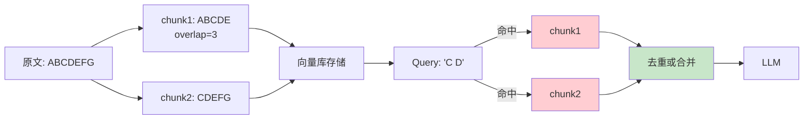

## 24. 【⭐⭐】代码文件怎么分块？按函数、按类还是按语义？AST 有用吗？

**最佳实践**：**按语法结构（AST）分块**，每个块对应一个函数、方法或类。

**分块策略对比**：

| 方法 | 优点 | 缺点 | 适用场景 |
|------|------|------|----------|
| 按行固定长度 | 简单 | 破坏语法结构，注释和代码混在一起 | 临时脚本 |
| 按函数/类 | 保持语义完整，调用关系清晰 | 超大函数仍需进一步切分 | 通用 |
| 按语义（docstring + 代码） | 检索时更容易匹配意图 | 需要解析 AST | 高质量代码库 |
| 按 git commit 块 | 保留变更上下文 | 依赖版本历史 | 代码审查 RAG |

**AST 的作用**：

- 精确识别函数边界、参数列表、内部逻辑块（`if/for/while`）。
- 提取函数签名、文档字符串（docstring）作为块的元数据，增强检索。
- 可以按**依赖图**组织：先检索函数定义，再自动拉取其调用的子函数。

**代码片段（Python + `ast` 模块）**：

```python
import ast

def extract_functions(code):
    tree = ast.parse(code)
    functions = []
    for node in ast.walk(tree):
        if isinstance(node, ast.FunctionDef):
            func_code = ast.get_source_segment(code, node)
            functions.append({
                'name': node.name,
                'docstring': ast.get_docstring(node),
                'code': func_code,
                'lineno': node.lineno
            })
    return functions

# 示例
code = """
def add(a, b):
    '''Return sum of two numbers.'''
    return a + b

def multiply(a, b):
    return a * b
"""
print(extract_functions(code))
```

**进阶技巧**：  

- 对类中的方法按类整体索引，同时保留每个方法的独立块。  
- 为代码块增加**调用链**上下文：检索到函数 A，自动附带它调用的 B、C 的定义（通过静态分析）。

## 25. 【⭐】表格在 RAG 里怎么处理？整表 embedding 还是转成文本描述？

**多种策略，取决于表格大小和查询类型**：

| 策略 | 做法 | 优点 | 缺点 |
|------|------|------|------|
| 整表 embedding | 将表格渲染为 markdown/html 字符串，直接向量化 | 简单，不丢失结构 | 大表会超过 embedding 模型上限（通常 512 token），且检索粒度粗 |
| 转文本描述 | 用 LLM 将表格总结为自然语言段落 | 语义紧凑，易于检索 | 丢失精确数值和行列关系 |
| 行/列独立分块 | 每行（或每列）单独存储，检索时返回多行 | 可精确查询某行数据 | 丢失表格上下文（表头需要重复携带） |
| 混合索引 | 表格整体存一次（用于宽泛问题），同时每行存一次（用于精确查询） | 兼顾召回和精度 | 存储和检索复杂度高 |

**最佳实践（面试回答）**：  

> 对于行数 < 50 的小表，整表 embedding + 转文本描述两者都存，query 时先用描述检索，命中后返回原表。 
>  
> 对于大表，将表格按行拆成多个块，每块包含表头 + 该行数据，同时额外存储一份表格摘要。

**代码示例（按行分块）**：

```python
def table_to_chunks(df, table_name):
    header = " | ".join(df.columns)
    chunks = []
    for idx, row in df.iterrows():
        row_str = " | ".join([str(v) for v in row.values])
        chunk = f"表格: {table_name}\n表头: {header}\n行{idx+1}: {row_str}"
        chunks.append(chunk)
    return chunks
```

## 26. 【⭐⭐】图片里的文字怎么处理？OCR 之后再分块？还是用多模态 embedding？

**两种主流路径**：

1. **OCR 预处理**（传统方案）  
   - 用 `PaddleOCR`、`Tesseract` 提取图片中的文字。  
   - 将提取出的文字按阅读顺序拼接到文档原文中，然后统一分块。  
   - 优点：兼容现有 RAG 流程，成本低。  
   - 缺点：丢失图片布局、图表语义（如箭头、颜色）。

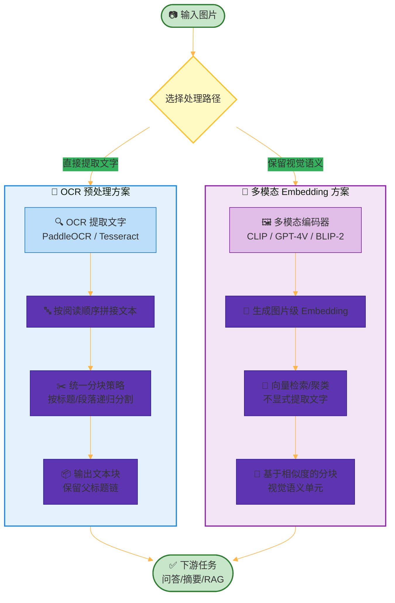

2. **多模态 embedding**（2024+ 趋势）  
   - 直接用多模态模型（如 `CLIP`、`GPT-4V`、`NV-DINOv2`）将图片编码为向量。  
   - 与文本向量放在同一个向量空间。  
   - 查询时，既可输入文本，也可输入图片。  
   - 优点：保留视觉语义，支持图文联合检索。  
   - 缺点：需要多模态模型，推理成本高。

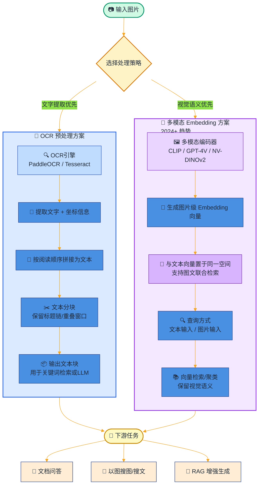

**实际工程选择**：

| 场景 | 推荐方案 |
|------|----------|
| 扫描版 PDF 中的截图 | OCR + 文本分块 |
| 信息图（infographic）、PPT 图表 | 多模态 embedding |
| 手写文字 | OCR（多模态模型对手写效果也一般） |
| 图文混排的网页 | 多模态 embedding 或 同时存两种向量 |

**核心结论（面试考点）**：  
> OCR 是“把图片变成文本”，适用于文字为主的图片；多模态 embedding 是“保持图片本身语义”，适用于布局、颜色、形状等非文本信息至关重要的场景。两者可共存：对同一图片同时生成文本向量和多模态向量，检索时加权融合。

## 27. 【⭐】PDF 文档分块有什么坑？页眉页脚、双列排版怎么处理？

**三大坑点 + 解法**：

| 坑点 | 表现 | 解决方案 |
|------|------|----------|
| **页眉页脚** | 每页顶部/底部重复出现，污染 chunk 语义 | 解析时检测重复模式，过滤页眉页脚（`pdfplumber` 可获取页边距，裁剪掉固定区域） |
| **双列排版** | 正文从左列下半段跳到右列上半段，文本顺序错乱 | 使用 `layout=True` 模式（`pdfplumber` 或 `camelot`），按阅读顺序（从左到右，从上到下）重排文本 |
| **表格跨页** | 同一个表格被切到两页，分块后不完整 | 检测表格特征，跨页合并（`tabula-py` 支持跨页提取） |
| **字体/编码** | 中文字符变成乱码或空格 | 预先用 `pymupdf` 强制 UTF-8，或转成图片后 OCR |

**实战技巧**：  
```python
import pdfplumber

def extract_clean_text(pdf_path):
    full_text = []
    with pdfplumber.open(pdf_path) as pdf:
        for page in pdf.pages:
            # 按布局保留顺序
            text = page.extract_text(layout=True)
            # 简单过滤页眉（假设页码在底部，页眉高度 < 30px）
            if page.height:
                # 实际需结合具体文档
                pass
            full_text.append(text)
    return "\n".join(full_text)
```

**双列重排原理图**：

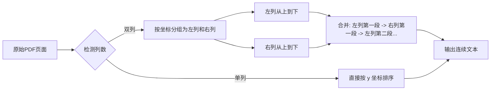

## 28. 【⭐⭐】章节标题和正文的关系怎么保持？每个 chunk 里要带父标题吗？

**强烈建议：每个 chunk 携带完整的标题路径**。  

原因：用户提问“在 3.2 节中提到的算法复杂度是多少？”——如果 chunk 里没有 `"3.2 节"` 的信息，检索就无法命中。

**实现方式**：

1. **标题锚点注入**：解析文档时维护一个栈 `current_headers = ["H1", "H2", ...]`。每遇到新的正文段落，在该段落前拼接 `" > ".join(current_headers)`。
2. **元数据分离**： 向量存储时，将标题路径作为 metadata 字段，检索时根据 query 相关性过滤或 boost 权重。
3. **层级分块**：每个标题下的内容作为一个独立块，块内自然包含标题。如果子标题内容过多，再递归分割，但分割后的子块依然携带该标题。

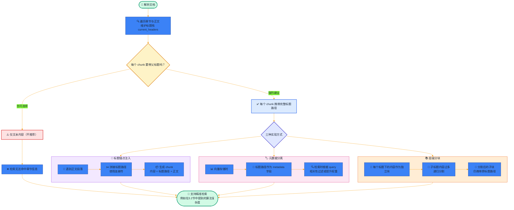

**代码示例（标题注入）**：

```python
def parse_with_headers(markdown_text):
    lines = markdown_text.split('\n')
    stack = []  # 存储 (level, title)
    result_chunks = []
    current_para = []
    
    for line in lines:
        header = re.match(r'(#{1,6})\s+(.*)', line)
        if header:
            if current_para:
                # 保存上一个段落，并注入标题链
                prefix = ' > '.join([t for l, t in stack])
                chunk = prefix + '\n' + '\n'.join(current_para) if prefix else '\n'.join(current_para)
                result_chunks.append(chunk)
                current_para = []
            # 更新标题栈
            level = len(header.group(1))
            title = header.group(2)
            stack = stack[:level-1] + [(level, title)]
            # 标题本身也可以作为一个轻量 chunk
            result_chunks.append(' > '.join([t for l, t in stack]))
        else:
            if line.strip():
                current_para.append(line)
    if current_para:
        prefix = ' > '.join([t for l, t in stack])
        chunk = prefix + '\n' + '\n'.join(current_para) if prefix else '\n'.join(current_para)
        result_chunks.append(chunk)
    return result_chunks
```

**效果对比**：  

- 不带父标题：检索“损失函数如何计算？” → 命中一个 chunk 只包含公式，不知道这个公式属于“第三章 训练细节”还是“附录”。  
- 带父标题：chunk 头部有 `"第三章 > 3.2 损失函数设计"`，用户立马获得上下文。

## 29. 【⭐⭐】滑动窗口分块和固定分块有什么不同？什么时候用滑动窗口？

| 维度 | 固定分块 | 滑动窗口分块 |
|------|----------|--------------|
| **切分方式** | 非重叠切分，边界固定 | 每次滑动 step 个 token，生成大量重叠块 |
| **块数量** | N / chunk_size | N / step，约 chunk_size/step 倍 |
| **覆盖度** | 每个 token 只属于一个块 | 每个 token 属于多个块 |
| **冗余度** | 低 | 高 |
| **检索效果** | 边界可能割裂语义 | 几乎保证任何连续 n 个 token 都被某个块完整包含 |
| **典型应用** | 大多数 RAG 场景 | 需要高召回率的小规模文档；模型输入窗口极小的场景 |

**滑动窗口公式**：  

- `chunk_size = L`，`step = S`（S < L）。  
- 生成块 i：`text[i*S : i*S + L]`。

**什么时候用滑动窗口？**  

- 文档非常珍贵（如法律合同），不能丢失任意连续片段。  
- query 可能是任意长度的连续原文引用（比如“请解释第 3 页中间那段话”）。  
- 配合去重算法（如 MMR），抵消冗余带来的噪声。

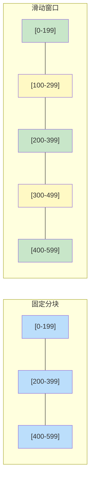

**面试官追问**：“滑动窗口会不会导致 query 命中很多冗余块？”  
答：会。解决方案是检索后做**最大边际相关（MMR）**重排，在相关性和多样性之间取得平衡。

## 30. 【⭐⭐】怎么评估一种分块策略好不好？人工评估还是自动指标？

**评估框架**：**端到端 + 组件级** 结合。

### 自动指标（推荐先做）

| 指标 | 计算方式 | 含义 |
|------|----------|------|
| **Hit Rate@k** | 相关 chunk 是否在 top-k 召回结果中 | 衡量检索覆盖率 |
| **MRR** | 第一个相关 chunk 的排名倒数 | 衡量排序质量 |
| **NDCG@k** | 考虑排序位置和相关性分数 | 排序+相关性综合 |
| **Context Relevancy** | 检索到的 chunk 中，与 ground truth 答案的 token 重叠率 | 防止噪声 |
| **Faithfulness** | LLM 答案是否忠于检索内容 | 最终质量 |

**自动化流程**：

1. 准备一个问答对测试集（文档 D，问题 Q，标准答案 A）。
2. 用不同分块策略跑一遍 RAG，得到 LLM 答案。
3. 用 `RAGAS`、`ARES` 等框架自动打分。

### 人工评估（最终验收）

- **细粒度人工标注**：随机抽取 50 个 query，人工判断召回块是否包含答案（3 档：完全包含、部分包含、不包含）。
- **A/B 对比**：同时展示两种分块策略的 RAG 输出，让专家盲选哪个更好。

### 实践经验

> 我曾在项目中对比过三种策略：固定长度（512, overlap 64）、递归分割、语义分块。自动指标显示语义分块的 Hit Rate@5 最高（0.87），但耗时增加 3 倍。最终线上采用递归分割（0.83 hit rate），因为性价比最优。  
> **关键结论**：没有“最好”的分块，只有“最适合你的数据和查询分布”的分块。一定要用真实 query 做离线评估。

**评估流程图**：

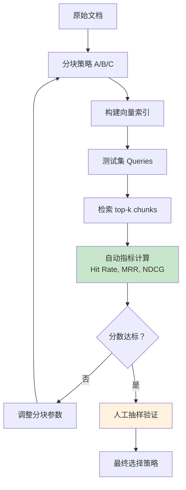

## 🔚 总结

回到最初那个问题：为什么说“RAG 70% 的效果由分块决定”？

因为 **分块是检索的最后一公里**。块太大，噪声淹没了信号；块太小，关键信息被腰斩；块切歪了，标题和正文失联，表格和文字分家，代码里的 docstring 和函数体天各一方——再强的 LLM 也救不回来。

这 15 道题，每一道都对应一个真实的线上事故：

- chunk_overlap 设 50% 导致存储翻倍、检索结果大量重复；
- PDF 双栏排版没做重排，直接按物理坐标切出“上下句颠倒”的垃圾块；
- 代码按固定长度切，把 `def train()` 和它的 `return loss` 分到了两个时代……

**没有银弹，只有验证**。希望你带走的不只是答案，更是一套评估分块的思路：离线跑 Hit Rate，在线看 A/B 实验，永远用真实 query 说话。

如果这篇面经帮你拿到了 offer，或者帮你修好了那个烂了三个月的 RAG 召回——**欢迎转发给你的战友**，也欢迎在评论区留下你的“分块翻车”故事。

下一篇，我们聊 **Embedding 模型选型与微调（31-45题）** ——从 BGE 到混合检索，再到微调时如何避免“灾难性遗忘”。点个 **在看**，更新不迷路。

**#大模型面试 #RAG #分块策略 #AI面经 #LLM**