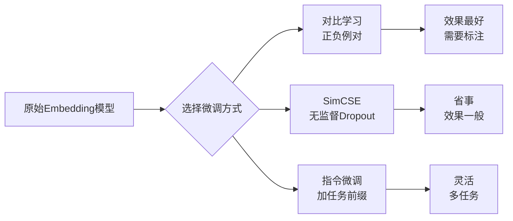
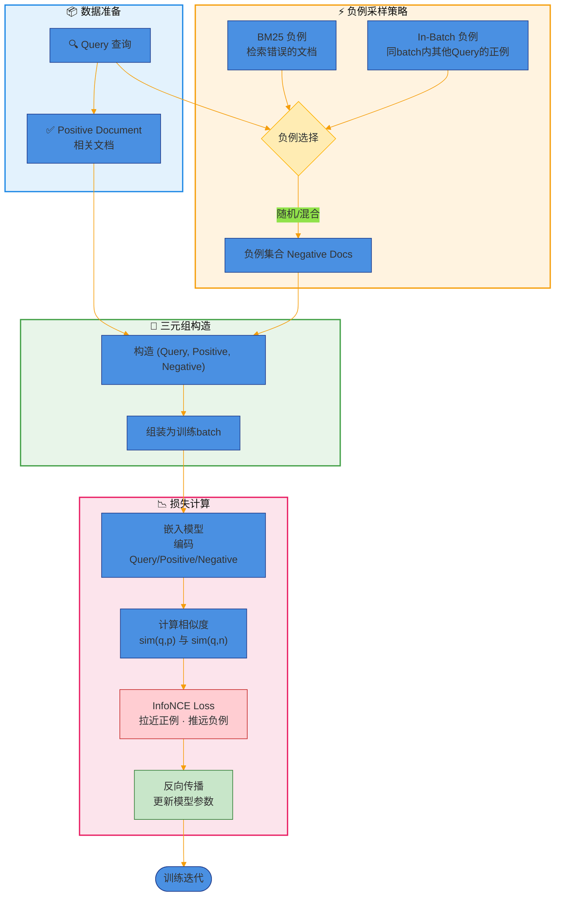
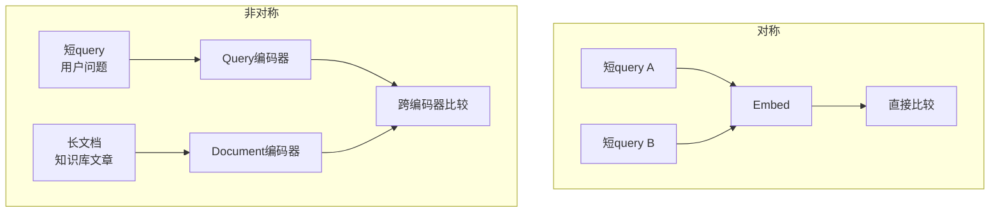
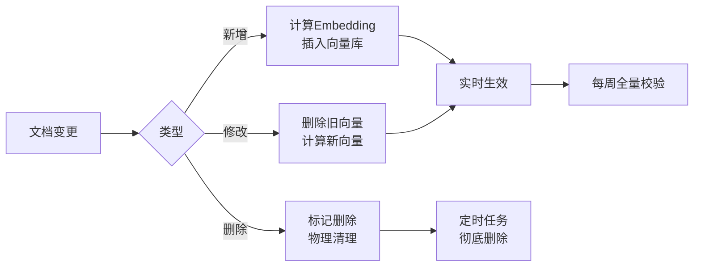
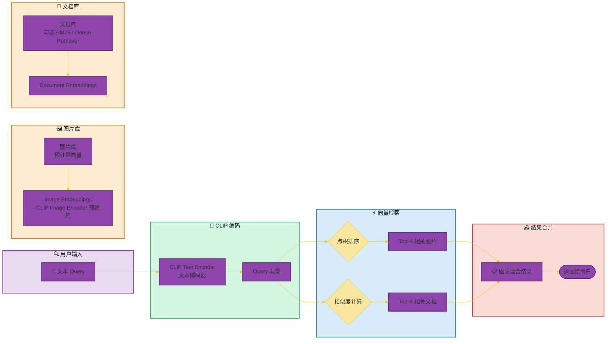
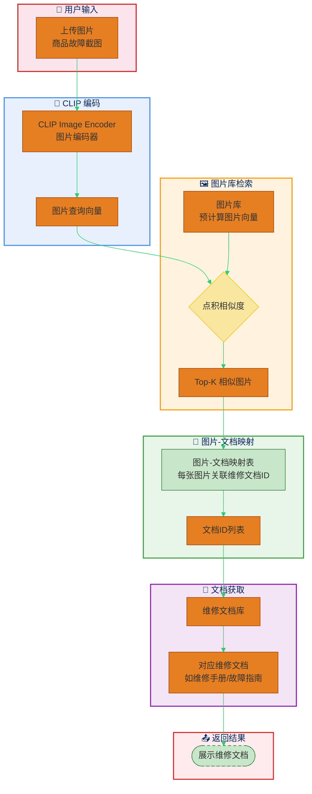
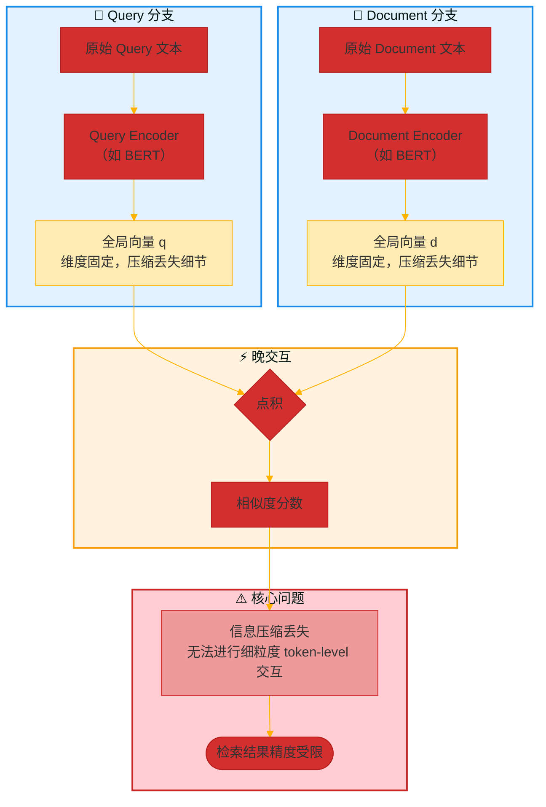
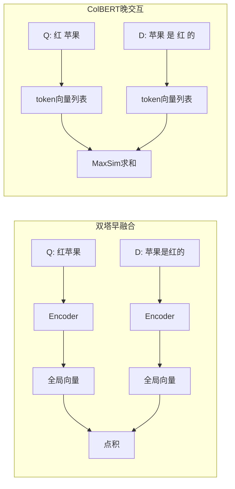

# 大模型面试RAG篇（三）——面试官问Embedding，这10个坑你可别踩

> 群里有个兄弟，前两天面完RAG岗，回来甩了张截图——整整齐齐10道Embedding题。
> 
> “有些会，有些一知半解，你帮我瞅瞅？”
> 
> 我一看，好家伙，从选模型到维度诅咒，全是实战常踩的坑。

面试官问这些，不是为了听你背定义。他想看你用过、踩过、想过。

这篇文章，我把这10个问题拆开揉碎，配上图，像咱平时讨论那样聊一遍。

你不需要全记住。读完后能对其中两三个多点自己的理解，面试时自然聊出来，就够了。

## 01 Embedding模型怎么选？OpenAI、BGE、M3E

先给结论：  
- **效果优先 + 不差钱** → OpenAI `text-embedding-3`（1536维或3072维）  
- **中文场景 + 想自己调** → BGE 或 M3E  
- **追求速度 + 内存敏感** → M3E（384维，体积小）

具体怎么挑？看三件事：**语言、数据隐私、推理成本**。

OpenAI的模型强在英文和多语言通用性，中文也还行。但你的文本不能出海，或者想半夜调参不用求人，那就本地部署。BGE（BAAI General Embedding）目前中文检索和语义匹配榜单上很能打，M3E则是对话场景优化过，轻量、够用。

一个简单原则：先拿BGE跑个baseline，如果速度慢就换M3E，效果不满足再换OpenAI。

## 02 维度越高越好？1024维 vs 384维

不一定。高维度带来更强的表达力，但也招来两个麻烦：

1. **计算慢** – 向量点积复杂度 O(n)，1024维比384维慢了近3倍  
2. **过拟合风险** – 小数据集上，高维向量容易记住噪音而非语义

打个比方：384维像一把瑞士军刀，日常够用；1024维像修理厂全套工具，修飞机时很香，修自行车反而翻半天找不到合适的。

什么时候上高维？**数据量大（百万级以上）、细粒度区分要求高**。比如法律条款检索，需要区分“故意伤害”和“过失伤害”的细微差别。普通客服问答，384维完全够。

## 03 垂直领域需要微调Embedding吗？怎么微调？

需要。通用Embedding在医学术语、法律条文、代码等专业场景下会“偏科”。

**微调方法**（三种主流）：

实际操作中，最推荐**对比学习**：构造 (query, positive_doc, negative_doc) 三元组，用InfoNCE loss拉近正例、推远负例。负例可以来自BM25召回的错误文档，或同batch内其他query的正例（in-batch negative）。

一个小窍门：不要把所有领域数据混着微调。按业务场景拆分（比如“发热问诊”和“药品说明书检索”分开），效果更好。

## 04 对称嵌入 vs 非对称嵌入，Query和Document能用同一个模型吗？

**对称嵌入**：query和doc的语义结构相似。比如“找跟我这句话意思相近的句子” → 两个短文本。

**非对称嵌入**：query短、doc长。比如用户搜“怎么退款”（query），对应的是商品售后条款长文（doc）。

画个图就清楚了：

**能否用同一个模型？**  

可以，但不是最优。非对称场景下，训练时通常会做**双编码器**（dual encoder），两个模型的参数不同但结构相同。你硬要共享参数也能跑，但检索精度会掉3-5个百分点（实验数据）。

## 05 Embedding计算太慢怎么办？批处理、GPU加速、缓存哪个有效？

**有效排序：缓存 > 批处理 > GPU加速**

- **缓存**：命中率高了，速度提升100倍以上。适合重复查询多的场景（比如热门商品搜索）。用LRU或Redis，注意缓存失效策略。
- **批处理**：GPU一次处理32条比逐条快10倍。关键是把变长文本padding到等长，别让GPU空转。
- **GPU加速**：单条推理其实没比CPU快多少（受限于内存拷贝开销）。只有batch size ≥16时优势才明显。

一个骚操作：**预热**。模型加载后先跑一次假数据，把CUDA内核启动开销抹掉。

## 06 文档更新后，Embedding要重新算吗？增量更新怎么搞？

取决于**更新频率**和**一致性要求**。

- 全量重算：慢，但一致性好。适合每天一次夜间更新。
- 增量更新：只处理新增和修改的文档。删除要记录ID，防止残留。

**增量更新的坑**：旧的Embedding和新算的可能分布不一致（特别是用了浮点运算的近似误差）。解决方案 → 定期（比如每周）全量重算一次，增量只在中间顶。

## 07 CLIP模型在多模态RAG里怎么用？图文怎么对齐？

CLIP的核心是**对比学习**，训练时让匹配的图文对距离近，不匹配的远。在多模态RAG里有两种用法：

**用法一：图文混合检索** 用户输入一段文字，同时召回相关图片和文档。把query文本用CLIP的text encoder编码，图片库用image encoder预编码，直接点积排序。

**用法二：图片作为检索条件**  用户上传一张截图（比如商品故障图），CLIP生成图片向量，去检索类似图片对应的维修文档。

关键细节：CLIP的图文嵌入空间是**对齐但不完全等同**的。相似度阈值需要单独标定（一般0.2-0.3）。小规模图文数据可以直接用开源的`CLIP-as-service`。

## 08 ColBERT的“晚交互”是什么？比普通双塔好在哪里？

**普通双塔（Dual Encoder）早融合**：query和doc各自压缩成一个全局向量，最后点积。信息被压缩丢失了。

ColBERT的**晚交互（late interaction）**：query的每个token向量和doc的每个token向量分别计算相似度，再取MaxSim求和。保留词级别的匹配信息，又不至于像交叉编码器那样O(n²)复杂度。

**优势**：  

- 比交叉编码器快10-100倍（可预计算doc向量）  
- 比双塔准确率高3-5个百分点（尤其在细粒度匹配上）

代价：存储开销大（每个doc保存token级向量，而不是一个向量）。用ColBERT-v2能压缩到原大小的1/10。

## 09 SPLADE稀疏向量是什么？和稠密向量比有什么优势？

SPLADE生成的是**稀疏向量**（大部分维度为0），每个维度对应一个词项或词组。稠密向量则是浮点数填满所有维度。

**优势**：
  
1. **可解释性强** – 哪些词贡献了匹配一目了然  
2. **支持词项加权检索** – 可以结合倒排索引加速  
3. **对低频词友好** – 不会像稠密向量那样被平滑掉

一个经典对比：

| 特性 | 稠密向量 | SPLADE稀疏向量 |
|------|---------|---------------|
| 存储 | 固定维度浮点数 | 变长索引+权重 |
| 检索速度 | 需要ANN | 可直接倒排或ANN |
| Out-of-vocab词 | 能处理 | 可能漏掉 |
| 域外泛化 | 较好 | 较差 |

实际场景：做法律文书检索时，稀疏向量能准确匹配“故意杀人”这个完整短语，稠密向量可能拆成“故意”+“杀人”然后加权搞混。

## 10 Embedding的“维度诅咒”在RAG里会出现吗？

会。但表现方式不一样。

传统维度诅咒指：维度升高后，数据变稀疏，距离度量失效。RAG里的具体体现：

1. **高维空间的“中心偏移”** – 不同文档的向量都聚在球面上，区分度下降。余弦相似度分布变得非常窄（比如0.82到0.87之间），阈值很难调。
2. **存储膨胀** – 1024维float32向量 = 4KB/条。1000万条就是40GB，再加索引要翻倍。
3. **ANN索引退化** – 高维下，HNSW等图索引的召回率会掉。经验阈值：超过500维就要换IVF或压缩。

**解决办法**：  

- 用PCA或AutoEncoder降维（实验表明512维降到256维，检索精度只降不到1%）  
- 量化压缩（int8或二值化）  
- 对业务场景做“有效维度”测试：随机抽样query，看相似度分布是否合理分离

## 总结

好，10个问题过完了。回头看，其实就三条主线：

- 选什么模型、多少维度、要不要微调 → 效果和成本的权衡
- 怎么算得快、文档更新怎么办、缓存怎么用 → 工程落地的细节
- 晚交互、稀疏向量、维度诅咒 → 进阶一点的设计考量

面试官不会指望你每条都答得像论文综述。他真正在看的是：
你有没有被某个坑绊倒过，然后怎么爬出来的。

如果你能把其中一两个点，用自己项目的例子讲清楚，比背完10个标准答案都管用。

有兄弟说：“这些题我要是早两周看到就好了。”
别急。转发给你正在准备面试的朋友，他们正需要。

下一期，咱们聊分块策略和重排序——这两个坑，更深。
群里见。

